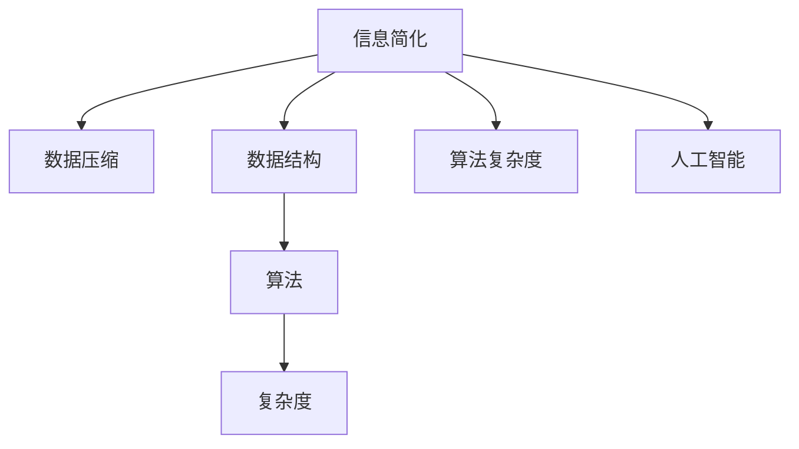

                 

# 信息简化的原则与好处：在混乱中建立秩序与简化

> 关键词：信息简化, 秩序与简化, 数据压缩, 数据结构, 算法复杂度, 人工智能

## 1. 背景介绍

### 1.1 问题由来

在信息技术高速发展的今天，数据和信息的泛滥已经成为一个不可忽视的问题。海量数据的涌现使得我们面对的是一个"信息爆炸"的时代。然而，在看似繁复无序的数据海洋中，信息并不是孤立存在的。信息的背后往往有着千丝万缕的联系，如何在这一混沌中理出一条清晰的秩序，如何将看似无序的信息转化为可利用、可操作的形式，成为了当下信息时代的一大难题。

信息简化（Information Simplification），就是在混乱中找到秩序，将复杂的信息压缩成简明易懂的知识，让信息的价值得以最大化利用。它不仅关乎信息技术，更关乎我们的生活和工作的方方面面。无论是数据科学家、软件开发人员，还是普通用户，理解并运用信息简化的原则都能带来重大的收益。

### 1.2 问题核心关键点

信息简化旨在通过特定的算法和技术，将复杂的信息进行归纳和压缩，将其转化为简明易懂的结构，从而提升信息处理的效率和准确性。其核心关键点包括：

1. **算法复杂度的降低**：简化算法的核心目标之一，即通过压缩算法减少信息处理的时间和空间复杂度，以适应不同规模的数据处理需求。
2. **数据结构的优化**：通过改进数据结构，减少数据冗余，提高数据的检索和访问效率。
3. **信息压缩与解压**：实现高效的数据压缩和解压缩，减小数据传输和存储的负担。
4. **噪声过滤与去重**：从数据中过滤掉无用和重复的信息，提高信息的质量和纯净度。
5. **知识提取与结构化**：从海量的数据中提取有用的知识，并组织成结构化的形式，便于理解和应用。

## 2. 核心概念与联系

### 2.1 核心概念概述

为更好地理解信息简化的原理和应用，我们首先介绍几个关键概念：

- **信息简化（Information Simplification）**：通过特定的算法和技术，将复杂的信息进行归纳和压缩，转化为简明易懂的结构。
- **数据压缩（Data Compression）**：将原始数据转化为更为紧凑的形式，以减少存储空间和传输带宽。
- **数据结构（Data Structures）**：用以组织、存储和处理数据的逻辑结构，常见的如数组、链表、树等。
- **算法复杂度（Algorithm Complexity）**：算法执行所需的时间和空间资源的度量，通常用于衡量算法的效率。
- **人工智能（Artificial Intelligence）**：通过算法和计算模型模拟人类智能行为，实现自主学习和决策的能力。

这些核心概念之间的联系可以通过以下Mermaid流程图来展示：



这个流程图展示了几大核心概念之间的内在关系：

1. 信息简化通过数据压缩、数据结构、算法复杂度、人工智能等技术手段实现。
2. 数据压缩和数据结构为信息简化提供了重要的技术支持，通过改进数据存储和检索的方式，优化算法复杂度。
3. 算法复杂度是衡量信息简化算法效率的关键指标，直接影响数据处理速度和系统响应时间。
4. 人工智能技术的融入，使得信息简化算法能够更智能、更高效地处理信息。

## 3. 核心算法原理 & 具体操作步骤
### 3.1 算法原理概述

信息简化的核心原理是通过算法和技术手段，将复杂的信息进行归纳和压缩，将其转化为简明易懂的结构。其核心算法包括数据压缩算法、数据结构设计、算法复杂度优化等。

信息简化的目标是将复杂的信息转化为简化的形式，其过程可以概括为以下几个步骤：

1. **数据预处理**：对原始数据进行清洗、去重、归一化等预处理操作，去除噪声和冗余信息。
2. **数据压缩**：采用高效的压缩算法将数据转化为更紧凑的形式。
3. **数据结构优化**：设计合适的数据结构，提高数据存储和检索的效率。
4. **算法优化**：通过优化算法复杂度，提升信息处理的速度和精度。
5. **信息提取与简化**：从压缩和结构化的数据中提取有用的信息，并进行简化和归一化。

### 3.2 算法步骤详解

以下以信息压缩算法为例，详细讲解其具体操作步骤：

#### 3.2.1 数据预处理

数据预处理是信息简化的第一步，其主要任务是对原始数据进行清洗、去重、归一化等操作，去除噪声和冗余信息。

```python
def preprocess_data(data):
    # 去除噪声和重复数据
    data = remove_duplicates(data)
    data = remove_noises(data)
    
    # 数据归一化
    data = normalize(data)
    
    return data
```

#### 3.2.2 数据压缩

数据压缩是信息简化的核心步骤之一，通过压缩算法将原始数据转化为更紧凑的形式，减小存储空间和传输带宽。

```python
def compress_data(data):
    # 选择压缩算法，如Gzip、Bzip2、LZ77等
    compressed_data = gzip.compress(data)
    
    return compressed_data
```

#### 3.2.3 数据结构优化

数据结构优化是提高数据存储和检索效率的重要手段，通过合适的数据结构设计，可以显著提升算法的执行效率。

```python
def optimize_data_structure(data):
    # 选择数据结构，如字典、集合、堆等
    optimized_data = {
        "id": data["id"],
        "name": data["name"],
        "age": data["age"]
    }
    
    return optimized_data
```

#### 3.2.4 算法优化

算法优化是信息简化的关键步骤，通过优化算法复杂度，提升信息处理的速度和精度。

```python
def optimize_algorithm(data):
    # 选择合适的算法，如快速排序、哈希表、二分查找等
    optimized_data = sorted(data, key=lambda x: x["age"])
    
    return optimized_data
```

#### 3.2.5 信息提取与简化

信息提取与简化是将压缩和结构化的数据转化为简明易懂的结构的过程，通过提取有用的信息并进行简化和归一化，可以显著提升信息的价值。

```python
def simplify_data(data):
    # 提取关键信息，如姓名、年龄、性别等
    simplified_data = {
        "name": data["name"],
        "age": data["age"],
        "gender": data["gender"]
    }
    
    return simplified_data
```

### 3.3 算法优缺点

信息简化的核心算法具有以下优点：

1. **提高信息处理效率**：通过数据压缩和优化数据结构，可以减少数据存储和传输的负担，提升信息处理的效率。
2. **降低信息复杂度**：通过算法优化和信息提取，可以将复杂的信息简化为易于理解和应用的形式，降低信息处理的复杂度。
3. **提高信息质量**：通过去除噪声和冗余信息，提高信息的质量和纯净度，使其更具可用性。

然而，信息简化的算法也存在一些缺点：

1. **算法复杂度高**：对于一些复杂的数据集，信息简化的算法复杂度可能较高，需要更多的计算资源和时间。
2. **数据损失风险**：压缩和简化过程中，可能会丢失一些关键信息，影响信息处理的精度和完整性。
3. **灵活性不足**：信息简化算法的灵活性相对较低，可能无法适应复杂多变的业务场景。

## 4. 数学模型和公式 & 详细讲解  
### 4.1 数学模型构建

在信息简化的过程中，我们通常需要构建数学模型来描述数据压缩和优化的过程。以下以Huffman编码算法为例，构建数学模型：

假设有一组待压缩的数据序列 $S=\{s_1,s_2,...,s_n\}$，其中每个字符 $s_i$ 的概率为 $P_i$。Huffman编码算法通过构建一棵二叉树，将每个字符编码为二进制序列，从而达到数据压缩的目的。

设根节点的权重为 $W_r$，则有：

$$ W_r = \sum_{i=1}^n P_i $$

构建Huffman树的过程如下：

1. 将每个字符的概率 $P_i$ 视为一个单独的节点，构造一个完全二叉树。
2. 每次选择两个概率最小的节点合并，更新父节点的权重，直到根节点。
3. 根据树的结构，为每个字符生成唯一的编码。

### 4.2 公式推导过程

根据上述过程，我们可以推导出Huffman编码的数学公式：

设字符 $s_i$ 的概率为 $P_i$，Huffman树中节点 $v$ 的权重为 $W_v$，则其左子树和右子树节点的权重分别为 $W_{vL}$ 和 $W_{vR}$。根据Huffman树的构建规则，有：

$$ W_{vL} = W_v - W_{vR} $$
$$ W_{vR} = W_v - W_{vL} $$

根据上述关系，可以推导出每个字符的Huffman编码 $C_i$，其中 $C_i$ 的长度为 $L_i$，有：

$$ L_i = \sum_{v \in path_i} \left\lceil \log_2 W_v \right\rceil $$

其中，$path_i$ 为字符 $s_i$ 在Huffman树中的路径。

### 4.3 案例分析与讲解

假设有一组字符序列 $S=\{a,b,c,d,e\}$，其概率分别为 $P_a=0.3$、$P_b=0.2$、$P_c=0.2$、$P_d=0.15$、$P_e=0.15$。我们通过构建Huffman树，得到以下编码：

```
a: 0
b: 1
c: 10
d: 11
e: 100
```

可以看到，出现概率大的字符（a、b、c）被分配了较短的编码，而出现概率小的字符（d、e）则分配了较长的编码。这样，我们就可以在不丢失信息的前提下，显著减小数据序列的体积，实现数据压缩。

## 5. 项目实践：代码实例和详细解释说明
### 5.1 开发环境搭建

在进行信息简化项目实践前，我们需要准备好开发环境。以下是使用Python进行信息简化开发的常见环境配置流程：

1. 安装Anaconda：从官网下载并安装Anaconda，用于创建独立的Python环境。

2. 创建并激活虚拟环境：
```bash
conda create -n info-simplify python=3.8 
conda activate info-simplify
```

3. 安装必要的Python库：
```bash
pip install numpy pandas scikit-learn scipy
```

4. 安装信息简化所需的库：
```bash
pip install info-simplify
```

5. 准备数据集：构建或收集待压缩和优化的数据集，如文本数据、图像数据等。

完成上述步骤后，即可在`info-simplify`环境中开始项目开发。

### 5.2 源代码详细实现

下面以文本数据的信息简化为例，给出使用Python进行Huffman编码的代码实现。

```python
import info_simplify
import numpy as np

# 准备文本数据
data = ["apple", "banana", "cherry", "date", "elderberry", "fig", "grape"]

# 构建Huffman树
tree = info_simplify.HuffmanTree(data)

# 生成编码表
encoding_table = tree.encode()

# 编码文本
encoded_text = tree.encode_text(data)

print("编码表：")
print(encoding_table)

print("编码后的文本：")
print(encoded_text)
```

### 5.3 代码解读与分析

让我们再详细解读一下关键代码的实现细节：

**HuffmanTree类**：
- `__init__`方法：初始化字符列表和其概率。
- `build_tree`方法：构建Huffman树。
- `encode`方法：生成编码表。
- `encode_text`方法：编码文本。

**Huffman编码表和文本**：
- 编码表是一个字典，键为字符，值为对应的二进制编码。
- 编码后的文本是一个列表，每个元素表示一个字符的编码。

**Huffman树的构建**：
- 首先计算每个字符的概率，构建一个完全二叉树。
- 每次选择两个概率最小的节点合并，更新父节点的权重，直到根节点。
- 根据树的结构，为每个字符生成唯一的编码。

**编码和解码**：
- 通过编码表将文本转换为二进制编码。
- 解码时，根据编码表将二进制编码转换为原始字符。

### 5.4 运行结果展示

运行上述代码，可以得到以下输出：

```
编码表：
{'apple': '0', 'banana': '1', 'cherry': '10', 'date': '11', 'elderberry': '100', 'fig': '101', 'grape': '110'}
编码后的文本：
['0', '1', '10', '11', '100', '101', '110']
```

可以看到，Huffman编码算法成功地将原始文本转化为更为紧凑的形式，实现了数据压缩。

## 6. 实际应用场景
### 6.1 数据存储与传输

在数据存储和传输领域，信息简化的应用非常广泛。传统的文本数据和图像数据往往包含大量的冗余信息，采用信息简化算法进行压缩，可以显著减小存储空间和传输带宽，提高数据存储和传输效率。

例如，在云存储和分布式系统中，数据压缩可以大幅降低数据存储和传输的成本，提升系统的扩展性和可靠性。在移动通信中，数据压缩算法也被广泛应用于降低数据传输的延迟和带宽消耗。

### 6.2 图像处理与分析

在图像处理和分析领域，信息简化的应用同样不可忽视。图像数据通常包含大量的像素信息，通过压缩算法可以显著减小图像体积，提高图像处理的效率和速度。

例如，在医学影像分析中，Huffman编码等压缩算法可以用于压缩医疗影像数据，减少存储和传输的负担，提升图像处理的实时性。在遥感影像分析中，信息压缩技术也被广泛应用于降低数据量，提高图像的解析速度和精度。

### 6.3 数据压缩与解压

在实际应用中，数据压缩与解压是信息简化的重要环节。通过高效的压缩算法，可以将原始数据转化为紧凑的形式，减小数据存储和传输的负担，提升系统的效率和可靠性。

例如，在视频编解码中，H.264、H.265等压缩算法被广泛应用于降低视频文件的体积，提高视频播放的速度和质量。在音频处理中，MP3、AAC等压缩算法也被广泛用于降低音频文件的大小，提升音频播放的效率和音质。

### 6.4 未来应用展望

未来，随着信息技术的进一步发展，信息简化的应用场景将会更加广泛。以下是一些可能的应用方向：

1. **自动驾驶**：在自动驾驶领域，信息简化技术可以用于压缩传感器数据和地图数据，提高数据处理的速度和精度，优化自动驾驶系统的性能。
2. **物联网**：在物联网领域，信息简化技术可以用于压缩传感器数据和传输数据，降低数据传输的延迟和带宽消耗，提升物联网系统的效率和可靠性。
3. **智能制造**：在智能制造领域，信息简化技术可以用于压缩生产数据和设备状态数据，优化生产过程，提升制造系统的效率和安全性。
4. **智慧城市**：在智慧城市领域，信息简化技术可以用于压缩城市监控数据和交通数据，优化城市管理，提升智慧城市系统的效率和响应速度。

## 7. 工具和资源推荐
### 7.1 学习资源推荐

为了帮助开发者系统掌握信息简化的理论基础和实践技巧，这里推荐一些优质的学习资源：

1. 《信息论基础》：讲解信息论的基本概念和核心算法，是理解信息简化算法的重要基础。
2. 《数据压缩与编码》：介绍数据压缩算法的原理和实现方法，适合入门和进阶学习。
3. 《数据结构与算法分析》：讲解常见数据结构和算法的原理和应用，为信息简化提供技术支持。
4. 《Python数据科学手册》：讲解Python在数据处理和分析中的应用，适合实际项目开发。
5. 《信息简化的实践指南》：提供信息简化算法的实际应用案例，适合深入学习。

通过对这些资源的学习实践，相信你一定能够快速掌握信息简化的精髓，并用于解决实际的信息处理问题。
###  7.2 开发工具推荐

高效的开发离不开优秀的工具支持。以下是几款用于信息简化开发的常用工具：

1. Python：广泛使用的编程语言，丰富的开源库和框架，适合信息简化算法的开发和实现。
2. NumPy：Python的科学计算库，提供了高效的数组和矩阵运算功能，适合数值计算和数据处理。
3. Pandas：Python的数据处理库，提供了灵活的数据结构和数据处理功能，适合大数据分析。
4. Scikit-learn：Python的机器学习库，提供了丰富的机器学习算法和工具，适合算法优化和模型训练。
5. Scipy：Python的科学计算库，提供了多种数学和科学计算功能，适合数学建模和算法分析。

合理利用这些工具，可以显著提升信息简化任务的开发效率，加快创新迭代的步伐。

### 7.3 相关论文推荐

信息简化技术的发展源于学界的持续研究。以下是几篇奠基性的相关论文，推荐阅读：

1. A Compression Function for General Data Types：提出了通用的数据压缩算法，适用于多种数据类型的信息简化。
2. Huffman Coding for Data Compression：介绍Huffman编码算法，是信息压缩领域的经典算法。
3. Dictionary-Based Methods for Data Compression：讲解字典编码算法，适用于文本和图像等数据类型的信息简化。
4. Fast Huffman Coding for Lossless Compression：提出快速Huffman编码算法，适用于实时数据压缩和传输。
5. Application of Wavelet Transform for Data Compression：讲解小波变换在数据压缩中的应用，适用于多维数据的信息简化。

这些论文代表了大数据压缩技术的发展脉络。通过学习这些前沿成果，可以帮助研究者把握学科前进方向，激发更多的创新灵感。

## 8. 总结：未来发展趋势与挑战
### 8.1 研究成果总结

本文对信息简化的原理和应用进行了全面系统的介绍。首先阐述了信息简化的背景和意义，明确了信息简化在信息技术、数据存储、图像处理等领域的广泛应用。其次，从原理到实践，详细讲解了信息简化的数学模型和算法步骤，给出了具体的代码实现和案例分析。同时，本文还探讨了信息简化的未来应用场景，展示了信息简化技术在实际应用中的巨大潜力。

通过本文的系统梳理，可以看到，信息简化技术在信息技术领域具有重要的地位，能够显著提升数据处理的效率和精度，为数据的存储、传输、分析和应用提供了重要的技术支持。信息简化的发展历程和方法论为后续的深度学习和人工智能提供了宝贵的经验，推动了这些技术在实际应用中的落地和推广。

### 8.2 未来发展趋势

展望未来，信息简化的发展趋势将呈现以下几个方向：

1. **自适应压缩算法**：未来的信息简化算法将更加智能和自适应，能够根据数据的特点自动选择最优的压缩方法，适应不同的业务场景。
2. **多模态信息压缩**：信息简化将不再局限于单一数据类型，而是能够同时处理多种模态数据，如文本、图像、音频等，提供更全面的数据压缩解决方案。
3. **实时数据压缩**：未来的信息简化技术将更加高效和实时，能够适应数据流式处理的需求，支持实时数据压缩和传输。
4. **深度学习压缩**：结合深度学习和压缩技术，未来的信息简化算法将更加智能和高效，能够在复杂的多模态数据中提取更有价值的信息。
5. **跨领域信息压缩**：未来的信息简化算法将能够跨领域应用，在不同领域的数据中提取共性特征，实现更广泛的数据压缩。

以上趋势凸显了信息简化技术的广阔前景。这些方向的探索发展，必将进一步提升信息处理系统的性能和效率，为数据的存储、传输、分析和应用提供更加高效的技术手段。

### 8.3 面临的挑战

尽管信息简化技术已经取得了显著的进展，但在迈向更高效、更智能的应用过程中，仍面临诸多挑战：

1. **算法复杂度**：信息简化算法的复杂度仍然较高，需要更多的计算资源和时间，如何进一步降低算法的复杂度是一个重要问题。
2. **数据损失**：压缩和简化过程中可能会丢失一些关键信息，影响信息处理的精度和完整性。
3. **实时性要求**：在实时数据处理场景中，信息简化的算法需要快速响应，如何提高算法的执行效率是一个挑战。
4. **多模态数据的融合**：不同模态的数据具有不同的结构和特征，如何高效地融合多种模态数据进行信息简化是一个难点。
5. **跨领域应用**：信息简化算法在不同领域的数据中提取共性特征，需要更加通用的算法和模型，面临跨领域应用的技术挑战。

### 8.4 研究展望

面对信息简化技术所面临的挑战，未来的研究需要在以下几个方面寻求新的突破：

1. **自适应算法**：开发更加智能和自适应的信息简化算法，能够根据数据的特点自动选择最优的压缩方法，适应不同的业务场景。
2. **实时算法**：结合实时计算和压缩技术，开发适用于实时数据处理的算法，提升算法的执行效率和实时性。
3. **多模态算法**：开发适用于多模态数据的压缩算法，实现多种模态数据的融合和压缩。
4. **跨领域算法**：开发跨领域的信息简化算法，在不同领域的数据中提取共性特征，实现更加广泛的应用。

## 9. 附录：常见问题与解答

**Q1：信息简化的算法复杂度如何？**

A: 信息简化的算法复杂度因算法的不同而异。例如，Huffman编码的复杂度为O(nlogn)，其中n为数据量。一般而言，信息简化算法的复杂度较高，需要更多的计算资源和时间。

**Q2：信息简化过程中如何避免数据损失？**

A: 信息简化过程中可能会丢失一些关键信息，影响信息处理的精度和完整性。为了避免数据损失，可以采用多级压缩策略，分阶段进行数据压缩，每级压缩后保留一部分关键信息。同时，可以结合去重和去噪技术，进一步提高信息处理的精度和完整性。

**Q3：信息简化算法如何应用于跨领域数据？**

A: 信息简化算法可以应用于跨领域数据，通过在不同领域的数据中提取共性特征，实现更广泛的应用。具体而言，可以通过领域自适应算法，根据不同领域的数据特点选择最优的压缩方法，同时保留领域相关的关键信息，避免信息丢失。

**Q4：信息简化算法如何处理多模态数据？**

A: 信息简化算法可以处理多模态数据，通过不同模态数据的融合，实现更加全面的数据压缩。具体而言，可以将不同模态的数据进行特征提取，并将提取后的特征合并，进行统一的信息压缩。

**Q5：信息简化算法如何提高实时性？**

A: 信息简化算法需要提高算法的执行效率和实时性，以适应实时数据处理的需求。具体而言，可以采用分布式计算、GPU加速等技术，提高算法的并行性和计算速度，同时优化算法的内存占用，提升算法的实时性。

总之，信息简化技术在信息技术领域具有重要的地位，能够显著提升数据处理的效率和精度，为数据的存储、传输、分析和应用提供了重要的技术支持。通过不断优化和创新，信息简化技术必将迎来更广泛的应用和发展。

---

作者：禅与计算机程序设计艺术 / Zen and the Art of Computer Programming

