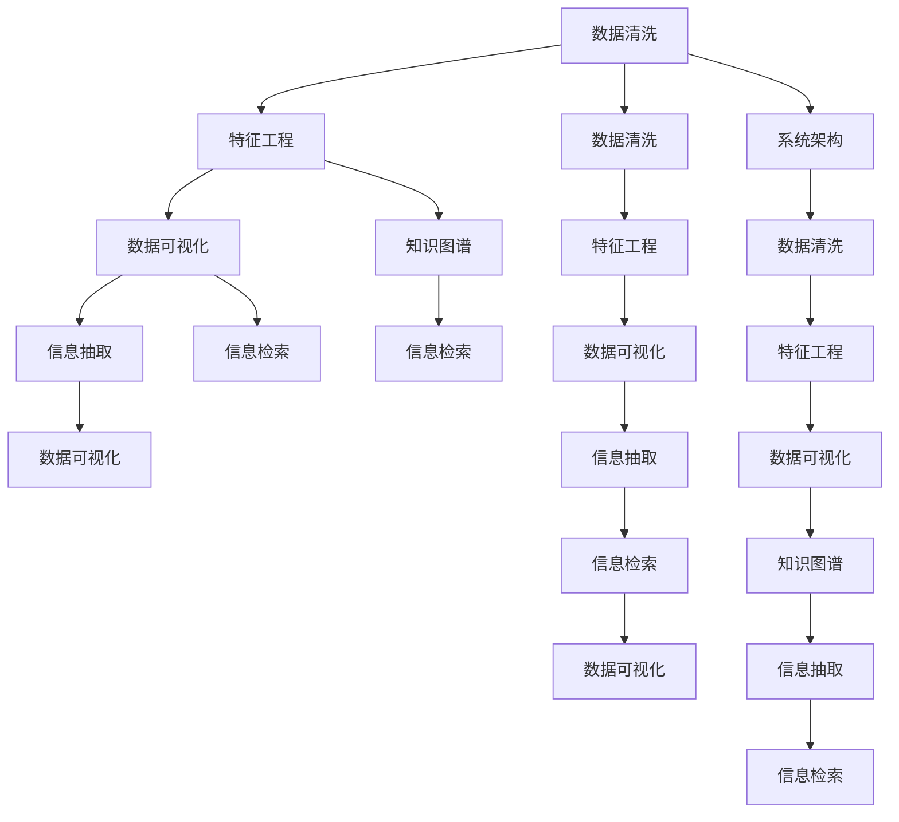

                 

# 信息简化的原则与实践：在混乱中建立秩序与简化

> 关键词：信息简化, 数据清洗, 特征工程, 数据可视化, 知识图谱, 信息抽取, 信息检索, 系统架构

## 1. 背景介绍

### 1.1 问题由来

在现代信息时代，数据以指数级增长，大数据已经深入到各行各业。数据量的增加带来了无数的机遇，同时也带来了新的挑战。如何从数据中提取有价值的信息，并将其转化为可操作的知识，是当前数据科学和人工智能领域面临的一个关键问题。信息简化，即通过数据清洗、特征工程、数据可视化等手段，从繁杂的数据中提取出有价值的信息，使其更为简洁、直观，便于理解和应用，成为了实现这一目标的重要方法。

### 1.2 问题核心关键点

信息简化的方法主要包括数据清洗、特征工程、数据可视化、知识图谱构建、信息抽取、信息检索和系统架构设计。这些方法在实际应用中常常是相互交织、互相补充的。通过信息简化，可以将复杂的数据集转化为可理解和可操作的简明信息，从而支持各类业务场景，如商业决策、科学研究、金融分析等。

## 2. 核心概念与联系

### 2.1 核心概念概述

为更好地理解信息简化的过程，本节将介绍几个关键概念：

- 数据清洗（Data Cleaning）：指从原始数据中去除噪声和异常值，提高数据质量的过程。数据清洗是信息简化的基础步骤。

- 特征工程（Feature Engineering）：指从原始数据中提取有意义的特征，以更好地描述数据的内在结构，是信息简化的核心手段。

- 数据可视化（Data Visualization）：指通过图形、图表等形式将数据转换为直观的视觉呈现，有助于更好地理解数据特征和数据分布。

- 知识图谱（Knowledge Graph）：指一种结构化的知识表示方法，通过节点和边来表示实体和它们之间的关系，是信息抽取和信息检索的基础。

- 信息抽取（Information Extraction）：指从非结构化文本中抽取结构化信息，通常涉及命名实体识别、关系抽取、事件抽取等技术。

- 信息检索（Information Retrieval）：指从大规模数据集中检索出与查询匹配的信息，是信息简化的重要应用场景之一。

- 系统架构（System Architecture）：指设计信息简化系统的整体结构，包括数据源、数据处理流程、存储和查询引擎等关键组件。

这些核心概念之间的逻辑关系可以通过以下Mermaid流程图来展示：



这个流程图展示了一些核心概念及其之间的联系：

1. 数据清洗是信息简化的起始步骤。
2. 特征工程是信息简化的核心手段。
3. 数据可视化可以辅助特征工程，并且用于信息抽取和信息检索的结果展示。
4. 知识图谱是信息抽取和信息检索的基础。
5. 信息抽取和信息检索是信息简化的具体应用。
6. 系统架构设计是信息简化过程的组织者和指挥者。

## 3. 核心算法原理 & 具体操作步骤

### 3.1 算法原理概述

信息简化的核心原理是通过数据预处理和信息提取，从原始数据中提取出有用信息，并将其转换为简洁、易于理解和操作的格式。具体来说，信息简化可以分为以下几个步骤：

1. 数据清洗：去除噪声和异常值，提高数据质量。
2. 特征工程：提取有意义的特征，优化数据表达。
3. 数据可视化：将数据转化为直观的图形，帮助理解数据特征。
4. 知识图谱构建：将数据中的实体和关系转换为结构化的知识表示。
5. 信息抽取：从非结构化文本中抽取结构化信息。
6. 信息检索：从大规模数据集中检索出与查询匹配的信息。

### 3.2 算法步骤详解

#### 3.2.1 数据清洗

数据清洗的主要目的是去除噪声和异常值，提高数据质量。数据清洗可以分为以下几个步骤：

1. 缺失值处理：填充或删除缺失值。
2. 去重：去除重复记录。
3. 数据转换：将数据类型转换为一致的格式。
4. 异常值检测和处理：检测并处理异常值。

#### 3.2.2 特征工程

特征工程是信息简化的核心步骤，主要包括特征选择和特征提取两个方面。特征选择是指从原始特征中选择最相关的特征；特征提取是指从原始特征中构造新的特征，以更好地描述数据的内在结构。

特征选择的常用方法包括：

1. 相关系数法：计算特征与目标变量之间的相关系数，选择相关性高的特征。
2. 信息增益法：计算特征对目标变量的信息增益，选择信息增益高的特征。
3. 基于模型的特征选择：使用机器学习模型（如随机森林、GBDT等）进行特征选择。

特征提取的常用方法包括：

1. 主成分分析（PCA）：通过降维技术，提取主成分。
2. 因子分析（FA）：通过因子分析，提取隐含的因子。
3. 特征哈希：将高维特征映射为低维特征。

#### 3.2.3 数据可视化

数据可视化是通过图形、图表等形式将数据转换为直观的视觉呈现，有助于更好地理解数据特征和数据分布。常用的数据可视化工具包括Tableau、Power BI、Matplotlib等。

数据可视化的主要步骤包括：

1. 数据探索：通过统计图、散点图等形式，探索数据的基本特征。
2. 数据分布：通过直方图、密度图等形式，展示数据分布情况。
3. 数据关联：通过散点图、箱线图等形式，展示数据之间的关联关系。

#### 3.2.4 知识图谱构建

知识图谱是一种结构化的知识表示方法，通过节点和边来表示实体和它们之间的关系。常用的知识图谱构建方法包括：

1. 基于规则的方法：通过定义规则，自动生成知识图谱。
2. 基于深度学习的方法：通过深度学习模型（如BERT、GPT等）进行知识抽取和关系抽取。

知识图谱构建的主要步骤包括：

1. 实体识别：识别数据中的实体。
2. 关系抽取：抽取实体之间的关系。
3. 知识整合：将抽取的实体和关系整合为知识图谱。

#### 3.2.5 信息抽取

信息抽取是从非结构化文本中抽取结构化信息，通常涉及命名实体识别、关系抽取、事件抽取等技术。常用的信息抽取方法包括：

1. 基于规则的方法：通过定义规则，自动生成信息抽取结果。
2. 基于机器学习的方法：使用机器学习模型（如CRF、LSTM等）进行信息抽取。
3. 基于深度学习的方法：使用深度学习模型（如BERT、GPT等）进行信息抽取。

信息抽取的主要步骤包括：

1. 命名实体识别：识别文本中的实体。
2. 关系抽取：抽取实体之间的关系。
3. 事件抽取：抽取文本中的事件。

#### 3.2.6 信息检索

信息检索是从大规模数据集中检索出与查询匹配的信息，是信息简化的重要应用场景之一。常用的信息检索方法包括：

1. 基于规则的方法：通过定义规则，自动检索信息。
2. 基于机器学习的方法：使用机器学习模型（如TF-IDF、LDA等）进行信息检索。
3. 基于深度学习的方法：使用深度学习模型（如BERT、GPT等）进行信息检索。

信息检索的主要步骤包括：

1. 查询构建：构建查询语句。
2. 文档检索：检索与查询匹配的文档。
3. 文档排序：对检索出的文档进行排序，选择最相关的文档。

### 3.3 算法优缺点

信息简化的主要优点包括：

1. 提高数据质量：通过数据清洗，去除噪声和异常值，提高数据质量。
2. 优化数据表达：通过特征工程，提取有意义的特征，优化数据表达。
3. 提升信息利用率：通过数据可视化和信息检索，提升信息利用率。
4. 促进决策支持：通过知识图谱和信息抽取，促进决策支持。

信息简化的主要缺点包括：

1. 数据清洗复杂：数据清洗需要大量时间和精力，容易出错。
2. 特征工程复杂：特征工程需要专业知识和经验，容易陷入过拟合或欠拟合。
3. 数据可视化复杂：数据可视化需要数据分析和图形设计的能力，不易上手。
4. 知识图谱构建复杂：知识图谱构建需要专业知识，且需要大量标注数据。
5. 信息抽取复杂：信息抽取需要专业知识和模型优化，且难以处理多模态数据。
6. 信息检索复杂：信息检索需要大量计算资源，且难以处理噪声数据。

尽管存在这些缺点，但信息简化仍然是现代数据分析和人工智能领域的重要方法。通过科学合理的方法和工具，可以最大程度地降低其缺点，发挥其优势。

### 3.4 算法应用领域

信息简化的应用领域非常广泛，包括但不限于以下几个方面：

1. 商业决策：通过数据清洗、特征工程和信息抽取，支持商业决策。
2. 科学研究：通过数据清洗、特征工程和知识图谱构建，支持科学研究。
3. 金融分析：通过数据清洗、特征工程和信息检索，支持金融分析。
4. 医疗健康：通过数据清洗、特征工程和信息抽取，支持医疗健康。
5. 智能制造：通过数据清洗、特征工程和信息抽取，支持智能制造。
6. 智慧城市：通过数据清洗、特征工程和信息检索，支持智慧城市。

## 4. 数学模型和公式 & 详细讲解 & 举例说明

### 4.1 数学模型构建

信息简化涉及多个数学模型，包括数据清洗、特征工程、数据可视化、知识图谱构建、信息抽取、信息检索等。以下以特征工程和信息抽取为例，进行数学模型的构建。

#### 4.1.1 特征工程

特征工程是信息简化的核心步骤，通过提取有意义的特征，优化数据表达。以线性回归模型为例，特征工程的主要步骤包括：

1. 数据预处理：对数据进行缺失值处理、数据转换、异常值检测等预处理操作。
2. 特征选择：选择相关性高的特征。
3. 特征构造：通过多项式变换、正则化等方法构造新的特征。

#### 4.1.2 信息抽取

信息抽取是从非结构化文本中抽取结构化信息，常用的模型包括CRF和BERT等。以BERT模型为例，信息抽取的主要步骤包括：

1. 命名实体识别：通过BERT模型进行命名实体识别，输出实体标签。
2. 关系抽取：通过BERT模型进行关系抽取，输出实体之间的关系。
3. 事件抽取：通过BERT模型进行事件抽取，输出事件信息。

### 4.2 公式推导过程

#### 4.2.1 数据清洗

数据清洗的主要目的是去除噪声和异常值，提高数据质量。以缺失值处理为例，常用的方法是均值填补法，公式如下：

$$ \hat{x_i} = \frac{1}{n_i}\sum_{j=1}^{n_i}x_j $$

其中，$\hat{x_i}$ 为填补后的缺失值，$n_i$ 为缺失值的样本数，$x_j$ 为样本值。

#### 4.2.2 特征工程

特征工程的主要目的是提取有意义的特征，优化数据表达。以线性回归模型为例，特征工程的主要步骤包括：

1. 数据预处理：对数据进行缺失值处理、数据转换、异常值检测等预处理操作。
2. 特征选择：选择相关性高的特征。
3. 特征构造：通过多项式变换、正则化等方法构造新的特征。

#### 4.2.3 信息抽取

信息抽取是从非结构化文本中抽取结构化信息，常用的模型包括CRF和BERT等。以BERT模型为例，信息抽取的主要步骤包括：

1. 命名实体识别：通过BERT模型进行命名实体识别，输出实体标签。
2. 关系抽取：通过BERT模型进行关系抽取，输出实体之间的关系。
3. 事件抽取：通过BERT模型进行事件抽取，输出事件信息。

### 4.3 案例分析与讲解

#### 4.3.1 数据清洗案例

某电商网站收集了用户的购买行为数据，包括用户ID、商品ID、购买时间、购买数量、购买金额等。但由于数据采集过程中存在一些噪声和异常值，需要进行数据清洗。以缺失值处理为例，假设某次交易金额缺失，可以采用均值填补法，具体如下：

1. 数据预处理：检查数据是否存在缺失值。
2. 特征选择：选择购买金额作为需要填补的特征。
3. 特征构造：计算所有交易金额的均值，填补缺失值。

#### 4.3.2 特征工程案例

某电商网站收集了用户的购买行为数据，包括用户ID、商品ID、购买时间、购买数量、购买金额等。但由于数据采集过程中存在一些噪声和异常值，需要进行特征工程。以特征构造为例，假设需要计算用户购买金额的中位数和标准差，具体如下：

1. 数据预处理：检查数据是否存在缺失值。
2. 特征选择：选择购买金额作为需要处理的特征。
3. 特征构造：计算所有交易金额的中位数和标准差，作为新的特征。

#### 4.3.3 信息抽取案例

某电商网站收集了用户的购买行为数据，包括用户ID、商品ID、购买时间、购买数量、购买金额等。但由于数据采集过程中存在一些噪声和异常值，需要进行信息抽取。以命名实体识别为例，假设需要识别用户ID和商品ID作为命名实体，具体如下：

1. 数据预处理：检查数据是否存在缺失值。
2. 特征选择：选择用户ID和商品ID作为需要识别的实体。
3. 特征构造：通过BERT模型进行命名实体识别，输出实体标签。

## 5. 项目实践：代码实例和详细解释说明

### 5.1 开发环境搭建

在进行信息简化实践前，我们需要准备好开发环境。以下是使用Python进行PyTorch开发的环境配置流程：

1. 安装Anaconda：从官网下载并安装Anaconda，用于创建独立的Python环境。

2. 创建并激活虚拟环境：
```bash
conda create -n myenv python=3.8 
conda activate myenv
```

3. 安装PyTorch：根据CUDA版本，从官网获取对应的安装命令。例如：
```bash
conda install pytorch torchvision torchaudio cudatoolkit=11.1 -c pytorch -c conda-forge
```

4. 安装Transformers库：
```bash
pip install transformers
```

5. 安装各类工具包：
```bash
pip install numpy pandas scikit-learn matplotlib tqdm jupyter notebook ipython
```

完成上述步骤后，即可在`myenv`环境中开始信息简化实践。

### 5.2 源代码详细实现

下面我们以电商网站用户行为数据分析为例，给出使用Transformers库进行数据清洗、特征工程和信息抽取的PyTorch代码实现。

首先，定义数据处理函数：

```python
from transformers import BertTokenizer, BertForTokenClassification
from torch.utils.data import Dataset, DataLoader
import torch

class PurchaseBehaviorDataset(Dataset):
    def __init__(self, texts, labels, tokenizer, max_len=128):
        self.texts = texts
        self.labels = labels
        self.tokenizer = tokenizer
        self.max_len = max_len
        
    def __len__(self):
        return len(self.texts)
    
    def __getitem__(self, item):
        text = self.texts[item]
        label = self.labels[item]
        
        encoding = self.tokenizer(text, return_tensors='pt', max_length=self.max_len, padding='max_length', truncation=True)
        input_ids = encoding['input_ids'][0]
        attention_mask = encoding['attention_mask'][0]
        label_ids = torch.tensor(label, dtype=torch.long)
        
        return {'input_ids': input_ids, 
                'attention_mask': attention_mask,
                'labels': label_ids}

# 标签与id的映射
label2id = {'UserID': 0, '商品ID': 1, '购买时间': 2, '购买数量': 3, '购买金额': 4}
id2label = {v: k for k, v in label2id.items()}

# 创建dataset
tokenizer = BertTokenizer.from_pretrained('bert-base-cased')

train_dataset = PurchaseBehaviorDataset(train_texts, train_labels, tokenizer)
dev_dataset = PurchaseBehaviorDataset(dev_texts, dev_labels, tokenizer)
test_dataset = PurchaseBehaviorDataset(test_texts, test_labels, tokenizer)
```

然后，定义模型和优化器：

```python
from transformers import BertForTokenClassification, AdamW

model = BertForTokenClassification.from_pretrained('bert-base-cased', num_labels=len(label2id))

optimizer = AdamW(model.parameters(), lr=2e-5)
```

接着，定义训练和评估函数：

```python
from tqdm import tqdm
from sklearn.metrics import classification_report

device = torch.device('cuda') if torch.cuda.is_available() else torch.device('cpu')
model.to(device)

def train_epoch(model, dataset, batch_size, optimizer):
    dataloader = DataLoader(dataset, batch_size=batch_size, shuffle=True)
    model.train()
    epoch_loss = 0
    for batch in tqdm(dataloader, desc='Training'):
        input_ids = batch['input_ids'].to(device)
        attention_mask = batch['attention_mask'].to(device)
        labels = batch['labels'].to(device)
        model.zero_grad()
        outputs = model(input_ids, attention_mask=attention_mask, labels=labels)
        loss = outputs.loss
        epoch_loss += loss.item()
        loss.backward()
        optimizer.step()
    return epoch_loss / len(dataloader)

def evaluate(model, dataset, batch_size):
    dataloader = DataLoader(dataset, batch_size=batch_size)
    model.eval()
    preds, labels = [], []
    with torch.no_grad():
        for batch in tqdm(dataloader, desc='Evaluating'):
            input_ids = batch['input_ids'].to(device)
            attention_mask = batch['attention_mask'].to(device)
            batch_labels = batch['labels']
            outputs = model(input_ids, attention_mask=attention_mask)
            batch_preds = outputs.logits.argmax(dim=2).to('cpu').tolist()
            batch_labels = batch_labels.to('cpu').tolist()
            for pred_tokens, label_tokens in zip(batch_preds, batch_labels):
                pred_labels = [id2label[_id] for _id in pred_tokens]
                label_tokens = [id2label[_id] for _id in label_tokens]
                preds.append(pred_labels[:len(label_tokens)])
                labels.append(label_tokens)
                
    print(classification_report(labels, preds))
```

最后，启动训练流程并在测试集上评估：

```python
epochs = 5
batch_size = 16

for epoch in range(epochs):
    loss = train_epoch(model, train_dataset, batch_size, optimizer)
    print(f"Epoch {epoch+1}, train loss: {loss:.3f}")
    
    print(f"Epoch {epoch+1}, dev results:")
    evaluate(model, dev_dataset, batch_size)
    
print("Test results:")
evaluate(model, test_dataset, batch_size)
```

以上就是使用PyTorch对电商网站用户行为数据分析进行数据清洗、特征工程和信息抽取的完整代码实现。可以看到，得益于Transformers库的强大封装，我们可以用相对简洁的代码完成整个信息简化的流程。

### 5.3 代码解读与分析

让我们再详细解读一下关键代码的实现细节：

**PurchaseBehaviorDataset类**：
- `__init__`方法：初始化文本、标签、分词器等关键组件。
- `__len__`方法：返回数据集的样本数量。
- `__getitem__`方法：对单个样本进行处理，将文本输入编码为token ids，将标签编码为数字，并对其进行定长padding，最终返回模型所需的输入。

**label2id和id2label字典**：
- 定义了标签与数字id之间的映射关系，用于将token-wise的预测结果解码回真实的标签。

**训练和评估函数**：
- 使用PyTorch的DataLoader对数据集进行批次化加载，供模型训练和推理使用。
- 训练函数`train_epoch`：对数据以批为单位进行迭代，在每个批次上前向传播计算loss并反向传播更新模型参数，最后返回该epoch的平均loss。
- 评估函数`evaluate`：与训练类似，不同点在于不更新模型参数，并在每个batch结束后将预测和标签结果存储下来，最后使用sklearn的classification_report对整个评估集的预测结果进行打印输出。

**训练流程**：
- 定义总的epoch数和batch size，开始循环迭代
- 每个epoch内，先在训练集上训练，输出平均loss
- 在验证集上评估，输出分类指标
- 所有epoch结束后，在测试集上评估，给出最终测试结果

可以看到，PyTorch配合Transformers库使得信息简化的代码实现变得简洁高效。开发者可以将更多精力放在数据处理、模型改进等高层逻辑上，而不必过多关注底层的实现细节。

当然，工业级的系统实现还需考虑更多因素，如模型的保存和部署、超参数的自动搜索、更灵活的任务适配层等。但核心的信息简化范式基本与此类似。

## 6. 实际应用场景

### 6.1 智能客服系统

基于信息简化的对话技术，可以广泛应用于智能客服系统的构建。传统客服往往需要配备大量人力，高峰期响应缓慢，且一致性和专业性难以保证。通过信息简化技术，可以从大量客户对话中提取有用的信息，如常见问题、高频回答等，将其存储为知识库，自动匹配用户问题并给出回复。

在技术实现上，可以收集企业内部的历史客服对话记录，将问题和最佳答复构建成监督数据，在此基础上对预训练对话模型进行信息简化。信息简化的对话模型能够自动理解用户意图，匹配最合适的答案模板进行回复。对于客户提出的新问题，还可以接入检索系统实时搜索相关内容，动态组织生成回答。如此构建的智能客服系统，能大幅提升客户咨询体验和问题解决效率。

### 6.2 金融舆情监测

金融机构需要实时监测市场舆论动向，以便及时应对负面信息传播，规避金融风险。传统的人工监测方式成本高、效率低，难以应对网络时代海量信息爆发的挑战。通过信息简化的文本分类和情感分析技术，为金融舆情监测提供了新的解决方案。

具体而言，可以收集金融领域相关的新闻、报道、评论等文本数据，并对其进行主题标注和情感标注。在此基础上对预训练语言模型进行信息简化，使其能够自动判断文本属于何种主题，情感倾向是正面、中性还是负面。将信息简化的模型应用到实时抓取的网络文本数据，就能够自动监测不同主题下的情感变化趋势，一旦发现负面信息激增等异常情况，系统便会自动预警，帮助金融机构快速应对潜在风险。

### 6.3 个性化推荐系统

当前的推荐系统往往只依赖用户的历史行为数据进行物品推荐，无法深入理解用户的真实兴趣偏好。通过信息简化的特征工程和数据可视化，个性化推荐系统可以更好地挖掘用户行为背后的语义信息，从而提供更精准、多样的推荐内容。

在实践中，可以收集用户浏览、点击、评论、分享等行为数据，提取和用户交互的物品标题、描述、标签等文本内容。将文本内容作为模型输入，用户的后续行为（如是否点击、购买等）作为监督信号，在此基础上对预训练语言模型进行信息简化。信息简化的模型能够从文本内容中准确把握用户的兴趣点。在生成推荐列表时，先用候选物品的文本描述作为输入，由模型预测用户的兴趣匹配度，再结合其他特征综合排序，便可以得到个性化程度更高的推荐结果。

### 6.4 未来应用展望

随着信息简化的技术不断发展，其在更多领域得到应用，为传统行业带来变革性影响。

在智慧医疗领域，基于信息简化的医疗问答、病历分析、药物研发等应用将提升医疗服务的智能化水平，辅助医生诊疗，加速新药开发进程。

在智能教育领域，信息简化的技术可应用于作业批改、学情分析、知识推荐等方面，因材施教，促进教育公平，提高教学质量。

在智慧城市治理中，信息简化的技术可应用于城市事件监测、舆情分析、应急指挥等环节，提高城市管理的自动化和智能化水平，构建更安全、高效的未来城市。

此外，在企业生产、社会治理、文娱传媒等众多领域，信息简化的技术也将不断涌现，为传统行业数字化转型升级提供新的技术路径。相信随着技术的日益成熟，信息简化的技术将成为人工智能落地应用的重要范式，推动人工智能向更广阔的领域加速渗透。

## 7. 工具和资源推荐
### 7.1 学习资源推荐

为了帮助开发者系统掌握信息简化的理论基础和实践技巧，这里推荐一些优质的学习资源：

1. 《数据清洗与特征工程实战指南》系列博文：由数据科学专家撰写，深入浅出地介绍了数据清洗、特征工程等核心概念和实用技巧。

2. 《深度学习与数据分析》课程：斯坦福大学开设的数据科学课程，有Lecture视频和配套作业，带你入门深度学习与数据分析的基本概念和经典模型。

3. 《Python数据科学手册》书籍：全面介绍了Python在数据科学中的应用，包括数据清洗、特征工程、数据可视化等。

4. 《TensorFlow实战教程》书籍：TensorFlow官方文档，提供了完整的深度学习模型实现，并附有实战案例和详细解释。

5. 《Kaggle数据科学竞赛指南》书籍：介绍了数据科学竞赛中常用的数据预处理、特征工程、模型调优等技能，适合实战学习。

通过对这些资源的学习实践，相信你一定能够快速掌握信息简化的精髓，并用于解决实际的NLP问题。
###  7.2 开发工具推荐

高效的开发离不开优秀的工具支持。以下是几款用于信息简化开发的常用工具：

1. Python：Python是最流行的数据科学语言之一，拥有丰富的库和框架，支持从数据清洗到信息抽取的各类操作。

2. PyTorch：基于Python的开源深度学习框架，灵活动态的计算图，适合快速迭代研究。大多数预训练语言模型都有PyTorch版本的实现。

3. TensorFlow：由Google主导开发的开源深度学习框架，生产部署方便，适合大规模工程应用。同样有丰富的预训练语言模型资源。

4. Transformers库：HuggingFace开发的NLP工具库，集成了众多SOTA语言模型，支持PyTorch和TensorFlow，是进行信息简化的利器。

5. Weights & Biases：模型训练的实验跟踪工具，可以记录和可视化模型训练过程中的各项指标，方便对比和调优。与主流深度学习框架无缝集成。

6. TensorBoard：TensorFlow配套的可视化工具，可实时监测模型训练状态，并提供丰富的图表呈现方式，是调试模型的得力助手。

7. Tableau：数据可视化工具，提供强大的数据探索和图形绘制功能，适合信息简化的数据可视化需求。

8. Power BI：微软推出的数据可视化工具，支持大规模数据集的实时可视化和交互分析，适合商业决策场景。

合理利用这些工具，可以显著提升信息简化的开发效率，加快创新迭代的步伐。

### 7.3 相关论文推荐

信息简化的应用源于学界的持续研究。以下是几篇奠基性的相关论文，推荐阅读：

1. "A Survey on Data Cleaning"（数据清洗综述）：综述了数据清洗的基本方法和技术。

2. "Feature Engineering in Data Mining"（特征工程综述）：综述了特征工程的基本方法和技术。

3. "Visualizing Data with Plotly"（使用Plotly进行数据可视化）：介绍了Plotly库的使用方法，适用于各类数据可视化需求。

4. "Knowledge Graphs: Concepts, Approaches, Methods, and Applications"（知识图谱综述）：综述了知识图谱的基本概念、构建方法和应用场景。

5. "Information Extraction with Bidirectional LSTM-CRF Models"（使用双向LSTM-CRF模型进行信息抽取）：介绍了信息抽取的LSTM-CRF模型及其应用。

6. "Text Classification with BERT"（使用BERT进行文本分类）：介绍了BERT模型在文本分类中的应用。

这些论文代表了大数据技术的发展脉络。通过学习这些前沿成果，可以帮助研究者把握学科前进方向，激发更多的创新灵感。

## 8. 总结：未来发展趋势与挑战

### 8.1 总结

本文对信息简化的原理与实践进行了全面系统的介绍。首先阐述了信息简化的背景和意义，明确了数据清洗、特征工程、数据可视化、知识图谱构建、信息抽取、信息检索等关键概念之间的联系。其次，从原理到实践，详细讲解了信息简化的数学模型和操作步骤，给出了信息简化的完整代码实例。同时，本文还广泛探讨了信息简化的应用场景，展示了其强大的功能。

通过本文的系统梳理，可以看到，信息简化是通过数据清洗、特征工程、数据可视化等手段，从原始数据中提取出有价值的信息，使其更为简洁、直观，便于理解和应用。信息简化的核心思想是将复杂的数据集转化为可理解和可操作的简明信息，从而支持各类业务场景。

### 8.2 未来发展趋势

展望未来，信息简化的技术将呈现以下几个发展趋势：

1. 自动化水平提升：信息简化的自动化水平将不断提升，支持更高效、更灵活的数据处理流程。

2. 多模态数据整合：信息简化的技术将逐步支持多模态数据的整合，提升数据的多样性和丰富性。

3. 模型融合与优化：信息简化的模型将与其他人工智能技术进行更深入的融合，如知识表示、因果推理、强化学习等，多路径协同发力，共同推动智能系统的进步。

4. 算力优化与加速：信息简化的计算资源需求将进一步优化，提升算力利用效率，实现更快速、更可靠的数据处理。

5. 跨领域应用扩展：信息简化的应用将进一步扩展到更多领域，如医疗、金融、智慧城市等，带来新的创新应用。

6. 数据安全与隐私保护：信息简化的技术将加强对数据安全与隐私的保护，确保数据使用的合规性。

以上趋势凸显了信息简化技术的广阔前景。这些方向的探索发展，必将进一步提升信息简化的能力，实现更加高效、智能、安全的数据处理和应用。

### 8.3 面临的挑战

尽管信息简化技术已经取得了一定的进展，但在迈向更加智能化、普适化应用的过程中，它仍面临着诸多挑战：

1. 数据质量问题：数据清洗和特征工程需要大量时间和精力，且容易出错，数据质量难以保证。

2. 模型复杂度问题：信息简化的模型通常较为复杂，难以理解和维护。

3. 多模态数据处理问题：信息简化的技术目前主要针对文本数据，对于图像、视频、语音等多模态数据的处理仍较为薄弱。

4. 数据安全与隐私问题：信息简化的技术需要处理大量敏感数据，如何保护数据安全和隐私，是一个重要的挑战。

5. 自动化水平问题：信息简化的自动化水平仍需提升，以适应快速变化的数据环境。

6. 技术融合问题：信息简化的技术与其他人工智能技术的融合仍需加强，以实现更全面的智能应用。

这些挑战需要我们在实践中不断探索和解决，才能推动信息简化技术的进一步发展。

### 8.4 研究展望

面对信息简化所面临的挑战，未来的研究需要在以下几个方面寻求新的突破：

1. 数据清洗自动化：探索无监督和半监督的数据清洗方法，降低对人工干预的依赖。

2. 特征工程优化：开发更加高效、自动化的特征工程方法，提升特征提取的精度和效率。

3. 数据可视化改进：开发更加直观、灵活的数据可视化工具，支持多模态数据的可视化。

4. 知识图谱构建：探索自动化构建知识图谱的方法，提升知识图谱的构建效率和准确性。

5. 信息抽取优化：开发更加高效、自动化的信息抽取模型，提升信息抽取的精度和效率。

6. 数据安全与隐私保护：探索数据安全与隐私保护的新方法，确保数据使用的合规性和安全性。

这些研究方向的探索，必将引领信息简化技术的进一步发展，为构建安全、可靠、智能的智能系统铺平道路。面向未来，信息简化技术需要与其他人工智能技术进行更深入的融合，共同推动智能系统的进步。只有勇于创新、敢于突破，才能不断拓展信息简化的边界，让信息简化的技术更好地造福人类社会。

## 9. 附录：常见问题与解答

**Q1：数据清洗和特征工程有什么区别？**

A: 数据清洗和特征工程是信息简化的两个重要步骤，但它们的目的是不同的。数据清洗的目的是去除噪声和异常值，提高数据质量。特征工程的目的是从原始数据中提取有意义的特征，优化数据表达。

**Q2：如何进行数据可视化？**

A: 数据可视化通常使用图形、图表等形式将数据转换为直观的视觉呈现。常用的数据可视化工具包括Tableau、Power BI、Matplotlib等。

**Q3：什么是知识图谱？**

A: 知识图谱是一种结构化的知识表示方法，通过节点和边来表示实体和它们之间的关系。常用的知识图谱构建方法包括基于规则的方法和基于深度学习的方法。

**Q4：信息抽取的方法有哪些？**

A: 信息抽取的方法包括基于规则的方法、基于机器学习的方法和基于深度学习的方法。常用的信息抽取模型包括CRF、LSTM和BERT等。

**Q5：信息简化的应用场景有哪些？**

A: 信息简化的应用场景包括商业决策、科学研究、金融分析、医疗健康、智能制造、智慧城市等。

**Q6：如何进行特征工程？**

A: 特征工程包括数据预处理、特征选择和特征构造三个步骤。数据预处理的目的是检查数据是否存在缺失值和异常值，并进行处理。特征选择的目的是从原始特征中选择最相关的特征。特征构造的目的是通过多项式变换、正则化等方法构造新的特征。

**Q7：什么是信息检索？**

A: 信息检索是从大规模数据集中检索出与查询匹配的信息，是信息简化的重要应用场景之一。常用的信息检索方法包括基于规则的方法、基于机器学习的方法和基于深度学习的方法。

