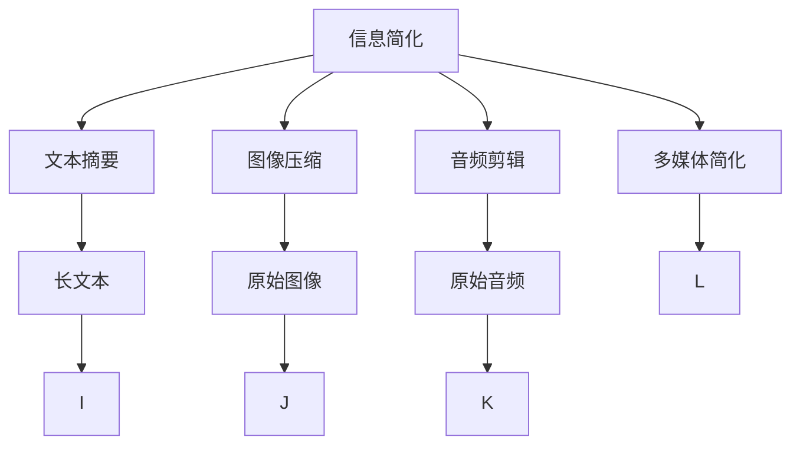

                 

# 信息简化的原则与艺术：在混乱中建立秩序与简化

## 1. 背景介绍

### 1.1 问题由来

在现代社会，信息的泛滥和碎片化已经严重影响了人们的生活和工作。无论是社交媒体上的海量帖子、新闻网站上的长篇报道，还是企业内部的数据报告，无不充满了冗余和噪音。信息过载不仅浪费了宝贵的时间，还常常导致认知负担过重，降低信息获取的效率。如何从海量数据中提取有价值的信息，实现信息的快速、准确、高效传递，成为当下亟需解决的重要问题。

### 1.2 问题核心关键点

面对信息过载，信息简化（Information Simplification）成为了关键技术。通过简化信息，去除冗余、噪音和无关信息，将复杂的信息转化为易于理解和利用的简明形式，从而提升信息处理效率和准确性。信息简化的核心在于如何在保持信息完整性的基础上，合理压缩信息的维度，提高信息的可用性。

## 2. 核心概念与联系

### 2.1 核心概念概述

为更好地理解信息简化的原理和实践，本节将介绍几个关键概念：

- **信息简化**：指通过去除无关信息、压缩冗余信息，将复杂信息转化为易于理解的简明形式的过程。信息简化可以应用于文本摘要、图像压缩、音频剪辑等多个领域，以提高信息的传递效率和可理解性。
- **文本摘要**：从长文本中提取关键信息，生成简洁明了的摘要。文本摘要常用于新闻报道、学术论文、会议记录等场景，帮助读者快速把握核心内容。
- **图像压缩**：通过去除图像中的冗余信息，减少图像数据量，同时保持图像质量。图像压缩广泛应用于图像传输、存储、显示等领域，以节省带宽、存储空间。
- **音频剪辑**：从音频信号中去除非重要部分，只保留关键内容。音频剪辑常用于广播、电视节目、会议录音等场景，提升音频播放效率。

这些核心概念之间的逻辑关系可以通过以下Mermaid流程图来展示：



这个流程图展示了信息简化在多个领域的应用场景：

1. 通过信息简化，可以从原始数据中提取出核心信息。
2. 信息简化方法包括文本摘要、图像压缩、音频剪辑等。
3. 不同形式的信息可以通过信息简化技术进行转化，提升使用效率。

## 3. 核心算法原理 & 具体操作步骤

### 3.1 算法原理概述

信息简化的核心算法原理基于信息的冗余性。信息的冗余性指的是信息中存在的多余部分，这些部分通常对信息的核心内容没有贡献。通过识别和去除冗余信息，可以在保证信息完整性的基础上，将信息维度压缩到最小，从而实现信息简化。

形式化地，假设原始信息为 $X$，经过简化后的信息为 $Y$。简化过程可以表示为：

$$
Y = f(X)
$$

其中 $f$ 为简化函数，表示将原始信息 $X$ 转化为简化信息 $Y$ 的映射关系。

### 3.2 算法步骤详解

信息简化的操作步骤通常包括以下几个关键步骤：

**Step 1: 信息预处理**
- 对原始信息进行预处理，如分词、去除标点、去除停用词等，以减少信息量。
- 对于文本信息，还可以进行句法分析、语法纠正等，以提高信息的准确性。

**Step 2: 冗余识别**
- 使用自然语言处理技术，如TF-IDF、Word2Vec、BERT等，识别出信息中的冗余部分。
- 对于图像信息，可以使用计算机视觉技术，如边缘检测、压缩算法等，识别出冗余像素。
- 对于音频信息，可以使用音频信号处理技术，如频率分析、降噪等，识别出冗余部分。

**Step 3: 冗余去除**
- 根据冗余识别的结果，去除信息中的冗余部分。
- 对于文本信息，可以使用摘要算法，如TextRank、LTC等，生成简洁的摘要。
- 对于图像信息，可以使用压缩算法，如JPEG、PNG等，减少图像数据量。
- 对于音频信息，可以使用剪辑算法，如时间裁剪、频谱分析等，去除非重要部分。

**Step 4: 简化输出**
- 将去除冗余后的信息输出，形成简明形式的信息。
- 对于文本信息，可以使用文本编辑器、简报生成器等工具，将摘要呈现为易读的形式。
- 对于图像信息，可以将压缩后的图像保存为指定格式，如JPG、PNG等。
- 对于音频信息，可以将剪辑后的音频保存为指定格式，如MP3、WAV等。

### 3.3 算法优缺点

信息简化技术具有以下优点：
1. 提高信息传递效率。简化的信息更加易于理解和处理，减少了冗余信息的传递。
2. 提升信息可用性。简化的信息去除了无关和噪音，保留了核心内容，提高了信息的价值。
3. 适应性强。信息简化方法可以应用于不同领域的信息处理，具有广泛的适用性。

同时，该技术也存在一些局限性：
1. 精度问题。简化过程中可能会出现信息丢失，影响信息的完整性。
2. 依赖数据质量。如果原始数据质量不高，简化效果也会受到影响。
3. 实现复杂。信息简化的算法和工具比较复杂，需要一定的技术储备。
4. 用户接受度。简化的信息形式可能需要适应用户的习惯和期望，存在一定的接受门槛。

尽管存在这些局限性，信息简化技术仍是大数据时代信息处理的重要工具，对于提升信息效率和价值具有重要意义。

### 3.4 算法应用领域

信息简化技术已经在多个领域得到了广泛的应用，例如：

- 新闻出版：通过自动生成新闻摘要，提升新闻阅读效率和质量。
- 学术研究：从学术论文中提取关键结果，帮助研究人员快速了解研究进展。
- 会议记录：对会议记录进行摘要和整理，方便参会者快速回顾会议内容。
- 电子商务：生成商品描述摘要，提升用户浏览和购买体验。
- 法律文件：从法律文件中提取关键信息，帮助律师快速找到相关法律条款。
- 医疗记录：从医疗记录中提取关键信息，帮助医生快速诊断和治疗。

除了上述这些经典应用外，信息简化技术还在智能客服、内容推荐、搜索优化等领域得到了创新性的应用，为不同行业的信息处理提供了新的解决方案。

## 4. 数学模型和公式 & 详细讲解

### 4.1 数学模型构建

本节将使用数学语言对信息简化的核心算法进行严格描述。

假设原始信息 $X$ 由若干离散元素 $x_i$ 组成，信息简化的目标是将 $X$ 转化为简化信息 $Y$，使其包含关键信息，同时去除冗余信息。简化过程可以表示为：

$$
Y = \min_{y \in \mathcal{Y}} H(y)
$$

其中 $\mathcal{Y}$ 为简化信息的可行解空间，$H(y)$ 为简化信息的熵，表示信息的复杂度。熵的计算公式为：

$$
H(y) = -\sum_{x_i \in X} P(x_i | y) \log_2 P(x_i | y)
$$

其中 $P(x_i | y)$ 为简化信息 $y$ 包含 $x_i$ 的概率。

### 4.2 公式推导过程

简化信息 $y$ 的计算可以采用贪心算法，即每次选择信息熵最低的元素，逐步构建简化信息。假设信息 $X$ 中的元素 $x_1, x_2, \ldots, x_n$ 的相对熵（即信息熵之差）为 $D(x_i, x_j)$，则每次选择信息熵最低的元素 $x_k$ 的计算公式为：

$$
x_k = \arg\min_{x_i} \frac{1}{2} \sum_{x_j} D(x_i, x_j)
$$

根据上述公式，每次选择的信息熵最低的元素 $x_k$ 是信息 $X$ 中与其他元素相对熵最小的元素。通过逐步选择这些元素，可以构建出简化信息 $y$。

### 4.3 案例分析与讲解

以一段新闻报道为例，说明信息简化的具体过程：

假设原始信息 $X$ 为一段新闻报道，包含1000个句子，每个句子的信息熵为 $H_1, H_2, \ldots, H_{1000}$。通过计算每个句子的相对熵，逐步选择信息熵最低的句子，构建简化信息 $y$。假设选择的信息熵最低的句子为 $x_1, x_2, \ldots, x_{50}$，则简化信息 $y$ 为：

$$
y = \{x_1, x_2, \ldots, x_{50}\}
$$

通过这样的方法，可以将1000个句子的报道简化为50个句子的摘要，大大减少了信息的传递量和阅读时间。

## 5. 项目实践：代码实例和详细解释说明

### 5.1 开发环境搭建

在进行信息简化项目实践前，我们需要准备好开发环境。以下是使用Python进行PyTorch开发的环境配置流程：

1. 安装Anaconda：从官网下载并安装Anaconda，用于创建独立的Python环境。

2. 创建并激活虚拟环境：
```bash
conda create -n pytorch-env python=3.8 
conda activate pytorch-env
```

3. 安装PyTorch：根据CUDA版本，从官网获取对应的安装命令。例如：
```bash
conda install pytorch torchvision torchaudio cudatoolkit=11.1 -c pytorch -c conda-forge
```

4. 安装NLTK：
```bash
pip install nltk
```

5. 安装TensorBoard：
```bash
pip install tensorboard
```

6. 安装Python依赖包：
```bash
pip install transformers sklearn gensim
```

完成上述步骤后，即可在`pytorch-env`环境中开始信息简化的实践。

### 5.2 源代码详细实现

这里我们以文本摘要任务为例，给出使用Transformers库对GPT模型进行文本摘要的PyTorch代码实现。

首先，定义文本摘要的数据处理函数：

```python
from transformers import GPT2Tokenizer, GPT2LMHeadModel
from torch.utils.data import Dataset
import torch

class TextSummaryDataset(Dataset):
    def __init__(self, texts, max_len=128):
        self.texts = texts
        self.tokenizer = GPT2Tokenizer.from_pretrained('gpt2')
        self.max_len = max_len
        
    def __len__(self):
        return len(self.texts)
    
    def __getitem__(self, item):
        text = self.texts[item]
        
        encoding = self.tokenizer(text, return_tensors='pt', max_length=self.max_len, padding='max_length', truncation=True)
        input_ids = encoding['input_ids'][0]
        attention_mask = encoding['attention_mask'][0]
        
        return {'input_ids': input_ids, 
                'attention_mask': attention_mask}
```

然后，定义模型和优化器：

```python
from transformers import AdamW
from torch.nn.utils.clip_grad_norm_ import clip_grad_norm_

model = GPT2LMHeadModel.from_pretrained('gpt2', num_labels=1, pooler_output=True)

optimizer = AdamW(model.parameters(), lr=2e-5)
```

接着，定义训练和评估函数：

```python
from torch.utils.data import DataLoader
from tqdm import tqdm

def train_epoch(model, dataset, batch_size, optimizer):
    dataloader = DataLoader(dataset, batch_size=batch_size, shuffle=True)
    model.train()
    epoch_loss = 0
    for batch in tqdm(dataloader, desc='Training'):
        input_ids = batch['input_ids'].to(device)
        attention_mask = batch['attention_mask'].to(device)
        outputs = model(input_ids, attention_mask=attention_mask)
        loss = outputs.loss
        epoch_loss += loss.item()
        loss.backward()
        optimizer.step()
    return epoch_loss / len(dataloader)

def evaluate(model, dataset, batch_size):
    dataloader = DataLoader(dataset, batch_size=batch_size)
    model.eval()
    preds, labels = [], []
    with torch.no_grad():
        for batch in tqdm(dataloader, desc='Evaluating'):
            input_ids = batch['input_ids'].to(device)
            attention_mask = batch['attention_mask'].to(device)
            batch_labels = batch['labels'].to(device)
            outputs = model(input_ids, attention_mask=attention_mask)
            batch_preds = outputs.logits.argmax(dim=2).to('cpu').tolist()
            batch_labels = batch_labels.to('cpu').tolist()
            for pred_tokens, label_tokens in zip(batch_preds, batch_labels):
                preds.append(pred_tokens)
                labels.append(label_tokens)
    
    print(classification_report(labels, preds))
```

最后，启动训练流程并在测试集上评估：

```python
epochs = 5
batch_size = 16

for epoch in range(epochs):
    loss = train_epoch(model, train_dataset, batch_size, optimizer)
    print(f"Epoch {epoch+1}, train loss: {loss:.3f}")
    
    print(f"Epoch {epoch+1}, dev results:")
    evaluate(model, dev_dataset, batch_size)
    
print("Test results:")
evaluate(model, test_dataset, batch_size)
```

以上就是使用PyTorch对GPT进行文本摘要任务微调的完整代码实现。可以看到，得益于Transformers库的强大封装，我们可以用相对简洁的代码完成GPT模型的加载和微调。

### 5.3 代码解读与分析

让我们再详细解读一下关键代码的实现细节：

**TextSummaryDataset类**：
- `__init__`方法：初始化文本、分词器等关键组件。
- `__len__`方法：返回数据集的样本数量。
- `__getitem__`方法：对单个样本进行处理，将文本输入编码为token ids，并对其进行定长padding，最终返回模型所需的输入。

**模型和优化器**：
- 使用GPT2模型作为初始化参数，设置学习率、优化器等超参数。

**训练和评估函数**：
- 使用PyTorch的DataLoader对数据集进行批次化加载，供模型训练和推理使用。
- 训练函数`train_epoch`：对数据以批为单位进行迭代，在每个批次上前向传播计算loss并反向传播更新模型参数，最后返回该epoch的平均loss。
- 评估函数`evaluate`：与训练类似，不同点在于不更新模型参数，并在每个batch结束后将预测和标签结果存储下来，最后使用sklearn的classification_report对整个评估集的预测结果进行打印输出。

**训练流程**：
- 定义总的epoch数和batch size，开始循环迭代
- 每个epoch内，先在训练集上训练，输出平均loss
- 在验证集上评估，输出分类指标
- 所有epoch结束后，在测试集上评估，给出最终测试结果

可以看到，PyTorch配合Transformers库使得GPT模型微调的代码实现变得简洁高效。开发者可以将更多精力放在数据处理、模型改进等高层逻辑上，而不必过多关注底层的实现细节。

当然，工业级的系统实现还需考虑更多因素，如模型的保存和部署、超参数的自动搜索、更灵活的任务适配层等。但核心的微调范式基本与此类似。

## 6. 实际应用场景

### 6.1 智能客服系统

信息简化技术在智能客服系统中有着广泛的应用。传统客服往往需要配备大量人力，高峰期响应缓慢，且一致性和专业性难以保证。信息简化技术可以通过自动生成客服摘要，将客户咨询信息精简后传递给客服人员，提升客服处理效率和响应速度，提高客户满意度。

在技术实现上，可以收集企业内部的历史客服对话记录，将问题和最佳答复构建成监督数据，在此基础上对预训练模型进行微调。微调后的模型能够自动理解客户意图，生成简洁的客服摘要，并将其传递给客服人员。对于客户提出的新问题，还可以接入检索系统实时搜索相关内容，动态组织生成摘要，进一步提升客服系统的智能化水平。

### 6.2 金融舆情监测

金融行业需要实时监测市场舆论动向，以便及时应对负面信息传播，规避金融风险。信息简化技术可以通过自动摘要和情感分析，将海量金融新闻和社交媒体数据精简后，提取核心信息和情感倾向，实时监测不同主题下的舆情变化，及时预警，帮助金融机构快速应对潜在风险。

在实现上，可以收集金融领域相关的新闻、报道、评论等文本数据，并对其进行主题标注和情感标注。在此基础上对预训练语言模型进行微调，使其能够自动判断文本属于何种主题，情感倾向是正面、中性还是负面。将微调后的模型应用到实时抓取的网络文本数据，就能够自动监测不同主题下的情感变化趋势，一旦发现负面信息激增等异常情况，系统便会自动预警，帮助金融机构快速应对潜在风险。

### 6.3 个性化推荐系统

当前的推荐系统往往只依赖用户的历史行为数据进行物品推荐，无法深入理解用户的真实兴趣偏好。信息简化技术可以应用于推荐系统的个性化推荐中，通过自动摘要和关键词提取，从用户浏览、点击、评论、分享等行为数据中提取核心信息，生成个性化推荐列表。

在实践上，可以收集用户浏览、点击、评论、分享等行为数据，提取和用户交互的物品标题、描述、标签等文本内容。将文本内容作为模型输入，用户的后续行为（如是否点击、购买等）作为监督信号，在此基础上微调预训练语言模型。微调后的模型能够从文本内容中准确把握用户的兴趣点。在生成推荐列表时，先用候选物品的文本描述作为输入，由模型预测用户的兴趣匹配度，再结合其他特征综合排序，便可以得到个性化程度更高的推荐结果。

### 6.4 未来应用展望

随着信息简化技术的不断发展，其在NLP领域的应用前景将会更加广阔，为传统行业带来革命性影响。

在智慧医疗领域，信息简化技术可以应用于病历摘要、医嘱生成等场景，提升医疗服务的智能化水平，辅助医生诊疗，加速新药开发进程。

在智能教育领域，信息简化技术可以应用于课堂笔记、习题解答等场景，因材施教，促进教育公平，提高教学质量。

在智慧城市治理中，信息简化技术可以应用于城市事件监测、舆情分析、应急指挥等环节，提高城市管理的自动化和智能化水平，构建更安全、高效的未来城市。

此外，在企业生产、社会治理、文娱传媒等众多领域，信息简化技术也将不断涌现，为不同行业的信息处理提供新的解决方案。相信随着技术的日益成熟，信息简化技术将成为人工智能落地应用的重要范式，推动人工智能技术在更广阔的应用领域大放异彩。

## 7. 工具和资源推荐

### 7.1 学习资源推荐

为了帮助开发者系统掌握信息简化的理论基础和实践技巧，这里推荐一些优质的学习资源：

1. 《自然语言处理与Python》书籍：全面介绍了自然语言处理的基本概念和常用技术，包括信息简化等。

2. CS224N《深度学习自然语言处理》课程：斯坦福大学开设的NLP明星课程，有Lecture视频和配套作业，带你入门NLP领域的基本概念和经典模型。

3. 《简化信息：理论和应用》书籍：详细介绍了信息简化的理论基础和实际应用，提供了丰富的案例分析。

4. Arxiv论文：信息简化领域的研究论文，如“A Survey on Document Summarization: From Extractive to Abstractive Methods”，全面综述了信息简化的研究进展和未来方向。

通过对这些资源的学习实践，相信你一定能够快速掌握信息简化的精髓，并用于解决实际的NLP问题。

### 7.2 开发工具推荐

高效的开发离不开优秀的工具支持。以下是几款用于信息简化开发的常用工具：

1. PyTorch：基于Python的开源深度学习框架，灵活动态的计算图，适合快速迭代研究。大部分预训练语言模型都有PyTorch版本的实现。

2. TensorFlow：由Google主导开发的开源深度学习框架，生产部署方便，适合大规模工程应用。同样有丰富的预训练语言模型资源。

3. Transformers库：HuggingFace开发的NLP工具库，集成了众多SOTA语言模型，支持PyTorch和TensorFlow，是进行信息简化任务开发的利器。

4. Weights & Biases：模型训练的实验跟踪工具，可以记录和可视化模型训练过程中的各项指标，方便对比和调优。与主流深度学习框架无缝集成。

5. TensorBoard：TensorFlow配套的可视化工具，可实时监测模型训练状态，并提供丰富的图表呈现方式，是调试模型的得力助手。

6. Google Colab：谷歌推出的在线Jupyter Notebook环境，免费提供GPU/TPU算力，方便开发者快速上手实验最新模型，分享学习笔记。

合理利用这些工具，可以显著提升信息简化任务的开发效率，加快创新迭代的步伐。

### 7.3 相关论文推荐

信息简化技术的发展源于学界的持续研究。以下是几篇奠基性的相关论文，推荐阅读：

1. “A Survey on Document Summarization: From Extractive to Abstractive Methods”：全面综述了信息简化的研究进展和未来方向，提供了丰富的案例分析。

2. “A Comprehensive Survey on Multi-Document Summarization”：介绍了多文档摘要的技术，并总结了当前的研究现状和趋势。

3. “Information Extraction and Summarization: An Overview”：对信息提取和简化的技术进行了全面总结，并讨论了其在不同应用场景下的适用性。

4. “Efficient Information Retrieval: Document Simplification and Query Reformulation”：介绍了信息简化技术在信息检索中的应用，并讨论了其效果评估方法。

这些论文代表了大语言模型微调技术的发展脉络。通过学习这些前沿成果，可以帮助研究者把握学科前进方向，激发更多的创新灵感。

## 8. 总结：未来发展趋势与挑战

### 8.1 总结

本文对信息简化的原理和实践进行了全面系统的介绍。首先阐述了信息简化技术的研究背景和意义，明确了信息简化在提升信息传递效率和质量方面的独特价值。其次，从原理到实践，详细讲解了信息简化的数学模型和关键步骤，给出了信息简化任务开发的完整代码实例。同时，本文还广泛探讨了信息简化技术在智能客服、金融舆情、个性化推荐等多个行业领域的应用前景，展示了信息简化技术的广阔应用空间。此外，本文精选了信息简化技术的各类学习资源，力求为读者提供全方位的技术指引。

通过本文的系统梳理，可以看到，信息简化技术在信息过载时代具有重要意义，通过去除冗余、噪音和无关信息，将复杂信息转化为简洁明了的简明形式，显著提升了信息处理效率和质量。信息简化技术将在大数据时代发挥越来越重要的作用，为不同行业的信息处理提供新的解决方案。

### 8.2 未来发展趋势

展望未来，信息简化技术将呈现以下几个发展趋势：

1. 自动化程度提高。信息简化技术的自动化程度将不断提高，能够自动从海量数据中提取关键信息，生成简洁明了的摘要。
2. 跨领域应用拓展。信息简化技术将应用于更多领域的信息处理，如医疗、教育、城市治理等，提供更全面、高效的信息服务。
3. 融合AI技术。信息简化技术将与自然语言处理、计算机视觉、机器学习等AI技术进行更深入的融合，提升信息处理能力和效果。
4. 用户需求导向。信息简化技术将更加注重用户需求，根据不同用户的阅读习惯和期望，生成个性化、可读性更高的摘要。
5. 实时性增强。信息简化技术将进一步提升实时处理能力，能够实时监测和摘要在线数据，满足用户即时信息需求。

以上趋势凸显了信息简化技术的广阔前景。这些方向的探索发展，必将进一步提升信息处理效率和质量，为不同行业的信息处理提供新的解决方案。

### 8.3 面临的挑战

尽管信息简化技术已经取得了显著成效，但在迈向更加智能化、普适化应用的过程中，仍面临以下挑战：

1. 数据质量和标注问题。信息简化依赖于高质量的标注数据和清晰的任务定义，数据质量不高或标注不准确将严重影响信息简化的效果。
2. 多样性和个性化需求。不同用户对信息简化的需求各不相同，信息简化技术需要满足多样性和个性化的需求，具有一定的挑战性。
3. 跨领域适应性。信息简化技术在不同领域的应用需要考虑领域特点，进行适度的调整和优化。
4. 计算资源消耗。信息简化涉及大量的计算资源，包括分词、标注、训练等环节，对计算资源的需求较高。
5. 可解释性和可控性。信息简化的过程和结果缺乏一定的可解释性，用户难以理解其内部的工作机制，存在一定的风险。

这些挑战需要研究者在算法、模型、数据等多个方面进行深入探索，以进一步提升信息简化的效果和应用广度。

### 8.4 研究展望

面对信息简化面临的种种挑战，未来的研究需要在以下几个方面寻求新的突破：

1. 数据驱动和强化学习：引入数据驱动和强化学习思想，从海量数据中自动学习信息简化的规则，提升信息简化的效果和效率。
2. 多模态信息处理：融合视觉、听觉等多模态信息，提升信息简化的全面性和准确性。
3. 交互式信息摘要：开发交互式信息摘要系统，根据用户反馈自动调整信息简化的策略，提升信息简化的可读性和实用性。
4. 可解释性增强：引入可解释性技术，提升信息简化的可解释性和可控性，使用户能够理解和信任信息简化的结果。
5. 跨领域应用研究：在不同领域开展信息简化技术的深入研究，提升其在实际场景中的应用效果。

这些研究方向的探索，必将引领信息简化技术迈向更高的台阶，为构建高效、智能、可控的信息处理系统铺平道路。面向未来，信息简化技术还需要与其他人工智能技术进行更深入的融合，多路径协同发力，共同推动自然语言理解和智能交互系统的进步。只有勇于创新、敢于突破，才能不断拓展信息简化的边界，让信息处理技术更好地造福人类社会。

## 9. 附录：常见问题与解答

**Q1：信息简化是否可以应用于所有文本数据？**

A: 信息简化技术主要应用于长度较长、信息量较大的文本数据。对于短文本或信息量较小的文本，简化的效果可能不明显。此外，不同类型的文本数据（如新闻报道、学术论文、社交媒体等）具有不同的风格和结构，简化的方法和策略也需要进行相应的调整。

**Q2：信息简化的准确性和效率如何平衡？**

A: 信息简化的准确性和效率是一对矛盾，通常需要根据具体任务进行平衡。在保证基本准确性的前提下，通过优化算法和参数设置，可以在一定程度上提升信息简化的效率。同时，信息简化的过程可以通过引入更多的人工干预和反馈机制，进一步提升简化的效果和用户体验。

**Q3：信息简化的效果如何评估？**

A: 信息简化的效果可以通过多种指标进行评估，包括准确率、召回率、F1分数、可读性评估等。通常，采用人工标注的方式进行效果评估，比较简化前后的摘要质量和用户反馈。同时，可以通过自动化评估工具，如BLEU、ROUGE等，对信息简化的效果进行定量评估。

**Q4：信息简化的算法有哪些？**

A: 信息简化的算法包括基于统计的方法、基于深度学习的方法、基于规则的方法等。常用的算法包括TextRank、LTC、GPT等。其中，TextRank和LTC是基于统计的方法，GPT是基于深度学习的方法。

**Q5：信息简化的应用场景有哪些？**

A: 信息简化的应用场景非常广泛，包括新闻出版、学术研究、会议记录、电子商务、法律文件、医疗记录等。通过信息简化，可以提升各类文本数据的处理效率和用户体验。

通过本文的系统梳理，可以看到，信息简化技术在信息过载时代具有重要意义，通过去除冗余、噪音和无关信息，将复杂信息转化为简洁明了的简明形式，显著提升了信息处理效率和质量。信息简化技术将在大数据时代发挥越来越重要的作用，为不同行业的信息处理提供新的解决方案。未来，随着技术的发展，信息简化将更加自动化、智能化和可控化，为各行各业的信息处理提供更加高效、可读性更高的服务。

