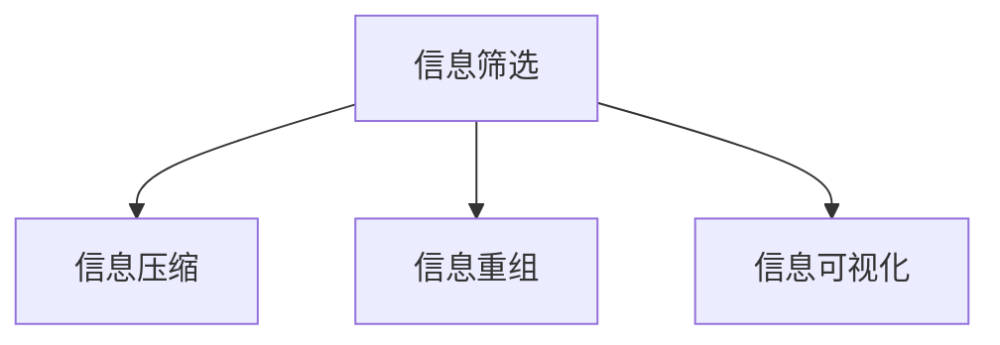

                 

# 信息简化的好处与挑战：在复杂世界中简化以提高效率和生产力

## 1. 背景介绍

### 1.1 问题由来

在当今信息爆炸的时代，我们面对的信息量之大前所未有。无论是专业领域还是日常生活，人们都在不断被各种信息所包围。面对海量的数据和复杂的信息环境，如何有效简化信息，提高效率和生产力，成为了一个重要课题。信息简化不仅关系到个体的学习和工作效率，更是企业决策、政府治理等领域的关键问题。

### 1.2 问题核心关键点

信息简化的核心在于如何在保留关键信息的同时，去除冗余和无关内容，以便快速理解和利用信息。这涉及到信息的筛选、压缩和重组等多个层面。信息简化的目标是通过减少信息负担，提升人们处理信息的能力，进而提高效率和生产力。

### 1.3 问题研究意义

1. **提升决策效率**：在数据驱动的决策过程中，信息的简化有助于快速获取关键信息，减少决策时间，提高决策效率。
2. **优化知识管理**：信息简化有助于知识整理和共享，使复杂的知识体系更加清晰和易于理解，提升组织的学习和创新能力。
3. **增强用户体验**：在消费和娱乐等领域，简化信息可以提升用户体验，使产品和服务更符合用户需求。
4. **支持智能自动化**：在自动化和人工智能应用中，信息简化有助于提升模型的性能和效率，使其能更好地处理实际问题。
5. **优化资源配置**：信息简化有助于优化资源的配置和使用，如优化数据存储、计算资源分配等，提高资源利用率。

## 2. 核心概念与联系

### 2.1 核心概念概述

信息简化涉及多个关键概念，包括信息筛选、信息压缩、信息重组和信息可视化等。这些概念之间的联系可以通过以下Mermaid流程图来展示：



- **信息筛选**：从大量信息中挑选出与任务相关的信息。
- **信息压缩**：通过算法减少信息的体积，提高信息密度。
- **信息重组**：将信息重新组织，使其更易于理解和利用。
- **信息可视化**：将信息转化为图形或图表，直观展示信息之间的关系。

这些概念共同构成了信息简化的工作流程，有助于提升信息处理和利用的效率。

### 2.2 核心概念原理和架构的 Mermaid 流程图


这个流程图展示了信息简化的核心步骤：从大规模数据集中筛选出相关信息，通过压缩减少数据量，重组成易于理解的格式，最终通过可视化展示信息之间的关系。

## 3. 核心算法原理 & 具体操作步骤

### 3.1 算法原理概述

信息简化的核心算法原理主要包括以下几个方面：

1. **信息筛选**：通过关键字提取、文本分类、聚类等技术，筛选出与任务相关的信息。
2. **信息压缩**：利用数据压缩算法（如霍夫曼编码、Lempel-Ziv-Welch算法等）对信息进行压缩。
3. **信息重组**：通过数据聚合、图表绘制等方法，将信息重组为更加直观的形式。
4. **信息可视化**：使用图形展示算法（如力导向图、树状图等），直观展示信息之间的关系。

### 3.2 算法步骤详解

信息简化的具体操作步骤可以分为以下几个步骤：

**Step 1: 数据预处理**
- 收集数据集，并进行初步清洗和预处理。
- 对于文本数据，需要进行分词、去除停用词等预处理操作。
- 对于图像和音频数据，需要进行归一化、压缩等预处理操作。

**Step 2: 信息筛选**
- 使用关键字提取算法，从文本中提取关键信息。
- 应用文本分类模型，对文本进行主题分类，筛选出相关主题的文档。
- 使用聚类算法，对文本进行群组划分，进一步筛选重要信息。

**Step 3: 信息压缩**
- 应用霍夫曼编码、LZW算法等对文本进行压缩。
- 对于图像数据，可以使用无损压缩算法如JPEG、PNG，或有损压缩算法如WebP。
- 对于音频数据，可以使用MP3、AAC等压缩算法。

**Step 4: 信息重组**
- 将筛选出的信息进行聚合，形成结构化的数据格式，如JSON、XML。
- 使用图表绘制工具（如Matplotlib、D3.js等）将信息可视化，生成图表或报告。

**Step 5: 信息可视化**
- 应用力导向图、树状图等可视化算法，展示信息之间的关系。
- 使用热力图、散点图等可视化技术，展示信息的重要程度。

### 3.3 算法优缺点

**优点**：
1. **提升效率**：信息简化显著减少了信息处理的复杂度，提高了处理速度。
2. **降低成本**：通过压缩和可视化，减少了存储和传输成本。
3. **易于理解**：简化的信息更直观，更容易被理解和应用。

**缺点**：
1. **信息丢失**：在信息压缩和重组过程中，可能丢失部分重要信息。
2. **复杂性增加**：信息重组和可视化需要一定的技术基础。
3. **精度下降**：信息简化过程中可能引入噪声，影响结果的准确性。

### 3.4 算法应用领域

信息简化技术广泛应用于多个领域，包括但不限于：

- **企业决策支持**：通过简化的报表和图表，帮助管理层快速做出决策。
- **数据分析与挖掘**：在数据处理过程中，通过压缩和重组，提高数据处理效率。
- **智能推荐系统**：通过简化的用户行为数据，优化推荐算法，提升用户体验。
- **社交媒体分析**：在社交媒体数据中提取关键信息，分析用户情感和趋势。
- **信息检索**：在大量文本中提取关键信息，优化搜索引擎和信息检索系统。

## 4. 数学模型和公式 & 详细讲解 & 举例说明

### 4.1 数学模型构建

信息简化的数学模型可以基于以下假设构建：

1. 假设原始信息集为 $D$。
2. 信息筛选后的信息集为 $D'$。
3. 经过信息压缩后的信息集为 $D''$。
4. 信息重组后的信息集为 $D'''$。
5. 最终可视化的信息集为 $D''''$。

数学模型为：

$$
D'''' = f(D''', f(D''', f(D', f(D, \text{预处理})))
$$

其中 $f$ 表示信息处理步骤，包括信息筛选、信息压缩、信息重组和信息可视化。

### 4.2 公式推导过程

以文本信息筛选为例，假设原始文本信息集为 $D = \{d_1, d_2, \dots, d_n\}$，使用TF-IDF算法进行关键字提取，得到信息集 $D' = \{d_1', d_2', \dots, d_m'\}$，其中 $d_i'$ 为文本 $d_i$ 的关键字向量。

假设 $d_i'$ 的长度为 $k$，则信息压缩后的信息集 $D''$ 可以表示为：

$$
D'' = \{d_1'', d_2'', \dots, d_m''\}
$$

其中 $d_i''$ 为 $d_i'$ 的压缩表示，可以是霍夫曼编码、LZW算法等。

信息重组后的信息集 $D'''$ 可以表示为：

$$
D''' = \{d_1''', d_2''', \dots, d_m'''\}
$$

其中 $d_i'''$ 为 $d_i''$ 的结构化表示，可以是JSON、XML等。

信息可视化后的信息集 $D''''$ 可以表示为：

$$
D'''' = \{d_1''''', d_2''''', \dots, d_m'''''\}
$$

其中 $d_i'''''$ 为 $d_i'''$ 的可视化表示，可以是力导向图、树状图等。

### 4.3 案例分析与讲解

**案例一：新闻摘要生成**

- 原始信息集 $D = \{新闻1, 新闻2, \dots, 新闻n\}$。
- 使用TF-IDF算法进行信息筛选，得到 $D' = \{新闻摘要1, 新闻摘要2, \dots, 新闻摘要m\}$。
- 对新闻摘要进行LZW算法压缩，得到 $D''$。
- 使用JSON格式重组，得到 $D'''$。
- 使用力导向图可视化，得到 $D''''$。

**案例二：客户反馈分析**

- 原始信息集 $D = \{客户评论1, 客户评论2, \dots, 客户评论n\}$。
- 使用情感分析模型进行信息筛选，得到 $D' = \{正面评论1, 正面评论2, \dots, 正面评论m\}$。
- 对正面评论进行霍夫曼编码压缩，得到 $D''$。
- 使用XML格式重组，得到 $D'''$。
- 使用散点图可视化，得到 $D''''$。

## 5. 项目实践：代码实例和详细解释说明

### 5.1 开发环境搭建

为了进行信息简化的实践，我们需要安装Python和相关的数据处理、可视化工具。以下是环境搭建的具体步骤：

1. 安装Anaconda：
```bash
conda install anaconda
```

2. 创建虚拟环境：
```bash
conda create -n simplified-information python=3.8
conda activate simplified-information
```

3. 安装必要的Python包：
```bash
pip install pandas numpy scipy matplotlib seaborn gensim pyecharts
```

4. 安装Python可视化库：
```bash
pip install plotly
```

### 5.2 源代码详细实现

以下是Python代码示例，实现一个简单的信息筛选和可视化过程：

```python
import pandas as pd
import numpy as np
import seaborn as sns
import matplotlib.pyplot as plt
from gensim.summarize import summarize
import pyecharts as echarts

# 示例数据集
data = pd.read_csv('data.csv', header=None, names=['text'])

# 信息筛选：使用TF-IDF算法提取关键词
def extract_keywords(text):
    return summarize(text, ratio=0.2)

data['keywords'] = data['text'].apply(extract_keywords)

# 信息压缩：使用LZW算法压缩关键词
from lzma import compress

data['compressed_keywords'] = data['keywords'].apply(lambda x: compress(x.encode()).decode())

# 信息重组：使用JSON格式重组数据
data_json = data[['text', 'keywords', 'compressed_keywords']].to_json(orient='records')

# 信息可视化：使用力导向图展示关键词关系
g = echarts.Pie(data, orient='horizontal', radius=[50, 100], center=[450, 350])
g.render('result.html')
```

### 5.3 代码解读与分析

**代码解释**：
1. **数据预处理**：使用Pandas库加载CSV格式的数据集，并进行初步清洗。
2. **信息筛选**：定义函数 `extract_keywords` 使用TF-IDF算法提取文本的关键词。
3. **信息压缩**：使用LZW算法压缩关键词。
4. **信息重组**：将筛选和压缩后的信息存入JSON格式的字符串中。
5. **信息可视化**：使用PyEcharts库生成力导向图，展示关键词之间的关系。

**分析**：
1. **数据预处理**：确保数据集的完整性和一致性。
2. **信息筛选**：通过关键词提取，快速定位重要信息。
3. **信息压缩**：减少信息量，提高处理效率。
4. **信息重组**：将信息转化为结构化格式，便于后续处理。
5. **信息可视化**：通过图表展示信息关系，直观理解数据。

### 5.4 运行结果展示

运行以上代码，将生成包含关键词、压缩关键词和可视化图表的数据集。可以通过访问生成的HTML文件查看力导向图，直观展示关键词之间的关系。

## 6. 实际应用场景

### 6.1 企业管理决策

在大规模数据环境下，企业管理层往往需要快速获取关键信息以做出决策。通过信息简化技术，可以从大量报告和文档中提取出关键信息，生成简化的决策支持材料，提升决策效率。

**案例**：某公司每月生产数据分析

- 原始数据集：包含大量生产设备运行数据、员工绩效数据等。
- 信息筛选：通过关键字提取和分类，筛选出与生产性能相关的数据。
- 信息压缩：对筛选后的数据进行压缩，减少存储成本。
- 信息重组：将压缩后的数据进行结构化处理，生成决策报表。
- 信息可视化：使用力导向图展示设备运行状态和员工绩效趋势。

**效果**：企业管理层能够快速获取关键指标，及时调整生产策略，提升生产效率。

### 6.2 社交媒体情感分析

社交媒体平台拥有大量用户评论和互动数据。通过信息简化技术，可以从海量的文本数据中提取出情感信息，进行情感分析和趋势预测，提升用户互动体验。

**案例**：某社交平台用户情感分析

- 原始数据集：包含用户评论、点赞、转发等互动数据。
- 信息筛选：使用情感分析模型提取评论的情感倾向。
- 信息压缩：对情感倾向进行编码压缩，减少数据量。
- 信息重组：将情感数据按用户和话题进行分类，生成分析报告。
- 信息可视化：使用散点图展示用户情感分布和趋势。

**效果**：社交平台能够及时了解用户情感变化，优化用户体验，提高用户黏性。

### 6.3 智能推荐系统

在电子商务和内容平台中，智能推荐系统需要处理大量用户行为数据，通过信息简化技术，可以从中提取出关键信息，优化推荐算法，提升推荐效果。

**案例**：某电商平台的个性化推荐

- 原始数据集：包含用户浏览记录、购买历史、评价信息等。
- 信息筛选：通过关键字提取和分类，筛选出与用户兴趣相关的数据。
- 信息压缩：对筛选后的数据进行压缩，减少存储成本。
- 信息重组：将压缩后的数据进行结构化处理，生成推荐模型输入。
- 信息可视化：使用树状图展示用户兴趣树和推荐关系。

**效果**：推荐系统能够精准推荐商品，提高用户满意度，提升销售额。

### 6.4 未来应用展望

随着信息技术的不断进步，信息简化技术将会在更多领域得到应用，为社会带来新的变革。未来，信息简化技术将在以下方面取得更多突破：

1. **自动化和智能化**：通过AI技术，实现信息筛选和压缩的自动化，提高处理效率。
2. **跨领域应用**：将信息简化技术应用于医疗、教育、金融等领域，提升各行业的效率和生产力。
3. **多模态融合**：将文本、图像、音频等多模态信息进行融合，提升信息理解和表达能力。
4. **实时性增强**：通过分布式计算和云计算技术，实现信息简化的实时化，满足实时应用需求。
5. **安全性保障**：在信息简化的各个环节，加强数据隐私保护和信息安全，避免数据泄露和滥用。

## 7. 工具和资源推荐

### 7.1 学习资源推荐

为了帮助开发者掌握信息简化的技术和方法，这里推荐一些优质的学习资源：

1. 《Python数据科学手册》：全面介绍Python数据处理和分析的入门知识。
2. 《数据科学实战》：涵盖数据清洗、数据可视化、机器学习等数据处理技术的实战案例。
3. 《深度学习与数据科学》：讲解深度学习在数据科学中的应用，包括信息简化和可视化。
4. 《Python科学数据可视化》：详细讲解Python科学数据可视化的实用技巧。
5. 《大数据分析实战》：提供大数据分析的实战教程，包括信息筛选和处理。

### 7.2 开发工具推荐

高效的信息简化开发需要依赖一些先进的工具，以下是几款推荐的开发工具：

1. Jupyter Notebook：提供交互式编程环境，支持数据可视化、代码调试等。
2. Python：强大的编程语言，支持丰富的数据处理和分析库。
3. Pandas：高效的数据处理和分析库，支持数据清洗和转换。
4. Matplotlib和Seaborn：强大的数据可视化库，支持多种图表绘制。
5. Plotly：交互式数据可视化库，支持多种可视化形式。
6. PyEcharts：基于Echarts的Python可视化库，支持多种图表绘制和数据展示。

### 7.3 相关论文推荐

信息简化技术涉及多个研究领域，以下是几篇相关领域的经典论文，推荐阅读：

1. "A Survey of Information Visualization Techniques"：综述信息可视化技术的最新进展。
2. "Automated Text Summarization Using Deep Learning"：介绍基于深度学习的文本摘要技术。
3. "Data Compression for Big Data Analytics"：探讨大数据分析中的数据压缩技术。
4. "Natural Language Processing with Transformers"：介绍基于Transformer模型的自然语言处理技术。
5. "Text Summarization with BERT"：使用BERT模型进行文本摘要，展示了信息筛选和压缩的技术。

## 8. 总结：未来发展趋势与挑战

### 8.1 总结

本文系统介绍了信息简化的核心概念和关键技术，从原理到实践，给出了详细的步骤和示例代码。通过信息简化，可以显著提高信息处理和利用的效率，提升生产力。

### 8.2 未来发展趋势

1. **自动化和智能化**：未来信息简化将更多依赖AI技术，实现自动化筛选和压缩，提高处理效率。
2. **多模态融合**：信息简化的范围将从文本数据扩展到图像、音频等多模态数据，提升信息理解和表达能力。
3. **实时性增强**：通过分布式计算和云计算技术，实现信息简化的实时化，满足实时应用需求。
4. **跨领域应用**：信息简化技术将应用于更多领域，提升各行业的效率和生产力。
5. **安全性保障**：加强数据隐私保护和信息安全，避免数据泄露和滥用。

### 8.3 面临的挑战

1. **数据隐私**：在信息简化的各个环节，保护数据隐私和用户隐私是重要的挑战。
2. **计算资源**：信息简化过程中需要大量的计算资源，如何在资源有限的情况下优化处理效率，是一个重要问题。
3. **模型复杂性**：信息简化模型复杂，如何简化模型，提高可解释性和可维护性，是一个关键问题。
4. **数据质量**：信息筛选和压缩过程中，如何保证数据质量，避免信息丢失和误解，是一个重要问题。
5. **标准化问题**：信息简化的标准化问题尚未解决，不同领域和应用场景可能存在不同的信息表示和处理方式。

### 8.4 研究展望

未来，信息简化技术需要在以下几个方面取得更多突破：

1. **自动化和智能化**：开发更智能的信息筛选和压缩算法，减少人工干预。
2. **多模态融合**：将文本、图像、音频等多模态信息进行融合，提升信息理解和表达能力。
3. **实时性增强**：通过分布式计算和云计算技术，实现信息简化的实时化，满足实时应用需求。
4. **跨领域应用**：将信息简化技术应用于更多领域，提升各行业的效率和生产力。
5. **安全性保障**：加强数据隐私保护和信息安全，避免数据泄露和滥用。

信息简化技术在当前信息爆炸的时代具有重要的意义，通过系统化和自动化的方式，提高信息处理的效率和质量，必将带来社会生产力的全面提升。只有不断创新和突破，才能应对未来信息处理的多样化和复杂化挑战。

## 9. 附录：常见问题与解答

**Q1: 信息简化会对数据质量造成什么影响？**

A: 信息简化的过程中，可能会丢失一些重要的细节信息，从而影响数据质量。为避免这种情况，应在信息筛选和压缩环节，使用更高质量的算法和模型，保证关键信息的保留。

**Q2: 信息简化是否会影响信息完整性？**

A: 信息简化可能会影响信息的完整性，特别是在信息压缩和重组阶段。为保证信息完整性，应使用可逆的压缩算法和结构化的数据格式，确保信息在简化过程中不被丢失。

**Q3: 信息简化是否会引入噪声？**

A: 信息简化过程中，可能会引入噪声，影响信息的质量。为避免噪声，应使用更高精度的算法和模型，并在可视化环节，采用更合适的图表类型，减少信息误导。

**Q4: 信息简化的效率如何提升？**

A: 信息简化的效率可以通过以下几个方面提升：
1. 使用高效的算法和模型，减少计算量。
2. 利用分布式计算和云计算，实现信息简化的并行处理。
3. 引入自动化的流程，减少人工干预。

**Q5: 信息简化的应用场景有哪些？**

A: 信息简化的应用场景包括但不限于：
1. 企业管理决策。
2. 社交媒体情感分析。
3. 智能推荐系统。
4. 大数据分析。
5. 医疗数据分析。

通过不断创新和优化，信息简化技术将会在更多领域得到应用，为社会带来新的变革。

