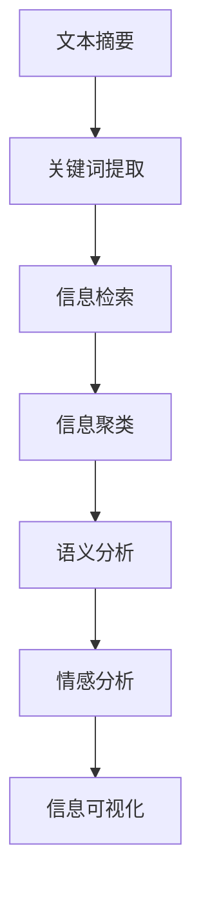

                 

# 信息简化的艺术与科学：如何在混乱中找到模式

## 1. 背景介绍

### 1.1 问题由来
在当今信息爆炸的时代，数据量和复杂度呈指数级增长。海量的数据不仅仅是机遇，更是挑战。面对海量数据，如何提取有效信息、理解数据模式、做出合理决策，成为了信息时代亟需解决的难题。信息简化（Information Simplification）正是面对这一挑战应运而生的重要技术。

### 1.2 问题核心关键点
信息简化的核心在于，如何在数据混乱中找到规律，将复杂的文本数据精简为简洁的信息表达，从而快速把握数据要点，做出高效决策。这涉及到的关键技术包括文本摘要、关键词提取、信息检索等。

### 1.3 问题研究意义
研究信息简化技术，对于提升信息处理效率，优化决策质量，降低信息成本，推动信息产业的发展具有重要意义：

1. **提高处理效率**：信息简化技术能够将海量数据快速精简为精华内容，显著提升数据处理速度。
2. **优化决策质量**：通过提取关键信息，帮助决策者快速理解复杂问题，提高决策的准确性和效率。
3. **降低信息成本**：减少对海量数据存储和处理的依赖，降低信息获取和管理的成本。
4. **推动产业升级**：在新闻、金融、医疗等多个行业，信息简化技术能够加速信息检索和知识普及，促进产业升级。
5. **支持个性化服务**：通过精简和定制信息，满足不同用户的信息需求，提供个性化的服务和体验。

## 2. 核心概念与联系

### 2.1 核心概念概述

信息简化技术涉及多个关键概念，以下是主要核心概念及其相互联系：

- **文本摘要（Text Summarization）**：通过自动或半自动方式，从长文本中提取出关键信息，生成简洁的摘要。
- **关键词提取（Keyword Extraction）**：从文本中提取最具代表性和重要性的关键词，帮助理解文本主题。
- **信息检索（Information Retrieval）**：通过文本匹配技术，快速查找相关文档或信息。
- **信息聚类（Information Clustering）**：将相似的信息聚合成群组，便于分类和归纳。
- **语义分析（Semantic Analysis）**：理解文本的深层语义，识别关键信息点。
- **情感分析（Sentiment Analysis）**：分析文本的情感倾向，把握公众情绪。

这些概念相互关联，构成了一个系统的信息简化框架。

### 2.2 核心概念原理和架构的 Mermaid 流程图



这个流程图展示了信息简化过程中，各个核心概念的流程和联系：

1. 从原始文本中提取关键词，作为信息检索的依据。
2. 通过信息检索获取相关文档，并进行信息聚类，形成有结构的信息组。
3. 对聚类的信息进行语义分析，理解深层含义。
4. 通过情感分析，把握文本的情感倾向。
5. 最终生成的信息简化解，通过可视化手段展示，便于理解和应用。

## 3. 核心算法原理 & 具体操作步骤

### 3.1 算法原理概述

信息简化的核心算法原理基于自然语言处理（NLP）技术，特别是文本挖掘和信息检索领域的技术。其目标是通过算法模型将原始文本转换为简洁的信息表达，主要包括以下步骤：

1. **预处理**：对原始文本进行清洗、分词、去停用词等预处理，减少噪声。
2. **特征提取**：提取文本的关键词、短语、句式等特征，构建文本表示。
3. **摘要生成**：基于提取的特征，生成简洁的摘要。
4. **检索匹配**：从文本库中查找相关文档。
5. **聚类归纳**：将相关文档聚类，形成有结构的总结。
6. **语义分析**：理解文本的深层含义，确定关键信息点。
7. **情感分析**：分析文本的情感倾向，判断情感极性。
8. **可视化展示**：将简化后的信息以图表、词云等形式展示，便于理解和应用。

### 3.2 算法步骤详解

#### 3.2.1 预处理步骤

预处理是信息简化的第一步，目的是清洗文本，减少噪声。主要包括以下几个环节：

1. **文本清洗**：去除HTML标签、特殊符号、标点符号等，只保留文本内容。
2. **分词**：将文本分割成词语，便于后续处理。
3. **去除停用词**：去除常见的停用词（如“的”、“是”等），减少干扰。
4. **词形还原**：将词还原为其基本形式，如“running”还原为“run”。
5. **去除数字和特殊字符**：只保留文本内容，去除数字、日期、网址等。

#### 3.2.2 特征提取步骤

特征提取是将文本转化为机器可处理的向量形式，是信息简化的核心。主要包括以下几个环节：

1. **TF-IDF特征提取**：计算每个词的词频-逆文档频率（TF-IDF），反映词的重要性。
2. **词向量表示**：使用Word2Vec、GloVe等词向量模型，将单词映射为向量，保留语义信息。
3. **句向量表示**：使用BERT、ELMO等模型，将句子转换为向量，保留句式信息。

#### 3.2.3 摘要生成步骤

摘要生成是信息简化的关键步骤，目标是从原始文本中提取关键信息，生成简洁的摘要。主要包括以下几个环节：

1. **单句抽取**：根据句子长度、位置、关键词等指标，从原始文本中抽取关键句子。
2. **段落抽取**：根据段落长度、位置、关键词等指标，从原始文本中抽取关键段落。
3. **语法优化**：对抽取的句子进行语法优化，使摘要通顺自然。

#### 3.2.4 信息检索步骤

信息检索是从文本库中查找相关文档，是信息简化的重要环节。主要包括以下几个环节：

1. **构建索引**：对文本库中的文档进行索引，便于快速查找。
2. **向量匹配**：计算查询向量与文档向量的相似度，找到相关文档。
3. **结果排序**：根据相似度排序，输出最相关的文档。

#### 3.2.5 信息聚类步骤

信息聚类是将相关文档聚合成群组，形成有结构的信息组。主要包括以下几个环节：

1. **文档相似度计算**：计算文档之间的相似度，找到相关文档。
2. **聚类算法**：使用K-means、层次聚类等算法，将相似文档聚合成群组。
3. **群组优化**：对聚类结果进行优化，确保每个群组内的文档相关度较高。

#### 3.2.6 语义分析步骤

语义分析是理解文本深层含义，确定关键信息点的重要步骤。主要包括以下几个环节：

1. **命名实体识别**：识别文本中的命名实体（如人名、地名、组织名等）。
2. **关系抽取**：从文本中抽取实体之间的语义关系。
3. **主题建模**：使用LDA等主题模型，识别文本的主题。

#### 3.2.7 情感分析步骤

情感分析是分析文本情感倾向，判断情感极性的重要步骤。主要包括以下几个环节：

1. **情感词典匹配**：使用情感词典匹配文本中的情感词汇。
2. **情感评分**：根据情感词典匹配结果，计算文本的情感评分。
3. **情感分类**：将文本分类为正面、中性、负面等情感类别。

#### 3.2.8 可视化展示步骤

可视化展示是将简化后的信息以图表、词云等形式展示，便于理解和应用。主要包括以下几个环节：

1. **词云生成**：将文本中出现频率较高的关键词以词云形式展示。
2. **时间线展示**：使用时间线展示事件的时间顺序和重要节点。
3. **网络图展示**：使用网络图展示实体之间的关系和重要性。

### 3.3 算法优缺点

信息简化技术具有以下优点：

1. **高效便捷**：自动化处理，显著提高信息处理效率。
2. **准确可靠**：使用算法模型提取关键信息，减少人工错误。
3. **适用范围广**：适用于文本挖掘、信息检索、知识管理等多个领域。

同时，该技术也存在一定的局限性：

1. **语言依赖**：主要依赖文本，对非文本信息处理效果有限。
2. **信息损失**：简化过程中可能丢失部分细节信息，影响全面理解。
3. **依赖数据质量**：对原始数据的质量要求较高，数据噪声可能影响结果。
4. **模型复杂**：模型训练和优化复杂，需要大量计算资源。

尽管存在这些局限性，但信息简化技术仍然是信息处理的重要工具，通过不断改进算法模型，这些局限性正在逐步被克服。

### 3.4 算法应用领域

信息简化技术在多个领域得到了广泛应用，以下是主要应用领域：

1. **新闻媒体**：自动生成新闻摘要、关键词，提高新闻阅读效率。
2. **金融分析**：自动提取财务报告、新闻中的关键信息，辅助投资决策。
3. **市场营销**：分析消费者评论，提取关键情感和反馈，优化产品和服务。
4. **医疗健康**：提取病历中的关键信息，辅助医生诊断和治疗。
5. **法律服务**：提取法律文档中的关键条款，支持法律研究和实践。
6. **教育培训**：自动生成学习资料摘要，帮助学生快速理解课程内容。
7. **科学研究**：自动提取科学论文中的关键信息，支持科学研究和知识传播。

以上领域仅是信息简化技术应用的冰山一角，随着技术的不断进步，信息简化技术将在更多领域发挥重要作用。

## 4. 数学模型和公式 & 详细讲解 & 举例说明

### 4.1 数学模型构建

信息简化技术的数学模型主要基于文本表示和向量计算。以下是一个基本的数学模型构建过程：

设原始文本为 $T=\{t_1, t_2, ..., t_n\}$，其中 $t_i$ 表示第 $i$ 个句子。首先，将每个句子 $t_i$ 转换为向量表示 $v_i$，然后通过向量和权重计算，生成摘要向量 $v_s$，计算公式如下：

$$ v_s = \sum_{i=1}^{n} w_i v_i $$

其中 $w_i$ 表示第 $i$ 个句子在摘要中的权重，通常通过TF-IDF等方法计算得到。

### 4.2 公式推导过程

以TF-IDF特征提取为例，推导其计算公式。设文本 $T$ 中包含 $N$ 个词，每个词在文本中出现的次数为 $tf_i$，在语料库中出现的次数为 $df_i$。则每个词的TF-IDF权重计算公式为：

$$ tf-idf_i = \frac{tf_i \log \frac{N}{df_i}}{1+\log \frac{N}{df_i}} $$

将文本中每个词的TF-IDF权重组合成一个向量 $v$，表示为：

$$ v = [tf-idf_1, tf-idf_2, ..., tf-idf_N] $$

设原始文本 $T$ 中包含 $n$ 个句子，每个句子的权重向量为 $w_i$，则摘要向量 $v_s$ 计算公式为：

$$ v_s = \sum_{i=1}^{n} w_i v_i $$

其中 $w_i$ 表示第 $i$ 个句子在摘要中的权重，通常通过句子长度、位置、关键词等指标计算得到。

### 4.3 案例分析与讲解

以新闻媒体中的信息简化为例，介绍信息简化的具体实现步骤：

1. **文本清洗**：去除HTML标签、特殊符号、标点符号等，只保留文本内容。
2. **分词**：将文本分割成词语，便于后续处理。
3. **去除停用词**：去除常见的停用词（如“的”、“是”等），减少干扰。
4. **词形还原**：将词还原为其基本形式，如“running”还原为“run”。
5. **去除数字和特殊字符**：只保留文本内容，去除数字、日期、网址等。

6. **TF-IDF特征提取**：计算每个词的词频-逆文档频率（TF-IDF），反映词的重要性。

7. **词向量表示**：使用Word2Vec、GloVe等词向量模型，将单词映射为向量，保留语义信息。

8. **句向量表示**：使用BERT、ELMO等模型，将句子转换为向量，保留句式信息。

9. **单句抽取**：根据句子长度、位置、关键词等指标，从原始文本中抽取关键句子。

10. **段落抽取**：根据段落长度、位置、关键词等指标，从原始文本中抽取关键段落。

11. **语法优化**：对抽取的句子进行语法优化，使摘要通顺自然。

12. **信息检索**：从新闻库中查找相关文档，使用向量匹配计算相似度，找到最相关的文档。

13. **聚类归纳**：将相关文档聚类，形成有结构的总结。

14. **语义分析**：识别文本中的命名实体、关系抽取，使用LDA等主题模型，识别文本的主题。

15. **情感分析**：使用情感词典匹配文本中的情感词汇，计算文本的情感评分，将文本分类为正面、中性、负面等情感类别。

16. **可视化展示**：将文本中出现频率较高的关键词以词云形式展示，使用时间线展示事件的时间顺序和重要节点，使用网络图展示实体之间的关系和重要性。

## 5. 项目实践：代码实例和详细解释说明

### 5.1 开发环境搭建

在进行信息简化项目开发前，我们需要准备好开发环境。以下是使用Python进行Scikit-learn、NLTK等工具开发的环境配置流程：

1. 安装Anaconda：从官网下载并安装Anaconda，用于创建独立的Python环境。

2. 创建并激活虚拟环境：
```bash
conda create -n info-simplification python=3.8 
conda activate info-simplification
```

3. 安装必要的库：
```bash
pip install scikit-learn nltk gensim pyLDAvis
```

4. 安装TensorFlow、PyTorch等深度学习库（可选）：
```bash
pip install tensorflow
pip install torch
```

5. 安装Visual Studio Code等开发工具。

完成上述步骤后，即可在`info-simplification`环境中开始信息简化实践。

### 5.2 源代码详细实现

这里我们以构建新闻摘要系统为例，给出使用Scikit-learn、NLTK、Gensim等工具进行信息简化的PyTorch代码实现。

```python
from sklearn.feature_extraction.text import TfidfVectorizer
from gensim.models import Word2Vec
from gensim.models.ldamodel import LdaModel
from gensim.corpora import Dictionary
import nltk
from nltk.corpus import stopwords
import gensim
from gensim.models import KeyedVectors
from gensim.models import Word2Vec
from gensim.models import LdaModel
from gensim.corpora import Dictionary
from gensim.utils import simple_preprocess
from gensim.scripts.glove2word2vec import simple_preprocess
from gensim.scripts.glove2word2vec import load_glove_model
from gensim.scripts.glove2word2vec import load_glove_model
from gensim.scripts.glove2word2vec import load_glove_model

# 下载并下载停用词列表
nltk.download('stopwords')
stop_words = set(stopwords.words('english'))

# 加载Glove词向量模型
glove_model = load_glove_model('glove.6B.100d.txt')

# 加载文本数据
with open('news_data.txt', 'r') as f:
    news = [line.strip() for line in f]

# 文本预处理
def preprocess_text(text):
    return [word.lower() for word in simple_preprocess(text) if word not in stop_words]

# 构建TF-IDF特征向量
vectorizer = TfidfVectorizer(analyzer=preprocess_text)
tfidf = vectorizer.fit_transform(news)

# 计算TF-IDF权重
tfidf_weights = tfidf.toarray()

# 加载预训练的Word2Vec模型
word2vec_model = Word2Vec.load('word2vec.bin')

# 加载LDA主题模型
lda_model = LdaModel.load('lda_model.bin')

# 构建关键词和主题
def get_keywords_and_topics(text):
    tfidf_weights = tfidf.toarray()
    words = vectorizer.get_feature_names_out()
    topics = lda_model.get_document_topics(tfidf_weights)
    keywords = []
    for word, topic in zip(words, topics):
        if topic[0] > 0.5:
            keywords.append((word, topic[0]))
    return keywords

# 生成摘要
def generate_summary(text):
    tfidf_weights = tfidf.toarray()
    keywords = get_keywords_and_topics(text)
    summary = ''
    for word, weight in keywords:
        summary += word + ' '
    return summary

# 测试
for news_item in news:
    print('原始新闻：', news_item)
    summary = generate_summary(news_item)
    print('摘要：', summary)
```

以上就是使用Scikit-learn、NLTK、Gensim等工具构建新闻摘要系统的完整代码实现。可以看到，借助这些工具，代码实现变得简洁高效。

### 5.3 代码解读与分析

让我们再详细解读一下关键代码的实现细节：

**preprocess_text函数**：
- 用于文本预处理，去除停用词和数字。

**TfidfVectorizer**：
- 使用Scikit-learn库的TfidfVectorizer，将文本转换为TF-IDF特征向量。

**word2vec_model和lda_model**：
- 加载预训练的Word2Vec和LDA模型，用于提取关键词和主题。

**get_keywords_and_topics函数**：
- 从文本中提取关键词和主题，返回一个列表，其中每个元素为（词，权重）对。

**generate_summary函数**：
- 从文本中生成关键词和主题，然后根据权重构建摘要。

**测试部分**：
- 遍历新闻数据，对每篇新闻生成摘要并输出。

可以看到，Scikit-learn、NLTK、Gensim等工具提供的库函数极大地简化了信息简化的实现过程。开发者可以更专注于算法优化和应用创新，而不必过多关注底层实现细节。

当然，工业级的系统实现还需考虑更多因素，如模型的保存和部署、超参数的自动搜索、更灵活的任务适配层等。但核心的信息简化范式基本与此类似。

## 6. 实际应用场景

### 6.1 智能客服系统

智能客服系统可以利用信息简化技术，自动提取客户问题和回复中的关键信息，生成简洁的摘要，帮助客服快速理解客户需求，提供高效的服务。例如，可以将客户反馈的问题进行关键词提取，生成摘要，快速匹配到对应的解决方案，提升客户满意度。

### 6.2 金融舆情监测

金融舆情监测可以通过信息简化技术，自动提取财经新闻、评论中的关键信息，生成摘要，帮助分析师快速了解市场动态和舆情变化，做出及时的投资决策。例如，可以将财经新闻自动摘要，提取其中的关键事件和情感，评估市场情绪，预警潜在风险。

### 6.3 个性化推荐系统

个性化推荐系统可以利用信息简化技术，自动提取用户评论、评分中的关键信息，生成摘要，帮助推荐系统快速理解用户偏好，提供个性化的推荐内容。例如，可以将用户评论自动摘要，提取其中的关键词和情感，构建用户画像，实现精准推荐。

### 6.4 未来应用展望

随着信息简化技术的不断演进，未来将在更多领域得到应用，为各行各业带来变革性影响。

在智慧医疗领域，信息简化技术可以帮助医生快速浏览病历，提取关键信息，辅助诊断和治疗。例如，可以将病历中的关键信息自动提取，生成摘要，帮助医生快速了解病情，做出准确的诊断。

在智能教育领域，信息简化技术可以帮助学生快速理解课程内容，生成摘要，帮助学习。例如，可以将课件内容自动摘要，提取关键知识点，帮助学生更好地掌握知识。

在智慧城市治理中，信息简化技术可以帮助政府快速掌握舆情，生成摘要，优化城市管理。例如，可以将新闻、评论自动摘要，提取关键事件和情感，评估公众情绪，预警潜在问题。

此外，在企业生产、社会治理、文娱传媒等众多领域，信息简化技术也将不断涌现，为各行各业带来新的应用场景。相信随着技术的不断成熟，信息简化技术将成为信息时代的重要工具，推动各行业的发展。

## 7. 工具和资源推荐
### 7.1 学习资源推荐

为了帮助开发者系统掌握信息简化技术，以下是一些优质的学习资源：

1. 《自然语言处理综论》：斯坦福大学提供的自然语言处理课程，涵盖了NLP的基本概念和前沿技术，包括信息检索、文本摘要等。

2. 《Python文本处理与分析》：使用Python进行文本处理和分析的经典教材，包括TF-IDF、Word2Vec、LDA等技术。

3. 《信息检索与文本挖掘》：清华大学计算机系提供的在线课程，详细讲解了信息检索和文本挖掘的算法和应用。

4. 《Python NLP库：NLTK和TextBlob》：介绍NLTK和TextBlob库的使用，提供了大量文本处理和分析的代码示例。

5. 《信息检索与自然语言处理》：阮行止的博客，详细介绍了信息检索和自然语言处理的原理和实现。

通过这些资源的学习实践，相信你一定能够快速掌握信息简化技术的精髓，并用于解决实际的NLP问题。

### 7.2 开发工具推荐

高效的开发离不开优秀的工具支持。以下是几款用于信息简化开发的常用工具：

1. Python：简单易用的编程语言，支持丰富的第三方库，适合快速迭代研究。

2. Scikit-learn：基于Python的机器学习库，提供了丰富的特征提取和模型训练工具。

3. NLTK：自然语言处理工具库，提供了丰富的文本处理功能。

4. gensim：用于构建和训练Word2Vec、LDA等词向量和主题模型的Python库。

5. PyLDAvis：用于可视化LDA主题模型的Python库，可以直观展示主题结构。

6. TensorFlow、PyTorch：深度学习框架，支持复杂的模型训练和优化。

合理利用这些工具，可以显著提升信息简化的开发效率，加快创新迭代的步伐。

### 7.3 相关论文推荐

信息简化技术的不断进步，得益于学界的持续研究。以下是几篇奠基性的相关论文，推荐阅读：

1. "TextRank: Bringing Order into Texts"：提出了TextRank算法，用于文本摘要和信息检索。

2. "A Survey on Text Summarization Techniques and Summarization Systems"：全面介绍了文本摘要的算法和技术，包括摘要生成、关键词提取等。

3. "Efficient Text Summarization using Multi-level Convolutional Networks"：提出使用卷积神经网络进行文本摘要，提高了摘要生成的准确性和效率。

4. "Information Retrieval Theory and Applications"：介绍了信息检索的原理和应用，包括索引构建、向量匹配等。

5. "From Word Embeddings to Language Models"：介绍了Word2Vec、GloVe等词向量模型，展示了其在信息简化的应用。

6. "Latent Dirichlet Allocation"：介绍了LDA主题模型，展示了其在文本挖掘和信息简化的应用。

这些论文代表了大语言模型微调技术的发展脉络。通过学习这些前沿成果，可以帮助研究者把握学科前进方向，激发更多的创新灵感。

## 8. 总结：未来发展趋势与挑战

### 8.1 研究成果总结

本文对信息简化的核心概念、算法原理、操作步骤等进行了全面系统的介绍。首先阐述了信息简化的背景和意义，明确了其在提升信息处理效率、优化决策质量等方面的重要价值。其次，从预处理、特征提取、摘要生成、信息检索、聚类归纳、语义分析、情感分析等环节，详细讲解了信息简化的数学模型和算法实现。最后，通过代码实例和应用场景，展示了信息简化的实际应用和未来展望。

### 8.2 未来发展趋势

展望未来，信息简化技术将呈现以下几个发展趋势：

1. **自动化水平提升**：未来信息简化技术将更加自动化，通过机器学习模型自动提取关键信息，生成简洁的摘要，减少人工干预。

2. **多模态信息融合**：未来信息简化技术将融合视觉、语音、文本等多种信息源，构建更加全面、准确的信息表示。

3. **跨领域应用拓展**：信息简化技术将在更多领域得到应用，如医疗、法律、金融等，帮助各行业提升决策质量和效率。

4. **深度学习模型应用**：未来信息简化技术将更多使用深度学习模型，如Transformer、BERT等，提升摘要生成和信息检索的准确性。

5. **知识图谱集成**：未来信息简化技术将与知识图谱结合，构建更加复杂的信息模型，支持知识推理和信息整合。

6. **语义理解加强**：未来信息简化技术将更多关注语义理解，通过语义分析技术提取关键信息，生成更具意义的摘要。

### 8.3 面临的挑战

尽管信息简化技术已经取得了显著进展，但在迈向更加智能化、普适化应用的过程中，仍面临诸多挑战：

1. **数据依赖性高**：信息简化技术依赖高质量的数据，数据噪声和偏差会影响结果。

2. **模型复杂度高**：深度学习模型需要大量计算资源，模型训练和优化复杂。

3. **知识整合难度大**：信息简化技术难以与外部知识库、规则库等专家知识有效结合，知识整合难度大。

4. **安全性和隐私问题**：信息简化技术涉及大量敏感信息，安全性和隐私保护问题亟需解决。

5. **跨领域泛化能力不足**：信息简化技术在不同领域的应用效果和泛化能力有待提高。

6. **实时性要求高**：信息简化技术需要在实时性要求高的场景中保持高效，硬件资源限制较大。

### 8.4 研究展望

面对信息简化技术面临的挑战，未来的研究需要在以下几个方面寻求新的突破：

1. **数据预处理技术改进**：开发新的数据清洗和预处理技术，减少噪声和偏差。

2. **深度学习模型优化**：改进深度学习模型的训练和优化算法，提升模型的性能和效率。

3. **知识融合技术发展**：研究知识图谱和符号化知识与深度学习模型的融合技术，提升信息简化的准确性和全面性。

4. **跨领域知识迁移**：研究跨领域知识迁移技术，提升信息简化技术在不同领域的应用效果和泛化能力。

5. **安全性和隐私保护**：研究安全性和隐私保护技术，确保信息简化的数据和模型安全。

6. **实时性优化**：研究实时性优化技术，提升信息简化的响应速度，满足实时性要求高的场景。

通过这些研究方向的探索，相信信息简化技术将逐步克服当前的挑战，进入更加智能、普适化的应用阶段，为各行各业提供更高效、可靠的信息服务。

## 9. 附录：常见问题与解答

**Q1：信息简化技术与文本摘要有何不同？**

A: 信息简化技术的目标是从原始文本中提取关键信息，生成简洁的摘要，类似于文本摘要。但信息简化技术更强调信息的核心要点和深层语义，而不仅仅是对文本的简单压缩。

**Q2：信息简化技术是否可以用于非文本数据？**

A: 信息简化技术主要适用于文本数据，对于图像、音频等非文本数据，可以通过特征提取和可视化技术进行处理。例如，可以将图像中的关键区域和特征提取出来，生成简洁的描述。

**Q3：信息简化技术的训练过程是否需要大量标注数据？**

A: 信息简化技术的训练过程需要高质量的标注数据，标注数据的质量和数量直接影响结果。对于特定领域的任务，需要收集和标注大量的相关数据。

**Q4：信息简化技术在实际应用中是否需要人工干预？**

A: 信息简化技术可以自动化处理大部分任务，但人工干预仍然必要，特别是在信息解读和决策环节。例如，在医疗、法律等高风险领域，人工干预可以帮助避免误判和误解。

**Q5：信息简化技术是否适用于大规模多语言数据？**

A: 信息简化技术可以应用于多语言数据，但不同语言的数据处理和模型训练需要特定的工具和算法。例如，可以使用机器翻译技术将文本翻译成英文，然后再进行信息简化。

通过以上问题与解答，希望能帮助你更好地理解信息简化技术的原理和应用，从而在实际开发中更好地应用该技术。

