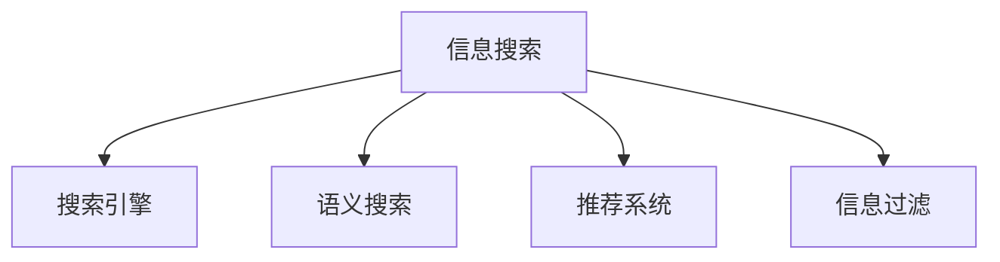

                 

# 信息过载与信息搜索策略与指南：在庞大的信息海洋中找到所需信息

在现代社会，信息的生产速度和总量已经远远超出了人类处理和吸收的能力范围。网络技术的发展，使得信息几乎可以瞬时覆盖全球，信息过载（Information Overload）成为不可避免的问题。面对海量的信息，如何高效地搜索、筛选和利用信息，成为了现代人和企业都需要解决的挑战。本文将深入探讨信息过载的背景，介绍信息搜索的关键概念和技术，并给出具体的搜索策略与指南，帮助你在庞大的信息海洋中找到所需的信息。

## 1. 背景介绍

### 1.1 问题由来

互联网时代，信息的产生和传播方式发生了革命性的变化。传统的书籍、报纸等媒介被搜索引擎、社交网络、博客、论坛、新闻网站等在线平台所取代。搜索引擎如Google、Bing等，信息量更是以指数级别增长。尽管信息的多样性极大地丰富了人们获取知识的方式，但同时也造成了信息过载。

### 1.2 问题核心关键点

信息过载的核心在于，信息量远远超过个人或系统的处理能力，导致用户无法有效筛选出对自己有用的信息。具体表现包括：
- **信息泛滥**：网页数量爆炸性增长，搜索引擎结果列表中很难找到有用的信息。
- **注意力分散**：信息过载使得用户容易陷入浏览无效信息或重复内容的陷阱，难以集中精力在重要信息上。
- **决策困难**：面对大量信息，用户需要耗费更多的时间和精力进行信息筛选和判断，决策难度增加。
- **知识退化**：信息过载导致人们难以通过阅读获得有深度的知识，反倒容易陷入表面信息的陷阱。

### 1.3 问题研究意义

信息过载问题的研究意义在于，通过有效的信息搜索和筛选技术，帮助用户提高信息获取的效率和质量。特别是对于企业和专业人士，信息搜索能力的提升将直接影响工作效率和决策质量。

## 2. 核心概念与联系

### 2.1 核心概念概述

为更好地理解信息搜索技术，本节将介绍几个核心概念：

- **信息搜索**：通过特定的查询词或问题，在数据库、网站、文献等海量的信息集合中，快速定位出相关的信息。信息搜索技术旨在提升信息检索的速度和准确性。
- **搜索引擎**：一种信息检索系统，使用自然语言查询，在互联网数据库中搜索匹配信息并返回给用户。主流搜索引擎如Google、Bing、DuckDuckGo等。
- **语义搜索**：基于自然语言理解和信息提取技术，理解查询词的真实意图和上下文，返回更加准确的结果。与传统的关键词匹配相比，语义搜索可以处理更加复杂的查询。
- **推荐系统**：通过分析用户的历史行为和兴趣，推荐可能对用户有用的信息。推荐系统常用于电商、视频、音乐等领域，提升用户体验。
- **信息过滤**：在搜索结果中去除不相关或不重要的信息，增强信息的相关性和针对性。信息过滤技术可包括基于规则的过滤、机器学习过滤等。

这些核心概念之间的逻辑关系可以通过以下Mermaid流程图来展示：



这个流程图展示的信息搜索的核心概念及其之间的关系：

1. 信息搜索通过搜索引擎、语义搜索等方式，在互联网数据库中寻找相关信息。
2. 语义搜索通过理解自然语言，返回更加精准的结果。
3. 推荐系统根据用户历史行为，推荐可能感兴趣的信息。
4. 信息过滤去除无关信息，增强结果的相关性和针对性。

## 3. 核心算法原理 & 具体操作步骤

### 3.1 算法原理概述

信息搜索的本质是信息检索，旨在从大规模信息集合中快速找到与查询词相关的内容。常见的信息检索方法包括关键词匹配、向量空间模型、语言模型、深度学习等。

关键词匹配是最简单的检索方法，通过将查询词与数据库中的所有文本进行匹配，返回包含查询词的文档。向量空间模型通过将文本转化为向量，计算查询词与文本向量的距离，返回距离最近的文档。语言模型通过统计语言规律，计算查询词与文档之间的匹配概率。深度学习通过构建神经网络模型，学习更加复杂的语言表示，提升检索效果。

### 3.2 算法步骤详解

信息搜索的一般步骤如下：

1. **数据预处理**：将待检索的文档进行分词、去除停用词、构建倒排索引等预处理操作。
2. **查询词解析**：使用自然语言处理技术，理解查询词的意图和上下文，生成查询向量。
3. **文档评分**：将查询向量与文档向量进行相似度计算，得到文档评分。
4. **结果排序**：根据文档评分对搜索结果进行排序，返回前N个文档。

其中，查询词解析和文档评分是信息搜索的核心步骤。查询词解析技术包括：

- 分词：将自然语言分解成词语或词组。
- 词向量表示：使用词嵌入技术将词语映射为向量，便于计算相似度。
- 意图识别：使用机器学习技术，识别用户查询的真实意图。

文档评分技术包括：

- 余弦相似度：计算查询词与文档向量的余弦距离。
- TF-IDF：计算词语在文档中出现的频率和文档的重要性。
- BM25：通过文本长度和单词频率进行文档评分。

### 3.3 算法优缺点

信息搜索技术有以下优点：
- 高效快速：能够快速检索出大量相关文档。
- 高度可定制：通过不同的检索方法，可以适应不同的应用场景。
- 准确性高：随着技术进步，检索系统的准确性不断提升。

同时，信息搜索技术也存在以下局限：
- 依赖查询词：查询词的表达方式对检索结果有很大影响。
- 泛化能力有限：针对特定的查询词，检索效果较优，但对于非特定查询词泛化能力不足。
- 复杂查询处理困难：复杂的查询往往需要更多的计算资源和时间。
- 结果排序策略：排序策略的选择对检索结果有较大影响，需要不断优化。

### 3.4 算法应用领域

信息搜索技术广泛应用在各种信息检索和知识管理领域，例如：

- 搜索引擎：如Google、Bing、Yahoo等，是信息检索的典型应用。
- 图书馆管理系统：使用搜索引擎技术进行图书检索和借阅管理。
- 科研论文数据库：如Web of Science、PubMed等，通过关键词搜索相关文献。
- 电子商务：如亚马逊、京东等，推荐系统帮助用户找到购买商品。
- 社交媒体：如Facebook、Twitter等，通过搜索技术获取相关帖子或话题。

## 4. 数学模型和公式 & 详细讲解 & 举例说明

### 4.1 数学模型构建

假设查询词为 $q$，文档集合为 $\mathcal{D}$，文档向量表示为 $v_i \in \mathbb{R}^n$，查询向量表示为 $v_q \in \mathbb{R}^n$。假设文档向量与查询向量的余弦相似度为 $s(v_i, v_q)$，则文档的评分函数为：

$$
R(v_i) = s(v_i, v_q) \times W(v_i)
$$

其中 $W(v_i)$ 为文档 $v_i$ 的权重函数，用于调整文档的评分。

### 4.2 公式推导过程

以余弦相似度为例，查询词 $q$ 与文档 $d$ 的余弦相似度计算公式为：

$$
\cos(q, d) = \frac{\sum_{i=1}^n q_i \cdot d_i}{\sqrt{\sum_{i=1}^n q_i^2} \cdot \sqrt{\sum_{i=1}^n d_i^2}}
$$

其中 $q_i$ 和 $d_i$ 分别为查询词和文档中的第 $i$ 个词语的向量表示。余弦相似度越大，表示查询词与文档的相关性越高。

### 4.3 案例分析与讲解

以Google Scholar为例，Google Scholar通过关键词匹配和向量空间模型，检索相关的科研论文。具体步骤如下：

1. **数据预处理**：将论文标题、摘要等文本进行分词、去除停用词、构建倒排索引。
2. **查询词解析**：将查询词 $q$ 进行分词，计算查询向量 $v_q$。
3. **文档评分**：将查询向量与文档向量 $v_i$ 进行余弦相似度计算，得到评分 $R(v_i)$。
4. **结果排序**：根据评分 $R(v_i)$ 对搜索结果进行排序，返回前N篇论文。

## 5. 项目实践：代码实例和详细解释说明

### 5.1 开发环境搭建

要进行信息搜索实践，需要准备以下开发环境：

1. **Python**：安装最新版本的Python，推荐使用Anaconda或Miniconda进行环境管理。
2. **Natural Language Toolkit (NLTK)**：自然语言处理工具包，用于分词、词性标注等基础任务。
3. **Scikit-learn**：机器学习库，用于构建词向量表示和文本分类模型。
4. **Elasticsearch**：搜索引擎，用于存储和检索文档。
5. **Flask**：Web框架，用于开发搜索引擎的Web界面。

使用以下命令安装以上库：

```bash
conda install python=3.8
conda install nltk
conda install scikit-learn
pip install elasticsearch
pip install flask
```

### 5.2 源代码详细实现

下面以基于ELM(Effective Local Models)和Bert向量进行文本检索的Python代码实现为例：

```python
from flask import Flask, request, jsonify
from sklearn.metrics.pairwise import cosine_similarity
from elasticsearch import Elasticsearch
import nltk

app = Flask(__name__)

def preprocess(text):
    tokens = nltk.word_tokenize(text)
    return tokens

def get_bert_embeddings(text):
    # 使用预训练的BERT模型获取文本向量
    # 此处省略实现细节

def similarity(query, doc):
    query_vec = get_bert_embeddings(query)
    doc_vec = get_bert_embeddings(doc)
    return cosine_similarity(query_vec, doc_vec)[0][0]

@app.route('/search', methods=['GET'])
def search():
    query = request.args.get('query')
    docs = get_docs_from_elasticsearch()
    scores = [similarity(query, doc) for doc in docs]
    results = zip(docs, scores)
    results = sorted(results, key=lambda x: x[1], reverse=True)
    return jsonify([{"doc": doc, "score": score} for doc, score in results])

if __name__ == '__main__':
    app.run(debug=True)
```

### 5.3 代码解读与分析

代码实现了基本的文本检索功能，包括查询词解析、文档向量的获取和相似度计算。

**查询词解析**：使用NLTK库对查询词进行分词，得到词语列表。

**文档向量获取**：使用预训练的BERT模型，获取查询词和文档的向量表示。此处省略实现细节。

**相似度计算**：计算查询词向量与文档向量的余弦相似度，返回相似度分数。

### 5.4 运行结果展示

在上述代码中，运行以下命令：

```bash
python search.py
```

启动Web服务后，可以通过浏览器访问 `http://localhost:5000/search?query=自然语言处理`，得到与查询词“自然语言处理”相关性最高的文档列表。

## 6. 实际应用场景

### 6.1 电子商务

在电子商务领域，信息搜索技术可以帮助用户快速找到所需商品。电子商务网站通过推荐系统，根据用户的浏览历史和行为数据，推荐可能感兴趣的商品。

具体实现方式如下：

1. **数据采集**：采集用户的浏览、点击、购买等行为数据，生成用户画像。
2. **商品数据存储**：将商品信息存储在搜索引擎中，构建倒排索引。
3. **查询词解析**：解析用户的搜索词，生成查询向量。
4. **文档评分**：计算商品向量与查询向量的相似度，生成商品评分。
5. **结果排序**：根据商品评分对搜索结果进行排序，返回前N个商品。

### 6.2 科研领域

在科研领域，信息搜索技术常用于论文检索和引用分析。科研机构和图书馆使用搜索引擎，检索相关论文和引用数据。

具体实现方式如下：

1. **数据采集**：采集科研论文的标题、摘要、关键词等信息，构建文档库。
2. **查询词解析**：解析用户的搜索词，生成查询向量。
3. **文档评分**：计算论文向量与查询向量的相似度，生成论文评分。
4. **结果排序**：根据论文评分对搜索结果进行排序，返回前N篇论文。

### 6.3 信息检索系统

信息检索系统如Web搜索引擎、新闻网站等，通过信息搜索技术，快速定位出用户所需的信息。

具体实现方式如下：

1. **数据采集**：采集网页的标题、摘要、关键词等信息，构建文档库。
2. **查询词解析**：解析用户的搜索词，生成查询向量。
3. **文档评分**：计算网页向量与查询向量的相似度，生成网页评分。
4. **结果排序**：根据网页评分对搜索结果进行排序，返回前N个网页。

### 6.4 未来应用展望

随着信息搜索技术的不断发展，未来将有以下趋势：

1. **多模态搜索**：搜索技术将不仅限于文本，还能处理图像、音频、视频等多模态数据。通过多模态信息融合，提升检索的准确性和多样性。
2. **语义理解**：使用自然语言处理和深度学习技术，增强对查询词的真实意图和上下文的理解，提升检索的准确性。
3. **个性化推荐**：结合推荐系统技术，根据用户的历史行为和兴趣，提供个性化的搜索结果。
4. **分布式搜索**：使用分布式搜索引擎技术，处理大规模文档集合，提升检索速度和容量。
5. **联邦搜索**：使用联邦学习技术，保护用户隐私的同时，提高检索效果和可用性。

这些趋势将使得信息搜索技术更加智能、高效和个性化，为用户带来更好的信息获取体验。

## 7. 工具和资源推荐

### 7.1 学习资源推荐

为了帮助开发者掌握信息搜索技术，以下是一些推荐的学习资源：

1. **《搜索引擎设计》（Designing Search Engines）**：该书介绍了搜索引擎的基本原理和实现方法，是搜索引擎开发的重要参考书。
2. **《信息检索》（Introduction to Information Retrieval）**：该书由Christopher Manning等作者编写，系统介绍了信息检索的核心概念和技术。
3. **《自然语言处理入门》（Natural Language Processing in Action）**：该书由Rosetta Stone和NLP专家编写，介绍了自然语言处理和信息检索的基本方法。
4. **Coursera的《信息检索》课程**：由斯坦福大学的Christopher Manning教授开设，介绍了信息检索的理论和实践。
5. **Kaggle的搜索引擎挑战赛**：通过实际项目，帮助开发者练习搜索引擎的构建和优化。

这些资源提供了系统化的理论知识，并结合实际案例，帮助开发者掌握信息搜索技术。

### 7.2 开发工具推荐

以下是一些推荐的信息搜索开发工具：

1. **Elasticsearch**：分布式搜索引擎，支持多节点扩展和高可用性。
2. **Solr**：Apache提供的开源搜索引擎，支持多语言和自定义分析器。
3. **Apache Lucene**：经典的开源搜索引擎库，支持各种检索算法和文本分析技术。
4. **Whoosh**：Python库，用于快速构建小型搜索引擎。
5. **Flask**：Web框架，用于构建搜索引擎的前端界面。

这些工具提供了高效、灵活的搜索引擎实现方式，帮助开发者构建高性能的信息搜索系统。

### 7.3 相关论文推荐

以下是一些推荐的信息搜索相关论文：

1. **《信息检索》（Information Retrieval）**：由Christopher Manning和Prabhakar Raghavan等作者编写，是信息检索领域的经典教材。
2. **《Web搜索基础》（Web Search Foundation）**：由Terrence E. Heitz和Lisa A. Zhang等作者编写，介绍了Web搜索引擎的基本原理和实现方法。
3. **《深度学习在信息检索中的应用》（Deep Learning for Information Retrieval）**：介绍了深度学习在信息检索中的应用，包括语义搜索、推荐系统等。
4. **《多模态信息检索》（Multimodal Information Retrieval）**：介绍了多模态信息检索的技术和算法，如图像检索、音频检索等。
5. **《基于深度学习的推荐系统》（Deep Learning for Recommendation Systems）**：介绍了深度学习在推荐系统中的应用，包括协同过滤、内容推荐等。

这些论文提供了前沿的研究成果和实践经验，帮助开发者深入理解信息搜索技术。

## 8. 总结：未来发展趋势与挑战

### 8.1 研究成果总结

信息搜索技术在信息检索、电子商务、科研等领域得到了广泛应用，提升了信息获取的效率和质量。通过自然语言处理和深度学习技术，检索系统的准确性和泛化能力不断提升。

### 8.2 未来发展趋势

未来信息搜索技术的发展趋势包括：

1. **多模态搜索**：搜索技术将处理多模态数据，提升检索的全面性和多样性。
2. **语义理解**：使用自然语言处理技术，提升对查询词的理解和处理能力。
3. **个性化推荐**：结合推荐系统技术，提供个性化的搜索结果。
4. **分布式搜索**：使用分布式技术，处理大规模文档集合。
5. **联邦搜索**：保护用户隐私的同时，提高检索效果和可用性。

### 8.3 面临的挑战

尽管信息搜索技术在发展中取得了不少进展，但仍面临以下挑战：

1. **查询词表达困难**：用户往往无法准确表达自己的查询意图，影响检索结果的准确性。
2. **数据量和处理能力不足**：大规模文档集合的处理和存储，对硬件资源的要求较高。
3. **检索算法复杂性高**：深度学习和自然语言处理技术的复杂性，增加了算法的实现难度。
4. **隐私和安全问题**：用户隐私保护和数据安全问题，对信息搜索技术提出了更高的要求。

### 8.4 研究展望

未来信息搜索技术的研究方向包括：

1. **多模态融合技术**：研究如何将文本、图像、音频等多模态数据进行有效融合，提升检索效果。
2. **深度学习优化**：研究如何优化深度学习模型，提高检索系统的准确性和泛化能力。
3. **隐私保护技术**：研究如何在信息搜索过程中保护用户隐私和数据安全。
4. **联邦学习技术**：研究如何在分布式环境中实现信息搜索，保护用户数据隐私。

这些研究方向将推动信息搜索技术的不断发展，为构建智能、高效、安全的信息获取系统提供技术支持。

## 9. 附录：常见问题与解答

**Q1: 信息搜索技术是否适用于所有信息类型？**

A: 信息搜索技术主要适用于文本数据，但对于图像、音频、视频等非文本数据，也可以进行一定的处理和搜索。

**Q2: 如何提高信息搜索的准确性？**

A: 提高信息搜索准确性的方法包括：
1. 使用高质量的训练数据和预训练模型。
2. 优化查询词的表达方式，减少歧义和噪声。
3. 使用多模态融合技术，提升检索的多样性。
4. 引入领域知识，提升检索系统的泛化能力。

**Q3: 信息搜索技术是否可以处理长文本？**

A: 信息搜索技术可以处理长文本，但需要优化处理方式，如分块、并行处理等。

**Q4: 信息搜索技术是否能够处理无结构化数据？**

A: 信息搜索技术主要处理结构化数据，但对于非结构化数据，可以引入文本挖掘和自然语言处理技术进行预处理和索引。

**Q5: 信息搜索技术是否可以与其他AI技术结合使用？**

A: 信息搜索技术可以与其他AI技术结合使用，如推荐系统、自然语言处理等，提升系统的综合性能。

通过这些常见问题的解答，可以帮助读者更好地理解信息搜索技术的实现和应用，掌握相关技术要点。

