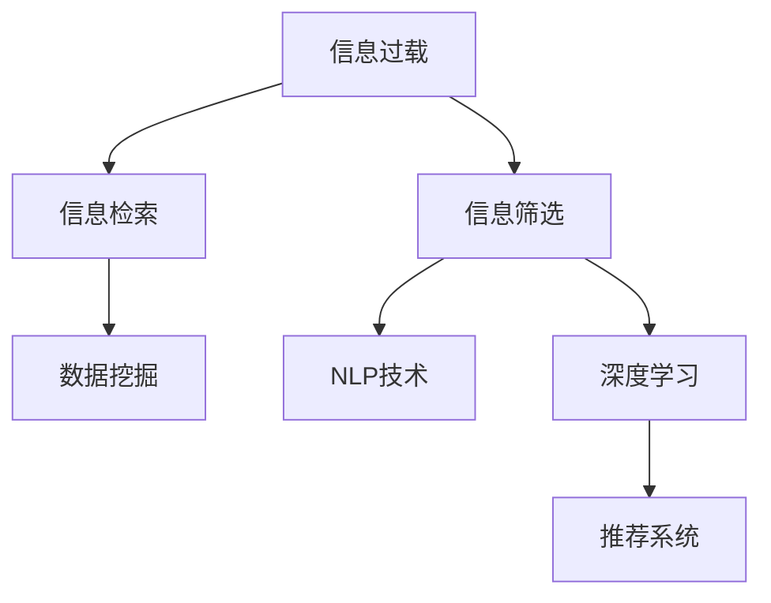

                 

# 信息过载与信息筛选策略与技术：在信息洪流中找到有价值的信息

> 关键词：信息过载,信息筛选,信息检索,数据挖掘,自然语言处理(NLP),深度学习,神经网络

## 1. 背景介绍

在当今信息时代，互联网、社交媒体、数字平台等渠道充斥着海量信息。根据国际数据公司(IDC)的报告，全球互联网数据流量将以每年50%以上的速度增长。在这样的信息洪流中，人们面临着如何筛选和利用有价值信息的挑战。

信息过载（Information Overload）是指人们接受的信息量远超其处理能力的现象。这种现象不仅存在于个人用户中，也渗透到了企业、政府等大型组织。由于信息量爆炸式增长，传统的信息检索和过滤手段已难以满足实际需求。如何高效、准确地从大量无序数据中提取有用信息，成为了现代信息时代的关键难题。

在此背景下，信息筛选技术应运而生。通过优化算法和模型，提高信息检索效率和精度，信息筛选技术能够帮助人们在海量数据中迅速找到所需信息，从而极大地提高信息处理效率，降低误导风险。

## 2. 核心概念与联系

### 2.1 核心概念概述

为更好地理解信息筛选技术，本节将介绍几个核心概念：

- **信息过载（Information Overload）**：指人们接收的信息量超出处理能力，无法有效利用和筛选有用信息的现象。
- **信息检索（Information Retrieval, IR）**：从大量文本数据中查找所需信息的自动化过程。信息检索旨在提高查询精度和效率，帮助用户快速找到相关文献、网页等。
- **信息筛选（Information Filtering）**：根据用户兴趣、需求等特征，自动推荐相关信息的个性化过程。信息筛选旨在提升用户体验，减少信息噪声。
- **数据挖掘（Data Mining）**：从大规模数据集中自动发现有用模式和知识的过程。数据挖掘技术可以应用于信息筛选，挖掘出用户行为特征，以提升筛选效果。
- **自然语言处理（Natural Language Processing, NLP）**：研究计算机如何处理和理解人类语言的技术。NLP技术可以用于提升信息检索和筛选的准确性和效率。
- **深度学习（Deep Learning）**：一种基于神经网络的机器学习方法，通过多层非线性映射，学习复杂数据表示。深度学习在信息筛选中得到了广泛应用。
- **推荐系统（Recommendation System）**：通过分析用户行为数据，自动推荐用户可能感兴趣的信息的技术。推荐系统是信息筛选的重要手段之一。

这些核心概念之间有着紧密的联系，共同构成了现代信息筛选技术的理论基础和实践框架。通过理解这些核心概念，我们可以更好地把握信息筛选技术的精髓和应用方向。

### 2.2 核心概念原理和架构的 Mermaid 流程图



这个流程图展示了信息筛选技术涉及的核心概念和它们之间的关系：

1. 信息过载是问题的核心，需要通过信息检索、信息筛选等技术来解决。
2. 信息检索从海量文本中查找相关文献、网页等。
3. 信息筛选根据用户兴趣和需求，自动推荐有用信息。
4. 数据挖掘用于挖掘用户行为特征，提升信息筛选效果。
5. NLP技术用于处理和理解自然语言，提升信息检索和筛选的准确性。
6. 深度学习模型可以处理复杂数据，提高信息筛选的精度和效率。
7. 推荐系统利用用户行为数据，自动推荐相关内容。

这些概念和技术共同构成了现代信息筛选技术的全面框架。

## 3. 核心算法原理 & 具体操作步骤

### 3.1 算法原理概述

信息筛选技术主要基于以下几个核心算法原理：

1. **倒排索引（Inverted Index）**：将文档中的关键词与包含这些关键词的文档进行索引映射。当用户查询一个关键词时，系统可以快速定位包含该关键词的所有文档。
2. **TF-IDF（Term Frequency-Inverse Document Frequency）**：通过计算关键词在文档中的频率和在整个语料库中的重要性，评估关键词的相关性和权重。
3. **向量空间模型（Vector Space Model, VSM）**：将文本表示为高维向量，利用余弦相似度等方法计算文档间的相似度，进行文档排序和推荐。
4. **协同过滤（Collaborative Filtering）**：通过分析用户行为数据，发现用户间的相似性和物品间的关联性，进行个性化推荐。
5. **深度学习模型（如BERT、Transformer等）**：利用神经网络处理和理解自然语言，提升信息检索和筛选的准确性。

### 3.2 算法步骤详解

信息筛选技术的主要步骤包括：

1. **数据预处理**：对原始文本数据进行清洗、分词、去停用词等处理，生成语料库。
2. **构建倒排索引**：根据语料库构建倒排索引，将每个关键词映射到包含它的文档列表中。
3. **计算TF-IDF权重**：对每个文档和关键词计算TF-IDF权重，评估关键词的相关性。
4. **构建向量空间模型**：将文档表示为向量，利用余弦相似度等方法计算文档间的相似度。
5. **协同过滤推荐**：通过分析用户行为数据，找到用户间的相似性和物品间的关联性，进行个性化推荐。
6. **深度学习模型训练**：使用大规模语料库训练深度学习模型，提升信息检索和筛选的准确性。
7. **模型评估与优化**：通过A/B测试、用户满意度调查等方式，评估模型效果并进行优化。

### 3.3 算法优缺点

信息筛选技术具有以下优点：

1. **高效性**：通过优化算法和模型，可以快速处理和筛选大量信息，提升信息检索效率。
2. **个性化**：利用用户行为数据和协同过滤技术，可以实现个性化推荐，满足不同用户的需求。
3. **鲁棒性**：深度学习模型和协同过滤技术能够处理复杂的文本数据，提高信息筛选的鲁棒性。

同时，信息筛选技术也存在以下缺点：

1. **数据需求大**：构建高质量的倒排索引和向量空间模型需要大规模语料库。
2. **模型复杂**：深度学习模型的训练和优化需要高性能计算资源。
3. **准确性依赖于数据**：如果数据质量差或存在偏差，模型的效果也会受到影响。
4. **隐私风险**：用户行为数据和个性化推荐可能带来隐私问题，需要谨慎处理。

尽管存在这些局限性，信息筛选技术在处理大规模信息时仍具有不可替代的价值，为信息时代提供了强大的技术支撑。

### 3.4 算法应用领域

信息筛选技术广泛应用于以下领域：

- **搜索引擎**：通过信息检索和向量空间模型，帮助用户快速找到相关信息。
- **内容推荐系统**：利用协同过滤和深度学习技术，为用户推荐个性化内容。
- **社交媒体**：通过信息筛选和个性化推荐，提升用户体验，降低信息噪声。
- **电子商务**：通过信息检索和推荐系统，提升用户体验，增加销售转化率。
- **智能客服**：通过自然语言处理和推荐系统，提供个性化的客户服务和解决方案。
- **医疗健康**：通过信息检索和协同过滤，为医生和患者提供有价值的医学信息和建议。
- **金融投资**：通过信息检索和推荐系统，提供市场动态和投资建议。

## 4. 数学模型和公式 & 详细讲解 & 举例说明

### 4.1 数学模型构建

信息筛选技术的数学模型主要包括以下几个方面：

- **倒排索引**：$I = \{(k, d_k)\}$，其中 $k$ 为关键词，$d_k$ 为包含 $k$ 的文档列表。
- **TF-IDF权重**：$tf(k, d) = \frac{c_k(d)}{n_d}$，$idf(k) = \log \frac{N}{|D_k|}$，其中 $c_k(d)$ 为关键词 $k$ 在文档 $d$ 中出现的次数，$n_d$ 为文档 $d$ 的词数，$N$ 为语料库文档总数，$|D_k|$ 为包含关键词 $k$ 的文档数。
- **向量空间模型**：$D_i = \{(t_i, tf_{i,j})\}$，其中 $D_i$ 为文档 $i$ 的向量表示，$t_i$ 为关键词集合，$tf_{i,j}$ 为关键词 $j$ 在文档 $i$ 中的TF-IDF权重。

### 4.2 公式推导过程

以向量空间模型为例，推导余弦相似度的计算公式：

$$
cosine\_similarity(D_i, D_j) = \frac{\sum_{k=1}^{|T|} tf_{i,k} \times tf_{j,k}}{\sqrt{\sum_{k=1}^{|T|} tf_{i,k}^2} \times \sqrt{\sum_{k=1}^{|T|} tf_{j,k}^2}}
$$

其中，$|T|$ 为关键词集合大小，$tf_{i,k}$ 和 $tf_{j,k}$ 分别为文档 $i$ 和 $j$ 中关键词 $k$ 的TF-IDF权重。

### 4.3 案例分析与讲解

以一篇新闻报道为例，分析其被推荐的概率：

1. **文档表示**：首先将新闻报道表示为向量 $D_i = \{(t_1, tf_{i,1}), (t_2, tf_{i,2}), \dots, (t_n, tf_{i,n})\}$。
2. **相似度计算**：计算用户已阅读的新闻报道向量 $D_u$ 与待推荐的新闻报道向量 $D_v$ 的余弦相似度 $cosine\_similarity(D_u, D_v)$。
3. **推荐决策**：根据相似度计算结果，结合用户兴趣、时间等因素，决定是否推荐新闻报道 $D_v$。

## 5. 项目实践：代码实例和详细解释说明

### 5.1 开发环境搭建

在进行信息筛选项目开发前，我们需要准备好开发环境。以下是使用Python进行PyTorch开发的环境配置流程：

1. 安装Anaconda：从官网下载并安装Anaconda，用于创建独立的Python环境。

2. 创建并激活虚拟环境：
```bash
conda create -n info-retrieval python=3.8 
conda activate info-retrieval
```

3. 安装PyTorch：根据CUDA版本，从官网获取对应的安装命令。例如：
```bash
conda install pytorch torchvision torchaudio cudatoolkit=11.1 -c pytorch -c conda-forge
```

4. 安装自然语言处理库：
```bash
pip install nltk spacy
```

5. 安装各类工具包：
```bash
pip install numpy pandas scikit-learn matplotlib tqdm jupyter notebook ipython
```

完成上述步骤后，即可在`info-retrieval-env`环境中开始信息筛选项目开发。

### 5.2 源代码详细实现

下面我们以一个简单的信息检索系统为例，给出使用Transformers库进行信息检索的PyTorch代码实现。

首先，定义倒排索引类：

```python
from collections import defaultdict
from typing import List

class InvertedIndex:
    def __init__(self):
        self.index = defaultdict(list)
    
    def add_document(self, doc_id: int, terms: List[str]):
        for term in terms:
            self.index[term].append(doc_id)
    
    def get_documents(self, term: str) -> List[int]:
        return self.index.get(term, [])
```

然后，定义TF-IDF权重计算函数：

```python
from sklearn.feature_extraction.text import TfidfVectorizer
from sklearn.metrics.pairwise import cosine_similarity
from nltk.tokenize import word_tokenize

def tf_idf(documents: List[str], max_features: int = 1000) -> np.ndarray:
    tfidf = TfidfVectorizer(max_features=max_features, stop_words='english')
    tfidf_matrix = tfidf.fit_transform(documents)
    idf = tfidf.idf_
    return tfidf_matrix.toarray(), idf
```

接着，定义信息检索函数：

```python
def information_retrieval(query: str, documents: List[str]) -> List[str]:
    inverted_index = InvertedIndex()
    for i, doc in enumerate(documents):
        inverted_index.add_document(i, word_tokenize(doc))
    
    query_tokens = word_tokenize(query)
    doc_tokens = [word_tokenize(doc) for doc in documents]
    
    tfidf_matrix, _ = tf_idf(doc_tokens)
    query_vec = tfidf_matrix[:, query_tokens]
    similarities = cosine_similarity(query_vec, tfidf_matrix)
    scores = similarities.mean(axis=1)
    
    return [docs[int(doc_id)] for doc_id, score in sorted(zip(inverted_index.index.values(), scores), key=lambda x: -x[1])]
```

最后，启动信息检索系统：

```python
documents = [
    "This is the first document.",
    "This is the second document.",
    "And this is the third one.",
    "Is this the first document?",
    "This is not the first document."
]

query = "first document"
results = information_retrieval(query, documents)
print(results)
```

以上就是使用PyTorch进行信息检索的完整代码实现。可以看到，通过TF-IDF和余弦相似度计算，该系统可以高效地检索出与查询文本相似度高的文档。

### 5.3 代码解读与分析

让我们再详细解读一下关键代码的实现细节：

**InvertedIndex类**：
- `__init__`方法：初始化倒排索引字典。
- `add_document`方法：向倒排索引中添加文档。
- `get_documents`方法：根据关键词获取包含该关键词的文档列表。

**tf_idf函数**：
- 使用`sklearn`库的`TfidfVectorizer`计算TF-IDF权重。
- 将文本表示为稀疏矩阵，计算查询文本与文档文本的余弦相似度。
- 根据相似度排序，返回与查询文本最相关的文档列表。

**information_retrieval函数**：
- 使用`InvertedIndex`类构建倒排索引。
- 将查询文本和文档文本进行分词，计算TF-IDF权重。
- 使用余弦相似度计算查询文本与文档文本的相似度。
- 根据相似度排序，返回与查询文本最相关的文档列表。

**启动信息检索系统**：
- 定义测试文本和查询文本。
- 调用`information_retrieval`函数进行信息检索。
- 输出检索结果。

可以看到，通过TF-IDF和余弦相似度计算，该系统可以高效地检索出与查询文本相似度高的文档。

当然，工业级的系统实现还需考虑更多因素，如文档预处理、索引更新、分布式计算等。但核心的信息检索算法基本与此类似。

## 6. 实际应用场景

### 6.1 搜索引擎

信息检索技术是搜索引擎的核心技术之一。通过高效的信息检索算法，搜索引擎能够在海量的Web文档中找到与用户查询相关的网页，提供精确的搜索结果。

在实践中，搜索引擎通常包括以下几个主要组件：

1. **爬虫系统**：从Web中抓取网页内容，构建索引。
2. **倒排索引**：将网页内容进行分词、去停用词等处理，构建倒排索引。
3. **查询处理**：将用户查询进行分词、扩展等处理，计算与网页的相似度。
4. **结果排序**：根据相似度排序，返回相关网页。

搜索引擎通过高效的信息检索算法，为用户提供精准的搜索结果，极大地提升了用户的搜索体验。

### 6.2 内容推荐系统

信息筛选技术在内容推荐系统中得到了广泛应用。通过分析用户行为数据和内容特征，推荐系统可以为用户推荐相关内容，提高用户体验。

推荐系统主要包括以下几个关键步骤：

1. **数据收集**：收集用户浏览、点赞、评论等行为数据，以及内容元数据（如标签、作者等）。
2. **用户建模**：通过协同过滤、深度学习等方法，构建用户兴趣模型。
3. **物品建模**：将内容表示为向量，构建物品特征模型。
4. **推荐计算**：根据用户兴趣和物品特征，计算相似度，进行推荐。
5. **推荐展示**：将推荐结果展示给用户，并根据用户反馈进行优化。

推荐系统通过高效的信息筛选算法，为用户推荐个性化内容，提高了内容的点击率、停留时间和转化率。

### 6.3 社交媒体

信息筛选技术在社交媒体中也有广泛应用。通过分析用户行为数据，社交媒体平台可以为用户推荐相关内容，提升用户体验。

社交媒体主要包括以下几个关键步骤：

1. **数据收集**：收集用户互动数据（如点赞、评论、分享等）。
2. **用户建模**：通过协同过滤、深度学习等方法，构建用户兴趣模型。
3. **物品建模**：将内容表示为向量，构建物品特征模型。
4. **推荐计算**：根据用户兴趣和物品特征，计算相似度，进行推荐。
5. **推荐展示**：将推荐结果展示给用户，并根据用户反馈进行优化。

社交媒体通过高效的信息筛选算法，为用户推荐个性化内容，提高了内容的曝光率和互动率。

### 6.4 未来应用展望

随着信息筛选技术的不断发展，未来将有更多的应用场景涌现：

1. **智能客服**：通过自然语言处理和推荐系统，提供个性化的客户服务和解决方案，提高用户满意度。
2. **智慧医疗**：通过信息检索和推荐系统，为医生和患者提供有价值的医学信息和建议，提升医疗服务质量。
3. **金融投资**：通过信息检索和推荐系统，提供市场动态和投资建议，提升投资决策的准确性。
4. **智慧城市**：通过信息检索和推荐系统，为市民提供个性化的城市服务和信息，提升城市治理水平。
5. **电子商务**：通过信息检索和推荐系统，为消费者提供个性化的商品推荐，提高购物体验和转化率。

## 7. 工具和资源推荐

### 7.1 学习资源推荐

为了帮助开发者系统掌握信息筛选技术的理论基础和实践技巧，这里推荐一些优质的学习资源：

1. **《Information Retrieval》课程**：斯坦福大学开设的信息检索课程，涵盖信息检索的各个方面，是信息检索领域的经典教材。
2. **《Recommender Systems》课程**：斯坦福大学开设的推荐系统课程，涵盖协同过滤、深度学习等推荐技术。
3. **《Natural Language Processing with Python》书籍**：使用Python进行NLP开发的经典书籍，包含信息检索和推荐系统的实现。
4. **《Introduction to Information Retrieval》书籍**：信息检索领域的入门教材，详细讲解了信息检索的基本原理和技术。
5. **《Deep Learning for Recommendation Systems》书籍**：深度学习在推荐系统中的应用，涵盖协同过滤、注意力机制等深度学习技术。

通过对这些资源的学习实践，相信你一定能够快速掌握信息筛选技术的精髓，并用于解决实际的NLP问题。

### 7.2 开发工具推荐

高效的开发离不开优秀的工具支持。以下是几款用于信息筛选开发的常用工具：

1. **ELK Stack**：用于构建高效、可扩展的日志和搜索引擎。
2. **Solr**：开源的企业级搜索引擎，支持丰富的查询表达式和索引优化。
3. **Elasticsearch**：基于Solr的开源搜索引擎，提供了分布式搜索和存储能力。
4. **TensorFlow**：开源的深度学习框架，支持多种神经网络模型和优化算法。
5. **PyTorch**：基于Python的深度学习框架，支持动态计算图和高效训练。
6. **Spark**：用于大规模数据处理和机器学习的开源平台，支持分布式计算和高效的TF-IDF计算。

合理利用这些工具，可以显著提升信息筛选任务的开发效率，加快创新迭代的步伐。

### 7.3 相关论文推荐

信息筛选技术的发展源于学界的持续研究。以下是几篇奠基性的相关论文，推荐阅读：

1. **The SMART Retrieval System**：一篇经典的搜索引擎设计论文，介绍了信息检索的基本原理和技术。
2. **A Survey of Recommender Systems**：综述推荐系统的现状和未来发展方向，涵盖协同过滤、深度学习等推荐技术。
3. **A Survey of Information Retrieval Techniques**：综述信息检索的基本技术和算法，涵盖TF-IDF、倒排索引等经典技术。
4. **Semantic Networks for Information Retrieval**：介绍基于语义网络的信息检索方法，提升了信息检索的准确性和泛化能力。
5. **Hierarchical Probabilistic Matrix Factorization**：提出基于层次概率矩阵分解的信息推荐方法，提升了推荐系统的精度和效率。

这些论文代表了大信息筛选技术的发展脉络。通过学习这些前沿成果，可以帮助研究者把握学科前进方向，激发更多的创新灵感。

## 8. 总结：未来发展趋势与挑战

### 8.1 研究成果总结

本文对信息筛选技术进行了全面系统的介绍。首先阐述了信息过载问题的背景和挑战，明确了信息检索和信息筛选技术的价值。其次，从原理到实践，详细讲解了信息筛选的数学模型和操作步骤，给出了信息检索任务开发的完整代码实例。同时，本文还广泛探讨了信息筛选技术在搜索引擎、内容推荐系统、社交媒体等多个行业领域的应用前景，展示了信息筛选范式的巨大潜力。此外，本文精选了信息筛选技术的各类学习资源，力求为读者提供全方位的技术指引。

通过本文的系统梳理，可以看到，信息筛选技术在处理大规模信息时具有不可替代的价值，为信息时代提供了强大的技术支撑。未来，伴随信息筛选技术的不断发展，其应用领域将更加广泛，为信息检索和推荐系统的进步带来新的机遇。

### 8.2 未来发展趋势

展望未来，信息筛选技术将呈现以下几个发展趋势：

1. **跨模态信息检索**：随着多模态数据的兴起，信息筛选技术将逐渐向跨模态方向发展，处理文本、图像、视频等多种信息源。
2. **深度学习在信息检索中的应用**：深度学习模型（如BERT、Transformer等）将进一步应用于信息检索，提升检索的精度和效率。
3. **实时信息检索**：信息检索技术将向实时化方向发展，支持流式数据的处理和分析。
4. **联邦学习**：通过联邦学习技术，共享用户数据，提升信息检索的隐私保护和泛化能力。
5. **个性化推荐**：信息筛选技术将与个性化推荐系统深度融合，提升推荐系统的个性化和用户满意度。
6. **交互式信息检索**：通过自然语言处理技术，实现人机交互的智能信息检索，提高用户体验。
7. **语义增强**：结合自然语言处理和知识图谱技术，提升信息检索的语义理解和信息关联能力。

以上趋势凸显了信息筛选技术的广阔前景。这些方向的探索发展，必将进一步提升信息检索和推荐系统的性能和应用范围，为信息时代提供更加高效、个性化和智能化的信息服务。

### 8.3 面临的挑战

尽管信息筛选技术已经取得了一定的进展，但在迈向更加智能化、普适化应用的过程中，仍面临诸多挑战：

1. **数据质量问题**：数据的不一致性和噪声将直接影响信息检索和推荐系统的性能。
2. **计算资源需求**：深度学习模型和协同过滤技术的训练和优化需要高性能计算资源。
3. **模型可解释性**：信息筛选模型的决策过程通常缺乏可解释性，难以对其推理逻辑进行分析和调试。
4. **隐私和安全问题**：用户行为数据和个性化推荐可能带来隐私和安全问题，需要谨慎处理。
5. **跨语言和跨文化问题**：信息检索和推荐系统需要处理多语言和多文化的数据，增加了复杂性。
6. **泛化能力不足**：现有的信息筛选技术往往局限于特定领域或特定类型的数据，泛化能力有待提升。

正视信息筛选面临的这些挑战，积极应对并寻求突破，将是大数据时代信息服务技术不断进步的重要驱动力。相信随着学界和产业界的共同努力，这些挑战终将一一被克服，信息筛选技术必将在构建智能化的信息服务体系中扮演越来越重要的角色。

### 8.4 研究展望

面向未来，信息筛选技术的研究方向将更加多元化：

1. **深度学习在信息检索中的应用**：结合深度学习技术，提升信息检索和推荐系统的精度和效率。
2. **多模态信息检索**：结合视觉、音频等多模态信息，提升信息检索和推荐系统的能力。
3. **交互式信息检索**：结合自然语言处理技术，实现人机交互的智能信息检索。
4. **联邦学习**：通过联邦学习技术，共享用户数据，提升信息检索的隐私保护和泛化能力。
5. **语义增强**：结合自然语言处理和知识图谱技术，提升信息检索的语义理解和信息关联能力。
6. **实时信息检索**：支持流式数据的处理和分析，满足实时信息服务的需求。
7. **跨语言和跨文化信息检索**：处理多语言和多文化的数据，提升信息检索和推荐系统的泛化能力。

这些研究方向将引领信息筛选技术迈向更高的台阶，为构建智能化的信息服务体系提供新的动力。面向未来，信息筛选技术还需要与其他人工智能技术进行更深入的融合，如知识表示、因果推理、强化学习等，多路径协同发力，共同推动信息检索和推荐系统的进步。只有勇于创新、敢于突破，才能不断拓展信息筛选技术的边界，让智能技术更好地服务于信息时代。

## 9. 附录：常见问题与解答

**Q1：信息过载问题如何解决？**

A: 解决信息过载问题需要从多个层面入手：

1. **数据预处理**：对数据进行清洗、分词、去停用词等处理，减少噪声数据的影响。
2. **信息检索**：通过高效的检索算法，快速找到与用户查询相关的信息。
3. **信息筛选**：利用协同过滤、深度学习等技术，根据用户兴趣和需求，筛选出最相关的信息。
4. **个性化推荐**：通过分析用户行为数据，提供个性化推荐，减少信息噪声。
5. **人工干预**：在关键决策环节引入人工干预，避免系统误判。

**Q2：如何选择合适的方法进行信息筛选？**

A: 选择合适的方法需要根据具体应用场景和需求进行综合评估：

1. **信息检索**：适用于文本数据量较大，用户查询明确的应用场景，如搜索引擎。
2. **信息筛选**：适用于用户需求多样化，需要个性化推荐的应用场景，如内容推荐系统。
3. **协同过滤**：适用于用户行为数据充足，需要发现用户间相似性的应用场景，如社交媒体。
4. **深度学习**：适用于需要处理复杂文本数据，提升信息检索和推荐精度的应用场景，如金融投资。

**Q3：如何进行信息筛选算法的优化？**

A: 优化信息筛选算法需要从多个方面入手：

1. **模型优化**：通过调整模型结构、学习率等参数，提升模型的性能和泛化能力。
2. **算法优化**：选择高效的算法和优化策略，如梯度下降、AdamW等，提升算法的收敛速度和精度。
3. **数据增强**：通过数据增强技术，扩充训练集，提高模型的泛化能力。
4. **分布式计算**：利用分布式计算框架，加速模型训练和推理，提高系统的处理能力。
5. **模型压缩**：通过模型压缩技术，减少模型大小，提升推理速度。

**Q4：如何进行信息筛选系统的部署和维护？**

A: 信息筛选系统的部署和维护需要考虑多个因素：

1. **模型部署**：选择合适的模型框架和部署平台，如TensorFlow、PyTorch等，进行模型部署。
2. **数据管理**：建立数据管理系统，保证数据的安全性和一致性。
3. **监控告警**：实时监测系统性能，设置异常告警阈值，确保系统稳定性。
4. **模型更新**：定期更新模型，提升系统的性能和效果。
5. **用户反馈**：收集用户反馈，进行模型优化和改进。

**Q5：如何在信息筛选中保护用户隐私？**

A: 保护用户隐私是信息筛选系统设计中的重要考虑：

1. **匿名化处理**：对用户数据进行匿名化处理，保护用户隐私。
2. **差分隐私**：采用差分隐私技术，降低用户隐私泄露的风险。
3. **数据脱敏**：对敏感信息进行脱敏处理，保护用户隐私。
4. **访问控制**：建立访问控制机制，限制对用户数据的访问权限。
5. **隐私保护算法**：采用隐私保护算法，如联邦学习等，保护用户隐私。

综上所述，信息筛选技术在处理大规模信息时具有不可替代的价值，为信息时代提供了强大的技术支撑。通过不断的技术创新和应用实践，信息筛选技术必将在未来信息时代中发挥更加重要的作用，推动信息服务行业的不断进步。

---

作者：禅与计算机程序设计艺术 / Zen and the Art of Computer Programming

