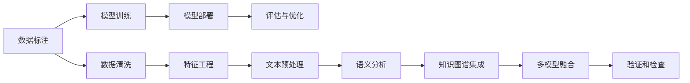

                 

# 信息验证和事实检查：在错误信息泛滥的时代导航

> 关键词：信息验证, 事实检查, 数据标注, 假新闻检测, 语义分析, 人工智能, 深度学习, 自然语言处理, 机器学习, 数据质量

## 1. 背景介绍

### 1.1 问题由来
在互联网高度发达的今天，信息的传播几乎不受时间和空间的限制。然而，随之而来的“信息爆炸”也带来了“假信息泛滥”的问题。假新闻、虚假信息、误导性信息充斥于网络，给公众造成了巨大的认知冲击，甚至可能引发社会混乱。因此，对信息的真实性进行验证和事实检查变得尤为重要。

互联网上的信息不仅数量庞大，且真假难辨，这使得传统的新闻审核方式无法满足实际需求。为了应对这一挑战，信息验证和事实检查技术应运而生，并逐渐成为信息时代的重要工具。

### 1.2 问题核心关键点
信息验证和事实检查的核心在于通过机器学习和大数据技术，自动识别和筛选出真实和虚假信息。其关键点包括：

- **数据标注**：构建真实与虚假信息的标注数据集，作为模型训练的基础。
- **模型训练**：利用深度学习等机器学习技术，训练信息验证和事实检查模型。
- **模型部署**：将训练好的模型应用于实际场景，进行实时信息验证和事实检查。
- **评估与优化**：定期评估模型效果，根据结果进行模型优化。

## 2. 核心概念与联系

### 2.1 核心概念概述

为更好地理解信息验证和事实检查技术，本节将介绍几个关键概念及其之间的联系：

- **信息验证**：指对单个信息源或信息内容进行真实性验证的过程。目的是识别出虚假信息或错误信息，保证信息的可靠性。

- **事实检查**：指对一组或多组信息进行系统性的分析和验证，确定其真实性的过程。目标是识别出复杂情境下信息的真伪。

- **数据标注**：对信息样本进行标注，标记其为真实或虚假。数据标注是信息验证和事实检查模型训练的基石。

- **深度学习**：一种基于神经网络的机器学习技术，能够通过多层网络自动提取特征、进行分类和回归等任务。

- **自然语言处理(NLP)**：指利用计算机技术处理、理解和生成自然语言。在信息验证和事实检查中，NLP技术用于文本数据的预处理和语义分析。

- **机器学习**：利用算法和模型，通过数据训练使计算机具备从数据中学习规律，并进行预测和决策的能力。

- **知识图谱**：一种基于图结构的知识表示方法，用于描述实体、属性及实体间的关系，帮助机器更好地理解语义。

### 2.2 核心概念原理和架构的 Mermaid 流程图



这个流程图展示了信息验证和事实检查的核心流程：

1. **数据标注**：收集和标注真实与虚假信息数据集。
2. **模型训练**：利用标注数据训练深度学习模型。
3. **模型部署**：将训练好的模型应用到实际场景，进行信息验证和事实检查。
4. **评估与优化**：根据验证结果对模型进行评估和优化。

在数据标注阶段，需要建立真实和虚假信息的标注标准，并构建标注数据集。在模型训练阶段，需要选择合适的深度学习模型，并使用标注数据进行训练。在模型部署阶段，需要将训练好的模型部署到实际应用中，进行实时验证和检查。在评估与优化阶段，需要根据模型的验证结果进行评估和优化。

## 3. 核心算法原理 & 具体操作步骤

### 3.1 算法原理概述

信息验证和事实检查的核心算法是深度学习模型。深度学习模型通过学习大量标注数据，自动提取和理解数据的特征，从而实现信息的真实性验证和事实检查。具体步骤如下：

1. **数据准备**：收集和标注真实与虚假信息的文本数据。
2. **特征提取**：利用自然语言处理技术，将文本数据转换为机器可理解的特征向量。
3. **模型训练**：选择合适的深度学习模型，并使用标注数据进行训练。
4. **验证与检查**：将训练好的模型应用到新的数据样本上，进行真实性验证和事实检查。
5. **模型优化**：根据验证结果，对模型进行评估和优化，提升模型的准确性和鲁棒性。

### 3.2 算法步骤详解

#### 3.2.1 数据准备

- **数据收集**：收集互联网上的各种文本数据，包括新闻报道、社交媒体帖子、论坛评论等。
- **数据标注**：人工标注数据集，将文本数据标记为真实或虚假。

#### 3.2.2 特征提取

- **文本清洗**：去除停用词、标点符号等无关信息，保留核心内容。
- **分词与词性标注**：对文本进行分词，并标注每个词的词性。
- **向量表示**：利用Word2Vec、GloVe等技术，将文本转换为向量表示，便于机器学习模型的处理。

#### 3.2.3 模型训练

- **模型选择**：选择合适的深度学习模型，如循环神经网络(RNN)、卷积神经网络(CNN)、长短时记忆网络(LSTM)等。
- **超参数设置**：设置学习率、批大小、迭代轮数等超参数，控制模型的训练过程。
- **模型训练**：使用标注数据训练模型，迭代优化模型参数，提升模型性能。

#### 3.2.4 验证与检查

- **验证集**：使用验证集数据对模型进行验证，评估模型性能。
- **测试集**：使用测试集数据对模型进行全面测试，评估模型的泛化能力。
- **结果分析**：分析模型的验证结果，识别模型的优点和缺点。

#### 3.2.5 模型优化

- **模型评估**：根据测试集结果，评估模型的准确性、召回率和F1分数等性能指标。
- **参数调整**：根据模型评估结果，调整模型的超参数，优化模型性能。
- **模型迭代**：多次迭代模型训练和验证过程，直到模型性能达到最优。

### 3.3 算法优缺点

信息验证和事实检查的深度学习模型具有以下优点：

- **高效性**：能够自动处理大量文本数据，节省人力和时间成本。
- **鲁棒性**：在面对复杂语境和噪声数据时，仍能保持较高的准确性。
- **可扩展性**：可以处理多种类型的数据，如文本、图片、视频等。

然而，该方法也存在一些缺点：

- **数据依赖**：模型的性能很大程度上依赖于标注数据的质量和数量。
- **复杂性**：深度学习模型的训练和优化过程较为复杂，需要较强的技术积累。
- **解释性不足**：模型的决策过程缺乏可解释性，难以理解和调试。
- **高计算需求**：深度学习模型的训练和推理需要高性能计算资源，成本较高。

### 3.4 算法应用领域

信息验证和事实检查技术已经广泛应用于多个领域：

- **新闻媒体**：新闻机构使用该技术对新闻报道进行真实性验证，避免发布假新闻。
- **社交媒体**：社交平台利用该技术识别和屏蔽虚假信息，保护用户安全。
- **金融市场**：金融机构使用该技术对市场资讯进行真实性验证，防范金融风险。
- **法律领域**：律师和法官使用该技术验证案件材料的真实性，提高司法效率。
- **公共健康**：医疗机构使用该技术验证医疗信息的真实性，确保公共健康信息准确可靠。

## 4. 数学模型和公式 & 详细讲解 & 举例说明

### 4.1 数学模型构建

假设我们有一组标注好的数据集 $\{(x_i, y_i)\}_{i=1}^N$，其中 $x_i$ 为文本数据，$y_i \in \{0, 1\}$ 为标注标签，0表示虚假信息，1表示真实信息。信息验证和事实检查的目标是训练一个二分类模型 $M_{\theta}$，使其能够准确预测新数据样本的真实性。

设模型 $M_{\theta}$ 的输出为 $\hat{y}=M_{\theta}(x)$，则模型的损失函数为：

$$
\mathcal{L}(\theta) = -\frac{1}{N} \sum_{i=1}^N y_i \log M_{\theta}(x_i) + (1-y_i) \log (1-M_{\theta}(x_i))
$$

其中，$\log$ 表示自然对数，$M_{\theta}(x)$ 表示模型在输入 $x$ 上的输出，$y_i$ 为标注标签。

模型的预测结果 $\hat{y}$ 与实际标签 $y_i$ 不一致时，损失函数 $\mathcal{L}(\theta)$ 增加，模型需要调整参数以减少损失。

### 4.2 公式推导过程

以常用的循环神经网络(RNN)为例，推导信息验证和事实检查模型的计算过程。

设 $x_t$ 为时间步 $t$ 的文本数据，$y_t$ 为时间步 $t$ 的标注标签。模型 $M_{\theta}$ 的计算过程如下：

1. **输入层**：将文本数据转换为向量表示 $x_t \in \mathbb{R}^d$。
2. **隐藏层**：通过循环神经网络处理，得到隐藏状态 $h_t = f(x_t, h_{t-1})$。
3. **输出层**：将隐藏状态 $h_t$ 映射到输出 $\hat{y}_t \in \mathbb{R}$，并使用sigmoid函数将其转换为0-1之间的概率值 $\hat{y}_t = g(h_t)$。
4. **损失函数**：使用二分类交叉熵损失函数计算模型预测结果与实际标签的差异。

具体计算过程如下：

$$
\hat{y}_t = g(h_t) = \frac{1}{1+\exp(-h_t)}
$$

$$
\mathcal{L}(\theta) = -\frac{1}{N} \sum_{i=1}^N \sum_{t=1}^{T} (y_{i,t} \log \hat{y}_{i,t} + (1-y_{i,t}) \log (1-\hat{y}_{i,t}))
$$

其中，$T$ 为文本长度，$g$ 为 sigmoid 函数，$f$ 为循环神经网络的隐藏状态更新函数。

### 4.3 案例分析与讲解

以BERT模型为例，介绍其在信息验证和事实检查中的应用。

BERT模型是一种基于自编码的预训练语言模型，通过在大规模无标签文本数据上进行预训练，学习到了丰富的语言表示。在信息验证和事实检查任务中，BERT模型可以通过微调对特定任务进行适应，实现高效的信息验证和事实检查。

具体步骤如下：

1. **数据准备**：收集和标注信息验证和事实检查的文本数据。
2. **模型微调**：在BERT模型的基础上，微调一个分类器，用于真实性验证。
3. **特征提取**：利用BERT模型将文本数据转换为向量表示。
4. **模型训练**：使用标注数据训练微调后的分类器，提升模型性能。
5. **验证与检查**：将训练好的分类器应用到新数据样本上，进行真实性验证和事实检查。
6. **模型优化**：根据验证结果，对模型进行评估和优化，提升模型的准确性和鲁棒性。

## 5. 项目实践：代码实例和详细解释说明

### 5.1 开发环境搭建

在信息验证和事实检查的开发过程中，需要安装Python、TensorFlow、Keras等工具，搭建好开发环境。具体步骤如下：

1. **安装Python**：
```bash
sudo apt-get update
sudo apt-get install python3
```

2. **安装TensorFlow**：
```bash
pip install tensorflow
```

3. **安装Keras**：
```bash
pip install keras
```

4. **安装数据处理工具**：
```bash
pip install pandas
```

5. **安装可视化工具**：
```bash
pip install matplotlib
```

完成上述步骤后，即可在开发环境中进行信息验证和事实检查的实现。

### 5.2 源代码详细实现

以下是一个使用Keras实现信息验证和事实检查的Python代码实例：

```python
import tensorflow as tf
from tensorflow.keras.datasets import imdb
from tensorflow.keras.models import Sequential
from tensorflow.keras.layers import Dense, LSTM, Embedding, Dropout
from tensorflow.keras.preprocessing import sequence
from tensorflow.keras.preprocessing.text import Tokenizer
from sklearn.model_selection import train_test_split

# 加载IMDB电影评论数据集
(x_train, y_train), (x_test, y_test) = imdb.load_data(num_words=10000)

# 定义模型参数
max_len = 200
batch_size = 32
embedding_dim = 100
lstm_units = 256
dropout_rate = 0.5

# 构建模型
model = Sequential()
model.add(Embedding(10000, embedding_dim, input_length=max_len))
model.add(LSTM(lstm_units, dropout=dropout_rate, recurrent_dropout=dropout_rate))
model.add(Dense(1, activation='sigmoid'))
model.compile(optimizer='adam', loss='binary_crossentropy', metrics=['accuracy'])

# 构建数据预处理管道
tokenizer = Tokenizer(num_words=10000)
tokenizer.fit_on_texts(x_train)
x_train = tokenizer.texts_to_sequences(x_train)
x_test = tokenizer.texts_to_sequences(x_test)
x_train = sequence.pad_sequences(x_train, maxlen=max_len)
x_test = sequence.pad_sequences(x_test, maxlen=max_len)

# 训练模型
model.fit(x_train, y_train, validation_data=(x_test, y_test), epochs=10, batch_size=batch_size, verbose=1)

# 评估模型
loss, accuracy = model.evaluate(x_test, y_test, verbose=0)
print('Test accuracy:', accuracy)
```

### 5.3 代码解读与分析

上述代码中，我们使用了Keras框架来构建一个基于LSTM的文本分类模型。模型接收IMDB电影评论数据集，并对每个评论进行二分类（正面或负面）。

具体步骤如下：

1. **数据加载**：加载IMDB电影评论数据集，并对其进行预处理。
2. **模型构建**：定义模型结构，包括嵌入层、LSTM层和全连接层。
3. **模型编译**：设置优化器、损失函数和评估指标，编译模型。
4. **数据预处理**：将文本数据转换为序列，并进行填充。
5. **模型训练**：使用训练集数据训练模型，验证集数据进行验证。
6. **模型评估**：在测试集上评估模型性能，输出准确率。

## 6. 实际应用场景

### 6.1 新闻媒体

新闻机构在发布新闻时，常常需要进行信息验证和事实检查，以确保新闻的真实性和准确性。使用信息验证和事实检查技术，可以快速对新闻报道进行初步筛选，识别出可能的虚假信息。

具体应用场景包括：

- **新闻审核系统**：将新闻报道输入系统，自动检测和标记虚假信息，减轻人工审核压力。
- **假新闻检测**：对社交媒体上的新闻帖子进行检测，识别出假新闻，保护公众免受误导。

### 6.2 社交媒体

社交平台上的信息真假难辨，虚假信息和误导性信息大量存在，对用户的认知和决策产生负面影响。使用信息验证和事实检查技术，可以有效识别和屏蔽虚假信息，保护用户安全。

具体应用场景包括：

- **虚假信息屏蔽**：对用户发布的帖子进行审核，屏蔽虚假信息和恶意内容。
- **用户举报机制**：提供用户举报虚假信息的功能，迅速响应和处理举报内容。

### 6.3 金融市场

金融市场的信息透明和真实性至关重要，虚假信息可能引发市场波动，造成巨大经济损失。使用信息验证和事实检查技术，可以对市场资讯进行真实性验证，防范金融风险。

具体应用场景包括：

- **市场资讯验证**：对新闻和公告进行真实性验证，防止虚假信息误导投资者。
- **风险预警系统**：监测市场资讯，及时识别和预警潜在风险。

### 6.4 未来应用展望

未来，信息验证和事实检查技术将会有更广泛的应用：

- **智能问答系统**：在问答系统中加入信息验证和事实检查功能，提升回答的准确性和可信度。
- **个性化推荐系统**：在推荐系统中加入信息验证和事实检查，提高推荐结果的真实性。
- **社交网络分析**：利用信息验证和事实检查技术，分析社交网络中的信息传播路径和影响，提升社交网络质量。

## 7. 工具和资源推荐

### 7.1 学习资源推荐

为了帮助开发者系统掌握信息验证和事实检查的技术，这里推荐一些优质的学习资源：

1. **Kaggle**：数据科学和机器学习竞赛平台，提供大量公开数据集和模型实现。
2. **Coursera**：在线学习平台，提供机器学习和深度学习相关课程。
3. **Udacity**：提供深度学习、自然语言处理等领域的实战课程。
4. **Keras官方文档**：Keras深度学习框架的官方文档，提供了详细的API和示例代码。
5. **TensorFlow官方文档**：TensorFlow深度学习框架的官方文档，提供了完整的实现和教程。

通过学习这些资源，相信你一定能够快速掌握信息验证和事实检查技术的精髓，并用于解决实际的NLP问题。

### 7.2 开发工具推荐

高效的开发离不开优秀的工具支持。以下是几款用于信息验证和事实检查开发的常用工具：

1. **TensorFlow**：由Google主导开发的深度学习框架，生产部署方便，适合大规模工程应用。
2. **Keras**：Keras深度学习框架，简单易用，适合快速迭代研究。
3. **PyTorch**：基于Python的深度学习框架，灵活动态，适合动态图开发。
4. **Jupyter Notebook**：开源的Web交互式开发环境，适合数据探索和模型调试。
5. **Google Colab**：谷歌提供的在线Jupyter Notebook环境，免费提供GPU/TPU算力，方便开发者快速上手实验。

合理利用这些工具，可以显著提升信息验证和事实检查的开发效率，加快创新迭代的步伐。

### 7.3 相关论文推荐

信息验证和事实检查技术的研究源于学界的持续探索。以下是几篇奠基性的相关论文，推荐阅读：

1. **"A Neural Attention-Based Sentiment Classification Model"**：该论文提出了一种基于注意力机制的情感分类模型，用于文本情感分析。
2. **"BERT: Pre-training of Deep Bidirectional Transformers for Language Understanding"**：该论文提出BERT模型，利用掩码语言模型和下一句预测任务进行预训练，取得了显著的性能提升。
3. **"Fine-grained Fact Verification using LSTM-based Networks"**：该论文提出了一种基于LSTM的细粒度事实验证模型，用于验证文本的真实性。
4. **"Snopes.com's Falsehood Checker: Identifying Fake News on Twitter"**：该论文提出了一种基于深度学习的虚假新闻检测系统，用于识别和标记假新闻。
5. **"A Survey on Fake News Detection and Verification"**：该论文综述了虚假新闻检测和验证的研究进展，提供了丰富的资源和案例。

这些论文代表了大语言模型微调技术的发展脉络。通过学习这些前沿成果，可以帮助研究者把握学科前进方向，激发更多的创新灵感。

## 8. 总结：未来发展趋势与挑战

### 8.1 总结

本文对信息验证和事实检查技术进行了全面系统的介绍。首先阐述了虚假信息泛滥的背景和问题，明确了信息验证和事实检查在信息时代的重要性。其次，从原理到实践，详细讲解了信息验证和事实检查的数学模型和具体操作步骤，给出了信息验证和事实检查任务开发的完整代码实例。同时，本文还广泛探讨了信息验证和事实检查技术在多个领域的应用前景，展示了其在实际场景中的强大潜力。

通过本文的系统梳理，可以看到，信息验证和事实检查技术正在成为信息时代的重要工具，极大地提升了信息处理的效率和准确性，保障了信息传播的真实性和可靠性。未来，伴随深度学习和大数据技术的不断发展，信息验证和事实检查技术必将在更多领域得到应用，为构建智能、可信的信息环境做出更大的贡献。

### 8.2 未来发展趋势

展望未来，信息验证和事实检查技术将呈现以下几个发展趋势：

1. **深度学习算法的不断进步**：新的深度学习算法和模型将不断涌现，提升信息验证和事实检查的准确性和鲁棒性。
2. **多模态信息的融合**：将文本、图像、音频等多模态信息进行融合，提升信息验证和事实检查的全面性。
3. **联邦学习的应用**：通过联邦学习技术，在保证数据隐私和安全的情况下，利用分布式数据进行模型训练。
4. **跨领域模型的通用性**：构建跨领域的通用信息验证和事实检查模型，提升模型的适应性和泛化能力。
5. **模型解释性和可解释性**：提高信息验证和事实检查模型的解释性和可解释性，增强其可信度和透明度。
6. **动态更新和自适应**：建立动态更新机制，使模型能够不断学习和适应用户行为和数据分布的变化。

以上趋势凸显了信息验证和事实检查技术的广阔前景。这些方向的探索发展，必将进一步提升信息处理的性能和安全性，为构建智能、可信的信息环境提供强大的技术支持。

### 8.3 面临的挑战

尽管信息验证和事实检查技术已经取得了显著进展，但在实际应用中仍面临诸多挑战：

1. **数据质量问题**：数据标注的不规范和不完整，可能导致模型性能下降。
2. **模型复杂性**：深度学习模型的训练和优化过程较为复杂，需要较强的技术积累。
3. **计算资源需求**：深度学习模型的训练和推理需要高性能计算资源，成本较高。
4. **跨领域适应性**：模型在特定领域的数据集上表现良好，但在其他领域的应用效果可能不佳。
5. **模型泛化能力**：模型在训练集和测试集上的表现不一致，泛化能力不足。
6. **解释性和可信度**：模型的决策过程缺乏可解释性，难以理解和调试，影响用户信任度。

这些挑战需要我们在实际应用中不断优化和改进，才能使信息验证和事实检查技术更好地服务于现实需求。

### 8.4 研究展望

未来，信息验证和事实检查技术需要在以下几个方面寻求新的突破：

1. **数据标注自动化**：探索自动化标注技术和工具，提高数据标注的效率和准确性。
2. **轻量级模型设计**：设计轻量级模型架构，降低计算资源需求，提高模型部署效率。
3. **跨领域模型迁移**：开发跨领域的通用信息验证和事实检查模型，提升模型的适应性和泛化能力。
4. **可解释性和透明性**：开发可解释性强的模型，提高模型的可信度和透明度。
5. **联邦学习和跨领域协同**：利用联邦学习和跨领域协同技术，提升信息验证和事实检查模型的性能和鲁棒性。

这些研究方向将进一步推动信息验证和事实检查技术的发展，使其在更广泛的应用场景中发挥更大的作用。

## 9. 附录：常见问题与解答

**Q1：如何选择合适的模型架构？**

A: 选择模型架构需要考虑任务的特点、数据的规模和特征。一般而言，循环神经网络(RNN)和卷积神经网络(CNN)适用于文本分类和情感分析任务，长短时记忆网络(LSTM)和门控循环单元(GRU)适用于序列生成和语言模型任务。可以通过实验对比不同模型的效果，选择最适合的模型架构。

**Q2：如何进行模型评估和优化？**

A: 模型评估和优化是信息验证和事实检查任务的重要环节。一般而言，使用交叉验证和独立测试集进行模型评估，评估指标包括准确率、召回率和F1分数等。根据评估结果，可以通过调整超参数、优化模型结构等手段进行模型优化。

**Q3：如何提升模型的泛化能力？**

A: 提升模型泛化能力的方法包括数据增强、模型集成、知识图谱融合等。数据增强可以通过数据扩充、变换和重采样等手段，增加训练集的多样性。模型集成可以通过组合多个模型的预测结果，提升模型的鲁棒性和泛化能力。知识图谱融合可以将外部知识图谱与模型进行融合，提升模型的语义理解能力。

**Q4：如何进行数据预处理？**

A: 数据预处理是信息验证和事实检查任务的基础环节。一般而言，需要进行文本清洗、分词、词性标注和向量表示等步骤。在文本清洗阶段，去除停用词、标点符号等无关信息，保留核心内容。在分词阶段，将文本数据切分成词语，并标注词性。在向量表示阶段，利用Word2Vec、GloVe等技术，将文本数据转换为向量表示，便于机器学习模型的处理。

**Q5：如何应对数据标注成本高的问题？**

A: 数据标注成本高是信息验证和事实检查任务的主要瓶颈。一种解决方案是利用半监督学习和弱监督学习等方法，使用少量标注数据和大量未标注数据进行训练。此外，利用自动化标注技术和数据生成技术，可以大幅降低数据标注成本。

---

作者：禅与计算机程序设计艺术 / Zen and the Art of Computer Programming

