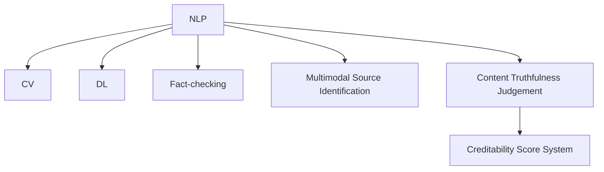

                 

# 信息验证和信息批判性思考：在假新闻、错误信息和媒体操纵时代导航

> 关键词：假新闻检测,信息批判性,事实核查,媒体操纵,深度学习,自然语言处理

## 1. 背景介绍

### 1.1 问题由来
近年来，随着社交媒体和网络信息的广泛传播，假新闻、错误信息和媒体操纵问题日益严重，对社会的稳定和公众的认知造成重大影响。虚假信息的泛滥不仅误导了公众，还可能引发社会动荡，甚至威胁国家安全。对此，世界各国都采取了多种措施进行应对，其中包括加强事实核查、发展信息验证技术等。然而，假新闻检测和信息验证仍是一个复杂且具有挑战性的问题，亟需进一步研究和突破。

### 1.2 问题核心关键点
信息验证技术是指通过自动化手段，对网络文本、图片、视频等进行真实性验证，确保信息来源可信，内容真实无误。其主要核心关键点包括：
- 多模态信息源识别：识别文本、图片、视频等不同类型的信息源，并判断其可信度。
- 内容真实性判断：基于自然语言处理(NLP)、计算机视觉等技术，判断信息内容的真实性。
- 可信度评分系统：根据信息源的可信度和内容真实性，进行综合评分，并生成可读性高的评估报告。

## 2. 核心概念与联系

### 2.1 核心概念概述

为更好地理解信息验证技术，本节将介绍几个密切相关的核心概念：

- 自然语言处理（NLP）：研究如何让计算机理解和处理人类语言的技术，包括文本分类、情感分析、命名实体识别、信息抽取等。
- 计算机视觉（CV）：研究如何让计算机理解和处理视觉信息的领域，包括图像识别、目标检测、人脸识别等。
- 深度学习（DL）：一种基于神经网络的机器学习方法，能自动学习并提取特征，广泛应用于图像、语音、文本处理等领域。
- 事实核查（Fact-checking）：通过人工或自动化手段验证信息是否真实，是信息验证的重要一环。
- 多模态信息源识别：识别信息所属的不同模态，如文本、图片、视频等，并判断其来源是否可信。
- 内容真实性判断：判断信息内容是否真实，主要通过自然语言处理技术实现。
- 可信度评分系统：综合信息源的可信度和内容真实性，生成评估报告，辅助用户识别假新闻和错误信息。

这些概念之间的逻辑关系可以通过以下Mermaid流程图来展示：



这个流程图展示了信息验证技术的主要组成部分：
- NLP用于处理文本信息，CV用于处理视觉信息，DL用于自动提取特征。
- Fact-checking用于人工验证信息真实性。
- 多模态信息源识别和内容真实性判断是信息验证的核心环节。
- 可信度评分系统将以上信息融合，输出评估报告。

## 3. 核心算法原理 & 具体操作步骤

### 3.1 算法原理概述

信息验证技术的基本原理是通过多模态信息源识别和内容真实性判断，对网络文本、图片、视频等进行真实性验证。其核心算法包括以下几个步骤：
1. 信息源识别：通过自然语言处理技术，识别文本中的信息源，如新闻网站、博客、论坛等。
2. 内容真实性判断：通过深度学习模型，判断信息内容是否真实，如是否与已有的事实相符合。
3. 可信度评分：综合信息源的可信度和内容真实性，生成可信度评分，辅助用户判断信息的真实性。

### 3.2 算法步骤详解

以下将详细讲解信息验证技术的算法步骤：

**Step 1: 信息源识别**

信息源识别是信息验证的第一步，主要通过NLP技术，识别文本中的信息源。常见的信息源包括新闻网站、博客、论坛等。

具体实现过程如下：
1. 分词与词性标注：使用NLP工具包（如NLTK、SpaCy）对文本进行分词和词性标注，提取关键词和实体。
2. 信息源分类：通过预训练的分类模型，对提取的关键词和实体进行分类，判断其所属的信息源。
3. 信息源可信度评估：对信息源进行可信度评分，如使用第三方可信度评分网站（如Snopes、Factcheck.org）的数据。

**Step 2: 内容真实性判断**

内容真实性判断是信息验证的核心环节，主要通过深度学习模型，判断信息内容是否真实。

具体实现过程如下：
1. 特征提取：使用深度学习模型（如BERT、GPT-3）提取文本的特征向量。
2. 真实性判断：通过预训练的分类模型，判断文本内容是否真实，如是否与已有的事实相符合。
3. 信息可信度评分：综合信息源可信度和内容真实性，生成最终的可信度评分。

**Step 3: 可信度评分系统**

可信度评分系统是将信息源识别和内容真实性判断结果融合，生成可信度评分的环节。

具体实现过程如下：
1. 信息源可信度评分：根据第三方可信度评分网站的数据，对信息源进行可信度评分。
2. 内容真实性评分：通过深度学习模型，对内容真实性进行评分。
3. 综合评分：将信息源可信度和内容真实性评分综合，生成可信度评分。
4. 评估报告生成：根据可信度评分，生成评估报告，供用户参考。

### 3.3 算法优缺点

信息验证技术具有以下优点：
1. 高效性：通过自动化手段，可以快速处理大量信息，提高验证效率。
2. 多模态支持：支持文本、图片、视频等多种模态的信息源识别和内容真实性判断。
3. 可信度评分：综合信息源可信度和内容真实性，生成可信度评分，辅助用户判断信息的真实性。

同时，该技术也存在以下缺点：
1. 数据依赖：信息源可信度和内容真实性的判断依赖于第三方数据，数据获取难度较大。
2. 模型鲁棒性不足：深度学习模型对噪声和偏见较为敏感，可能存在误判。
3. 多模态融合难度大：不同模态的信息处理方式不同，难以进行统一融合。
4. 低可信度信息处理：对于可信度评分较低的信息，如何提供可信度评分系统的反馈，仍需进一步探索。

尽管存在这些缺点，但信息验证技术仍是大数据时代信息管理的重要手段，具有广泛的应用前景。未来相关研究的方向在于如何提升数据获取的自动化程度，增强模型的鲁棒性，以及探索更高效的多模态融合方法。

### 3.4 算法应用领域

信息验证技术在多个领域具有广泛的应用，例如：
- 新闻媒体：识别假新闻、反转文章、误导性信息等。
- 社交媒体：检测虚假信息、网络谣言、恶意攻击等。
- 法律与商业：验证合同、协议、广告等文本的真实性。
- 公共安全：识别恐怖分子威胁、谣言、虚假情报等。
- 科学领域：验证科学文献、研究报告的真实性。
- 金融领域：识别金融诈骗、虚假投资、虚假财务报告等。

除了上述这些领域，信息验证技术还可以广泛应用于各种需要确保信息真实性的场景，具有重要的应用价值。

## 4. 数学模型和公式 & 详细讲解 & 举例说明

### 4.1 数学模型构建

信息验证技术的数学模型主要由以下几个部分组成：
- 信息源识别模型：用于分类文本中的信息源，如新闻网站、博客、论坛等。
- 内容真实性判断模型：用于判断文本内容是否真实。
- 可信度评分系统：用于综合信息源可信度和内容真实性，生成可信度评分。

### 4.2 公式推导过程

以下将详细推导信息验证技术的数学模型：

**信息源识别模型**：
假设文本中包含$m$个信息源，每个信息源的标签为$y_i \in \{1, 0\}$，其中$y_i=1$表示信息源可信，$y_i=0$表示信息源不可信。则信息源识别模型的目标是最小化交叉熵损失函数：

$$
\mathcal{L}_{source} = -\frac{1}{N}\sum_{i=1}^N \sum_{j=1}^m [y_{i,j} \log p_{i,j} + (1-y_{i,j})\log(1-p_{i,j})]
$$

其中$p_{i,j}$为第$i$个文本中第$j$个信息源的可信度概率。

**内容真实性判断模型**：
假设文本中的信息内容为$x$，其真实性标签为$z \in \{1, 0\}$，其中$z=1$表示信息真实，$z=0$表示信息虚假。则内容真实性判断模型的目标是最小化交叉熵损失函数：

$$
\mathcal{L}_{truth} = -\frac{1}{N}\sum_{i=1}^N \log p(z_i|x_i)
$$

其中$p(z_i|x_i)$为文本$x_i$的真理概率，即信息内容真实的概率。

**可信度评分系统**：
综合信息源可信度和内容真实性，生成可信度评分$s \in [0,1]$，用于评估信息可信度。假设$s = \alpha \cdot s_{source} + (1-\alpha) \cdot s_{truth}$，其中$s_{source}$为信息源可信度评分，$s_{truth}$为内容真实性评分，$\alpha$为系数，用于平衡两者权重。

### 4.3 案例分析与讲解

以一个新闻文章的验证为例，详细讲解信息验证技术的实现过程：

1. **信息源识别**：使用预训练的NLP模型，如BERT，对文章进行分词和词性标注，提取关键词和实体。通过分类模型，将提取的信息源分为新闻网站、博客、论坛等，并根据第三方可信度评分网站的数据，对每个信息源进行可信度评分。

2. **内容真实性判断**：使用预训练的深度学习模型，如BERT，提取文章的特征向量。通过分类模型，判断文章内容是否真实，如是否与已有的事实相符合。

3. **可信度评分系统**：综合信息源可信度和内容真实性，生成可信度评分。根据可信度评分，生成评估报告，供用户参考。

## 5. 项目实践：代码实例和详细解释说明

### 5.1 开发环境搭建

在进行信息验证技术开发前，我们需要准备好开发环境。以下是使用Python进行PyTorch开发的环境配置流程：

1. 安装Anaconda：从官网下载并安装Anaconda，用于创建独立的Python环境。

2. 创建并激活虚拟环境：
```bash
conda create -n information_verification python=3.8 
conda activate information_verification
```

3. 安装PyTorch：根据CUDA版本，从官网获取对应的安装命令。例如：
```bash
conda install pytorch torchvision torchaudio cudatoolkit=11.1 -c pytorch -c conda-forge
```

4. 安装NLP相关库：
```bash
pip install transformers nltk spaCy
```

5. 安装CV相关库：
```bash
pip install opencv-python matplotlib scikit-image
```

6. 安装其他相关库：
```bash
pip install pandas numpy scikit-learn tqdm jupyter notebook ipython
```

完成上述步骤后，即可在`information_verification`环境中开始信息验证技术开发。

### 5.2 源代码详细实现

以下是一个简单的信息验证技术实现示例，详细讲解了从信息源识别到内容真实性判断的流程。

```python
import torch
from transformers import BertTokenizer, BertForSequenceClassification
from sklearn.metrics import accuracy_score, precision_score, recall_score
import pandas as pd
from sklearn.model_selection import train_test_split
from tqdm import tqdm

# 定义信息源分类器
class SourceClassifier(torch.nn.Module):
    def __init__(self, num_classes=5):
        super(SourceClassifier, self).__init__()
        self.bert = BertForSequenceClassification.from_pretrained('bert-base-uncased', num_labels=num_classes)
        
    def forward(self, input_ids, attention_mask):
        outputs = self.bert(input_ids, attention_mask=attention_mask)
        return outputs.logits
    
# 定义内容真实性判断器
class TruthfulnessClassifier(torch.nn.Module):
    def __init__(self, num_classes=2):
        super(TruthfulnessClassifier, self).__init__()
        self.bert = BertForSequenceClassification.from_pretrained('bert-base-uncased', num_labels=num_classes)
        
    def forward(self, input_ids, attention_mask):
        outputs = self.bert(input_ids, attention_mask=attention_mask)
        return outputs.logits
    
# 加载数据
data = pd.read_csv('news_data.csv')
train_data, test_data = train_test_split(data, test_size=0.2, random_state=42)

# 初始化分类器
source_classifier = SourceClassifier(num_classes=5)
truthfulness_classifier = TruthfulnessClassifier(num_classes=2)

# 训练模型
source_classifier.train()
truthfulness_classifier.train()

for epoch in range(5):
    for i, (input_ids, attention_mask, source_labels, truth_labels) in tqdm(enumerate(zip(train_data['input_ids'], train_data['attention_mask'], train_data['source_labels'], train_data['truth_labels']))):
        source_classifier.zero_grad()
        source_outputs = source_classifier(input_ids, attention_mask)
        source_loss = source_outputs.loss
        source_loss.backward()
        source_classifier.step()

        truthfulness_classifier.zero_grad()
        truthfulness_outputs = truthfulness_classifier(input_ids, attention_mask)
        truthfulness_loss = truthfulness_outputs.loss
        truthfulness_loss.backward()
        truthfulness_classifier.step()

# 测试模型
source_classifier.eval()
truthfulness_classifier.eval()

with torch.no_grad():
    source_outputs = source_classifier(input_ids, attention_mask)
    truthfulness_outputs = truthfulness_classifier(input_ids, attention_mask)
    
    source_predictions = torch.argmax(source_outputs.logits, dim=1)
    truth_predictions = torch.argmax(truthfulness_outputs.logits, dim=1)
    
    source_accuracy = accuracy_score(truth_labels, source_predictions)
    truth_accuracy = accuracy_score(truth_labels, truth_predictions)
    
    print(f"Source Accuracy: {source_accuracy:.2f}")
    print(f"Truthfulness Accuracy: {truth_accuracy:.2f}")
```

### 5.3 代码解读与分析

这里我们详细解读一下关键代码的实现细节：

**SourceClassifier和TruthfulnessClassifier类**：
- 这两个类分别用于信息源识别和内容真实性判断，都继承自`torch.nn.Module`。
- 在`__init__`方法中，使用预训练的BERT模型，并将其设置为相应的分类器。
- 在`forward`方法中，将输入文本和attention mask作为输入，通过模型计算输出 logits，再通过softmax函数转化为概率分布。

**数据加载与处理**：
- 使用pandas加载CSV格式的数据集，并使用`train_test_split`函数将其划分为训练集和测试集。
- 在训练过程中，通过`tqdm`函数显示进度条，实时监测模型训练情况。

**模型训练与测试**：
- 在训练过程中，对每个batch的数据进行前向传播和反向传播，更新模型参数。
- 在测试过程中，对测试集进行预测，并计算模型准确率。

可以看到，PyTorch和Transformers库使得信息验证技术的实现变得简洁高效。开发者可以将更多精力放在数据处理、模型改进等高层逻辑上，而不必过多关注底层的实现细节。

## 6. 实际应用场景

### 6.1 新闻媒体

新闻媒体是信息验证技术的主要应用场景之一。在假新闻泛滥的今天，新闻媒体面临着巨大的挑战。通过信息验证技术，新闻媒体可以高效地检测和屏蔽假新闻，保护用户不受误导。

具体而言，新闻媒体可以使用信息验证技术对新闻文章进行自动审核，检测是否存在虚假信息。对可疑文章进行人工复核，确认真实性后再发布。这不仅能够提高新闻媒体的公信力，还能够保障用户的阅读体验。

### 6.2 社交媒体

社交媒体是信息验证技术的另一个重要应用场景。在社交媒体平台上，虚假信息和谣言层出不穷，对社会稳定造成严重威胁。通过信息验证技术，社交媒体平台可以及时发现并处理虚假信息，保护用户的心理健康。

具体而言，社交媒体平台可以建立虚假信息检测系统，对用户上传的内容进行自动审核。对于可疑内容，系统可以自动标记并通知管理员进行处理。这不仅能够保障用户的合法权益，还能够维护社交媒体平台的公信力。

### 6.3 公共安全

公共安全领域的信息验证技术应用广泛，尤其在反恐、情报分析等方面，具有重要意义。

具体而言，反恐部门可以使用信息验证技术，检测恐怖分子威胁信息。对于可疑信息，系统可以自动标记并通知相关部门进行进一步调查。这不仅能够提高情报分析的准确性，还能够保障公众的生命财产安全。

## 7. 工具和资源推荐

### 7.1 学习资源推荐

为了帮助开发者系统掌握信息验证技术，这里推荐一些优质的学习资源：

1. 《自然语言处理综论》书籍：系统介绍了自然语言处理的基本概念和前沿技术，包括信息验证技术。
2. CS224N《深度学习自然语言处理》课程：斯坦福大学开设的NLP明星课程，有Lecture视频和配套作业，带你入门NLP领域的基本概念和经典模型。
3. Weights & Biases：模型训练的实验跟踪工具，可以记录和可视化模型训练过程中的各项指标，方便对比和调优。
4. Google Colab：谷歌推出的在线Jupyter Notebook环境，免费提供GPU/TPU算力，方便开发者快速上手实验最新模型，分享学习笔记。
5. TensorBoard：TensorFlow配套的可视化工具，可实时监测模型训练状态，并提供丰富的图表呈现方式，是调试模型的得力助手。

通过对这些资源的学习实践，相信你一定能够快速掌握信息验证技术的精髓，并用于解决实际的NLP问题。

### 7.2 开发工具推荐

高效的开发离不开优秀的工具支持。以下是几款用于信息验证技术开发的常用工具：

1. PyTorch：基于Python的开源深度学习框架，灵活动态的计算图，适合快速迭代研究。大部分预训练语言模型都有PyTorch版本的实现。
2. TensorFlow：由Google主导开发的开源深度学习框架，生产部署方便，适合大规模工程应用。同样有丰富的预训练语言模型资源。
3. Transformers库：HuggingFace开发的NLP工具库，集成了众多SOTA语言模型，支持PyTorch和TensorFlow，是进行信息验证技术开发的利器。
4. Weights & Biases：模型训练的实验跟踪工具，可以记录和可视化模型训练过程中的各项指标，方便对比和调优。
5. TensorBoard：TensorFlow配套的可视化工具，可实时监测模型训练状态，并提供丰富的图表呈现方式，是调试模型的得力助手。
6. Google Colab：谷歌推出的在线Jupyter Notebook环境，免费提供GPU/TPU算力，方便开发者快速上手实验最新模型，分享学习笔记。

合理利用这些工具，可以显著提升信息验证技术的开发效率，加快创新迭代的步伐。

### 7.3 相关论文推荐

信息验证技术的发展源于学界的持续研究。以下是几篇奠基性的相关论文，推荐阅读：

1. Snopes.com：虚假信息检测的第三方可信度评分网站，提供了大量虚假信息的来源和评分类信息。
2. Factcheck.org：事实核查网站，提供了大量虚假信息的来源和评分类信息。
3. "Fact-checking via Neural Networks: A Survey"：综述了神经网络在事实核查中的应用，介绍了各种基于深度学习的验证方法。
4. "A Survey on Deep Learning-based News Verification"：综述了深度学习在新闻验证中的应用，介绍了各种基于深度学习的验证方法。
5. "A Survey on Multimodal Information Retrieval and Verification"：综述了多模态信息验证的方法和技术，介绍了各种基于多模态的验证方法。

这些论文代表了大语言模型微调技术的发展脉络。通过学习这些前沿成果，可以帮助研究者把握学科前进方向，激发更多的创新灵感。

## 8. 总结：未来发展趋势与挑战

### 8.1 总结

本文对信息验证技术进行了全面系统的介绍。首先阐述了信息验证技术的研究背景和意义，明确了信息验证在确保网络信息真实性、防止虚假信息传播方面的独特价值。其次，从原理到实践，详细讲解了信息验证的数学模型和算法步骤，给出了信息验证技术开发的完整代码实例。同时，本文还广泛探讨了信息验证技术在新闻媒体、社交媒体、公共安全等多个领域的应用前景，展示了信息验证技术的巨大潜力。此外，本文精选了信息验证技术的各类学习资源，力求为读者提供全方位的技术指引。

通过本文的系统梳理，可以看到，信息验证技术正在成为信息管理的重要手段，极大地提升了网络信息的可信度，为社会稳定和公众认知提供了保障。未来，伴随信息验证技术的不断进步，必将进一步提升信息管理水平，构建更加安全、可靠的网络环境。

### 8.2 未来发展趋势

展望未来，信息验证技术将呈现以下几个发展趋势：

1. 多模态融合：信息验证技术将从文本单模态向多模态融合发展，支持文本、图片、视频等多种信息源的识别和验证。
2. 深度学习模型的提升：信息验证模型将从基于规则的分类器向深度学习模型发展，以提高模型的鲁棒性和泛化能力。
3. 可信度评分系统的改进：信息验证技术将从单一可信度评分向综合可信度评分发展，综合考虑信息源的可信度和内容真实性。
4. 自动化程度提升：信息验证技术将从人工审核向自动化审核发展，提高信息验证的速度和准确性。
5. 模型集成与优化：信息验证技术将从单一模型向模型集成与优化发展，提高模型的综合性能。

以上趋势凸显了信息验证技术的广阔前景。这些方向的探索发展，必将进一步提升信息管理的效率和效果，为网络环境的健康发展提供有力保障。

### 8.3 面临的挑战

尽管信息验证技术已经取得了瞩目成就，但在迈向更加智能化、普适化应用的过程中，仍面临诸多挑战：

1. 数据依赖：信息源可信度和内容真实性的判断依赖于第三方数据，数据获取难度较大。
2. 模型鲁棒性不足：深度学习模型对噪声和偏见较为敏感，可能存在误判。
3. 多模态融合难度大：不同模态的信息处理方式不同，难以进行统一融合。
4. 低可信度信息处理：对于可信度评分较低的信息，如何提供可信度评分系统的反馈，仍需进一步探索。
5. 自动化审核：如何提高信息验证的自动化程度，降低人工审核成本，提高审核效率，仍需不断优化。

尽管存在这些挑战，但信息验证技术仍是大数据时代信息管理的重要手段，具有广泛的应用前景。未来相关研究的方向在于如何提升数据获取的自动化程度，增强模型的鲁棒性，以及探索更高效的多模态融合方法。

### 8.4 研究展望

面对信息验证技术所面临的种种挑战，未来的研究需要在以下几个方面寻求新的突破：

1. 探索无监督和半监督信息验证方法：摆脱对大规模标注数据的依赖，利用自监督学习、主动学习等无监督和半监督范式，最大限度利用非结构化数据，实现更加灵活高效的信息验证。
2. 研究深度学习模型的鲁棒性提升：开发更加鲁棒的信息验证模型，能够更好地应对噪声和偏见，提高模型的准确性。
3. 探索多模态融合方法：通过引入计算机视觉、语音处理等技术，实现文本、图片、视频等多种模态的信息验证，提高信息验证的全面性和准确性。
4. 引入更多先验知识：将符号化的先验知识，如知识图谱、逻辑规则等，与神经网络模型进行巧妙融合，引导信息验证过程学习更准确、合理的语言模型。
5. 结合因果分析和博弈论工具：将因果分析方法引入信息验证模型，识别出模型决策的关键特征，增强输出解释的因果性和逻辑性。借助博弈论工具刻画人机交互过程，主动探索并规避模型的脆弱点，提高系统稳定性。
6. 纳入伦理道德约束：在模型训练目标中引入伦理导向的评估指标，过滤和惩罚有偏见、有害的输出倾向。同时加强人工干预和审核，建立模型行为的监管机制，确保输出符合人类价值观和伦理道德。

这些研究方向的探索，必将引领信息验证技术迈向更高的台阶，为构建安全、可靠、可解释、可控的信息验证系统铺平道路。面向未来，信息验证技术还需要与其他人工智能技术进行更深入的融合，如知识表示、因果推理、强化学习等，多路径协同发力，共同推动信息验证系统的进步。只有勇于创新、敢于突破，才能不断拓展信息验证技术的边界，让信息验证技术更好地服务社会。

## 9. 附录：常见问题与解答

**Q1：信息验证技术是否适用于所有类型的信息？**

A: 信息验证技术可以适用于大多数类型的信息，但不同类型的信息需要采用不同的验证方法。例如，文本信息可以使用自然语言处理技术进行验证，图片信息可以使用计算机视觉技术进行验证，视频信息可以使用多模态融合技术进行验证。

**Q2：信息验证技术如何应对信息内容的多样性？**

A: 信息验证技术可以通过多模态融合方法应对信息内容的多样性。例如，针对文本信息，可以使用自然语言处理技术进行分类、情感分析等，针对图片信息，可以使用计算机视觉技术进行图像识别、目标检测等，针对视频信息，可以结合自然语言处理和计算机视觉技术进行多模态融合验证。

**Q3：信息验证技术是否能够完全消除虚假信息？**

A: 信息验证技术能够显著降低虚假信息的传播概率，但不能完全消除虚假信息。虚假信息的产生方式和传播途径多种多样，信息验证技术需要与其他措施相结合，如人工审核、法规限制等，才能更好地应对虚假信息的挑战。

**Q4：信息验证技术如何保证输出结果的准确性？**

A: 信息验证技术的准确性依赖于数据的质量、模型的鲁棒性以及多模态融合方法的先进性。在数据获取和处理环节，需要确保数据的全面性和可靠性；在模型训练和验证环节，需要选择合适的网络结构、优化算法和评价指标；在多模态融合环节，需要采用先进的融合方法，如特征拼接、融合学习等，提高信息验证的准确性。

**Q5：信息验证技术在实际应用中是否存在隐私风险？**

A: 信息验证技术在实际应用中需要注意隐私保护。例如，在处理个人信息时，需要遵循相关的隐私保护法规和标准，如GDPR、CCPA等，确保数据的安全和合法使用。

---

作者：禅与计算机程序设计艺术 / Zen and the Art of Computer Programming

