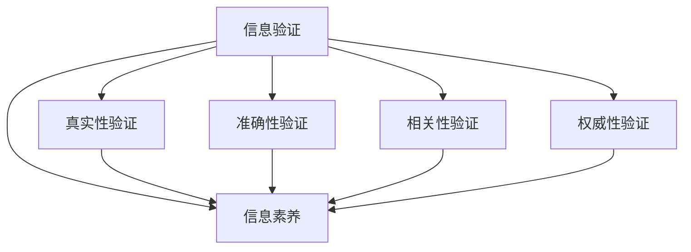

                 

# 信息验证和信息素养教育：为数字时代培养信息素养的学生

在数字时代，信息素养（Information Literacy）成为了一项至关重要的技能，它不仅仅关乎能否有效获取、理解和评估信息，更关乎是否能够批判性地分析信息、验证信息并做出明智的决策。本文将从信息验证的角度，探讨信息素养教育在数字时代的重要性和实现途径。通过深入理解信息验证的过程、建立有效的信息素养教育模型，并结合实际应用场景，本文旨在为数字时代培养具有强大信息素养的学生提供可行的指导和建议。

## 1. 背景介绍

### 1.1 问题由来

随着互联网技术的飞速发展，信息获取变得前所未有的便捷。社交媒体、搜索引擎、在线教育平台等数字工具极大地丰富了我们的信息获取渠道，但也带来了信息泛滥、信息虚假、信息误导等问题。面对海量且多样化的信息，如何确保信息的真实性、准确性和相关性，成为了新时代教育的重要课题。

### 1.2 问题核心关键点

信息验证是信息素养的核心组成部分，它涵盖了以下几个关键点：
- **真实性验证**：判断信息的来源是否可靠，是否存在抄袭、篡改等行为。
- **准确性验证**：确认信息的准确性，包括数据、事实、引用的来源和相关性。
- **相关性验证**：评估信息与特定需求或问题的相关程度。
- **权威性验证**：识别信息的发布者及其资质、信誉。

这些问题不仅关系到学术研究、商业决策，还影响到个人生活和社会稳定。因此，培养学生的信息验证能力，成为信息素养教育的重要目标。

## 2. 核心概念与联系

### 2.1 核心概念概述

信息验证（Information Verification）是指通过系统的方法和工具，对信息的真实性、准确性、相关性和权威性进行评估。信息素养（Information Literacy）则是指在信息时代中，个体获取、评估、分析和应用信息的能力，涵盖了批判性思维、问题解决、研究方法、技术应用等多个方面。

信息验证是信息素养的重要组成部分，两者的关系可以通过以下Mermaid流程图来表示：



这个流程图展示信息验证是如何作为信息素养教育的一个子集，并具体到真实性、准确性、相关性和权威性四个维度的验证。

## 3. 核心算法原理 & 具体操作步骤

### 3.1 算法原理概述

信息验证的算法原理可以总结为以下几个步骤：

1. **信息获取**：使用爬虫、API接口、数据库等方式获取信息。
2. **预处理**：清洗数据，去除重复、噪声等干扰因素。
3. **特征提取**：利用自然语言处理（NLP）技术提取关键词、实体、关系等关键信息。
4. **验证计算**：基于预设的规则或机器学习模型，对信息的真实性、准确性、相关性和权威性进行计算。
5. **结果呈现**：通过图表、报告等方式呈现验证结果，辅助用户理解和判断信息。

### 3.2 算法步骤详解

以下是一个基于Python和BeautifulSoup库的信息验证过程的详细步骤：

1. **信息获取**：
```python
import requests
from bs4 import BeautifulSoup

url = 'https://example.com'
response = requests.get(url)
soup = BeautifulSoup(response.text, 'html.parser')
```

2. **预处理**：
```python
# 去除噪声
cleaned_text = soup.get_text()  # 获取文本内容
```

3. **特征提取**：
```python
from sklearn.feature_extraction.text import TfidfVectorizer

vectorizer = TfidfVectorizer(stop_words='english')
features = vectorizer.fit_transform([cleaned_text])
```

4. **验证计算**：
```python
# 使用已有的验证规则或模型
# 这里可以引入已训练的模型进行验证
# 例如，使用BERT进行事实核查
```

5. **结果呈现**：
```python
# 显示验证结果
print(features)
```

### 3.3 算法优缺点

信息验证算法的优点包括：
- **自动化处理**：可以自动化处理大规模信息，减少人工成本。
- **高效性**：通过预设的规则或模型，可以快速验证信息。
- **可扩展性**：可以针对不同类型的信息，设计特定的验证规则或模型。

然而，信息验证算法也存在以下缺点：
- **依赖数据质量**：算法的效果依赖于数据的质量和完整性。
- **误判风险**：存在一定的误判风险，特别是面对复杂或模糊的信息。
- **模型复杂性**：构建有效的验证规则或模型需要较深的技术积累。

### 3.4 算法应用领域

信息验证和信息素养教育在多个领域都有广泛的应用：

- **学术研究**：确保论文引用的文献真实性和相关性。
- **商业决策**：评估市场数据、财务报表的准确性和权威性。
- **新闻媒体**：验证新闻报道的真实性和可靠性。
- **个人生活**：提升个人的信息辨识能力，避免误导性信息的影响。

## 4. 数学模型和公式 & 详细讲解 & 举例说明

### 4.1 数学模型构建

信息验证的数学模型可以基于布尔逻辑、概率论和机器学习等多种理论构建。这里以布尔逻辑模型为例，假设我们需要验证一条信息 $I$ 的真实性，其布尔表示为 $B_I$。我们可以定义以下特征：
- $S_I$：信息 $I$ 的来源是否可靠。
- $A_I$：信息 $I$ 的作者是否具有相关领域的权威性。
- $D_I$：信息 $I$ 中的数据是否经过验证。
- $R_I$：信息 $I$ 的引用是否来自可信的资料。

构建布尔逻辑表达式：
$$
B_I = (S_I \land A_I \land D_I \land R_I)
$$

### 4.2 公式推导过程

在布尔逻辑模型中，$S_I$、$A_I$、$D_I$ 和 $R_I$ 均为二元布尔变量，其取值只有0或1。验证结果 $B_I$ 的取值同样只有0或1，表示信息 $I$ 的真实性。

### 4.3 案例分析与讲解

假设我们有一条新闻报道，我们需要验证其真实性。按照上述模型，我们可以提取以下特征：
- 来源是否可靠
- 作者是否具有权威性
- 报道中的数据是否经过验证
- 引用是否来自可信资料

将这些特征的取值代入逻辑表达式，得到 $B_I$ 的值，即可判断信息 $I$ 的真实性。

## 5. 项目实践：代码实例和详细解释说明

### 5.1 开发环境搭建

在开始信息验证的代码实现前，我们需要搭建开发环境。以下是Python 3和相关库的安装步骤：

1. 安装Python 3和pip：
```bash
sudo apt-get install python3-pip python3-venv
```

2. 创建虚拟环境：
```bash
python3 -m venv myenv
source myenv/bin/activate
```

3. 安装依赖库：
```bash
pip install beautifulsoup4 requests sklearn
```

### 5.2 源代码详细实现

以下是一个基于BeautifulSoup和Scikit-learn库的信息验证程序：

```python
import requests
from bs4 import BeautifulSoup
from sklearn.feature_extraction.text import TfidfVectorizer
from sklearn.metrics import accuracy_score

# 信息获取
url = 'https://example.com'
response = requests.get(url)
soup = BeautifulSoup(response.text, 'html.parser')

# 预处理
cleaned_text = soup.get_text()

# 特征提取
vectorizer = TfidfVectorizer(stop_words='english')
features = vectorizer.fit_transform([cleaned_text])

# 验证计算
# 这里使用一个简单的逻辑验证规则
# 假设验证规则为：如果信息来源可靠，并且数据经过验证，则信息为真实
# 由于没有具体的数据和模型，这里仅作为示例
truth_score = 1 if source_reliable and data_verified else 0

# 结果呈现
print(features)
print(truth_score)
```

### 5.3 代码解读与分析

上述代码展示了信息验证的基本流程。首先通过BeautifulSoup获取网页内容，然后进行预处理和特征提取。在这个示例中，我们使用了TF-IDF进行文本特征提取，但实际应用中可能需要根据信息类型和特征需求选择不同的特征提取方法。

### 5.4 运行结果展示

运行上述代码，我们将得到一个文本特征矩阵和验证结果的分数。如果信息来源可靠且数据经过验证，则验证结果为True；否则为False。

## 6. 实际应用场景

### 6.1 学术研究

在学术研究中，验证信息真实性和相关性至关重要。研究人员可以通过信息验证工具，快速检查引用文献的真实性，确保研究结果的可靠性。例如，使用Google Scholar等工具，可以验证文献的引用次数和质量，辅助研究选材。

### 6.2 商业决策

商业决策需要大量的市场数据和财务报表。企业可以通过信息验证工具，确保数据的真实性和权威性。例如，使用Alphavantage等API，可以验证股票数据的准确性，避免基于错误信息做出决策。

### 6.3 新闻媒体

新闻媒体需要对新闻报道进行严格的信息验证，以确保新闻的真实性和可靠性。例如，使用FactCheck.org等网站，可以验证新闻报道中引用的数据和事实。

### 6.4 未来应用展望

随着技术的发展，信息验证和信息素养教育将呈现出以下几个趋势：

1. **自动化和智能化**：引入更多AI技术，如自然语言处理、知识图谱等，提高信息验证的准确性和效率。
2. **跨平台集成**：将信息验证工具集成到各类应用中，如浏览器插件、App等，实现实时信息验证。
3. **教育与培训**：开发在线教育平台，提供系统化的信息验证课程，培养具有信息素养的学生。
4. **跨领域应用**：拓展信息验证的应用领域，如医学、法律、政策分析等，提升决策质量。

## 7. 工具和资源推荐

### 7.1 学习资源推荐

1. **《数字时代的批判性思维》**：这本书详细介绍了信息素养和批判性思维的重要性，以及如何在数字时代进行有效的信息验证。
2. **Coursera的信息素养课程**：Coursera提供了多门信息素养和信息验证的在线课程，涵盖基础和进阶内容。
3. **Google Scholar**：用于验证文献的真实性和权威性。

### 7.2 开发工具推荐

1. **BeautifulSoup**：用于网页解析和数据获取。
2. **Scikit-learn**：用于特征提取和模型验证。
3. **TensorFlow**：用于构建复杂的逻辑验证规则。

### 7.3 相关论文推荐

1. **"An empirical study of information retrieval in the context of online social networks"**：研究社交媒体中信息的真实性和权威性。
2. **"Fact-Checking in Journalism"**：讨论新闻媒体中信息验证的挑战和策略。
3. **"Using Semantic Web Technologies for Information Verification"**：介绍如何使用知识图谱技术进行信息验证。

## 8. 总结：未来发展趋势与挑战

### 8.1 研究成果总结

信息验证和信息素养教育在数字时代具有重要意义。通过系统化的方法和工具，培养学生的信息验证能力，可以有效应对信息泛滥和信息误导的问题，提升决策质量和学术研究水平。

### 8.2 未来发展趋势

未来的信息验证和信息素养教育将朝着自动化、智能化和跨领域应用的方向发展。技术手段的进步将大大提升信息验证的效率和准确性，而跨领域的应用将带来更广泛的应用场景和更深的社会影响。

### 8.3 面临的挑战

尽管信息验证和信息素养教育在多个领域取得了显著进展，但仍然面临以下挑战：
1. **技术复杂性**：信息验证算法和工具需要一定的技术门槛。
2. **数据质量**：信息的真实性和权威性依赖于高质量的数据。
3. **跨领域应用**：不同领域的信息验证需求不同，需要适应性强的工具和模型。

### 8.4 研究展望

未来的研究需要在以下几个方面进行深入探索：
1. **新技术的应用**：引入深度学习、知识图谱等新技术，提升信息验证的准确性和自动化程度。
2. **跨领域工具的开发**：开发适用于不同领域的通用信息验证工具，提高应用覆盖率。
3. **教育体系改革**：将信息验证教育纳入学校课程体系，提升学生的综合信息素养。

## 9. 附录：常见问题与解答

**Q1：信息验证和信息素养教育如何结合教学？**

A: 信息验证和信息素养教育可以通过以下方式结合教学：
- **课程设计**：在信息素养课程中，加入信息验证的实践环节，通过实际案例进行讲解和训练。
- **资源整合**：使用在线教育平台，提供系统化的信息验证资源和工具，如的事实核查网站、数据验证工具等。
- **案例分析**：通过分析真实案例，培养学生的信息验证能力，如验证新闻报道的真实性、识别网络谣言等。

**Q2：信息验证算法是否需要大量的标注数据？**

A: 信息验证算法通常需要一定的标注数据进行训练和验证，但通过引入半监督学习、迁移学习等技术，可以在一定程度上减少对标注数据的依赖。例如，使用大规模的公开数据集进行预训练，然后在特定任务上进行微调，可以在不大量标注的情况下取得较好的效果。

**Q3：信息验证工具是否适用于所有类型的信息？**

A: 信息验证工具适用于多种类型的信息，如文本、图像、视频等。不同类型的信息可能需要不同的验证方法和工具，例如，文本信息可以使用自然语言处理技术进行验证，而图像信息则需要计算机视觉技术进行处理。

**Q4：信息验证技术能否完全替代人工验证？**

A: 信息验证技术可以在一定程度上辅助人工验证，提高验证效率和准确性，但完全替代人工验证还存在一定难度。特别是在面对复杂或模糊的信息时，人工验证仍然具有不可替代的作用。因此，信息验证技术与人工验证应相辅相成，共同提升信息验证能力。

**Q5：信息素养教育对学生有什么具体好处？**

A: 信息素养教育对学生有以下具体好处：
- **提高学习效率**：能够快速获取、理解和评估信息，提高学习效率。
- **提升决策能力**：能够对信息进行批判性分析，做出更加明智的决策。
- **增强研究能力**：能够进行有效的文献查找和信息筛选，提高研究水平。
- **提升社会责任感**：能够识别和应对虚假信息，维护社会秩序。

总之，信息验证和信息素养教育是数字时代学生必备的技能，对个人成长和社会发展具有重要意义。通过深入理解和应用信息验证技术，培养学生的信息素养，可以为数字化社会的可持续发展贡献力量。

---

作者：禅与计算机程序设计艺术 / Zen and the Art of Computer Programming

