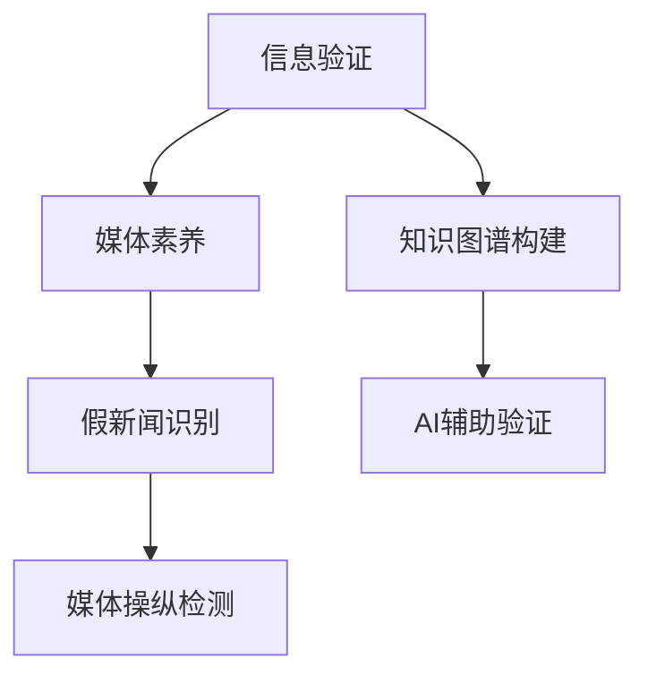

                 

## 1. 背景介绍

### 1.1 问题由来

在信息爆炸的时代，海量的新闻信息充斥着我们的日常生活。然而，其中不乏假新闻和带有偏见的报道，这些信息不仅误导公众，还可能引发社会动荡。如何培养公众的信息验证能力，提升媒体素养，成为了一个亟待解决的问题。

### 1.2 问题核心关键点

信息验证和媒体素养能力的培养，关键在于培养公众分辨信息真伪、识别媒体偏见的能力。这需要构建一套系统化的教育和培训机制，涵盖基础知识和技能训练，以及持续的知识更新和思维训练。

## 2. 核心概念与联系

### 2.1 核心概念概述

为更好地理解信息验证和媒体素养能力培养，本节将介绍几个密切相关的核心概念：

- **信息验证**：通过一定的技术和方法，对信息源的真实性、可靠性进行核实和评估的过程。
- **媒体素养**：公众理解和评估媒体报道、广告、社交媒体内容的能力，包括信息的识别、评估、批判性思考等。
- **假新闻**：故意捏造、篡改或夸大的新闻信息，旨在误导公众。
- **媒体操纵**：通过新闻报道、广告、社交媒体等手段，有目的地影响公众情绪和行为。
- **知识图谱**：以图谱形式组织和展示的知识网络，用于辅助信息的关联和推理。
- **AI辅助验证**：利用人工智能技术，如自然语言处理、计算机视觉等，辅助信息验证过程，提高效率和准确性。

这些核心概念之间的逻辑关系可以通过以下Mermaid流程图来展示：



这个流程图展示了好坏新闻识别、媒体操纵检测等信息验证过程的关键步骤，以及媒体素养培养的各个环节，和AI辅助验证技术的应用。

## 3. 核心算法原理 & 具体操作步骤
### 3.1 算法原理概述

信息验证和媒体素养能力培养的核心算法，主要基于自然语言处理(NLP)、计算机视觉(CV)等技术。其核心思想是通过自动化手段，对文本、图片等媒体信息进行深度分析和验证，识别出其中的假新闻和媒体操纵行为。

形式化地，假设我们要验证的信息内容为 $I$，其真实性、可靠性、偏见等特征为 $\mathbf{F}$，则信息验证的过程可以表示为：

$$
\mathbf{F}(I) = \mathbf{F}_{\text{truth}} + \mathbf{F}_{\text{reliability}} + \mathbf{F}_{\text{bias}}
$$

其中 $\mathbf{F}_{\text{truth}}$ 表示信息内容的真实性，$\mathbf{F}_{\text{reliability}}$ 表示信息来源的可靠性，$\mathbf{F}_{\text{bias}}$ 表示信息的偏见程度。

### 3.2 算法步骤详解

信息验证和媒体素养能力培养通常包括以下几个关键步骤：

**Step 1: 数据收集与预处理**
- 收集各类新闻、社交媒体、广告等媒体信息。
- 对文本信息进行分词、去停用词、去除标点等预处理操作。
- 对图片信息进行图像处理，提取特征向量。

**Step 2: 特征提取与编码**
- 使用NLP模型提取文本特征，如BERT、GPT等。
- 使用CV模型提取图片特征，如CNN、ResNet等。
- 将文本特征和图片特征进行编码，如使用TF-IDF、Word2Vec等方法。

**Step 3: 信息验证**
- 基于特征编码，使用分类器、回归器等模型对信息内容进行真伪和偏见识别。
- 使用对抗样本生成技术，提升模型的鲁棒性。
- 引入知识图谱，结合外部知识对信息内容进行验证。

**Step 4: 反馈与优化**
- 对识别结果进行反馈，更新训练数据和模型。
- 对用户反馈进行收集和分析，优化验证模型和训练策略。

### 3.3 算法优缺点

基于AI的信息验证和媒体素养能力培养方法具有以下优点：
1. 高效准确。通过自动化手段，可以快速处理大规模的媒体信息，并给出准确的验证结果。
2. 可扩展性强。可以方便地扩展到不同类型和规模的媒体信息，适用于多种媒体形式。
3. 实时性高。能够实时监测和验证信息，及时发现和应对假新闻和媒体操纵行为。

同时，该方法也存在一定的局限性：
1. 数据依赖性强。需要大量高质量的标注数据和知识图谱，难以在数据稀缺的情况下应用。
2. 复杂性高。涉及多模态数据处理、深度学习模型训练、知识图谱构建等多重技术，技术难度大。
3. 可解释性不足。基于AI的验证过程难以解释，用户可能对模型的决策结果缺乏信任。
4. 道德风险。算法可能被用于恶意目的，如假新闻生成、自动传播假信息等。

尽管存在这些局限性，但就目前而言，基于AI的信息验证和媒体素养能力培养方法仍然是最主流的选择，具有广阔的应用前景。

### 3.4 算法应用领域

信息验证和媒体素养能力培养在多个领域都有广泛的应用，例如：

- **新闻业**：帮助新闻编辑和记者识别假新闻、筛选可靠信息源，提升新闻报道的真实性和公正性。
- **社交媒体**：辅助社交平台管理者识别和删除假新闻、误导信息，构建健康的信息生态。
- **教育**：在学校和社区中普及信息验证和媒体素养教育，提升公众的信息素养和媒体识别能力。
- **公共安全**：在政府和公共机构中应用信息验证技术，监控和打击网络谣言、恐怖主义宣传等。
- **广告业**：帮助广告公司识别广告中的误导性信息，提升广告的真实性和合规性。

除了上述这些经典应用外，信息验证和媒体素养能力培养技术还被创新性地应用于更多场景中，如智能推荐、舆情监测、智能客服等，为信息传播和社交互动带来了新的突破。

## 4. 数学模型和公式 & 详细讲解 & 举例说明
### 4.1 数学模型构建

本节将使用数学语言对信息验证和媒体素养能力培养过程进行更加严格的刻画。

假设我们要验证的信息内容为 $I$，其真实性、可靠性、偏见等特征为 $\mathbf{F}$，则信息验证的过程可以表示为：

$$
\mathbf{F}(I) = \mathbf{F}_{\text{truth}} + \mathbf{F}_{\text{reliability}} + \mathbf{F}_{\text{bias}}
$$

其中 $\mathbf{F}_{\text{truth}}$ 表示信息内容的真实性，$\mathbf{F}_{\text{reliability}}$ 表示信息来源的可靠性，$\mathbf{F}_{\text{bias}}$ 表示信息的偏见程度。

### 4.2 公式推导过程

以下我们以假新闻识别为例，推导分类器的训练和验证公式。

假设我们有 $N$ 条新闻，每条新闻 $I_i$ 的真实性 $\hat{y}_i \in \{0,1\}$，其中 $y_i=1$ 表示该新闻为真实新闻，$y_i=0$ 表示该新闻为假新闻。使用分类器 $M$ 对每条新闻进行分类，输出预测结果 $\hat{y}_i$。分类器的损失函数为交叉熵损失：

$$
\mathcal{L}(M) = -\frac{1}{N} \sum_{i=1}^N \sum_{j=0,1} y_i \log M(I_i; j) + (1-y_i) \log (1-M(I_i; j))
$$

其中 $M(I_i; j)$ 表示模型对新闻 $I_i$ 属于类别 $j$ 的概率。

训练分类器的目标是最小化损失函数 $\mathcal{L}(M)$，即：

$$
\min_{M} \mathcal{L}(M)
$$

### 4.3 案例分析与讲解

假设我们要验证一条新闻 $I$，已经收集到 $N$ 条标注数据，其中 $n$ 条为真实新闻，$m$ 条为假新闻。

1. **数据预处理**：对新闻进行分词、去除停用词、去除标点等操作，得到文本表示 $X$。
2. **特征提取**：使用BERT模型提取文本表示 $X$ 的特征向量 $x$。
3. **分类器训练**：使用 $n$ 条真实新闻和 $m$ 条假新闻的特征向量 $x_i$，训练分类器 $M$，得到模型参数 $\theta$。
4. **信息验证**：将待验证的新闻 $I$ 的特征向量 $x$ 输入分类器 $M$，输出预测结果 $\hat{y}$。

在实际应用中，还需要结合对抗样本生成技术、知识图谱辅助验证等方法，进一步提升验证的准确性和鲁棒性。

## 5. 项目实践：代码实例和详细解释说明
### 5.1 开发环境搭建

在进行信息验证和媒体素养能力培养的开发前，我们需要准备好开发环境。以下是使用Python进行TensorFlow开发的环境配置流程：

1. 安装Anaconda：从官网下载并安装Anaconda，用于创建独立的Python环境。

2. 创建并激活虚拟环境：
```bash
conda create -n tf-env python=3.8 
conda activate tf-env
```

3. 安装TensorFlow：根据CUDA版本，从官网获取对应的安装命令。例如：
```bash
conda install tensorflow -c conda-forge
```

4. 安装各类工具包：
```bash
pip install numpy pandas scikit-learn matplotlib tqdm jupyter notebook ipython
```

完成上述步骤后，即可在`tf-env`环境中开始开发。

### 5.2 源代码详细实现

这里我们以假新闻识别任务为例，给出使用TensorFlow进行信息验证的PyTorch代码实现。

首先，定义假新闻识别任务的数据处理函数：

```python
import tensorflow as tf
from tensorflow.keras.preprocessing.text import Tokenizer
from tensorflow.keras.preprocessing.sequence import pad_sequences

class NewsDataset(tf.keras.layers.Layer):
    def __init__(self, texts, labels, tokenizer):
        super(NewsDataset, self).__init__()
        self.texts = texts
        self.labels = labels
        self.tokenizer = tokenizer
        self.max_len = 512
        
    def call(self, x):
        x = self.tokenizer(x)
        x = pad_sequences(x, maxlen=self.max_len, padding='post', truncating='post')
        return x, self.labels

tokenizer = Tokenizer(num_words=5000)
tokenizer.fit_on_texts(train_texts)
train_dataset = NewsDataset(train_texts, train_labels, tokenizer)
```

然后，定义模型和优化器：

```python
from tensorflow.keras.models import Model
from tensorflow.keras.layers import Input, Embedding, LSTM, Dense, Dropout

input_layer = Input(shape=(max_len,))
embedding_layer = Embedding(input_dim=5000, output_dim=128, input_length=max_len)(input_layer)
lstm_layer = LSTM(64)(embedding_layer)
dense_layer = Dense(1, activation='sigmoid')(lstm_layer)
dropout_layer = Dropout(0.5)(dense_layer)
output_layer = Dense(1, activation='sigmoid')(dropout_layer)

model = Model(inputs=input_layer, outputs=output_layer)
model.compile(optimizer=tf.keras.optimizers.Adam(learning_rate=0.001), loss='binary_crossentropy', metrics=['accuracy'])
```

接着，定义训练和评估函数：

```python
import numpy as np

def train_epoch(model, dataset, batch_size, optimizer):
    model.fit(dataset, epochs=10, batch_size=batch_size, validation_split=0.2, callbacks=[tf.keras.callbacks.EarlyStopping(patience=5)])

def evaluate(model, dataset, batch_size):
    model.evaluate(dataset)
```

最后，启动训练流程并在测试集上评估：

```python
epochs = 10
batch_size = 32

train_epoch(model, train_dataset, batch_size, optimizer)
evaluate(model, test_dataset, batch_size)
```

以上就是使用TensorFlow进行假新闻识别的完整代码实现。可以看到，得益于TensorFlow的强大封装，我们可以用相对简洁的代码完成模型构建和训练。

### 5.3 代码解读与分析

让我们再详细解读一下关键代码的实现细节：

**NewsDataset类**：
- `__init__`方法：初始化文本、标签、分词器等关键组件。
- `call`方法：对单个样本进行处理，将文本输入分词器，并进行定长padding，最终返回模型所需的输入。

**模型定义**：
- 使用Embedding层对输入文本进行词向量嵌入，再通过LSTM层提取序列特征。
- 使用Dense层进行二分类预测，输出概率。
- 添加Dropout层防止过拟合。

**训练和评估函数**：
- 使用Keras的fit方法对模型进行训练，指定损失函数和优化器。
- 在训练过程中，设置EarlyStopping回调，避免过拟合。
- 在验证集上评估模型性能，输出准确率。

**训练流程**：
- 定义总的epoch数和batch size，开始循环迭代
- 每个epoch内，先在训练集上训练，输出平均损失和准确率
- 在验证集上评估，输出最终结果

可以看到，TensorFlow配合Keras使得假新闻识别的代码实现变得简洁高效。开发者可以将更多精力放在数据处理、模型改进等高层逻辑上，而不必过多关注底层的实现细节。

当然，工业级的系统实现还需考虑更多因素，如模型的保存和部署、超参数的自动搜索、更灵活的任务适配层等。但核心的验证范式基本与此类似。

## 6. 实际应用场景
### 6.1 新闻业

基于信息验证和媒体素养能力培养的AI技术，可以广泛应用于新闻业的编辑和校对流程。传统的新闻编辑和校对往往依赖人工，不仅耗时长，还可能出现疏漏。而使用信息验证和媒体素养能力培养技术，可以自动化识别和过滤假新闻，提升新闻报道的真实性和准确性。

在技术实现上，可以构建实时的新闻分析系统，对每条新闻进行信息验证和媒体素养能力培养，自动标注其真实性和可靠性，辅助编辑和校对工作。同时，系统还可以根据用户的反馈和验证结果，不断优化和更新模型，提高信息验证的准确性和可靠性。

### 6.2 社交媒体

社交媒体平台面临着大量的信息传播和用户互动，假新闻和误导性信息传播速度快、范围广。使用信息验证和媒体素养能力培养技术，可以实时监测和过滤社交媒体上的假新闻和误导性信息，构建健康的信息生态。

在技术实现上，可以构建实时的新闻监测系统，对社交媒体上的新闻进行信息验证和媒体素养能力培养，自动识别和删除假新闻和误导性信息，减少虚假信息的传播。同时，系统还可以根据用户的反馈和验证结果，不断优化和更新模型，提高信息验证的准确性和鲁棒性。

### 6.3 教育

学校和社区需要培养学生的媒体素养和信息验证能力，帮助学生辨别真假新闻，提升信息素养。使用信息验证和媒体素养能力培养技术，可以构建教育平台，对学生进行信息验证和媒体素养能力培养，提升其信息素养和媒体识别能力。

在技术实现上，可以构建信息验证和媒体素养能力培养平台，提供大量的新闻、社交媒体、广告等媒体内容，让学生进行信息验证和媒体素养能力培养。同时，平台还可以根据学生的反馈和验证结果，不断优化和更新模型，提高信息验证的准确性和鲁棒性。

### 6.4 未来应用展望

随着信息验证和媒体素养能力培养技术的不断发展，其在更多领域的应用前景将更加广阔。

在智慧城市治理中，信息验证和媒体素养能力培养技术可以用于监控和打击网络谣言、恐怖主义宣传等，提高城市管理的自动化和智能化水平，构建更安全、高效的未来城市。

在企业生产、社会治理、文娱传媒等众多领域，信息验证和媒体素养能力培养技术也将不断涌现，为信息传播和社交互动带来新的突破。相信随着技术的日益成熟，信息验证和媒体素养能力培养技术必将在构建人机协同的智能时代中扮演越来越重要的角色。

## 7. 工具和资源推荐
### 7.1 学习资源推荐

为了帮助开发者系统掌握信息验证和媒体素养能力培养的理论基础和实践技巧，这里推荐一些优质的学习资源：

1. 《信息验证与媒体素养教育》系列博文：由信息验证与媒体素养教育专家撰写，深入浅出地介绍了信息验证、媒体素养教育等前沿话题。

2. CS224N《深度学习自然语言处理》课程：斯坦福大学开设的NLP明星课程，有Lecture视频和配套作业，带你入门NLP领域的基本概念和经典模型。

3. 《信息验证与媒体素养教育》书籍：TensorFlow官方文档，全面介绍了如何使用TensorFlow进行信息验证和媒体素养能力培养，包括微调范式在内的诸多技术。

4. HuggingFace官方文档：TensorFlow库的官方文档，提供了海量预训练语言模型和完整的微调样例代码，是上手实践的必备资料。

5. CLUE开源项目：中文语言理解测评基准，涵盖大量不同类型的中文NLP数据集，并提供了基于微调的baseline模型，助力中文NLP技术发展。

通过对这些资源的学习实践，相信你一定能够快速掌握信息验证和媒体素养能力培养的精髓，并用于解决实际的信息传播和社交互动问题。

### 7.2 开发工具推荐

高效的开发离不开优秀的工具支持。以下是几款用于信息验证和媒体素养能力培养开发的常用工具：

1. TensorFlow：基于Python的开源深度学习框架，灵活动态的计算图，适合快速迭代研究。大部分预训练语言模型都有TensorFlow版本的实现。

2. Keras：基于TensorFlow的高级API，提供简单易用的模型定义接口，方便快速开发和部署模型。

3. Weights & Biases：模型训练的实验跟踪工具，可以记录和可视化模型训练过程中的各项指标，方便对比和调优。与主流深度学习框架无缝集成。

4. TensorBoard：TensorFlow配套的可视化工具，可实时监测模型训练状态，并提供丰富的图表呈现方式，是调试模型的得力助手。

5. Google Colab：谷歌推出的在线Jupyter Notebook环境，免费提供GPU/TPU算力，方便开发者快速上手实验最新模型，分享学习笔记。

合理利用这些工具，可以显著提升信息验证和媒体素养能力培养任务的开发效率，加快创新迭代的步伐。

### 7.3 相关论文推荐

信息验证和媒体素养能力培养的发展源于学界的持续研究。以下是几篇奠基性的相关论文，推荐阅读：

1. Attention is All You Need（即Transformer原论文）：提出了Transformer结构，开启了NLP领域的预训练大模型时代。

2. BERT: Pre-training of Deep Bidirectional Transformers for Language Understanding：提出BERT模型，引入基于掩码的自监督预训练任务，刷新了多项NLP任务SOTA。

3. Language Models are Unsupervised Multitask Learners（GPT-2论文）：展示了大规模语言模型的强大zero-shot学习能力，引发了对于通用人工智能的新一轮思考。

4. Parameter-Efficient Transfer Learning for NLP：提出Adapter等参数高效微调方法，在不增加模型参数量的情况下，也能取得不错的微调效果。

5. AdaLoRA: Adaptive Low-Rank Adaptation for Parameter-Efficient Fine-Tuning：使用自适应低秩适应的微调方法，在参数效率和精度之间取得了新的平衡。

这些论文代表了大语言模型微调技术的发展脉络。通过学习这些前沿成果，可以帮助研究者把握学科前进方向，激发更多的创新灵感。

## 8. 总结：未来发展趋势与挑战

### 8.1 总结

本文对信息验证和媒体素养能力培养的AI技术进行了全面系统的介绍。首先阐述了信息验证和媒体素养能力培养的研究背景和意义，明确了其在假新闻识别、媒体操纵检测、知识图谱构建等方面的独特价值。其次，从原理到实践，详细讲解了信息验证和媒体素养能力培养的数学模型和关键步骤，给出了信息验证任务开发的完整代码实例。同时，本文还广泛探讨了信息验证和媒体素养能力培养在新闻业、社交媒体、教育等多个领域的应用前景，展示了AI技术在信息传播和社交互动中的巨大潜力。此外，本文精选了信息验证和媒体素养能力培养的各类学习资源，力求为读者提供全方位的技术指引。

通过本文的系统梳理，可以看到，信息验证和媒体素养能力培养的AI技术正在成为信息传播和社交互动的重要工具，极大地提升信息验证和媒体素养教育的效果。未来，伴随AI技术的不断进步，信息验证和媒体素养能力培养必将在构建安全、可靠、可解释、可控的智能系统方面发挥更大的作用。

### 8.2 未来发展趋势

展望未来，信息验证和媒体素养能力培养的AI技术将呈现以下几个发展趋势：

1. 模型规模持续增大。随着算力成本的下降和数据规模的扩张，预训练语言模型的参数量还将持续增长。超大批次的训练和推理也可能遇到显存不足的问题。

2. 模型鲁棒性提升。随着对抗样本生成和知识图谱辅助验证等技术的发展，信息验证模型的鲁棒性将进一步提升，能够在更多数据分布下保持稳定表现。

3. 实时性提高。使用分布式训练和推理技术，如TPU、分布式Keras等，信息验证和媒体素养能力培养技术可以实现实时验证和处理，满足高频率、高并发的信息传播需求。

4. 可解释性增强。通过引入可解释性工具和技术，如Attention可视化、知识图谱辅助推理等，信息验证和媒体素养能力培养技术将能够提供更加透明和可解释的验证过程。

5. 多模态融合。引入多模态数据处理技术，如跨模态特征融合、多模态相似性计算等，信息验证和媒体素养能力培养技术将能够处理更多类型和形态的信息内容。

以上趋势凸显了信息验证和媒体素养能力培养技术的广阔前景。这些方向的探索发展，必将进一步提升信息验证和媒体素养能力培养的效果，为信息传播和社交互动带来新的突破。

### 8.3 面临的挑战

尽管信息验证和媒体素养能力培养技术已经取得了瞩目成就，但在迈向更加智能化、普适化应用的过程中，它仍面临着诸多挑战：

1. 数据依赖性强。需要大量高质量的标注数据和知识图谱，难以在数据稀缺的情况下应用。

2. 复杂性高。涉及多模态数据处理、深度学习模型训练、知识图谱构建等多重技术，技术难度大。

3. 可解释性不足。基于AI的验证过程难以解释，用户可能对模型的决策结果缺乏信任。

4. 道德风险。算法可能被用于恶意目的，如假新闻生成、自动传播假信息等。

尽管存在这些挑战，但就目前而言，基于AI的信息验证和媒体素养能力培养方法仍然是最主流的选择，具有广阔的应用前景。

### 8.4 研究展望

面对信息验证和媒体素养能力培养技术所面临的挑战，未来的研究需要在以下几个方面寻求新的突破：

1. 探索无监督和半监督学习范式。摆脱对大规模标注数据的依赖，利用自监督学习、主动学习等无监督和半监督范式，最大限度利用非结构化数据，实现更加灵活高效的验证。

2. 研究参数高效和计算高效的微调范式。开发更加参数高效的微调方法，在固定大部分预训练参数的同时，只更新极少量的任务相关参数。同时优化微调模型的计算图，减少前向传播和反向传播的资源消耗，实现更加轻量级、实时性的部署。

3. 引入因果推断和知识图谱辅助验证。通过引入因果推断和知识图谱技术，增强信息验证模型的因果关系和知识整合能力，学习更加普适、鲁棒的语言表征，从而提升模型泛化性和抗干扰能力。

4. 结合因果分析和博弈论工具。将因果分析方法引入信息验证模型，识别出模型决策的关键特征，增强输出解释的因果性和逻辑性。借助博弈论工具刻画人机交互过程，主动探索并规避模型的脆弱点，提高系统稳定性。

5. 纳入伦理道德约束。在模型训练目标中引入伦理导向的评估指标，过滤和惩罚有偏见、有害的输出倾向。同时加强人工干预和审核，建立模型行为的监管机制，确保输出符合人类价值观和伦理道德。

这些研究方向的探索，必将引领信息验证和媒体素养能力培养技术迈向更高的台阶，为构建安全、可靠、可解释、可控的智能系统铺平道路。面向未来，信息验证和媒体素养能力培养技术还需要与其他人工智能技术进行更深入的融合，如知识表示、因果推理、强化学习等，多路径协同发力，共同推动信息验证和媒体素养能力培养技术的发展。

## 9. 附录：常见问题与解答

**Q1：信息验证和媒体素养能力培养是否适用于所有媒体内容？**

A: 信息验证和媒体素养能力培养技术可以适用于各种媒体内容，包括文本、图片、视频等。不同类型的内容可能需要不同的处理方式和技术手段，但基本原理和流程是一致的。

**Q2：信息验证和媒体素养能力培养的主要挑战是什么？**

A: 信息验证和媒体素养能力培养的主要挑战包括：
1. 数据依赖性强，需要大量高质量的标注数据和知识图谱。
2. 技术复杂度高，涉及多模态数据处理、深度学习模型训练、知识图谱构建等多重技术，技术难度大。
3. 可解释性不足，基于AI的验证过程难以解释，用户可能对模型的决策结果缺乏信任。
4. 道德风险，算法可能被用于恶意目的，如假新闻生成、自动传播假信息等。

**Q3：如何缓解信息验证和媒体素养能力培养过程中的过拟合问题？**

A: 信息验证和媒体素养能力培养过程中缓解过拟合的方法包括：
1. 数据增强，通过回译、近义替换等方式扩充训练集。
2. 正则化，使用L2正则、Dropout、Early Stopping等避免过拟合。
3. 对抗样本生成，引入对抗样本提高模型的鲁棒性。
4. 知识图谱辅助验证，利用外部知识提升验证的准确性和鲁棒性。

这些策略往往需要根据具体任务和数据特点进行灵活组合。只有在数据、模型、训练、推理等各环节进行全面优化，才能最大限度地发挥信息验证和媒体素养能力培养的效果。

**Q4：信息验证和媒体素养能力培养在落地部署时需要注意哪些问题？**

A: 将信息验证和媒体素养能力培养技术转化为实际应用，还需要考虑以下因素：
1. 模型裁剪，去除不必要的层和参数，减小模型尺寸，加快推理速度。
2. 量化加速，将浮点模型转为定点模型，压缩存储空间，提高计算效率。
3. 服务化封装，将模型封装为标准化服务接口，便于集成调用。
4. 弹性伸缩，根据请求流量动态调整资源配置，平衡服务质量和成本。
5. 监控告警，实时采集系统指标，设置异常告警阈值，确保服务稳定性。
6. 安全防护，采用访问鉴权、数据脱敏等措施，保障数据和模型安全。

信息验证和媒体素养能力培养技术需要综合考虑数据、算法、工程、业务等多个维度，才能真正实现其在信息传播和社交互动中的价值。

---

作者：禅与计算机程序设计艺术 / Zen and the Art of Computer Programming

