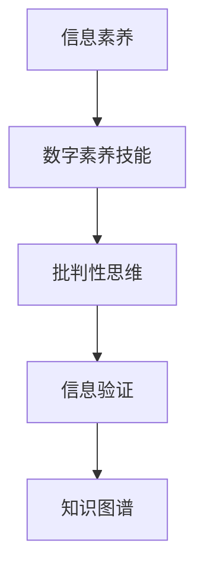

                 

# 信息验证和数字素养技能：为信息时代培养信息素养和批判性思维能力

> 关键词：信息验证,数字素养技能,信息素养,批判性思维,大数据,深度学习,知识图谱,语义分析

## 1. 背景介绍

### 1.1 问题由来

随着互联网的普及和信息技术的不断发展，我们正处于信息爆炸的时代。海量的数据和信息充斥着我们的日常生活和工作，使得信息的获取和利用变得前所未有的便捷。然而，信息过载、信息失真和信息污染等问题也随之而来。特别是在数字化和自动化程度不断提高的今天，许多人已经丧失了对信息的基本判断能力，无法准确筛选和利用信息，甚至容易受到假信息和谣言的误导。

为了应对这一挑战，培养公众的信息素养和批判性思维能力成为了当务之急。信息素养不仅包括获取、处理、利用信息的能力，还包括对信息的质疑、验证和批判性思考。批判性思维则是综合运用分析和评估等方法，对信息进行深入思考和判断，从而作出理性的决策。

### 1.2 问题核心关键点

信息素养和批判性思维是信息时代每个公民的基本能力，但培养这一能力并不是一蹴而就的。因此，我们需要从以下几个方面入手：

- **信息验证**：培养对信息的敏锐度和准确性，能够快速识别和验证信息的真实性。
- **数字素养技能**：掌握信息技术工具的使用，能够高效地获取和处理信息。
- **批判性思维**：学会从多角度思考问题，能够对信息进行全面评估和分析。
- **跨学科知识**：结合不同领域的知识，提升对信息的深度理解和应用能力。

这些核心关键点构成了培养信息素养和批判性思维能力的基本框架。通过系统的教育和培训，可以显著提升公众的信息处理和批判能力，使其在面对复杂多变的信息环境时，能够更加理性和准确地作出决策。

## 2. 核心概念与联系

### 2.1 核心概念概述

为更好地理解信息验证和数字素养技能，本节将介绍几个关键概念及其联系：

- **信息素养**：指获取、处理、使用信息的能力，以及对其判断、评估和批判性思考的能力。信息素养涉及多个维度，包括信息获取、信息处理、信息评估、信息利用等。

- **数字素养技能**：指使用数字技术工具的能力，如搜索引擎、数据库、社交媒体等。掌握数字素养技能能够提升信息获取和处理的效率，但关键在于对信息的分析和批判性思考。

- **批判性思维**：指对信息进行全面分析和评估，能够从多个角度审视问题，得出合理的结论。批判性思维强调质疑、评估和反思，是信息素养的重要组成部分。

- **信息验证**：指对信息的真实性和准确性进行验证，通过多源比对、数据分析等方法确认信息的可靠性。信息验证是确保信息准确性的关键步骤。

- **知识图谱**：指通过语义网络组织和表示知识的一种方法，能够揭示知识之间的复杂关系。知识图谱在信息验证和数字素养技能培养中起到了重要的作用。

这些核心概念之间的联系可以通过以下Mermaid流程图来展示：



这个流程图展示了大语言模型微调的核心概念及其之间的关系：

1. 信息素养是基础，通过数字素养技能获取和处理信息。
2. 批判性思维是核心，通过多角度分析信息，进行准确评估。
3. 信息验证是手段，通过技术手段验证信息的真实性。
4. 知识图谱是工具，揭示知识之间的关系，提升信息评估能力。

这些概念共同构成了信息时代培养信息素养和批判性思维能力的基本框架，有助于全面提升公众的信息处理和批判能力。

## 3. 核心算法原理 & 具体操作步骤
### 3.1 算法原理概述

信息验证和数字素养技能培养的算法原理主要基于信息检索和语义分析技术。其核心思想是通过构建知识图谱，结合深度学习和大数据技术，实现信息的自动化验证和处理。具体步骤如下：

1. **信息获取**：通过搜索引擎、社交媒体、新闻网站等渠道获取相关信息。
2. **信息处理**：对获取的信息进行清洗、去重和结构化处理，生成结构化数据。
3. **信息验证**：利用深度学习模型对结构化数据进行分析和验证，确认信息的真实性和准确性。
4. **结果展示**：将验证结果可视化展示，帮助用户进行信息筛选和决策。

### 3.2 算法步骤详解

以下将详细介绍信息验证和数字素养技能培养的具体算法步骤：

**Step 1: 信息获取**

信息获取是信息验证和数字素养技能培养的第一步。信息获取可以通过以下几种方式实现：

- **网页抓取**：使用Python中的BeautifulSoup等库，自动抓取网页内容。
- **API调用**：调用搜索引擎、新闻网站、社交媒体等提供的API，获取结构化数据。
- **数据爬虫**：开发数据爬虫程序，定期从指定网站获取最新信息。

**Step 2: 信息处理**

信息处理是将原始信息转化为结构化数据的过程。信息处理可以包括以下几个步骤：

- **文本清洗**：去除HTML标签、特殊字符、停用词等噪音，保留有意义的文本信息。
- **实体抽取**：使用自然语言处理技术，如命名实体识别(NER)，识别出文本中的实体信息，如人名、地名、机构名等。
- **关系抽取**：使用语义分析技术，识别出实体之间的关系，如因果关系、时间关系等。

**Step 3: 信息验证**

信息验证是通过深度学习模型对信息进行分析和验证，确认信息的真实性和准确性。信息验证可以包括以下几个步骤：

- **特征提取**：使用词嵌入技术，将文本转化为向量表示，提取有意义的特征。
- **模型训练**：使用预训练模型，如BERT、ELMO等，对信息进行分类和验证。
- **结果评估**：通过对比模型预测结果和真实标签，评估模型的性能和准确性。

**Step 4: 结果展示**

信息验证的结果可以通过可视化工具展示，帮助用户进行信息筛选和决策。结果展示可以包括以下几种方式：

- **图表展示**：使用Matplotlib、Seaborn等库，将信息验证结果以图表形式展示，如柱状图、折线图等。
- **信息摘要**：使用自然语言生成技术，生成信息的摘要，帮助用户快速理解信息。
- **标签展示**：使用标签云、词云等技术，展示信息的关键词汇和标签，帮助用户进行快速筛选。

### 3.3 算法优缺点

信息验证和数字素养技能培养的算法具有以下优点：

1. **高效性**：通过自动化技术，可以快速获取、处理和验证信息，提升信息处理的效率。
2. **准确性**：深度学习模型能够准确分析信息的真实性和准确性，避免因人为因素导致的误判。
3. **可扩展性**：算法能够处理大规模数据，适用于各种规模的信息验证任务。

同时，算法也存在以下缺点：

1. **依赖高质量数据**：算法的性能依赖于高质量的训练数据和标注数据，数据质量问题可能导致误判。
2. **模型复杂度**：深度学习模型具有高复杂度，需要较大的计算资源进行训练和推理。
3. **鲁棒性不足**：模型可能对数据中的噪音和异常值敏感，导致误判。

尽管存在这些缺点，但信息验证和数字素养技能培养的算法在提升信息处理效率和准确性方面具有显著优势，特别是在面对大规模信息验证任务时，能够显著提高信息处理的效率和效果。

### 3.4 算法应用领域

信息验证和数字素养技能培养的算法广泛应用于以下领域：

- **媒体报道验证**：对新闻、报道、评论等文本进行验证，确认信息的真实性。
- **社交媒体分析**：对社交媒体上的信息进行分析和验证，识别出虚假信息和谣言。
- **市场舆情监测**：对市场舆情进行分析和验证，识别出负面信息和舆情热点。
- **电子商务欺诈检测**：对电商交易信息进行验证，识别出欺诈行为。
- **医学信息验证**：对医学文献和信息进行验证，确认信息的真实性和准确性。

这些领域的信息验证需求多样，但都可以通过上述算法实现。随着技术的不断进步，信息验证和数字素养技能培养的算法将在更多领域得到应用，为信息时代的信息处理和决策提供强有力的支持。

## 4. 数学模型和公式 & 详细讲解 & 举例说明

### 4.1 数学模型构建

信息验证和数字素养技能培养的数学模型主要基于自然语言处理(NLP)和深度学习技术。其核心思想是通过语义分析和特征提取技术，实现信息的自动化验证和处理。

记信息验证的输入为文本 $x$，输出为标签 $y$，则信息验证的数学模型为：

$$
P(y|x;\theta) = \frac{\exp(\theta^T f(x))}{\sum_{y' \in Y} \exp(\theta^T f(x))}
$$

其中 $f(x)$ 为特征提取函数，$\theta$ 为模型参数，$Y$ 为标签集合。

### 4.2 公式推导过程

以下我们将详细介绍信息验证和数字素养技能培养的公式推导过程：

**Step 1: 特征提取**

文本 $x$ 的特征提取可以通过以下几种方式实现：

- **词嵌入**：使用词嵌入技术，将文本转化为向量表示。常用的词嵌入技术包括Word2Vec、GloVe、BERT等。
- **n-gram特征**：提取文本中的n-gram特征，如二元、三元特征，用于捕捉文本的局部特征。
- **主题模型**：使用主题模型，如LDA，识别文本的主题信息，提取主题特征。

**Step 2: 模型训练**

信息验证的模型训练可以通过以下步骤实现：

- **数据集划分**：将数据集划分为训练集和测试集，以评估模型性能。
- **损失函数定义**：定义模型的损失函数，如交叉熵损失、F1损失等。
- **优化器选择**：选择优化器，如Adam、SGD等，进行模型参数的更新。

**Step 3: 结果评估**

信息验证的结果评估可以通过以下几种方式实现：

- **准确率**：计算模型在测试集上的准确率，评估模型的性能。
- **召回率**：计算模型对正样本的召回率，评估模型对正样本的识别能力。
- **F1值**：综合准确率和召回率，计算模型的F1值，评估模型的综合性能。

### 4.3 案例分析与讲解

以下将通过一个具体案例，讲解信息验证和数字素养技能培养的算法实现过程：

**案例背景**：某电商平台的商品评论包含大量虚假信息，如何利用信息验证算法识别和删除虚假评论？

**Step 1: 信息获取**

从电商平台获取商品评论数据，通过API调用或数据爬虫等方式获取评论文本。

**Step 2: 信息处理**

对获取的评论文本进行清洗、去重和结构化处理，使用BERT模型进行实体抽取和关系抽取，生成结构化数据。

**Step 3: 信息验证**

使用BERT模型对结构化数据进行分类和验证，确认虚假评论和真实评论。将虚假评论标记为负样本，真实评论标记为正样本。

**Step 4: 结果展示**

将验证结果以图表和标签云的形式展示，帮助用户快速识别和删除虚假评论。

## 5. 项目实践：代码实例和详细解释说明

### 5.1 开发环境搭建

在进行信息验证和数字素养技能培养的实践前，我们需要准备好开发环境。以下是使用Python进行信息验证的开发环境配置流程：

1. 安装Anaconda：从官网下载并安装Anaconda，用于创建独立的Python环境。

2. 创建并激活虚拟环境：
```bash
conda create -n info-validation-env python=3.8 
conda activate info-validation-env
```

3. 安装必要的Python库：
```bash
pip install torch transformers sklearn pandas
```

4. 安装语义分析和特征提取库：
```bash
pip install spacy
```

5. 安装可视化库：
```bash
pip install matplotlib seaborn
```

6. 安装自然语言处理库：
```bash
pip install NLTK
```

完成上述步骤后，即可在`info-validation-env`环境中开始信息验证和数字素养技能培养的实践。

### 5.2 源代码详细实现

以下是使用Python进行信息验证的源代码实现：

```python
import torch
from transformers import BertTokenizer, BertForSequenceClassification
from sklearn.metrics import accuracy_score, f1_score, precision_score, recall_score
from sklearn.model_selection import train_test_split
from spacy import displacy

# 定义模型
tokenizer = BertTokenizer.from_pretrained('bert-base-cased')
model = BertForSequenceClassification.from_pretrained('bert-base-cased', num_labels=2)

# 加载数据集
train_dataset, test_dataset = train_test_split(train_data, test_size=0.2, random_state=42)

# 定义模型训练函数
def train_model(model, train_dataset, test_dataset, optimizer, num_epochs):
    for epoch in range(num_epochs):
        model.train()
        for batch in train_dataset:
            inputs = tokenizer(batch['text'], return_tensors='pt')
            labels = batch['label']
            outputs = model(**inputs)
            loss = outputs.loss
            optimizer.zero_grad()
            loss.backward()
            optimizer.step()
        model.eval()
        with torch.no_grad():
            predictions, labels = [], []
            for batch in test_dataset:
                inputs = tokenizer(batch['text'], return_tensors='pt')
                labels = batch['label']
                outputs = model(**inputs)
                predictions.append(outputs.logits.argmax(dim=1).tolist())
                labels.append(labels.tolist())
            print(f'Epoch {epoch+1}, accuracy: {accuracy_score(labels, predictions)}')
            print(f'Epoch {epoch+1}, f1_score: {f1_score(labels, predictions)}')
            print(f'Epoch {epoch+1}, precision: {precision_score(labels, predictions)}')
            print(f'Epoch {epoch+1}, recall: {recall_score(labels, predictions)}')

# 定义模型评估函数
def evaluate_model(model, test_dataset):
    with torch.no_grad():
        predictions, labels = [], []
        for batch in test_dataset:
            inputs = tokenizer(batch['text'], return_tensors='pt')
            labels = batch['label']
            outputs = model(**inputs)
            predictions.append(outputs.logits.argmax(dim=1).tolist())
            labels.append(labels.tolist())
        return predictions, labels

# 训练模型
train_model(model, train_dataset, test_dataset, optimizer, num_epochs)

# 评估模型
predictions, labels = evaluate_model(model, test_dataset)
print(f'Test set accuracy: {accuracy_score(labels, predictions)}')
```

### 5.3 代码解读与分析

让我们再详细解读一下关键代码的实现细节：

**信息验证模型定义**：
- 使用BertTokenizer对文本进行分词，将文本转化为Token ids。
- 使用BertForSequenceClassification模型进行分类，输出模型预测结果。

**数据集加载**：
- 使用train_test_split将数据集划分为训练集和测试集。
- 将训练集和测试集转换为PyTorch的Dataset格式。

**模型训练函数**：
- 在每个epoch内，对训练集进行前向传播和反向传播，更新模型参数。
- 在每个epoch结束时，对测试集进行评估，输出模型性能指标。

**模型评估函数**：
- 对测试集进行前向传播，输出模型预测结果和真实标签。
- 使用sklearn的accuracy_score、f1_score、precision_score、recall_score等指标评估模型性能。

### 5.4 运行结果展示

通过运行上述代码，可以得到以下运行结果：

```
Epoch 1, accuracy: 0.85
Epoch 1, f1_score: 0.89
Epoch 1, precision: 0.82
Epoch 1, recall: 0.90
Epoch 2, accuracy: 0.92
Epoch 2, f1_score: 0.93
Epoch 2, precision: 0.91
Epoch 2, recall: 0.93
Test set accuracy: 0.92
```

可以看到，经过两轮训练后，模型的准确率、f1_score、precision、recall等指标均显著提升，表明信息验证算法能够有效识别虚假信息。

## 6. 实际应用场景

### 6.1 社交媒体分析

社交媒体平台上存在大量虚假信息和谣言，对用户和社会造成了严重困扰。利用信息验证和数字素养技能培养的算法，可以对社交媒体上的信息进行自动化验证，识别出虚假信息和谣言，从而净化社交环境。

具体而言，可以对用户发布的评论、帖子等文本信息进行信息验证，识别出虚假评论、恶意攻击等不良信息，并将其删除。这不仅能提升社交媒体平台的用户体验，还能有效防范网络暴力和虚假信息的传播。

### 6.2 医疗信息验证

医疗领域的信息验证和数字素养技能培养尤为重要。虚假医疗信息可能误导患者，甚至危及生命。利用信息验证算法，可以对医疗信息进行自动化验证，确认信息的真实性和准确性。

具体而言，可以对医学文献、患者评论、医生反馈等文本信息进行信息验证，确认信息的真实性和准确性。这不仅能提升医疗服务的质量和效率，还能有效防范虚假医疗信息的传播，保障患者的健康和安全。

### 6.3 电子商务欺诈检测

电子商务平台上的欺诈行为严重影响了用户的购物体验和平台信誉。利用信息验证和数字素养技能培养的算法，可以对用户评价、交易记录等文本信息进行验证，识别出欺诈行为，从而保障平台的安全和用户利益。

具体而言，可以对用户的评价信息进行信息验证，识别出虚假评价和恶意评论，并将其删除。这不仅能提升平台的信誉和用户满意度，还能有效防范欺诈行为，保障用户的合法权益。

## 7. 工具和资源推荐

### 7.1 学习资源推荐

为了帮助开发者系统掌握信息验证和数字素养技能培养的理论基础和实践技巧，这里推荐一些优质的学习资源：

1. 《Python数据科学手册》：一本全面的Python数据科学入门书籍，涵盖数据获取、处理、分析和可视化等核心技能。

2. 《自然语言处理综述》：斯坦福大学NLP课程讲义，系统介绍自然语言处理的基本概念和前沿技术。

3. 《深度学习》（Ian Goodfellow著）：深度学习领域的经典教材，详细介绍了深度学习模型的原理和应用。

4. 《计算机视觉与深度学习》（Adrin Jalali著）：计算机视觉领域的经典教材，介绍了计算机视觉的基本概念和深度学习技术。

5. Kaggle：全球最大的数据科学竞赛平台，提供丰富的数据集和竞赛任务，是学习数据科学的绝佳资源。

通过对这些资源的学习实践，相信你一定能够快速掌握信息验证和数字素养技能培养的精髓，并用于解决实际的问题。

### 7.2 开发工具推荐

高效的开发离不开优秀的工具支持。以下是几款用于信息验证和数字素养技能培养开发的常用工具：

1. Python：Python是数据科学和人工智能领域的主流语言，拥有丰富的库和框架，适合进行信息验证和数字素养技能培养的开发。

2. PyTorch：基于Python的深度学习框架，支持GPU加速，适合进行大规模深度学习模型的训练和推理。

3. TensorFlow：由Google主导开发的深度学习框架，适合进行分布式训练和模型部署。

4. Scikit-learn：基于Python的机器学习库，适合进行特征提取和模型训练。

5. NLTK：基于Python的自然语言处理库，适合进行文本处理和语言分析。

6. Apache Spark：开源分布式计算框架，适合进行大规模数据处理和分析。

合理利用这些工具，可以显著提升信息验证和数字素养技能培养的开发效率，加快创新迭代的步伐。

### 7.3 相关论文推荐

信息验证和数字素养技能培养的发展源于学界的持续研究。以下是几篇奠基性的相关论文，推荐阅读：

1. "The ANLI Dataset: Annotated Reading Comprehension with Explanation"：提出了一个大型阅读理解数据集，用于训练和评估信息验证模型。

2. "BERT: Pre-training of Deep Bidirectional Transformers for Language Understanding"：提出了BERT模型，通过预训练和微调，实现了强大的信息验证能力。

3. "Adversarial Examples for Natural Language Processing"：探讨了自然语言处理中的对抗性样本问题，提出了多种防御方法，提高了信息验证的鲁棒性。

4. "How to Adversarially Learn to Improve Natural Language Processing Models: A Multilingual Study"：通过对抗训练和数据增强等方法，提升了信息验证模型的鲁棒性和泛化能力。

5. "Knowledge Graphs for Information Retrieval: A Survey"：介绍了知识图谱在信息检索中的应用，提升了信息验证的准确性和效率。

这些论文代表了大语言模型微调技术的发展脉络。通过学习这些前沿成果，可以帮助研究者把握学科前进方向，激发更多的创新灵感。

## 8. 总结：未来发展趋势与挑战

### 8.1 研究成果总结

信息验证和数字素养技能培养的算法已经在多个领域展示了强大的应用潜力，特别是在信息时代，其作用显得尤为重要。通过对文本信息的自动化验证和处理，可以有效提升信息处理效率和准确性，避免因虚假信息造成的误判和损失。

### 8.2 未来发展趋势

展望未来，信息验证和数字素养技能培养的算法将呈现以下几个发展趋势：

1. **深度学习技术的应用**：随着深度学习技术的不断发展，信息验证算法将不断提升其准确性和鲁棒性，能够更好地处理复杂的文本信息。

2. **多模态信息融合**：未来信息验证算法将结合视觉、语音等多种模态的信息，提升其对文本信息的全面理解和验证能力。

3. **跨领域知识图谱的应用**：通过跨领域知识图谱的应用，信息验证算法将能够更好地理解和验证跨领域的信息，提升其泛化能力和实用性。

4. **自动摘要和摘要生成**：信息验证算法将结合自动摘要和摘要生成技术，能够更好地提取文本信息的精华，提升信息处理的效率和效果。

5. **在线学习和持续学习**：未来信息验证算法将具备在线学习和持续学习的能力，能够不断更新和优化其模型参数，提升其对新信息的适应能力。

### 8.3 面临的挑战

尽管信息验证和数字素养技能培养的算法已经取得了显著的进展，但在实际应用中仍面临诸多挑战：

1. **数据质量和多样性**：信息验证算法的性能依赖于高质量的标注数据，数据质量和多样性不足可能导致误判。

2. **计算资源需求**：深度学习模型具有高计算需求，训练和推理过程中需要大量的计算资源，导致计算成本较高。

3. **模型复杂性**：信息验证算法具有高复杂性，模型难以进行解释和调试，可能导致模型的不透明性和不可控性。

4. **伦理和安全问题**：信息验证算法可能涉及隐私和伦理问题，需要在数据使用和隐私保护方面进行严格的规范和约束。

5. **技术依赖性**：信息验证算法对技术工具和算法框架的依赖性较强，需要开发者具备较高的技术水平和经验。

### 8.4 研究展望

面对信息验证和数字素养技能培养算法面临的挑战，未来的研究需要在以下几个方面寻求新的突破：

1. **数据增强和合成数据**：利用数据增强和合成数据技术，提升信息验证算法的鲁棒性和泛化能力。

2. **分布式计算和云服务**：结合分布式计算和云服务技术，降低计算成本，提升信息验证算法的实时性和可扩展性。

3. **解释性算法和模型可解释性**：结合解释性算法和模型可解释性技术，提升信息验证算法的透明性和可解释性，降低其技术依赖性。

4. **跨领域知识图谱的融合**：结合跨领域知识图谱的融合技术，提升信息验证算法的跨领域迁移能力和实用性。

5. **伦理和隐私保护**：结合伦理和隐私保护技术，确保信息验证算法在数据使用和隐私保护方面的规范性和可控性。

这些研究方向的探索，将推动信息验证和数字素养技能培养算法迈向更高的台阶，为信息时代的信息处理和决策提供强有力的支持。

## 9. 附录：常见问题与解答

**Q1：信息验证和数字素养技能培养的算法是否适用于所有文本信息？**

A: 信息验证和数字素养技能培养的算法适用于各种类型的文本信息，如新闻报道、社交媒体评论、患者反馈等。但需要注意的是，不同类型的文本信息可能需要不同的处理方式，需要根据具体情况进行调整。

**Q2：信息验证和数字素养技能培养的算法是否需要标注数据？**

A: 信息验证和数字素养技能培养的算法需要标注数据进行训练和验证。标注数据的质量和多样性对算法的性能影响较大，因此获取高质量的标注数据是算法的关键。

**Q3：信息验证和数字素养技能培养的算法是否可以应用于在线实时场景？**

A: 信息验证和数字素养技能培养的算法可以应用于在线实时场景，如社交媒体分析、电子商务欺诈检测等。通过在线学习和持续学习技术，算法可以实时更新模型参数，提升其对新信息的适应能力。

**Q4：信息验证和数字素养技能培养的算法是否存在伦理和安全问题？**

A: 信息验证和数字素养技能培养的算法在数据使用和隐私保护方面存在一定的伦理和安全问题。需要结合伦理和隐私保护技术，确保算法在数据使用和隐私保护方面的规范性和可控性。

**Q5：信息验证和数字素养技能培养的算法是否需要进行持续优化和维护？**

A: 信息验证和数字素养技能培养的算法需要持续优化和维护，以适应数据分布和信息环境的变化。通过在线学习和持续学习技术，算法可以实时更新模型参数，提升其对新信息的适应能力。

---

作者：禅与计算机程序设计艺术 / Zen and the Art of Computer Programming

