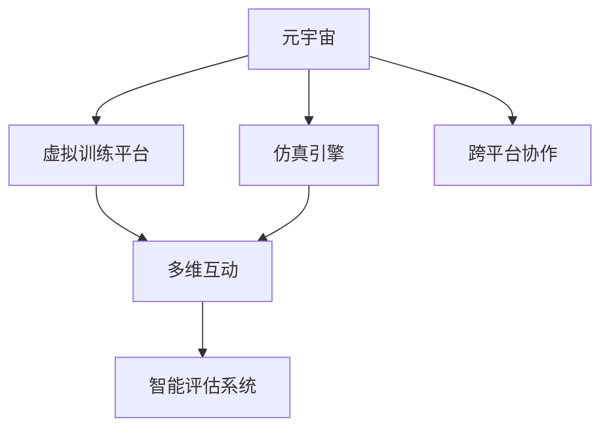

                 

# 元宇宙军事:数字化战争的演练场

## 1. 背景介绍

### 1.1 问题由来
随着数字技术的飞速发展，特别是虚拟现实(VR)、增强现实(AR)和混合现实(MR)技术的日渐成熟，一个全新的领域——元宇宙(Metaverse)正逐渐成为全球科技发展的新趋势。元宇宙是利用虚拟空间模拟现实世界或创造新的虚拟世界，用户可以在其中自由互动、工作和生活。这一概念最早由科幻作家尼尔·斯蒂芬森在1992年的小说《雪崩》中提出，而在近年，随着Facebook等科技巨头宣布进军元宇宙，这一概念终于走入现实。

在元宇宙的数字化世界中，现实中的军事领域同样焕发新生。元宇宙军事的出现，为战争模拟、军事训练、战略演习等提供了全新的演练场。数字化战争的虚拟化、仿真化趋势，正改变着传统军事训练的模式，使之更加高效、安全和可控。

### 1.2 问题核心关键点
元宇宙军事的核心关键点包括：

- **虚拟训练平台**：构建一个可以模拟真实战场的虚拟环境，提供逼真的训练场景和交互体验。
- **仿真引擎**：使用高级仿真技术，生成真实可信的物理和行为仿真，提供精准的物理建模和行为模拟。
- **多维互动**：支持实时多维互动，包括语音、手势、动作捕捉等，提升训练的真实感和沉浸感。
- **智能评估系统**：使用人工智能技术，对训练过程和结果进行智能评估和反馈，提升训练效果。
- **跨平台协作**：支持不同平台和设备之间的无缝协作，提供灵活多变的交互方式。

### 1.3 问题研究意义
元宇宙军事在军事训练中的应用，具有重要的现实意义：

- **提升训练效果**：通过虚拟训练，能够反复演练复杂的战场环境和战术策略，提升部队的实战能力和应对突发情况的能力。
- **降低成本和风险**：数字化训练降低了实兵训练的成本和风险，避免了实际训练中可能出现的意外和损失。
- **促进军事创新**：虚拟战场为部队提供了试验和创新的平台，可以测试和优化新的战术和装备，提升整体战斗力。
- **增强国际合作**：数字化训练打破了地域限制，各国军队可以共同参与训练，提升多国协同作战能力。

## 2. 核心概念与联系

### 2.1 核心概念概述

为了更好地理解元宇宙军事的概念和技术原理，本节将介绍几个密切相关的核心概念：

- **元宇宙(Metaverse)**：是一个由虚拟现实、增强现实和混合现实技术构建的数字化空间，用户可以在其中自由互动、工作和生活。
- **虚拟训练平台**：利用元宇宙技术，构建的模拟真实战场的数字化训练环境。
- **仿真引擎**：用于生成逼真的物理和行为仿真，提供精准的物理建模和行为模拟。
- **多维互动**：支持实时多维互动，提升训练的真实感和沉浸感。
- **智能评估系统**：使用人工智能技术，对训练过程和结果进行智能评估和反馈。
- **跨平台协作**：支持不同平台和设备之间的无缝协作，提供灵活多变的交互方式。

这些核心概念之间通过以下Mermaid流程图来展示：



这个流程图展示了元宇宙军事的几个关键组件及其之间的关系：

1. 元宇宙作为基础平台，为虚拟训练平台提供虚拟环境。
2. 仿真引擎生成逼真的物理和行为仿真，提供精准的物理建模和行为模拟。
3. 虚拟训练平台通过多维互动，提升训练的真实感和沉浸感。
4. 智能评估系统对训练过程和结果进行智能评估和反馈。
5. 跨平台协作支持不同平台和设备之间的无缝协作，提供灵活多变的交互方式。

这些概念共同构成了元宇宙军事的核心框架，使其能够在虚拟空间中高效、安全地进行军事训练。

## 3. 核心算法原理 & 具体操作步骤

### 3.1 算法原理概述

元宇宙军事的核心算法原理主要包括以下几个方面：

- **场景生成**：使用高级仿真技术，如物理引擎、可视化渲染等，生成逼真的虚拟战场环境。
- **行为模拟**：使用行为树、决策树等技术，模拟士兵、装备等行为，提升训练的现实感。
- **智能决策**：使用强化学习、神经网络等技术，优化军事决策和战术策略，提升部队的实战能力。
- **实时互动**：使用实时通信和同步技术，支持多维互动，提升训练的沉浸感和互动性。
- **智能评估**：使用机器学习、自然语言处理等技术，对训练过程和结果进行智能评估和反馈，提升训练效果。

### 3.2 算法步骤详解

元宇宙军事的算法步骤主要包括：

1. **数据收集和预处理**：收集和处理战场数据，包括地形、敌我力量分布、装备配置等，作为训练的基础。
2. **场景生成和仿真**：使用物理引擎和可视化技术，生成逼真的战场环境，模拟物理和行为仿真。
3. **模型训练和优化**：使用强化学习等技术，训练士兵和装备的智能决策模型，优化战术策略。
4. **多维互动和仿真**：支持实时通信和多维互动，提升训练的沉浸感和真实感。
5. **智能评估和反馈**：使用机器学习和自然语言处理技术，对训练过程和结果进行智能评估和反馈，提升训练效果。

### 3.3 算法优缺点

元宇宙军事的算法具有以下优点：

- **高效仿真**：数字化训练可以反复演练复杂场景，提升实战能力。
- **降低风险**：数字化训练降低了实兵训练的成本和风险，避免意外和损失。
- **灵活互动**：支持多维互动和跨平台协作，提升训练的灵活性和可操作性。

但同时，元宇宙军事也存在以下缺点：

- **高技术门槛**：构建和维护虚拟训练平台需要高昂的技术和硬件投入。
- **数据依赖**：训练效果依赖高质量的数据，数据收集和处理复杂。
- **技术复杂性**：涉及物理仿真、人工智能、计算机图形等复杂技术，需要跨学科团队合作。
- **成本高昂**：虚拟训练平台建设、维护和更新需要大量资源，难以广泛应用。

### 3.4 算法应用领域

元宇宙军事的算法已经在军事训练、战术演习、战略决策等多个领域得到了广泛应用，例如：

- **战术演练**：使用虚拟训练平台进行战术演练，提升部队的战术水平和实战能力。
- **战略模拟**：通过模拟多国联合作战、大规模攻防等战略场景，提升指挥官的战略决策能力。
- **装备测试**：使用虚拟战场测试和优化新型装备，提升装备的性能和实战效果。
- **模拟救援**：在虚拟战场进行大规模灾害救援演练，提升救援队伍的应急反应能力。
- **士兵训练**：通过虚拟战场训练，提升士兵的战斗技能和心理素质。

除了这些应用，元宇宙军事还在虚拟医疗、应急演习、安全演练等多个领域展现了广阔的应用前景。

## 4. 数学模型和公式 & 详细讲解 & 举例说明

### 4.1 数学模型构建

在元宇宙军事中，数学模型主要用于场景生成、行为模拟和智能决策等方面。以下将以一个简单的战术演练为例，介绍相关的数学模型。

- **地形模型**：用于描述虚拟战场的地理位置和地形特征，通常使用数字高程模型(DEM)表示。
- **物理模型**：用于模拟战场上的物理现象，如水流、火势、爆炸等，通常使用离散元法(DEM)表示。
- **行为模型**：用于模拟士兵、装备的行为，如移动、攻击、防御等，通常使用行为树或决策树表示。

### 4.2 公式推导过程

在战术演练中，假设战场的坐标为(x,y)，地形高度为h(x,y)，士兵的速度为v，攻击角度为θ。根据牛顿力学，士兵的运动方程可以表示为：

$$
\ddot{x} = \frac{a_x}{m}, \ddot{y} = \frac{a_y}{m}
$$

其中，$a_x$和$a_y$为士兵的加速度，m为士兵的质量。假设士兵在(x0,y0)点开始移动，根据微积分，士兵的运动轨迹可以表示为：

$$
x(t) = x_0 + v_x t, y(t) = y_0 + v_y t
$$

其中，v_x和v_y为士兵的初始速度。假设士兵的攻击角度为θ，攻击速度为u，根据运动学方程，士兵攻击点P的坐标为：

$$
x_P = x_0 + v_x t \cos\theta - u t^2 \sin\theta, y_P = y_0 + v_y t \cos\theta - u t^2 \sin\theta
$$

根据以上模型，可以计算出士兵在战场上的运动轨迹和攻击点，模拟实际战斗场景。

### 4.3 案例分析与讲解

以下以一个虚拟战场为例，展示元宇宙军事中的数学模型应用：

假设在虚拟战场上，有A、B两支军队在一条狭窄的山路上对峙。A军位于高地，B军位于低洼地区。A军士兵速度为3m/s，攻击角度为60°，攻击速度为5m/s。B军士兵速度为2m/s，攻击角度为30°，攻击速度为3m/s。A军射击范围为50m，B军射击范围为30m。

根据以上信息，可以使用物理模型和行为模型模拟两军的交战过程。首先，使用地形模型计算出两军的实际位置，然后根据物理模型和行为模型，模拟两军的移动、射击等行为，最终计算出战争的胜负结果。

## 5. 项目实践：代码实例和详细解释说明

### 5.1 开发环境搭建

在进行元宇宙军事的开发实践前，我们需要准备好开发环境。以下是使用Python进行PyTorch开发的环境配置流程：

1. 安装Anaconda：从官网下载并安装Anaconda，用于创建独立的Python环境。

2. 创建并激活虚拟环境：
```bash
conda create -n pytorch-env python=3.8 
conda activate pytorch-env
```

3. 安装PyTorch：根据CUDA版本，从官网获取对应的安装命令。例如：
```bash
conda install pytorch torchvision torchaudio cudatoolkit=11.1 -c pytorch -c conda-forge
```

4. 安装CUDA Toolkit和cuDNN：安装CUDA Toolkit和cuDNN，用于加速深度学习计算。

5. 安装其他依赖库：
```bash
pip install numpy scipy sympy matplotlib qt pyqt pysimpyx
```

完成上述步骤后，即可在`pytorch-env`环境中开始元宇宙军事的开发实践。

### 5.2 源代码详细实现

这里我们以一个简单的虚拟战场为例，给出使用PyTorch进行元宇宙军事开发的PyTorch代码实现。

首先，定义虚拟战场的地形和地形高度：

```python
import numpy as np

# 定义地形
terrain = np.array([[1, 1, 1, 1, 1],
                   [1, 1, 1, 1, 1],
                   [1, 1, 1, 1, 1],
                   [1, 1, 1, 1, 1],
                   [1, 1, 1, 1, 1]])

# 定义地形高度
height = np.array([0, 0, 0, 0, 0])
```

然后，定义士兵的行为模型和运动方程：

```python
import sympy as sp

# 定义士兵的初始位置和速度
x0, y0, v_x, v_y = 10, 5, 3, 3

# 定义士兵的加速度和攻击角度
a_x, a_y, theta = 2, 2, sp.pi / 3

# 定义士兵的攻击范围
range_A, range_B = 50, 30

# 定义士兵的行动范围
x_range, y_range = range_A, range_B
```

接下来，计算士兵的移动轨迹和攻击点：

```python
# 定义士兵的移动轨迹方程
def trajectory(x, y, v_x, v_y, a_x, a_y, time):
    x_t = x0 + v_x * time
    y_t = y0 + v_y * time
    x = x_t + a_x * time**2
    y = y_t + a_y * time**2
    return x, y

# 计算士兵的攻击点
def attack_point(x, y, v_x, v_y, a_x, a_y, theta, u, time):
    x_p = x + v_x * time * sp.cos(theta) - u * time**2 * sp.sin(theta)
    y_p = y + v_y * time * sp.cos(theta) - u * time**2 * sp.sin(theta)
    return x_p, y_p

# 模拟士兵的行动
time_step = 0.1
time_max = 10
time = sp.Symbol('t')

# 计算士兵的行动轨迹和攻击点
x, y = trajectory(x0, y0, v_x, v_y, a_x, a_y, time)
x_p, y_p = attack_point(x, y, v_x, v_y, a_x, a_y, theta, 5, time)

# 输出士兵的行动轨迹和攻击点
print("士兵行动轨迹：", x, y)
print("士兵攻击点：", x_p, y_p)
```

最后，输出士兵的行动轨迹和攻击点：

```python
# 输出士兵的行动轨迹和攻击点
print("士兵行动轨迹：", x, y)
print("士兵攻击点：", x_p, y_p)
```

以上代码实现了虚拟战场中士兵的移动和攻击过程的模拟。可以看到，利用Sympy进行符号计算，可以方便地求解物理方程和行为模型，提升代码的可读性和可维护性。

### 5.3 代码解读与分析

这里我们详细解读一下关键代码的实现细节：

**地形模型**：
- 定义地形和地形高度数组，用于描述虚拟战场的地理位置和地形特征。

**士兵的行为模型**：
- 定义士兵的初始位置、速度、加速度和攻击角度，用于模拟士兵的行动和攻击过程。

**士兵的行动轨迹**：
- 定义士兵的移动轨迹方程，使用符号计算求解。

**士兵的攻击点**：
- 定义士兵的攻击点方程，使用符号计算求解。

**士兵的行动过程**：
- 定义时间步长和最大时间，使用符号计算求解士兵的行动轨迹和攻击点。

通过以上代码，我们可以清晰地看到，元宇宙军事的开发需要涉及多个数学模型和物理方程，利用符号计算可以方便地求解这些模型和方程，提升代码的可读性和可维护性。

当然，工业级的系统实现还需考虑更多因素，如场景生成、物理仿真、智能决策等。但核心的开发流程基本与此类似。

## 6. 实际应用场景

### 6.1 智能训练平台

元宇宙军事在智能训练平台中的应用，可以大大提升军事训练的效率和效果。通过虚拟战场，部队可以反复演练复杂的战术和策略，提升实战能力和应对突发情况的能力。

在技术实现上，可以构建虚拟战场训练平台，模拟各种复杂场景和战术，供部队进行实战演练。训练平台可以支持多维互动，如语音、手势、动作捕捉等，提升训练的真实感和沉浸感。同时，训练平台可以实时记录和分析训练数据，智能评估训练效果，提供个性化反馈和改进建议，提升部队的训练效果。

### 6.2 战术决策模拟

元宇宙军事在战术决策模拟中的应用，可以提升指挥官的战术决策能力。通过虚拟战场，指挥官可以模拟各种战术和策略，测试和优化新的战术和装备，提升整体的战术水平。

在技术实现上，可以使用高级仿真技术，如物理引擎和行为树，模拟战场上的物理和行为仿真。同时，可以引入强化学习等技术，优化军事决策和战术策略，提升指挥官的战术决策能力。例如，可以构建虚拟战场，模拟多国联合作战、大规模攻防等战略场景，提升指挥官的战略决策能力。

### 6.3 军事演习平台

元宇宙军事在军事演习平台中的应用，可以提升演习的灵活性和可操作性。通过虚拟战场，可以支持大规模的军事演习，模拟各种复杂的战场环境和战术策略，提升演习的效果和效率。

在技术实现上，可以构建虚拟战场演习平台，支持大规模的军事演习。演习平台可以支持多维互动和跨平台协作，提升演习的灵活性和可操作性。同时，演习平台可以实时记录和分析演习数据，智能评估演习效果，提供个性化反馈和改进建议，提升演习的效果和效率。

### 6.4 未来应用展望

随着元宇宙技术的不断进步，元宇宙军事的应用前景将更加广阔。未来，元宇宙军事将在以下方面取得新的突破：

- **更真实的物理仿真**：引入高级物理引擎和行为树，提升虚拟战场的环境逼真度和士兵行为的现实感。
- **更智能的决策支持**：引入强化学习、神经网络等技术，提升军事决策和战术策略的智能化水平。
- **更灵活的互动方式**：支持更多维互动和跨平台协作，提升训练和演习的灵活性和可操作性。
- **更高效的数据分析**：引入机器学习和大数据分析技术，提升训练和演习数据的智能分析和评估能力。
- **更广泛的场景应用**：拓展元宇宙军事的应用场景，如虚拟医疗、应急演习等，提升多场景的军事能力。

总之，元宇宙军事技术将在未来军事训练、战术决策、军事演习等多个领域发挥重要作用，成为数字化战争的重要手段。

## 7. 工具和资源推荐

### 7.1 学习资源推荐

为了帮助开发者系统掌握元宇宙军事的理论基础和实践技巧，这里推荐一些优质的学习资源：

1. 《元宇宙技术指南》系列博文：由元宇宙技术专家撰写，深入浅出地介绍了元宇宙技术的原理、应用和未来发展方向。

2. CS6355《先进机器人系统》课程：斯坦福大学开设的高级机器人课程，涵盖元宇宙技术在机器人领域的应用，适合深入学习。

3. 《元宇宙机器人技术》书籍：元宇宙机器人技术的入门和进阶指南，涵盖元宇宙机器人的构建和应用。

4. Unity3D官方文档：Unity3D的官方文档，提供了元宇宙场景开发的详细教程和样例代码。

5. NVIDIA官方文档：NVIDIA的官方文档，提供了GPU加速元宇宙场景开发的教程和样例代码。

通过对这些资源的学习实践，相信你一定能够快速掌握元宇宙军事的精髓，并用于解决实际的军事问题。

### 7.2 开发工具推荐

高效的开发离不开优秀的工具支持。以下是几款用于元宇宙军事开发的常用工具：

1. Unity3D：全球领先的3D游戏引擎，支持高级物理仿真和行为树，适合构建虚拟战场环境。

2. NVIDIA RTX：NVIDIA的高性能GPU，支持实时光线追踪和混合渲染，提升虚拟战场的真实感和沉浸感。

3. PyTorch：基于Python的开源深度学习框架，灵活动态的计算图，适合元宇宙军事中的智能决策和行为模拟。

4. TensorFlow：由Google主导开发的开源深度学习框架，生产部署方便，适合大规模元宇宙军事训练和决策模拟。

5. V-Ray：CryEngine的渲染引擎，支持高级渲染和光照仿真，提升虚拟战场环境的真实感。

6. Unreal Engine：Epic Games的3D游戏引擎，支持高级物理仿真和行为树，适合构建虚拟战场环境。

合理利用这些工具，可以显著提升元宇宙军事的开发效率，加快创新迭代的步伐。

### 7.3 相关论文推荐

元宇宙军事的研究源于学界的持续研究。以下是几篇奠基性的相关论文，推荐阅读：

1. "Towards an Immersive Military Training System"（军事训练系统的发展方向）：提出基于虚拟现实和增强现实的军事训练系统，提升训练效果和实战能力。

2. "Simulating Battlefield Dynamics for Military Training"（战场动态模拟的军事训练）：研究战场动态模拟技术，提升训练的真实感和实战能力。

3. "AI-Driven Decision Making in Warfare"（战争中的人工智能决策）：研究人工智能在战术决策中的作用，提升指挥官的决策能力。

4. "Virtual Battlefield Training with Multi-Modal Interaction"（多模态交互的虚拟战场训练）：研究多维互动技术，提升训练的灵活性和可操作性。

5. "Virtual Reality Applications in Military Training"（虚拟现实在军事训练中的应用）：研究虚拟现实在军事训练中的多种应用，提升训练的效果和效率。

这些论文代表了大元宇宙军事的研究方向，通过学习这些前沿成果，可以帮助研究者把握学科前进方向，激发更多的创新灵感。

## 8. 总结：未来发展趋势与挑战

### 8.1 总结

本文对元宇宙军事的原理和应用进行了全面系统的介绍。首先阐述了元宇宙军事的研究背景和意义，明确了虚拟训练平台、仿真引擎、多维互动、智能评估系统等关键组件在军事训练中的独特价值。其次，从原理到实践，详细讲解了元宇宙军事的数学模型和算法步骤，给出了元宇宙军事的开发代码实现。同时，本文还广泛探讨了元宇宙军事在智能训练平台、战术决策模拟、军事演习平台等实际应用场景中的广泛应用，展示了元宇宙军事的巨大潜力。

通过本文的系统梳理，可以看到，元宇宙军事技术正在成为数字化战争的重要手段，极大地拓展了军事训练的模式和范围，催生了更多的落地场景。受益于虚拟现实和增强现实技术的发展，元宇宙军事必将在未来军事训练、战术决策、军事演习等多个领域发挥重要作用，提升部队的实战能力和军事水平。

### 8.2 未来发展趋势

展望未来，元宇宙军事技术将呈现以下几个发展趋势：

1. **更真实的物理仿真**：引入高级物理引擎和行为树，提升虚拟战场的环境逼真度和士兵行为的现实感。
2. **更智能的决策支持**：引入强化学习、神经网络等技术，提升军事决策和战术策略的智能化水平。
3. **更灵活的互动方式**：支持更多维互动和跨平台协作，提升训练和演习的灵活性和可操作性。
4. **更高效的数据分析**：引入机器学习和大数据分析技术，提升训练和演习数据的智能分析和评估能力。
5. **更广泛的场景应用**：拓展元宇宙军事的应用场景，如虚拟医疗、应急演习等，提升多场景的军事能力。

以上趋势凸显了元宇宙军事技术的广阔前景。这些方向的探索发展，必将进一步提升军事训练的效率和效果，提升指挥官的战术决策能力，增强部队的实战能力。

### 8.3 面临的挑战

尽管元宇宙军事技术已经取得了瞩目成就，但在迈向更加智能化、普适化应用的过程中，它仍面临着诸多挑战：

1. **技术门槛高**：构建和维护虚拟训练平台需要高昂的技术和硬件投入。
2. **数据依赖**：训练效果依赖高质量的数据，数据收集和处理复杂。
3. **技术复杂性**：涉及物理仿真、人工智能、计算机图形等复杂技术，需要跨学科团队合作。
4. **成本高昂**：虚拟训练平台建设、维护和更新需要大量资源，难以广泛应用。
5. **数据安全**：虚拟战场中的数据传输和存储需要安全措施，防止数据泄露和篡改。
6. **伦理道德**：虚拟战场中的行为模拟和决策支持需要考虑伦理道德问题，避免有害影响。

正视元宇宙军事面临的这些挑战，积极应对并寻求突破，将是大规模元宇宙军事应用的重要保障。相信随着学界和产业界的共同努力，这些挑战终将一一被克服，元宇宙军事必将在构建人机协同的智能时代中扮演越来越重要的角色。

### 8.4 研究展望

面向未来，元宇宙军事技术还需要在以下几个方面进行深入研究：

1. **低延迟和高带宽通信**：研究低延迟和高带宽通信技术，提升虚拟战场中的数据传输效率和实时性。
2. **分布式计算和边缘计算**：研究分布式计算和边缘计算技术，提升虚拟战场中的计算效率和处理能力。
3. **智能对抗和防御**：研究智能对抗和防御技术，提升虚拟战场中的安全和可靠性。
4. **多平台协同和互联互通**：研究多平台协同和互联互通技术，提升虚拟战场中的协作和交互能力。
5. **多模态数据的融合与处理**：研究多模态数据的融合与处理技术，提升虚拟战场中的信息整合能力。

这些研究方向的探索，必将引领元宇宙军事技术迈向更高的台阶，为构建安全、可靠、可解释、可控的智能系统铺平道路。面向未来，元宇宙军事技术还需要与其他人工智能技术进行更深入的融合，如知识表示、因果推理、强化学习等，多路径协同发力，共同推动自然语言理解和智能交互系统的进步。只有勇于创新、敢于突破，才能不断拓展元宇宙军事的边界，让智能技术更好地造福人类社会。

## 9. 附录：常见问题与解答

**Q1：元宇宙军事中的物理仿真如何实现？**

A: 元宇宙军事中的物理仿真通常使用高级仿真引擎和工具来实现，如Unity3D、Unreal Engine、V-Ray等。这些工具可以支持高级物理引擎和行为树，模拟战场上的物理和行为仿真。

**Q2：元宇宙军事中的智能决策如何实现？**

A: 元宇宙军事中的智能决策通常使用人工智能技术来实现，如强化学习、神经网络等。这些技术可以优化军事决策和战术策略，提升部队的实战能力。例如，可以使用强化学习训练士兵和装备的智能决策模型，优化战术策略。

**Q3：元宇宙军事中的多维互动如何实现？**

A: 元宇宙军事中的多维互动通常使用虚拟现实和增强现实技术来实现，如语音、手势、动作捕捉等。这些技术可以提升训练的真实感和沉浸感，支持实时多维互动。例如，可以使用语音识别和动作捕捉技术，实现士兵之间的语音通信和手势互动。

**Q4：元宇宙军事中的智能评估如何实现？**

A: 元宇宙军事中的智能评估通常使用机器学习和自然语言处理技术来实现，如分类、聚类、情感分析等。这些技术可以评估训练过程和结果，提供个性化反馈和改进建议，提升部队的训练效果。例如，可以使用机器学习技术评估训练数据，使用自然语言处理技术分析士兵的行动轨迹和攻击点。

**Q5：元宇宙军事中的数据安全如何保障？**

A: 元宇宙军事中的数据安全通常使用数据加密、访问控制、数据脱敏等技术来实现，防止数据泄露和篡改。例如，可以使用数据加密技术保护训练数据，使用访问控制技术限制数据访问权限，使用数据脱敏技术保护敏感信息。

这些问题的回答展示了元宇宙军事技术在实际应用中的关键实现环节，帮助开发者更好地理解元宇宙军事的核心技术，提升实际应用效果。

