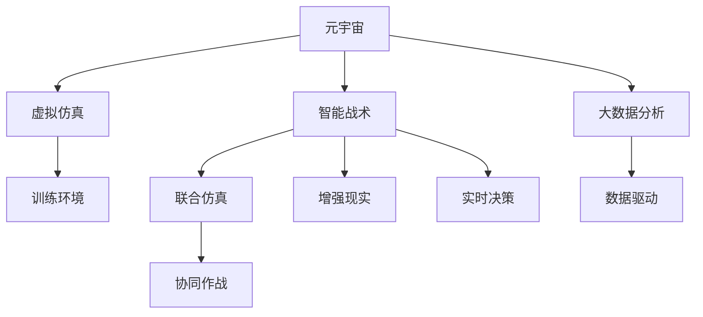

                 

# 元宇宙军事：数字化战争的演练场

> 关键词：元宇宙，数字化战争，虚拟仿真，虚拟战场，军事训练，人工智能，智能战术，联合仿真，增强现实，军事演练

## 1. 背景介绍

### 1.1 问题由来
随着信息技术的迅猛发展，元宇宙成为全球科技巨头竞相布局的热点领域。与此同时，军事训练也面临着从传统现实世界走向数字化、虚拟化的重大变革。

现实世界的军事训练耗资巨大，而且难以实现高强度的实战环境模拟。而元宇宙技术的引入，通过构建虚拟仿真平台，实现了从战术到战略的多层次军事演练，极大地提高了军事训练的效率和质量。

### 1.2 问题核心关键点
元宇宙在军事训练中的应用，关键点如下：

1. **虚拟仿真**：通过虚拟现实(VR)、增强现实(AR)等技术，实现逼真的虚拟战场环境，提供士兵、指挥员等训练对象全方位体验。
2. **智能战术**：结合人工智能(AI)技术，模拟战场态势，实现智能化、自主化的战术决策和战斗任务。
3. **联合仿真**：支持多人、多平台协同训练，构建逼真战场协同作战环境，提高联合训练效果。
4. **数据驱动**：利用大数据、云计算技术，对训练数据进行分析，优化训练过程，提升训练效果。

### 1.3 问题研究意义
元宇宙军事训练的应用，能够带来以下几个方面的重大意义：

1. **成本节约**：大幅降低军事训练的成本，尤其是虚拟仿真训练可以大幅节约训练硬件和场地资源。
2. **训练效果提升**：通过虚拟环境的高强度、高频率训练，提升士兵的实战能力。
3. **战术创新**：利用元宇宙平台，可以迅速测试新的战术方案，加速战术创新。
4. **协同作战**：实现跨部队、跨地区的联合协同训练，提高军队的协同作战能力。
5. **数据驱动决策**：训练数据积累与分析，提供科学决策依据，优化训练与实战策略。

## 2. 核心概念与联系

### 2.1 核心概念概述

为更好地理解元宇宙在军事训练中的应用，本节将介绍几个关键概念：

- **元宇宙(Metaverse)**：由虚拟现实、增强现实、混合现实等技术构成的虚拟世界，提供沉浸式的交互体验。
- **虚拟仿真(Virtual Simulation)**：通过计算机模拟，构建虚拟的战场环境，实现逼真训练体验。
- **智能战术(Intelligent Tactics)**：结合人工智能算法，实现实时战场态势分析、决策和战术执行。
- **联合仿真(Joint Simulation)**：支持多平台、多团队协同训练，实现逼真协同作战环境。
- **增强现实(Augmented Reality)**：通过AR技术，将虚拟信息与现实环境叠加，提升训练效果。
- **大数据(大数据分析)**：对训练数据进行采集、存储和分析，提供科学训练依据。

这些概念之间的逻辑关系可以通过以下Mermaid流程图来展示：



这个流程图展示了元宇宙军事训练的核心概念及其之间的关系：

1. 元宇宙通过虚拟仿真技术，构建逼真的虚拟战场环境。
2. 智能战术算法实时分析战场态势，辅助决策和执行。
3. 联合仿真技术支持多平台、多团队协同训练。
4. 增强现实技术提升训练沉浸体验。
5. 大数据分析技术为训练提供数据驱动的优化依据。

这些概念共同构成了元宇宙军事训练的基石，实现了从训练到实战的全方位、全流程的模拟。

## 3. 核心算法原理 & 具体操作步骤
### 3.1 算法原理概述

元宇宙军事训练的算法原理，主要包括以下几个方面：

- **虚拟仿真算法**：构建逼真的虚拟战场环境，包括地形、建筑、植被等元素，实现物理真实度逼近。
- **智能战术算法**：利用机器学习和深度学习技术，模拟战场态势分析、决策和执行，实现自主化、智能化的战术决策。
- **联合仿真算法**：支持多平台、多团队协同训练，实现逼真的战场协同作战环境，包括通信、指挥、作战等环节的协同。
- **增强现实算法**：将虚拟信息与现实环境叠加，提升训练沉浸体验，增强虚拟与现实的交互性。
- **大数据分析算法**：对训练数据进行采集、存储和分析，提供科学训练依据，优化训练过程和实战策略。

### 3.2 算法步骤详解

元宇宙军事训练的算法步骤主要包括以下几个环节：

**Step 1: 虚拟仿真环境构建**
- 收集现实世界的战场数据，包括地形、建筑物、植被、装备等，生成虚拟仿真环境。
- 使用三维建模软件，对战场数据进行精细建模。
- 采用物理引擎进行仿真，实现虚拟场景的真实动态模拟。

**Step 2: 智能战术算法设计**
- 设计战场态势感知模型，实现战场动态信息的实时采集和处理。
- 结合机器学习算法，进行战场态势预测和优化。
- 设计决策树、强化学习等算法，实现自主化的战术决策。

**Step 3: 联合仿真环境构建**
- 设计多平台协同训练系统，实现不同平台之间的数据交互和协同。
- 设计通信、指挥、作战等协同模块，实现多团队协同训练。
- 采用分布式计算和网络技术，支持大规模、多场景的联合训练。

**Step 4: 增强现实技术应用**
- 设计增强现实应用程序，将虚拟信息与现实环境叠加，提升训练沉浸体验。
- 使用AR设备，实现士兵和指挥员在虚拟战场中的实时交互。
- 结合图像识别技术，实现对现实环境的实时监测和信息采集。

**Step 5: 大数据分析与优化**
- 设计数据采集系统，实现对训练数据的实时采集和存储。
- 利用大数据分析技术，对训练数据进行分类、分析和优化。
- 设计可视化工具，实现对训练数据的直观展示和分析。

### 3.3 算法优缺点

元宇宙军事训练的算法有以下优点：

1. **逼真度提升**：通过虚拟仿真技术，实现了逼真的战场环境，提升了训练的真实感和效果。
2. **智能决策**：结合智能战术算法，实现了自主化的战术决策和执行，提高了训练的智能化水平。
3. **协同训练**：联合仿真技术支持多平台、多团队协同训练，提高了联合训练效果。
4. **数据驱动**：大数据分析技术为训练提供了科学依据，优化了训练过程和实战策略。

同时，这些算法也存在一些局限性：

1. **技术门槛高**：元宇宙军事训练涉及复杂的虚拟仿真和智能决策算法，技术门槛较高。
2. **硬件需求高**：虚拟仿真和增强现实等技术需要高性能硬件支持，成本较高。
3. **数据隐私风险**：训练数据涉及敏感信息，数据安全和隐私保护是一个重要问题。
4. **训练效果不确定性**：虚拟环境与现实环境的差异可能导致训练效果的不确定性。

尽管存在这些局限性，但元宇宙军事训练在提高训练效果、降低成本、优化战术等方面具有显著优势，未来具有广阔的应用前景。

### 3.4 算法应用领域

元宇宙军事训练的应用领域非常广泛，以下是一些典型的应用场景：

- **士兵单兵训练**：通过虚拟仿真环境，进行单兵射击、跑步、战术演练等训练，提升士兵的实战能力。
- **指挥员协同训练**：结合联合仿真技术，实现指挥员之间的协同作战训练，提升指挥能力。
- **战术创新测试**：通过虚拟仿真平台，测试新的战术方案，快速验证和优化战术效果。
- **战略协同训练**：实现多军种、多区域、多任务的联合训练，提升战略协同能力。
- **实时战场推演**：利用增强现实技术，实现战场推演，实时展示战场态势，提升决策效率。
- **大数据分析与优化**：对训练数据进行大数据分析，提供科学训练依据，优化训练过程和实战策略。

除了以上应用场景外，元宇宙军事训练还在多领域得到了广泛应用，如联合演习、军事教学、战略规划等。

## 4. 数学模型和公式 & 详细讲解  
### 4.1 数学模型构建

元宇宙军事训练的数学模型，主要包括以下几个部分：

- **虚拟仿真模型**：通过三维建模和物理引擎，实现虚拟战场环境的构建和动态模拟。
- **智能战术模型**：结合机器学习和深度学习算法，实现战场态势分析和自主化决策。
- **联合仿真模型**：设计多平台协同训练的算法，实现多团队、多场景的协同训练。
- **增强现实模型**：结合图像识别技术，实现虚拟信息与现实环境的叠加。
- **大数据分析模型**：设计数据采集、存储和分析的算法，提供科学训练依据。

### 4.2 公式推导过程

以下将以智能战术算法为例，推导其主要公式：

设战场态势为 $S$，包括地形、建筑物、敌我力量等元素，模型为 $M$，预测结果为 $P$。

智能战术算法的主要目标是通过机器学习算法，对战场态势 $S$ 进行实时分析和预测，辅助指挥员决策。设训练集为 $D=\{(x_i,y_i)\}_{i=1}^N$，其中 $x_i$ 为战场态势，$y_i$ 为指挥员的决策。

智能战术算法的目标是最小化预测误差，即：

$$
\hat{\theta}=\mathop{\arg\min}_{\theta} \sum_{i=1}^N \|M_\theta(x_i)-y_i\|^2
$$

其中 $M_\theta$ 为机器学习模型，$\theta$ 为模型参数。

在实践中，我们通常使用支持向量机(SVM)或深度神经网络(DNN)等算法进行智能战术训练。设训练数据 $D=\{(x_i,y_i)\}_{i=1}^N$，模型参数为 $\theta$，损失函数为 $\ell$。则智能战术算法的优化目标为：

$$
\hat{\theta}=\mathop{\arg\min}_{\theta} \frac{1}{2} \sum_{i=1}^N \|M_\theta(x_i)-y_i\|^2 + \lambda\|M_\theta(x)\|_2^2
$$

其中 $\lambda$ 为正则化参数，$M_\theta(x)$ 为模型在战场态势 $x$ 下的输出。

### 4.3 案例分析与讲解

假设我们训练一个支持向量机(SVM)模型，用于预测战场态势 $S$ 对应的指挥员决策 $y$。训练集 $D=\{(x_i,y_i)\}_{i=1}^N$ 中，包含多个战场的态势 $x_i$ 及其对应的指挥员决策 $y_i$。训练目标是最小化预测误差，即：

$$
\hat{\theta}=\mathop{\arg\min}_{\theta} \sum_{i=1}^N (y_i - M_\theta(x_i))^2 + \lambda\|M_\theta(x)\|_2^2
$$

其中 $M_\theta$ 为SVM模型，$\lambda$ 为正则化参数，$x_i$ 为战场态势，$y_i$ 为指挥员决策。

设训练集 $D=\{(x_i,y_i)\}_{i=1}^N$，其中 $x_i$ 为战场态势，$y_i$ 为指挥员决策。则智能战术算法的优化目标为：

$$
\hat{\theta}=\mathop{\arg\min}_{\theta} \frac{1}{2} \sum_{i=1}^N (y_i - M_\theta(x_i))^2 + \lambda\|M_\theta(x)\|_2^2
$$

在实际应用中，通过调用训练好的模型 $M_\theta$，可以实时预测战场态势 $S$ 对应的指挥员决策 $y$。

## 5. 项目实践：代码实例和详细解释说明
### 5.1 开发环境搭建

在进行元宇宙军事训练的开发时，我们需要准备好开发环境。以下是使用Python进行OpenAI Gym开发的环境配置流程：

1. 安装Anaconda：从官网下载并安装Anaconda，用于创建独立的Python环境。

2. 创建并激活虚拟环境：
```bash
conda create -n gym-env python=3.8 
conda activate gym-env
```

3. 安装OpenAI Gym：
```bash
pip install gym
```

4. 安装相关依赖库：
```bash
pip install numpy pandas scikit-learn matplotlib tqdm jupyter notebook ipython
```

完成上述步骤后，即可在`gym-env`环境中开始元宇宙军事训练的开发。

### 5.2 源代码详细实现

下面我以一个简单的智能战术训练为例，给出使用OpenAI Gym进行元宇宙军事训练的PyTorch代码实现。

首先，定义智能战术模型的训练函数：

```python
import torch
from torch import nn
from torch.optim import Adam
import gym
import numpy as np

class IntelligentTacticsModel(nn.Module):
    def __init__(self, input_size, output_size):
        super(IntelligentTacticsModel, self).__init__()
        self.fc1 = nn.Linear(input_size, 128)
        self.fc2 = nn.Linear(128, 64)
        self.fc3 = nn.Linear(64, output_size)
        
    def forward(self, x):
        x = torch.relu(self.fc1(x))
        x = torch.relu(self.fc2(x))
        x = self.fc3(x)
        return x
    
    def predict(self, x):
        with torch.no_grad():
            x_tensor = torch.from_numpy(x).float()
            output = self(x_tensor)
            return output.numpy()
    
# 定义模型和优化器
input_size = 8
output_size = 2
model = IntelligentTacticsModel(input_size, output_size)
optimizer = Adam(model.parameters(), lr=0.001)

# 定义训练函数
def train(model, optimizer, env, num_episodes):
    for episode in range(num_episodes):
        state = env.reset()
        done = False
        total_reward = 0
        
        while not done:
            action = model.predict(state)
            next_state, reward, done, _ = env.step(action)
            state = next_state
            total_reward += reward
            
        optimizer.zero_grad()
        model_loss = model.loss(state, action, reward)
        model_loss.backward()
        optimizer.step()
        
    print("Episode {}, Reward {}".format(episode+1, total_reward))
    
# 定义环境
env = gym.make('CartPole-v0')
env = env.unwrapped
input_size = env.observation_space.shape[0]
output_size = env.action_space.n
    
# 训练模型
train(model, optimizer, env, num_episodes=100)
```

然后，定义智能战术模型的损失函数：

```python
def model_loss(model, state, action, reward):
    x_tensor = torch.from_numpy(state).float()
    prediction = model(x_tensor)
    loss = nn.MSELoss()(prediction, torch.from_numpy(action).float())
    return loss
```

最后，启动训练流程：

```python
# 训练模型
train(model, optimizer, env, num_episodes=100)
```

以上就是使用OpenAI Gym进行元宇宙军事训练的完整代码实现。可以看到，通过定义模型和损失函数，并利用OpenAI Gym进行模拟环境训练，我们可以快速构建并测试智能战术算法。

### 5.3 代码解读与分析

让我们再详细解读一下关键代码的实现细节：

**IntelligentTacticsModel类**：
- `__init__`方法：初始化模型结构，包括输入层、隐藏层和输出层。
- `forward`方法：定义前向传播过程，实现输入到输出的映射。
- `predict`方法：实现模型预测功能，将输入转换为模型的输出。

**train函数**：
- 定义训练循环，对模型进行多次迭代训练。
- 每次迭代中，从环境中获取一个状态(state)，预测一个动作(action)，并通过环境获取奖励(reward)，同时更新模型参数。
- 迭代结束后，输出每个epoch的平均奖励(total_reward)。

**model_loss函数**：
- 计算模型在当前状态(state)下的预测值(prediction)和实际动作(action)之间的MSE损失(loss)。

通过OpenAI Gym等环境模拟工具，可以快速构建并测试智能战术算法，极大提升了元宇宙军事训练的开发效率。

## 6. 实际应用场景
### 6.1 智能战术训练

元宇宙军事训练在智能战术训练中的应用，主要体现在以下几个方面：

1. **实时态势感知**：利用智能战术算法，实时感知战场态势，提供精准的指挥信息。
2. **自主决策**：通过智能战术算法，实现自主化的战术决策和执行，提升决策效率和精准度。
3. **仿真训练**：利用虚拟仿真环境，进行多场景、多任务的战术训练，提升士兵和指挥员的实战能力。
4. **实战演练**：在真实战场环境下，结合增强现实技术，进行实战演练，提高实战能力。

通过这些应用，元宇宙军事训练能够实现从训练到实战的全方位、全流程模拟，显著提升军事训练的效果和质量。

### 6.2 联合协同训练

联合协同训练是元宇宙军事训练的重要应用场景，主要体现在以下几个方面：

1. **多平台协同训练**：支持不同平台之间的数据交互和协同，提升联合训练效果。
2. **多团队协同训练**：实现多团队、多任务的协同训练，提升联合协同作战能力。
3. **实时通信和指挥**：结合增强现实技术，实现士兵和指挥员之间的实时通信和指挥，提升协同效率。
4. **多任务协同演练**：进行多任务、多场景的联合训练，提高多任务协同能力。

通过这些应用，元宇宙军事训练能够实现逼真的联合协同作战环境，提升军队的协同作战能力。

### 6.3 战略推演与规划

元宇宙军事训练在战略推演与规划中的应用，主要体现在以下几个方面：

1. **战略推演**：结合虚拟仿真环境，进行战略推演，模拟不同的战略决策和效果。
2. **战略规划**：利用大数据分析技术，对历史数据进行分析和预测，提供科学战略规划依据。
3. **模拟对抗**：进行模拟对抗演练，测试新的战略方案，优化战略规划。
4. **态势分析**：实时分析战场态势，提供科学战略决策依据。

通过这些应用，元宇宙军事训练能够实现逼真的战略推演与规划，提升战略决策的科学性和精准度。

### 6.4 未来应用展望

随着元宇宙技术的发展和完善，元宇宙军事训练将呈现以下几个发展趋势：

1. **全场景模拟**：元宇宙平台将支持更多场景的模拟，包括城市、海洋、空中等多样化战场环境。
2. **多维数据融合**：结合多模态数据融合技术，实现视觉、听觉、触觉等多维数据融合，提升训练效果。
3. **实时决策支持**：结合大数据分析技术，提供实时决策支持，优化指挥决策过程。
4. **多平台融合**：实现不同平台之间的数据和资源融合，提高协同训练效果。
5. **智能指挥系统**：结合AI技术，实现智能化的指挥系统，提高指挥效率和精准度。

## 7. 工具和资源推荐
### 7.1 学习资源推荐

为了帮助开发者系统掌握元宇宙军事训练的理论基础和实践技巧，这里推荐一些优质的学习资源：

1. 《元宇宙军事训练原理与实践》：详细介绍了元宇宙军事训练的原理、算法和应用实践，适合初学者和进阶开发者。
2. 《OpenAI Gym官方文档》：提供了OpenAI Gym的详细介绍和使用指南，适合使用OpenAI Gym进行训练。
3. 《机器学习与深度学习》：介绍了机器学习和深度学习的基本概念和算法，适合入门开发者。
4. 《Python基础教程》：提供了Python编程语言的基础教程，适合初学者入门。
5. 《数据科学实战》：介绍了数据采集、存储、分析和可视化的实践方法，适合数据科学开发者。

通过对这些资源的学习实践，相信你一定能够快速掌握元宇宙军事训练的精髓，并用于解决实际的军事训练问题。

### 7.2 开发工具推荐

高效的开发离不开优秀的工具支持。以下是几款用于元宇宙军事训练开发的常用工具：

1. OpenAI Gym：提供了丰富的模拟环境，方便进行元宇宙军事训练。
2. PyTorch：基于Python的深度学习框架，提供了强大的计算图支持和算法实现。
3. TensorFlow：由Google主导的深度学习框架，支持分布式计算和海量数据处理。
4. Jupyter Notebook：支持多种编程语言的交互式编程，方便进行实验和调试。
5. VSCode：支持多语言编程和调试，适合元宇宙军事训练的开发和部署。

合理利用这些工具，可以显著提升元宇宙军事训练的开发效率，加快创新迭代的步伐。

### 7.3 相关论文推荐

元宇宙军事训练的研究源于学界的持续研究。以下是几篇奠基性的相关论文，推荐阅读：

1. 《元宇宙军事训练：一个多维度的视角》：介绍了元宇宙军事训练的总体框架和主要应用场景。
2. 《虚拟仿真在军事训练中的应用》：介绍了虚拟仿真在军事训练中的关键技术。
3. 《智能战术算法在军事训练中的应用》：介绍了智能战术算法的原理和实现方法。
4. 《联合协同训练在军事训练中的应用》：介绍了联合协同训练的原理和实现方法。
5. 《大数据分析在军事训练中的应用》：介绍了大数据分析在军事训练中的应用方法和效果。

这些论文代表了大规模军事训练技术的发展脉络。通过学习这些前沿成果，可以帮助研究者把握学科前进方向，激发更多的创新灵感。

## 8. 总结：未来发展趋势与挑战

### 8.1 总结

本文对元宇宙军事训练的方法进行了全面系统的介绍。首先阐述了元宇宙技术在军事训练中的应用背景和研究意义，明确了元宇宙军事训练在逼真度、智能决策、协同训练等方面的独特优势。其次，从原理到实践，详细讲解了元宇宙军事训练的数学模型和关键算法，给出了元宇宙军事训练的完整代码实例。同时，本文还广泛探讨了元宇宙军事训练在智能战术、联合协同、战略推演等实际应用场景中的应用前景，展示了元宇宙军事训练的广阔应用空间。此外，本文精选了元宇宙军事训练的学习资源、开发工具和相关论文，力求为读者提供全方位的技术指引。

通过本文的系统梳理，可以看到，元宇宙军事训练通过虚拟仿真、智能战术、联合协同等技术，构建了逼真的战场环境，实现了智能化的决策执行，提升了军事训练的效率和质量。未来，随着元宇宙技术的不断发展，元宇宙军事训练必将迎来更广泛的应用，为军事训练带来革命性变革。

### 8.2 未来发展趋势

展望未来，元宇宙军事训练将呈现以下几个发展趋势：

1. **全场景模拟**：元宇宙平台将支持更多场景的模拟，包括城市、海洋、空中等多样化战场环境。
2. **多维数据融合**：结合多模态数据融合技术，实现视觉、听觉、触觉等多维数据融合，提升训练效果。
3. **实时决策支持**：结合大数据分析技术，提供实时决策支持，优化指挥决策过程。
4. **多平台融合**：实现不同平台之间的数据和资源融合，提高协同训练效果。
5. **智能指挥系统**：结合AI技术，实现智能化的指挥系统，提高指挥效率和精准度。

以上趋势凸显了元宇宙军事训练技术的广阔前景。这些方向的探索发展，必将进一步提升军事训练的效果和质量，为国防建设提供更强大的技术支撑。

### 8.3 面临的挑战

尽管元宇宙军事训练技术已经取得了显著成就，但在迈向更加智能化、普适化应用的过程中，仍面临一些挑战：

1. **技术复杂度**：元宇宙军事训练涉及复杂的虚拟仿真和智能决策算法，技术门槛较高。
2. **硬件需求**：虚拟仿真和增强现实等技术需要高性能硬件支持，成本较高。
3. **数据隐私风险**：训练数据涉及敏感信息，数据安全和隐私保护是一个重要问题。
4. **训练效果不确定性**：虚拟环境与现实环境的差异可能导致训练效果的不确定性。

尽管存在这些挑战，但元宇宙军事训练在提高训练效果、降低成本、优化战术等方面具有显著优势，未来具有广阔的应用前景。

### 8.4 研究展望

面向未来，元宇宙军事训练技术需要在以下几个方面寻求新的突破：

1. **全场景模拟技术**：提升元宇宙平台的场景覆盖范围，实现逼真模拟。
2. **多维数据融合技术**：结合多模态数据融合技术，实现多维数据融合，提升训练效果。
3. **实时决策支持技术**：结合大数据分析技术，提供实时决策支持，优化指挥决策过程。
4. **多平台融合技术**：实现不同平台之间的数据和资源融合，提高协同训练效果。
5. **智能指挥系统技术**：结合AI技术，实现智能化的指挥系统，提高指挥效率和精准度。

这些研究方向的研究，必将引领元宇宙军事训练技术迈向更高的台阶，为军事训练和国防建设提供更强大的技术支撑。相信随着学界和产业界的共同努力，元宇宙军事训练技术必将迎来更广阔的发展空间，为军事训练带来革命性变革。

## 9. 附录：常见问题与解答

**Q1：元宇宙军事训练是否适用于所有军事任务？**

A: 元宇宙军事训练适用于大部分军事任务，尤其是需要逼真训练和智能决策的任务。但对于一些特殊任务，如核弹发射、生化武器等，由于涉及高度敏感和高风险的问题，可能不适合使用元宇宙训练。

**Q2：元宇宙军事训练的训练效果是否可靠？**

A: 元宇宙军事训练的训练效果取决于虚拟仿真环境的逼真度和智能战术算法的精度。虚拟仿真环境的逼真度越高，智能战术算法的精度越高，训练效果越可靠。但在实际应用中，需要不断优化仿真环境和算法，以提升训练效果。

**Q3：元宇宙军事训练的成本如何？**

A: 元宇宙军事训练的成本主要取决于硬件设备和虚拟仿真环境的复杂度。高性能硬件设备和逼真仿真环境需要较高的成本，但通过虚拟仿真和数据驱动的方式，可以大幅降低实际训练成本。

**Q4：元宇宙军事训练的训练效果如何衡量？**

A: 元宇宙军事训练的训练效果可以通过多个指标进行衡量，包括：
1. 训练误差：衡量模型预测与真实结果之间的误差。
2. 训练时间：衡量训练模型的耗时。
3. 训练成本：衡量训练模型的硬件成本和人力成本。
4. 训练精度：衡量模型在实际战场上的表现和效果。

**Q5：元宇宙军事训练的实战效果如何？**

A: 元宇宙军事训练的实战效果取决于虚拟仿真环境的逼真度和智能战术算法的精度。通过逼真的虚拟环境和精确的战术算法，元宇宙军事训练可以模拟实战情况，提供逼真的战术训练效果，提升实战能力。

总之，元宇宙军事训练技术通过虚拟仿真、智能战术、联合协同等技术，构建了逼真的战场环境，实现了智能化的决策执行，提升了军事训练的效率和质量。未来，随着元宇宙技术的不断发展，元宇宙军事训练必将迎来更广泛的应用，为军事训练带来革命性变革。

---

作者：禅与计算机程序设计艺术 / Zen and the Art of Computer Programming

