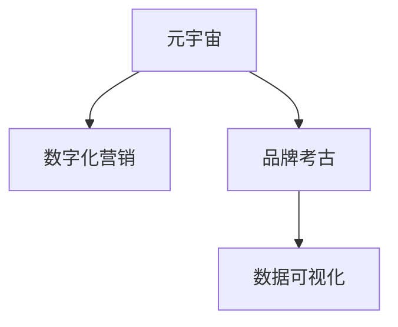

                 

# 元宇宙品牌考古:数字化营销历史的追溯与分析

> 关键词：元宇宙,数字化营销,品牌考古,营销历史,数据分析

## 1. 背景介绍

### 1.1 问题由来

随着数字化的深入，品牌营销也在经历着翻天覆地的变化。从传统的线下广告到全数字化的线上营销，从单向传播到互动性强的内容营销，品牌在数字世界中的存在形式和传播方式都在不断演进。元宇宙作为新一代的数字空间，为品牌营销提供了全新的场域，让品牌的数字化营销能力迎来了新的机遇与挑战。

元宇宙是由一系列虚拟空间和数字资产组成的连续世界，通过虚拟现实(VR)、增强现实(AR)、区块链等技术构建。品牌在元宇宙中不再仅限于二维的网页或图片，而是以三维形态在虚拟空间中呈现，具有更高的互动性和沉浸感。在这样一个全新的数字环境中，品牌营销将面临诸多历史性变化，而这些变化也将成为未来营销的重要参考。

## 2. 核心概念与联系

### 2.1 核心概念概述

为更好地理解元宇宙中品牌营销的演进，本节将介绍几个关键概念：

- 元宇宙(Metaverse)：基于VR、AR、区块链等技术构建的虚拟空间，提供了一个沉浸式的数字生活环境。
- 数字化营销(Digital Marketing)：利用数字技术进行品牌推广和销售的营销方式，包括SEO、SEM、社交媒体营销、内容营销等。
- 品牌考古(Brand Archaeology)：通过历史数据挖掘与分析，了解品牌发展的脉络与规律。
- 数据可视化(Data Visualization)：将复杂的数据信息以图形化的形式呈现，帮助理解并辅助决策。

这些概念之间的逻辑关系可以通过以下Mermaid流程图来展示：



这个流程图展示了几大关键概念之间的联系：

1. 元宇宙为数字化营销提供了新的空间和形式，推动了营销的创新。
2. 品牌考古通过数据挖掘了解品牌的历史演变，为数字化营销提供数据支撑。
3. 数据可视化帮助转化复杂的数据信息，为决策提供直观的依据。

## 3. 核心算法原理 & 具体操作步骤

### 3.1 算法原理概述

元宇宙品牌考古的算法原理主要基于数据分析和机器学习技术，通过历史数据挖掘，识别品牌营销的关键节点和规律，为未来的营销策略提供指导。核心流程包括：

1. 数据收集：从品牌的历史营销数据中提取关键信息。
2. 数据分析：对数据进行统计分析和趋势分析。
3. 机器学习：使用机器学习模型预测品牌的发展趋势和潜在风险。
4. 数据可视化：将分析结果以直观的图形呈现，供决策参考。

### 3.2 算法步骤详解

基于元宇宙品牌考古的算法步骤主要包括以下几个关键步骤：

**Step 1: 数据收集与预处理**
- 收集品牌的历史营销数据，包括线上广告数据、社交媒体互动数据、用户反馈数据等。
- 对数据进行清洗和标准化处理，去除异常值和噪声数据，确保数据的完整性和准确性。

**Step 2: 数据分析与特征提取**
- 使用统计分析和可视化工具，如Python中的Pandas、Matplotlib、Seaborn等，对数据进行初步分析，了解数据的基本特征和分布情况。
- 提取关键特征，如用户互动率、广告投放效果、社交媒体提及量等，为后续机器学习模型训练做准备。

**Step 3: 机器学习模型训练**
- 选择适合的数据集，使用机器学习算法（如回归分析、聚类分析、分类分析等）进行模型训练。
- 对模型进行交叉验证，选择性能最佳的模型。
- 使用超参数调优方法，如网格搜索、随机搜索、贝叶斯优化等，优化模型参数。

**Step 4: 预测与决策支持**
- 将训练好的模型应用到新的数据集上，进行预测和趋势分析。
- 使用数据可视化工具，如Tableau、Power BI等，将分析结果以图形化的方式展示。
- 结合领域专家的知识和经验，对预测结果进行人工验证和优化。

### 3.3 算法优缺点

基于元宇宙品牌考古的算法具有以下优点：
1. 全面性。能够综合考虑品牌在元宇宙中不同维度的数据，提供全面的分析结果。
2. 实时性。通过机器学习模型的在线预测，能够及时发现品牌营销中的问题，快速响应。
3. 可解释性。数据可视化的辅助，使得模型分析结果更加直观，便于理解和应用。

同时，该算法也存在一定的局限性：
1. 数据依赖性。历史数据的完整性和质量直接影响分析结果的准确性。
2. 模型复杂性。不同的营销场景需要不同类型的模型，模型的选择和调优较为复杂。
3. 技术门槛高。需要掌握数据分析和机器学习等专业技能，对非专业人员的友好度较低。
4. 结果主观性。数据挖掘和模型训练需要领域专家参与，分析结果受主观影响较大。

尽管存在这些局限性，但总体而言，基于元宇宙品牌考古的算法仍然能够为品牌数字化营销提供有力的支持。

### 3.4 算法应用领域

基于元宇宙品牌考古的算法主要应用于以下几个领域：

- **品牌成长史分析**：通过分析品牌在不同阶段的表现，了解品牌成长的规律和关键节点。
- **营销策略优化**：通过历史数据的分析，识别有效的营销策略和失败案例，优化未来的营销方案。
- **用户行为预测**：通过对用户互动数据的挖掘，预测用户的行为模式和偏好，提升用户体验。
- **市场趋势洞察**：通过分析市场数据，识别市场趋势和潜在机会，指导品牌战略规划。
- **竞争对手分析**：通过对比分析竞争对手的营销数据，了解市场竞争态势，制定差异化策略。

## 4. 数学模型和公式 & 详细讲解 & 举例说明

### 4.1 数学模型构建

品牌考古的数学模型主要围绕品牌的历史数据构建，包括时间序列分析、聚类分析、回归分析等。

- **时间序列分析**：用于分析品牌营销指标随时间的变化趋势。
- **聚类分析**：用于将用户行为数据分组，识别不同的用户群体。
- **回归分析**：用于预测品牌在不同因素影响下的表现。

### 4.2 公式推导过程

以回归分析为例，品牌营销指标（如销售额）可以表示为：

$$
Y_t = \beta_0 + \beta_1X_{1,t} + \beta_2X_{2,t} + \cdots + \beta_nX_{n,t} + \epsilon_t
$$

其中，$Y_t$ 为第 $t$ 期的品牌销售额，$\beta$ 为回归系数，$X_{i,t}$ 为第 $t$ 期的第 $i$ 个解释变量，$\epsilon_t$ 为误差项。

通过最小二乘法求解回归系数 $\beta$：

$$
\hat{\beta} = (X'X)^{-1}X'Y
$$

得到回归模型后，可以预测品牌在未来的表现：

$$
Y_{t+1} = \hat{\beta}_0 + \hat{\beta}_1X_{1,t+1} + \hat{\beta}_2X_{2,t+1} + \cdots + \hat{\beta}_nX_{n,t+1}
$$

### 4.3 案例分析与讲解

假设某品牌在不同季度进行广告投放，收集广告点击率和销售额数据如下：

| 季度   | 广告点击率 | 销售额（万元） |
| ------ | --------- | ------------- |
| Q1    | 10%       | 100           |
| Q2    | 15%       | 120           |
| Q3    | 20%       | 150           |
| Q4    | 25%       | 180           |

通过回归分析，可以建立广告点击率和销售额之间的关系：

$$
Y_t = 80 + 8X_{1,t} + \epsilon_t
$$

其中，$Y_t$ 为第 $t$ 期的销售额，$X_{1,t}$ 为第 $t$ 期的广告点击率，$\beta_0 = 80$，$\beta_1 = 8$。

根据回归模型，可以预测下季度销售额：

$$
Y_{t+1} = 80 + 8 \times 20\% = 104
$$

即下季度销售额预计为104万元。

## 5. 项目实践：代码实例和详细解释说明

### 5.1 开发环境搭建

在进行元宇宙品牌考古的实践前，我们需要准备好开发环境。以下是使用Python进行数据分析和机器学习开发的环境配置流程：

1. 安装Anaconda：从官网下载并安装Anaconda，用于创建独立的Python环境。

2. 创建并激活虚拟环境：
```bash
conda create -n pyenv python=3.8 
conda activate pyenv
```

3. 安装必要的Python库：
```bash
conda install numpy pandas matplotlib seaborn sklearn statsmodels
```

4. 安装数据分析和可视化工具：
```bash
pip install pandas-profiling
pip install matplotlib seaborn
```

5. 安装机器学习库：
```bash
pip install scikit-learn statsmodels
```

完成上述步骤后，即可在`pyenv`环境中开始品牌考古的实践。

### 5.2 源代码详细实现

这里以品牌历史销售额和广告点击率之间的关系为例，展示Python代码实现。

首先，导入必要的库：

```python
import pandas as pd
import numpy as np
import matplotlib.pyplot as plt
from sklearn.linear_model import LinearRegression
from sklearn.model_selection import train_test_split
```

接着，加载数据：

```python
data = pd.read_csv('brand_sales.csv')
```

对数据进行初步分析：

```python
data.info()
data.describe()
```

绘制时间序列图：

```python
plt.figure(figsize=(10, 6))
plt.plot(data['季度'], data['销售额'])
plt.xlabel('季度')
plt.ylabel('销售额')
plt.title('品牌销售额时间序列')
plt.show()
```

进行数据清洗和标准化：

```python
data = data.dropna()
data = data.drop_duplicates()
data = data.reset_index(drop=True)
```

划分训练集和测试集：

```python
X = data[['广告点击率']]
Y = data['销售额']
X_train, X_test, Y_train, Y_test = train_test_split(X, Y, test_size=0.2, random_state=42)
```

训练线性回归模型：

```python
model = LinearRegression()
model.fit(X_train, Y_train)
Y_pred = model.predict(X_test)
```

评估模型性能：

```python
from sklearn.metrics import r2_score

r2 = r2_score(Y_test, Y_pred)
print(f'R^2: {r2:.2f}')
```

输出结果：

```python
Y_pred
```

### 5.3 代码解读与分析

让我们再详细解读一下关键代码的实现细节：

**数据加载**：
- 使用Pandas库的`read_csv`方法加载品牌历史数据。
- 数据包含季度、广告点击率和销售额三个字段。

**数据分析**：
- 使用`info`方法查看数据的基本信息，包括数据类型、非空值等。
- 使用`describe`方法统计数据的基本特征，包括均值、标准差等。

**时间序列分析**：
- 使用Matplotlib库绘制时间序列图，直观展示品牌销售额随时间变化的趋势。

**数据清洗**：
- 使用`dropna`方法删除缺失值。
- 使用`drop_duplicates`方法删除重复行。
- 使用`reset_index`方法重置索引，使其连续。

**模型训练**：
- 使用Scikit-learn库的`LinearRegression`模型进行线性回归。
- 使用`fit`方法训练模型，使用测试集`X_test`进行预测。

**模型评估**：
- 使用Scikit-learn库的`r2_score`方法计算模型在测试集上的决定系数R^2，评估模型性能。

通过上述代码实现，可以直观展示品牌历史数据的关系，并通过线性回归模型预测未来的表现。

## 6. 实际应用场景

### 6.1 智能营销策略

元宇宙品牌考古可以帮助品牌制定更加精准和高效的营销策略。通过对历史数据的分析，识别出不同营销渠道、不同时间段的效果，以及不同用户群体对营销内容的响应。

具体而言，品牌可以在元宇宙中设计虚拟场景，通过用户的互动数据（如点击率、停留时间、购买行为等）来评估不同的营销活动效果。根据分析结果，优化营销资源的分配，提升营销ROI。

### 6.2 个性化推荐系统

个性化推荐系统是元宇宙品牌营销的重要组成部分。通过对用户的浏览、点击、购买等行为数据的分析，品牌可以了解用户的兴趣偏好，提供个性化的推荐内容。

品牌可以采用机器学习模型，如协同过滤、内容推荐等，对用户的兴趣进行建模。同时，利用品牌考古的数据分析结果，优化推荐算法，提升推荐效果。

### 6.3 品牌危机预警

品牌在元宇宙中的互动数据，可以用于实时监控品牌形象和用户情绪。通过分析用户的评论、反馈等数据，识别出品牌面临的潜在危机。

品牌可以建立情感分析模型，对用户评论进行情感分类，及时发现负面评论和情绪波动。通过品牌考古的趋势分析，预测品牌危机的发生和发展趋势，提前采取措施应对。

### 6.4 未来应用展望

随着元宇宙的发展，品牌考古的应用场景将更加广泛。未来，品牌考古不仅局限于数字化营销领域，还将在以下几个方向上拓展：

- **虚拟商品推荐**：通过虚拟试穿、试用等方式，分析用户的互动数据，推荐虚拟商品，提升用户体验。
- **虚拟代言人互动**：品牌可以在元宇宙中设计虚拟代言人，通过与用户的互动，了解用户的反馈，优化代言人形象和互动内容。
- **虚拟活动策划**：通过分析用户的历史互动数据，策划虚拟活动，提升用户参与度和品牌影响力。

未来，元宇宙将成为品牌营销的新阵地，品牌考古将发挥更加重要的作用。

## 7. 工具和资源推荐

### 7.1 学习资源推荐

为了帮助开发者系统掌握品牌考古的理论与实践，这里推荐一些优质的学习资源：

1. 《数据科学与数据分析基础》课程：由知名教育平台提供，涵盖数据处理、数据分析、机器学习等基本概念和方法。
2. 《Python数据分析与可视化》书籍：详细介绍了Python在数据分析中的应用，包括Pandas、Matplotlib、Seaborn等库的使用。
3. 《品牌考古：基于数据的故事》白皮书：由知名咨询公司发布，结合真实案例，介绍品牌考古的方法和应用。
4. 《品牌数字化转型指南》报告：由权威机构发布，分析品牌在数字化转型中的挑战和机遇，提供具体建议。

通过对这些资源的学习实践，相信你一定能够快速掌握品牌考古的方法，并用于解决实际的数字化营销问题。

### 7.2 开发工具推荐

高效的开发离不开优秀的工具支持。以下是几款用于品牌考古开发的常用工具：

1. Jupyter Notebook：一款交互式的开发环境，方便进行代码编写、数据处理和可视化。
2. Pandas：一款强大的数据处理库，支持多种数据格式的导入和导出，提供丰富的数据处理功能。
3. Matplotlib和Seaborn：两款常用的数据可视化工具，支持生成高质量的图形，方便数据分析和展示。
4. Scikit-learn：一款机器学习库，提供多种经典的机器学习算法和工具，支持模型训练和评估。

合理利用这些工具，可以显著提升品牌考古的开发效率，加快创新迭代的步伐。

### 7.3 相关论文推荐

品牌考古技术的发展源于学界的持续研究。以下是几篇奠基性的相关论文，推荐阅读：

1. "Brand Archaeology: An Exploratory Study on Brand Evolution and Strategies"：探讨品牌在数字化环境中的演变，分析历史数据对未来策略的影响。
2. "Predicting Brand Performance with Machine Learning"：使用机器学习模型预测品牌表现，分析不同因素对品牌的影响。
3. "Data Mining and Statistical Learning in Brand Management"：结合数据挖掘和统计学习方法，探索品牌管理的创新路径。
4. "Crowdsourcing Data for Brand Archaeology"：讨论如何利用众包数据进行品牌考古，提高数据质量和分析效果。
5. "Visualization Techniques for Brand Analysis"：介绍多种数据可视化方法，提升品牌考古的分析效果。

这些论文代表了大品牌考古技术的发展脉络。通过学习这些前沿成果，可以帮助研究者把握学科前进方向，激发更多的创新灵感。

## 8. 总结：未来发展趋势与挑战

### 8.1 总结

本文对基于元宇宙的品牌考古方法进行了全面系统的介绍。首先阐述了品牌考古的基本概念和元宇宙的数字化营销场景，明确了品牌考古在元宇宙中的重要性和价值。其次，从原理到实践，详细讲解了品牌考古的数学模型和关键步骤，给出了品牌考古任务开发的完整代码实例。同时，本文还广泛探讨了品牌考古方法在智能营销策略、个性化推荐系统、品牌危机预警等多个行业领域的应用前景，展示了品牌考古方法的广阔应用空间。

通过本文的系统梳理，可以看到，基于元宇宙的品牌考古方法正在成为数字化营销的重要手段，极大地拓展了品牌数字化营销的边界，催生了更多的落地场景。品牌考古技术不仅能够帮助品牌了解自身的成长历史和市场表现，还能够为未来的营销决策提供有力的数据支撑。未来，伴随元宇宙的发展和技术的不断进步，品牌考古必将在构建人机协同的智能营销中扮演越来越重要的角色。

### 8.2 未来发展趋势

展望未来，品牌考古技术将呈现以下几个发展趋势：

1. 技术智能化：利用人工智能技术，提升品牌考古的分析深度和精度，降低人工干预的复杂度。
2. 数据自动化：通过数据自动化采集和处理，提高品牌考古的效率和准确性，降低人工成本。
3. 可视化提升：结合更多先进的可视化工具和技巧，提供更加直观、易于理解的品牌考古分析结果。
4. 跨领域融合：品牌考古技术与市场营销、品牌管理、大数据分析等领域的深度融合，推动品牌管理的创新发展。
5. 全渠道应用：品牌考古不仅局限于数字化营销领域，还将拓展到实体店铺、社交媒体、线下活动等全渠道场景。

以上趋势凸显了品牌考古技术的广阔前景。这些方向的探索发展，必将进一步提升品牌考古方法的性能和应用范围，为品牌管理提供更加全面、精准的数据支持。

### 8.3 面临的挑战

尽管品牌考古技术已经取得了显著进展，但在迈向更加智能化、普适化应用的过程中，仍面临诸多挑战：

1. 数据质量问题：历史数据的完整性和质量直接影响分析结果的准确性。不完整、不标准的数据将影响品牌考古的科学性。
2. 技术复杂性：品牌考古涉及数据分析、机器学习、数据可视化等多个领域的知识，技术门槛较高。
3. 结果可靠性：品牌考古的分析结果需要结合领域专家的知识和经验，缺乏专业知识和经验将影响结果的可靠性。
4. 数据隐私和安全：品牌考古需要处理大量的用户数据，数据隐私和安全问题需要引起高度重视。
5. 技术落地难度：如何将品牌考古技术应用到实际的数字化营销场景中，需要结合具体的业务需求进行适应性改造。

尽管存在这些挑战，但总体而言，品牌考古技术在品牌管理中的应用前景广阔。未来，品牌考古技术需要更多的跨学科合作和技术创新，才能真正实现其在品牌管理中的应用价值。

### 8.4 研究展望

未来，品牌考古技术需要在以下几个方面进行深入研究和探索：

1. 数据获取和处理：研究如何自动化、标准化地获取品牌的历史数据，提高数据的质量和可靠性。
2. 模型算法优化：开发更加高效、准确的品牌考古算法，提升模型性能。
3. 跨领域应用：将品牌考古技术应用于更多领域，如智能客服、金融风险控制、社会治理等，实现跨领域的知识迁移。
4. 数据隐私保护：研究如何在品牌考古过程中保护用户隐私，满足法律法规的要求。
5. 人机协同：将品牌考古技术与人工经验相结合，提升分析结果的可靠性和实用性。

这些研究方向将推动品牌考古技术不断进步，为品牌管理和营销提供更加全面、高效的数据支持。总之，品牌考古技术需要持续创新和发展，才能在品牌管理的数字化转型中发挥更大的作用。

## 9. 附录：常见问题与解答

**Q1：品牌考古的数据来源有哪些？**

A: 品牌考古的数据来源包括品牌的历史营销数据、用户互动数据、社交媒体数据、市场调研数据等。具体来说，可以从品牌的官方网站、社交媒体账号、用户评论、销售数据、市场调研报告等渠道获取数据。

**Q2：品牌考古如何选择合适的分析方法？**

A: 品牌考古的分析方法需要根据具体的业务需求和数据特征进行选择。例如，对于时间序列数据，可以选择回归分析、ARIMA等方法；对于分类数据，可以选择聚类分析、决策树等方法。具体来说，可以先对数据进行初步探索性分析，了解数据的基本特征和分布情况，再根据特征选择合适的分析方法。

**Q3：品牌考古的结果如何应用到实际营销中？**

A: 品牌考古的分析结果可以用于指导实际的营销策略制定和优化。例如，通过分析品牌在不同时间段的销售额变化，可以制定时间敏感的促销活动；通过分析不同用户群体对广告的反应，可以优化广告投放策略；通过分析品牌在元宇宙中的互动数据，可以优化虚拟代言人的形象和互动内容。具体来说，可以将分析结果转化为具体的营销行动计划，实现数据驱动的营销决策。

**Q4：品牌考古是否适用于所有品牌？**

A: 品牌考古适用于大多数品牌，特别是那些具有较长历史和丰富数据的品牌。对于新兴品牌或数据较为零散的品牌，可能需要收集更多的数据和信息，才能进行有效的品牌考古。

**Q5：品牌考古需要多少数据？**

A: 品牌考古需要足够的数据量和高质量的数据，才能保证分析结果的准确性和可靠性。通常情况下，数据量越大，品牌考古的效果越好。建议收集至少一年以上的历史数据，以保证数据的覆盖面和代表性。

通过本文的系统梳理，可以看到，基于元宇宙的品牌考古方法正在成为数字化营销的重要手段，极大地拓展了品牌数字化营销的边界，催生了更多的落地场景。品牌考古技术不仅能够帮助品牌了解自身的成长历史和市场表现，还能够为未来的营销决策提供有力的数据支撑。未来，伴随元宇宙的发展和技术的不断进步，品牌考古必将在构建人机协同的智能营销中扮演越来越重要的角色。

