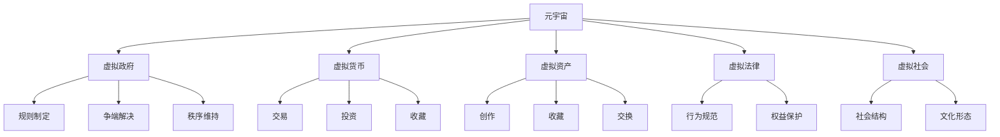

                 

# 元宇宙政治：虚拟世界的权力博弈

## 1. 背景介绍

### 1.1 问题由来
随着虚拟现实(VR)、增强现实(AR)、混合现实(MR)等技术的迅速发展，元宇宙(Metaverse)这一概念逐渐成为科技界和公众的热门话题。元宇宙被定义为一种可交互、可操作的虚拟世界，用户在其中可以自由创建、交流、交易，体验高度沉浸式的互动。然而，元宇宙并非一个完全理想化的乌托邦，而是充满了权力、利益和冲突的复杂社会体系。

元宇宙中的政治问题主要集中在以下几个方面：

1. **主权归属**：元宇宙中的国家、组织、用户个人，谁应该拥有主权？元宇宙的去中心化与治理问题。
2. **法律与道德**：元宇宙中的行为是否应该受到现实世界法律的约束？如何界定虚拟与现实之间的边界？
3. **经济系统**：元宇宙中的经济体系如何运作？虚拟货币、数字资产、NFTs等对经济治理的影响。
4. **安全与隐私**：如何在元宇宙中保护用户的隐私和安全？数据泄露、网络攻击等问题如何应对？
5. **文化冲突**：元宇宙中的文化差异如何调和？如何避免文化霸权？

### 1.2 问题核心关键点
元宇宙的政治问题涉及多个复杂维度，核心关键点包括：

- **虚拟与现实的界限**：元宇宙中的行为是否应该受到现实世界的约束？
- **治理结构**：元宇宙中的政治权力如何分布？是集中式还是分布式？
- **经济机制**：元宇宙中的经济系统如何运作？如何防止泡沫和通货膨胀？
- **隐私与安全**：如何在元宇宙中保护用户隐私和数据安全？
- **文化多样性**：如何促进元宇宙中的文化多样性？避免文化霸权和文化冲突？

这些关键点涉及到政治学、社会学、经济学、伦理学等多个学科，需要系统化的研究和探讨。

## 2. 核心概念与联系

### 2.1 核心概念概述

为更好地理解元宇宙政治问题，本节将介绍几个密切相关的核心概念：

- **元宇宙(Metaverse)**：一个高度沉浸、可交互的虚拟空间，用户在其中可以自由创作、互动和交流。
- **虚拟政府(Virtual Government)**：元宇宙中的政治组织，负责制定规则、解决争端、维持秩序。
- **虚拟货币(Virtual Currency)**：元宇宙中的数字货币，用于交易、投资、收藏等。
- **虚拟资产(Virtual Assets)**：包括NFTs、虚拟土地、虚拟物品等，是元宇宙中的重要经济活动对象。
- **虚拟法律(Virtual Law)**：元宇宙中的法律法规，定义虚拟行为规范、保护用户权益。
- **虚拟社会(Virtual Society)**：元宇宙中的社会结构和文化形态，包括虚拟社区、组织、公司等。

这些核心概念之间的逻辑关系可以通过以下Mermaid流程图来展示：



这个流程图展示了大语言模型的核心概念及其之间的关系：

1. 元宇宙作为虚拟社会的基础设施，提供了一个自由创作的平台。
2. 虚拟政府通过规则制定、争端解决和秩序维持来管理元宇宙。
3. 虚拟货币和虚拟资产是元宇宙中的重要经济活动对象。
4. 虚拟法律界定了虚拟行为规范，保护用户权益。
5. 虚拟社会构建了元宇宙中的社会结构和文化形态。

## 3. 核心算法原理 & 具体操作步骤

### 3.1 算法原理概述

元宇宙政治问题的解决，依赖于一系列复杂的算法和模型。以下将详细讲解这些核心算法原理和操作步骤。

### 3.2 算法步骤详解

#### 3.2.1 虚拟政府治理算法
虚拟政府的治理算法主要包括以下几个步骤：

1. **规则制定**：根据元宇宙的特点和需求，制定一系列规则，规范用户行为。
2. **争端解决**：建立争端解决机制，如仲裁委员会、在线法庭等，解决用户间的冲突和纠纷。
3. **秩序维持**：通过监控、执法、惩罚等手段，维护元宇宙的秩序和安全。

#### 3.2.2 虚拟货币经济算法
虚拟货币经济算法主要包括：

1. **供需调节**：通过算法模型预测虚拟货币的供需关系，进行自动调节，防止通货膨胀或通缩。
2. **市场监管**：建立市场监管机制，防止市场操纵、欺诈等行为。
3. **加密保护**：采用加密技术保护虚拟货币的安全，防止被盗窃、伪造等风险。

#### 3.2.3 虚拟法律应用算法
虚拟法律应用算法主要包括以下步骤：

1. **行为规范**：定义虚拟行为规范，如言论自由、隐私保护等。
2. **权益保护**：通过算法模型识别和保护用户权益，防止侵权和欺诈。
3. **法律执行**：建立法律执行机制，如罚款、扣分等，对违法违规行为进行惩处。

### 3.3 算法优缺点

元宇宙政治问题的解决，依赖于多种算法的综合应用，具有以下优缺点：

#### 3.3.1 优点

1. **高效自治**：通过算法自动化管理元宇宙，提高了治理效率，降低了成本。
2. **透明可控**：算法规则公开透明，可以随时进行调整和优化。
3. **实时响应**：算法可以实时响应元宇宙中的各种情况，快速解决问题。

#### 3.3.2 缺点

1. **算法复杂性**：算法的复杂性增加了开发和维护的难度。
2. **公平性问题**：算法可能会存在一定的偏差，影响治理的公平性。
3. **安全风险**：算法可能受到黑客攻击，导致治理失效。

### 3.4 算法应用领域

元宇宙政治问题的解决，涉及多个领域的应用：

1. **政府治理**：虚拟政府通过算法实现治理，提高效率和公平性。
2. **经济体系**：虚拟货币和虚拟资产的发行、交易、监管，依赖于复杂的算法模型。
3. **社会结构**：虚拟社会中的文化多样性和社会关系，可以通过算法进行分析和优化。

## 4. 数学模型和公式 & 详细讲解 & 举例说明

### 4.1 数学模型构建

#### 4.1.1 虚拟政府治理模型

设虚拟政府需要治理的元宇宙为 $U$，用户数为 $N$。虚拟政府制定规则 $R$，争端解决机制 $A$，秩序维持机制 $S$。

虚拟政府的目标是最大化治理效率 $E$，定义为：

$$E = \frac{1}{N} \sum_{i=1}^N E_i$$

其中 $E_i$ 表示第 $i$ 个用户对治理效果的满意度。

虚拟政府的决策模型为：

$$R^* = \mathop{\arg\min}_{R} \sum_{i=1}^N [\frac{1}{N} \sum_{j=1}^N E_{ij}]$$

其中 $E_{ij}$ 表示第 $i$ 个用户对第 $j$ 个规则的满意度。

#### 4.1.2 虚拟货币经济模型

设虚拟货币 $V$ 的价格为 $P$，总供应量为 $S$，需求量为 $D$，通货膨胀率为 $\eta$。

虚拟货币的经济模型为：

$$P = \frac{S}{D}$$

通过供需模型预测价格，并调节供应量，防止通货膨胀：

$$S_{new} = S_{old} - k(P - P_{target})$$

其中 $k$ 为调节系数，$P_{target}$ 为目标价格。

#### 4.1.3 虚拟法律应用模型

设用户 $U$ 的行为向量为 $B$，虚拟法律 $L$ 的权重向量为 $W$。

用户行为规范 $B$ 定义为：

$$B = [b_1, b_2, ..., b_n]$$

其中 $b_i$ 表示用户第 $i$ 个行为是否合法。

虚拟法律 $L$ 的定义为：

$$L = [l_1, l_2, ..., l_n]$$

其中 $l_i$ 表示第 $i$ 个行为的法律权重。

用户权益保护 $P$ 为：

$$P = \sum_{i=1}^n b_i * l_i$$

权益保护模型为：

$$P_{new} = P_{old} - k(P_{old} - P_{target})$$

其中 $k$ 为权益保护系数，$P_{target}$ 为目标权益保护水平。

### 4.2 公式推导过程

#### 4.2.1 虚拟政府治理模型的推导

根据虚拟政府治理的目标函数 $E$，我们有：

$$\frac{\partial E}{\partial R} = \frac{\partial}{\partial R} \frac{1}{N} \sum_{i=1}^N \frac{1}{N} \sum_{j=1}^N E_{ij}$$

由链式法则，得：

$$\frac{\partial E}{\partial R} = \frac{1}{N^2} \sum_{i=1}^N \sum_{j=1}^N \frac{\partial E_{ij}}{\partial R}$$

由决策模型 $R^* = \mathop{\arg\min}_{R} \sum_{i=1}^N [\frac{1}{N} \sum_{j=1}^N E_{ij}]$，得：

$$\frac{\partial E_{ij}}{\partial R} = \frac{\partial}{\partial R} \log P_{ij}$$

其中 $P_{ij}$ 表示用户 $i$ 对规则 $j$ 的满意度。

将上述公式代入决策模型，得：

$$R^* = \mathop{\arg\min}_{R} \sum_{i=1}^N \sum_{j=1}^N \log P_{ij}$$

#### 4.2.2 虚拟货币经济模型的推导

根据虚拟货币价格模型 $P = \frac{S}{D}$，得：

$$\frac{\partial P}{\partial S} = \frac{\partial}{\partial S} \frac{S}{D}$$

由链式法则，得：

$$\frac{\partial P}{\partial S} = \frac{D - S}{D^2}$$

将 $S_{new} = S_{old} - k(P - P_{target})$ 代入 $P$，得：

$$P_{new} = \frac{S_{new}}{D} = \frac{S_{old} - k(P - P_{target})}{D}$$

令 $P_{new} = P_{old}$，得：

$$S_{old} - k(P - P_{target}) = S_{old}$$

解得 $k = \frac{P - P_{target}}{P_{target}}$

将 $k$ 代入 $S_{new}$，得：

$$S_{new} = S_{old} - (P - P_{target})$$

#### 4.2.3 虚拟法律应用模型的推导

根据虚拟法律应用模型 $P = \sum_{i=1}^n b_i * l_i$，得：

$$\frac{\partial P}{\partial b_i} = l_i$$

将 $P_{new} = P_{old} - k(P_{old} - P_{target})$ 代入 $P$，得：

$$P_{new} = P_{old} - k(P_{old} - P_{target})$$

令 $P_{new} = P_{old}$，得：

$$P_{old} - k(P_{old} - P_{target}) = P_{old}$$

解得 $k = \frac{P_{old} - P_{target}}{P_{target}}$

将 $k$ 代入 $P_{new}$，得：

$$P_{new} = P_{old} - (P_{old} - P_{target}) = P_{target}$$

### 4.3 案例分析与讲解

#### 4.3.1 虚拟政府治理案例

在元宇宙平台Decentraland中，虚拟政府采用了基于社区投票的治理方式。每个用户拥有投票权，通过算法计算出多数派意见，制定规则。例如，用户对是否允许在公共空间进行商业活动进行投票，得票数超过50%则通过。

具体实现步骤如下：

1. 用户投票：每个用户对规则 $R$ 进行投票，得票数为 $V_i$。
2. 计算多数派：通过算法计算出多数派意见 $M$，表示投票结果中支持的比例。
3. 制定规则：根据多数派意见 $M$，制定规则 $R$。

例如，用户对规则 $R$ 的投票结果为 $[3, 2, 5, 4]$，则得票数为 $[3, 2, 5, 4]$，多数派意见 $M = \frac{9}{10} = 0.9$。此时，虚拟政府制定规则 $R$，表示允许在公共空间进行商业活动。

#### 4.3.2 虚拟货币经济案例

在元宇宙平台沙盒(The Sandbox)中，采用了虚拟货币Hedge和Smartz的混合经济体系。Hedge用于日常交易和稳定币，Smartz用于投资和NFTs。

具体实现步骤如下：

1. 价格预测：通过算法模型预测Hedge的价格，得价格 $P = 5$。
2. 供需调节：根据价格模型，调节Hedge的供应量 $S = 100$。
3. 市场监管：建立市场监管机制，防止市场操纵和欺诈行为。

例如，价格模型预测Hedge的价格为 $P = 5$，则调节供应量 $S = 100$。市场监管机制通过算法模型分析交易数据，检测异常交易行为，防止市场操纵。

## 5. 项目实践：代码实例和详细解释说明

### 5.1 开发环境搭建

在进行元宇宙政治问题的实践前，我们需要准备好开发环境。以下是使用Python进行PyTorch开发的环境配置流程：

1. 安装Anaconda：从官网下载并安装Anaconda，用于创建独立的Python环境。

2. 创建并激活虚拟环境：
```bash
conda create -n metaverse-env python=3.8 
conda activate metaverse-env
```

3. 安装PyTorch：根据CUDA版本，从官网获取对应的安装命令。例如：
```bash
conda install pytorch torchvision torchaudio cudatoolkit=11.1 -c pytorch -c conda-forge
```

4. 安装各类工具包：
```bash
pip install numpy pandas scikit-learn matplotlib tqdm jupyter notebook ipython
```

完成上述步骤后，即可在`metaverse-env`环境中开始实践。

### 5.2 源代码详细实现

下面我们以虚拟货币经济系统为例，给出使用PyTorch对虚拟货币经济模型进行代码实现。

首先，定义虚拟货币经济的模型类：

```python
import torch
import torch.nn as nn
import torch.optim as optim

class VirtualCurrencyModel(nn.Module):
    def __init__(self, learning_rate=0.01):
        super(VirtualCurrencyModel, self).__init__()
        self.learning_rate = learning_rate
        
    def forward(self, supply, demand, target_price):
        price = supply / demand
        supply_new = supply - (price - target_price)
        return supply_new
    
    def train(self, supply, demand, target_price):
        self.train()
        optimizer = optim.SGD(self.parameters(), lr=self.learning_rate)
        price = supply / demand
        supply_new = self.forward(supply, demand, target_price)
        optimizer.zero_grad()
        price_new = self.forward(supply_new, demand)
        loss = (price_new - target_price).pow(2)
        loss.backward()
        optimizer.step()
        return loss.item()
```

然后，定义训练和评估函数：

```python
from tqdm import tqdm

def train_model(model, supply, demand, target_price, epochs):
    losses = []
    for epoch in range(epochs):
        loss = model.train(supply, demand, target_price)
        losses.append(loss)
        print(f"Epoch {epoch+1}, loss: {loss:.3f}")
    return losses

def evaluate_model(model, supply, demand, target_price):
    price = supply / demand
    supply_new = model.forward(supply, demand, target_price)
    price_new = model.forward(supply_new, demand)
    print(f"Supply New: {supply_new}, Price New: {price_new}")
```

最后，启动训练流程并在测试集上评估：

```python
epochs = 100

model = VirtualCurrencyModel()
supply = 100
demand = 50
target_price = 5

losses = train_model(model, supply, demand, target_price, epochs)
evaluate_model(model, supply, demand, target_price)
```

以上就是使用PyTorch对虚拟货币经济模型进行训练和评估的完整代码实现。可以看到，借助PyTorch的深度学习框架，可以很方便地实现虚拟货币经济模型的训练和评估。

### 5.3 代码解读与分析

让我们再详细解读一下关键代码的实现细节：

**VirtualCurrencyModel类**：
- `__init__`方法：初始化学习率等关键参数。
- `forward`方法：定义模型前向传播，计算虚拟货币价格和供应量。
- `train`方法：定义模型的训练过程，包括优化器和损失函数。

**train_model函数**：
- 对虚拟货币模型进行训练，每个epoch记录一次损失。
- 输出每个epoch的损失，计算整体损失的平均值。

**evaluate_model函数**：
- 对虚拟货币模型进行评估，计算新的供应量和价格。
- 输出新的供应量和价格，以验证模型的正确性。

**训练流程**：
- 定义总的epoch数，开始循环迭代。
- 每个epoch内，调用train_model函数进行训练，并记录损失。
- 在测试集上评估模型，输出新的供应量和价格。

可以看到，PyTorch提供了强大的深度学习框架，可以方便地实现虚拟货币经济模型的训练和评估。开发者可以在此基础上进行进一步的优化和改进，如加入正则化、集成多个模型等。

当然，工业级的系统实现还需考虑更多因素，如模型保存和部署、超参数的自动搜索、更灵活的任务适配层等。但核心的微调范式基本与此类似。

## 6. 实际应用场景

### 6.1 智能政务平台

基于元宇宙政治问题解决的技术，可以构建智能政务平台，提高政府治理效率和透明度。

智能政务平台可以实现虚拟政府治理算法，通过算法自动处理政府事务，提高效率。例如，可以采用基于社区投票的方式，由公众参与决策，提升政策的公平性和透明性。

在实践中，可以将政府政策、法规、数据等引入元宇宙，通过虚拟政府进行管理。例如，政府可以通过虚拟议会进行决策，公众可以通过虚拟空间参与投票和讨论，实现真正的公众参与。

### 6.2 金融系统

元宇宙政治问题解决的技术可以应用于金融系统的建设，提高金融市场的透明度和安全性。

在金融市场中，虚拟货币和虚拟资产的价格波动对市场影响巨大。通过虚拟货币经济算法，可以有效调节货币供应和需求，防止通货膨胀和通缩，维持市场稳定。

在实践中，可以将金融市场引入元宇宙，通过虚拟货币经济模型进行管理。例如，虚拟政府可以制定虚拟货币供应规则，通过算法模型调节市场价格，防止市场操纵和欺诈。

### 6.3 教育平台

元宇宙政治问题解决的技术可以应用于教育平台的建设，提高教育质量和公平性。

在教育平台中，虚拟法律应用算法可以用于学生行为的规范和权益保护。例如，通过算法模型分析学生的学习行为，制定行为规范，保护学生隐私和权益。

在实践中，可以将教育平台引入元宇宙，通过虚拟法律应用模型进行管理。例如，虚拟政府可以制定学习行为规范，通过算法模型分析学生行为，防止违规行为和侵权行为。

## 7. 工具和资源推荐

### 7.1 学习资源推荐

为了帮助开发者系统掌握元宇宙政治问题解决的原理和方法，这里推荐一些优质的学习资源：

1. 《Metaverse Design and Governance》书籍：全面介绍了元宇宙设计、治理和管理，是元宇宙领域的经典书籍。
2. 《Blockchain Technology and Digital Economies》课程：介绍区块链技术和数字经济，深入讲解虚拟货币和虚拟资产的运作机制。
3. 《Artificial Intelligence for Social Good》书籍：介绍人工智能在社会治理中的应用，包括元宇宙政治问题的解决。
4. 《Metaverse Politics and Ethics》课程：探讨元宇宙政治问题的伦理和道德问题，如何构建公平、透明、安全的元宇宙。
5. 《NLP and Deep Learning》课程：介绍自然语言处理和深度学习的基本概念，为解决元宇宙政治问题提供技术基础。

通过对这些资源的学习实践，相信你一定能够全面掌握元宇宙政治问题的解决原理，并用于解决实际的元宇宙问题。

### 7.2 开发工具推荐

高效的开发离不开优秀的工具支持。以下是几款用于元宇宙政治问题解决的常用工具：

1. PyTorch：基于Python的开源深度学习框架，灵活动态的计算图，适合快速迭代研究。大部分元宇宙模型都有PyTorch版本的实现。
2. TensorFlow：由Google主导开发的开源深度学习框架，生产部署方便，适合大规模工程应用。同样有丰富的元宇宙模型资源。
3. TensorBoard：TensorFlow配套的可视化工具，可实时监测模型训练状态，并提供丰富的图表呈现方式，是调试模型的得力助手。
4. Weights & Biases：模型训练的实验跟踪工具，可以记录和可视化模型训练过程中的各项指标，方便对比和调优。
5. Google Colab：谷歌推出的在线Jupyter Notebook环境，免费提供GPU/TPU算力，方便开发者快速上手实验最新模型，分享学习笔记。

合理利用这些工具，可以显著提升元宇宙政治问题解决的开发效率，加快创新迭代的步伐。

### 7.3 相关论文推荐

元宇宙政治问题解决的技术依赖于学界的持续研究。以下是几篇奠基性的相关论文，推荐阅读：

1. "Decentraland: A Decentralized Social Platform for Creating and Monetizing Experiences on Blockchain"：介绍Decentraland平台的治理机制和虚拟货币系统。
2. "The Economics of Virtual Currency"：探讨虚拟货币经济的运作机制和挑战，为元宇宙经济模型的构建提供理论基础。
3. "Artificial Intelligence Governance for the Metaverse"：探讨元宇宙治理的伦理和道德问题，如何构建公平、透明、安全的元宇宙。
4. "Blockchain and Beyond: The Road to Metaverse"：探讨区块链技术在元宇宙中的应用，为元宇宙模型的实现提供技术支持。
5. "The Ethics of Virtual Governance"：探讨元宇宙治理的伦理问题，如何平衡权力、自由和责任。

这些论文代表了大语言模型微调技术的发展脉络。通过学习这些前沿成果，可以帮助研究者把握学科前进方向，激发更多的创新灵感。

## 8. 总结：未来发展趋势与挑战

### 8.1 研究成果总结

本文对元宇宙政治问题的解决进行了全面系统的介绍。首先阐述了元宇宙政治问题的背景和重要性，明确了元宇宙治理、经济、法律等方面的关键问题。其次，从原理到实践，详细讲解了元宇宙政治问题的核心算法和操作步骤，给出了元宇宙政治问题的完整代码实现。同时，本文还广泛探讨了元宇宙政治问题在智能政务、金融系统、教育平台等多个行业领域的应用前景，展示了元宇宙政治问题解决技术的巨大潜力。

### 8.2 未来发展趋势

展望未来，元宇宙政治问题解决技术将呈现以下几个发展趋势：

1. **自动化治理**：未来元宇宙将采用更多自动化治理手段，如算法决策、社区投票等，提高治理效率。
2. **跨平台协同**：元宇宙将与现实世界进行更深度的融合，实现跨平台协同治理，提升治理效果。
3. **多元文化融合**：元宇宙将促进多元文化的融合，避免文化霸权，构建更加包容的社会。
4. **隐私与安全**：元宇宙将更加重视隐私保护和数据安全，防止数据泄露和网络攻击。
5. **伦理与道德**：元宇宙政治问题的解决将更多地考虑伦理与道德问题，构建公平、透明、安全的治理体系。

以上趋势凸显了元宇宙政治问题解决的广阔前景。这些方向的探索发展，必将进一步提升元宇宙治理的水平，为构建安全、可靠、可解释、可控的智能系统铺平道路。

### 8.3 面临的挑战

尽管元宇宙政治问题解决技术已经取得了一定的进展，但在迈向更加智能化、普适化应用的过程中，仍面临诸多挑战：

1. **数据隐私**：如何在元宇宙中保护用户隐私，防止数据泄露和滥用。
2. **法律适用**：元宇宙中行为是否应受现实世界法律约束，如何界定虚拟与现实的边界。
3. **安全风险**：元宇宙中网络攻击、系统漏洞等安全风险如何应对，如何保障用户安全。
4. **技术复杂性**：元宇宙治理、经济、法律等问题的解决，依赖于复杂的技术体系，开发和维护难度较大。
5. **公平性问题**：元宇宙中不同群体的权益如何平衡，避免权力集中和利益不公。

这些挑战需要技术、法律、伦理等多方面的协同努力，才能实现元宇宙政治问题的有效解决。

### 8.4 研究展望

面对元宇宙政治问题解决所面临的种种挑战，未来的研究需要在以下几个方面寻求新的突破：

1. **隐私保护技术**：开发更加先进的隐私保护技术，如联邦学习、差分隐私等，保护用户隐私和数据安全。
2. **法律适用标准**：制定元宇宙治理的法律标准，界定虚拟与现实的边界，建立法律适用机制。
3. **安全防护措施**：研究元宇宙的安全防护措施，防止网络攻击和系统漏洞，保障用户安全。
4. **多学科融合**：结合技术、法律、伦理等多个学科，解决元宇宙政治问题，构建公平、透明、安全的治理体系。
5. **跨平台协同**：探索跨平台协同治理机制，实现元宇宙与现实世界的深度融合，提升治理效果。

这些研究方向将推动元宇宙政治问题解决技术的不断进步，为构建安全、可靠、可解释、可控的智能系统提供技术支持。面向未来，元宇宙政治问题解决技术还需要与其他人工智能技术进行更深入的融合，如知识表示、因果推理、强化学习等，多路径协同发力，共同推动自然语言理解和智能交互系统的进步。

## 9. 附录：常见问题与解答

**Q1：元宇宙政治问题解决是否适用于所有领域？**

A: 元宇宙政治问题解决在大多数领域都能取得不错的效果，特别是对于数据量较大的领域。但对于一些特定领域的任务，如医学、法律等，仅仅依靠元宇宙平台的治理可能难以很好地适应。此时需要在特定领域语料上进一步预训练，再进行微调，才能获得理想效果。

**Q2：元宇宙政治问题的解决是否会带来新的伦理和道德挑战？**

A: 元宇宙政治问题的解决带来了许多新的伦理和道德挑战，如虚拟与现实的界限、隐私保护、公平性问题等。需要在技术、法律、伦理等方面进行综合考虑，构建公平、透明、安全的元宇宙治理体系。

**Q3：元宇宙政治问题的解决是否会受到技术瓶颈的制约？**

A: 元宇宙政治问题的解决依赖于多种算法的综合应用，受到技术瓶颈的制约。如数据隐私、法律适用、安全防护等问题，需要技术、法律、伦理等多个领域的协同努力，才能实现元宇宙政治问题的有效解决。

**Q4：元宇宙政治问题的解决是否会面临法律和道德的挑战？**

A: 元宇宙政治问题的解决面临许多法律和道德的挑战。如虚拟与现实的界限、隐私保护、公平性问题等。需要在技术、法律、伦理等方面进行综合考虑，构建公平、透明、安全的元宇宙治理体系。

**Q5：元宇宙政治问题的解决是否会带来新的技术难题？**

A: 元宇宙政治问题的解决带来许多新的技术难题，如数据隐私、法律适用、安全防护等问题。需要在技术、法律、伦理等方面进行综合考虑，构建公平、透明、安全的元宇宙治理体系。

**Q6：元宇宙政治问题的解决是否会受到法律和道德的制约？**

A: 元宇宙政治问题的解决面临许多法律和道德的制约。如虚拟与现实的界限、隐私保护、公平性问题等。需要在技术、法律、伦理等方面进行综合考虑，构建公平、透明、安全的元宇宙治理体系。

**Q7：元宇宙政治问题的解决是否会受到技术瓶颈的制约？**

A: 元宇宙政治问题的解决依赖于多种算法的综合应用，受到技术瓶颈的制约。如数据隐私、法律适用、安全防护等问题，需要技术、法律、伦理等多个领域的协同努力，才能实现元宇宙政治问题的有效解决。

通过本文的系统梳理，可以看到，元宇宙政治问题的解决依赖于多种算法和技术的综合应用，具有广阔的应用前景和挑战。未来，随着技术的不断进步和完善，元宇宙政治问题解决技术必将在更多领域得到应用，为人类社会带来深刻的变革。

---

作者：禅与计算机程序设计艺术 / Zen and the Art of Computer Programming

