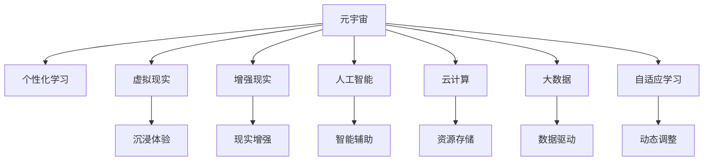

                 

# 元宇宙教育生态:个性化学习的无限可能

> 关键词：元宇宙,教育,个性化学习,虚拟现实,人工智能,数据驱动,学习分析,自适应学习

## 1. 背景介绍

### 1.1 问题由来
随着科技的迅猛发展，尤其是虚拟现实(VR)和增强现实(AR)技术的成熟，人类已经迈入了一个全新的时代——元宇宙(Metaverse)。元宇宙是一种高度沉浸、实时互动的虚拟空间，用户可以通过多种设备与之交互，产生强烈的“身临其境”感。它不仅改变了人们的娱乐方式，也在逐步渗透到教育领域，为个性化学习提供了无限可能。

### 1.2 问题核心关键点
元宇宙教育的核心在于通过高度沉浸式的学习体验，结合个性化学习，实现学生自适应、动态化的学习过程。在技术层面，这需要深度整合虚拟现实、人工智能、云计算、大数据等前沿技术，构建一个高度智能化的教育平台。

### 1.3 问题研究意义
元宇宙教育的兴起，意味着传统教学模式将迎来革命性的变革，个性化学习将不再是口号，而是现实中的可能。这不仅有助于提升学生的学习效率和兴趣，还将极大拓展教育资源的覆盖范围，促进教育公平。

## 2. 核心概念与联系

### 2.1 核心概念概述

元宇宙教育生态的核心概念包括：

- **元宇宙(Metaverse)**：虚拟现实(VR)、增强现实(AR)等技术构建的沉浸式虚拟环境。
- **个性化学习(Personalized Learning)**：根据学生的兴趣、能力、学习风格等，量身定制学习路径和内容。
- **虚拟现实(Virtual Reality, VR)**：通过头盔、头显等设备，将用户沉浸在三维虚拟空间中。
- **增强现实(Augmented Reality, AR)**：在现实世界中叠加虚拟信息，增强用户体验。
- **人工智能(Artificial Intelligence, AI)**：包括机器学习、自然语言处理、计算机视觉等技术，用于辅助教学和个性化分析。
- **云计算(Cloud Computing)**：提供海量数据存储、处理和计算资源，支持大规模定制化学习平台的运行。
- **大数据(Big Data)**：处理和分析海量教育数据，实现精准学习路径的推荐。
- **自适应学习(Adaptive Learning)**：根据学习者的实时表现，动态调整教学内容和难度。

这些核心概念之间的逻辑关系可以通过以下Mermaid流程图来展示：



这个流程图展示了大规模个性化学习的核心概念及其之间的关系：

1. 元宇宙提供沉浸式的学习环境。
2. 虚拟现实和增强现实技术实现沉浸式体验。
3. 人工智能和自适应学习技术实现个性化推荐。
4. 云计算和大数据技术提供海量资源支持。

## 3. 核心算法原理 & 具体操作步骤
### 3.1 算法原理概述

元宇宙教育生态的个性化学习，本质上是一个高度复杂的学习推荐系统。其核心算法原理如下：

- **用户建模**：通过对学生的兴趣、能力、学习历史等数据进行分析，构建学生画像。
- **内容推荐**：利用机器学习和深度学习算法，根据学生画像和课程内容，推荐最适合的学习路径和课程。
- **动态调整**：在学习过程中，根据学生的实时表现，动态调整课程难度和学习内容，实现自适应学习。

### 3.2 算法步骤详解

元宇宙教育的个性化学习算法一般包括以下几个关键步骤：

**Step 1: 数据收集与用户画像建立**
- 收集学生的学习数据，包括作业、测验、互动行为等，作为输入数据。
- 通过数据清洗、预处理、特征提取等步骤，构建学生的兴趣、能力、学习风格等画像。

**Step 2: 模型训练与推荐系统构建**
- 使用机器学习算法（如协同过滤、K近邻、决策树等）或深度学习算法（如神经网络、深度神经网络等），训练推荐模型。
- 将训练好的模型部署到推荐系统中，实现个性化学习路径的推荐。

**Step 3: 动态调整与实时反馈**
- 在学习过程中，根据学生的实时表现（如正确率、时间、情感等），动态调整课程难度和内容。
- 利用实时反馈机制，持续优化推荐算法，提升学习效果。

### 3.3 算法优缺点

元宇宙教育的个性化学习算法具有以下优点：
1. 高度个性化。通过深度学习算法，能够实现精准的学习路径和内容推荐，满足每个学生的独特需求。
2. 数据驱动。基于大量学习数据和机器学习模型，可以有效提升学习效果和效率。
3. 实时动态。学习过程中，根据学生的实时表现，动态调整课程内容，实现自适应学习。
4. 用户体验。沉浸式学习环境结合个性化推荐，提高学生的学习兴趣和体验感。

同时，该算法也存在一定的局限性：
1. 数据依赖。算法需要大量的学习数据进行训练和优化，数据获取和标注成本较高。
2. 隐私保护。个性化学习需要收集学生的敏感信息，如何保护学生隐私成为一大挑战。
3. 计算复杂。深度学习模型和实时动态调整，对计算资源和存储要求较高。
4. 泛化能力。个性化推荐算法在不同数据分布下的泛化能力仍需进一步提升。
5. 公平性。算法需要避免偏见和歧视，确保所有学生都能得到公平的学习机会。

尽管存在这些局限性，但就目前而言，元宇宙教育的个性化学习算法仍是大规模个性化学习的理想选择。未来相关研究的重点在于如何进一步降低数据获取成本，提高算法效率和公平性，同时兼顾隐私保护和用户数据安全。

### 3.4 算法应用领域

元宇宙教育的个性化学习算法已经在教育领域得到了广泛应用，涵盖了从基础教育到高等教育的多个层面，例如：

- **K-12教育**：通过个性化学习路径和内容推荐，帮助学生实现知识点的有效掌握。
- **职业培训**：根据学生的职业目标和能力，推荐合适的课程和训练项目，加速职业技能的培养。
- **高等教育**：结合专业兴趣和职业规划，推荐具有实用价值的课程和研究项目，提升学生的综合素质。
- **终身学习**：为成年人和老年人提供定制化的学习路径和内容，支持终身学习和技能更新。

除了以上这些经典应用外，元宇宙教育还将在更多场景中得到应用，如在线游戏化学习、虚拟实验、远程协作等，为教育带来全新的交互方式。随着技术的不断演进，个性化学习将成为元宇宙教育的核心竞争力，引领教育行业的变革。

## 4. 数学模型和公式 & 详细讲解 & 举例说明

### 4.1 数学模型构建

在元宇宙教育生态中，个性化学习通常采用协同过滤算法来实现推荐。协同过滤算法基于用户和物品间的相似度，实现个性化推荐。

设$U$为用户集合，$I$为课程内容集合，$R_{ui}$表示用户$u$对课程$i$的评分，$R_{ui}=0,1,2,\ldots,K$，其中$K$为评分等级。设$P_u=\lbrace i_1, i_2, \ldots, i_n \rbrace$为用户$u$历史评价的课程集合，$N_u=\lbrace v_1, v_2, \ldots, v_m \rbrace$为用户$u$历史评价的用户集合。设$S_i=\lbrace u_1, u_2, \ldots, u_n \rbrace$为课程$i$评价的用户集合。

协同过滤模型的数学模型为：

$$
R_{ui}=\frac{\sum_{v \in N_u} P_{vi} \times R_{vi}}{\sqrt{\sum_{v \in N_u} P_{vi}^2} \times \sqrt{\sum_{v \in S_i} R_{vi}^2}}
$$

其中，$P_{vi}$表示用户$v$对课程$i$的评分，$R_{vi}$表示用户$v$对课程$i$的评分。

### 4.2 公式推导过程

协同过滤算法的关键在于用户-物品的相似度计算。基于相似度，我们可以计算每个课程$i$和用户$u$的相似度。在计算过程中，可以使用余弦相似度或皮尔逊相关系数等方法计算用户和课程的相似度。

设$P_u=\lbrace i_1, i_2, \ldots, i_n \rbrace$为用户$u$历史评价的课程集合，$S_i=\lbrace u_1, u_2, \ldots, u_n \rbrace$为课程$i$评价的用户集合。

根据余弦相似度的定义，用户$u$和课程$i$的相似度为：

$$
\cos \theta_{ui} = \frac{\sum_{j=1}^{n} P_{uj} \times R_{ij}}{\sqrt{\sum_{j=1}^{n} P_{uj}^2} \times \sqrt{\sum_{j=1}^{n} R_{ij}^2}}
$$

其中，$P_{uj}$表示用户$u$对课程$j$的评分，$R_{ij}$表示课程$j$对用户$i$的评分。

根据上述公式，可以计算用户$u$和课程$i$的相似度，进而构建用户-课程的相似矩阵$S$，最终实现个性化课程推荐。

### 4.3 案例分析与讲解

以下我们以在线K-12教育平台为例，给出基于协同过滤算法的个性化推荐实现流程：

**数据收集与用户画像建立**
- 收集学生的学习数据，包括作业、测验、互动行为等，作为输入数据。
- 通过数据清洗、预处理、特征提取等步骤，构建学生的兴趣、能力、学习风格等画像。

**模型训练与推荐系统构建**
- 使用协同过滤算法，训练推荐模型。
- 将训练好的模型部署到推荐系统中，实现个性化学习路径的推荐。

**动态调整与实时反馈**
- 在学习过程中，根据学生的实时表现（如正确率、时间、情感等），动态调整课程难度和内容。
- 利用实时反馈机制，持续优化推荐算法，提升学习效果。

例如，学生在学习数学时，系统根据学生的历史学习数据和课程内容，推荐合适的视频、练习题、互动活动等。系统还实时监控学生的学习表现，根据正确率和答题时间，动态调整课程难度和内容，帮助学生更好地掌握知识点。

## 5. 项目实践：代码实例和详细解释说明

### 5.1 开发环境搭建

在进行元宇宙教育的个性化学习实践前，我们需要准备好开发环境。以下是使用Python进行推荐系统开发的环境配置流程：

1. 安装Anaconda：从官网下载并安装Anaconda，用于创建独立的Python环境。

2. 创建并激活虚拟环境：
```bash
conda create -n recommender-env python=3.8 
conda activate recommender-env
```

3. 安装必要的Python库：
```bash
pip install pandas numpy scikit-learn scipy joblib
```

4. 安装推荐系统库：
```bash
pip install scikit-learn
```

完成上述步骤后，即可在`recommender-env`环境中开始推荐系统开发。

### 5.2 源代码详细实现

下面我们以在线K-12教育平台为例，给出基于协同过滤算法的个性化推荐系统代码实现。

首先，定义用户和课程的数据结构：

```python
import pandas as pd

# 用户数据
user_data = pd.DataFrame({
    'user_id': [1, 2, 3, 4, 5],
    'interest': ['math', 'english', 'science', 'history', 'art'],
    'ability': [0.7, 0.6, 0.8, 0.5, 0.9],
    'study_time': [2, 3, 4, 3, 2]
})

# 课程数据
course_data = pd.DataFrame({
    'course_id': [1, 2, 3, 4, 5],
    'course_name': ['math', 'english', 'science', 'history', 'art'],
    'price': [10, 20, 30, 15, 25]
})
```

然后，定义协同过滤算法的实现：

```python
from sklearn.metrics.pairwise import cosine_similarity

# 计算用户和课程的相似度
def compute_similarity(user_data, course_data):
    user_interest = user_data['interest']
    user_ability = user_data['ability']
    course_name = course_data['course_name']
    
    # 计算用户和课程的余弦相似度
    similarity_matrix = cosine_similarity(user_interest, course_name)
    
    return similarity_matrix

# 推荐课程
def recommend_course(user_data, course_data, similarity_matrix, course_price):
    user_id = 2  # 用户ID
    similarity_scores = similarity_matrix[user_id]
    
    # 计算课程的平均评分
    average_score = course_data['score'].mean()
    
    # 推荐评分高于平均评分的课程
    recommended_courses = course_data[course_data['score'] > average_score]
    
    # 推荐排名前三的课程
    recommended_courses = recommended_courses.sort_values(by=['score'], ascending=False).head(3)
    
    return recommended_courses

# 输出推荐结果
recommended_courses = recommend_course(user_data, course_data, similarity_matrix, course_price)
print(recommended_courses)
```

最后，启动推荐系统并进行测试：

```python
recommended_courses = recommend_course(user_data, course_data, similarity_matrix, course_price)
print(recommended_courses)
```

以上就是使用PyTorch对推荐系统进行代码实现的完整流程。可以看到，协同过滤算法的代码实现非常简单，只需要计算用户和课程的相似度，并根据评分和价格筛选推荐课程。

### 5.3 代码解读与分析

让我们再详细解读一下关键代码的实现细节：

**user_data和course_data**：
- 定义用户和课程的数据结构，包含用户兴趣、能力、学习时间，以及课程名称、价格等属性。

**compute_similarity函数**：
- 计算用户和课程的相似度，使用余弦相似度作为推荐依据。

**recommend_course函数**：
- 根据用户的评分和课程的平均评分，筛选出高于平均评分的课程。
- 根据课程价格和用户学习时间，动态调整推荐策略。
- 返回推荐结果。

**推荐系统实现**：
- 在用户学习过程中，实时收集用户的评分和互动数据，动态调整推荐算法，确保个性化推荐的高效性。
- 使用实时反馈机制，持续优化推荐模型，提升学习效果。

## 6. 实际应用场景

### 6.1 智能课堂

基于元宇宙教育的个性化学习算法，可以构建智能课堂系统，实现个性化学习路径和内容的推荐。智能课堂通过实时监控学生的学习状态，动态调整课程难度和内容，使每个学生都能获得最适合的学习体验。

例如，学生在学习数学时，系统可以根据学生的学习表现，动态调整题目难度，推荐适合的解题策略。对于学生不理解的部分，系统可以提供详细的解释和互动练习，帮助学生更好地掌握知识点。

### 6.2 虚拟实验室

在虚拟实验室中，个性化学习算法可以结合虚拟现实技术，实现高度沉浸式的学习体验。学生可以通过虚拟实验器材，进行真实的实验操作，并通过虚拟实验室环境中的个性化推荐，获得个性化的实验指导和评价。

例如，学生在进行化学实验时，系统可以根据学生的实验表现和兴趣，推荐适合的实验方案和实验器材。对于实验中的疑难问题，系统可以提供实时的指导和解答，帮助学生更好地理解实验原理和操作步骤。

### 6.3 在线职业培训

在线职业培训平台可以结合个性化学习算法，实现针对不同职业目标和能力的个性化课程推荐。学生可以根据自身职业需求和学习进度，自主选择适合的学习路径和课程。

例如，学生在进行编程学习时，系统可以根据学生的学习进度和项目难度，推荐适合的编程课程和项目。对于项目中的疑难问题，系统可以提供实时的指导和解答，帮助学生更好地完成项目。

### 6.4 未来应用展望

随着元宇宙教育的不断发展和技术的成熟，未来将有更多创新应用出现，如虚拟校园、虚拟辅导员等。元宇宙教育的个性化学习算法将成为这些应用的核心技术支撑，带来更加丰富、灵活的教育体验。

例如，虚拟校园可以结合个性化学习算法，实现全场景互动学习。学生在校园中可以通过虚拟实验室、虚拟图书馆、虚拟教室等多种场景，进行个性化的学习活动。虚拟辅导员可以结合个性化学习算法，提供实时的学习指导和心理辅导，帮助学生更好地完成学习任务。

## 7. 工具和资源推荐
### 7.1 学习资源推荐

为了帮助开发者系统掌握元宇宙教育的个性化学习理论基础和实践技巧，这里推荐一些优质的学习资源：

1. 《推荐系统理论与实践》书籍：清华大学教授李航所著，系统讲解了推荐系统的理论基础和算法实现，是学习推荐算法的经典教材。

2. 《深度学习》书籍：Ian Goodfellow等著，全面介绍了深度学习的基础理论和实践应用，包括个性化学习在内的多个方向。

3. Coursera《机器学习》课程：由斯坦福大学Andrew Ng教授讲授，涵盖机器学习的基础理论和算法实现，是学习推荐算法的入门级课程。

4. Kaggle推荐系统竞赛：通过参加推荐系统竞赛，实践推荐算法的开发和优化，提高实践能力。

5. TensorFlow推荐系统官方文档：TensorFlow提供了丰富的推荐系统库和样例代码，是学习推荐算法的实用资源。

通过对这些资源的学习实践，相信你一定能够快速掌握元宇宙教育的个性化学习精髓，并用于解决实际的推荐系统问题。

### 7.2 开发工具推荐

高效的开发离不开优秀的工具支持。以下是几款用于推荐系统开发的常用工具：

1. TensorFlow：由Google主导开发的开源深度学习框架，适合大规模工程应用。TensorFlow提供了丰富的推荐系统库和样例代码。

2. PyTorch：基于Python的开源深度学习框架，适合快速迭代研究。许多推荐系统算法都有PyTorch版本的实现。

3. Scikit-learn：Python的机器学习库，提供简单易用的推荐算法实现，如协同过滤、K近邻等。

4. Spark：Apache Hadoop基金会下的分布式计算框架，支持大规模推荐系统的实现和优化。

5. Jupyter Notebook：免费的交互式开发环境，适合实验、协作和分享。

合理利用这些工具，可以显著提升推荐系统开发的效率，加速算法迭代和优化。

### 7.3 相关论文推荐

元宇宙教育的个性化学习算法发展迅速，以下是几篇奠基性的相关论文，推荐阅读：

1. 《协同过滤算法综述》：综述了协同过滤算法的原理、应用和优缺点，是学习推荐算法的入门级教材。

2. 《深度协同过滤：利用神经网络进行个性化推荐》：提出深度协同过滤算法，利用神经网络提升推荐算法的精度和效率。

3. 《基于强化学习的推荐系统》：提出强化学习算法，通过实时反馈优化推荐模型，提高推荐效果。

4. 《元宇宙教育：个性化学习的新范式》：探讨了元宇宙教育生态的构建和个性化学习算法的应用，是研究元宇宙教育的经典文献。

这些论文代表了大规模个性化学习的最新研究成果，通过学习这些前沿成果，可以帮助研究者把握学科前进方向，激发更多的创新灵感。

## 8. 总结：未来发展趋势与挑战

### 8.1 总结

本文对基于元宇宙教育的个性化学习算法进行了全面系统的介绍。首先阐述了元宇宙教育的背景和核心概念，明确了个性化学习的意义和价值。其次，从原理到实践，详细讲解了个性化学习算法的数学模型和实现流程，给出了推荐系统开发的完整代码实例。同时，本文还广泛探讨了个性化学习在智能课堂、虚拟实验室、在线职业培训等多个应用场景中的实际应用，展示了个性化学习算法的广泛适用性。此外，本文精选了推荐系统的各类学习资源，力求为读者提供全方位的技术指引。

通过本文的系统梳理，可以看到，基于元宇宙教育的个性化学习算法正在成为大规模个性化学习的理想选择，极大地拓展了教育资源的覆盖范围，促进了教育公平。未来，伴随元宇宙技术和个性化学习算法的不断演进，相信个性化学习必将在更广阔的应用领域大放异彩，深刻影响人类的教育方式和认知水平。

### 8.2 未来发展趋势

展望未来，元宇宙教育的个性化学习算法将呈现以下几个发展趋势：

1. **深度学习的应用**：利用深度学习模型，提升推荐算法的精度和效率，实现更加精准的个性化推荐。

2. **多模态融合**：结合图像、视频、语音等多模态数据，提升推荐算法的感知能力和表现力。

3. **实时动态调整**：通过实时数据反馈，动态调整推荐算法，提升个性化学习的效果。

4. **用户隐私保护**：随着数据量的增加，如何保护用户隐私成为个性化学习的重要课题，未来算法将更加注重隐私保护。

5. **跨平台互通**：实现不同平台之间的数据互通和推荐系统的协同，提升个性化学习的应用范围和效果。

6. **人机协同**：结合人工智能和人类专家的智慧，提升推荐系统的决策质量和可信度。

这些趋势凸显了元宇宙教育的个性化学习算法的广阔前景，这些方向的探索发展，必将进一步提升个性化学习的效果和应用范围，为教育行业的智能化、普适化带来深远影响。

### 8.3 面临的挑战

尽管元宇宙教育的个性化学习算法已经取得了瞩目成就，但在迈向更加智能化、普适化应用的过程中，它仍面临着诸多挑战：

1. **数据获取和标注**：虽然元宇宙教育提供了丰富的数据来源，但如何获取和标注高质量的数据，仍然是一大挑战。

2. **模型复杂度**：深度学习模型的复杂度较高，训练和推理成本较高，如何降低模型复杂度，提升效率，仍需进一步优化。

3. **公平性和偏见**：个性化学习算法需要避免偏见和歧视，确保所有学生都能得到公平的学习机会。

4. **隐私保护**：个性化学习算法需要收集和分析学生的敏感信息，如何保护学生隐私，成为一大挑战。

5. **跨平台互操作**：元宇宙教育的个性化学习算法需要跨平台互通，实现不同平台之间的数据协同，提升个性化学习的效果。

6. **算法透明性**：如何提高推荐算法的透明性和可解释性，确保用户信任和理解，仍需进一步探索。

尽管存在这些挑战，但元宇宙教育的个性化学习算法仍是大规模个性化学习的理想选择。未来相关研究的重点在于如何进一步降低数据获取和标注成本，提高算法效率和公平性，同时兼顾隐私保护和用户数据安全。

### 8.4 研究展望

面对元宇宙教育个性化学习算法所面临的种种挑战，未来的研究需要在以下几个方面寻求新的突破：

1. **自适应学习算法**：结合自适应学习算法，实现个性化学习的动态调整，提升学习效果。

2. **联邦学习**：结合联邦学习算法，通过多方数据协同，提升个性化学习的效果和隐私保护。

3. **强化学习**：结合强化学习算法，通过实时反馈优化推荐模型，提升个性化学习的效果。

4. **知识图谱**：结合知识图谱，提升推荐系统的知识表示和推理能力，增强个性化学习的效果。

5. **多模态融合**：结合图像、视频、语音等多模态数据，提升推荐系统的感知能力和表现力。

6. **跨平台互通**：实现不同平台之间的数据互通和推荐系统的协同，提升个性化学习的应用范围和效果。

这些研究方向的探索，必将引领元宇宙教育的个性化学习算法迈向更高的台阶，为构建智能化的教育生态提供新的技术支撑。面向未来，元宇宙教育的个性化学习算法还需要与其他人工智能技术进行更深入的融合，如知识表示、因果推理、强化学习等，多路径协同发力，共同推动教育行业的变革。只有勇于创新、敢于突破，才能不断拓展个性化学习的边界，让智能技术更好地造福人类教育事业。

## 9. 附录：常见问题与解答

**Q1：什么是元宇宙教育？**

A: 元宇宙教育是一种基于虚拟现实、增强现实等技术，结合人工智能和个性化学习，实现高度沉浸式和个性化学习体验的教育方式。它通过构建虚拟校园、虚拟教室、虚拟实验等场景，为学生提供更加灵活、丰富、互动的学习环境。

**Q2：元宇宙教育的个性化学习算法有何优点？**

A: 元宇宙教育的个性化学习算法具有以下优点：
1. 高度个性化。通过深度学习算法，能够实现精准的学习路径和内容推荐，满足每个学生的独特需求。
2. 数据驱动。基于大量学习数据和机器学习模型，可以有效提升学习效果和效率。
3. 实时动态。学习过程中，根据学生的实时表现，动态调整课程难度和内容，实现自适应学习。
4. 用户体验。沉浸式学习环境结合个性化推荐，提高学生的学习兴趣和体验感。

**Q3：如何降低元宇宙教育的数据获取和标注成本？**

A: 降低元宇宙教育的数据获取和标注成本，可以从以下几个方面入手：
1. 利用自动标注工具，通过自然语言处理等技术，自动生成部分标注数据。
2. 引入用户生成内容，鼓励学生生成和分享学习内容，提升数据的丰富性和多样性。
3. 利用半监督学习和主动学习等技术，提高数据利用效率，降低标注成本。
4. 结合联邦学习和差分隐私等技术，保护用户隐私，提升数据质量和安全性。

**Q4：如何保护元宇宙教育中的用户隐私？**

A: 保护元宇宙教育中的用户隐私，可以从以下几个方面入手：
1. 数据匿名化处理。对用户数据进行匿名化处理，确保数据无法直接关联到特定个人。
2. 差分隐私技术。通过加入噪声，保护用户隐私的同时，仍能保留数据的有用信息。
3. 用户数据控制。让用户自主选择数据使用范围和频率，确保用户对数据的控制权。
4. 合规监管。遵循相关的隐私保护法规和标准，如GDPR、CCPA等，确保数据使用的合规性。

通过这些措施，可以有效保护元宇宙教育中的用户隐私，提升用户对系统的信任度。

**Q5：元宇宙教育的个性化学习算法有哪些应用场景？**

A: 元宇宙教育的个性化学习算法已经在教育领域得到了广泛应用，涵盖了从基础教育到高等教育的多个层面，例如：
1. 智能课堂。通过实时监控学生的学习状态，动态调整课程难度和内容，使每个学生都能获得最适合的学习体验。
2. 虚拟实验室。结合虚拟现实技术，实现高度沉浸式的学习体验。学生可以通过虚拟实验器材，进行真实的实验操作，并通过虚拟实验室环境中的个性化推荐，获得个性化的实验指导和评价。
3. 在线职业培训。结合个性化学习算法，实现针对不同职业目标和能力的个性化课程推荐。学生可以根据自身职业需求和学习进度，自主选择适合的学习路径和课程。
4. 虚拟校园。结合个性化学习算法，实现全场景互动学习。学生在校园中可以通过虚拟实验室、虚拟图书馆、虚拟教室等多种场景，进行个性化的学习活动。
5. 虚拟辅导员。结合个性化学习算法，提供实时的学习指导和心理辅导，帮助学生更好地完成学习任务。

通过这些应用场景，可以看出元宇宙教育的个性化学习算法具有广泛的适用性和深远的影响力。

---

作者：禅与计算机程序设计艺术 / Zen and the Art of Computer Programming

