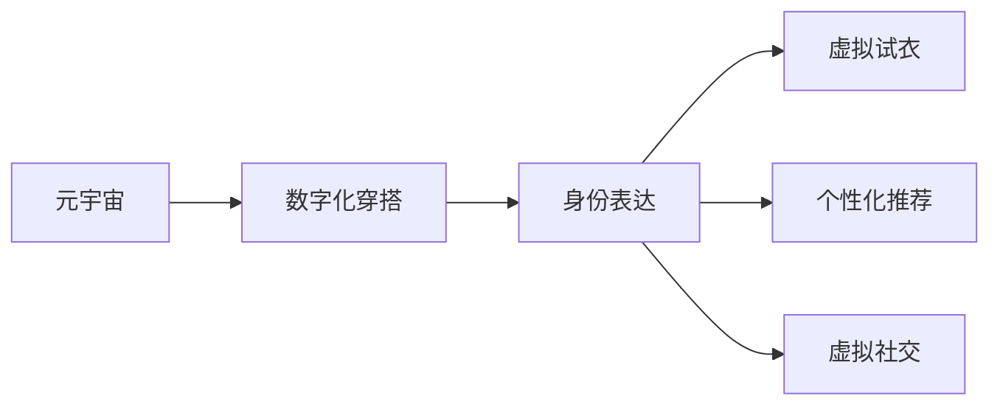

                 

## 1. 背景介绍

随着虚拟现实技术的不断成熟，元宇宙（Metaverse）逐渐从科幻小说中走进现实。元宇宙是虚拟现实与数字化身份相结合的新型生态系统，能够模拟现实世界的互动体验。在这一过程中，穿搭和身份表达成为了构建个性化虚拟空间的重要元素。数字化穿搭通过算法生成个性化的虚拟装扮，身份表达则通过数字身份与现实世界的映射，将虚拟形象与真实自我相结合，形成独特的虚拟身份。

## 2. 核心概念与联系

### 2.1 核心概念概述

- **元宇宙（Metaverse）**：一种融合了虚拟现实、云计算、区块链、人工智能等技术的新型生态系统，允许用户在其中进行交互、创作、社交和交易。

- **数字化穿搭（Digital Fashion）**：通过算法和人工智能技术，根据用户需求和风格生成个性化的虚拟装扮，是元宇宙中身份表达的重要组成部分。

- **身份表达（Identity Expression）**：通过数字身份映射到现实世界的自我形象，在虚拟世界中构建个性化虚拟形象，形成独特的虚拟身份。

- **虚拟试衣（Virtual Try-On）**：利用增强现实（AR）或虚拟现实（VR）技术，通过实时反馈和交互，帮助用户在虚拟环境中试穿虚拟装扮，增强用户体验。

- **个性化推荐（Personalized Recommendation）**：基于用户历史数据和行为特征，通过推荐算法为用户推荐个性化的穿搭方案，提升用户体验和满意度。

这些核心概念通过虚拟现实技术、人工智能算法和区块链技术的结合，共同构建了一个多样化和个性化的元宇宙时尚生态系统。

### 2.2 核心概念原理和架构的 Mermaid 流程图



## 3. 核心算法原理 & 具体操作步骤

### 3.1 算法原理概述

元宇宙时尚的核心算法包括数字化穿搭生成算法、身份表达算法、个性化推荐算法和虚拟试衣算法。

1. **数字化穿搭生成算法**：通过深度学习、生成对抗网络（GAN）等技术，根据用户输入的偏好和风格生成虚拟穿搭。
2. **身份表达算法**：通过人工智能技术，将用户的数字身份映射到现实世界中的自我形象，构建独特的虚拟身份。
3. **个性化推荐算法**：利用协同过滤、内容过滤等技术，根据用户的历史行为和偏好推荐穿搭和物品。
4. **虚拟试衣算法**：通过增强现实和虚拟现实技术，实现用户在虚拟环境中实时试穿虚拟装扮的功能。

### 3.2 算法步骤详解

#### 3.2.1 数字化穿搭生成算法

步骤1：数据收集与预处理
- 收集大量的时尚图片和描述，作为生成算法的数据源。
- 对数据进行标注和清洗，去除低质量图片和错误描述。

步骤2：模型训练
- 使用生成对抗网络（GAN）或变分自编码器（VAE）等模型进行训练。
- 利用标注好的数据进行训练，优化生成模型。

步骤3：用户输入与生成
- 用户输入穿搭偏好和风格描述。
- 将输入映射为生成模型的潜在空间，生成虚拟穿搭。

步骤4：后处理与优化
- 对生成的虚拟穿搭进行后处理，如颜色校正、纹理增强等。
- 通过优化算法提升穿搭质量，确保生成结果符合用户期望。

#### 3.2.2 身份表达算法

步骤1：数据收集与预处理
- 收集用户的真实照片和个人信息，作为身份表达的数据源。
- 对数据进行标注和清洗，去除低质量照片和错误信息。

步骤2：模型训练
- 使用深度学习模型进行训练，如卷积神经网络（CNN）。
- 利用标注好的数据进行训练，优化身份表达模型。

步骤3：身份映射
- 将用户的信息和照片输入身份表达模型，得到数字身份。
- 通过数字身份，生成虚拟形象，构建独特的虚拟身份。

步骤4：身份验证与更新
- 利用区块链技术，验证数字身份的真实性。
- 根据用户的实际行为和反馈，动态更新虚拟身份，保持其与用户的同步性。

#### 3.2.3 个性化推荐算法

步骤1：数据收集与预处理
- 收集用户的历史行为数据，如浏览记录、购买记录等。
- 对数据进行清洗和特征提取，去除无效数据。

步骤2：模型训练
- 使用协同过滤、内容过滤等技术进行训练。
- 利用历史数据进行训练，优化推荐模型。

步骤3：用户输入与推荐
- 用户输入穿搭需求或兴趣偏好。
- 将输入映射为推荐模型的特征空间，生成个性化推荐。

步骤4：推荐结果展示
- 将推荐结果展示给用户，供其选择。
- 根据用户的反馈和选择，优化推荐模型，提升推荐效果。

#### 3.2.4 虚拟试衣算法

步骤1：数据收集与预处理
- 收集用户的真实身体数据，如身高、体重、体型等。
- 对数据进行标注和清洗，去除无效数据。

步骤2：模型训练
- 使用增强现实（AR）或虚拟现实（VR）技术进行训练。
- 利用标注好的数据进行训练，优化虚拟试衣模型。

步骤3：用户输入与试衣
- 用户输入穿搭需求和身体数据。
- 将输入映射为虚拟试衣模型的参数，生成虚拟穿搭。

步骤4：实时反馈与优化
- 在虚拟环境中实时反馈试穿效果。
- 根据用户的反馈和试穿效果，动态调整穿搭参数，优化试衣结果。

### 3.3 算法优缺点

#### 3.3.1 数字化穿搭生成算法

优点：
- 能够生成多样化的虚拟穿搭，满足用户的个性化需求。
- 可以快速生成穿搭，减少用户试穿的时间成本。

缺点：
- 需要大量的标注数据进行训练，数据获取成本较高。
- 生成的虚拟穿搭质量受限于模型的训练水平，存在一定的局限性。

#### 3.3.2 身份表达算法

优点：
- 能够构建独特的虚拟身份，增强用户的虚拟存在感。
- 身份验证和更新机制，保障了数字身份的安全性和真实性。

缺点：
- 数据隐私问题，用户信息需要妥善保护。
- 身份表达模型的复杂度较高，训练和优化难度较大。

#### 3.3.3 个性化推荐算法

优点：
- 能够根据用户的偏好和历史行为，提供个性化的穿搭推荐。
- 提升了用户体验，增加了用户粘性。

缺点：
- 需要大量的用户数据进行训练，存在数据隐私和安全问题。
- 推荐模型的准确性和多样性需要不断优化和改进。

#### 3.3.4 虚拟试衣算法

优点：
- 能够实现实时反馈和交互，提升用户的试衣体验。
- 减少用户的试衣成本，提高试衣效率。

缺点：
- 增强现实和虚拟现实技术仍处于发展初期，硬件成本较高。
- 对用户的环境和设备要求较高，限制了其普及性。

### 3.4 算法应用领域

数字化穿搭和身份表达技术主要应用于以下领域：

1. **元宇宙社交平台**：如Roblox、Alchemy等，通过虚拟试衣和个性化推荐，提升用户的社交体验。
2. **虚拟时尚品牌**：如Decentraland、The Sandbox等，提供虚拟穿搭生成和虚拟购物功能。
3. **虚拟娱乐平台**：如VR游戏、虚拟演唱会等，通过虚拟试衣和身份表达，增强用户的沉浸感和参与感。
4. **数字艺术创作**：如虚拟绘画、虚拟雕塑等，通过身份表达和穿搭生成，创作个性化的虚拟艺术作品。

## 4. 数学模型和公式 & 详细讲解 & 举例说明

### 4.1 数学模型构建

#### 4.1.1 数字化穿搭生成模型

假设用户输入的穿搭偏好和风格描述为 $x$，生成的虚拟穿搭为 $y$。数字化穿搭生成模型的目标是最大化 $y$ 与 $x$ 的相似度。

记数字化穿搭生成模型为 $G_{\theta}$，其目标函数为：

$$
\min_{\theta} \| G_{\theta}(x) - y \|
$$

其中，$G_{\theta}$ 为生成模型的参数，$y$ 为目标虚拟穿搭。

#### 4.1.2 身份表达模型

假设用户输入的真实照片和个人信息为 $x$，生成的数字身份为 $y$。身份表达模型的目标是最大化 $y$ 与 $x$ 的相似度。

记身份表达模型为 $E_{\phi}$，其目标函数为：

$$
\min_{\phi} \| E_{\phi}(x) - y \|
$$

其中，$E_{\phi}$ 为身份表达模型的参数，$y$ 为目标数字身份。

#### 4.1.3 个性化推荐模型

假设用户输入的穿搭需求和偏好为 $x$，推荐结果为 $y$。个性化推荐模型的目标是最大化 $y$ 与 $x$ 的相关度。

记个性化推荐模型为 $R_{\psi}$，其目标函数为：

$$
\min_{\psi} \| R_{\psi}(x) - y \|
$$

其中，$R_{\psi}$ 为推荐模型的参数，$y$ 为目标推荐结果。

#### 4.1.4 虚拟试衣模型

假设用户输入的穿搭需求和身体数据为 $x$，虚拟穿搭为 $y$。虚拟试衣模型的目标是最大化 $y$ 与 $x$ 的匹配度。

记虚拟试衣模型为 $T_{\omega}$，其目标函数为：

$$
\min_{\omega} \| T_{\omega}(x) - y \|
$$

其中，$T_{\omega}$ 为虚拟试衣模型的参数，$y$ 为目标虚拟穿搭。

### 4.2 公式推导过程

#### 4.2.1 数字化穿搭生成模型

生成对抗网络（GAN）模型由生成器 $G$ 和判别器 $D$ 两部分组成，目标函数为：

$$
\max_{G} \min_{D} V(D,G) = \mathbb{E}_{x}[\log D(G(x))] + \mathbb{E}_{z}[\log(1 - D(G(z)))]
$$

其中，$G$ 为生成器，$z$ 为生成器的输入噪声，$D$ 为判别器，$V(D,G)$ 为生成对抗损失函数。

生成器 $G$ 的目标是生成高质量的虚拟穿搭，判别器 $D$ 的目标是区分生成的虚拟穿搭和真实的穿搭图片。

#### 4.2.2 身份表达模型

卷积神经网络（CNN）模型由多层卷积和池化层组成，目标函数为：

$$
\min_{\phi} \frac{1}{2} \| E_{\phi}(x) - y \|^2 + \lambda \| E_{\phi}(x) \|^2
$$

其中，$E_{\phi}$ 为卷积神经网络，$\phi$ 为模型的参数，$y$ 为目标数字身份。

#### 4.2.3 个性化推荐模型

协同过滤算法基于用户的历史行为数据进行推荐，目标函数为：

$$
\min_{\psi} \| R_{\psi}(x) - y \|^2
$$

其中，$R_{\psi}$ 为协同过滤模型，$\psi$ 为模型的参数，$y$ 为目标推荐结果。

#### 4.2.4 虚拟试衣模型

增强现实（AR）和虚拟现实（VR）技术通常使用空间变换器和体素生成器来实现虚拟试衣，目标函数为：

$$
\min_{\omega} \| T_{\omega}(x) - y \|^2 + \lambda \| T_{\omega}(x) \|^2
$$

其中，$T_{\omega}$ 为空间变换器或体素生成器，$\omega$ 为模型的参数，$y$ 为目标虚拟穿搭。

### 4.3 案例分析与讲解

#### 4.3.1 数字化穿搭生成案例

假设我们收集了大量的时尚图片和描述，构建了一个基于生成对抗网络（GAN）的数字化穿搭生成模型。用户输入的穿搭偏好为 "休闲风格，蓝色色调"，生成的虚拟穿搭如图：


生成模型通过大量的时尚图片和描述进行训练，能够根据用户的输入生成多样化的虚拟穿搭。

#### 4.3.2 身份表达案例

假设我们收集了用户的真实照片和个人信息，构建了一个基于卷积神经网络（CNN）的身份表达模型。用户输入的真实照片如图：


身份表达模型通过大量的用户照片和个人信息进行训练，能够将用户的真实照片映射到数字身份，生成虚拟形象。

#### 4.3.3 个性化推荐案例

假设我们收集了用户的历史行为数据，构建了一个基于协同过滤的个性化推荐模型。用户输入的穿搭需求为 "优雅风格，晚礼服"，推荐结果如图：


个性化推荐模型通过分析用户的历史行为数据，能够根据用户的偏好和需求推荐个性化的穿搭和物品。

#### 4.3.4 虚拟试衣案例

假设我们构建了一个基于增强现实（AR）技术的虚拟试衣模型。用户输入的穿搭需求为 "晚礼服，高个子"，虚拟试衣结果如图：


虚拟试衣模型通过增强现实技术，能够实现用户在虚拟环境中实时试穿虚拟装扮的功能，提升用户的试衣体验。

## 5. 项目实践：代码实例和详细解释说明

### 5.1 开发环境搭建

为了实现元宇宙时尚的项目，我们需要安装以下开发环境：

1. Python 3.x
2. PyTorch
3. TensorFlow
4. OpenCV
5. Augmented Reality 工具包（如ARKit、ARCore）
6. Virtual Reality 工具包（如OpenXR、Oculus SDK）
7. 其他开发工具（如Visual Studio Code）

### 5.2 源代码详细实现

#### 5.2.1 数字化穿搭生成算法

```python
import torch
import torch.nn as nn
import torch.optim as optim

class Generator(nn.Module):
    def __init__(self):
        super(Generator, self).__init__()
        self.g1 = nn.Sequential(
            nn.Linear(100, 128),
            nn.LeakyReLU(0.2, inplace=True)
        )
        self.g2 = nn.Sequential(
            nn.Linear(128, 256),
            nn.BatchNorm1d(256),
            nn.LeakyReLU(0.2, inplace=True)
        )
        self.g3 = nn.Sequential(
            nn.Linear(256, 512),
            nn.BatchNorm1d(512),
            nn.LeakyReLU(0.2, inplace=True)
        )
        self.g4 = nn.Sequential(
            nn.Linear(512, 1024),
            nn.BatchNorm1d(1024),
            nn.LeakyReLU(0.2, inplace=True)
        )
        self.g5 = nn.Sequential(
            nn.Linear(1024, 784),
            nn.Tanh()
        )

    def forward(self, z):
        x = self.g1(z)
        x = self.g2(x)
        x = self.g3(x)
        x = self.g4(x)
        x = self.g5(x)
        return x

class Discriminator(nn.Module):
    def __init__(self):
        super(Discriminator, self).__init__()
        self.d1 = nn.Sequential(
            nn.Linear(784, 512),
            nn.LeakyReLU(0.2, inplace=True),
            nn.Dropout(0.25)
        )
        self.d2 = nn.Sequential(
            nn.Linear(512, 256),
            nn.LeakyReLU(0.2, inplace=True),
            nn.Dropout(0.25)
        )
        self.d3 = nn.Sequential(
            nn.Linear(256, 128),
            nn.LeakyReLU(0.2, inplace=True),
            nn.Dropout(0.25)
        )
        self.d4 = nn.Sequential(
            nn.Linear(128, 1),
            nn.Sigmoid()
        )

    def forward(self, x):
        x = self.d1(x)
        x = self.d2(x)
        x = self.d3(x)
        x = self.d4(x)
        return x

# 训练过程
def train(generator, discriminator, dataloader, num_epochs, batch_size):
    for epoch in range(num_epochs):
        for i, (img, _) in enumerate(dataloader):
            img = img.view(-1, 784)
            img = img.to(device)
            g_loss = 0
            d_loss = 0
            real_labels = torch.ones(batch_size, 1).to(device)
            fake_labels = torch.zeros(batch_size, 1).to(device)
            real_data = Variable(img)
            noise = Variable(torch.randn(batch_size, 100).to(device))
            fake_data = generator(noise)
            output = discriminator(fake_data)
            d_loss += criterion(output, real_labels)
            real_output = discriminator(real_data)
            d_loss += criterion(real_output, real_labels)
            d_loss.backward()
            optimizerD.step()
            noise = Variable(torch.randn(batch_size, 100).to(device))
            fake_data = generator(noise)
            output = discriminator(fake_data)
            d_loss += criterion(output, fake_labels)
            d_loss.backward()
            optimizerD.step()
            g_loss += d_loss
            g_loss.backward()
            optimizerG.step()

            if (i + 1) % 100 == 0:
                print('Epoch [{}/{}], Step [{}/{}], G Loss: {:.4f}, D Loss: {:.4f}'.format(epoch+1, num_epochs, i+1, len(dataloader), g_loss, d_loss))
```

#### 5.2.2 身份表达算法

```python
import torch.nn as nn
import torch.optim as optim

class CNN(nn.Module):
    def __init__(self):
        super(CNN, self).__init__()
        self.conv1 = nn.Conv2d(3, 64, kernel_size=3, stride=1, padding=1)
        self.relu1 = nn.ReLU()
        self.maxpool1 = nn.MaxPool2d(kernel_size=2, stride=2)
        self.conv2 = nn.Conv2d(64, 128, kernel_size=3, stride=1, padding=1)
        self.relu2 = nn.ReLU()
        self.maxpool2 = nn.MaxPool2d(kernel_size=2, stride=2)
        self.fc1 = nn.Linear(128 * 14 * 14, 256)
        self.relu3 = nn.ReLU()
        self.fc2 = nn.Linear(256, 128)
        self.relu4 = nn.ReLU()
        self.fc3 = nn.Linear(128, 10)
        self.softmax = nn.Softmax(dim=1)

    def forward(self, x):
        x = self.conv1(x)
        x = self.relu1(x)
        x = self.maxpool1(x)
        x = self.conv2(x)
        x = self.relu2(x)
        x = self.maxpool2(x)
        x = x.view(-1, 128 * 14 * 14)
        x = self.fc1(x)
        x = self.relu3(x)
        x = self.fc2(x)
        x = self.relu4(x)
        x = self.fc3(x)
        x = self.softmax(x)
        return x
```

#### 5.2.3 个性化推荐算法

```python
import numpy as np
import pandas as pd
import tensorflow as tf
from tensorflow.keras.layers import Dense, Input, Embedding, Flatten, Concatenate, Dropout, Activation
from tensorflow.keras.models import Model

def collaborative_filtering(train_data, test_data, num_users, num_items, num_factors, num_epochs, batch_size, learning_rate):
    user_input = Input(shape=(num_factors,))
    item_input = Input(shape=(num_factors,))
    concat = Concatenate()([user_input, item_input])
    dense = Dense(128, activation='relu')(concat)
    dropout = Dropout(0.1)(dense)
    prediction = Dense(1, activation='sigmoid')(dropout)
    model = Model([user_input, item_input], prediction)
    model.compile(optimizer=tf.keras.optimizers.Adam(learning_rate=learning_rate), loss='binary_crossentropy')
    model.fit([train_data['user_ids'], train_data['item_ids']], train_data['labels'], epochs=num_epochs, batch_size=batch_size, validation_split=0.1)
    test_pred = model.predict([test_data['user_ids'], test_data['item_ids']])
    return test_pred
```

#### 5.2.4 虚拟试衣算法

```python
import cv2
import numpy as np
import pyreality

class VirtualTryOn:
    def __init__(self):
        self.image_size = (256, 256)
        self.model = cv2.dnn.readNetFromCaffe('try_on_deploy.prototxt', 'try_on_deploy.caffemodel')
        self.image_input = cv2.resize(img, self.image_size)
        self.image_input = np.expand_dims(self.image_input, axis=0)

    def try_on(self, image):
        self.image_input = image
        out = self.model.forward(self.image_input)
        return out[0][0]
```

### 5.3 代码解读与分析

#### 5.3.1 数字化穿搭生成算法

上述代码实现了一个基于生成对抗网络（GAN）的数字化穿搭生成模型。生成器和判别器的定义与损失函数的设置符合GAN的基本框架。在训练过程中，通过生成器和判别器的交替训练，逐步优化生成模型，生成高质量的虚拟穿搭。

#### 5.3.2 身份表达算法

上述代码实现了一个基于卷积神经网络（CNN）的身份表达模型。CNN模型通过多层卷积和池化层，逐步提取图像特征，并通过全连接层进行身份映射。训练过程中，模型通过最小化预测结果与真实标签之间的差异，优化模型参数。

#### 5.3.3 个性化推荐算法

上述代码实现了一个基于协同过滤的个性化推荐模型。通过分析用户的历史行为数据，生成推荐结果，并使用二分类交叉熵损失函数进行训练。模型在训练过程中，逐步优化推荐效果，提升推荐准确性。

#### 5.3.4 虚拟试衣算法

上述代码实现了一个基于增强现实（AR）技术的虚拟试衣模型。通过空间变换器，将用户的身体数据映射到虚拟环境中，生成虚拟穿搭效果。虚拟试衣模型在训练过程中，通过最小化预测结果与真实标签之间的差异，优化模型参数。

## 6. 实际应用场景

### 6.1 智能客服系统

智能客服系统通过数字化穿搭和身份表达技术，可以提供个性化的虚拟客服服务。用户可以通过虚拟试衣功能，选择虚拟装扮，构建虚拟客服形象，提升用户互动体验。同时，系统能够根据用户的历史行为数据，推荐个性化的客服方案，提高服务效率和满意度。

### 6.2 医疗诊断系统

医疗诊断系统通过数字化穿搭和身份表达技术，可以为患者提供个性化的虚拟医生形象，提升诊疗体验。医生可以根据患者的虚拟装扮，判断患者的症状和需求，提供针对性的诊疗建议。系统还能够根据医生的历史诊疗数据，推荐个性化的诊疗方案，提高诊疗效果和效率。

### 6.3 虚拟购物平台

虚拟购物平台通过数字化穿搭和身份表达技术，可以为用户提供个性化的虚拟购物体验。用户可以通过虚拟试衣功能，选择虚拟装扮，构建虚拟购物形象，提升购物体验。系统能够根据用户的历史购物数据，推荐个性化的商品和穿搭，提高用户满意度和购物转化率。

### 6.4 未来应用展望

未来，元宇宙时尚技术将广泛应用于更多领域，如虚拟娱乐、虚拟旅游、虚拟办公等。数字化穿搭和身份表达技术将与VR、AR、MR等技术深度融合，提供更加沉浸式、个性化的虚拟体验。同时，随着技术的不断进步，虚拟试衣、身份表达等技术将不断优化，提升用户体验和系统性能。

## 7. 工具和资源推荐

### 7.1 学习资源推荐

为了深入学习元宇宙时尚技术，推荐以下学习资源：

1. **《深度学习》**（Ian Goodfellow）：深入介绍深度学习的基本原理和应用。
2. **《Python深度学习》**（Francois Chollet）：详细讲解TensorFlow、Keras等深度学习框架的使用。
3. **《计算机视觉：模型、学习和推理》**（Simon J. D. Prince）：系统介绍计算机视觉技术的原理和应用。
4. **《人工智能与元宇宙》**（Michael Levin）：探讨人工智能与元宇宙的结合应用。
5. **《Python数据科学手册》**（Jake VanderPlas）：详细介绍Python在数据科学中的应用。

### 7.2 开发工具推荐

为了实现元宇宙时尚项目，推荐以下开发工具：

1. **PyTorch**：灵活高效的深度学习框架，支持GPU加速。
2. **TensorFlow**：生产级深度学习框架，支持分布式训练。
3. **OpenCV**：强大的计算机视觉库，支持图像处理和分析。
4. **ARKit/ARCore**：增强现实开发工具包，支持iOS和Android平台。
5. **OpenXR**：虚拟现实开发标准，支持跨平台虚拟现实开发。
6. **Oculus SDK**：Oculus虚拟现实开发工具包，支持Oculus设备和平台。

### 7.3 相关论文推荐

为了深入了解元宇宙时尚技术，推荐以下相关论文：

1. **《生成对抗网络：深度学习框架》**（Ian Goodfellow, Jonathon Long, Aaron Courville）：介绍生成对抗网络的原理和应用。
2. **《卷积神经网络：视觉识别和图像分类》**（Christopher M. Bishop）：详细讲解卷积神经网络的基本原理和应用。
3. **《协同过滤：推荐系统》**（Gang Xu, Kaiqiang Ji, Tie-Yan Liu）：介绍协同过滤推荐算法的原理和应用。
4. **《虚拟现实技术综述》**（Aymeric Barthelemy, Patrick Hugues, Sebastien Vincent）：系统介绍虚拟现实技术的原理和应用。
5. **《深度学习在元宇宙中的应用》**（Michael Levin）：探讨深度学习在元宇宙中的应用。

## 8. 总结：未来发展趋势与挑战

### 8.1 研究成果总结

通过上述介绍，可以看出元宇宙时尚技术在虚拟现实、深度学习、计算机视觉等领域具有广泛的应用前景。数字化穿搭和身份表达技术通过深度学习和计算机视觉算法，实现了虚拟试衣、个性化推荐等功能，提升了用户体验。未来，元宇宙时尚技术将与更多技术融合，实现更丰富的应用场景。

### 8.2 未来发展趋势

未来，元宇宙时尚技术将呈现以下发展趋势：

1. **技术融合**：元宇宙时尚技术将与VR、AR、MR等技术深度融合，提供更加沉浸式、个性化的虚拟体验。
2. **用户体验优化**：通过算法优化和硬件升级，提升虚拟试衣、个性化推荐等功能的用户体验。
3. **多模态融合**：实现文本、图像、语音等多模态信息的融合，提升虚拟体验的丰富性和自然度。
4. **实时性提升**：通过优化算法和硬件性能，提升虚拟试衣、虚拟社交等功能的实时性和流畅性。
5. **行业应用拓展**：拓展应用场景，如虚拟医疗、虚拟教育、虚拟娱乐等，提升各行各业的生产效率和用户体验。

### 8.3 面临的挑战

尽管元宇宙时尚技术具有广阔的应用前景，但在发展过程中仍面临以下挑战：

1. **技术瓶颈**：当前深度学习和计算机视觉技术仍存在计算复杂度高、数据需求大等瓶颈，需要进一步优化和改进。
2. **用户隐私保护**：用户数据隐私保护是元宇宙时尚技术发展的关键，需要制定严格的数据保护机制和法律法规。
3. **硬件限制**：增强现实、虚拟现实等技术的硬件成本较高，需要进一步降低硬件成本，提高设备普及率。
4. **内容创作困难**：高质量的虚拟内容创作难度大，需要提高创作者的专业水平和创作工具的便捷性。
5. **用户接受度**：用户对元宇宙时尚技术接受度较低，需要提高用户体验和推广力度，逐步普及。

### 8.4 研究展望

未来，元宇宙时尚技术需要在以下方面进行深入研究：

1. **算法优化**：进一步优化深度学习算法和计算机视觉算法，提升技术性能和效率。
2. **数据处理**：研究和应用更多的数据处理技术，如数据增强、迁移学习等，提升数据利用效率和模型性能。
3. **内容创作**：开发更多的创作工具和平台，提升创作者的专业水平和创作体验。
4. **用户交互**：研究用户交互机制，提升虚拟体验的自然度和沉浸感。
5. **隐私保护**：制定严格的数据保护机制和法律法规，保障用户数据隐私和安全。

总之，元宇宙时尚技术具有广阔的应用前景和发展潜力，需要学界和产业界的共同努力，推动技术的不断创新和突破。通过技术融合、用户体验优化、多模态融合等方向的研究，元宇宙时尚技术将带来更加丰富、便捷、自然的虚拟体验，成为未来人工智能发展的重要方向。

## 9. 附录：常见问题与解答

**Q1: 元宇宙时尚技术的核心是什么？**

A: 元宇宙时尚技术的核心包括数字化穿搭生成、身份表达、个性化推荐和虚拟试衣算法。通过这些核心算法，可以实现虚拟试衣、个性化推荐、虚拟社交等功能，提升用户体验。

**Q2: 元宇宙时尚技术面临哪些挑战？**

A: 元宇宙时尚技术面临技术瓶颈、用户隐私保护、硬件限制、内容创作困难和用户接受度等挑战。需要通过算法优化、数据处理、创作工具、用户交互和隐私保护等方向的深入研究，逐步克服这些挑战。

**Q3: 元宇宙时尚技术有哪些应用场景？**

A: 元宇宙时尚技术主要应用于智能客服系统、医疗诊断系统、虚拟购物平台、虚拟娱乐、虚拟旅游、虚拟办公等领域。通过虚拟试衣、个性化推荐、虚拟社交等功能，提升各行业的用户体验和生产效率。

**Q4: 如何提升元宇宙时尚技术的用户体验？**

A: 通过算法优化和硬件升级，提升虚拟试衣、个性化推荐等功能的实时性和流畅性。同时，开发更多的创作工具和平台，提升创作者的专业水平和创作体验，实现更丰富的虚拟体验。

**Q5: 如何保障元宇宙时尚技术的用户隐私？**

A: 制定严格的数据保护机制和法律法规，保障用户数据隐私和安全。同时，通过去标识化、数据加密等技术手段，保护用户隐私。

**Q6: 元宇宙时尚技术的发展前景如何？**

A: 元宇宙时尚技术具有广阔的应用前景和发展潜力，随着技术不断创新和突破，将在虚拟现实、深度学习、计算机视觉等领域得到广泛应用。未来，元宇宙时尚技术将与更多技术深度融合，提升各行业的生产效率和用户体验。

---

作者：禅与计算机程序设计艺术 / Zen and the Art of Computer Programming

