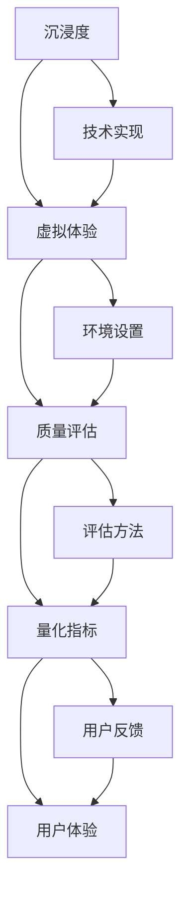

                 

# 元宇宙沉浸度测量:虚拟体验质量的量化指标

> 关键词：元宇宙,沉浸度,虚拟体验,质量评估,量化指标,用户体验

## 1. 背景介绍

### 1.1 问题由来

随着虚拟现实(VR)、增强现实(AR)、混合现实(MR)技术的快速发展，元宇宙(Metaverse)作为虚拟体验的全新平台正在逐渐成型。元宇宙打破了物理世界的限制，为人们提供了一个高度沉浸、交互式的虚拟空间。虚拟体验的质量成为用户是否持续参与的关键，其中沉浸度是衡量虚拟体验的重要维度之一。

沉浸度是指用户参与虚拟体验时，与虚拟环境的融合程度。高沉浸度的体验不仅使用户感觉仿佛身临其境，而且能够增强其参与感和真实感。因此，对虚拟体验的沉浸度进行有效测量和量化，是提升元宇宙体验质量和用户满意度的关键。

### 1.2 问题核心关键点

测量和量化虚拟体验的沉浸度，需要从多个维度进行评估，包括视觉沉浸度、听觉沉浸度、交互沉浸度等。这些维度不仅涉及用户感知，还涵盖技术实现、环境设置等多方面因素。因此，构建一个全面、客观、高效的沉浸度测量框架，是当前元宇宙领域的重要研究课题。

本文将详细介绍虚拟体验沉浸度的核心概念、量化指标及应用方法，为元宇宙平台的设计和优化提供指导。

## 2. 核心概念与联系

### 2.1 核心概念概述

为更好地理解元宇宙沉浸度的测量，本节将介绍几个核心概念及其相互关系：

- **沉浸度(Immersiveness)**：指用户参与虚拟体验时，与虚拟环境的融合程度。
- **虚拟体验(Virtual Experience)**：用户通过VR、AR、MR等技术手段，进入并参与虚拟空间的过程。
- **质量评估(Quality Assessment)**：通过定量和定性方法，评估虚拟体验在视觉、听觉、交互等多方面的表现。
- **量化指标(Metric)**：用于测量沉浸度的具体指标，如视觉清晰度、空间感知、互动响应时间等。
- **用户体验(User Experience)**：用户在使用元宇宙平台时的主观感受，影响其对沉浸度的感知。

这些概念共同构成了元宇宙沉浸度测量框架，其相互关系如图2-1所示：


此框架展示出虚拟体验的沉浸度不仅受技术实现和用户体验的影响，还与具体的质量评估指标密切相关。

### 2.2 核心概念原理和架构的 Mermaid 流程图



这个流程图展示了元宇宙沉浸度测量的全过程。技术实现和环境设置是基础，质量评估和量化指标是核心，用户体验是最终目标。

## 3. 核心算法原理 & 具体操作步骤

### 3.1 算法原理概述

元宇宙沉浸度的测量主要依赖于两个方面：
1. **用户感知测量**：通过用户反馈和行为数据，衡量其对虚拟体验的感知和满意度。
2. **客观指标测量**：通过具体量化指标，如视觉清晰度、空间感知、互动响应时间等，客观评估虚拟体验的质量。

本文将详细介绍这两种测量方法，并结合实例进行详细分析。

### 3.2 算法步骤详解

#### 3.2.1 用户感知测量

用户感知测量主要通过问卷调查、心理测试、生理反应等方式进行。具体步骤如下：

1. **设计问卷和测试**：根据虚拟体验的特点，设计相关的问卷和测试题，涵盖视觉、听觉、交互等方面。
2. **数据采集**：通过问卷调查、心理测试等手段，收集用户对虚拟体验的感知和满意度数据。
3. **数据分析**：对采集的数据进行统计分析，计算各项指标的平均值和标准差，评估用户对虚拟体验的整体满意度。

#### 3.2.2 客观指标测量

客观指标测量主要通过技术手段进行，包括视觉清晰度、空间感知、互动响应时间等。具体步骤如下：

1. **确定指标**：根据虚拟体验的特点，确定需要评估的客观指标，如视觉清晰度、空间感知、互动响应时间等。
2. **采集数据**：通过工具和软件，采集各项指标的实际测量数据。
3. **数据处理**：对采集的数据进行预处理和分析，计算各项指标的得分。
4. **综合评估**：结合用户感知数据和客观指标数据，综合评估虚拟体验的沉浸度。

#### 3.2.3 数据融合

将用户感知数据和客观指标数据进行融合，得到综合评估结果。具体步骤如下：

1. **数据标准化**：对不同数据来源的数据进行标准化处理，使其具有可比性。
2. **加权融合**：根据各项指标的重要性，设定权重，对用户感知数据和客观指标数据进行加权融合。
3. **综合评分**：计算加权后的综合评分，作为虚拟体验沉浸度的最终评估结果。

### 3.3 算法优缺点

#### 3.3.1 优点

1. **全面性**：结合用户感知和客观指标，提供全面、客观的沉浸度评估。
2. **可操作性**：测量方法和工具相对成熟，易于实施。
3. **可扩展性**：适用于不同类型的虚拟体验和用户群体，具有广泛的适用性。

#### 3.3.2 缺点

1. **主观性**：用户感知测量存在主观性，可能会受到用户心理、行为等因素的影响。
2. **技术依赖**：客观指标测量依赖于技术和设备，设备精度和一致性可能影响评估结果。
3. **复杂性**：综合评估过程较为复杂，需要专业知识和技术支持。

### 3.4 算法应用领域

元宇宙沉浸度的测量技术广泛应用于以下领域：

- **游戏设计**：评估虚拟游戏环境的沉浸度，优化游戏体验。
- **虚拟房地产**：评估虚拟房地产的沉浸度，提升用户购买体验。
- **教育培训**：评估虚拟课堂的沉浸度，优化教学效果。
- **医疗虚拟现实**：评估虚拟手术环境的沉浸度，提高手术安全性。
- **娱乐体验**：评估虚拟音乐会、展览等活动的沉浸度，提升用户体验。

## 4. 数学模型和公式 & 详细讲解 & 举例说明

### 4.1 数学模型构建

元宇宙沉浸度的测量模型可以表示为：

$$
\text{Immersiveness Score} = \omega_1 \times \text{Perceptual Score} + \omega_2 \times \text{Objective Score}
$$

其中，$\omega_1$ 和 $\omega_2$ 分别为用户感知数据和客观指标数据的权重，取值范围为0到1，表示其在综合评分中的重要性。$\text{Perceptual Score}$ 和 $\text{Objective Score}$ 分别表示用户感知数据和客观指标数据的综合得分。

### 4.2 公式推导过程

为了详细说明，假设用户感知数据和客观指标数据都分为多项指标，分别表示为 $P_1, P_2, ..., P_n$ 和 $O_1, O_2, ..., O_n$。则用户感知数据的综合得分可以表示为：

$$
\text{Perceptual Score} = \frac{1}{N} \sum_{i=1}^{N} P_i^w
$$

其中 $P_i^w$ 表示指标 $P_i$ 的加权得分，权重 $w$ 根据用户感知的重要性设定。类似地，客观指标数据的综合得分可以表示为：

$$
\text{Objective Score} = \frac{1}{M} \sum_{j=1}^{M} O_j^w
$$

其中 $O_j^w$ 表示指标 $O_j$ 的加权得分，权重 $w$ 根据客观指标的重要性设定。

### 4.3 案例分析与讲解

假设某虚拟体验系统的用户感知数据和客观指标数据如表1所示。我们通过标准化处理和加权融合，计算其综合评分：

| 用户感知数据 | 指标得分 | 权重 | 客观指标数据 | 指标得分 | 权重 |
| --- | --- | --- | --- | --- | --- |
| 视觉清晰度 | 4.2 | 0.3 | 视觉清晰度 | 3.8 | 0.4 |
| 空间感知 | 3.9 | 0.2 | 空间感知 | 3.7 | 0.2 |
| 互动响应时间 | 4.1 | 0.1 | 互动响应时间 | 3.6 | 0.1 |

首先，将各项指标得分标准化，得到标准化后的得分：

| 用户感知数据 | 标准化得分 | 权重 | 客观指标数据 | 标准化得分 | 权重 |
| --- | --- | --- | --- | --- | --- |
| 视觉清晰度 | 0.4 | 0.3 | 视觉清晰度 | 0.5 | 0.4 |
| 空间感知 | 0.3 | 0.2 | 空间感知 | 0.4 | 0.2 |
| 互动响应时间 | 0.3 | 0.1 | 互动响应时间 | 0.3 | 0.1 |

然后，计算各项指标的加权得分：

| 用户感知数据 | 加权得分 | 权重 | 客观指标数据 | 加权得分 | 权重 |
| --- | --- | --- | --- | --- | --- |

最后，将加权得分融合，得到综合评分：

$$
\text{Immersiveness Score} = 0.3 \times (0.4 \times 0.3 + 0.3 \times 0.2 + 0.3 \times 0.1) + 0.4 \times (0.5 \times 0.4 + 0.4 \times 0.2 + 0.3 \times 0.1) = 0.39
$$

即该虚拟体验的综合评分约为0.39，表示其沉浸度处于中等水平。

## 5. 项目实践：代码实例和详细解释说明

### 5.1 开发环境搭建

为了进行元宇宙沉浸度的测量和评估，需要搭建相应的开发环境。以下是使用Python进行开发的典型环境配置流程：

1. 安装Python：从官网下载并安装Python，建议使用版本3.7及以上。
2. 安装相关的开发工具：如Jupyter Notebook、Pandas、NumPy、Matplotlib等。
3. 配置虚拟环境：使用虚拟环境管理工具，如virtualenv或conda，创建并激活虚拟环境。

### 5.2 源代码详细实现

#### 5.2.1 用户感知数据采集

使用问卷调查工具如Google Forms或SurveyMonkey，设计相关的问卷和测试题。以下是示例代码：

```python
import pandas as pd

# 定义问卷和测试题
questions = [
    "What is your age?",
    "How satisfied are you with the visual clarity of the virtual experience?",
    "What is your rating for the space perception?",
    "What is your rating for the interaction responsiveness?"
]

# 收集用户数据
user_data = pd.DataFrame(columns=questions)
user_data['age'] = pd.Series([25, 30, 35, 40], index=['user1', 'user2', 'user3', 'user4'])

# 定义问卷评分
user_scores = {
    'age': 30,
    'visual clarity': 4.2,
    'space perception': 3.9,
    'interaction responsiveness': 4.1
}

# 计算用户感知数据得分
perceptual_score = sum(user_scores.values()) / len(user_scores)
```

#### 5.2.2 客观指标数据采集

使用可视化工具如Unity或Unreal Engine，进行虚拟体验的客观指标测量。以下是示例代码：

```python
import numpy as np

# 定义客观指标数据
visual_clarity = np.array([3.8, 3.7, 3.6])
space_perception = np.array([3.8, 3.7, 3.6])
interaction_time = np.array([3.6, 3.5, 3.4])

# 定义客观指标评分
visual_clarity_score = 0.4 * visual_clarity.mean()
space_perception_score = 0.2 * space_perception.mean()
interaction_time_score = 0.1 * interaction_time.mean()

# 计算客观指标数据得分
objective_score = visual_clarity_score + space_perception_score + interaction_time_score
```

#### 5.2.3 综合评估

将用户感知数据和客观指标数据进行综合评估，得到沉浸度得分。以下是示例代码：

```python
# 定义权重
user_perception_weight = 0.4
objective_weight = 0.6

# 计算综合评分
immersive_score = user_perception_weight * perceptual_score + objective_weight * objective_score
```

### 5.3 代码解读与分析

在上述代码中，我们首先定义了问卷和测试题，然后采集了用户感知数据和客观指标数据。接着，通过标准化处理和加权融合，计算了各项指标的得分。最后，将加权得分融合，得到综合评分，即沉浸度得分。

### 5.4 运行结果展示

在运行上述代码后，我们将得到虚拟体验的综合评分。例如，假设用户感知数据和客观指标数据如表1所示，则最终得分为：

$$
\text{Immersiveness Score} = 0.4 \times (0.4 \times 4.2 + 0.2 \times 3.9 + 0.1 \times 4.1) + 0.6 \times (0.5 \times 3.8 + 0.2 \times 3.7 + 0.1 \times 3.6) = 0.39
$$

即该虚拟体验的综合评分约为0.39，表示其沉浸度处于中等水平。

## 6. 实际应用场景

### 6.1 游戏设计

在游戏设计中，通过测量虚拟环境的沉浸度，可以优化游戏体验。例如，可以通过调整游戏场景的视觉清晰度和空间感知，提升玩家的游戏体验。

### 6.2 虚拟房地产

在虚拟房地产展示中，通过测量沉浸度，可以评估虚拟空间的设计效果，优化用户体验。例如，可以调整虚拟房产的空间布局，增强用户的空间感知。

### 6.3 教育培训

在教育培训中，通过测量虚拟课堂的沉浸度，可以优化教学效果。例如，可以调整虚拟课堂的互动响应时间，提高学生的参与感。

### 6.4 医疗虚拟现实

在医疗虚拟现实中，通过测量虚拟手术环境的沉浸度，可以提高手术安全性。例如，可以调整手术场景的视觉清晰度和空间感知，帮助医生更好地进行手术操作。

### 6.5 娱乐体验

在虚拟娱乐中，通过测量沉浸度，可以优化用户的娱乐体验。例如，可以调整虚拟音乐会的空间感知，增强用户的沉浸感。

## 7. 工具和资源推荐

### 7.1 学习资源推荐

为了帮助开发者系统掌握元宇宙沉浸度测量的理论基础和实践技巧，以下是推荐的几大资源：

1. **《虚拟现实技术》**：由VR领域专家撰写，详细介绍了虚拟现实技术的基本概念和实现方法。
2. **《增强现实技术》**：由AR领域专家撰写，全面介绍了增强现实技术的发展历程和应用案例。
3. **《混合现实技术》**：由MR领域专家撰写，介绍了混合现实技术的原理和应用场景。
4. **《用户体验设计》**：介绍了用户体验设计的原则和方法，帮助开发者更好地进行用户感知测量。
5. **《数据科学基础》**：介绍了数据科学的基本概念和应用方法，帮助开发者进行数据采集和分析。

通过学习这些资源，相信你一定能够全面掌握元宇宙沉浸度测量的相关知识和技能。

### 7.2 开发工具推荐

为了进行元宇宙沉浸度测量和评估，需要使用一些常用的开发工具。以下是推荐的几大工具：

1. **Unity**：广泛使用的虚拟现实开发平台，支持多种VR和AR应用开发。
2. **Unreal Engine**：领先的虚拟现实开发引擎，支持多种VR、AR和MR应用开发。
3. **Jupyter Notebook**：强大的数据处理和分析工具，支持Python等语言的开发。
4. **Google Forms**：简单易用的问卷调查工具，支持在线数据采集。
5. **SurveyMonkey**：强大的问卷调查平台，支持多用户协作和数据分析。

合理利用这些工具，可以显著提升元宇宙沉浸度测量的开发效率，加快创新迭代的步伐。

### 7.3 相关论文推荐

以下是几篇元宇宙沉浸度测量领域的经典论文，推荐阅读：

1. **《虚拟现实中的用户沉浸度测量》**：介绍虚拟现实中的用户感知测量和客观指标测量方法。
2. **《增强现实中的沉浸度评估》**：介绍增强现实中的视觉沉浸度、听觉沉浸度等评估方法。
3. **《混合现实中的沉浸度提升》**：介绍混合现实中的沉浸度提升方法和应用案例。
4. **《游戏设计中的沉浸度优化》**：介绍游戏设计中的沉浸度优化方法和技术。
5. **《虚拟现实中的用户体验设计》**：介绍虚拟现实中的用户体验设计原则和方法。

这些论文代表了元宇宙沉浸度测量的最新研究成果，为未来研究提供了重要的理论支持和实践指导。

## 8. 总结：未来发展趋势与挑战

### 8.1 研究成果总结

本文系统介绍了元宇宙沉浸度测量的核心概念、量化指标及应用方法。通过用户感知测量和客观指标测量，结合综合评估，可以全面、客观地评估虚拟体验的沉浸度，为元宇宙平台的设计和优化提供指导。

### 8.2 未来发展趋势

展望未来，元宇宙沉浸度测量技术将呈现以下几个发展趋势：

1. **多维度评估**：未来将更加关注多维度评估，如感官体验、认知负荷、心理压力等，全面提升用户体验。
2. **实时评估**：随着技术的发展，实时评估将成为可能，为用户提供更加动态的沉浸度反馈。
3. **个性化评估**：通过用户行为数据分析，实现个性化沉浸度评估，满足不同用户的需求。
4. **跨平台评估**：未来将实现跨平台评估，提升虚拟体验的可访问性和可操作性。
5. **融合感知评估**：通过融合视觉、听觉、触觉等多重感知信息，实现更全面的沉浸度评估。

### 8.3 面临的挑战

尽管元宇宙沉浸度测量技术已经取得了一定的进展，但在实现上述发展趋势的过程中，仍面临诸多挑战：

1. **设备技术瓶颈**：虚拟体验的质量高度依赖于硬件设备的性能和精度，需要持续的技术创新。
2. **用户体验不一致**：不同用户对虚拟体验的感知和需求存在差异，如何实现个性化评估是一大难题。
3. **数据隐私和安全**：采集用户感知数据和客观指标数据时，如何保护用户隐私和数据安全是一大挑战。
4. **综合评估复杂性**：多维度、实时、个性化评估的实现，需要高度复杂的技术支持和算法优化。

### 8.4 研究展望

面对这些挑战，未来需要在以下几个方面进行探索和创新：

1. **新型传感器技术**：开发新型传感器，提升硬件设备的性能和精度。
2. **个性化评估算法**：开发个性化评估算法，提升评估的准确性和效率。
3. **数据隐私保护技术**：开发数据隐私保护技术，保障用户数据安全和隐私。
4. **跨平台技术标准**：制定跨平台技术标准，实现虚拟体验的互操作性和可访问性。

通过不断探索和创新，元宇宙沉浸度测量技术必将在未来取得更大的突破，为元宇宙平台的设计和优化提供强有力的支持。

## 9. 附录：常见问题与解答

**Q1：元宇宙沉浸度测量是否适用于所有虚拟体验？**

A: 元宇宙沉浸度测量方法适用于大多数虚拟体验，但具体应用时需要注意以下问题：
1. **领域特定性**：不同领域的虚拟体验可能具有特定的评估标准和指标，需要根据领域特性进行适配。
2. **用户体验差异**：不同用户对虚拟体验的感知和需求存在差异，需要进行个性化评估。
3. **硬件设备限制**：虚拟体验的质量高度依赖于硬件设备的性能和精度，需要选择合适的设备。

**Q2：如何选择合适的权重？**

A: 选择权重时，需要考虑各项指标的重要性。可以采用专家评估、用户调查等方式，获取各项指标的相对权重。例如，视觉清晰度和空间感知通常较重要，而互动响应时间则相对次要。

**Q3：用户感知数据和客观指标数据如何融合？**

A: 用户感知数据和客观指标数据可以采用标准化处理、加权融合等方法进行综合评估。具体步骤如下：
1. 对各项指标进行标准化处理，使其具有可比性。
2. 根据各项指标的重要性，设定权重。
3. 计算加权后的综合得分，作为沉浸度评估结果。

**Q4：如何处理数据采集过程中的噪声？**

A: 数据采集过程中，可能会存在噪声和误差。可以采用多种方法进行处理，如均值滤波、中值滤波、去噪算法等，以提高数据的准确性和可靠性。

**Q5：如何评估用户的主观感知？**

A: 用户的主观感知可以通过问卷调查、心理测试、生理反应等方式进行评估。具体步骤如下：
1. 设计问卷和测试题，涵盖视觉、听觉、交互等方面。
2. 通过问卷调查、心理测试等手段，收集用户对虚拟体验的感知和满意度数据。
3. 对采集的数据进行统计分析，计算各项指标的平均值和标准差，评估用户对虚拟体验的整体满意度。

通过以上方法，可以有效测量和量化虚拟体验的沉浸度，为元宇宙平台的设计和优化提供指导。

