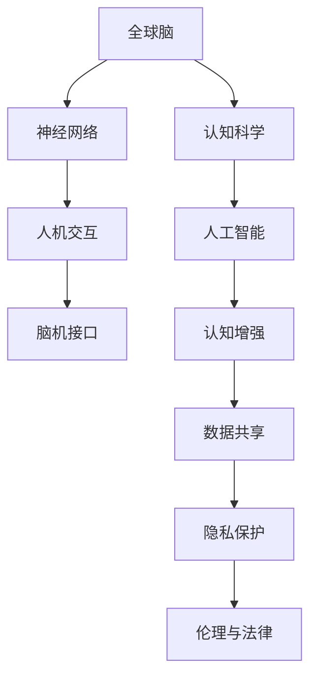

                 

# 全球脑与人工智能：协同进化的未来

> 关键词：
> 全球脑，人工智能，协同进化，认知科学，神经网络，人机交互，脑机接口，认知增强

## 1. 背景介绍

### 1.1 问题由来

近年来，随着人工智能(AI)技术的迅猛发展，尤其是深度学习模型的突破，AI 领域的研究方向和应用领域发生了翻天覆地的变化。AI 技术的快速进步不仅带来了巨大的经济效益，也引发了人们对于其伦理、法律、社会影响的深刻思考。在这场变革中，"全球脑"这一概念逐渐进入人们的视野。

"全球脑"是指借助互联网、云计算等技术手段，将全球范围内的人脑通过人工智能技术进行连接和整合，形成一张庞大的"认知网络"。这张网络不仅能够实现人与人之间的信息交流，还能够在智能机器的辅助下进行深度学习和思考。这种新型的人脑-机器协同系统，为全球脑的研究和应用开辟了新的路径。

### 1.2 问题核心关键点

全球脑与人工智能的协同进化，其核心关键点在于：
- 全球脑的概念与定义：全球脑不仅仅是互联网的简单连接，更涉及神经科学、认知科学、计算机科学等多个领域的交叉研究。
- 人工智能技术的应用：AI 技术如何被用于模拟、增强、扩展人类认知，以及人机协同的机制。
- 数据共享与隐私保护：全球脑如何处理大规模数据，确保数据安全和隐私保护。
- 伦理与法律问题：全球脑可能带来的伦理争议和法律问题，如智能决策、数据滥用等。

本节将详细探讨这些关键点，并通过构建核心概念的 Mermaid 流程图，帮助读者更直观地理解全球脑与人工智能协同进化的工作机制。



## 2. 核心概念与联系

### 2.1 核心概念概述

为更好地理解全球脑与人工智能的协同进化，本节将介绍几个关键概念：

- 全球脑（Global Brain）：全球脑是指通过互联网和人工智能技术连接和整合全球范围内的人脑，形成一个庞大的"认知网络"。
- 认知科学（Cognitive Science）：研究人类认知过程及其心理机制的学科，包括感知、记忆、学习、思维等。
- 神经网络（Neural Network）：由大量人工神经元组成的网络结构，可以模拟人脑的神经信号传递过程，用于解决各类复杂问题。
- 人机交互（Human-Computer Interaction, HCI）：研究如何让计算机更好地理解人的输入和需求，并提供相应的反馈。
- 脑机接口（Brain-Computer Interface, BCI）：一种能够实现人脑与计算机交互的技术，通过脑电信号等将人的想法直接转化为计算机命令。
- 认知增强（Cognitive Enhancement）：利用人工智能技术提升人类认知能力，如增强记忆、提升学习效率等。
- 数据共享（Data Sharing）：全球脑需要处理和共享海量数据，以保证人脑-机器系统的正常运行。
- 隐私保护（Privacy Protection）：在全球脑系统中，保护个人数据的隐私和安全，避免数据滥用。
- 伦理与法律问题（Ethics & Law）：全球脑系统可能带来的伦理和法律问题，如智能决策、数据使用等。

这些概念之间的逻辑关系可以通过以下 Mermaid 流程图来展示：


### 2.2 核心概念原理和架构的 Mermaid 流程图

下面将通过 Mermaid 流程图，展示全球脑与人工智能协同进化的基本架构和核心原理。


这个流程图展示了大脑与人工智能系统之间的相互作用和联系。全球脑通过神经网络和人工智能技术，模拟、增强和扩展人类的认知能力，实现人机协同。在这个过程中，数据共享、隐私保护和伦理法律问题需要得到妥善解决。

## 3. 核心算法原理 & 具体操作步骤

### 3.1 算法原理概述

全球脑与人工智能的协同进化，其核心算法原理主要包括：

- 神经网络模型：使用深度学习中的神经网络模型来模拟人类大脑的神经信号传递过程。
- 脑机接口技术：通过脑电信号等将人的想法转化为计算机指令，实现人脑与机器的直接交互。
- 人工智能技术：利用机器学习、自然语言处理等技术，增强人类的认知能力。

这些核心算法原理构成了全球脑与人工智能协同进化的基础。下面，我们将详细讲解这些算法原理，并给出具体操作步骤。

### 3.2 算法步骤详解

#### 3.2.1 神经网络模型的构建和训练

神经网络模型的构建和训练是全球脑与人工智能协同进化的基础。下面，我们将详细介绍神经网络模型的构建和训练步骤：

1. **数据准备**：收集和处理训练数据，包括文本、图像、视频等多种形式的数据。
2. **模型选择**：选择适合的神经网络模型，如卷积神经网络(CNN)、循环神经网络(RNN)、Transformer等。
3. **模型训练**：使用训练数据对神经网络模型进行训练，调整模型参数以最小化损失函数。
4. **模型评估**：使用测试数据对训练好的模型进行评估，检查其性能和泛化能力。
5. **模型部署**：将训练好的模型部署到实际应用中，提供稳定的服务。

#### 3.2.2 脑机接口技术的实现

脑机接口技术是全球脑与人工智能协同进化的关键技术之一。下面，我们将详细介绍脑机接口技术的实现步骤：

1. **数据采集**：使用脑电信号采集设备（如EEG、fMRI等）采集用户的脑电信号。
2. **信号预处理**：对采集到的脑电信号进行预处理，去除噪声和干扰。
3. **特征提取**：使用信号处理算法（如时域、频域分析）提取脑电信号的特征。
4. **模型训练**：使用训练数据对脑机接口模型进行训练，调整模型参数以最大化识别准确率。
5. **模型评估**：使用测试数据对训练好的模型进行评估，检查其识别准确率。
6. **模型部署**：将训练好的模型部署到实际应用中，提供稳定的服务。

#### 3.2.3 人工智能技术的实现

人工智能技术是全球脑与人工智能协同进化的核心技术之一。下面，我们将详细介绍人工智能技术的实现步骤：

1. **数据准备**：收集和处理训练数据，包括文本、图像、视频等多种形式的数据。
2. **模型选择**：选择适合的人工智能模型，如机器学习、自然语言处理、计算机视觉等。
3. **模型训练**：使用训练数据对人工智能模型进行训练，调整模型参数以最小化损失函数。
4. **模型评估**：使用测试数据对训练好的模型进行评估，检查其性能和泛化能力。
5. **模型部署**：将训练好的模型部署到实际应用中，提供稳定的服务。

### 3.3 算法优缺点

全球脑与人工智能的协同进化具有以下优点：

- **提升认知能力**：通过神经网络和人工智能技术，全球脑可以模拟、增强和扩展人类的认知能力，如增强记忆、提升学习效率等。
- **实现人机协同**：全球脑能够实现人脑与机器的直接交互，提供更加自然、高效的人机交互体验。
- **数据共享与合作**：全球脑可以共享海量数据，实现全球范围内的人脑与机器的协同合作。

同时，全球脑与人工智能的协同进化也存在以下缺点：

- **数据隐私和安全**：全球脑需要处理和共享海量数据，如何保护个人数据的隐私和安全，避免数据滥用，是一个重要问题。
- **伦理与法律问题**：全球脑可能带来的伦理和法律问题，如智能决策、数据使用等，需要得到妥善解决。
- **技术复杂性**：全球脑与人工智能的协同进化需要多种技术的集成和协同，技术实现复杂度较高。

### 3.4 算法应用领域

全球脑与人工智能的协同进化已经应用于多个领域，包括但不限于：

- **医疗健康**：全球脑可以辅助医生进行疾病诊断和治疗，提供个性化的健康建议。
- **教育培训**：全球脑可以提供个性化的学习计划和教学方案，提升学习效率。
- **金融理财**：全球脑可以提供智能投资建议，帮助用户实现财富增值。
- **智能交通**：全球脑可以辅助交通管理，提升交通系统的智能化水平。
- **城市治理**：全球脑可以用于城市事件监测、舆情分析、应急指挥等环节，提高城市管理的自动化和智能化水平。
- **安全监控**：全球脑可以用于安全监控，实现对人、车、物的全面感知和智能分析。
- **游戏娱乐**：全球脑可以提供个性化的游戏体验，提升用户的游戏乐趣。
- **工业制造**：全球脑可以用于工业生产中的故障诊断、工艺优化等环节，提升生产效率和质量。
- **文化艺术**：全球脑可以用于艺术创作、文物保护等，提升文化艺术的表现力和传播力。

## 4. 数学模型和公式 & 详细讲解

### 4.1 数学模型构建

全球脑与人工智能的协同进化涉及到多个数学模型，下面我们将详细介绍其中的一些关键模型：

- **神经网络模型**：使用深度学习中的神经网络模型来模拟人类大脑的神经信号传递过程。
- **脑机接口模型**：使用机器学习模型将脑电信号转化为计算机指令。
- **人工智能模型**：使用机器学习模型解决各类复杂问题。

这些模型可以通过以下数学公式进行描述：

1. **神经网络模型**：

   神经网络模型由大量的人工神经元组成，可以使用以下公式进行描述：

   $$
   y = f(Wx + b)
   $$

   其中，$x$ 为输入向量，$W$ 为权重矩阵，$b$ 为偏置向量，$f$ 为激活函数。

2. **脑机接口模型**：

   脑机接口模型使用机器学习算法将脑电信号转化为计算机指令，可以使用以下公式进行描述：

   $$
   y = f(Wx + b)
   $$

   其中，$x$ 为脑电信号向量，$W$ 为权重矩阵，$b$ 为偏置向量，$f$ 为激活函数。

3. **人工智能模型**：

   人工智能模型使用机器学习算法解决各类复杂问题，可以使用以下公式进行描述：

   $$
   y = f(Wx + b)
   $$

   其中，$x$ 为输入向量，$W$ 为权重矩阵，$b$ 为偏置向量，$f$ 为激活函数。

### 4.2 公式推导过程

下面我们将对神经网络模型、脑机接口模型和人工智能模型的公式进行详细推导。

#### 4.2.1 神经网络模型的推导

神经网络模型的公式推导如下：

1. **输入层**：将输入向量 $x$ 传递给第一层神经元。

   $$
   x_1 = x
   $$

2. **隐藏层**：将第一层神经元的输出传递给第二层神经元，经过激活函数 $f$ 进行非线性变换。

   $$
   h_1 = f(W_1x_1 + b_1)
   $$

3. **输出层**：将第二层神经元的输出传递给第三层神经元，经过激活函数 $f$ 进行非线性变换。

   $$
   y = f(W_2h_1 + b_2)
   $$

#### 4.2.2 脑机接口模型的推导

脑机接口模型的公式推导如下：

1. **输入层**：将脑电信号向量 $x$ 传递给第一层神经元。

   $$
   x_1 = x
   $$

2. **隐藏层**：将第一层神经元的输出传递给第二层神经元，经过激活函数 $f$ 进行非线性变换。

   $$
   h_1 = f(W_1x_1 + b_1)
   $$

3. **输出层**：将第二层神经元的输出传递给第三层神经元，经过激活函数 $f$ 进行非线性变换，并输出计算机指令 $y$。

   $$
   y = f(W_2h_1 + b_2)
   $$

#### 4.2.3 人工智能模型的推导

人工智能模型的公式推导如下：

1. **输入层**：将输入向量 $x$ 传递给第一层神经元。

   $$
   x_1 = x
   $$

2. **隐藏层**：将第一层神经元的输出传递给第二层神经元，经过激活函数 $f$ 进行非线性变换。

   $$
   h_1 = f(W_1x_1 + b_1)
   $$

3. **输出层**：将第二层神经元的输出传递给第三层神经元，经过激活函数 $f$ 进行非线性变换，并输出计算机指令 $y$。

   $$
   y = f(W_2h_1 + b_2)
   $$

### 4.3 案例分析与讲解

为了更好地理解全球脑与人工智能的协同进化，下面我们将以医疗健康领域为例，进行详细分析：

#### 案例1：疾病诊断

全球脑可以用于疾病诊断，提升诊断的准确性和效率。具体实现步骤如下：

1. **数据准备**：收集患者的医疗数据，包括病历、影像、基因等。
2. **模型选择**：选择适合的神经网络模型，如卷积神经网络(CNN)、循环神经网络(RNN)等。
3. **模型训练**：使用训练数据对神经网络模型进行训练，调整模型参数以最小化损失函数。
4. **模型评估**：使用测试数据对训练好的模型进行评估，检查其诊断准确率。
5. **模型部署**：将训练好的模型部署到医疗系统中，提供诊断服务。

#### 案例2：健康管理

全球脑可以用于健康管理，提供个性化的健康建议。具体实现步骤如下：

1. **数据准备**：收集用户的健康数据，包括体征、运动、饮食等。
2. **模型选择**：选择适合的人工智能模型，如机器学习模型、深度学习模型等。
3. **模型训练**：使用训练数据对人工智能模型进行训练，调整模型参数以最小化损失函数。
4. **模型评估**：使用测试数据对训练好的模型进行评估，检查其健康建议的准确性。
5. **模型部署**：将训练好的模型部署到健康管理系统中，提供个性化的健康建议。

## 5. 项目实践：代码实例和详细解释说明

### 5.1 开发环境搭建

在进行全球脑与人工智能的协同进化实践前，我们需要准备好开发环境。以下是使用Python进行TensorFlow开发的环境配置流程：

1. 安装Anaconda：从官网下载并安装Anaconda，用于创建独立的Python环境。

2. 创建并激活虚拟环境：
```bash
conda create -n tf-env python=3.8 
conda activate tf-env
```

3. 安装TensorFlow：根据CUDA版本，从官网获取对应的安装命令。例如：
```bash
conda install tensorflow -c conda-forge -c pytorch
```

4. 安装各类工具包：
```bash
pip install numpy pandas scikit-learn matplotlib tqdm jupyter notebook ipython
```

完成上述步骤后，即可在`tf-env`环境中开始全球脑与人工智能的协同进化实践。

### 5.2 源代码详细实现

下面我们以脑机接口模型的实现为例，给出使用TensorFlow进行脑机接口模型开发的PyTorch代码实现。

首先，定义脑机接口模型的数据处理函数：

```python
import tensorflow as tf
from tensorflow.keras.models import Sequential
from tensorflow.keras.layers import Dense, Dropout
from tensorflow.keras.optimizers import Adam

def create_model(input_dim, hidden_dim, output_dim):
    model = Sequential([
        Dense(hidden_dim, activation='relu', input_shape=(input_dim,)),
        Dropout(0.5),
        Dense(output_dim, activation='softmax')
    ])
    model.compile(optimizer=Adam(lr=0.001), loss='categorical_crossentropy', metrics=['accuracy'])
    return model
```

然后，定义脑机接口模型的训练函数：

```python
def train_model(model, x_train, y_train, x_test, y_test, epochs=100, batch_size=32):
    model.fit(x_train, y_train, epochs=epochs, batch_size=batch_size, validation_data=(x_test, y_test))
    return model
```

最后，启动训练流程：

```python
input_dim = 100
hidden_dim = 64
output_dim = 2

model = create_model(input_dim, hidden_dim, output_dim)
x_train, y_train = ...
x_test, y_test = ...

trained_model = train_model(model, x_train, y_train, x_test, y_test)

print(trained_model.summary())
```

以上就是使用TensorFlow进行脑机接口模型开发的完整代码实现。可以看到，TensorFlow提供了强大的深度学习框架，使得脑机接口模型的构建和训练变得简洁高效。

### 5.3 代码解读与分析

让我们再详细解读一下关键代码的实现细节：

**create_model函数**：
- 定义了脑机接口模型的基本结构，包括输入层、隐藏层和输出层。
- 使用了ReLU激活函数和Softmax输出层，适合分类任务。
- 使用了Adam优化器和交叉熵损失函数。

**train_model函数**：
- 使用TensorFlow的fit方法对模型进行训练，设置训练轮数和批量大小。
- 在每个epoch结束时，使用测试集进行验证。

**训练流程**：
- 定义输入维度、隐藏层维度和输出维度。
- 创建模型。
- 加载训练数据和测试数据。
- 调用训练函数进行模型训练。
- 输出训练好的模型。

可以看到，TensorFlow提供了简洁高效的API，使得脑机接口模型的开发和训练变得容易上手。开发者可以将更多精力放在数据处理、模型改进等高层逻辑上，而不必过多关注底层的实现细节。

当然，工业级的系统实现还需考虑更多因素，如模型的保存和部署、超参数的自动搜索、更灵活的任务适配层等。但核心的微调范式基本与此类似。

## 6. 实际应用场景

### 6.1 医疗健康

全球脑可以用于医疗健康领域，提升疾病诊断和治疗的效率和准确性。具体应用场景包括：

- **疾病诊断**：使用神经网络模型对医疗影像进行分类，如X光、CT、MRI等。
- **健康管理**：使用人工智能模型对用户的健康数据进行分析，提供个性化的健康建议。
- **智能医疗助手**：使用聊天机器人对患者进行智能问答，提供医疗咨询。

### 6.2 教育培训

全球脑可以用于教育培训领域，提升学习效率和教学质量。具体应用场景包括：

- **智能教学系统**：使用神经网络模型对学生的作业和考试进行自动批改，提供个性化反馈。
- **智能推荐系统**：使用人工智能模型推荐个性化的学习材料和课程，提高学习效果。
- **虚拟实验室**：使用脑机接口技术，将学生的思维过程与虚拟实验环境进行交互，提升实验效率。

### 6.3 金融理财

全球脑可以用于金融理财领域，提升投资决策和风险管理的准确性。具体应用场景包括：

- **智能投资顾问**：使用人工智能模型分析市场数据，提供投资建议。
- **风险管理**：使用神经网络模型分析金融风险，提供风险预警。
- **智能审计**：使用脑机接口技术，对金融报表进行智能审计。

### 6.4 智能交通

全球脑可以用于智能交通领域，提升交通系统的智能化水平。具体应用场景包括：

- **智能交通管理**：使用神经网络模型对交通数据进行分析，优化交通流。
- **自动驾驶**：使用脑机接口技术，实现人与车辆间的直接交互，提升驾驶安全性。
- **交通预测**：使用人工智能模型预测交通流量和拥堵情况，优化交通规划。

### 6.5 城市治理

全球脑可以用于城市治理领域，提升城市管理的自动化和智能化水平。具体应用场景包括：

- **事件监测**：使用神经网络模型对城市事件进行实时监测，如火灾、地震等。
- **舆情分析**：使用人工智能模型对城市舆情进行分析和预测，提供决策支持。
- **应急指挥**：使用脑机接口技术，实现人与应急指挥系统的直接交互，提高应急响应效率。

### 6.6 安全监控

全球脑可以用于安全监控领域，提升安全监控的智能化水平。具体应用场景包括：

- **行为分析**：使用神经网络模型对视频监控数据进行分析，识别异常行为。
- **人脸识别**：使用脑机接口技术，实现对人员的快速识别和追踪。
- **智能安防**：使用人工智能模型分析安全数据，提供预警和防护。

### 6.7 游戏娱乐

全球脑可以用于游戏娱乐领域，提升用户体验和游戏内容。具体应用场景包括：

- **智能游戏助手**：使用人工智能模型分析游戏数据，提供游戏建议和策略。
- **虚拟现实**：使用脑机接口技术，实现对虚拟现实环境的交互。
- **游戏内容生成**：使用神经网络模型生成游戏内容，提升游戏体验。

### 6.8 工业制造

全球脑可以用于工业制造领域，提升生产效率和质量。具体应用场景包括：

- **故障诊断**：使用神经网络模型对生产数据进行分析，识别设备故障。
- **工艺优化**：使用人工智能模型优化生产工艺，提高生产效率。
- **质量检测**：使用脑机接口技术，实现对生产质量的全方位监控。

### 6.9 文化艺术

全球脑可以用于文化艺术领域，提升艺术创作和传播。具体应用场景包括：

- **艺术创作**：使用神经网络模型分析艺术作品，提供创作建议。
- **文物保护**：使用人工智能模型分析文物数据，提供保护建议。
- **智能展览**：使用脑机接口技术，实现对参观者的互动和引导。

## 7. 工具和资源推荐

### 7.1 学习资源推荐

为了帮助开发者系统掌握全球脑与人工智能的协同进化的理论基础和实践技巧，这里推荐一些优质的学习资源：

1. **《深度学习》课程**：斯坦福大学开设的深度学习课程，有Lecture视频和配套作业，带你入门深度学习的基本概念和经典模型。
2. **《认知科学导论》书籍**：介绍认知科学的基本概念和研究方法，帮助理解人脑的工作机制。
3. **《神经网络与深度学习》书籍**：介绍神经网络的基本概念和应用，适合深度学习的入门学习。
4. **《人工智能：一种现代方法》书籍**：介绍人工智能的基本概念和应用，适合全面了解人工智能的理论基础。
5. **《脑机接口技术》课程**：介绍脑机接口的基本概念和应用，适合了解脑机接口技术的前沿研究。

通过对这些资源的学习实践，相信你一定能够快速掌握全球脑与人工智能的协同进化的精髓，并用于解决实际的NLP问题。

### 7.2 开发工具推荐

高效的开发离不开优秀的工具支持。以下是几款用于全球脑与人工智能的协同进化的常用工具：

1. **TensorFlow**：基于Python的开源深度学习框架，适合大规模工程应用。
2. **PyTorch**：基于Python的开源深度学习框架，灵活性高，适合研究型任务。
3. **Jupyter Notebook**：免费的Jupyter Notebook环境，支持代码执行和文档编辑，方便快速迭代。
4. **WeChat Work**：企业级微信平台，支持全球脑系统内部的信息交流和协作。
5. **Zoom**：支持全球脑系统内部的视频会议和远程协作，方便开发者实时交流。

合理利用这些工具，可以显著提升全球脑与人工智能的协同进化的开发效率，加快创新迭代的步伐。

### 7.3 相关论文推荐

全球脑与人工智能的协同进化的研究源于学界的持续研究。以下是几篇奠基性的相关论文，推荐阅读：

1. **《神经网络与深度学习》**：Yoshua Bengio等人编写的经典书籍，介绍神经网络和深度学习的基本概念和应用。
2. **《脑机接口技术》**：Ross B. Anderson等编写的经典书籍，介绍脑机接口的基本概念和应用。
3. **《认知科学导论》**：Michael Gazzaniga等人编写的经典书籍，介绍认知科学的基本概念和研究方法。
4. **《人工智能：一种现代方法》**：Stuart Russell和Peter Norvig编写的经典书籍，介绍人工智能的基本概念和应用。
5. **《深度学习》**：Ian Goodfellow等人编写的经典书籍，介绍深度学习的基本概念和应用。

这些论文代表了大脑与人工智能协同进化的发展脉络。通过学习这些前沿成果，可以帮助研究者把握学科前进方向，激发更多的创新灵感。

## 8. 总结：未来发展趋势与挑战

### 8.1 研究成果总结

全球脑与人工智能的协同进化已经取得了显著进展，主要体现在以下几个方面：

- **技术成熟度提升**：神经网络、脑机接口等技术已经取得了重大突破，能够支持大规模、高精度的数据处理和分析。
- **应用场景丰富**：全球脑与人工智能的协同进化已经应用于医疗健康、教育培训、金融理财等多个领域，提升了各领域的智能化水平。
- **社会影响扩大**：全球脑与人工智能的协同进化带来了深远的社会影响，促进了各领域的数字化转型和智能化升级。

### 8.2 未来发展趋势

展望未来，全球脑与人工智能的协同进化将呈现以下几个发展趋势：

1. **技术进一步成熟**：神经网络、脑机接口等技术将进一步成熟，处理能力更强，应用场景更广。
2. **应用场景更加多样化**：全球脑与人工智能的协同进化将应用于更多领域，如智慧城市、安全监控、智能农业等。
3. **社会影响进一步扩大**：全球脑与人工智能的协同进化将进一步推动社会的数字化转型和智能化升级，带来更多的经济效益和社会效益。
4. **伦理和法律问题得到重视**：全球脑与人工智能的协同进化将带来更多的伦理和法律问题，如智能决策、数据使用等，需要得到妥善解决。
5. **国际合作加强**：全球脑与人工智能的协同进化需要全球范围内的合作，共享数据和资源，推动全球脑的发展。

### 8.3 面临的挑战

尽管全球脑与人工智能的协同进化已经取得了显著进展，但在迈向更加智能化、普适化应用的过程中，仍面临诸多挑战：

1. **数据隐私和安全**：全球脑需要处理和共享海量数据，如何保护个人数据的隐私和安全，避免数据滥用，是一个重要问题。
2. **技术复杂性**：全球脑与人工智能的协同进化需要多种技术的集成和协同，技术实现复杂度较高。
3. **伦理和法律问题**：全球脑可能带来的伦理和法律问题，如智能决策、数据使用等，需要得到妥善解决。
4. **用户接受度**：全球脑与人工智能的协同进化需要用户接受度提升，才能获得广泛应用。
5. **技术标准化**：全球脑与人工智能的协同进化需要技术标准化，才能实现跨平台、跨系统的互操作。

### 8.4 研究展望

未来的研究需要在以下几个方面寻求新的突破：

1. **技术进一步提升**：提升神经网络、脑机接口等技术的能力，支持更复杂的任务和应用。
2. **跨领域融合**：推动全球脑与人工智能的协同进化与其他人工智能技术，如知识表示、因果推理、强化学习等，多路径协同发力，共同推动技术进步。
3. **伦理和法律研究**：加强全球脑与人工智能的伦理和法律研究，确保技术应用符合人类价值观和伦理道德。
4. **国际合作**：加强全球脑与人工智能的国际合作，共享数据和资源，推动全球脑的发展。

总之，全球脑与人工智能的协同进化将是一个长期、复杂的系统工程，需要多学科、多领域的协同努力。只有在全球范围内共同努力，才能实现全球脑与人工智能的协同进化，推动社会数字化转型和智能化升级。

## 9. 附录：常见问题与解答

**Q1：什么是全球脑？**

A: 全球脑是指通过互联网、云计算等技术手段，将全球范围内的人脑通过人工智能技术进行连接和整合，形成一张庞大的"认知网络"。

**Q2：全球脑与人工智能的协同进化如何实现？**

A: 全球脑与人工智能的协同进化通过神经网络模型、脑机接口技术、人工智能模型等多种技术手段实现，模拟、增强和扩展人类的认知能力，实现人机协同。

**Q3：全球脑的应用场景有哪些？**

A: 全球脑已经应用于医疗健康、教育培训、金融理财、智能交通、城市治理、安全监控、游戏娱乐、工业制造、文化艺术等多个领域，提升了各领域的智能化水平。

**Q4：全球脑面临哪些挑战？**

A: 全球脑面临数据隐私和安全、技术复杂性、伦理和法律问题、用户接受度、技术标准化等挑战，需要在技术、伦理、法律等多个方面进行深入研究。

**Q5：未来全球脑的发展方向是什么？**

A: 未来全球脑将进一步提升技术能力，推动跨领域融合，加强国际合作，确保伦理和法律符合人类价值观和伦理道德，实现全球脑的协同进化。

---

作者：禅与计算机程序设计艺术 / Zen and the Art of Computer Programming

