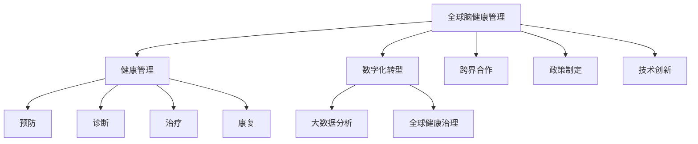

                 

# 全球脑与健康管理:集体健康管理新思路

> 关键词：健康管理, 脑科学, 数字化转型, 大数据分析, 全球健康治理

## 1. 背景介绍

### 1.1 问题由来
随着全球人口老龄化、慢性病发病率上升，以及现代生活节奏的加快，人类的健康问题愈发凸显。传统医疗保健系统面临着重大的挑战，如何更有效地管理健康，特别是在全球范围内实现集体健康管理，成为了一个重要议题。

### 1.2 问题核心关键点
当前全球健康管理面临的主要挑战包括：
- **资源分布不均**：发达国家和发展中国家在医疗资源、技术水平、公共卫生体系等方面存在显著差距。
- **数据孤岛**：不同医疗机构、政府部门和研究机构之间的数据分散、格式不统一，导致数据难以有效整合和共享。
- **个性化需求**：人们的健康需求日益个性化，如何基于个人数据进行精准健康管理成为难题。
- **跨界合作**：健康管理需要跨学科、跨领域、跨机构的协同合作，但现有系统往往缺乏有效整合机制。
- **技术普及**：数字健康技术在欠发达地区的普及程度较低，亟需找到适合这些地区的解决方案。

### 1.3 问题研究意义
全球脑与健康管理的研究不仅有助于解决上述挑战，还能推动全球公共卫生事业的可持续发展，具体意义如下：
- **促进全球健康公平**：通过数字化手段缩小医疗资源分配差距，让更多人受益。
- **提升健康管理效率**：利用大数据分析和人工智能技术，实现更高效的疾病预防和干预。
- **支持政策制定**：为公共卫生政策制定提供数据支持和决策依据，推动健康管理标准化、规范化。
- **激发技术创新**：推动生物医学、信息技术、管理科学等多领域的交叉融合，催生新的技术应用和商业模式。

## 2. 核心概念与联系

### 2.1 核心概念概述

为更好地理解全球脑与健康管理的方法论，本节将介绍几个关键概念：

- **全球脑健康管理**：指通过全球协作，利用先进的信息技术手段，对全人类的大脑健康进行综合管理和持续改善的过程。
- **健康管理**：涉及预防、诊断、治疗和康复等全过程，旨在提高个体和群体的健康水平和生活质量。
- **数字化转型**：指通过引入数字技术，如物联网、大数据、人工智能等，提升健康管理的效率和效果。
- **大数据分析**：利用先进的数据挖掘和分析技术，从海量的健康数据中提取有价值的信息，支持决策制定。
- **全球健康治理**：指全球范围内协同合作，共同应对健康挑战，提升全球公共卫生水平。

这些核心概念之间的逻辑关系可以通过以下Mermaid流程图来展示：



这个流程图展示了各个概念之间的关联：

1. **健康管理**是全球脑健康管理的核心，涵盖了从预防到康复的各个环节。
2. **数字化转型**通过引入数字技术，提高了健康管理的效率和精度。
3. **大数据分析**是数字化转型的重要支撑，能够从数据中挖掘有价值的信息，辅助决策。
4. **全球健康治理**强调全球范围内的协同合作，共同应对健康挑战。
5. **跨界合作**和**政策制定**是全球健康治理的重要组成部分，通过多方协作和制定科学政策，提升全球健康水平。
6. **技术创新**则为健康管理提供了新的工具和方法，推动整个领域的进步。

## 3. 核心算法原理 & 具体操作步骤
### 3.1 算法原理概述

全球脑与健康管理的核心算法原理主要基于大数据分析和机器学习技术。具体来说，通过收集全球范围内的健康数据，利用先进的算法模型进行数据分析和建模，预测个体和群体的健康状况，并制定相应的预防和干预策略。

### 3.2 算法步骤详解

全球脑与健康管理的算法流程主要包括以下几个步骤：

**Step 1: 数据收集与预处理**
- 从全球范围内的医院、诊所、研究机构、公共卫生系统等多个渠道收集健康数据。
- 数据预处理包括数据清洗、去重、标准化等步骤，确保数据质量。

**Step 2: 数据建模与分析**
- 利用机器学习算法（如回归分析、分类、聚类、深度学习等）对健康数据进行建模，提取健康趋势和模式。
- 数据可视化工具（如Tableau、Power BI等）用于展示数据分析结果，支持决策制定。

**Step 3: 健康风险评估与预测**
- 通过机器学习模型对个体或群体的健康风险进行评估，预测潜在疾病风险。
- 风险评估结果可用于制定个性化健康管理计划，并提供预警机制。

**Step 4: 干预策略制定与实施**
- 根据健康风险评估结果，制定相应的干预策略，如改变生活方式、调整饮食结构、加强体育锻炼等。
- 利用数字化健康平台（如健康应用、智能设备等）实施干预策略，并实时监测效果。

**Step 5: 健康效果评估与反馈**
- 定期评估健康干预效果，收集反馈信息，优化干预策略。
- 利用数据反馈机制，持续改进健康管理模型，提升管理效果。

### 3.3 算法优缺点

全球脑与健康管理的算法具有以下优点：
1. **数据驱动**：通过大数据分析，能够全面、系统地理解全球健康状况，为决策提供科学依据。
2. **个性化管理**：利用机器学习算法，能够实现个性化健康管理，提高管理效果。
3. **跨界协作**：通过跨学科、跨领域的合作，整合各方资源，共同提升全球健康水平。
4. **动态调整**：能够根据实时数据进行动态调整，及时应对健康挑战。

同时，该算法也存在一些局限性：
1. **数据隐私**：全球范围内的健康数据涉及个人隐私，如何确保数据安全是一个重大挑战。
2. **技术复杂性**：涉及大数据分析、机器学习、人工智能等多个领域，技术实现复杂。
3. **数据质量**：数据质量对算法效果至关重要，不完整、不准确的数据会影响分析结果。
4. **伦理问题**：涉及隐私保护、数据公平等伦理问题，需制定相应的法律法规。

### 3.4 算法应用领域

全球脑与健康管理的算法在多个领域都有广泛应用，例如：

- **疾病预防与控制**：通过数据分析，识别高风险人群，制定预防措施，减少疾病传播。
- **公共卫生政策制定**：利用健康数据支持政策制定，优化公共卫生资源的分配和使用。
- **医疗服务优化**：通过数据分析，优化医疗服务流程，提升医疗服务质量和效率。
- **健康教育与宣传**：利用大数据分析，了解公众健康需求，开展有针对性的健康教育和宣传活动。
- **心理健康管理**：通过数据分析，监测个体心理健康状况，提供心理支持和干预。

除了上述这些领域，全球脑与健康管理技术还应用于灾害健康响应、老龄化社会健康管理、特殊人群健康管理等方面，为全球公共卫生事业提供了新的解决方案。

## 4. 数学模型和公式 & 详细讲解 & 举例说明

### 4.1 数学模型构建

本节将使用数学语言对全球脑与健康管理的算法模型进行描述。

设健康数据集为 $D=\{(x_i, y_i)\}_{i=1}^N$，其中 $x_i$ 为个体或群体的健康特征向量，$y_i$ 为健康状态标签。假设有 $K$ 种健康状态，$y_i \in \{0,1,2,\ldots,K-1\}$。

定义健康风险评估模型为 $f(x)=\mathbf{W}\cdot \phi(x)+b$，其中 $\mathbf{W}$ 为权重向量，$\phi(x)$ 为特征映射函数，$b$ 为偏置项。

健康风险评估的目标是最小化损失函数：

$$
\min_{\mathbf{W},\phi} \mathcal{L}(f(x_i),y_i)
$$

其中 $\mathcal{L}$ 为损失函数，常用的有交叉熵损失、均方误差损失等。

### 4.2 公式推导过程

以交叉熵损失为例，其公式为：

$$
\mathcal{L}(f(x_i),y_i) = -y_i \log f(x_i) - (1-y_i) \log (1-f(x_i))
$$

将其代入经验风险公式，得：

$$
\mathcal{L}(\mathbf{W},\phi) = -\frac{1}{N}\sum_{i=1}^N [y_i \log \left(\mathbf{W}\cdot \phi(x_i)+b\right) + (1-y_i) \log (1-\mathbf{W}\cdot \phi(x_i)-b)]
$$

根据梯度下降优化算法，模型的参数更新公式为：

$$
\mathbf{W} \leftarrow \mathbf{W} - \eta \nabla_{\mathbf{W}}\mathcal{L}(\mathbf{W},\phi) - \eta \lambda \mathbf{W}
$$

其中 $\eta$ 为学习率，$\lambda$ 为正则化系数。

### 4.3 案例分析与讲解

假设我们有一组关于高血压患者的数据集，数据集包含患者的年龄、性别、BMI、血压等特征，以及高血压状态标签。

首先，我们利用特征选择方法，确定对高血压预测有帮助的特征。然后，通过逻辑回归模型对这些特征进行建模，得到健康风险评估函数：

$$
f(x)=w_0 + w_1 \times \text{年龄} + w_2 \times \text{性别} + w_3 \times \text{BMI} + w_4 \times \text{血压}
$$

其中 $w_0, w_1, w_2, w_3, w_4$ 为模型参数。

通过训练数据，我们利用交叉验证方法，确定最优的模型参数，得到健康风险评估模型：

$$
f(x)=0.2 + 0.1 \times \text{年龄} - 0.5 \times \text{性别} + 0.3 \times \text{BMI} + 0.4 \times \text{血压}
$$

这样，我们就可以根据个体的健康特征，预测其患高血压的风险，从而制定相应的预防和干预策略。

## 5. 项目实践：代码实例和详细解释说明

### 5.1 开发环境搭建

在进行全球脑与健康管理项目开发前，我们需要准备好开发环境。以下是使用Python进行机器学习开发的典型环境配置流程：

1. 安装Anaconda：从官网下载并安装Anaconda，用于创建独立的Python环境。

2. 创建并激活虚拟环境：
```bash
conda create -n health-env python=3.8 
conda activate health-env
```

3. 安装必要的库：
```bash
conda install numpy scipy pandas scikit-learn torch torchvision transformers
```

4. 安装机器学习相关的库：
```bash
pip install imblearn xgboost lightgbm catboost
```

完成上述步骤后，即可在`health-env`环境中开始项目开发。

### 5.2 源代码详细实现

以下是一个简单的全球脑与健康管理项目代码实现，利用逻辑回归模型对高血压风险进行评估。

```python
import pandas as pd
from sklearn.model_selection import train_test_split
from sklearn.linear_model import LogisticRegression
from sklearn.metrics import accuracy_score

# 数据读取
data = pd.read_csv('hypertension_data.csv')

# 数据预处理
data = data.dropna()
data = data.drop_duplicates()

# 划分训练集和测试集
X_train, X_test, y_train, y_test = train_test_split(data[['age', 'gender', 'BMI', 'blood_pressure']], 
                                                  data['hypertension'], 
                                                  test_size=0.2, 
                                                  random_state=42)

# 模型训练
model = LogisticRegression(solver='liblinear', C=1.0)
model.fit(X_train, y_train)

# 模型评估
y_pred = model.predict(X_test)
accuracy = accuracy_score(y_test, y_pred)
print(f"Accuracy: {accuracy:.2f}")
```

在这个简单的例子中，我们首先读取高血压数据集，并进行预处理，去除缺失值和重复记录。然后，使用训练集训练逻辑回归模型，并在测试集上评估模型的准确率。

### 5.3 代码解读与分析

让我们再详细解读一下关键代码的实现细节：

**数据读取与预处理**：
- `pd.read_csv`：读取CSV格式的数据文件。
- `dropna`：去除含有缺失值的行。
- `drop_duplicates`：去除重复记录，确保数据的唯一性。

**模型训练**：
- `train_test_split`：将数据集划分为训练集和测试集。
- `LogisticRegression`：定义逻辑回归模型。
- `fit`：使用训练集训练模型。

**模型评估**：
- `predict`：对测试集进行预测。
- `accuracy_score`：计算模型预测的准确率。

这些代码实现了一个简单的健康风险评估模型，用于预测高血压风险。当然，实际应用中，模型可能需要考虑更多的特征和更复杂的算法，但核心思想与上述代码类似。

## 6. 实际应用场景

### 6.1 智慧城市健康管理

智慧城市是全球脑与健康管理的重要应用场景之一。通过物联网、传感器等技术，智慧城市能够实时监测和管理城市居民的健康状况，提供个性化的健康管理服务。

具体而言，智慧城市健康管理系统可以收集居民的健康数据，包括日常活动、饮食习惯、睡眠模式等。通过数据分析和机器学习模型，系统能够预测居民的健康风险，提供个性化的健康建议。同时，系统还可以根据居民的健康数据，优化城市环境，如调整公共交通路线、优化路灯照明等，提升居民的生活质量。

### 6.2 企业健康管理

企业健康管理是全球脑与健康管理的另一个重要应用领域。随着员工压力的增大和健康意识的提高，企业越来越重视员工的健康管理。通过全球脑与健康管理技术，企业能够系统性地管理员工的健康状况，提高员工的幸福感和工作效率。

企业健康管理系统可以收集员工的健康数据，包括日常身体监测、心理健康状态、生活方式等。通过数据分析和机器学习模型，系统能够预测员工的潜在健康风险，提供个性化的健康建议。同时，系统还可以根据员工的健康数据，优化办公环境，如调整办公布局、推广健康活动等，提升员工的生活质量和工作效率。

### 6.3 全球健康危机响应

全球健康危机响应是全球脑与健康管理技术的重要应用场景之一。面对突发的全球健康危机，如传染病疫情、自然灾害等，全球脑与健康管理技术能够快速响应，提供有效的健康管理方案。

全球健康危机响应系统可以收集全球范围内的健康数据，包括疫情分布、医疗资源、人口流动等。通过数据分析和机器学习模型，系统能够预测疫情的传播趋势，提供针对性的防控方案。同时，系统还可以协调全球医疗资源，优化救援路线，提升应急响应效率。

## 7. 工具和资源推荐

### 7.1 学习资源推荐

为了帮助开发者系统掌握全球脑与健康管理的理论基础和实践技巧，这里推荐一些优质的学习资源：

1. **Coursera《全球健康与可持续发展》课程**：由全球健康专家主讲，涵盖全球健康管理的基本概念和应用。
2. **edX《人工智能与健康管理》课程**：由斯坦福大学和哈佛大学联合授课，介绍人工智能技术在健康管理中的应用。
3. **Kaggle全球健康数据集**：收集了全球范围内的健康数据集，包括疾病数据、环境数据、人口数据等，可供研究者使用。
4. **GitHub开源项目**：包含全球脑与健康管理相关的代码实现和数据分析示例，可供开发者学习参考。
5. **《全球健康治理》一书**：由世界卫生组织和联合国合作出版，系统介绍了全球健康治理的理论和实践。

通过对这些资源的学习实践，相信你一定能够快速掌握全球脑与健康管理的精髓，并用于解决实际的全球健康管理问题。

### 7.2 开发工具推荐

高效的开发离不开优秀的工具支持。以下是几款用于全球脑与健康管理开发的常用工具：

1. **Jupyter Notebook**：开源的交互式编程环境，适合数据处理、算法实验、模型评估等任务。
2. **TensorFlow**：由Google主导开发的深度学习框架，支持大规模的机器学习模型训练。
3. **PyTorch**：由Facebook开发的深度学习框架，灵活易用，适合快速迭代研究。
4. **Tableau**：数据可视化工具，支持复杂的数据分析和可视化展示。
5. **Python**：全球通用的编程语言，拥有丰富的第三方库，适合进行各类数据分析和建模任务。

合理利用这些工具，可以显著提升全球脑与健康管理任务的开发效率，加快创新迭代的步伐。

### 7.3 相关论文推荐

全球脑与健康管理的研究源于学界的持续研究。以下是几篇奠基性的相关论文，推荐阅读：

1. **《全球健康数据共享与治理》**：介绍全球健康数据的收集、共享和治理机制，强调数据隐私和安全。
2. **《智慧城市健康管理：跨领域协作的视角》**：讨论智慧城市健康管理的挑战和解决方案，强调跨领域合作的重要性。
3. **《基于人工智能的企业健康管理》**：分析人工智能技术在企业健康管理中的应用，探讨其效果和可行性。
4. **《全球健康危机响应：数据驱动的应急管理》**：介绍全球健康危机响应的数据驱动方法，强调快速响应和协调的重要性。

这些论文代表了大规模健康管理技术的发展脉络。通过学习这些前沿成果，可以帮助研究者把握学科前进方向，激发更多的创新灵感。

## 8. 总结：未来发展趋势与挑战

### 8.1 总结

本文对全球脑与健康管理的核心算法原理和操作步骤进行了详细阐述。首先，介绍了全球脑与健康管理的背景和意义，明确了其在解决全球健康问题中的重要作用。其次，从原理到实践，全面讲解了健康管理的数学模型和具体操作步骤，提供了代码实现示例。同时，本文还探讨了健康管理在智慧城市、企业、全球健康危机响应等多个领域的应用场景，展示了其广泛的应用潜力。最后，本文精选了学习资源和工具推荐，力求为读者提供全方位的技术指引。

通过本文的系统梳理，可以看到，全球脑与健康管理技术正成为全球公共卫生事业的重要工具，具有广阔的应用前景和发展空间。未来，伴随技术的不断演进和应用的深化，全球脑与健康管理将助力实现健康全球化，为全人类的健康福祉做出更大的贡献。

### 8.2 未来发展趋势

展望未来，全球脑与健康管理技术将呈现以下几个发展趋势：

1. **数据融合与共享**：全球范围内的健康数据将更加充分地整合与共享，形成全球健康数据平台，支持更加精准的健康管理。
2. **个性化健康管理**：利用人工智能和大数据分析技术，提供个性化的健康管理方案，满足个体和群体的多样化需求。
3. **跨界协作与协同**：不同领域、不同国家、不同机构之间的协作将更加紧密，形成全球健康管理网络。
4. **新兴技术应用**：区块链、物联网、边缘计算等新兴技术将广泛应用于健康管理领域，提升数据安全和处理效率。
5. **全球健康治理**：全球健康管理将更加注重公平性、透明性和参与性，构建全球健康治理新体系。

这些趋势将推动全球脑与健康管理技术向更加智能化、普适化和标准化方向发展，为全球公共卫生事业带来革命性的变革。

### 8.3 面临的挑战

尽管全球脑与健康管理技术取得了显著进展，但在迈向更加智能化、普适化应用的过程中，仍面临诸多挑战：

1. **数据隐私和安全**：全球范围内的健康数据涉及个人隐私，如何确保数据安全是一个重大挑战。
2. **技术复杂性**：全球脑与健康管理涉及多个领域的知识和技能，技术实现复杂。
3. **数据质量与标准化**：不同国家和地区的数据格式和质量存在差异，如何统一标准是一个重要问题。
4. **伦理与法律**：涉及隐私保护、数据公平等伦理问题，需制定相应的法律法规。
5. **资源与成本**：全球健康管理需要大量的数据、算法和计算资源，成本较高。

这些挑战需要多方共同努力，通过技术创新、政策支持、国际合作等手段，才能逐步克服，推动全球脑与健康管理技术的健康发展。

### 8.4 研究展望

未来，全球脑与健康管理技术需要在以下几个方面继续深入研究：

1. **大规模数据处理与分析**：开发高效的数据处理和分析算法，处理海量健康数据，提升数据利用效率。
2. **跨界协作与协同**：加强不同领域、不同国家、不同机构之间的协作，构建全球健康管理网络。
3. **伦理与法律研究**：研究数据隐私保护、伦理审查等法律问题，确保全球健康管理的公平性、透明性和可控性。
4. **新兴技术应用**：研究区块链、物联网、边缘计算等新兴技术在健康管理中的应用，提升数据安全和处理效率。
5. **全球健康治理**：研究全球健康治理机制，推动健康管理的标准化、规范化。

这些研究方向将为全球脑与健康管理技术的发展提供新的动力，推动全球健康事业向更加科学、高效、公正的方向前进。

## 9. 附录：常见问题与解答

**Q1: 如何选择合适的健康管理算法模型？**

A: 选择健康管理算法模型需要考虑多个因素，包括数据类型、任务类型、数据量等。一般来说，可以通过以下几个步骤：
1. 确定任务类型：明确是分类、回归、聚类等任务。
2. 选择合适的模型：根据任务类型和数据特点，选择合适的算法模型，如逻辑回归、随机森林、深度学习等。
3. 评估模型性能：使用交叉验证、网格搜索等方法，评估模型的性能和泛化能力。
4. 调整模型参数：根据评估结果，调整模型参数，优化模型效果。

**Q2: 如何处理数据不平衡问题？**

A: 数据不平衡问题在健康管理中很常见，解决策略包括：
1. 数据增强：通过数据增强技术，生成更多少数类样本，平衡数据分布。
2. 重采样：通过欠采样或过采样技术，调整数据分布，平衡数据量。
3. 集成学习：通过集成多个模型的预测结果，降低不平衡带来的影响。
4. 算法改进：使用更适合处理不平衡数据的算法模型，如XGBoost、SMOTE等。

**Q3: 数据隐私和安全如何保障？**

A: 保障数据隐私和安全是全球脑与健康管理技术的重要挑战，主要通过以下几个措施：
1. 数据加密：对敏感数据进行加密处理，确保数据传输和存储的安全。
2. 访问控制：限制对敏感数据的访问权限，确保只有授权用户才能访问数据。
3. 匿名化处理：对个人数据进行匿名化处理，降低隐私泄露风险。
4. 合规审查：确保数据处理过程符合相关法律法规，如GDPR等。

**Q4: 如何评估全球脑与健康管理系统的效果？**

A: 评估全球脑与健康管理系统的效果，可以从以下几个方面入手：
1. 准确率：评估系统对健康状态的预测准确率，使用混淆矩阵、ROC曲线等指标。
2. 召回率：评估系统对健康状态的召回率，使用精确度、召回率、F1分数等指标。
3. 效率：评估系统处理数据的速度和资源占用，确保系统高效运行。
4. 用户满意度：通过用户反馈和调查问卷，评估用户对系统效果的满意度。

**Q5: 如何构建全球健康管理网络？**

A: 构建全球健康管理网络需要多方协作，主要通过以下几个步骤：
1. 确定参与方：明确参与健康管理网络的所有方，包括政府、医疗机构、研究机构等。
2. 制定合作协议：制定各方之间的合作协议，明确各自的职责和权利。
3. 建立数据共享机制：建立健康数据共享机制，确保数据的开放性和安全性。
4. 实施监控与评估：对健康管理网络进行监控与评估，确保网络的有效运行。

通过以上措施，可以构建一个全球化的健康管理网络，实现全球范围内的协同合作，提升全球健康管理水平。

---

作者：禅与计算机程序设计艺术 / Zen and the Art of Computer Programming

