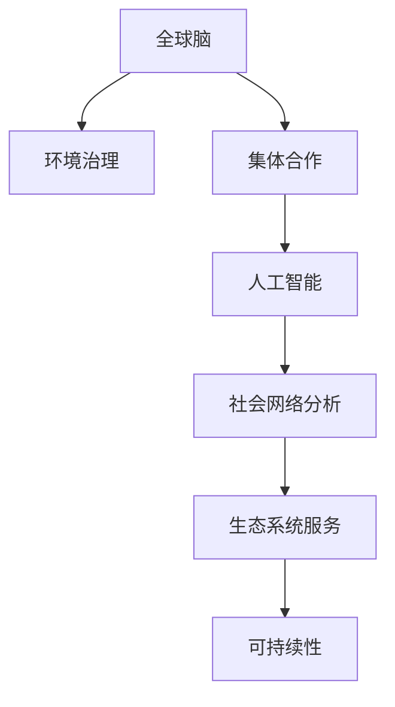

                 

# 全球脑与全球环境：集体合作的环境治理

> 关键词：
- 全球脑
- 环境治理
- 集体合作
- 人工智能
- 社会网络分析
- 生态系统服务
- 可持续性

## 1. 背景介绍

### 1.1 问题由来

全球环境危机已经成为人类面临的最重大挑战之一，从气候变化、生物多样性丧失、污染问题，到资源过度消耗，每一个问题都要求全球社会采取协调一致的行动。然而，由于全球各国间经济发展水平、文化背景、利益诉求等差异，环境治理过程中存在诸多障碍。如何实现各国间的协同合作，共同应对环境挑战，成为了一个亟待解决的重大课题。

### 1.2 问题核心关键点

全球环境治理的关键在于如何构建一个全球性的协作网络，使得各国政府、企业、非政府组织（NGOs）、公众等利益相关方能够高效沟通、共享信息、协同行动。这一协作网络可以类比为一个"全球脑"（Global Brain），其核心在于通过信息共享和协同决策机制，形成共同应对全球环境问题的智能系统。

本研究将探讨如何利用人工智能技术，特别是社会网络分析和数据挖掘技术，构建一个高效、透明、可扩展的全球环境治理"全球脑"。通过对全球环境问题的数据进行深入挖掘和分析，揭示不同国家和组织间的互动模式，从而找到提高全球环境治理效率、促进合作共治的路径。

## 2. 核心概念与联系

### 2.1 核心概念概述

为了更好地理解全球环境治理的"全球脑"模型，本节将介绍几个密切相关的核心概念：

- **全球脑（Global Brain）**：一个由全球各利益相关方构成的复杂网络，各主体通过信息流动、合作和竞争互动，共同应对全球环境问题。
- **环境治理（Environmental Governance）**：指通过制定政策、法律、标准等手段，规范人类活动对自然环境的影响，实现可持续发展。
- **集体合作（Collective Collaboration）**：全球各方共同参与，协同制定和执行环境治理策略的过程。
- **人工智能（Artificial Intelligence）**：模拟人类智能行为的技术，包括机器学习、深度学习、自然语言处理等。
- **社会网络分析（Social Network Analysis）**：研究社会网络结构及其动态演化的学科，揭示不同个体或组织之间的互动模式。
- **生态系统服务（Ecosystem Services）**：自然环境提供的支持人类生存和发展的各种服务，包括气候调节、水资源供应、空气净化等。
- **可持续性（Sustainability）**：一种平衡经济发展、社会进步与环境保护的发展模式，旨在实现长期稳定发展。

这些核心概念之间的逻辑关系可以通过以下Mermaid流程图来展示：



这个流程图展示了几组关键概念及其之间的关系：

1. 全球脑通过环境治理，推动集体合作。
2. 人工智能利用社会网络分析，支持生态系统服务。
3. 生态系统服务与可持续性密切相关。

这些概念共同构成了全球环境治理的基本框架，为实现全球脑模型提供了理论基础。

## 3. 核心算法原理 & 具体操作步骤
### 3.1 算法原理概述

构建全球脑模型的核心算法原理在于如何将全球各利益相关方的互动数据转化为有价值的信息，以支持环境治理决策。主要包括以下步骤：

1. **数据收集与预处理**：收集全球环境治理相关的各类数据，包括政策文件、环境监测数据、跨国交易数据、公众意见等，并对其进行清洗和标注。
2. **社会网络分析**：利用图论和统计学方法，分析全球利益相关方之间的互动关系，构建社会网络图。
3. **人工智能建模**：使用机器学习和深度学习算法，对社会网络图进行建模，揭示不同主体间的合作与竞争动态。
4. **决策支持**：通过预测模型和优化算法，为全球环境治理提供决策建议。

### 3.2 算法步骤详解

#### 3.2.1 数据收集与预处理

数据收集是构建全球脑模型的第一步，主要包括以下步骤：

1. **数据来源**：收集政府报告、国际组织文件、环境监测数据、跨国交易数据、公众调查数据等。
2. **数据清洗**：去除重复、噪声和异常数据，确保数据质量。
3. **数据标注**：对数据进行标签化处理，如政策文件分类、环境指标标注等。

#### 3.2.2 社会网络分析

社会网络分析主要通过图论方法，对全球环境治理网络进行建模。具体步骤包括：

1. **构建社会网络图**：将全球各利益相关方视作网络节点，各主体之间的互动关系视作边。
2. **网络结构分析**：计算网络密度、中心性、团聚性等指标，揭示网络结构和动态。
3. **社区划分**：利用聚类算法，将网络划分为不同的社区，分析社区内部的紧密联系和跨社区的交互模式。

#### 3.2.3 人工智能建模

人工智能建模主要通过机器学习和深度学习算法，对社会网络图进行分析和预测。具体步骤包括：

1. **特征提取**：从社会网络图中提取关键特征，如节点度数、中心性、社区规模等。
2. **模型训练**：使用监督学习或无监督学习算法，训练预测模型。
3. **模型评估**：通过交叉验证等方法，评估模型性能。

#### 3.2.4 决策支持

决策支持主要通过预测模型和优化算法，为全球环境治理提供决策建议。具体步骤包括：

1. **预测未来趋势**：利用历史数据训练预测模型，预测未来的环境趋势。
2. **优化策略制定**：通过优化算法，制定最优的环境治理策略。
3. **决策执行跟踪**：实时监测决策执行效果，调整策略。

### 3.3 算法优缺点

全球脑模型在构建全球环境治理协作网络方面具有以下优点：

1. **全局视角**：全球脑模型能够综合考虑全球各利益相关方的互动，提供全局视角的环境治理建议。
2. **动态分析**：通过社会网络分析和人工智能建模，实时捕捉全球环境治理网络的变化，适应动态环境。
3. **智能决策**：利用预测模型和优化算法，提供科学的决策支持，减少人为偏见。

同时，该模型也存在以下局限性：

1. **数据获取难度大**：全球范围的环境治理数据分散且复杂，获取难度大。
2. **数据质量和多样性不足**：部分地区的数据质量不高，可能导致分析结果偏差。
3. **模型复杂度高**：全球脑模型涉及大量的数据处理和算法计算，对计算资源要求较高。
4. **模型可解释性不足**：复杂的深度学习模型难以解释其内部工作机制，可能导致决策缺乏透明度。

尽管存在这些局限性，但全球脑模型为全球环境治理提供了一个全新的视角和方法，具有广阔的应用前景。

### 3.4 算法应用领域

全球脑模型在环境治理领域具有广泛的应用，具体包括以下几个方面：

1. **气候变化治理**：通过对全球各国气候政策和经济活动的网络分析，制定协调一致的减排策略。
2. **生物多样性保护**：分析全球保护组织与各国政府之间的合作网络，推动生物多样性保护措施的实施。
3. **水资源管理**：研究全球水资源供应链网络，优化水资源分配和管理策略。
4. **海洋污染控制**：分析全球海洋治理网络，制定海洋污染控制方案。
5. **森林保护**：构建全球森林保护网络，推动各国共同努力保护森林资源。

## 4. 数学模型和公式 & 详细讲解  
### 4.1 数学模型构建

全球脑模型的核心数学模型涉及图论、社会网络分析、机器学习等多个领域。以下对主要的数学模型进行简要介绍。

#### 4.1.1 社会网络模型

社会网络模型通常使用图论中的无向图来表示全球环境治理网络，其中节点表示全球各利益相关方，边表示它们之间的互动关系。

设社会网络图为 $G=(V,E)$，其中 $V$ 表示节点集合，$E$ 表示边集合。社会网络模型中的度数（degree）和中心性（centrality）等指标，可以通过以下公式计算：

$$
\text{度数}(d_i) = \sum_{j \in V} \text{edge}(i,j)
$$

$$
\text{中心性}(c_i) = \sum_{j \in V} \frac{\text{edge}(i,j)}{\text{度数}(j)}
$$

其中，$\text{edge}(i,j)$ 表示节点 $i$ 和节点 $j$ 之间存在边的数量。

#### 4.1.2 特征提取

在社会网络分析中，特征提取是关键步骤。常用的特征包括：

1. **度数**：节点与网络的连接数量。
2. **中心性**：节点的中心性指标，衡量其在网络中的重要性。
3. **社区规模**：节点所在社区的规模。
4. **网络密度**：网络中边的数量与可能边的数量之比。

#### 4.1.3 预测模型

预测模型主要通过机器学习和深度学习算法构建。常用的模型包括：

1. **随机森林（Random Forest）**：一种集成学习算法，用于分类和回归问题。
2. **支持向量机（Support Vector Machine）**：一种经典的分类算法，适合小规模数据集。
3. **神经网络（Neural Network）**：一种模拟人脑神经元网络的机器学习模型，适用于复杂数据结构。

#### 4.1.4 优化算法

优化算法主要用于策略制定和决策执行跟踪。常用的算法包括：

1. **线性规划（Linear Programming）**：一种数学规划方法，用于求解最优策略。
2. **遗传算法（Genetic Algorithm）**：一种模拟自然进化过程的优化算法，适用于复杂问题的求解。
3. **模拟退火（Simulated Annealing）**：一种基于概率的优化算法，适合求解多约束条件下的最优解。

### 4.2 公式推导过程

#### 4.2.1 社会网络模型推导

社会网络模型的度数和中心性公式可以通过以下推导过程得到：

1. **度数推导**：度数是节点与网络的连接数量，可以通过矩阵乘法表示：

$$
D = AB
$$

其中 $A$ 为节点矩阵，$B$ 为边矩阵，$D$ 为度数矩阵。

2. **中心性推导**：中心性是节点在网络中的重要性指标，可以通过度数矩阵和边矩阵表示：

$$
C = AB^T \cdot D^{-1}
$$

其中 $C$ 为中心性矩阵，$B^T$ 为边矩阵的转置，$D^{-1}$ 为度数矩阵的逆。

#### 4.2.2 预测模型推导

以随机森林为例，其预测公式为：

$$
y = \sum_{i=1}^{n} f_i(x) \cdot w_i
$$

其中 $y$ 为预测值，$x$ 为输入特征，$f_i$ 为第 $i$ 棵决策树，$w_i$ 为第 $i$ 棵树的权重。

#### 4.2.3 优化算法推导

以线性规划为例，其优化公式为：

$$
\min \text{Objective Function} \\
\text{s.t.} \quad \text{Constraints}
$$

其中，Objective Function 为目标函数，Constraints 为约束条件。

### 4.3 案例分析与讲解

#### 4.3.1 气候变化治理案例

假设我们有一个包含100个国家的环境治理网络，通过对这些国家在气候政策和经济活动方面的互动关系进行分析，发现发达国家通常具有更高的中心性，但在减排措施的制定和实施上缺乏合作。

基于此，可以构建一个以发达国家为中心的全球减排联盟，通过政策协调和资金支持，提高全球气候治理的效率。

#### 4.3.2 水资源管理案例

假设我们有一个全球水资源供应链网络，其中包含多个跨国公司、政府和NGOs。通过对这些主体间的互动关系进行分析，发现某些跨国公司在资源分配上具有较高的中心性，但在水资源保护上缺乏合作。

基于此，可以构建一个以这些公司为中心的水资源保护网络，通过政策激励和合作机制，推动全球水资源管理的可持续发展。

## 5. 项目实践：代码实例和详细解释说明
### 5.1 开发环境搭建

在进行全球脑模型实践前，我们需要准备好开发环境。以下是使用Python进行PyTorch开发的环境配置流程：

1. 安装Anaconda：从官网下载并安装Anaconda，用于创建独立的Python环境。

2. 创建并激活虚拟环境：
```bash
conda create -n globalbrain-env python=3.8 
conda activate globalbrain-env
```

3. 安装PyTorch：根据CUDA版本，从官网获取对应的安装命令。例如：
```bash
conda install pytorch torchvision torchaudio cudatoolkit=11.1 -c pytorch -c conda-forge
```

4. 安装NetworkX库：用于构建和分析社会网络图。
```bash
pip install networkx
```

5. 安装Scikit-Learn库：用于机器学习和特征提取。
```bash
pip install scikit-learn
```

完成上述步骤后，即可在`globalbrain-env`环境中开始全球脑模型的开发。

### 5.2 源代码详细实现

下面我们以全球水资源管理网络为例，给出使用NetworkX库构建和分析社会网络图的PyTorch代码实现。

首先，定义网络节点和边的数据：

```python
import networkx as nx

# 定义节点和边
nodes = ['公司A', '公司B', '政府C', '政府D', 'NGO1', 'NGO2']
edges = [('公司A', '政府C'), ('公司A', '政府D'), ('公司B', 'NGO1'), ('公司B', 'NGO2'), ('政府C', '政府D'), ('政府C', 'NGO1'), ('政府D', 'NGO2')]

# 创建无向图
G = nx.Graph()
G.add_nodes_from(nodes)
G.add_edges_from(edges)
```

然后，计算网络的中心性和社区规模：

```python
# 计算中心性
degrees = G.degree()
centralities = nx.eigenvector_centrality(G)

# 计算社区规模
communities = nx.condensation(G)
communities = [len(c) for c in communities]
```

最后，使用随机森林模型进行预测：

```python
from sklearn.ensemble import RandomForestClassifier
from sklearn.model_selection import train_test_split

# 定义特征和标签
features = [degrees.values(), centralities.values()]
labels = ['水资源保护', '不保护']

# 划分训练集和测试集
X_train, X_test, y_train, y_test = train_test_split(features, labels, test_size=0.2, random_state=42)

# 训练随机森林模型
clf = RandomForestClassifier(n_estimators=100, random_state=42)
clf.fit(X_train, y_train)

# 预测测试集
y_pred = clf.predict(X_test)
```

以上就是使用NetworkX和Scikit-Learn库构建和分析全球脑模型的完整代码实现。可以看到，通过简单的网络构建和特征提取，就可以使用机器学习模型对全球水资源管理网络进行预测和分析。

### 5.3 代码解读与分析

让我们再详细解读一下关键代码的实现细节：

**节点和边的定义**：
- `nodes`列表：定义全球水资源管理网络中的各个节点（公司、政府、NGO等）。
- `edges`列表：定义节点之间的边，表示它们之间的互动关系。

**无向图构建**：
- `G = nx.Graph()`：创建一个无向图。
- `G.add_nodes_from(nodes)` 和 `G.add_edges_from(edges)`：添加节点和边到图中。

**中心性和社区规模计算**：
- `degrees = G.degree()`：计算每个节点的度数。
- `centralities = nx.eigenvector_centrality(G)`：计算每个节点的中心性。
- `communities = nx.condensation(G)`：将图进行凝聚，得到社区的规模。

**预测模型训练**：
- `X_train, X_test, y_train, y_test = train_test_split(features, labels, test_size=0.2, random_state=42)`：将特征和标签划分为训练集和测试集。
- `clf = RandomForestClassifier(n_estimators=100, random_state=42)`：定义随机森林模型，设置参数。
- `clf.fit(X_train, y_train)`：训练模型。
- `y_pred = clf.predict(X_test)`：在测试集上进行预测。

可以看到，通过简单的代码实现，全球脑模型可以高效地构建、分析和预测全球环境治理网络。开发者可以根据具体任务的需求，进一步优化模型的参数和特征提取方式，以提高预测精度和模型性能。

## 6. 实际应用场景

### 6.1 智能城市治理

全球脑模型在智能城市治理中具有广泛的应用前景，通过实时监测和分析城市中的各类数据，可以为城市管理提供科学决策支持。

具体而言，可以收集城市的交通、能源、环境等各类数据，构建城市治理网络，分析各利益相关方（政府、企业、市民等）之间的互动关系。通过预测模型和优化算法，制定最优的城市管理策略，如交通优化、能源节约、环境治理等。

### 6.2 全球气候变化应对

全球脑模型可以为全球气候变化应对提供有力的决策支持。通过对全球各国家在气候政策和经济活动方面的互动关系进行分析，制定协同减排策略，提高全球气候治理的效率。

具体应用场景包括：

- **跨国政策协调**：分析不同国家之间的气候政策和互动关系，制定协同减排的国际协议。
- **资金和技术的全球调配**：通过模型预测，确定资金和技术的最佳分配方案，帮助发展中国家应对气候变化。
- **碳市场机制设计**：构建全球碳市场网络，设计合理的碳交易规则，促进全球减排。

### 6.3 公共卫生安全

全球脑模型在公共卫生安全领域也有广泛的应用，通过分析全球各国家在公共卫生事件中的互动关系，可以为全球公共卫生安全提供决策支持。

具体应用场景包括：

- **疾病传播分析**：通过分析各国之间的医疗资源共享和公共卫生政策，预测疾病传播路径。
- **疫苗分配策略**：构建全球疫苗分配网络，制定最优的疫苗分配方案，确保疫苗公平分配。
- **公共卫生合作机制设计**：分析全球公共卫生合作网络，制定合作机制，提高全球公共卫生应急响应能力。

## 7. 工具和资源推荐
### 7.1 学习资源推荐

为了帮助开发者系统掌握全球脑模型和环境治理的技术，这里推荐一些优质的学习资源：

1. **《全球环境治理中的社会网络分析》**：由环境治理专家撰写，深入浅出地介绍了社会网络分析在环境治理中的应用。

2. **《全球气候变化与人工智能》**：讨论了人工智能在气候变化预测和应对中的作用，提供了丰富的案例和算法。

3. **《社会网络分析导论》**：详细介绍了社会网络分析的理论和方法，适合初学者入门。

4. **《人工智能与环境治理》**：探讨了人工智能在环境治理中的各种应用场景，提供了实际案例分析。

5. **Kaggle环境数据集**：Kaggle平台提供了丰富的环境治理数据集，可用于模型训练和实践。

通过对这些资源的学习实践，相信你一定能够快速掌握全球脑模型和环境治理的技术，并用于解决实际的环境问题。

### 7.2 开发工具推荐

高效的开发离不开优秀的工具支持。以下是几款用于全球脑模型开发常用的工具：

1. **PyTorch**：基于Python的开源深度学习框架，灵活的计算图设计，适合复杂模型训练和优化。

2. **NetworkX**：Python中的社会网络分析库，支持图论相关算法的实现。

3. **Jupyter Notebook**：强大的交互式编程环境，支持代码实时调试和展示。

4. **TensorBoard**：用于可视化和监控模型训练过程的工具，支持模型性能分析。

5. **Google Colab**：谷歌提供的免费Jupyter Notebook环境，支持GPU计算，适合大规模模型训练。

合理利用这些工具，可以显著提升全球脑模型的开发效率，加速创新迭代的步伐。

### 7.3 相关论文推荐

全球脑模型和环境治理技术的发展源于学界的持续研究。以下是几篇奠基性的相关论文，推荐阅读：

1. **《社会网络分析在环境治理中的应用》**：探讨了社会网络分析在环境治理中的重要性和应用方法。

2. **《人工智能与全球气候变化应对》**：讨论了人工智能在气候变化预测和应对中的作用，提供了多种算法实现。

3. **《全球水资源管理的社会网络分析》**：研究了全球水资源供应链网络，提出了水资源管理的优化策略。

4. **《智能城市治理的社会网络分析》**：介绍了社会网络分析在智能城市治理中的应用，提供了详细的案例分析。

5. **《全球公共卫生安全的社会网络分析》**：探讨了社会网络分析在公共卫生安全中的应用，提供了具体的模型实现。

这些论文代表了大脑脑模型和环境治理技术的发展脉络。通过学习这些前沿成果，可以帮助研究者把握学科前进方向，激发更多的创新灵感。

## 8. 总结：未来发展趋势与挑战

### 8.1 总结

本文对基于全球脑模型的全球环境治理技术进行了全面系统的介绍。首先阐述了全球脑模型和环境治理的研究背景和意义，明确了模型在构建全球协作网络、提升环境治理效率方面的独特价值。其次，从原理到实践，详细讲解了模型构建、社会网络分析、人工智能建模和决策支持等核心算法，提供了完整的代码实现和解释说明。最后，本文探讨了模型在智能城市治理、全球气候变化应对、公共卫生安全等实际应用场景中的应用，展示了模型在环境治理中的广阔前景。

通过本文的系统梳理，可以看到，全球脑模型为全球环境治理提供了全新的视角和方法，极大地提升了环境治理的效率和效果。未来，伴随模型的不断优化和应用实践的深入，全球脑模型必将在全球环境治理中发挥更加重要的作用。

### 8.2 未来发展趋势

展望未来，全球脑模型在环境治理领域将呈现以下几个发展趋势：

1. **模型融合与集成**：未来的全球脑模型将融合更多类型的数据，如传感器数据、物联网数据等，构建多模态融合的智能治理网络。
2. **实时动态分析**：利用人工智能技术，实时捕捉和分析全球环境治理网络的变化，提供动态的决策支持。
3. **跨领域协同**：未来模型将与更多领域的知识进行融合，如健康、经济、交通等，实现多领域协同的环境治理。
4. **分布式计算**：利用分布式计算技术，处理大规模的社会网络数据，提升模型训练和推理效率。
5. **智能化决策**：通过引入更多先进的算法和模型，提高全球脑模型的决策智能化水平，支持复杂问题解决。

这些趋势将进一步推动全球脑模型的应用，使其成为全球环境治理中的重要工具。

### 8.3 面临的挑战

尽管全球脑模型在环境治理中展现出了巨大潜力，但在实际应用中仍面临以下挑战：

1. **数据获取难度大**：全球范围的环境治理数据分散且复杂，获取难度大。
2. **数据质量和多样性不足**：部分地区的数据质量不高，可能导致分析结果偏差。
3. **模型复杂度高**：全球脑模型涉及大量的数据处理和算法计算，对计算资源要求较高。
4. **模型可解释性不足**：复杂的深度学习模型难以解释其内部工作机制，可能导致决策缺乏透明度。
5. **安全与隐私保护**：全球脑模型涉及大量敏感信息，如何在保护隐私的同时，实现数据的有效利用，是一个重要挑战。

尽管存在这些挑战，但全球脑模型为全球环境治理提供了一个全新的视角和方法，具有广阔的应用前景。未来，研究者需要在数据获取、模型优化、隐私保护等方面进行持续探索，以克服这些挑战。

### 8.4 研究展望

面对全球脑模型在环境治理中面临的挑战，未来的研究需要在以下几个方面寻求新的突破：

1. **数据融合与共享机制**：建立全球统一的数据标准和共享机制，促进全球数据的有效整合和利用。
2. **分布式计算与边缘计算**：利用分布式计算和边缘计算技术，提升模型训练和推理效率，降低计算资源需求。
3. **隐私保护与安全机制**：研究隐私保护和安全机制，确保全球脑模型在数据处理和应用过程中，符合数据保护法规和标准。
4. **模型可解释性与透明性**：引入可解释性技术，提高模型的透明度，增强决策的可解释性和可信度。
5. **跨领域知识融合**：将更多的领域知识引入模型，如健康、经济、交通等，构建多领域融合的智能治理网络。

这些研究方向将引领全球脑模型迈向更高的台阶，为全球环境治理提供更加全面、智能、可持续的解决方案。

## 9. 附录：常见问题与解答

**Q1：全球脑模型是否适用于所有环境治理任务？**

A: 全球脑模型在大多数环境治理任务上都能取得不错的效果，特别是对于数据量较小的任务。但对于一些特定领域的任务，如特定物种保护、深海资源开发等，仍然需要针对具体问题进行模型设计和优化。

**Q2：微调过程中如何选择合适的学习率？**

A: 全球脑模型的微调过程与深度学习模型的微调类似，通常选择较小的学习率进行优化。一般建议从1e-5开始调参，逐步减小学习率，直至收敛。

**Q3：数据获取难度大如何解决？**

A: 针对数据获取难度大的问题，可以通过数据共享协议、公共数据集等方式，增加数据的可用性。同时，也可以引入模型微调和迁移学习的思路，利用已有数据进行模型训练，减少新数据的需求。

**Q4：模型复杂度如何优化？**

A: 优化模型复杂度可以从以下几个方面入手：
1. **特征选择**：减少不必要的特征，提高特征选择效率。
2. **算法优化**：选择高效的算法模型，如随机森林、梯度提升树等。
3. **模型压缩**：利用模型压缩技术，如剪枝、量化等，减小模型大小和计算需求。

**Q5：如何增强模型的可解释性？**

A: 增强模型可解释性可以通过以下方法：
1. **可视化技术**：利用可视化工具，展示模型的内部结构和决策过程。
2. **规则解释**：在模型中加入规则解释模块，通过规则逻辑解释模型的决策依据。
3. **对抗样本分析**：通过对抗样本测试，揭示模型决策的脆弱点，提高决策的透明度。

通过以上方法，可以增强全球脑模型的可解释性和透明度，提高其决策的可靠性和可信度。

---

作者：禅与计算机程序设计艺术 / Zen and the Art of Computer Programming

