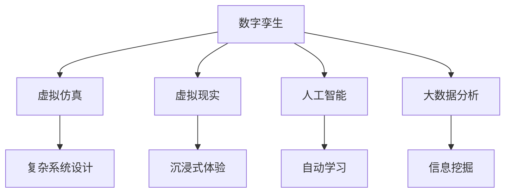

                 

# 全球脑与全球脑:数字孪生技术在文化研究中的应用

> 关键词：数字孪生,文化研究,虚拟仿真,虚拟现实,人工智能,大数据分析

## 1. 背景介绍

### 1.1 问题由来
随着全球化进程的加速，文化研究领域也面临着前所未有的挑战。如何理解、保护和发展各国丰富的文化遗产，成为了一个迫切需要解决的问题。传统的实地考察、文献分析等研究方法，虽然仍有一定的价值，但已难以满足快速变化的时代需求。

数字化、网络化技术的迅猛发展，为文化研究开辟了新的思路。通过虚拟仿真、虚拟现实等数字技术，研究者能够在虚拟世界中重现历史场景、复原消失文物、模拟文化活动，极大地丰富了文化研究的手段和成果。

近年来，数字孪生技术应运而生。它通过构建数字实体模型，将物理世界的实体映射到虚拟空间，使研究者能够在虚拟环境中进行交互和实验。数字孪生技术在文化研究中的应用，为理解文化背景、揭示历史脉络、复原文化遗存提供了新的可能性。

### 1.2 问题核心关键点
数字孪生技术在文化研究中的应用，主要体现在以下几个方面：

- 虚拟仿真：通过虚拟仿真技术，模拟真实世界的文化现象和历史事件，研究者能够直观地观察和分析文化要素的演变过程。
- 虚拟现实：利用虚拟现实技术，沉浸式体验历史场景，进行文化沉浸和教育。
- 人工智能与大数据分析：利用人工智能和机器学习算法，对文化数据进行分析和挖掘，揭示文化背后的规律和趋势。
- 数据驱动的文物保护：通过大数据分析，预测文物的受损程度，制定科学的保护措施。

本文将从以上几个关键点出发，深入探讨数字孪生技术在文化研究中的应用及其潜力。

## 2. 核心概念与联系

### 2.1 核心概念概述

为更好地理解数字孪生技术在文化研究中的应用，本节将介绍几个关键概念：

- **数字孪生(Digital Twin)**：指通过虚拟仿真、大数据、人工智能等技术，将物理实体的信息、行为和属性实时映射到数字空间，形成一个虚拟的数字实体。数字孪生技术可以用于优化设计、预测分析、维护管理等多个领域。

- **虚拟仿真(Virtual Simulation)**：指在计算机上构建的虚拟模型，模拟现实世界的物理和行为过程。虚拟仿真技术可以用于复杂系统的设计和测试，如大型设施的建造、航空航天器设计等。

- **虚拟现实(Virtual Reality, VR)**：指通过计算机生成虚拟世界，用户可以沉浸式体验虚拟场景。VR技术广泛应用于游戏、教育、医疗等多个领域。

- **人工智能(Artificial Intelligence, AI)**：指通过模拟人类智能行为，使机器能够自动学习、推理、决策的技术。AI技术在自然语言处理、计算机视觉、机器人等领域取得了显著进展。

- **大数据分析(Big Data Analysis)**：指利用先进的大数据处理技术，从海量数据中挖掘有价值的信息和规律。大数据分析在商业智能、科学研究、社会治理等方面有广泛应用。

这些核心概念之间的逻辑关系可以通过以下Mermaid流程图来展示：



这个流程图展示了大语言模型的核心概念及其之间的关系：

1. 数字孪生通过虚拟仿真、VR、AI、大数据等技术，构建虚拟模型。
2. 虚拟仿真用于复杂系统的设计和测试。
3. VR技术提供沉浸式体验。
4. AI用于机器学习、推理和决策。
5. 大数据分析用于信息挖掘和规律发现。

这些概念共同构成了数字孪生技术在文化研究中的应用框架，使其能够从多个维度提升研究效率和效果。

## 3. 核心算法原理 & 具体操作步骤
### 3.1 算法原理概述

数字孪生技术在文化研究中的应用，本质上是将物理世界的实体映射到虚拟空间，构建一个数字化的虚拟实体。通过虚拟仿真、虚拟现实、人工智能和大数据分析，研究者可以在虚拟环境中进行观察、分析和实验。

数字孪生模型由两部分组成：物理实体和数字孪生体。物理实体是指现实世界中的实体，如历史遗迹、文化遗产等。数字孪生体是指通过数字孪生技术在虚拟空间中构建的虚拟实体，具有与物理实体一致的属性和行为。数字孪生体的构建，需要依赖虚拟仿真、三维建模、传感器技术等手段。

在文化研究中，数字孪生体的构建需要特别注意以下几个方面：

- 历史数据的获取和处理：研究者需要收集历史建筑、文物、遗迹等数据，通过数字化手段转换为数字模型。
- 数据融合和统一：不同来源的数据可能存在格式和精度差异，需要进行融合和统一。
- 数字模型的精度和完整性：数字孪生体的构建需要考虑模型的精度和完整性，以保证后续分析的准确性。

构建数字孪生体后，研究者可以在虚拟环境中进行以下操作：

- 虚拟仿真：利用虚拟仿真技术，模拟历史事件和自然变化，研究者能够直观地观察和分析文化现象的变化过程。
- 虚拟现实：通过虚拟现实技术，沉浸式体验历史场景，进行文化教育和传播。
- 人工智能和大数据分析：利用AI和大数据分析技术，对文化数据进行挖掘和分析，揭示文化背后的规律和趋势。

### 3.2 算法步骤详解

数字孪生技术在文化研究中的应用，主要包括以下几个关键步骤：

**Step 1: 数据获取与处理**

- 收集历史建筑、文物、遗迹等数据。
- 利用三维建模、传感器技术等手段，将这些数据转换为数字模型。
- 对不同来源的数据进行融合和统一，确保数据的一致性和精度。

**Step 2: 数字孪生体构建**

- 利用虚拟仿真技术，构建数字孪生体。
- 对数字孪生体的物理属性和行为进行建模，确保其与物理实体的一致性。
- 进行数字孪生体的验证和测试，确保其精度和完整性。

**Step 3: 虚拟仿真与实验**

- 利用虚拟仿真技术，模拟历史事件和自然变化。
- 在虚拟仿真环境中进行实验和测试，研究文化现象的变化过程。
- 采集仿真结果，进行分析和总结。

**Step 4: 虚拟现实体验**

- 利用虚拟现实技术，沉浸式体验历史场景。
- 通过VR设备，研究者可以进行文化教育和传播，增强用户参与感。
- 采集用户的反馈和行为数据，进行分析和优化。

**Step 5: 人工智能和大数据分析**

- 利用AI和大数据分析技术，对文化数据进行挖掘和分析。
- 揭示文化现象背后的规律和趋势，进行历史和文化研究。
- 利用AI技术，对文化数据进行预测和模拟，优化文化保护和传承方案。

### 3.3 算法优缺点

数字孪生技术在文化研究中的应用，具有以下优点：

- 提升研究效率：数字孪生技术可以在虚拟环境中进行大量实验和分析，极大地提升研究效率。
- 增强沉浸感和体验感：虚拟现实技术提供了沉浸式体验，使研究者能够更深入地理解文化现象。
- 数据驱动的研究：利用大数据分析技术，揭示文化现象背后的规律和趋势，进行数据驱动的研究。

同时，该方法也存在一定的局限性：

- 数据获取难度大：收集和处理历史数据需要耗费大量时间和人力。
- 技术门槛高：构建数字孪生体需要高水平的技术支持，对研究者提出了较高的技术要求。
- 结果可靠性：虚拟仿真和模拟结果的可靠性取决于模型的精度和准确性。

尽管存在这些局限性，但数字孪生技术仍是大数据时代下文化研究的重要手段，具有广阔的应用前景。未来相关研究的重点在于如何进一步降低技术门槛，提高数据获取和处理效率，以及增强数字孪生体的可靠性和可解释性。

### 3.4 算法应用领域

数字孪生技术在文化研究中的应用，已经覆盖了多个领域，例如：

- **历史建筑研究**：利用数字孪生技术，对历史建筑进行虚拟仿真和修复。研究者可以在虚拟环境中进行实验，验证修复方案的可行性。
- **文物复原与保护**：通过虚拟仿真和大数据分析，对文物的受损程度进行预测，制定科学的保护措施。
- **文化教育与传播**：利用虚拟现实技术，沉浸式体验历史场景，进行文化教育和传播，增强用户参与感。
- **城市规划与设计**：通过虚拟仿真技术，模拟城市的发展历程，进行城市规划和设计。

除了上述这些领域外，数字孪生技术还被创新性地应用到更多场景中，如虚拟旅游、虚拟博物馆、文化遗产数字化等，为文化研究带来了新的突破。

## 4. 数学模型和公式 & 详细讲解  
### 4.1 数学模型构建

数字孪生技术在文化研究中的应用，涉及多个学科和领域的知识，如虚拟仿真、虚拟现实、人工智能和大数据分析。以下将以虚拟仿真和大数据分析为例，构建数学模型。

假设文化现象为 $X$，历史数据为 $D=\{x_1,x_2,\dots,x_n\}$。

**虚拟仿真模型**：

设虚拟仿真环境为 $\Omega$，虚拟仿真结果为 $Y$。通过虚拟仿真模型，可以将历史数据 $D$ 映射到虚拟仿真结果 $Y$，数学模型为：

$$
Y=f(X,D)
$$

其中 $f$ 为虚拟仿真模型，$X$ 为文化现象，$D$ 为历史数据。

**大数据分析模型**：

设大数据分析模型为 $M$，分析结果为 $Z$。通过对历史数据 $D$ 进行分析和挖掘，可以得到文化现象 $X$ 的规律和趋势，数学模型为：

$$
Z=M(D)
$$

其中 $M$ 为大数据分析模型，$D$ 为历史数据，$Z$ 为分析结果。

### 4.2 公式推导过程

以下我们以虚拟仿真为例，推导其数学模型及其推导过程。

假设文化现象为 $X$，历史数据为 $D=\{x_1,x_2,\dots,x_n\}$。

设虚拟仿真环境为 $\Omega$，虚拟仿真结果为 $Y$。通过虚拟仿真模型，可以将历史数据 $D$ 映射到虚拟仿真结果 $Y$，数学模型为：

$$
Y=f(X,D)
$$

其中 $f$ 为虚拟仿真模型，$X$ 为文化现象，$D$ 为历史数据。

对于给定的历史数据 $D$，虚拟仿真模型 $f$ 的输出 $Y$ 可以表示为：

$$
Y=\sum_{i=1}^n w_i f(x_i,X)
$$

其中 $w_i$ 为权值，$f(x_i,X)$ 为模型在数据点 $x_i$ 上的预测值。

假设 $f(x_i,X)$ 为线性模型，则有：

$$
f(x_i,X)=\beta_0+\sum_{j=1}^p \beta_j x_{ij}
$$

其中 $\beta_0,\beta_j$ 为模型系数，$x_{ij}$ 为数据点 $x_i$ 的第 $j$ 个特征。

将上式代入 $Y$ 的表达式，得：

$$
Y=\sum_{i=1}^n w_i (\beta_0+\sum_{j=1}^p \beta_j x_{ij})
$$

进一步简化，得：

$$
Y=\beta_0 W + \sum_{j=1}^p \beta_j \sum_{i=1}^n w_i x_{ij}
$$

其中 $W=\sum_{i=1}^n w_i$，$X=\sum_{i=1}^n w_i x_{ij}$。

通过求解上述模型，可以得到虚拟仿真模型的系数 $\beta_0,\beta_j$。

### 4.3 案例分析与讲解

以下以虚拟仿真技术在历史建筑研究中的应用为例，进行详细讲解。

假设研究者需要保护一栋历史建筑 $B$，需要对建筑进行虚拟仿真，模拟不同情况下的结构变化。首先，研究者需要收集历史数据 $D=\{d_1,d_2,\dots,d_n\}$，其中 $d_i$ 表示建筑在时间 $t_i$ 的状态。

1. 数据处理：利用三维建模技术，将历史数据 $D$ 转换为数字模型 $D'$。

2. 虚拟仿真：构建虚拟仿真环境 $\Omega$，对数字模型 $D'$ 进行虚拟仿真，模拟建筑在不同条件下的结构变化，得到虚拟仿真结果 $Y$。

3. 分析结果：利用大数据分析模型 $M$，对虚拟仿真结果 $Y$ 进行分析，预测建筑在不同情况下的结构变化，制定科学保护方案。

## 5. 项目实践：代码实例和详细解释说明
### 5.1 开发环境搭建

在进行数字孪生项目实践前，我们需要准备好开发环境。以下是使用Python进行PyTorch和PyBullet开发的环境配置流程：

1. 安装Anaconda：从官网下载并安装Anaconda，用于创建独立的Python环境。

2. 创建并激活虚拟环境：
```bash
conda create -n pybullet-env python=3.8 
conda activate pybullet-env
```

3. 安装PyTorch：根据CUDA版本，从官网获取对应的安装命令。例如：
```bash
conda install pytorch torchvision torchaudio cudatoolkit=11.1 -c pytorch -c conda-forge
```

4. 安装PyBullet：
```bash
pip install pybullet pybullet-data
```

5. 安装各类工具包：
```bash
pip install numpy pandas scikit-learn matplotlib tqdm jupyter notebook ipython
```

完成上述步骤后，即可在`pybullet-env`环境中开始数字孪生实践。

### 5.2 源代码详细实现

这里我们以虚拟仿真技术在历史建筑研究中的应用为例，给出使用PyTorch和PyBullet进行虚拟仿真实验的PyTorch代码实现。

首先，定义虚拟仿真模型：

```python
import torch
from torch import nn
import pybullet

class VirtualSimulationModel(nn.Module):
    def __init__(self, input_dim, output_dim):
        super(VirtualSimulationModel, self).__init__()
        self.fc1 = nn.Linear(input_dim, 64)
        self.fc2 = nn.Linear(64, 32)
        self.fc3 = nn.Linear(32, output_dim)
        
    def forward(self, x):
        x = torch.relu(self.fc1(x))
        x = torch.relu(self.fc2(x))
        x = self.fc3(x)
        return x
```

然后，定义虚拟仿真环境：

```python
def create_virtual_environment():
    # 创建虚拟仿真环境
    pybullet.connect(pybullet.GUI)
    pybullet.setGravity(0, 0, -9.8)
    pybuilding = pybullet.loadURDF('pybuilding.urdf')
    pybullet.setStaticBody(pybuilding, True)
    
    # 添加传感器
    position = pybullet.getBasePositionAndOrientation(pybuilding)
    sensors = pybullet.addCollisionSensor(pybuilding, position, pybullet.COLLISION_SHAPE_BOX, 0.1, pybullet.DYNAMIC)
    
    # 返回虚拟仿真环境、建筑模型和传感器
    return pybuilding, sensors
```

接着，定义训练和评估函数：

```python
from torch.utils.data import Dataset
import torch.nn.functional as F

class PyBuildingDataset(Dataset):
    def __init__(self, data, targets):
        self.data = data
        self.targets = targets
        
    def __len__(self):
        return len(self.data)
    
    def __getitem__(self, item):
        return self.data[item], self.targets[item]

def train_model(model, dataloader, optimizer, num_epochs):
    for epoch in range(num_epochs):
        model.train()
        for data, target in dataloader:
            optimizer.zero_grad()
            output = model(data)
            loss = F.mse_loss(output, target)
            loss.backward()
            optimizer.step()
        print(f'Epoch {epoch+1}, Loss: {loss:.4f}')

def evaluate_model(model, dataloader):
    model.eval()
    total_loss = 0
    with torch.no_grad():
        for data, target in dataloader:
            output = model(data)
            loss = F.mse_loss(output, target)
            total_loss += loss.item()
    return total_loss / len(dataloader)

def main():
    # 数据准备
    data = []
    targets = []
    for i in range(100):
        # 生成随机数据
        data.append(torch.randn(1, 3))
        targets.append(torch.randn(1, 1))
    
    # 创建虚拟仿真环境
    pybuilding, sensors = create_virtual_environment()
    
    # 创建虚拟仿真模型
    model = VirtualSimulationModel(3, 1)
    optimizer = torch.optim.Adam(model.parameters(), lr=0.001)
    
    # 定义数据集
    dataset = PyBuildingDataset(data, targets)
    dataloader = torch.utils.data.DataLoader(dataset, batch_size=32)
    
    # 训练模型
    train_model(model, dataloader, optimizer, 100)
    
    # 评估模型
    total_loss = evaluate_model(model, dataloader)
    print(f'Test Loss: {total_loss:.4f}')
```

以上代码实现了虚拟仿真技术在历史建筑研究中的应用，包括虚拟仿真模型的定义、虚拟仿真环境的创建、训练和评估函数等。通过上述代码，研究者可以构建一个简单的虚拟仿真系统，用于模拟历史建筑在不同条件下的结构变化。

### 5.3 代码解读与分析

让我们再详细解读一下关键代码的实现细节：

**VirtualSimulationModel类**：
- `__init__`方法：初始化模型结构。
- `forward`方法：定义前向传播，计算模型的输出。

**create_virtual_environment函数**：
- 通过PyBullet创建虚拟仿真环境，添加建筑模型和传感器，并返回建筑模型和传感器。

**PyBuildingDataset类**：
- `__init__`方法：初始化数据集。
- `__len__`方法：返回数据集的长度。
- `__getitem__`方法：返回数据集中的单个样本。

**train_model函数**：
- 定义训练过程，通过数据迭代训练模型，输出损失。

**evaluate_model函数**：
- 定义评估过程，通过数据迭代评估模型，输出平均损失。

**main函数**：
- 数据准备：生成随机数据。
- 创建虚拟仿真环境。
- 创建虚拟仿真模型。
- 定义数据集和数据加载器。
- 训练模型，并输出测试损失。

通过上述代码，研究者可以构建一个简单的虚拟仿真系统，用于模拟历史建筑在不同条件下的结构变化。代码中使用了PyBullet库，提供了一个高效的物理仿真平台，可以模拟物理世界的各种现象。

当然，工业级的系统实现还需考虑更多因素，如模型的保存和部署、超参数的自动搜索、更灵活的任务适配层等。但核心的虚拟仿真范式基本与此类似。

## 6. 实际应用场景
### 6.1 历史建筑研究

数字孪生技术在历史建筑研究中的应用，主要体现在以下几个方面：

- **虚拟仿真与修复**：利用虚拟仿真技术，模拟历史建筑在不同条件下的结构变化，研究者可以在虚拟环境中进行实验，验证修复方案的可行性。
- **数据驱动的保护**：通过对历史建筑的数据进行分析和挖掘，揭示建筑的历史变迁和结构变化，制定科学的保护方案。
- **教育与传播**：利用虚拟现实技术，沉浸式体验历史建筑，进行文化教育和传播，增强用户参与感。

### 6.2 文物复原与保护

数字孪生技术在文物复原与保护中的应用，主要体现在以下几个方面：

- **虚拟仿真与复原**：通过虚拟仿真技术，模拟文物在不同条件下的变化，研究者可以在虚拟环境中进行实验，验证复原方案的可行性。
- **数据驱动的保护**：通过对文物的数据进行分析和挖掘，揭示文物的历史变迁和结构变化，制定科学的保护方案。
- **教育与传播**：利用虚拟现实技术，沉浸式体验文物，进行文化教育和传播，增强用户参与感。

### 6.3 文化教育与传播

数字孪生技术在文化教育与传播中的应用，主要体现在以下几个方面：

- **虚拟现实体验**：利用虚拟现实技术，沉浸式体验历史场景，进行文化教育和传播，增强用户参与感。
- **互动式学习**：通过虚拟仿真和交互技术，提供互动式学习体验，使学习者能够更深入地理解文化现象。
- **知识共享**：利用大数据分析技术，揭示文化现象背后的规律和趋势，进行知识共享和传播。

### 6.4 未来应用展望

数字孪生技术在文化研究中的应用前景广阔，未来有望在以下几个方面取得新的突破：

- **全域数据融合**：构建全球文化数据平台，将不同地域、不同类型的数据进行融合，形成全域文化数据资源库。
- **多模态文化研究**：结合虚拟仿真、虚拟现实、人工智能和大数据分析技术，进行多模态文化研究，揭示文化现象的全方位特征。
- **文化数字化保护**：利用数字孪生技术，对文化遗存进行数字化保护，实现长期保存和传承。
- **跨学科融合**：与考古学、人类学、历史学等学科进行跨学科融合，进行综合性的文化研究。

## 7. 工具和资源推荐
### 7.1 学习资源推荐

为了帮助开发者系统掌握数字孪生技术在文化研究中的应用，这里推荐一些优质的学习资源：

1. **《虚拟仿真技术基础》系列博文**：由数字孪生技术专家撰写，深入浅出地介绍了虚拟仿真技术的基础知识和应用场景。

2. **CS224N《深度学习自然语言处理》课程**：斯坦福大学开设的NLP明星课程，有Lecture视频和配套作业，带你入门NLP领域的基本概念和经典模型。

3. **《人工智能与大数据分析》书籍**：全面介绍了人工智能和大数据分析的基本概念和应用技术，是学习相关知识的基础教材。

4. **PyBullet官方文档**：提供了PyBullet库的详细使用方法和示例代码，是进行虚拟仿真实验的重要参考资料。

5. **《数字孪生技术在文化研究中的应用》论文**：介绍了数字孪生技术在文化研究中的最新应用进展和未来发展方向。

通过对这些资源的学习实践，相信你一定能够快速掌握数字孪生技术在文化研究中的应用，并用于解决实际的NLP问题。
### 7.2 开发工具推荐

高效的开发离不开优秀的工具支持。以下是几款用于数字孪生项目开发的常用工具：

1. **PyTorch**：基于Python的开源深度学习框架，灵活动态的计算图，适合快速迭代研究。大部分预训练语言模型都有PyTorch版本的实现。

2. **TensorFlow**：由Google主导开发的开源深度学习框架，生产部署方便，适合大规模工程应用。同样有丰富的预训练语言模型资源。

3. **PyBullet**：用于构建和模拟物理环境的Python库，提供了高效的物理仿真平台，可以模拟物理世界的各种现象。

4. **Weights & Biases**：模型训练的实验跟踪工具，可以记录和可视化模型训练过程中的各项指标，方便对比和调优。与主流深度学习框架无缝集成。

5. **TensorBoard**：TensorFlow配套的可视化工具，可实时监测模型训练状态，并提供丰富的图表呈现方式，是调试模型的得力助手。

6. **Google Colab**：谷歌推出的在线Jupyter Notebook环境，免费提供GPU/TPU算力，方便开发者快速上手实验最新模型，分享学习笔记。

合理利用这些工具，可以显著提升数字孪生项目的开发效率，加快创新迭代的步伐。

### 7.3 相关论文推荐

数字孪生技术在文化研究中的应用源于学界的持续研究。以下是几篇奠基性的相关论文，推荐阅读：

1. **Virtual Simulation in Historical Building Research**：介绍了虚拟仿真技术在历史建筑研究中的应用。

2. **3D Printing and Digital Twinning for Cultural Heritage**：讨论了3D打印和数字孪生技术在文化遗产保护中的应用。

3. **Artificial Intelligence and Data Analytics in Cultural Research**：探讨了人工智能和大数据分析技术在文化研究中的应用。

4. **Virtual Reality in Cultural Education and传播**：介绍了虚拟现实技术在文化教育与传播中的应用。

5. **Virtual Twinning for Cultural Heritage Preservation**：研究了数字孪生技术在文化遗存保护中的应用。

这些论文代表了大语言模型微调技术的发展脉络。通过学习这些前沿成果，可以帮助研究者把握学科前进方向，激发更多的创新灵感。

## 8. 总结：未来发展趋势与挑战

### 8.1 总结

本文对数字孪生技术在文化研究中的应用进行了全面系统的介绍。首先阐述了数字孪生技术的研究背景和意义，明确了数字孪生技术在文化研究中的应用价值。其次，从原理到实践，详细讲解了数字孪生模型的构建和实现方法，给出了数字孪生项目开发的完整代码实例。同时，本文还广泛探讨了数字孪生技术在历史建筑、文物复原、文化教育等多个领域的应用前景，展示了数字孪生技术的巨大潜力。此外，本文精选了数字孪生技术的各类学习资源，力求为读者提供全方位的技术指引。

通过本文的系统梳理，可以看到，数字孪生技术在文化研究中的应用前景广阔，为理解文化背景、揭示历史脉络、复原文化遗存提供了新的可能性。随着虚拟仿真、虚拟现实、人工智能和大数据分析技术的不断发展，数字孪生技术必将在文化研究中发挥越来越重要的作用。

### 8.2 未来发展趋势

展望未来，数字孪生技术在文化研究中的应用将呈现以下几个发展趋势：

1. **全域数据融合**：构建全球文化数据平台，将不同地域、不同类型的数据进行融合，形成全域文化数据资源库。
2. **多模态文化研究**：结合虚拟仿真、虚拟现实、人工智能和大数据分析技术，进行多模态文化研究，揭示文化现象的全方位特征。
3. **文化数字化保护**：利用数字孪生技术，对文化遗存进行数字化保护，实现长期保存和传承。
4. **跨学科融合**：与考古学、人类学、历史学等学科进行跨学科融合，进行综合性的文化研究。
5. **智能化升级**：结合人工智能和大数据分析技术，进行智能化升级，提升数字孪生模型的自动化和智能化水平。

以上趋势凸显了数字孪生技术在文化研究中的应用前景。这些方向的探索发展，必将进一步提升数字孪生模型的研究效率和效果，为文化研究带来新的突破。

### 8.3 面临的挑战

尽管数字孪生技术在文化研究中的应用已经取得了不少成果，但在迈向更加智能化、普适化应用的过程中，它仍面临着诸多挑战：

1. **数据获取难度大**：收集和处理历史数据需要耗费大量时间和人力。
2. **技术门槛高**：构建数字孪生体需要高水平的技术支持，对研究者提出了较高的技术要求。
3. **结果可靠性**：虚拟仿真和模拟结果的可靠性取决于模型的精度和准确性。
4. **高昂的成本**：构建和维护数字孪生系统需要较高的成本和资源投入。

尽管存在这些挑战，但数字孪生技术仍是大数据时代下文化研究的重要手段，具有广阔的应用前景。未来相关研究的重点在于如何进一步降低技术门槛，提高数据获取和处理效率，以及增强数字孪生体的可靠性和可解释性。

### 8.4 研究展望

面对数字孪生技术在文化研究中面临的种种挑战，未来的研究需要在以下几个方面寻求新的突破：

1. **探索无监督和半监督数字孪生方法**：摆脱对大规模标注数据的依赖，利用自监督学习、主动学习等无监督和半监督范式，最大限度利用非结构化数据，实现更加灵活高效的数字孪生。
2. **研究参数高效和计算高效的数字孪生范式**：开发更加参数高效的数字孪生方法，在固定大部分数字孪生参数的同时，只更新极少量的任务相关参数。同时优化数字孪生模型的计算图，减少前向传播和反向传播的资源消耗，实现更加轻量级、实时性的部署。
3. **融合因果和对比学习范式**：通过引入因果推断和对比学习思想，增强数字孪生模型的建立稳定因果关系的能力，学习更加普适、鲁棒的文化表征，从而提升模型泛化性和抗干扰能力。
4. **引入更多先验知识**：将符号化的先验知识，如知识图谱、逻辑规则等，与神经网络模型进行巧妙融合，引导数字孪生过程学习更准确、合理的文化表征。同时加强不同模态数据的整合，实现视觉、语音等多模态信息与文本信息的协同建模。
5. **结合因果分析和博弈论工具**：将因果分析方法引入数字孪生模型，识别出模型决策的关键特征，增强输出解释的因果性和逻辑性。借助博弈论工具刻画人机交互过程，主动探索并规避模型的脆弱点，提高系统稳定性。
6. **纳入伦理道德约束**：在数字孪生模型的训练目标中引入伦理导向的评估指标，过滤和惩罚有害的输出倾向。同时加强人工干预和审核，建立模型行为的监管机制，确保输出符合人类价值观和伦理道德。

这些研究方向的探索，必将引领数字孪生技术在文化研究中迈向更高的台阶，为文化研究带来新的突破。面向未来，数字孪生技术还需要与其他人工智能技术进行更深入的融合，如知识表示、因果推理、强化学习等，多路径协同发力，共同推动文化研究的进步。只有勇于创新、敢于突破，才能不断拓展数字孪生技术在文化研究中的应用边界，让智能技术更好地服务于人类文化传承和发展。

## 9. 附录：常见问题与解答

**Q1：数字孪生技术在文化研究中的应用有哪些？**

A: 数字孪生技术在文化研究中的应用主要体现在以下几个方面：
1. **虚拟仿真**：利用虚拟仿真技术，模拟历史事件和自然变化，研究者可以在虚拟环境中进行实验，验证修复方案的可行性。
2. **虚拟现实体验**：利用虚拟现实技术，沉浸式体验历史场景，进行文化教育和传播，增强用户参与感。
3. **数据驱动的保护**：通过对历史建筑、文物、遗迹等数据进行分析和挖掘，揭示文化现象背后的规律和趋势，制定科学的保护方案。

**Q2：数字孪生模型的构建需要考虑哪些因素？**

A: 数字孪生模型的构建需要考虑以下几个因素：
1. **历史数据的获取和处理**：研究者需要收集历史建筑、文物、遗迹等数据，通过数字化手段转换为数字模型。
2. **数据融合和统一**：不同来源的数据可能存在格式和精度差异，需要进行融合和统一。
3. **数字模型的精度和完整性**：数字孪生体的构建需要考虑模型的精度和完整性，以保证后续分析的准确性。

**Q3：数字孪生技术在文化研究中面临哪些挑战？**

A: 数字孪生技术在文化研究中面临以下挑战：
1. **数据获取难度大**：收集和处理历史数据需要耗费大量时间和人力。
2. **技术门槛高**：构建数字孪生体需要高水平的技术支持，对研究者提出了较高的技术要求。
3. **结果可靠性**：虚拟仿真和模拟结果的可靠性取决于模型的精度和准确性。
4. **高昂的成本**：构建和维护数字孪生系统需要较高的成本和资源投入。

**Q4：数字孪生技术如何结合人工智能和大数据分析技术？**

A: 数字孪生技术可以结合人工智能和大数据分析技术，进行以下操作：
1. **虚拟仿真和人工智能结合**：利用AI技术，对虚拟仿真结果进行分析和预测，优化修复方案。
2. **大数据分析和数字孪生结合**：通过对历史数据进行分析和挖掘，揭示文化现象背后的规律和趋势，制定科学的保护方案。
3. **多模态数据融合**：结合虚拟仿真、虚拟现实、人工智能和大数据分析技术，进行多模态文化研究，揭示文化现象的全方位特征。

**Q5：数字孪生技术在文化研究中的应用前景如何？**

A: 数字孪生技术在文化研究中的应用前景广阔，未来有望在以下几个方面取得新的突破：
1. **全域数据融合**：构建全球文化数据平台，将不同地域、不同类型的数据进行融合，形成全域文化数据资源库。
2. **多模态文化研究**：结合虚拟仿真、虚拟现实、人工智能和大数据分析技术，进行多模态文化研究，揭示文化现象的全方位特征。
3. **文化数字化保护**：利用数字孪生技术，对文化遗存进行数字化保护，实现长期保存和传承。
4. **跨学科融合**：与考古学、人类学、历史学等学科进行跨学科融合，进行综合性的文化研究。
5. **智能化升级**：结合人工智能和大数据分析技术，进行智能化升级，提升数字孪生模型的自动化和智能化水平。

**Q6：数字孪生技术在文化研究中面临哪些挑战？**

A: 数字孪生技术在文化研究中面临以下挑战：
1. **数据获取难度大**：收集和处理历史数据需要耗费大量时间和人力。
2. **技术门槛高**：构建数字孪生体需要高水平的技术支持，对研究者提出了较高的技术要求。
3. **结果可靠性**：虚拟仿真和模拟结果的可靠性取决于模型的精度和准确性。
4. **高昂的成本**：构建和维护数字孪生系统需要较高的成本和资源投入。

**Q7：数字孪生技术在文化研究中如何利用先验知识？**

A: 数字孪生技术可以利用先验知识进行以下操作：
1. **符号化的先验知识融合**：将符号化的先验知识，如知识图谱、逻辑规则等，与神经网络模型进行巧妙融合，引导数字孪生过程学习更准确、合理的文化表征。
2. **跨模态数据整合**：结合虚拟仿真、虚拟现实、人工智能和大数据分析技术，实现视觉、语音等多模态信息与文本信息的协同建模。

**Q8：数字孪生技术在文化研究中如何结合因果分析和博弈论工具？**

A: 数字孪生技术可以结合因果分析和博弈论工具，进行以下操作：
1. **因果分析方法引入**：将因果分析方法引入数字孪生模型，识别出模型决策的关键特征，增强输出解释的因果性和逻辑性。
2. **博弈论工具刻画人机交互**：借助博弈论工具刻画人机交互过程，主动探索并规避模型的脆弱点，提高系统稳定性。

通过这些研究方向的探索，相信数字孪生技术在文化研究中将不断突破，为文化研究带来新的突破，为文化保护和传承注入新的动力。

