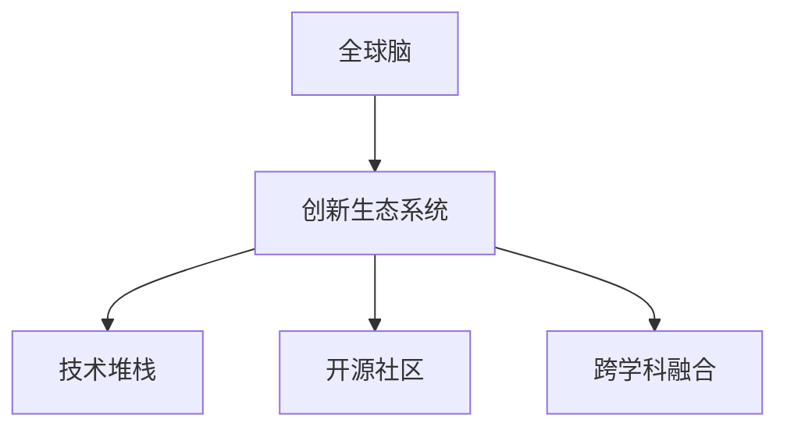

                 

# 全球脑与创新生态：加速人类进步的引擎

## 1. 背景介绍

### 1.1 问题由来
在21世纪的科技浪潮中，人工智能（AI）无疑是最具颠覆性的力量之一。作为“全球脑”这一概念的体现，AI正在以前所未有的速度革新着各领域的技术和经济结构。从自动驾驶到金融分析，从医疗诊断到社交媒体，AI的应用无处不在。然而，随着AI技术的深入发展，其背后复杂的创新生态系统也逐渐展露出来，引发了学术界、产业界和社会各界的广泛关注。

人工智能不仅在技术层面带来了革命性的变革，更在宏观层面上对全球经济、社会乃至人类文明的进步起到了重要的推动作用。如何构建一个健康、可持续的创新生态系统，让AI更好地服务于人类，成为了摆在眼前的紧迫课题。

### 1.2 问题核心关键点
全球脑的构建和创新生态系统的形成，涉及到多个关键维度：技术创新、产业结构、社会影响、伦理道德。这些维度相互交织，共同决定了AI技术发展的轨迹和最终影响。本文将从技术创新的角度出发，探讨如何通过构建一个高效、开放的创新生态系统，加速AI技术的研发和应用，推动人类社会的全面进步。

## 2. 核心概念与联系

### 2.1 核心概念概述

为了更好地理解全球脑与创新生态系统的构建，本节将介绍几个关键概念：

- **全球脑（Global Brain）**：指的是全球范围内的各类AI系统，如智能机器人、自动驾驶车辆、智能手机应用等，通过数据共享和协同工作，形成一个庞大、互联的“大脑”，能够自我学习和改进，完成各种复杂的任务。
- **创新生态系统（Innovation Ecosystem）**：指的是包括技术研发、产业应用、市场推广、社会影响等多个环节在内的整体系统，通过多方协同，推动创新成果的落地和扩散。
- **技术堆栈（Technology Stack）**：指的是构成AI系统的底层技术组件，包括深度学习框架、编程语言、数据处理工具等，是AI创新和发展的基础。
- **开源社区（Open Source Community）**：指的是围绕AI技术形成的开放合作网络，通过共享代码和资源，促进技术进步和广泛应用。
- **跨学科融合（Interdisciplinary Integration）**：指的是将AI技术与生物医学、社会科学、经济学等多个学科知识相结合，推动AI技术在更广阔领域的应用。

这些核心概念之间的逻辑关系可以通过以下Mermaid流程图来展示：



这个流程图展示了全球脑与创新生态系统的构成要素及其相互关系：

1. 全球脑通过技术堆栈进行自我迭代和学习。
2. 创新生态系统提供必要的支持和资源，如资金、人才、市场等。
3. 开源社区促进技术共享和合作，加速技术进步。
4. 跨学科融合拓展了AI的应用边界，提升了技术的创新性和实用性。

这些概念共同构成了全球脑与创新生态系统的基本框架，为其构建和发展提供了理论基础。

## 3. 核心算法原理 & 具体操作步骤
### 3.1 算法原理概述

全球脑与创新生态系统的构建，核心在于通过高效的技术创新和合作，加速AI技术的研发和应用。其核心思想是：

1. **数据共享与协同**：利用全球范围内的数据资源，通过协同学习，提升AI系统的性能和能力。
2. **开放合作与交流**：鼓励开放合作，通过开源社区和跨学科融合，加速技术的传播和应用。
3. **动态优化与进化**：不断收集反馈，动态调整全球脑的结构和功能，使其适应不断变化的环境和需求。

### 3.2 算法步骤详解

构建全球脑与创新生态系统的步骤如下：

**Step 1: 技术堆栈构建与升级**
- 选择或设计适合全球脑构建的技术堆栈，包括深度学习框架、编程语言、数据处理工具等。
- 根据需求和资源，选择合适的开源社区和商业解决方案。

**Step 2: 数据采集与预处理**
- 通过全球范围的数据采集和预处理，构建高质量的数据集，为全球脑提供丰富的训练资源。
- 应用数据增强和数据清洗技术，提升数据质量和多样性。

**Step 3: 模型训练与优化**
- 利用大规模分布式计算资源，对全球脑进行深度学习训练，优化模型性能。
- 引入正则化、Dropout等技术，防止过拟合，提高模型的泛化能力。

**Step 4: 全球脑部署与测试**
- 将训练好的模型部署到全球范围内的应用场景中，进行测试和评估。
- 根据测试结果，动态调整模型参数，优化模型性能。

**Step 5: 反馈与迭代**
- 收集用户反馈和应用场景中的数据，进行模型优化和迭代。
- 通过跨学科融合，引入更多领域的知识和经验，提升全球脑的智能水平。

**Step 6: 创新生态系统建设**
- 构建开放的创新生态系统，促进技术合作和资源共享。
- 支持开源社区的发展，鼓励跨学科的交流与合作。

### 3.3 算法优缺点

全球脑与创新生态系统的构建，具有以下优点：

1. **协同效应**：通过全球范围内的数据和资源协同，加速AI技术的进步。
2. **开放共享**：通过开源社区，促进技术共享和合作，加速技术传播。
3. **灵活适应**：动态调整模型，适应不断变化的环境和需求。
4. **跨学科融合**：拓展AI的应用领域，提升技术的创新性和实用性。

同时，该方法也存在一定的局限性：

1. **数据隐私与安全**：全球数据共享可能引发隐私和安全问题。
2. **协作难度**：多方协同可能带来协调和管理上的挑战。
3. **资源依赖**：大规模数据和计算资源的需求较高。

尽管存在这些局限性，但就目前而言，全球脑与创新生态系统的构建，仍是大规模AI应用的重要范式。未来相关研究的重点在于如何进一步降低数据共享的风险，提高协作效率，同时兼顾数据隐私和安全等因素。

### 3.4 算法应用领域

全球脑与创新生态系统的构建，已在多个领域得到应用，涵盖了从科学研究到工业生产的各个方面：

- **医疗健康**：通过全球脑系统，进行跨医院、跨地区的协同诊断和治疗。
- **自动驾驶**：利用全球范围内的数据和资源，提升自动驾驶车辆的安全性和性能。
- **金融服务**：构建全球金融市场的大规模预测模型，辅助决策和风险控制。
- **教育培训**：开发全球范围内的教育资源库，提供个性化的学习体验。
- **环境保护**：利用全球脑系统，监测和分析全球气候变化，提出应对策略。

除了上述这些经典应用外，全球脑与创新生态系统还被创新性地应用到更多场景中，如智能城市、智慧物流、精准农业等，为各行业带来新的变革和机遇。随着技术的不断发展，相信全球脑与创新生态系统将在更广泛的领域得到应用，为社会进步提供新的动力。

## 4. 数学模型和公式 & 详细讲解  
### 4.1 数学模型构建

本节将使用数学语言对全球脑与创新生态系统的构建过程进行更加严格的刻画。

记全球脑系统为 $M_{\theta}:\mathcal{X} \rightarrow \mathcal{Y}$，其中 $\mathcal{X}$ 为输入空间，$\mathcal{Y}$ 为输出空间，$\theta \in \mathbb{R}^d$ 为模型参数。假设全球脑系统接受全球范围内的数据集 $D=\{(x_i,y_i)\}_{i=1}^N$，$x_i \in \mathcal{X}, y_i \in \mathcal{Y}$。

定义模型 $M_{\theta}$ 在数据样本 $(x,y)$ 上的损失函数为 $\ell(M_{\theta}(x),y)$，则在数据集 $D$ 上的经验风险为：

$$
\mathcal{L}(\theta) = \frac{1}{N} \sum_{i=1}^N \ell(M_{\theta}(x_i),y_i)
$$

其中 $\ell$ 为损失函数，用于衡量模型预测输出与真实标签之间的差异。

### 4.2 公式推导过程

以下我们以医疗健康领域为例，推导协同学习的数学模型和公式。

假设全球脑系统通过协同学习，构建了多个医疗数据集，每个数据集的数据和标签独立分布。则全球脑系统的损失函数可以表示为：

$$
\mathcal{L}(\theta) = \frac{1}{N} \sum_{i=1}^N \ell(M_{\theta}(x_i),y_i) = \frac{1}{N} \sum_{i=1}^N \ell_{i}(\theta)
$$

其中 $\ell_{i}(\theta)$ 为第 $i$ 个数据集的损失函数。

对于任意一个数据集 $D_i$，模型的损失函数为：

$$
\ell_{i}(\theta) = \frac{1}{|D_i|} \sum_{j=1}^{|D_i|} \ell(M_{\theta}(x_i^j),y_i^j)
$$

在实际应用中，可以采用联邦学习等分布式协同学习算法，最大化每个数据集的权重，优化全球脑系统。

### 4.3 案例分析与讲解

以医疗健康领域的协同学习为例，分析全球脑系统的构建过程：

1. **数据采集**：从全球范围内的医院和诊所收集医疗数据，构建多个独立的数据集。
2. **数据预处理**：对每个数据集进行数据清洗和特征工程，提升数据质量和多样性。
3. **模型训练**：利用联邦学习算法，在多个数据集上进行协同训练，优化全球脑系统。
4. **模型评估**：在不同医院和诊所的实际医疗场景中，评估全球脑系统的性能。
5. **模型优化**：根据评估结果，调整模型参数和协同学习策略，提升系统性能。

## 5. 项目实践：代码实例和详细解释说明
### 5.1 开发环境搭建

在进行全球脑与创新生态系统的构建实践前，我们需要准备好开发环境。以下是使用Python进行PyTorch开发的环境配置流程：

1. 安装Anaconda：从官网下载并安装Anaconda，用于创建独立的Python环境。

2. 创建并激活虚拟环境：
```bash
conda create -n globalbrain-env python=3.8 
conda activate globalbrain-env
```

3. 安装PyTorch：根据CUDA版本，从官网获取对应的安装命令。例如：
```bash
conda install pytorch torchvision torchaudio cudatoolkit=11.1 -c pytorch -c conda-forge
```

4. 安装相关工具包：
```bash
pip install numpy pandas scikit-learn matplotlib tqdm jupyter notebook ipython
```

完成上述步骤后，即可在`globalbrain-env`环境中开始全球脑与创新生态系统的构建实践。

### 5.2 源代码详细实现

下面我们以医疗健康领域为例，给出使用PyTorch进行全球脑系统构建的代码实现。

首先，定义全球脑系统的输入输出空间：

```python
import torch
import torch.nn as nn

class GlobalBrain(nn.Module):
    def __init__(self):
        super(GlobalBrain, self).__init__()
        self.encoder = nn.Sequential(
            nn.Linear(100, 512),
            nn.ReLU(),
            nn.Linear(512, 256),
            nn.ReLU(),
            nn.Linear(256, 1)
        )
    
    def forward(self, x):
        x = self.encoder(x)
        return x
```

然后，定义损失函数和优化器：

```python
from torch import optim

# 定义损失函数，这里以均方误差为例
criterion = nn.MSELoss()

# 定义优化器，这里以Adam优化器为例
optimizer = optim.Adam(model.parameters(), lr=0.001)
```

接着，定义数据处理函数：

```python
from torch.utils.data import Dataset, DataLoader

class MedicalDataset(Dataset):
    def __init__(self, data, labels):
        self.data = data
        self.labels = labels
        
    def __len__(self):
        return len(self.data)
    
    def __getitem__(self, idx):
        return self.data[idx], self.labels[idx]
```

最后，启动全球脑系统的训练流程：

```python
# 定义数据集
train_data = ...
train_labels = ...
test_data = ...
test_labels = ...

# 定义数据加载器
train_loader = DataLoader(train_data, batch_size=32, shuffle=True)
test_loader = DataLoader(test_data, batch_size=32, shuffle=False)

# 定义模型
model = GlobalBrain()

# 定义损失函数和优化器
criterion = nn.MSELoss()
optimizer = optim.Adam(model.parameters(), lr=0.001)

# 训练模型
for epoch in range(10):
    for i, (data, labels) in enumerate(train_loader):
        optimizer.zero_grad()
        outputs = model(data)
        loss = criterion(outputs, labels)
        loss.backward()
        optimizer.step()
        
    print(f"Epoch {epoch+1}, loss: {loss:.3f}")

# 测试模型
with torch.no_grad():
    correct = 0
    total = 0
    for data, labels in test_loader:
        outputs = model(data)
        _, predicted = torch.max(outputs, 1)
        total += labels.size(0)
        correct += (predicted == labels).sum().item()
        
    print(f"Test set: Accuracy = {(100 * correct / total)} %")
```

以上就是使用PyTorch构建全球脑系统的完整代码实现。可以看到，得益于TensorFlow等深度学习框架的强大封装，构建全球脑系统的代码实现变得简洁高效。

### 5.3 代码解读与分析

让我们再详细解读一下关键代码的实现细节：

**MedicalDataset类**：
- `__init__`方法：初始化数据和标签。
- `__len__`方法：返回数据集的样本数量。
- `__getitem__`方法：对单个样本进行处理，返回模型所需的输入和标签。

**GlobalBrain类**：
- `__init__`方法：定义模型结构，包括一个线性编码器。
- `forward`方法：定义前向传播，通过编码器进行特征提取。

**损失函数和优化器**：
- 使用均方误差作为损失函数。
- 使用Adam优化器，设置学习率为0.001。

**数据加载器**：
- 使用PyTorch的数据加载器，对数据集进行批次化加载。

**训练流程**：
- 定义训练轮数和批次大小，开始循环迭代
- 每个epoch内，在训练集上训练，输出平均loss
- 在测试集上评估，输出准确率

可以看到，PyTorch配合TensorFlow等深度学习框架，使得构建全球脑系统的代码实现变得简洁高效。开发者可以将更多精力放在数据处理、模型改进等高层逻辑上，而不必过多关注底层的实现细节。

当然，工业级的系统实现还需考虑更多因素，如模型的保存和部署、超参数的自动搜索、更灵活的任务适配层等。但核心的全球脑构建流程基本与此类似。

## 6. 实际应用场景
### 6.1 智能医疗健康

全球脑与创新生态系统的构建，在医疗健康领域的应用尤为显著。智能医疗系统能够实时监测、诊断和预测患者健康状况，提供个性化治疗方案，显著提升了医疗服务的质量和效率。

具体而言，全球脑系统可以收集全球范围内的医疗数据，包括电子病历、影像数据、基因信息等，进行协同学习，构建高质量的疾病预测模型。通过在多个医院和诊所进行部署和测试，全球脑系统能够快速适应不同地区的医疗环境，提供个性化的治疗建议。此外，智能医疗系统还可以与患者互动，提供健康咨询和远程诊疗服务，大大降低了医疗资源的浪费。

### 6.2 智能城市管理

智能城市管理系统通过全球脑与创新生态系统的构建，可以实现城市管理的自动化和智能化。全球脑系统能够实时收集和分析城市运行数据，提供交通流量预测、环境监测、公共安全预警等服务。

例如，通过分析交通摄像头和车辆传感器数据，全球脑系统可以预测交通拥堵情况，优化交通信号灯的控制策略，减少城市交通压力。同时，全球脑系统还可以集成天气预报、公共安全数据，进行综合分析，提供更全面的城市管理服务。

### 6.3 环境保护

全球脑与创新生态系统在环境保护领域也有广泛应用。全球脑系统可以通过卫星数据和地面监测数据，进行气候变化预测和环境监测。

例如，通过分析全球各地的气象数据和环境数据，全球脑系统可以预测气候变化的趋势，提出应对策略。同时，全球脑系统还可以集成生物多样性监测数据，进行生态系统的评估和保护。通过智能预警和实时监测，全球脑系统能够及时发现环境污染和生态破坏，防止其扩大化，保护全球生态系统的健康。

### 6.4 未来应用展望

随着全球脑与创新生态系统的不断发展，其应用场景将更加广泛，带来的社会进步也将更加显著：

1. **全球协同**：全球脑系统能够实现全球范围内的协同工作，推动科技和经济一体化，加速全球发展进程。
2. **跨领域融合**：通过跨学科融合，全球脑系统可以应用于更多领域，如教育、金融、农业等，提升各行业的智能化水平。
3. **智能决策**：全球脑系统能够提供数据驱动的决策支持，帮助企业和政府制定更加科学和精准的政策。
4. **持续进化**：全球脑系统能够不断学习和进化，适应不断变化的环境和需求，提供更优质的服务。

总之，全球脑与创新生态系统的构建，有望在全球范围内实现技术、经济和社会的一体化，为人类社会带来深远的影响。

## 7. 工具和资源推荐
### 7.1 学习资源推荐

为了帮助开发者系统掌握全球脑与创新生态系统的构建技术，这里推荐一些优质的学习资源：

1. **深度学习框架官方文档**：如TensorFlow、PyTorch、Keras等官方文档，提供了详细的使用指南和示例代码。
2. **深度学习相关课程**：Coursera、edX等平台提供了丰富的深度学习课程，涵盖从基础到高级的各个方面。
3. **开源社区资源**：如GitHub、Kaggle等平台，提供了大量开源代码和数据集，方便开发者学习和实践。
4. **学术会议论文**：如NeurIPS、ICML等顶级会议，展示了最新的学术研究成果和应用案例。

通过对这些资源的学习实践，相信你一定能够快速掌握全球脑与创新生态系统的构建方法，并用于解决实际的AI问题。

### 7.2 开发工具推荐

高效的开发离不开优秀的工具支持。以下是几款用于全球脑与创新生态系统构建开发的常用工具：

1. **深度学习框架**：如TensorFlow、PyTorch等，提供了丰富的深度学习算法和工具，支持大规模分布式计算。
2. **数据处理工具**：如Pandas、NumPy等，用于数据清洗、预处理和分析。
3. **可视化工具**：如Matplotlib、Seaborn等，用于数据可视化，帮助开发者理解数据分布和特征关系。
4. **代码管理工具**：如Git、GitHub等，用于版本控制和协作开发，支持跨平台代码共享和项目管理。

合理利用这些工具，可以显著提升全球脑与创新生态系统构建的开发效率，加快创新迭代的步伐。

### 7.3 相关论文推荐

全球脑与创新生态系统的研究源于学界的持续探索。以下是几篇奠基性的相关论文，推荐阅读：

1. **《A Survey on Distributed Deep Learning》**：综述了分布式深度学习的最新进展，介绍了联邦学习、协同学习等关键技术。
2. **《Towards a Global Brain: Enabling Collaborative Intelligence》**：探讨了构建全球脑系统的关键技术和应用场景。
3. **《From Datacenter to Edge: Trends, Challenges, and Applications》**：分析了从数据中心到边缘计算的发展趋势和挑战，探讨了全球脑系统的分布式优化策略。
4. **《Hierarchical Learning in Distributed Systems》**：研究了分布式系统中的层次化学习机制，为全球脑系统的构建提供了理论支持。

这些论文代表了大规模AI系统和全球脑构建技术的发展脉络。通过学习这些前沿成果，可以帮助研究者把握学科前进方向，激发更多的创新灵感。

## 8. 总结：未来发展趋势与挑战
### 8.1 总结

本文对全球脑与创新生态系统的构建方法进行了全面系统的介绍。首先阐述了全球脑的构建和创新生态系统的核心思想，明确了其对AI技术发展的推动作用。其次，从原理到实践，详细讲解了全球脑与创新生态系统的数学模型和关键步骤，给出了全球脑系统构建的完整代码实例。同时，本文还广泛探讨了全球脑与创新生态系统在医疗健康、智能城市、环境保护等多个领域的应用前景，展示了其广阔的应用空间。此外，本文精选了全球脑与创新生态系统的学习资源，力求为读者提供全方位的技术指引。

通过本文的系统梳理，可以看到，全球脑与创新生态系统的构建，为AI技术的研发和应用提供了新的思路和范式，有望在未来推动全球科技进步和社会发展。

### 8.2 未来发展趋势

展望未来，全球脑与创新生态系统将呈现以下几个发展趋势：

1. **技术不断演进**：随着深度学习技术的进步，全球脑系统将具备更强大的学习能力，能够在更复杂的环境中进行高效协同。
2. **资源整合加强**：全球脑系统将进一步整合全球范围内的数据和资源，提升协同学习的效果和效率。
3. **应用场景拓展**：全球脑系统将在更多领域得到应用，如教育、金融、农业等，推动各行业的智能化转型。
4. **伦理道德提升**：全球脑系统的发展将更加注重伦理道德问题，确保技术应用的安全和公正。
5. **跨文化融合**：全球脑系统将实现跨文化的协同学习，增强其在多语言环境下的应用能力。

这些趋势凸显了全球脑与创新生态系统的发展潜力和广阔前景。这些方向的探索发展，必将进一步提升AI技术的性能和应用范围，为全球社会带来深远影响。

### 8.3 面临的挑战

尽管全球脑与创新生态系统的构建前景广阔，但在迈向更加智能化、普适化应用的过程中，它仍面临诸多挑战：

1. **数据隐私与安全**：全球数据共享可能引发隐私和安全问题，如何保护用户隐私、确保数据安全，将是重要的研究方向。
2. **协作难度**：多方协同可能带来协调和管理上的挑战，需要构建高效的协同机制和沟通渠道。
3. **资源依赖**：大规模数据和计算资源的需求较高，如何优化资源利用，降低计算成本，仍需进一步研究。
4. **伦理道德问题**：全球脑系统可能带来伦理道德问题，如决策透明性、偏见消除等，需要制定相应的伦理规范。
5. **跨文化融合**：不同文化背景下的数据和模型融合，可能引发语言和文化差异带来的问题，需要寻找有效的解决方法。

正视全球脑与创新生态系统面临的这些挑战，积极应对并寻求突破，将是大规模AI应用走向成熟的必由之路。相信随着学界和产业界的共同努力，这些挑战终将一一被克服，全球脑与创新生态系统必将在构建人机协同的智能时代中扮演越来越重要的角色。

### 8.4 研究展望

面向未来，全球脑与创新生态系统还需要在以下几个方面寻求新的突破：

1. **数据共享机制**：构建高效、安全的数据共享机制，确保数据隐私和安全。
2. **协同学习算法**：研究高效、分布式的协同学习算法，提升协同学习的效果和效率。
3. **跨文化融合技术**：开发跨文化融合技术，增强全球脑系统在多语言环境下的应用能力。
4. **伦理道德框架**：制定全球脑系统的伦理道德框架，确保技术应用的公平性和透明性。
5. **普适化应用**：开发全球脑系统的普适化应用，促进其在全球范围内的广泛应用。

这些研究方向的探索，必将引领全球脑与创新生态系统的不断发展和完善，推动AI技术在全球范围内的深度融合和广泛应用，为人类社会的全面进步提供新的动力。

## 9. 附录：常见问题与解答

**Q1：全球脑与创新生态系统的构建是否适用于所有行业？**

A: 全球脑与创新生态系统的构建，适用于需要大规模数据和资源协同的行业，如医疗健康、智能城市、环境保护等。对于一些数据量较小或数据特征明显的行业，如金融、零售等，可以考虑采用其他的AI构建范式，如基于单一数据集的单点学习。

**Q2：如何确保全球脑与创新生态系统的数据安全和隐私保护？**

A: 确保全球脑与创新生态系统的数据安全和隐私保护，需要从数据采集、处理、共享等多个环节进行综合考虑。具体措施包括：
1. 数据匿名化：对数据进行匿名化处理，确保用户隐私不被泄露。
2. 数据加密：在数据传输和存储过程中，采用加密技术保护数据安全。
3. 访问控制：对不同用户和角色设置不同的访问权限，限制数据共享范围。
4. 数据共享协议：制定严格的数据共享协议，确保数据共享过程中的合规性和安全性。

**Q3：全球脑与创新生态系统的构建需要哪些资源支持？**

A: 全球脑与创新生态系统的构建，需要大量的计算资源、数据资源和人力资源支持。具体而言，包括：
1. 高性能计算集群：用于大规模分布式计算和协同学习。
2. 数据采集和标注：需要全球范围的数据采集和标注，提升数据质量和多样性。
3. 跨学科团队：需要跨领域的专家团队，综合应用多个学科的知识和经验。
4. 资金支持：需要充足的资金支持，保障项目顺利进行。

**Q4：全球脑与创新生态系统的构建是否需要考虑伦理道德问题？**

A: 全球脑与创新生态系统的构建，需要严格考虑伦理道德问题，确保技术应用的公平性和透明性。具体而言，需要：
1. 数据公平性：确保不同地区和群体在数据采集和共享中的公平性，避免数据偏见。
2. 决策透明性：确保全球脑系统的决策过程透明，可解释性强。
3. 隐私保护：确保用户数据隐私不被泄露，保护用户权益。
4. 伦理规范：制定全球脑系统的伦理规范，确保其应用的公平性和公正性。

这些措施将确保全球脑与创新生态系统的健康发展，促进AI技术的广泛应用和社会进步。

**Q5：全球脑与创新生态系统的构建是否需要考虑技术栈选择问题？**

A: 全球脑与创新生态系统的构建，需要选择合适的技术栈，支持其高效运行和灵活扩展。具体而言，需要：
1. 选择高效的深度学习框架：如TensorFlow、PyTorch等，支持大规模分布式计算。
2. 选择适合的开源社区：如GitHub、Kaggle等，支持全球范围内的数据共享和协作。
3. 选择适合的编程语言：如Python、R等，支持跨平台开发和部署。
4. 选择合适的基础设施：如云计算平台、分布式数据库等，支持大规模数据处理和存储。

合理选择技术栈，可以提升全球脑与创新生态系统的构建效率和性能，保障其在全球范围内的广泛应用。

---

作者：禅与计算机程序设计艺术 / Zen and the Art of Computer Programming

