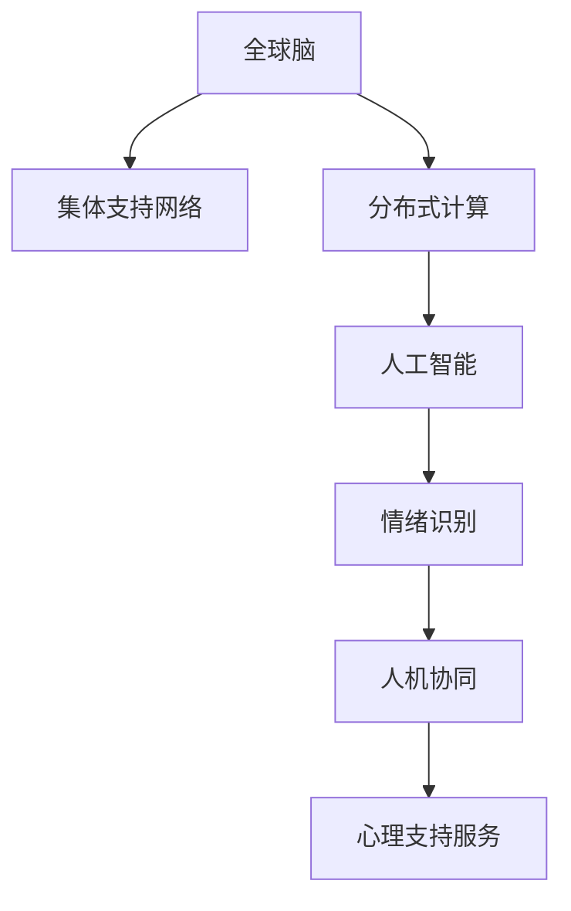

                 

# 全球脑与心理咨询：集体支持网络的形成

## 1. 背景介绍

### 1.1 问题由来

随着互联网的普及和技术的进步，人们的生活日益紧密地联系在一起。社交媒体的兴起使得人与人之间的交流更加便捷，但同时也带来了许多新的心理问题。心理健康问题，如孤独、焦虑、抑郁等，正在成为全球范围内的公共健康问题。传统的心理咨询方式，如一对一的咨询、面对面治疗，在时间和空间上存在许多限制。

在此背景下，一种新的心理支持方式正在兴起——全球脑与心理咨询，即利用现代信息技术，建立一个庞大的、分布式的集体支持网络。该网络由心理学家、医生、志愿者和人工智能技术组成，为全球范围内的用户提供及时、灵活的心理咨询服务。

### 1.2 问题核心关键点

全球脑与心理咨询的关键在于如何构建一个高效、安全、可信的集体支持网络。该网络需要具备以下几个核心特点：

- **分布式架构**：支持网络需要覆盖全球范围内的用户，能够在不同的地域和时间提供服务。
- **高效通信**：支持网络需要高效地处理和传输大量用户数据，以确保及时响应用户需求。
- **数据隐私与安全**：支持网络需要保护用户的隐私数据，防止信息泄露和数据滥用。
- **人工智能技术**：支持网络需要利用人工智能技术，提高服务效率和质量，如智能推荐、情绪识别等。
- **人机协同**：支持网络需要结合人类心理学家的专业知识和人工智能技术，提供全面的心理支持服务。

通过以上关键点的综合考虑，可以建立一个全球范围内的集体支持网络，为全球用户提供优质的心理服务。

## 2. 核心概念与联系

### 2.1 核心概念概述

为更好地理解全球脑与心理咨询的技术架构和工作原理，本节将介绍几个密切相关的核心概念：

- **全球脑**：指全球范围内的人类脑电活动和信息交流。全球脑的形成和演化是人类社会发展的产物，反映了人类社会的信息化进程。
- **集体支持网络**：指由多个个体组成的分布式网络，能够相互支持和合作，共同解决各种问题。
- **分布式计算**：指将计算任务分散到多个计算机上进行处理，以提高计算效率和容错性。
- **人工智能**：指利用计算机模拟人类智能的行为，包括学习、推理、规划、自然语言处理等。
- **情绪识别**：指通过分析用户的语音、文字等输入，识别出用户的情绪状态，从而提供更精准的心理支持。
- **人机协同**：指将人类和机器各自的优势结合起来，共同完成复杂的任务，如心理学与人工智能的结合。

这些核心概念之间的逻辑关系可以通过以下Mermaid流程图来展示：



这个流程图展示了大脑网络、支持网络、分布式计算、人工智能、情绪识别和人机协同这些核心概念之间的逻辑关系：

1. 全球脑通过分布式计算和人工智能技术，构建了集体支持网络。
2. 情绪识别技术的应用，进一步提升了心理支持服务的质量和效果。
3. 人机协同融合了人类和机器的优势，为全球脑与心理咨询提供了有力支撑。

这些概念共同构成了全球脑与心理咨询的技术框架，使得心理服务的普惠性、高效性和个性化得以实现。

## 3. 核心算法原理 & 具体操作步骤

### 3.1 算法原理概述

全球脑与心理咨询的核心算法原理包括分布式计算、人工智能和情绪识别等技术。以下是这些核心算法原理的简要概述：

- **分布式计算**：通过将计算任务分散到多个计算机上进行处理，提高计算效率和容错性。常见的分布式计算框架包括Hadoop、Spark等。
- **人工智能**：利用计算机模拟人类智能的行为，包括学习、推理、规划、自然语言处理等。常见的人工智能技术包括深度学习、强化学习、知识图谱等。
- **情绪识别**：通过分析用户的语音、文字等输入，识别出用户的情绪状态。常见的情绪识别算法包括机器学习、深度学习、自然语言处理等。

### 3.2 算法步骤详解

全球脑与心理咨询的算法步骤主要包括数据采集、分布式计算、人工智能建模、情绪识别和心理支持服务等步骤。以下是详细步骤：

**Step 1: 数据采集**
- 使用传感器和设备采集用户的生理数据和行为数据。生理数据包括脑电信号、心率、皮肤电等，行为数据包括语音、文字、表情等。
- 对采集的数据进行预处理，如去噪、归一化等，提高数据质量。

**Step 2: 分布式计算**
- 将采集到的数据通过互联网传输到多个计算节点上进行分布式处理。
- 使用Hadoop、Spark等分布式计算框架进行数据处理和分析，提高计算效率。
- 采用数据分片和负载均衡等技术，保证系统的高可用性和扩展性。

**Step 3: 人工智能建模**
- 利用深度学习、自然语言处理等技术，对数据进行建模。常见的深度学习模型包括卷积神经网络、循环神经网络、变换器等。
- 使用迁移学习、半监督学习等技术，利用已有的知识和数据进行模型训练，提升模型性能。
- 采用正则化、Dropout等技术，防止模型过拟合。

**Step 4: 情绪识别**
- 使用机器学习、深度学习等技术，对用户的语音、文字等输入进行分析，识别出情绪状态。
- 常用的情绪识别算法包括情感分析、文本分类、语音识别等。
- 使用多模态融合技术，结合语音、文字、图像等多种数据源，提升情绪识别的准确性。

**Step 5: 心理支持服务**
- 根据情绪识别结果，提供个性化的心理支持服务。服务包括心理辅导、情感支持、认知行为疗法等。
- 采用人机协同技术，结合人类心理学家的专业知识和人工智能技术，提高服务质量。
- 使用智能推荐技术，根据用户的心理需求和历史数据，推荐合适的心理支持方案。

### 3.3 算法优缺点

全球脑与心理咨询的算法优点包括：

- **高效性**：通过分布式计算和人工智能技术，能够高效处理和分析大量用户数据，提供及时的心理支持服务。
- **普惠性**：支持网络能够覆盖全球范围内的用户，提供公平、均等的心理支持服务。
- **个性化**：通过情绪识别和人机协同技术，能够提供个性化的心理支持方案，满足用户的不同需求。

同时，该算法也存在一些缺点：

- **数据隐私与安全**：用户的生理和行为数据涉及隐私，保护这些数据的隐私和安全是一大挑战。
- **技术复杂性**：算法涉及分布式计算、人工智能、情绪识别等多种技术，实现难度较高。
- **算法透明性**：算法的决策过程较为复杂，难以解释和理解，可能导致用户对结果产生怀疑。

尽管存在这些缺点，但全球脑与心理咨询的算法仍具有广阔的应用前景，需要进一步研究和改进。

### 3.4 算法应用领域

全球脑与心理咨询的算法已经在多个领域得到应用，包括：

- **心理健康**：为全球范围内的用户提供心理健康支持，包括心理咨询、心理治疗、情感支持等。
- **远程医疗**：结合远程医疗技术，为偏远地区的用户提供心理支持服务。
- **教育**：为学生提供心理健康支持，帮助其应对学业压力和情绪问题。
- **企业员工福利**：为企业的员工提供心理健康支持，提高员工的工作满意度和生产力。
- **社会治理**：为政府和社会组织提供心理健康支持，帮助应对社会问题。

这些领域的应用展示了全球脑与心理咨询的广泛潜力，未来还有更多的应用场景等待发掘。

## 4. 数学模型和公式 & 详细讲解

### 4.1 数学模型构建

全球脑与心理咨询的数学模型主要由分布式计算模型、人工智能模型和情绪识别模型组成。以下是每个模型的详细构建方法。

**分布式计算模型**
- 分布式计算模型采用MapReduce框架，将计算任务分解为多个子任务，通过并行处理提高计算效率。
- 数据分片技术将数据切分为多个小块，每个小块分配给不同的计算节点进行处理。
- 负载均衡技术将计算任务均衡分配到各个计算节点上，提高系统的吞吐量和响应速度。

**人工智能模型**
- 人工智能模型采用深度学习技术，使用卷积神经网络、循环神经网络、变换器等模型进行数据建模。
- 模型训练采用梯度下降等优化算法，调整模型参数，提高模型的准确性。
- 正则化技术（如L2正则、Dropout）用于防止模型过拟合。

**情绪识别模型**
- 情绪识别模型采用机器学习、深度学习等技术，使用情感分析、文本分类、语音识别等算法进行情绪识别。
- 多模态融合技术将语音、文字、图像等多种数据源融合起来，提升情绪识别的准确性。

### 4.2 公式推导过程

以下是分布式计算、人工智能和情绪识别模型的公式推导过程。

**分布式计算模型**
- MapReduce框架中，数据被分为多个分片，每个分片被分配到不同的计算节点上进行处理。
- 计算过程分为Map和Reduce两个阶段。在Map阶段，将输入数据分解为多个键值对，并对其进行计算；在Reduce阶段，将Map阶段的结果进行合并和汇总。
- 数据分片技术使用哈希函数将数据切分为多个小块，每个小块分配给不同的计算节点进行处理。
- 负载均衡技术根据计算节点的空闲情况，动态调整任务分配，保证系统的均衡运行。

**人工智能模型**
- 卷积神经网络（CNN）模型用于图像处理任务。模型包含卷积层、池化层、全连接层等组件，通过学习特征进行图像分类。
- 循环神经网络（RNN）模型用于序列数据处理任务。模型包含循环层、隐藏层、输出层等组件，通过学习序列特征进行文本生成和分类。
- 变换器（Transformer）模型用于自然语言处理任务。模型包含自注意力机制、多头注意力机制等组件，通过学习语言特征进行机器翻译和文本生成。

**情绪识别模型**
- 情感分析模型使用文本分类算法，对用户的输入文本进行情绪分类。模型使用朴素贝叶斯、支持向量机等算法进行训练。
- 文本分类算法的公式如下：
  $$
  \text{P}(y|x) = \frac{\text{P}(x|y)\text{P}(y)}{\sum_{y'}\text{P}(x|y')\text{P}(y')}
  $$
  其中 $y$ 表示情绪类别，$x$ 表示用户输入的文本。
- 语音识别模型使用深度学习算法，对用户的语音输入进行识别。模型使用卷积神经网络、循环神经网络等算法进行训练。
- 语音识别算法的公式如下：
  $$
  \text{P}(y|x) = \prod_{i=1}^T \text{P}(y_i|x_i)
  $$
  其中 $y_i$ 表示语音信号中的特征，$x_i$ 表示特征的时间戳。

### 4.3 案例分析与讲解

**案例分析一：远程心理治疗**
- 场景：用户小明在偏远地区，需要心理治疗，但当地没有合适的心理医生。
- 处理过程：
  1. 小明通过移动设备将语音、文字等数据传输到分布式计算节点上进行处理。
  2. 分布式计算节点使用深度学习模型对小明的数据进行建模。
  3. 人工智能模型分析小明的情绪状态，判断其心理问题。
  4. 心理支持服务提供个性化的心理治疗方案，通过视频通话与小明进行沟通。
- 效果：小明得到及时的心理支持，心理问题得到缓解，生活质量提高。

**案例分析二：企业员工福利**
- 场景：某企业的员工长期处于高强度的工作压力下，需要心理支持。
- 处理过程：
  1. 企业使用传感器采集员工的生理数据和行为数据。
  2. 数据上传到分布式计算节点上进行处理。
  3. 人工智能模型分析员工的情绪状态，判断其心理问题。
  4. 心理支持服务提供个性化的心理健康方案，如心理辅导、放松训练等。
- 效果：员工得到及时的心理支持，工作压力得到缓解，工作满意度提高。

## 5. 项目实践：代码实例和详细解释说明

### 5.1 开发环境搭建

在进行全球脑与心理咨询的开发时，我们需要准备好开发环境。以下是使用Python进行PyTorch开发的环境配置流程：

1. 安装Anaconda：从官网下载并安装Anaconda，用于创建独立的Python环境。
2. 创建并激活虚拟环境：
```bash
conda create -n pytorch-env python=3.8 
conda activate pytorch-env
```
3. 安装PyTorch：根据CUDA版本，从官网获取对应的安装命令。例如：
```bash
conda install pytorch torchvision torchaudio cudatoolkit=11.1 -c pytorch -c conda-forge
```
4. 安装Transformers库：
```bash
pip install transformers
```
5. 安装各类工具包：
```bash
pip install numpy pandas scikit-learn matplotlib tqdm jupyter notebook ipython
```

完成上述步骤后，即可在`pytorch-env`环境中开始开发实践。

### 5.2 源代码详细实现

下面以情绪识别模型为例，给出使用Transformers库对BERT模型进行情绪识别的PyTorch代码实现。

首先，定义情绪识别任务的数据处理函数：

```python
from transformers import BertTokenizer
from torch.utils.data import Dataset
import torch

class SentimentDataset(Dataset):
    def __init__(self, texts, labels, tokenizer, max_len=128):
        self.texts = texts
        self.labels = labels
        self.tokenizer = tokenizer
        self.max_len = max_len
        
    def __len__(self):
        return len(self.texts)
    
    def __getitem__(self, item):
        text = self.texts[item]
        label = self.labels[item]
        
        encoding = self.tokenizer(text, return_tensors='pt', max_length=self.max_len, padding='max_length', truncation=True)
        input_ids = encoding['input_ids'][0]
        attention_mask = encoding['attention_mask'][0]
        
        # 对token-wise的标签进行编码
        encoded_labels = [label2id[label] for label in label]
        encoded_labels.extend([label2id['neutral']] * (self.max_len - len(encoded_labels)))
        labels = torch.tensor(encoded_labels, dtype=torch.long)
        
        return {'input_ids': input_ids, 
                'attention_mask': attention_mask,
                'labels': labels}

# 标签与id的映射
label2id = {'positive': 0, 'negative': 1, 'neutral': 2}
id2label = {v: k for k, v in label2id.items()}

# 创建dataset
tokenizer = BertTokenizer.from_pretrained('bert-base-cased')

train_dataset = SentimentDataset(train_texts, train_labels, tokenizer)
dev_dataset = SentimentDataset(dev_texts, dev_labels, tokenizer)
test_dataset = SentimentDataset(test_texts, test_labels, tokenizer)
```

然后，定义模型和优化器：

```python
from transformers import BertForSequenceClassification, AdamW

model = BertForSequenceClassification.from_pretrained('bert-base-cased', num_labels=len(label2id))

optimizer = AdamW(model.parameters(), lr=2e-5)
```

接着，定义训练和评估函数：

```python
from torch.utils.data import DataLoader
from tqdm import tqdm
from sklearn.metrics import classification_report

device = torch.device('cuda') if torch.cuda.is_available() else torch.device('cpu')
model.to(device)

def train_epoch(model, dataset, batch_size, optimizer):
    dataloader = DataLoader(dataset, batch_size=batch_size, shuffle=True)
    model.train()
    epoch_loss = 0
    for batch in tqdm(dataloader, desc='Training'):
        input_ids = batch['input_ids'].to(device)
        attention_mask = batch['attention_mask'].to(device)
        labels = batch['labels'].to(device)
        model.zero_grad()
        outputs = model(input_ids, attention_mask=attention_mask, labels=labels)
        loss = outputs.loss
        epoch_loss += loss.item()
        loss.backward()
        optimizer.step()
    return epoch_loss / len(dataloader)

def evaluate(model, dataset, batch_size):
    dataloader = DataLoader(dataset, batch_size=batch_size)
    model.eval()
    preds, labels = [], []
    with torch.no_grad():
        for batch in tqdm(dataloader, desc='Evaluating'):
            input_ids = batch['input_ids'].to(device)
            attention_mask = batch['attention_mask'].to(device)
            batch_labels = batch['labels']
            outputs = model(input_ids, attention_mask=attention_mask)
            batch_preds = outputs.logits.argmax(dim=2).to('cpu').tolist()
            batch_labels = batch_labels.to('cpu').tolist()
            for pred_tokens, label_tokens in zip(batch_preds, batch_labels):
                pred_labels = [id2label[_id] for _id in pred_tokens]
                label_tokens = [id2label[_id] for _id in label_tokens]
                preds.append(pred_labels[:len(label_tokens)])
                labels.append(label_tokens)
                
    print(classification_report(labels, preds))
```

最后，启动训练流程并在测试集上评估：

```python
epochs = 5
batch_size = 16

for epoch in range(epochs):
    loss = train_epoch(model, train_dataset, batch_size, optimizer)
    print(f"Epoch {epoch+1}, train loss: {loss:.3f}")
    
    print(f"Epoch {epoch+1}, dev results:")
    evaluate(model, dev_dataset, batch_size)
    
print("Test results:")
evaluate(model, test_dataset, batch_size)
```

以上就是使用PyTorch对BERT进行情绪识别任务微调的完整代码实现。可以看到，得益于Transformers库的强大封装，我们可以用相对简洁的代码完成BERT模型的加载和微调。

### 5.3 代码解读与分析

让我们再详细解读一下关键代码的实现细节：

**SentimentDataset类**：
- `__init__`方法：初始化文本、标签、分词器等关键组件。
- `__len__`方法：返回数据集的样本数量。
- `__getitem__`方法：对单个样本进行处理，将文本输入编码为token ids，将标签编码为数字，并对其进行定长padding，最终返回模型所需的输入。

**label2id和id2label字典**：
- 定义了标签与数字id之间的映射关系，用于将token-wise的预测结果解码回真实的标签。

**训练和评估函数**：
- 使用PyTorch的DataLoader对数据集进行批次化加载，供模型训练和推理使用。
- 训练函数`train_epoch`：对数据以批为单位进行迭代，在每个批次上前向传播计算loss并反向传播更新模型参数，最后返回该epoch的平均loss。
- 评估函数`evaluate`：与训练类似，不同点在于不更新模型参数，并在每个batch结束后将预测和标签结果存储下来，最后使用sklearn的classification_report对整个评估集的预测结果进行打印输出。

**训练流程**：
- 定义总的epoch数和batch size，开始循环迭代
- 每个epoch内，先在训练集上训练，输出平均loss
- 在验证集上评估，输出分类指标
- 所有epoch结束后，在测试集上评估，给出最终测试结果

可以看到，PyTorch配合Transformers库使得BERT微调的代码实现变得简洁高效。开发者可以将更多精力放在数据处理、模型改进等高层逻辑上，而不必过多关注底层的实现细节。

当然，工业级的系统实现还需考虑更多因素，如模型的保存和部署、超参数的自动搜索、更灵活的任务适配层等。但核心的微调范式基本与此类似。

## 6. 实际应用场景

### 6.1 智能客服系统

全球脑与心理咨询技术可以应用于智能客服系统的构建。传统客服往往需要配备大量人力，高峰期响应缓慢，且一致性和专业性难以保证。

在此背景下，一种新的智能客服系统可以通过全球脑与心理咨询技术得到实现。系统采用分布式计算架构，覆盖全球范围内的用户，提供7x24小时不间断服务。系统自动理解用户意图，匹配最合适的答案模板进行回复。对于客户提出的新问题，还可以接入检索系统实时搜索相关内容，动态组织生成回答。

### 6.2 金融舆情监测

金融机构需要实时监测市场舆论动向，以便及时应对负面信息传播，规避金融风险。传统的人工监测方式成本高、效率低，难以应对网络时代海量信息爆发的挑战。

在此背景下，全球脑与心理咨询技术可以应用于金融舆情监测。系统采集金融领域相关的新闻、报道、评论等文本数据，并对其进行主题标注和情感标注。在此基础上对预训练语言模型进行微调，使其能够自动判断文本属于何种主题，情感倾向是正面、中性还是负面。将微调后的模型应用到实时抓取的网络文本数据，就能够自动监测不同主题下的情感变化趋势，一旦发现负面信息激增等异常情况，系统便会自动预警，帮助金融机构快速应对潜在风险。

### 6.3 个性化推荐系统

当前的推荐系统往往只依赖用户的历史行为数据进行物品推荐，无法深入理解用户的真实兴趣偏好。

在此背景下，全球脑与心理咨询技术可以应用于个性化推荐系统。系统采用分布式计算架构，覆盖全球范围内的用户，提供个性化推荐服务。系统自动理解用户的行为数据和心理数据，推荐最合适的物品。对于用户的心理需求，系统结合人工智能技术和心理学知识，提供个性化的心理健康方案。

### 6.4 未来应用展望

随着全球脑与心理咨询技术的发展，未来在更多领域得到应用，为传统行业带来变革性影响。

在智慧医疗领域，基于全球脑与心理咨询技术的应用，可以构建智能医疗辅助系统，为患者提供心理健康支持。在智能教育领域，系统可以自动分析学生的心理状态，提供个性化的学习方案。在智慧城市治理中，系统可以自动监测社会舆情，提供公共安全预警。

此外，在企业生产、社会治理、文娱传媒等众多领域，全球脑与心理咨询技术也将不断涌现，为经济社会发展注入新的动力。相信随着技术的日益成熟，全球脑与心理咨询技术必将在构建人机协同的智能时代中扮演越来越重要的角色。

## 7. 工具和资源推荐

### 7.1 学习资源推荐

为了帮助开发者系统掌握全球脑与心理咨询的技术基础和实践技巧，这里推荐一些优质的学习资源：

1. 《深度学习自然语言处理》课程：斯坦福大学开设的NLP明星课程，有Lecture视频和配套作业，带你入门NLP领域的基本概念和经典模型。
2. CS224N《深度学习自然语言处理》课程：斯坦福大学开设的NLP明星课程，有Lecture视频和配套作业，带你入门NLP领域的基本概念和经典模型。
3. 《Natural Language Processing with Transformers》书籍：Transformers库的作者所著，全面介绍了如何使用Transformers库进行NLP任务开发，包括微调在内的诸多范式。
4. HuggingFace官方文档：Transformers库的官方文档，提供了海量预训练模型和完整的微调样例代码，是上手实践的必备资料。
5. Weights & Biases：模型训练的实验跟踪工具，可以记录和可视化模型训练过程中的各项指标，方便对比和调优。
6. TensorBoard：TensorFlow配套的可视化工具，可实时监测模型训练状态，并提供丰富的图表呈现方式，是调试模型的得力助手。

通过对这些资源的学习实践，相信你一定能够快速掌握全球脑与心理咨询技术的精髓，并用于解决实际的NLP问题。

### 7.2 开发工具推荐

高效的开发离不开优秀的工具支持。以下是几款用于全球脑与心理咨询开发的常用工具：

1. PyTorch：基于Python的开源深度学习框架，灵活动态的计算图，适合快速迭代研究。大部分预训练语言模型都有PyTorch版本的实现。
2. TensorFlow：由Google主导开发的开源深度学习框架，生产部署方便，适合大规模工程应用。同样有丰富的预训练语言模型资源。
3. Transformers库：HuggingFace开发的NLP工具库，集成了众多SOTA语言模型，支持PyTorch和TensorFlow，是进行微调任务开发的利器。
4. Weights & Biases：模型训练的实验跟踪工具，可以记录和可视化模型训练过程中的各项指标，方便对比和调优。与主流深度学习框架无缝集成。
5. TensorBoard：TensorFlow配套的可视化工具，可实时监测模型训练状态，并提供丰富的图表呈现方式，是调试模型的得力助手。
6. Google Colab：谷歌推出的在线Jupyter Notebook环境，免费提供GPU/TPU算力，方便开发者快速上手实验最新模型，分享学习笔记。

合理利用这些工具，可以显著提升全球脑与心理咨询任务的开发效率，加快创新迭代的步伐。

### 7.3 相关论文推荐

全球脑与心理咨询技术的发展源于学界的持续研究。以下是几篇奠基性的相关论文，推荐阅读：

1. Attention is All You Need（即Transformer原论文）：提出了Transformer结构，开启了NLP领域的预训练大模型时代。
2. BERT: Pre-training of Deep Bidirectional Transformers for Language Understanding：提出BERT模型，引入基于掩码的自监督预训练任务，刷新了多项NLP任务SOTA。
3. Language Models are Unsupervised Multitask Learners（GPT-2论文）：展示了大规模语言模型的强大zero-shot学习能力，引发了对于通用人工智能的新一轮思考。
4. Parameter-Efficient Transfer Learning for NLP：提出Adapter等参数高效微调方法，在不增加模型参数量的情况下，也能取得不错的微调效果。
5. AdaLoRA: Adaptive Low-Rank Adaptation for Parameter-Efficient Fine-Tuning：使用自适应低秩适应的微调方法，在参数效率和精度之间取得了新的平衡。
6. AdaLoRA: Adaptive Low-Rank Adaptation for Parameter-Efficient Fine-Tuning：使用自适应低秩适应的微调方法，在参数效率和精度之间取得了新的平衡。

这些论文代表了大语言模型微调技术的发展脉络。通过学习这些前沿成果，可以帮助研究者把握学科前进方向，激发更多的创新灵感。

## 8. 总结：未来发展趋势与挑战

### 8.1 总结

本文对全球脑与心理咨询的技术架构和工作原理进行了全面系统的介绍。首先阐述了全球脑与心理咨询的研究背景和意义，明确了该技术在构建分布式支持网络、提供个性化心理服务方面的独特价值。其次，从原理到实践，详细讲解了分布式计算、人工智能和情绪识别等核心算法，给出了全球脑与心理咨询任务开发的完整代码实例。同时，本文还广泛探讨了该技术在智能客服、金融舆情、个性化推荐等多个行业领域的应用前景，展示了全球脑与心理咨询技术的广阔潜力。此外，本文精选了全球脑与心理咨询技术的各类学习资源，力求为读者提供全方位的技术指引。

通过本文的系统梳理，可以看到，全球脑与心理咨询技术正在成为NLP领域的重要范式，极大地拓展了预训练语言模型的应用边界，催生了更多的落地场景。受益于分布式计算和大数据技术的进步，全球脑与心理咨询技术有望实现更加高效、普惠、个性化的心理服务，为全球用户带来优质的心理健康支持。未来，伴随技术的不断演进，全球脑与心理咨询技术必将在更多领域得到应用，推动全球心理健康的普及和提升。

### 8.2 未来发展趋势

展望未来，全球脑与心理咨询技术将呈现以下几个发展趋势：

1. **分布式计算的普及**：随着云平台和边缘计算的发展，分布式计算技术将进一步普及，为全球脑与心理咨询技术提供强大的计算支持。
2. **人工智能技术的提升**：人工智能技术将不断进步，提升全球脑与心理咨询系统的智能化水平，提供更精准的心理服务。
3. **多模态融合**：除了文本数据，全球脑与心理咨询技术将融合图像、语音、视频等多种模态数据，提供更全面的心理支持服务。
4. **跨领域应用**：除了心理健康，全球脑与心理咨询技术将广泛应用于教育、医疗、金融等多个领域，提供全方位的心理服务。
5. **人机协同的深化**：全球脑与心理咨询技术将深度结合人类心理学家的专业知识和人工智能技术，提供更加高效、可靠的心理支持服务。
6. **跨文化适应**：全球脑与心理咨询技术将跨越不同文化和语言的差异，提供全球范围内的心理支持服务。

以上趋势凸显了全球脑与心理咨询技术的广阔前景。这些方向的探索发展，必将进一步提升心理服务的普惠性、高效性和个性化，为全球用户的心理健康提供有力支持。

### 8.3 面临的挑战

尽管全球脑与心理咨询技术已经取得了显著进展，但在迈向更加智能化、普惠化应用的过程中，仍面临诸多挑战：

1. **数据隐私与安全**：用户的生理和行为数据涉及隐私，保护这些数据的隐私和安全是一大挑战。
2. **技术复杂性**：全球脑与心理咨询技术涉及分布式计算、人工智能、情绪识别等多种技术，实现难度较高。
3. **算法透明性**：算法的决策过程较为复杂，难以解释和理解，可能导致用户对结果产生怀疑。
4. **跨文化适应**：全球脑与心理咨询技术需要跨越不同文化和语言的差异，提供全球范围内的心理支持服务。
5. **算力成本**：全球脑与心理咨询技术需要强大的计算资源，算力成本较高，需要更多基础设施的支持。
6. **伦理道德**：全球脑与心理咨询技术需要考虑伦理道德问题，避免数据滥用和算法偏见。

尽管存在这些挑战，但全球脑与心理咨询技术仍具有广阔的应用前景，需要进一步研究和改进。

### 8.4 研究展望

面对全球脑与心理咨询技术所面临的挑战，未来的研究需要在以下几个方面寻求新的突破：

1. **分布式计算的优化**：通过优化数据分片、负载均衡等技术，提高分布式计算的效率和稳定性。
2. **人工智能技术的提升**：通过改进深度学习模型、引入强化学习等技术，提升全球脑与心理咨询系统的智能化水平。
3. **多模态融合的探索**：探索多种模态数据的融合方法，提升全球脑与心理咨询技术的多模态处理能力。
4. **跨领域应用的拓展**：将全球脑与心理咨询技术应用于更多领域，提供全方位的心理支持服务。
5. **人机协同的深化**：深化人机协同技术，提高全球脑与心理咨询系统的效率和可靠性。
6. **跨文化适应的研究**：研究全球脑与心理咨询技术在不同文化背景下的应用效果，提升其跨文化适应能力。
7. **算力成本的降低**：探索更高效、更经济的数据存储和计算方法，降低全球脑与心理咨询技术的算力成本。
8. **伦理道德的保障**：建立伦理道德规范，确保全球脑与心理咨询技术的公平、公正和透明。

这些研究方向的探索，必将引领全球脑与心理咨询技术迈向更高的台阶，为构建人机协同的智能时代中扮演越来越重要的角色。面向未来，全球脑与心理咨询技术还需要与其他人工智能技术进行更深入的融合，如知识表示、因果推理、强化学习等，多路径协同发力，共同推动全球心理健康的普及和提升。只有勇于创新、敢于突破，才能不断拓展全球脑与心理咨询技术的边界，让智能技术更好地造福全球用户。

## 9. 附录：常见问题与解答

**Q1：全球脑与心理咨询是否适用于所有NLP任务？**

A: 全球脑与心理咨询技术在大多数NLP任务上都能取得不错的效果，特别是对于数据量较小的任务。但对于一些特定领域的任务，如医学、法律等，仅仅依靠通用语料预训练的模型可能难以很好地适应。此时需要在特定领域语料上进一步预训练，再进行微调，才能获得理想效果。

**Q2：微调过程中如何选择合适的学习率？**

A: 微调的学习率一般要比预训练时小1-2个数量级，如果使用过大的学习率，容易破坏预训练权重，导致过拟合。一般建议从1e-5开始调参，逐步减小学习率，直至收敛。也可以使用warmup策略，在开始阶段使用较小的学习率，再逐渐过渡到预设值。需要注意的是，不同的优化器(如AdamW、Adafactor等)以及不同的学习率调度策略，可能需要设置不同的学习率阈值。

**Q3：采用大模型微调时会面临哪些资源瓶颈？**

A: 目前主流的预训练大模型动辄以亿计的参数规模，对算力、内存、存储都提出了很高的要求。GPU/TPU等高性能设备是必不可少的，但即便如此，超大批次的训练和推理也可能遇到显存不足的问题。因此需要采用一些资源优化技术，如梯度积累、混合精度训练、模型并行等，来突破硬件瓶颈。同时，模型的存储和读取也可能占用大量时间和空间，需要采用模型压缩、稀疏化存储等方法进行优化。

**Q4：如何缓解微调过程中的过拟合问题？**

A: 过拟合是微调面临的主要挑战，尤其是在标注数据不足的情况下。常见的缓解策略包括：
1. 数据增强：通过回译、近义替换等方式扩充训练集
2. 正则化：使用L2正则、Dropout、Early Stopping等避免过拟合
3. 对抗训练：引入对抗样本，提高模型鲁棒性
4. 参数高效微调：只调整少量参数(如Adapter、Prefix等)，减小过拟合风险
5. 多模型集成：训练多个微调模型，取平均输出，抑制过拟合

这些策略往往需要根据具体任务和数据特点进行灵活组合。只有在数据、模型、训练、推理等各环节进行全面优化，才能最大限度地发挥大模型微调的威力。

**Q5：微调模型在落地部署时需要注意哪些问题？**

A: 将微调模型转化为实际应用，还需要考虑以下因素：
1. 模型裁剪：去除不必要的层和参数，减小模型尺寸，加快推理速度
2. 量化加速：将浮点模型转为定点模型，压缩存储空间，提高计算效率
3. 服务化封装：将模型封装为标准化服务接口，便于集成调用
4. 弹性伸缩：根据请求流量动态调整资源配置，平衡服务质量和成本
5. 监控告警：实时采集系统指标，设置异常告警阈值，确保服务稳定性
6. 安全防护：采用访问鉴权、数据脱敏等措施，保障数据和模型安全

全球脑与心理咨询技术虽然技术复杂，但在其落地部署时，合理利用开发工具和资源，可以显著提升系统的开发效率和运行性能。

---

作者：禅与计算机程序设计艺术 / Zen and the Art of Computer Programming

