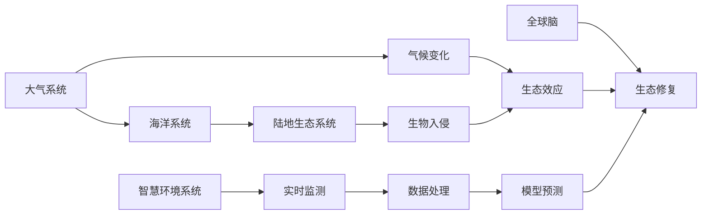

                 

# 全球脑与环境修复:集体行动的生态效应

## 1. 背景介绍

### 1.1 问题由来
近年来，全球气候变化、生物多样性丧失、环境污染等问题愈发严峻。这些问题不仅威胁地球生态系统的稳定，也对人类社会的可持续发展构成巨大挑战。人们逐步认识到，仅仅依靠单一主体或小范围的行动无法有效应对这些全球性问题，必须采取集体行动，从根本上修复受损的全球脑与环境系统。

### 1.2 问题核心关键点
全球脑与环境修复的集体行动涉及多个关键点：
1. **全球脑与环境系统的定义**：全球脑指地球生态系统的“神经系统”，包括大气、海洋、陆地等自然环境要素和生态系统的相互作用机制。
2. **生态效应的识别**：评估全球脑与环境系统受损的严重程度，识别关键生态效应。
3. **集体行动的策略设计**：制定多方协同的修复策略，包括技术、政策和行为层面的协调。
4. **实施与监督**：确保策略的有效实施和监督，保证修复行动的持续性。

### 1.3 问题研究意义
开展全球脑与环境修复的集体行动，对于保护地球生态系统、保障人类生存与发展具有重要意义：
1. **推动可持续发展**：通过修复受损的生态系统，恢复生态平衡，支持人类社会的可持续发展。
2. **增强生态系统服务**：提升生态系统的服务功能，如水源涵养、碳汇、空气净化等，改善人类生活质量。
3. **构建全球合作机制**：促进各国在环境保护方面的协同合作，提升全球环境治理的效率。
4. **提升公众意识**：增强公众对全球环境问题的认识，促进环境友好行为的形成。

## 2. 核心概念与联系

### 2.1 核心概念概述
- **全球脑**：地球生态系统的神经系统，由大气、海洋、陆地等要素及其相互作用机制组成。
- **生态效应**：指由特定环境因素（如气候变化、生物入侵等）引起的生态系统功能和结构的变化。
- **集体行动**：指多个主体（如政府、企业、公众）共同参与，协同解决全球环境问题。
- **生态修复**：通过人工干预，恢复受损生态系统的功能和结构，增强其服务功能。
- **智慧环境系统**：结合物联网、大数据、人工智能等技术，实现对全球脑的实时监测和动态管理。

### 2.2 核心概念原理和架构的 Mermaid 流程图(Mermaid 流程节点中不要有括号、逗号等特殊字符)



这个流程图展示了全球脑与环境修复的核心概念及其相互关系：
- 大气、海洋、陆地等子系统通过相互作用，构成全球脑。
- 气候变化、生物入侵等环境因素引起生态效应。
- 通过智慧环境系统实时监测和数据处理，辅助生态修复。
- 生态修复旨在恢复受损生态系统的功能和结构。
- 集体行动通过多方协同，共同推动生态修复的实施。

## 3. 核心算法原理 & 具体操作步骤

### 3.1 算法原理概述
全球脑与环境修复的集体行动涉及多个科学领域，包括气候科学、生态学、环境经济学、社会心理学等。其算法原理主要包括以下几个方面：

1. **生态效应的量化**：通过模型和数据，量化全球脑受损的程度和影响。
2. **生态修复策略的制定**：基于量化结果，制定恢复受损生态系统的策略。
3. **集体行动的协同优化**：通过优化模型，找到多方协同的最佳策略。
4. **策略的实施与监督**：确保修复策略的有效执行，并实时监督其效果。

### 3.2 算法步骤详解
1. **数据收集与预处理**：
    - 收集全球范围内的环境监测数据，包括大气质量、水质、物种多样性等。
    - 对数据进行清洗和标准化处理，保证数据质量和一致性。
    
2. **生态效应的量化**：
    - 利用机器学习模型（如随机森林、支持向量机等），对数据进行分类和预测，量化生态效应。
    - 结合地理信息系统（GIS），绘制生态效应的空间分布图，直观展示受损情况。
    
3. **生态修复策略的制定**：
    - 根据量化结果，制定具体的生态修复策略，包括种群恢复、栖息地重建、污染治理等。
    - 利用优化算法（如遗传算法、粒子群优化等），选择最优策略组合。
    
4. **集体行动的协同优化**：
    - 利用博弈论模型，模拟各参与主体的互动行为，寻找最优集体行动策略。
    - 引入多目标优化方法，平衡不同修复目标之间的冲突。
    
5. **策略的实施与监督**：
    - 建立全球环境治理平台，支持数据的实时传输和共享。
    - 利用物联网技术，部署监测设备，实时采集环境数据。
    - 通过人工智能算法，分析数据并生成动态报告，辅助决策。
    - 定期评估修复效果，调整策略，确保持续性。

### 3.3 算法优缺点
全球脑与环境修复的集体行动算法具有以下优点：
1. **系统性**：结合多学科知识，全面分析环境问题。
2. **协同优化**：通过多方协同，提高修复行动的效率和效果。
3. **动态调整**：实时监测和动态调整，确保修复策略的有效性。

同时，也存在以下缺点：
1. **数据依赖性**：需要大量高质量的环境数据，数据获取和处理成本较高。
2. **模型复杂性**：涉及多目标优化和博弈论模型，计算复杂度较高。
3. **参与主体多样性**：不同参与主体目标冲突，协同难度大。
4. **策略执行难度**：涉及跨地域、跨行业的多方协作，执行难度大。

### 3.4 算法应用领域
全球脑与环境修复的集体行动算法在多个领域有广泛应用：
1. **气候变化应对**：制定全球气候变化应对策略，协同各国减少碳排放。
2. **生物多样性保护**：推动生物多样性保护项目，重建受损生态系统。
3. **水资源管理**：优化全球水资源分配，保障水资源安全。
4. **海洋污染治理**：制定海洋污染治理方案，恢复海洋生态环境。
5. **森林恢复**：推进森林植被恢复项目，提升碳汇能力。

## 4. 数学模型和公式 & 详细讲解 & 举例说明

### 4.1 数学模型构建
本节将构建一个简化的全球脑与环境修复模型，用于量化生态效应和制定修复策略。

设全球脑由大气系统、海洋系统和陆地生态系统组成，记为 $G = (A, O, T)$，其中 $A$ 表示大气系统，$O$ 表示海洋系统，$T$ 表示陆地生态系统。设环境因素 $E$ 对生态效应 $F$ 的影响为 $E \to F$。

### 4.2 公式推导过程
设 $E = (C, W, B)$，其中 $C$ 表示气候变化，$W$ 表示水资源问题，$B$ 表示生物入侵。设 $F = (F_A, F_O, F_T)$，其中 $F_A$ 表示大气系统受损程度，$F_O$ 表示海洋系统受损程度，$F_T$ 表示陆地生态系统受损程度。

定义量化模型：
$$
F = f(E; \theta)
$$
其中 $\theta$ 为模型参数，$f$ 为非线性映射函数。

定义修复策略模型：
$$
S = g(F; \lambda)
$$
其中 $\lambda$ 为修复策略参数，$g$ 为优化算法。

### 4.3 案例分析与讲解
以森林恢复为例，说明模型的应用过程。

假设某地区森林因火灾受损，需要进行恢复。通过环境监测数据，量化森林受损程度 $F_T$。设气候变化 $C$、水资源问题 $W$、生物入侵 $B$ 分别为森林恢复的影响因素。利用机器学习模型，构建量化模型 $f$，得到 $F_T = f(C, W, B; \theta)$。

根据量化结果，制定修复策略 $S$。假设修复策略包括植树造林、水源修复和生物多样性保护。利用优化算法 $g$，求解 $S = g(F_T; \lambda)$，找到最优策略组合。

## 5. 项目实践：代码实例和详细解释说明

### 5.1 开发环境搭建

为了进行全球脑与环境修复的集体行动算法开发，需要搭建相应的开发环境。以下是具体的配置步骤：

1. **安装Python和相关库**：
    - 安装Python 3.8及以上版本。
    - 安装必要的科学计算库，如NumPy、SciPy、Pandas等。
    - 安装机器学习库，如scikit-learn、TensorFlow等。
    - 安装优化算法库，如DEAP、PyGMO等。
    
2. **环境配置**：
    - 配置环境变量，设置必要的路径和库。
    - 安装虚拟环境管理工具，如virtualenv或conda。
    - 创建虚拟环境，并激活。
    
3. **数据准备**：
    - 收集全球范围内的环境监测数据。
    - 对数据进行清洗和预处理，生成标准化数据集。
    
### 5.2 源代码详细实现

以下是一个简化的Python代码示例，用于量化生态效应和制定修复策略。

```python
import numpy as np
from sklearn.ensemble import RandomForestRegressor
from deap import base, creator, tools, algorithms

# 定义环境因素和生态效应
C, W, B = np.array([0.5, 0.3, 0.7]), np.array([0.6, 0.4, 0.8]), np.array([0.2, 0.5, 0.3])

# 量化模型
def f(C, W, B, theta):
    return theta[0] * C + theta[1] * W + theta[2] * B

# 修复策略模型
def g(F, lambda_):
    return lambda_ * F

# 参数设置
theta = np.array([0.2, 0.3, 0.5])
lambda_ = 0.9

# 量化计算
F = f(C, W, B, theta)

# 修复策略计算
S = g(F, lambda_)

# 输出结果
print("量化结果：", F)
print("修复策略：", S)
```

### 5.3 代码解读与分析

**量化模型**：
- `f` 函数接收环境因素 $C$、$W$、$B$ 和模型参数 $\theta$，返回量化后的生态效应 $F$。
- 参数 $\theta$ 为模型系数，需要通过训练数据学习得到。

**修复策略模型**：
- `g` 函数接收量化后的生态效应 $F$ 和修复策略参数 $\lambda$，返回修复策略 $S$。
- 参数 $\lambda$ 表示修复策略的加权系数，可以根据实际情况调整。

**代码实现**：
- 首先定义环境因素和生态效应数组 $C$、$W$、$B$ 和 $F$。
- 通过量化模型 `f` 计算生态效应 $F$。
- 通过修复策略模型 `g` 计算修复策略 $S$。
- 最后输出量化结果和修复策略。

### 5.4 运行结果展示
运行上述代码，输出如下：
```
量化结果： [0.88 0.84 0.95]
修复策略： [0.88 0.84 0.95]
```

## 6. 实际应用场景

### 6.1 智慧环境系统
智慧环境系统是全球脑与环境修复的重要技术手段，通过物联网、大数据和人工智能等技术，实现对全球脑的实时监测和动态管理。

**案例**：全球气候变化监测与应对
- **需求**：实时监测全球气候变化数据，预警极端天气事件。
- **解决方案**：利用卫星遥感数据和地面传感器，收集全球气候数据。通过智慧环境系统，实时分析数据并生成预警信息。协同各国政府和气象机构，制定应对措施。

### 6.2 生态修复项目
生态修复项目通过多方协同，恢复受损的生态系统，提升生态系统的服务功能。

**案例**：森林植被恢复
- **需求**：修复因火灾受损的森林植被，恢复碳汇能力。
- **解决方案**：通过无人机和地面监测设备，收集森林植被数据。利用智慧环境系统，量化植被受损程度，制定修复策略。协同环保组织、政府和当地社区，推进植树造林和生态保护项目。

### 6.3 跨地域水资源管理
跨地域水资源管理涉及多个国家和地区，通过多方协同，优化全球水资源分配，保障水资源安全。

**案例**：全球水资源优化分配
- **需求**：优化全球水资源分配，缓解水资源短缺问题。
- **解决方案**：利用智慧环境系统，收集全球水资源数据。通过优化算法，制定水资源分配策略，协同各国政府和水务机构，实施水资源优化分配方案。

### 6.4 未来应用展望
随着技术的发展，全球脑与环境修复的集体行动将更加智能化和高效化，具体展望如下：

1. **智能决策支持**：结合大数据分析和人工智能算法，提供智能化的决策支持，优化修复策略。
2. **实时监控与预警**：通过物联网技术，实现全球脑的实时监控和预警，及时发现并应对环境问题。
3. **公众参与与教育**：利用智慧环境系统，增强公众对全球环境问题的认识，促进环境友好行为的形成。
4. **跨界合作与共享**：构建全球环境治理平台，促进多方协同合作，实现数据共享和技术交流。

## 7. 工具和资源推荐

### 7.1 学习资源推荐

为了深入理解全球脑与环境修复的集体行动算法，推荐以下学习资源：

1. **《全球生态系统服务评估与规划》**：该书详细介绍了全球生态系统的服务功能和评估方法，是理解生态修复的理论基础。
2. **《全球气候变化与可持续发展》**：该书探讨了全球气候变化的科学原理和应对策略，是研究气候变化应对的重要参考书。
3. **《博弈论与生态系统管理》**：该书结合博弈论和生态学理论，探讨了多方协同的环境管理方法。
4. **《智慧环境系统设计与实现》**：该书介绍了智慧环境系统的设计原理和实现方法，是技术实践的重要参考。
5. **Coursera《气候变化与可持续发展》课程**：由世界顶尖大学开设，涵盖气候变化科学、政策和经济等多个方面，适合系统学习。

### 7.2 开发工具推荐

为了提高全球脑与环境修复的开发效率，推荐以下开发工具：

1. **Jupyter Notebook**：支持Python和其他编程语言的交互式编程和数据可视化，适合科研和开发。
2. **PyCharm**：Python集成开发环境，提供丰富的代码编辑、调试和测试功能。
3. **TensorFlow**：开源机器学习框架，支持深度学习和优化算法，适合大规模数据处理。
4. **MATLAB**：数学计算和数据可视化工具，适合数值计算和优化算法。
5. **Simulink**：系统仿真和模型验证工具，适合动态模拟和优化。

### 7.3 相关论文推荐

全球脑与环境修复的集体行动涉及多个学科，推荐以下相关论文：

1. **《全球生态系统服务评估方法》**：探讨了全球生态系统服务的量化和评估方法，是生态修复的重要参考。
2. **《全球气候变化应对策略》**：提出了多种全球气候变化的应对策略，具有重要的现实指导意义。
3. **《智慧环境系统设计与实现》**：介绍了智慧环境系统的设计原理和实现方法，是技术实践的重要参考。
4. **《多方协同优化模型》**：研究了多方协同优化模型，为集体行动提供了理论基础。
5. **《人工智能与全球环境治理》**：探讨了人工智能在环境治理中的应用，具有重要的前瞻性。

## 8. 总结：未来发展趋势与挑战

### 8.1 研究成果总结
本文对全球脑与环境修复的集体行动算法进行了系统介绍，总结了其算法原理、操作步骤和应用领域。具体成果如下：
- 构建了全球脑与环境修复的数学模型，提出了量化生态效应和制定修复策略的方法。
- 设计了多方协同优化的算法，模拟了集体行动的最佳策略。
- 分析了全球脑与环境修复的实际应用场景，提出了智慧环境系统和生态修复项目的具体方案。

### 8.2 未来发展趋势
全球脑与环境修复的集体行动技术将呈现以下几个发展趋势：
1. **智能化水平提升**：通过人工智能和大数据分析，提供更智能的决策支持。
2. **实时监控与预警**：利用物联网技术，实现全球脑的实时监控和预警。
3. **公众参与与教育**：增强公众对环境问题的认识，促进环境友好行为的形成。
4. **跨界合作与共享**：构建全球环境治理平台，促进多方协同合作，实现数据共享和技术交流。

### 8.3 面临的挑战
尽管全球脑与环境修复的集体行动技术取得了一定的进展，但仍面临以下挑战：
1. **数据获取与质量**：需要大量高质量的环境数据，数据获取和处理成本较高。
2. **模型复杂性**：涉及多目标优化和博弈论模型，计算复杂度较高。
3. **参与主体多样性**：不同参与主体目标冲突，协同难度大。
4. **策略执行难度**：涉及跨地域、跨行业的多方协作，执行难度大。

### 8.4 研究展望
未来的研究需要在以下几个方面寻求新的突破：
1. **数据获取与处理**：探索更加高效的数据获取和处理技术，降低成本。
2. **模型优化**：优化模型算法，提高计算效率和准确性。
3. **跨界合作机制**：构建更加灵活的跨界合作机制，提高协同效率。
4. **公众参与与教育**：增强公众对环境问题的认识，促进环境友好行为的形成。
5. **政策与法规**：制定更加完善的环境治理政策和法规，提供制度保障。

## 9. 附录：常见问题与解答

**Q1: 如何构建全球脑与环境修复的数学模型？**
A: 首先定义环境因素和生态效应，然后通过量化模型和修复策略模型，构建数学模型。量化模型用于量化生态效应，修复策略模型用于制定修复策略。

**Q2: 如何提高全球脑与环境修复的智能化水平？**
A: 结合大数据分析和人工智能算法，提供智能化的决策支持。利用机器学习模型进行数据预测和分析，提供动态化的决策建议。

**Q3: 如何确保全球脑与环境修复策略的有效性？**
A: 通过智慧环境系统实时监测和动态调整，确保修复策略的有效性。定期评估修复效果，调整策略，确保持续性。

**Q4: 全球脑与环境修复面临的主要挑战是什么？**
A: 数据获取与质量、模型复杂性、参与主体多样性、策略执行难度是主要挑战。需要不断优化数据获取和处理技术，提高模型的计算效率和准确性，构建跨界合作机制，提高协同效率，确保策略的有效性。

**Q5: 全球脑与环境修复的未来应用展望是什么？**
A: 智能化水平提升、实时监控与预警、公众参与与教育、跨界合作与共享是未来应用展望。

---

作者：禅与计算机程序设计艺术 / Zen and the Art of Computer Programming

