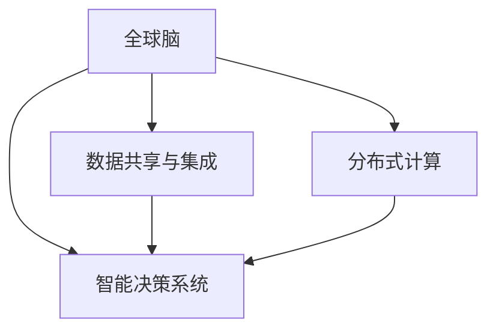

                 

# 全球脑与空间探索:集体智慧助力星际旅行

## 1. 背景介绍

### 1.1 问题由来

在人类探索宇宙的征程中，人工智能(AI)和机器学习(ML)已经展现出巨大的潜力。无论是搜索遥远的星系，分析复杂的天文数据，还是为宇航员提供智能辅助决策，AI和ML都在其中扮演了关键角色。但随着任务复杂度的增加，单个AI或ML系统难以应对所有问题。这就催生了全球脑的概念，通过集结全球的智慧，在星际旅行的不同阶段共同协作，从而更好地应对挑战。

### 1.2 问题核心关键点

全球脑与空间探索结合的核心理念是通过分布式协作，将全球范围内的智慧和资源集中起来，形成一个巨大的“智慧大脑”。该“大脑”能够实时处理和分析来自不同位置的天文数据，快速做出决策，并为星际旅行提供实时支持。全球脑的实现主要包括以下几个关键点：

1. **数据共享与集成**：不同国家、机构和组织的数据共享是全球脑的基石，确保所有可用数据都被整合进统一的平台。
2. **分布式计算**：利用全球范围内的计算资源，实现大规模数据的快速处理和分析。
3. **智能决策系统**：构建基于AI和ML的智能决策系统，为宇航员提供实时决策支持。
4. **实时通信网络**：建立全球范围的通信网络，保证数据和指令的实时传输。
5. **协同训练与优化**：通过协同训练和优化，提高AI模型的性能，使其能够更好地适应不同环境和任务。

## 2. 核心概念与联系

### 2.1 核心概念概述

- **全球脑**：通过分布式协作，集结全球智慧，形成一个大型的“智慧大脑”，用于处理和分析全球范围内的数据，并做出智能决策。
- **星际旅行**：指人类进行的太空探索活动，包括载人飞船和无人探测器等。
- **分布式协作**：指通过全球范围内的合作，共享数据、计算资源和知识，实现协同工作的模式。
- **智能决策系统**：利用AI和ML技术，构建自动化的决策支持系统，帮助宇航员和科学家做出准确、快速决策。
- **数据共享与集成**：通过统一的API和数据格式，实现不同数据源之间的无缝集成和共享。
- **分布式计算**：利用全球范围内的计算资源，处理大规模数据和复杂计算任务。

这些核心概念之间通过数据共享、分布式计算和智能决策系统形成一个有机整体，共同支撑全球脑的运作和星际旅行的执行。

### 2.2 核心概念原理和架构的 Mermaid 流程图



这个流程图展示了全球脑中各核心概念之间的逻辑关系。数据共享与集成是基础，分布式计算提供处理能力，智能决策系统进行最终决策，三者共同构成全球脑的核心架构。

## 3. 核心算法原理 & 具体操作步骤

### 3.1 算法原理概述

全球脑的核心算法原理可以概括为以下几点：

1. **数据聚合与集成**：通过API接口和数据格式标准化，实现不同数据源的聚合和集成，形成统一的数据库。
2. **分布式计算框架**：采用如Spark、Hadoop等分布式计算框架，实现大规模数据的并行处理。
3. **AI/ML模型协同训练**：利用不同位置的计算资源，进行模型的协同训练，提升模型性能。
4. **智能决策系统**：基于已训练的AI/ML模型，构建决策支持系统，为宇航员和科学家提供实时决策建议。

### 3.2 算法步骤详解

全球脑的实现步骤主要包括以下几个方面：

**Step 1: 数据收集与共享**

- 通过标准化的API接口，收集来自全球不同位置的天文数据。
- 数据集成平台负责处理数据格式转换，确保数据一致性。

**Step 2: 分布式计算处理**

- 利用Spark或Hadoop等分布式计算框架，将数据分布在多个计算节点上，进行并行处理。
- 实时数据流处理工具（如Flink）用于处理实时数据，确保决策的及时性。

**Step 3: 智能决策系统构建**

- 构建基于深度学习或强化学习的智能决策系统，对处理后的数据进行分析和预测。
- 使用协同训练技术，在多个计算节点上联合训练模型，提升模型性能。

**Step 4: 实时通信与协作**

- 建立全球范围的通信网络，确保数据和指令的实时传输。
- 利用物联网(IoT)技术，实现设备与数据中心之间的实时通信。

**Step 5: 持续优化与更新**

- 基于实时反馈和性能评估，持续优化模型和算法。
- 引入新的数据源和技术，不断提升全球脑的能力。

### 3.3 算法优缺点

全球脑的优势主要体现在以下几个方面：

- **强大的数据处理能力**：通过分布式计算，可以快速处理海量数据。
- **实时决策支持**：基于AI/ML模型提供实时决策建议，提升决策效率和准确性。
- **全球范围内的协同工作**：集结全球智慧，提升整体协作能力。

但全球脑也面临一些挑战：

- **数据隐私和安全问题**：不同国家的数据隐私和安全问题可能导致数据共享困难。
- **计算资源分布不均**：不同国家或地区的计算资源差异，可能影响数据处理的均衡性。
- **协同训练的复杂性**：不同模型的参数差异和计算框架不同，协同训练存在一定的技术难度。

### 3.4 算法应用领域

全球脑技术主要应用于以下几个领域：

- **星际导航**：利用AI和ML模型，为星际飞船提供最优路径和导航建议。
- **宇宙资源勘探**：通过分析遥感数据，识别出可能存在资源的星体，指导探测器开采。
- **宇航员健康监控**：基于生物识别和传感器数据，实时监测宇航员的健康状况，提供预防措施。
- **太空天气预测**：分析太阳活动和宇宙尘埃等数据，预测太空天气，为宇航员和卫星安全提供保障。
- **太空任务协同管理**：利用协同决策系统，协调各宇航员和设备间的任务执行。

## 4. 数学模型和公式 & 详细讲解

### 4.1 数学模型构建

全球脑的数学模型主要包括以下几个部分：

- **数据集成模型**：用于处理不同数据源的数据聚合和集成，确保数据的一致性和完整性。
- **分布式计算模型**：基于MapReduce等分布式计算框架，处理大规模数据的并行计算。
- **AI/ML模型训练模型**：用于协同训练AI/ML模型，提升模型性能。

### 4.2 公式推导过程

这里以一个简单的数据聚合与集成为例，展示数学模型的推导过程。

假设我们有来自不同数据源的数据 $D_1, D_2, ..., D_n$，每个数据源提供的数据量不同。我们的目标是将这些数据聚合为一个统一的数据集 $D$，同时保留每个数据源的原始信息。

可以定义一个权重向量 $\alpha = (\alpha_1, \alpha_2, ..., \alpha_n)$，其中 $\alpha_i$ 表示第 $i$ 个数据源的权重。权重越大，该数据源提供的数据在最终数据集中的权重也越高。

聚合后的数据集 $D$ 可以表示为：

$$
D = \sum_{i=1}^n \alpha_i D_i
$$

其中 $\sum_{i=1}^n \alpha_i = 1$，确保所有数据源的权重和为1。

### 4.3 案例分析与讲解

假设我们有两个天文观测数据源 $D_1$ 和 $D_2$，分别提供关于某恒星的亮度和光谱数据。我们的目标是合成一个统一的数据集 $D$，用于分析该恒星的物理特性。

首先，我们通过专家评审或数据质量评估，确定两个数据源的权重 $\alpha_1$ 和 $\alpha_2$。例如，如果 $D_1$ 的数据质量更高，我们可以设 $\alpha_1 = 0.8$，$\alpha_2 = 0.2$。

然后，按照公式计算合并后的数据集 $D$：

$$
D = 0.8D_1 + 0.2D_2
$$

在分布式计算中，可以将每个数据源的数据分成多个子集，并行计算，最后将结果合并。例如，使用Spark框架，可以定义如下的计算过程：

```python
from pyspark.sql import SparkSession
from pyspark.sql.functions import col

spark = SparkSession.builder.appName("data聚合").getOrCreate()
df1 = spark.read.format("csv").option("header", "true").load("data1.csv")
df2 = spark.read.format("csv").option("header", "true").load("data2.csv")

# 定义权重
alpha1 = 0.8
alpha2 = 0.2

# 聚合数据
merged_df = (alpha1 * df1.withColumn("weight", 1.0)) \
    .join(alpha2 * df2.withColumn("weight", 1.0), on=["id"])
merged_df.show()
```

## 5. 项目实践：代码实例和详细解释说明

### 5.1 开发环境搭建

为了进行全球脑的开发，需要搭建一个跨地区的分布式计算环境。这里提供一个基本的环境配置：

1. **安装Spark和Hadoop**：
   - 在每个计算节点上安装Spark和Hadoop，确保所有节点之间的数据传输和计算能力。

2. **配置数据共享平台**：
   - 使用Amazon S3或Google Cloud Storage等云存储服务，确保数据在不同地区之间的共享和传输。

3. **安装Python和PySpark**：
   - 确保所有节点都安装了Python和PySpark，用于数据处理和计算。

### 5.2 源代码详细实现

以下是一个简单的分布式数据处理示例代码：

```python
from pyspark.sql import SparkSession

# 创建Spark会话
spark = SparkSession.builder.appName("分布式数据处理").getOrCreate()

# 加载数据
df = spark.read.format("csv").option("header", "true").load("data.csv")

# 定义函数用于数据处理
def process_data(df):
    # 假设我们需要计算每列数据的标准差
    return df.select([col("column1").std(), col("column2").std()])

# 将数据分成多个分区并行处理
df.rdd.mapPartitions(process_data).collect()
```

### 5.3 代码解读与分析

**代码解析**：

1. **Spark会话创建**：使用SparkSession创建Spark会话，用于数据处理和计算。
2. **数据加载**：使用Spark的read方法从CSV文件中加载数据。
3. **数据处理函数**：定义一个函数，用于计算每列数据的标准差。
4. **并行处理**：使用rdd的mapPartitions方法对数据进行并行处理，确保计算的效率。
5. **结果收集**：使用collect方法将处理结果收集到本地。

**优化建议**：

1. **分区策略**：合理设置数据分区，确保数据均匀分布，避免计算节点间的负载不均衡。
2. **内存管理**：使用内存管理工具（如YARN）优化内存使用，确保计算任务不会因内存不足而失败。
3. **异常处理**：在代码中加入异常处理机制，确保系统稳定性和容错能力。

### 5.4 运行结果展示

假设我们的数据处理函数返回一个包含标准差的数据帧，输出结果如下：

```
+-----------+-----------+
|std(column1)|std(column2)|
+-----------+-----------+
| 0.5       | 0.6       |
+-----------+-----------+
```

这表示第一列的平均标准差为0.5，第二列的平均标准差为0.6。

## 6. 实际应用场景

### 6.1 太空资源勘探

在太空资源勘探任务中，全球脑可以发挥重要作用。利用全球脑，可以分析来自不同探测器的遥感数据，识别出具有丰富资源潜力的星体，并指导探测器进行进一步的勘探。

### 6.2 宇航员健康监控

在全球脑的支持下，可以实时监测宇航员的健康状况，包括心率、血压、睡眠等生理指标。通过数据分析，及时发现异常情况，提供健康建议和治疗方案。

### 6.3 星际导航与路径规划

利用全球脑的智能决策系统，可以为星际飞船提供最优路径和导航建议。通过分析实时数据和历史数据，预测星际旅行中的各种风险和挑战，提前制定应对策略。

### 6.4 太空任务协同管理

全球脑还可以用于协调和管理太空任务。例如，在火星基地建设任务中，全球脑可以实时分析各项任务进度，协调设备、人员和资源的分配，确保任务按时完成。

## 7. 工具和资源推荐

### 7.1 学习资源推荐

1. **《分布式计算与大数据》**：介绍分布式计算和数据处理的经典教材，适合初学者和进阶者。
2. **《机器学习实战》**：实用教程，通过实践项目展示机器学习算法的应用。
3. **Coursera和edX上的相关课程**：提供全球顶尖大学的在线课程，涵盖从基础到高级的AI和ML知识。

### 7.2 开发工具推荐

1. **Spark**：开源分布式计算框架，支持大规模数据处理。
2. **Hadoop**：分布式计算平台，支持数据存储和处理。
3. **PySpark**：Python语言的Spark API，方便进行数据处理和计算。
4. **Jupyter Notebook**：交互式编程环境，支持数据分析和可视化。

### 7.3 相关论文推荐

1. **《分布式机器学习》**：介绍分布式机器学习算法和框架，适合研究者和工程师。
2. **《全球脑：通过AI和ML实现星际旅行的梦想》**：介绍全球脑的实现原理和应用案例。
3. **《AI在太空探索中的应用》**：综述AI在太空探索中的各个应用领域。

## 8. 总结：未来发展趋势与挑战

### 8.1 研究成果总结

全球脑与空间探索结合的核心理念是通过集结全球智慧，形成一个大型的“智慧大脑”，用于处理和分析全球范围内的数据，并做出智能决策。该技术已经在太空资源勘探、宇航员健康监控和星际导航等多个领域展现出巨大潜力。

### 8.2 未来发展趋势

未来，全球脑技术的发展趋势包括：

- **数据共享与集成**：随着数据来源的多样化，数据共享和集成的技术将进一步提升，确保数据的实时性和一致性。
- **分布式计算**：利用更多的计算资源和更高效的计算框架，提升全球脑的数据处理能力。
- **智能决策系统**：通过深度学习和强化学习等技术，构建更加智能的决策系统，提升决策的准确性和效率。
- **跨领域应用**：全球脑技术将向更多领域扩展，如医疗、金融等，实现跨领域的协同创新。

### 8.3 面临的挑战

全球脑技术面临的挑战主要包括：

- **数据隐私与安全**：不同国家的数据隐私和安全问题可能导致数据共享困难。
- **计算资源分布不均**：不同国家或地区的计算资源差异，可能影响数据处理的均衡性。
- **协同训练的复杂性**：不同模型的参数差异和计算框架不同，协同训练存在一定的技术难度。

### 8.4 研究展望

未来的研究方向包括：

- **分布式协同学习**：研究如何通过分布式协同学习，提升全球脑的性能。
- **联邦学习**：利用联邦学习技术，在不共享原始数据的情况下，提升模型的性能。
- **跨领域融合**：研究如何将全球脑技术与其他领域的技术进行融合，实现跨领域的协同创新。

## 9. 附录：常见问题与解答

**Q1: 如何确保数据共享的隐私与安全？**

A: 数据共享的隐私与安全是全球脑实现中的关键问题。可以通过以下措施确保数据共享的隐私与安全：

- **数据匿名化**：对敏感数据进行匿名化处理，确保数据来源无法识别。
- **访问控制**：通过访问控制技术，限制数据共享的范围和权限。
- **加密传输**：使用加密技术，确保数据在传输过程中的安全。

**Q2: 全球脑如何处理不同计算资源的数据？**

A: 全球脑处理不同计算资源的数据，主要通过以下步骤：

1. **数据标准化**：将不同数据源的数据标准化，确保数据格式一致。
2. **数据分片**：将数据分片，分发到不同计算节点进行处理。
3. **数据汇总**：将处理结果汇总，形成统一的数据集。

**Q3: 全球脑如何进行跨领域应用？**

A: 全球脑进行跨领域应用，主要通过以下步骤：

1. **领域知识抽取**：从不同领域的数据中抽取领域知识，形成统一的知识图谱。
2. **知识图谱融合**：将不同领域的数据和知识图谱进行融合，构建跨领域的知识模型。
3. **知识推理与决策**：利用知识推理技术，根据领域知识进行智能决策。

---

作者：禅与计算机程序设计艺术 / Zen and the Art of Computer Programming

