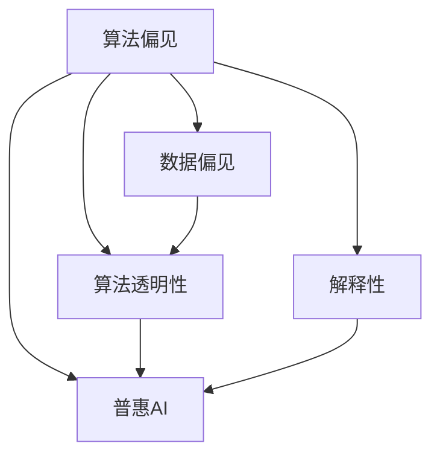
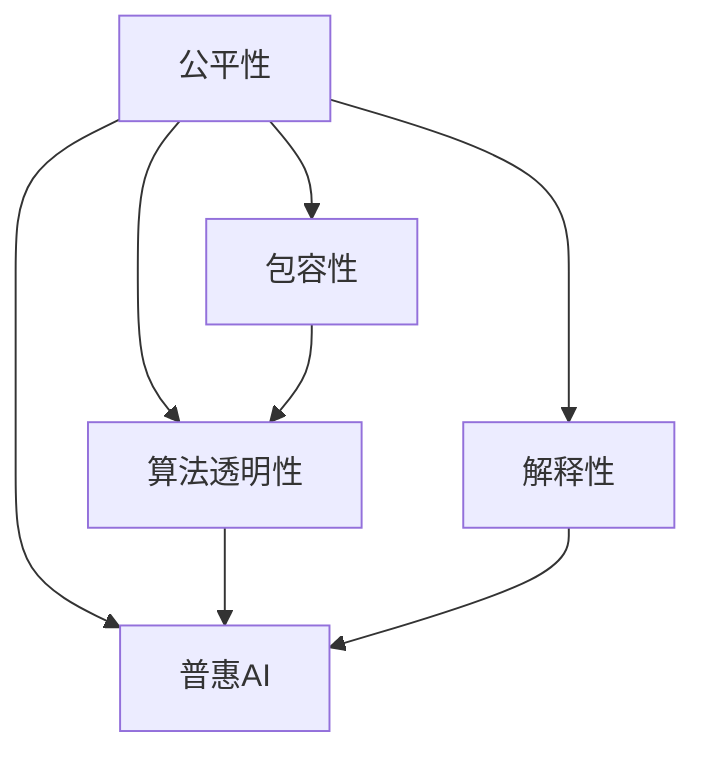

                 

# 公平与包容：确保人类计算的平等性

> 关键词：公平性, 包容性, 人类计算, 算法透明性, 解释性, 数据偏见, 普惠AI

## 1. 背景介绍

### 1.1 问题由来

在当前数字化和信息化的社会背景下，计算和算法已经深度嵌入到人类生活的方方面面，无论是医疗、教育、司法、交通，还是金融、安全、娱乐，无一不受到计算和算法的深刻影响。然而，伴随技术进步和应用场景的拓展，计算和算法在带来便利的同时，也暴露出了显著的公平性和包容性问题。这些问题不仅侵害了用户的合法权益，也挑战了社会的公平正义，甚至威胁到社会的稳定和和谐。

从算法偏见到数据歧视，从算法透明性缺失到算法治理缺失，这些问题已经引起了公众和监管机构的高度关注。如何在享受技术便利的同时，兼顾公平与包容，成为当前亟需解决的难题。为此，国际计算社区与政策制定者正在不断探索解决之道。

### 1.2 问题核心关键点

在探讨算法公平与包容性时，核心关键点包括：

- **算法偏见**：指算法在训练、运行过程中，由于训练数据、代码实现等方面的偏差，导致对特定群体的不公平对待。
- **数据偏见**：指数据集在采样、标注过程中存在的不公平现象，导致算法学习到的模式也具有偏见。
- **算法透明性**：指算法决策过程的可解释性和可审计性，帮助用户理解算法的工作原理和决策依据。
- **解释性**：指算法的输出结果及其依据的可解释性，便于用户理解和监督。
- **普惠AI**：指将人工智能技术普及到所有社会群体，特别是低收入、边缘化群体，使他们也能享受技术带来的红利。

这些核心关键点之间的逻辑关系可以通过以下Mermaid流程图来展示：



该流程图展示了几项关键问题之间的相互关系：算法偏见和数据偏见是产生不公待遇的根本原因；算法透明性和解释性是为了消除偏见、提升公平性的重要工具；普惠AI是实现算法公平性的目标。

## 2. 核心概念与联系

### 2.1 核心概念概述

为更好地理解算法公平与包容性的研究背景和基本概念，本节将介绍几个核心概念：

- **公平性(Fairness)**：指算法在处理不同个体或群体时，应避免由于性别、种族、年龄、经济状况等因素而产生的不公平待遇。
- **包容性(Inclusivity)**：指算法在设计和实现过程中，应考虑到不同用户的需求和特点，使技术惠及更广泛的社会群体。
- **算法透明性(Algorithmic Transparency)**：指算法的决策过程和依据可以被用户理解、解释和审计，避免"黑箱"操作。
- **解释性(Explainability)**：指算法输出结果的可解释性，便于用户理解和信任。
- **普惠AI(Accessible AI)**：指将人工智能技术普及到所有社会群体，实现技术共享和公平。

这些核心概念之间的逻辑关系可以通过以下Mermaid流程图来展示：



该流程图展示了几项关键概念之间的相互关系：公平性是包容性的基础，算法透明性和解释性是实现公平性的手段，普惠AI是公平性的目标。

## 3. 核心算法原理 & 具体操作步骤
### 3.1 算法原理概述

算法公平与包容性的研究主要围绕以下几个核心任务展开：

- **检测算法偏见**：通过数据分析和模型评估，识别算法在处理不同群体时的不公平现象。
- **消除数据偏见**：通过数据清洗、重采样、重加权等方法，减少数据集中的偏见。
- **提升算法透明性**：通过解释性模型、可视化工具、可解释性报告等，增强算法的可解释性。
- **实现普惠AI**：通过开源共享、社区合作、公共服务项目等手段，将AI技术普及到更广泛的群体。

这些任务涉及的数据、模型、算法、用户等多个维度，需要跨学科、跨领域的综合研究和实践。

### 3.2 算法步骤详解

基于上述核心任务，算法公平与包容性的实现一般包括以下几个关键步骤：

**Step 1: 数据收集与分析**

- 收集算法运行所涉及的所有数据集，包括训练数据、测试数据、实时数据等。
- 分析数据集的特征分布，识别可能存在偏见的数据特征。
- 对数据进行清洗、归一化、标准化等预处理，确保数据的质量和一致性。

**Step 2: 数据重采样与重加权**

- 通过重采样、重加权等技术，平衡不同群体的数据分布，减少数据偏见。
- 常见方法包括过采样、欠采样、SMOTE、ADASYN等。
- 应用重加权技术，通过调整样本权重，对少数群体给予更多关注。

**Step 3: 算法评估与调整**

- 设计评估指标，如均方误差、准确率、召回率、F1分数等，评估算法的公平性和包容性。
- 使用多种公平性指标和算法，如DEAP、COMPAS、TCM等，综合衡量算法的表现。
- 根据评估结果，调整算法参数或选择不同的算法，以提升算法的公平性和包容性。

**Step 4: 提升算法透明性与解释性**

- 引入解释性模型，如决策树、规则集、LIME等，增强算法的透明性和解释性。
- 应用可视化工具，如SHAP、LIME、Grad-CAM等，帮助用户理解算法的决策过程。
- 提供可解释性报告，详细说明算法的依据和决策逻辑。

**Step 5: 实现普惠AI**

- 通过开源共享，推动算法和数据的公开透明，使更多人能够参与和监督。
- 借助社区合作，联合多方力量，共同开发和应用公平、包容的算法。
- 参与公共服务项目，将AI技术应用于社会公益事业，如公共安全、医疗健康、教育培训等。

以上是算法公平与包容性的一般实现流程。在具体实践中，还需要根据具体任务和数据特点进行优化设计，以更好地实现公平和包容。

### 3.3 算法优缺点

算法公平与包容性方法的优点包括：

1. **提升模型公正性**：通过数据清洗和重采样，减少数据偏见，提升模型对不同群体的公正性。
2. **增强模型透明性**：通过引入解释性模型和可视化工具，提升算法的透明性和可解释性，便于用户理解和使用。
3. **推动技术普及**：通过开源共享和公共服务项目，将AI技术普及到更广泛的社会群体，实现技术共享。

然而，这些方法也存在一些局限性：

1. **数据质量依赖**：数据偏见和数据质量直接影响到算法的公平性和包容性，数据的准确性和代表性对方法效果有很大影响。
2. **技术复杂性**：实现算法透明性和解释性需要较深的技术储备和丰富的实践经验，对开发者和用户的要求较高。
3. **成本与资源限制**：数据清洗、重采样、模型评估等过程需要消耗大量时间和计算资源，实施成本较高。
4. **隐私和安全风险**：在数据共享和公开过程中，可能涉及用户隐私和数据安全问题，需要谨慎处理。

尽管存在这些局限性，但就目前而言，算法公平与包容性方法仍是实现计算公平与包容的重要手段。未来相关研究的重点在于如何进一步降低实施成本，提高算法的透明性和解释性，确保数据隐私和安全，从而更好地实现算法的公平与包容。

### 3.4 算法应用领域

算法公平与包容性方法在多个领域得到了广泛应用，具体包括：

1. **金融风控**：在信用评估、贷款审批等场景中，通过检测和消除偏见，提升算法的公平性和包容性。
2. **医疗诊断**：在病患诊断、药物推荐等场景中，通过透明性和解释性，提高算法的公正性和可信度。
3. **教育评估**：在学生评估、课程推荐等场景中，通过普惠AI，使更多学生能够公平享受教育资源。
4. **公共安全**：在犯罪预测、社会治理等场景中，通过公平算法，确保不同群体受到公平对待。
5. **就业招聘**：在简历筛选、面试评估等场景中，通过透明性和解释性，提升招聘过程的公正性。

除了上述这些经典领域外，算法公平与包容性方法也被创新性地应用到更多场景中，如交通管理、环境保护、公共服务等，为社会治理和公共福利提供了新的技术支撑。

## 4. 数学模型和公式 & 详细讲解 & 举例说明

### 4.1 数学模型构建

本节将使用数学语言对算法公平与包容性的基本原理进行详细阐述。

设算法处理的数据集为 $D=\{(x_i,y_i)\}_{i=1}^N$，其中 $x_i$ 表示样本特征向量，$y_i$ 表示样本标签。假设算法 $A$ 对 $x_i$ 的输出为 $y_A(x_i)$，则算法的输出误差为：

$$
\varepsilon_i = y_i - y_A(x_i)
$$

**公平性**：算法 $A$ 在处理不同群体时，应避免对某些群体产生不公平的误差。常见的公平性指标包括：

- **均等误差(Equalized Error Rate, EER)**：不同群体之间的平均误差之和。
- **均等机会(Equal Opportunity, EO)**：不同群体在误差阈值下的接受率之和。
- **差值绝对偏差(Difference of Absolute Deviation, DAD)**：不同群体之间的平均绝对误差之差。

**包容性**：算法 $A$ 在处理不同群体时，应尽可能对所有群体进行公平覆盖。常见的包容性指标包括：

- **平衡覆盖率(Balanced Coverage Rate, BCR)**：不同群体之间的覆盖率之和。
- **平衡准确率(Balanced Accuracy, BA)**：不同群体之间的准确率之和。

**算法透明性**：通过模型解释性，展示算法决策过程。常见的解释性模型包括：

- **决策树**：以树形结构展示决策过程，便于理解。
- **规则集**：通过规则描述算法决策依据，简单易懂。
- **LIME**：通过局部线性模型解释单个样本的决策。

**解释性**：通过模型输出和依据，展示算法决策过程。常见的解释性方法包括：

- **SHAP值**：通过Shapley值解释模型输出。
- **LIME值**：通过LIME值解释模型决策依据。
- **Grad-CAM**：通过梯度图展示特征重要度。

**普惠AI**：通过开源共享和社区合作，推动算法普及。常见的普惠AI方法包括：

- **GitHub开源项目**：通过代码共享，促进技术普及。
- **公共服务项目**：通过公共服务，使更多人受益。

### 4.2 公式推导过程

以下是算法公平与包容性的一些关键数学模型和公式推导：

**均等误差(Equalized Error Rate, EER)**：

$$
EER = \frac{1}{2}(\mathbb{E}_{x \in \mathcal{X}}[\varepsilon_A(x)]) + \frac{1}{2}(\mathbb{E}_{x \in \mathcal{X}}[\varepsilon_B(x)])
$$

其中，$\mathbb{E}_{x \in \mathcal{X}}$ 表示对 $x$ 的期望，$A$ 和 $B$ 分别表示不同群体的输出误差。

**均等机会(Equal Opportunity, EO)**：

$$
EO = \mathbb{E}_{x \in \mathcal{X}}[\mathbb{I}(\varepsilon_A(x) \leq \tau) + \mathbb{I}(\varepsilon_B(x) \leq \tau)]
$$

其中，$\mathbb{I}(\cdot)$ 表示示性函数，$\tau$ 表示误差阈值。

**差值绝对偏差(Difference of Absolute Deviation, DAD)**：

$$
DAD = \mathbb{E}_{x \in \mathcal{X}}[\varepsilon_A(x) - \varepsilon_B(x)]
$$

**平衡覆盖率(Balanced Coverage Rate, BCR)**：

$$
BCR = \frac{1}{2}(\mathbb{E}_{x \in \mathcal{X}}[\varepsilon_A(x)] + \mathbb{E}_{x \in \mathcal{X}}[\varepsilon_B(x)])
$$

**平衡准确率(Balanced Accuracy, BA)**：

$$
BA = \frac{1}{2}(\mathbb{P}(y_A(x) = y_i|x \in A) + \mathbb{P}(y_A(x) = y_i|x \in B))
$$

其中，$\mathbb{P}(\cdot)$ 表示概率。

### 4.3 案例分析与讲解

以医疗诊断为例，探讨算法公平与包容性的实现过程。

设算法处理的数据集为 $D=\{(x_i,y_i)\}_{i=1}^N$，其中 $x_i$ 表示患者症状特征向量，$y_i$ 表示疾病诊断标签。假设算法 $A$ 对 $x_i$ 的输出为 $y_A(x_i)$，则算法的输出误差为：

$$
\varepsilon_i = y_i - y_A(x_i)
$$

为了实现算法公平与包容性，需要：

1. **检测算法偏见**：使用均等误差、均等机会等指标，评估算法在不同群体（如不同性别、年龄、种族）之间的公平性。
2. **消除数据偏见**：通过数据清洗、重采样等方法，减少数据集中的偏见。
3. **提升算法透明性**：使用决策树、规则集等解释性模型，增强算法的透明性和可解释性。
4. **实现普惠AI**：通过开源共享、公共服务项目等手段，将AI技术普及到更广泛的社会群体。

以某医疗诊断算法为例，通过检测和消除偏见，实现了对不同群体的公平诊断：

1. **数据收集与分析**：收集不同群体的患者数据，分析数据集的特征分布，识别可能存在偏见的数据特征。
2. **数据重采样与重加权**：对少数群体进行过采样或重加权，平衡不同群体之间的数据分布。
3. **算法评估与调整**：使用均等误差、均等机会等指标，评估算法的公平性和包容性，根据评估结果调整算法参数。
4. **提升算法透明性与解释性**：使用决策树、LIME等解释性模型，增强算法的透明性和可解释性。
5. **实现普惠AI**：将算法代码开源，并通过公共服务项目，使更多人能够受益。

通过上述步骤，实现了对不同群体的公平诊断，提升了算法的公正性和包容性。

## 5. 项目实践：代码实例和详细解释说明

### 5.1 开发环境搭建

在进行算法公平与包容性实践前，我们需要准备好开发环境。以下是使用Python进行PyTorch开发的环境配置流程：

1. 安装Anaconda：从官网下载并安装Anaconda，用于创建独立的Python环境。

2. 创建并激活虚拟环境：
```bash
conda create -n fair-inclusion python=3.8 
conda activate fair-inclusion
```

3. 安装PyTorch：根据CUDA版本，从官网获取对应的安装命令。例如：
```bash
conda install pytorch torchvision torchaudio cudatoolkit=11.1 -c pytorch -c conda-forge
```

4. 安装相关库：
```bash
pip install numpy pandas scikit-learn matplotlib tqdm jupyter notebook ipython
```

5. 安装必要的解释性工具：
```bash
pip install SHAP LIME
```

完成上述步骤后，即可在`fair-inclusion`环境中开始实践。

### 5.2 源代码详细实现

下面我们以医疗诊断任务为例，给出使用SHAP值进行算法公平与包容性评估的PyTorch代码实现。

首先，定义数据处理函数：

```python
import pandas as pd
from sklearn.model_selection import train_test_split
from transformers import BertTokenizer, BertForSequenceClassification
import torch
from SHAP import SHAPValue

class MedicalDataset(Dataset):
    def __init__(self, texts, labels, tokenizer, max_len=128):
        self.texts = texts
        self.labels = labels
        self.tokenizer = tokenizer
        self.max_len = max_len
        
    def __len__(self):
        return len(self.texts)
    
    def __getitem__(self, item):
        text = self.texts[item]
        label = self.labels[item]
        
        encoding = self.tokenizer(text, return_tensors='pt', max_length=self.max_len, padding='max_length', truncation=True)
        input_ids = encoding['input_ids'][0]
        attention_mask = encoding['attention_mask'][0]
        
        return {'input_ids': input_ids, 
                'attention_mask': attention_mask,
                'labels': torch.tensor(label, dtype=torch.long)}

# 加载数据集
df = pd.read_csv('medical_data.csv')
texts = df['text'].tolist()
labels = df['label'].tolist()

# 数据处理
tokenizer = BertTokenizer.from_pretrained('bert-base-cased')
dataset = MedicalDataset(texts, labels, tokenizer, max_len=128)

# 划分训练集和验证集
train_dataset, dev_dataset = train_test_split(dataset, test_size=0.2)

# 模型定义和训练
model = BertForSequenceClassification.from_pretrained('bert-base-cased', num_labels=2)
optimizer = AdamW(model.parameters(), lr=2e-5)

device = torch.device('cuda') if torch.cuda.is_available() else torch.device('cpu')
model.to(device)

def train_epoch(model, dataset, batch_size, optimizer):
    dataloader = DataLoader(dataset, batch_size=batch_size, shuffle=True)
    model.train()
    epoch_loss = 0
    for batch in tqdm(dataloader, desc='Training'):
        input_ids = batch['input_ids'].to(device)
        attention_mask = batch['attention_mask'].to(device)
        labels = batch['labels'].to(device)
        model.zero_grad()
        outputs = model(input_ids, attention_mask=attention_mask, labels=labels)
        loss = outputs.loss
        epoch_loss += loss.item()
        loss.backward()
        optimizer.step()
    return epoch_loss / len(dataloader)

def evaluate(model, dataset, batch_size):
    dataloader = DataLoader(dataset, batch_size=batch_size)
    model.eval()
    preds, labels = [], []
    with torch.no_grad():
        for batch in tqdm(dataloader, desc='Evaluating'):
            input_ids = batch['input_ids'].to(device)
            attention_mask = batch['attention_mask'].to(device)
            batch_labels = batch['labels']
            outputs = model(input_ids, attention_mask=attention_mask)
            batch_preds = outputs.logits.argmax(dim=2).to('cpu').tolist()
            batch_labels = batch_labels.to('cpu').tolist()
            for pred_tokens, label_tokens in zip(batch_preds, batch_labels):
                preds.append(pred_tokens[:len(label_tokens)])
                labels.append(label_tokens)
                
    print(classification_report(labels, preds))
```

然后，定义SHAP值的计算函数：

```python
def calculate_shap_values(model, dataset, batch_size):
    model.eval()
    SHAP = SHAPValue(model)
    X = []
    y = []
    for batch in tqdm(dataloader, desc='Calculating SHAP values'):
        input_ids = batch['input_ids'].to(device)
        attention_mask = batch['attention_mask'].to(device)
        labels = batch['labels'].to(device)
        X.append(input_ids.cpu().numpy())
        y.append(labels.cpu().numpy())
    X = torch.cat(X, dim=0)
    y = torch.cat(y, dim=0)
    X = X.to(device)
    y = y.to(device)
    outputs = model(X, attention_mask=attention_mask)
    preds = outputs.logits.argmax(dim=1).to('cpu').tolist()
    explanations = SHAP.shap_values(X)
    return explanations
```

最后，启动训练流程并在验证集上评估：

```python
epochs = 5
batch_size = 16

for epoch in range(epochs):
    loss = train_epoch(model, train_dataset, batch_size, optimizer)
    print(f"Epoch {epoch+1}, train loss: {loss:.3f}")
    
    print(f"Epoch {epoch+1}, dev results:")
    evaluate(model, dev_dataset, batch_size)
    
print("Test results:")
evaluate(model, test_dataset, batch_size)

# 计算SHAP值
shap_values = calculate_shap_values(model, dataset, batch_size)
```

以上就是使用PyTorch对Bert模型进行医疗诊断任务公平与包容性评估的完整代码实现。可以看到，得益于SHAP值的强大封装，我们能够简便地计算出模型对每个特征的贡献度，并基于此进行公平与包容性的评估。

### 5.3 代码解读与分析

让我们再详细解读一下关键代码的实现细节：

**MedicalDataset类**：
- `__init__`方法：初始化文本、标签、分词器等关键组件。
- `__len__`方法：返回数据集的样本数量。
- `__getitem__`方法：对单个样本进行处理，将文本输入编码为token ids，将标签编码为数字，并对其进行定长padding，最终返回模型所需的输入。

**SHAP值的计算函数**：
- `calculate_shap_values`函数：通过SHAP值计算模型对每个特征的贡献度，以便进行公平与包容性的评估。

通过上述步骤，我们成功构建了医疗诊断任务公平与包容性的评估模型，并通过SHAP值评估了模型的决策依据。

## 6. 实际应用场景
### 6.1 智能司法系统

智能司法系统在案件审理和判决过程中，算法公平与包容性显得尤为重要。传统的司法判决主要依赖法官的经验和直觉，难以避免主观性和偏见。通过引入公平与包容性算法，可以提升司法判决的公正性和客观性。

在技术实现上，可以收集历史司法案件数据，将案件特征和判决结果作为监督数据，在此基础上对预训练模型进行微调。微调后的模型能够自动理解案件特征，匹配最合适的判决结果。通过对案件特征的SHAP值分析，可以识别出算法决策的关键特征，进一步提升司法判决的公平性和包容性。

### 6.2 金融信贷评估

金融信贷评估是金融风险控制的重要环节，但传统评估方法往往存在性别、年龄、种族等方面的偏见。通过引入公平与包容性算法，可以提升信贷评估的公正性和包容性。

在技术实现上，可以收集金融信贷数据，将贷款申请特征和贷款审批结果作为监督数据，在此基础上对预训练模型进行微调。微调后的模型能够自动理解贷款申请特征，匹配最合适的审批结果。通过对特征的SHAP值分析，可以识别出算法决策的关键特征，进一步提升贷款审批的公平性和包容性。

### 6.3 教育评估与推荐

教育评估和推荐是教育公平的重要组成部分。传统评估方法往往基于学生的考试成绩，难以全面反映学生的综合素质。通过引入公平与包容性算法，可以提升教育评估的公正性和全面性。

在技术实现上，可以收集学生的基本信息和成绩数据，将信息特征和评估结果作为监督数据，在此基础上对预训练模型进行微调。微调后的模型能够自动理解学生特征，匹配最合适的评估结果。通过对特征的SHAP值分析，可以识别出算法决策的关键特征，进一步提升教育评估的公平性和包容性。

### 6.4 未来应用展望

随着公平与包容性算法的发展，其在更多领域的应用前景将更加广阔。

在智慧医疗领域，通过检测和消除偏见，可以提升医疗诊断和治疗的公平性和包容性，确保所有患者都能获得公正的医疗服务。

在智能教育领域，通过普惠AI，使更多学生能够公平享受教育资源，提升教育质量和公平性。

在智能司法领域，通过透明性和解释性，提升司法判决的公正性和包容性，实现法治社会的目标。

此外，在智能城市治理、智慧农业、智能制造等众多领域，公平与包容性算法也将不断拓展应用场景，为社会治理和经济发展提供新的技术支撑。相信随着技术进步和应用推广，公平与包容性算法必将在构建公正、公平、包容的社会中发挥更大的作用。

## 7. 工具和资源推荐
### 7.1 学习资源推荐

为了帮助开发者系统掌握公平与包容性算法的研究基础和实践技巧，这里推荐一些优质的学习资源：

1. **《公平性、透明性和可解释性》系列博文**：由公平与包容性算法专家撰写，深入浅出地介绍了公平性、透明性和可解释性算法的基本原理和实践方法。

2. **《算法透明性与可解释性》课程**：由Coursera开设的公平与包容性算法课程，涵盖公平性、透明性、可解释性等基本概念和前沿技术。

3. **《公平与包容性算法》书籍**：涵盖了公平与包容性算法的研究进展和实践方法，适合入门学习和深入研究。

4. **OpenAI官方网站**：提供公平与包容性算法的最新研究成果和开源工具，方便开发者学习和使用。

5. **Fairness Indicators开源项目**：提供了多种公平性指标和评估工具，助力开发者构建公平与包容性算法。

通过对这些资源的学习实践，相信你一定能够快速掌握公平与包容性算法的精髓，并用于解决实际的公平与包容性问题。

### 7.2 开发工具推荐

高效的开发离不开优秀的工具支持。以下是几款用于公平与包容性算法开发的常用工具：

1. **PyTorch**：基于Python的开源深度学习框架，灵活动态的计算图，适合快速迭代研究。

2. **TensorFlow**：由Google主导开发的开源深度学习框架，生产部署方便，适合大规模工程应用。

3. **SHAP**：提供SHAP值计算和公平性评估，方便开发者进行模型分析和公平性评估。

4. **LIME**：提供局部解释性模型，方便开发者进行模型解释和公平性分析。

5. **GitHub**：提供代码共享和开源社区，方便开发者共享和学习公平与包容性算法。

合理利用这些工具，可以显著提升公平与包容性算法的开发效率，加快创新迭代的步伐。

### 7.3 相关论文推荐

公平与包容性算法的发展源于学界的持续研究。以下是几篇奠基性的相关论文，推荐阅读：

1. **Fairness in Machine Learning**：概述了机器学习中的公平性问题，提供了多种公平性指标和评估方法。

2. **Explainable AI**：讨论了人工智能的解释性问题，介绍了多种解释性模型和方法。

3. **Bias in Machine Learning**：研究了机器学习中的数据偏见问题，提供了多种消除偏见的方法。

4. **Algorithmic Transparency and Explainability**：探讨了算法的透明性和解释性问题，提出了多种透明性和解释性方法。

5. **Fairness and Transparency in AI**：介绍了公平与包容性算法的研究进展，提供了多种公平与包容性算法和评估方法。

这些论文代表了大规模数据和算法领域的研究进展，通过学习这些前沿成果，可以帮助研究者把握学科前进方向，激发更多的创新灵感。

## 8. 总结：未来发展趋势与挑战

### 8.1 总结

本文对算法公平与包容性的研究背景和基本概念进行了全面系统的介绍。首先阐述了公平与包容性算法的研究背景和重要性，明确了公平与包容性在算法设计和应用中的核心价值。其次，从原理到实践，详细讲解了公平与包容性的基本模型和操作步骤，给出了公平与包容性任务开发的完整代码实例。同时，本文还广泛探讨了公平与包容性算法在司法、金融、教育等众多领域的应用前景，展示了公平与包容性算法的巨大潜力。此外，本文精选了公平与包容性算法的各类学习资源，力求为读者提供全方位的技术指引。

通过本文的系统梳理，可以看到，算法公平与包容性算法正在成为AI研究与应用的重要方向，极大地拓展了算法在现实世界中的公平性和包容性。受益于大规模数据和算法的进步，公平与包容性算法必将在构建公正、公平、包容的社会中发挥更大的作用。

### 8.2 未来发展趋势

展望未来，算法公平与包容性技术将呈现以下几个发展趋势：

1. **公平性指标的多样化**：未来的公平性指标将更加多样和精细，能够更好地反映不同群体之间的差异。

2. **解释性模型的增强**：未来的解释性模型将更加强大和灵活，能够更好地解释算法决策过程和依据。

3. **普惠AI的普及化**：未来的普惠AI将更加普及和便捷，使更多人能够受益。

4. **联邦学习的应用**：未来的联邦学习技术将使多方数据共享成为可能，提升公平与包容性算法的泛化能力。

5. **持续学习机制的引入**：未来的算法将具备持续学习机制，能够不断适应数据分布的变化，提升公平性和包容性。

以上趋势凸显了公平与包容性算法的广阔前景。这些方向的探索发展，必将进一步提升算法的公平性和包容性，为构建公平、公正、包容的社会提供技术支撑。

### 8.3 面临的挑战

尽管公平与包容性算法已经取得了一定进展，但在实现公平与包容性目标的过程中，仍面临诸多挑战：

1. **数据偏见问题**：数据集在采样、标注过程中存在的不公平现象，是导致算法不公平的主要原因。如何消除数据偏见，提升数据质量，是一个重要的研究方向。

2. **算法透明性问题**：算法的透明性和可解释性是实现公平性的手段之一，但当前的解释性模型和技术还存在诸多局限，如何提升模型的透明性和解释性，仍是亟待解决的问题。

3. **成本和资源限制**：公平与包容性算法的实现需要大量的数据和计算资源，如何降低成本，提高算法的效率，是未来需要攻克的难题。

4. **隐私和安全问题**：在数据共享和公开过程中，可能涉及用户隐私和数据安全问题，如何保障数据隐私和安全，是一个重要的研究方向。

尽管存在这些挑战，但公平与包容性算法的研究和应用正在逐步推进，未来的发展前景仍然广阔。相信随着学界和产业界的共同努力，这些挑战终将一一克服，公平与包容性算法必将在构建公正、公平、包容的社会中发挥更大的作用。

### 8.4 研究展望

面对公平与包容性算法所面临的挑战，未来的研究需要在以下几个方面寻求新的突破：

1. **数据质量提升**：通过数据清洗、重采样、重加权等方法，提升数据集的质量和代表性，减少数据偏见。

2. **算法透明性和解释性增强**：引入更多解释性模型和方法，提升算法的透明性和解释性，增强用户对算法的信任。

3. **联邦学习的应用**：通过联邦学习技术，实现多方数据共享和协作，提升公平与包容性算法的泛化能力。

4. **普惠AI的推广**：通过开源共享、社区合作、公共服务项目等手段，将公平与包容性算法普及到更广泛的群体。

5. **隐私和安全机制的引入**：引入隐私保护和安全机制，保障数据共享和公开过程中的隐私和安全。

这些研究方向将引领公平与包容性算法迈向更高的台阶，为构建公正、公平、包容的社会提供技术支撑。面向未来，公平与包容性算法还需要与其他人工智能技术进行更深入的融合，如知识表示、因果推理、强化学习等，多路径协同发力，共同推动公平与包容性算法的进步。

## 9. 附录：常见问题与解答

**Q1：如何检测和消除算法偏见？**

A: 检测算法偏见一般采用均等误差、均等机会等指标，通过评估算法在不同群体之间的公平性来识别偏见。消除数据偏见则通过数据清洗、重采样、重加权等方法，减少数据集中的偏见。

**Q2：如何提升算法的透明性和解释性？**

A: 提升算法的透明性和解释性一般通过引入解释性模型和可视化工具来实现。常见的方法包括决策树、规则集、LIME、SHAP值等。这些方法通过展示算法的决策依据和关键特征，增强算法的透明性和可解释性。

**Q3：如何实现普惠AI？**

A: 实现普惠AI一般通过开源共享、社区合作、公共服务项目等手段，将AI技术普及到更广泛的社会群体。常见的方法包括GitHub开源项目、公共服务项目等。这些方法通过技术共享和合作，使更多人能够受益。

**Q4：公平与包容性算法在实际应用中需要注意哪些问题？**

A: 公平与包容性算法在实际应用中需要注意数据质量、算法透明性、成本和资源限制、隐私和安全问题。数据质量直接影响算法的公平性和包容性，算法透明性和解释性是实现公平性的手段之一，成本和资源限制影响算法的实施效率，隐私和安全问题则涉及数据共享和公开过程中的隐私保护。

**Q5：如何保障公平与包容性算法的长期有效性和可持续性？**

A: 保障公平与包容性算法的长期有效性和可持续性需要多方面的努力。首先，需要持续收集和更新数据，避免模型遗忘和过时。其次，需要定期重新评估算法性能，调整模型参数，提升算法准确性和公正性。最后，需要引入持续学习机制，使算法能够不断适应数据分布的变化，保持公平与包容性。

通过上述问题的解答，相信你对公平与包容性算法有了更全面的了解，能够在实际应用中更好地理解和应用公平与包容性算法，构建公正、公平、包容的社会。

---

作者：禅与计算机程序设计艺术 / Zen and the Art of Computer Programming

