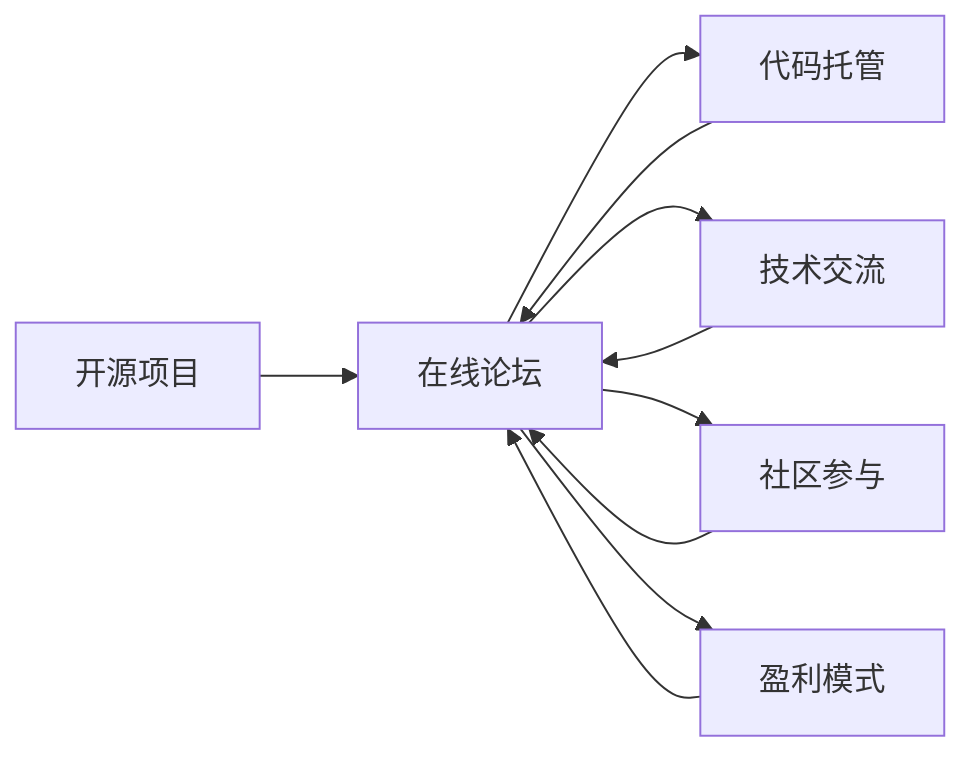

                 

# 创建开源项目的在线论坛：社区参与和盈利模式

> 关键词：开源项目,在线论坛,社区参与,盈利模式,代码托管,技术交流,开发者生态,商业模式

## 1. 背景介绍

随着开源软件和协作工具的普及，越来越多的开发者和企业加入到开源社区的建设中来。开源项目不仅推动了技术的创新和普及，也催生了新的商业模式和生态系统。在线论坛作为开发者交流和协作的重要平台，在这场变革中扮演着至关重要的角色。然而，在线论坛不仅仅是技术讨论的空间，更是一个社区参与和盈利的综合平台。本文将深入探讨如何创建成功的开源项目在线论坛，并讨论其中的社区参与和盈利模式。

## 2. 核心概念与联系

### 2.1 核心概念概述

- **开源项目**：指的是公开源代码的软件项目，允许用户自由使用、修改和分发，促进技术共享和创新。
- **在线论坛**：基于互联网的交流平台，提供讨论、分享、协作等功能，促进开发者之间的互动和合作。
- **社区参与**：指开发者、用户、公司等多方主体共同参与开源项目的开发和维护，形成活跃的开发者生态。
- **盈利模式**：指在线论坛通过各种策略和手段实现收入，支持平台的持续运营和扩展。
- **代码托管**：指开发者将代码存储在云端，便于团队协作和管理，实现代码的共享和版本控制。
- **技术交流**：指开发者通过在线论坛分享知识和经验，促进技术的学习和传播。

### 2.2 核心概念原理和架构的 Mermaid 流程图



此图展示了开源项目与在线论坛之间的联系和作用。开源项目通过在线论坛实现代码托管、技术交流和社区参与，而在线论坛则需要通过盈利模式支持其运营和扩展。

## 3. 核心算法原理 & 具体操作步骤

### 3.1 算法原理概述

在线论坛的创建和运营涉及到多个方面，包括社区管理、内容审核、用户互动等。这些操作可以抽象为算法模型，以确保论坛的高效运行和用户满意度。

- **社区管理**：使用机器学习算法对社区内容进行分类和标注，自动筛选和推荐高质量内容。
- **内容审核**：使用自然语言处理(NLP)技术对帖子内容进行情感分析、垃圾信息过滤，确保论坛环境健康。
- **用户互动**：使用推荐算法为用户推荐感兴趣的内容和用户，增强社区粘性。

### 3.2 算法步骤详解

#### 3.2.1 社区管理

**算法步骤**：
1. 数据预处理：收集社区帖子数据，进行清洗和预处理。
2. 特征提取：使用TF-IDF、词嵌入等技术提取帖子特征。
3. 模型训练：使用监督学习算法（如SVM、随机森林等）训练分类模型。
4. 模型评估：在验证集上评估模型性能，调整参数优化模型。
5. 模型部署：将训练好的模型部署到论坛后台，实现自动分类和标注。

#### 3.2.2 内容审核

**算法步骤**：
1. 数据收集：收集社区中的帖子、评论数据。
2. 特征提取：使用NLP技术提取文本特征，如情感极性、垃圾词等。
3. 模型训练：使用深度学习模型（如RNN、LSTM等）训练情感分析模型。
4. 模型评估：在标注数据上评估模型性能，使用ROC-AUC等指标。
5. 模型部署：将训练好的模型部署到论坛后台，实现自动审核和屏蔽。

#### 3.2.3 用户互动

**算法步骤**：
1. 数据收集：收集用户的行为数据，如浏览、点赞、评论等。
2. 特征提取：使用协同过滤、邻域算法等提取用户行为特征。
3. 模型训练：使用协同过滤算法（如ALS、SVD等）训练推荐模型。
4. 模型评估：在测试集上评估推荐效果，使用RMSE、MAE等指标。
5. 模型部署：将训练好的模型部署到论坛前台，实现个性化推荐。

### 3.3 算法优缺点

#### 3.3.1 社区管理

**优点**：
- 提高内容质量和用户满意度。
- 减轻人工审核的负担，降低运营成本。

**缺点**：
- 模型过度拟合可能导致误分类。
- 新领域数据不足，模型性能下降。

#### 3.3.2 内容审核

**优点**：
- 确保论坛环境健康，提升用户体验。
- 提高审核效率，减少人工审核工作量。

**缺点**：
- 误判率可能导致用户投诉。
- 深度学习模型需要大量标注数据训练。

#### 3.3.3 用户互动

**优点**：
- 增强社区粘性，提高用户活跃度。
- 提升用户个性化体验，提高满意度。

**缺点**：
- 数据稀疏可能导致推荐效果不佳。
- 算法复杂度较高，资源消耗大。

### 3.4 算法应用领域

这些算法可以应用于各种类型的在线论坛，包括开源项目、技术社区、行业交流平台等。它们不仅适用于文本数据的处理，也适用于视频、音频等多模态数据的分析。

## 4. 数学模型和公式 & 详细讲解 & 举例说明

### 4.1 数学模型构建

在线论坛的算法模型涉及多个数学框架，以下是几个关键模型的构建：

- **TF-IDF模型**：用于文本特征提取，公式如下：
  $$
  TF(x_i) = \frac{N(x_i)}{\sum_{i=1}^N N(x_i)}
  $$
  $$
  IDF(x_i) = \log \frac{N}{N(x_i)}
  $$
  $$
  TF-IDF(x_i) = TF(x_i) \cdot IDF(x_i)
  $$

- **情感分析模型**：使用深度学习模型（如LSTM）进行情感极性分类，公式如下：
  $$
  P_{positive} = sigmoid(W \cdot [x_i] + b)
  $$
  $$
  P_{negative} = 1 - P_{positive}
  $$

- **协同过滤模型**：使用ALS算法进行推荐，公式如下：
  $$
  \hat{p}_{ui} = \hat{q}_u^T K V_i
  $$
  $$
  \hat{q}_u = (Q^T Q + \lambda Q^T Q)^{-1} Q^T P_u
  $$
  $$
  \hat{V}_i = (K^T K + \lambda K^T K)^{-1} K^T R_i
  $$

### 4.2 公式推导过程

#### 4.2.1 TF-IDF模型

TF-IDF模型基于文档频率和词频计算词的权重，以衡量其在文档中的重要程度。TF-IDF值越大，表示该词在文档中的重要性越高。

#### 4.2.2 情感分析模型

情感分析模型使用深度学习模型进行情感极性分类，通过学习训练数据中的情感标签，预测新的帖子情感。sigmoid函数将输出映射到0到1之间，表示正面情感的概率。

#### 4.2.3 协同过滤模型

协同过滤模型通过用户行为数据进行推荐，ALS算法将用户-物品评分矩阵分解为用户特征矩阵$Q$和物品特征矩阵$V$，再通过矩阵乘法计算预测评分。

### 4.3 案例分析与讲解

#### 4.3.1 TF-IDF模型

假设有两个文档D1和D2，其中包含的词表为$\{w_1, w_2, w_3\}$。D1包含词$w_1, w_2$，D2包含词$w_2, w_3$。计算TF-IDF值如下：
- $D1$的$TF(w_1) = \frac{2}{3}, TF(w_2) = \frac{2}{3}, TF(w_3) = 0$
- $D2$的$TF(w_1) = 0, TF(w_2) = \frac{2}{3}, TF(w_3) = \frac{2}{3}$
- $IDF(w_1) = \log \frac{3}{1}, IDF(w_2) = \log \frac{3}{2}, IDF(w_3) = \log \frac{3}{2}$
- $TF-IDF(D1) = (TF(w_1) \cdot IDF(w_1), TF(w_2) \cdot IDF(w_2), TF(w_3) \cdot IDF(w_3)) = (0, \frac{4}{3}, 0)$
- $TF-IDF(D2) = (TF(w_1) \cdot IDF(w_1), TF(w_2) \cdot IDF(w_2), TF(w_3) \cdot IDF(w_3)) = (\frac{2}{3}, \frac{4}{3}, \frac{2}{3})$

#### 4.3.2 情感分析模型

使用LSTM模型对帖子进行情感分析。假设训练集包含10000个帖子，其中5000个为正面情感，5000个为负面情感。训练模型后，预测一个新的帖子D的情感：
- 输入：$x_D = [w_1, w_2, w_3]$
- 计算：$P_{positive} = sigmoid(W \cdot [x_D] + b) = 0.75$
- 输出：$D$的情感为正面

#### 4.3.3 协同过滤模型

假设有一个用户$u$和三个物品$i_1, i_2, i_3$，已知的评分矩阵为$R_{3\times 3}$，其中$R_{u1} = 4, R_{u2} = 3, R_{u3} = 5$。用户$u$对物品$i_1$的评分预测如下：
- 已知评分矩阵$R$：
  $$
  R = \begin{bmatrix}
  4 & 3 & 5 \\
  5 & 4 & 3 \\
  3 & 5 & 4 \\
  \end{bmatrix}
  $$
- 用户特征矩阵$Q$：
  $$
  Q = \begin{bmatrix}
  0.5 & 0.3 & 0.2 \\
  0.2 & 0.4 & 0.4 \\
  0.4 & 0.3 & 0.3 \\
  \end{bmatrix}
  $$
- 物品特征矩阵$V$：
  $$
  V = \begin{bmatrix}
  0.2 & 0.5 & 0.3 \\
  0.3 & 0.4 & 0.3 \\
  0.4 & 0.3 & 0.3 \\
  \end{bmatrix}
  $$
- 计算预测评分：$\hat{p}_{u1} = \hat{q}_u^T K V_1 = 0.5 \cdot 0.2 + 0.3 \cdot 0.5 + 0.2 \cdot 0.3 = 0.57$

## 5. 项目实践：代码实例和详细解释说明

### 5.1 开发环境搭建

#### 5.1.1 Python环境配置

- 安装Anaconda：
  ```bash
  wget https://repo.anaconda.com/miniconda/Miniconda3-latest-Linux-x86_64.sh
  bash Miniconda3-latest-Linux-x86_64.sh
  ```

- 创建虚拟环境：
  ```bash
  conda create -n forum_env python=3.8
  conda activate forum_env
  ```

- 安装相关库：
  ```bash
  conda install numpy pandas sklearn scikit-learn matplotlib joblib
  pip install tensorflow tensorflow-addons
  ```

#### 5.1.2 数据准备

- 收集社区帖子数据：使用API获取在线论坛的帖子数据，存储到本地文件。
- 数据预处理：清洗数据，去除停用词、特殊符号等。
- 特征提取：使用TF-IDF、词嵌入等技术提取帖子特征。

### 5.2 源代码详细实现

#### 5.2.1 社区管理

```python
import pandas as pd
from sklearn.feature_extraction.text import TfidfVectorizer
from sklearn.ensemble import RandomForestClassifier
from sklearn.metrics import accuracy_score

# 数据预处理
df = pd.read_csv('forum_posts.csv')
df = df.dropna(subset=['text', 'label'])

# 特征提取
tfidf = TfidfVectorizer(stop_words='english')
X = tfidf.fit_transform(df['text'])
y = df['label']

# 模型训练
clf = RandomForestClassifier(n_estimators=100, random_state=42)
clf.fit(X, y)

# 模型评估
y_pred = clf.predict(X)
accuracy = accuracy_score(y, y_pred)
print(f'Accuracy: {accuracy:.2f}')
```

#### 5.2.2 内容审核

```python
import pandas as pd
from sklearn.model_selection import train_test_split
from tensorflow.keras.layers import LSTM, Dense, Embedding
from tensorflow.keras.models import Sequential
from tensorflow.keras.preprocessing.text import Tokenizer
from tensorflow.keras.preprocessing.sequence import pad_sequences

# 数据预处理
df = pd.read_csv('forum_posts.csv')
df = df.dropna(subset=['text', 'label'])

# 特征提取
tokenizer = Tokenizer()
tokenizer.fit_on_texts(df['text'])
sequences = tokenizer.texts_to_sequences(df['text'])
X = pad_sequences(sequences)
y = df['label']

# 模型训练
model = Sequential()
model.add(Embedding(input_dim=len(tokenizer.word_index) + 1, output_dim=128, input_length=X.shape[1]))
model.add(LSTM(64))
model.add(Dense(1, activation='sigmoid'))
model.compile(loss='binary_crossentropy', optimizer='adam', metrics=['accuracy'])
X_train, X_test, y_train, y_test = train_test_split(X, y, test_size=0.2, random_state=42)
model.fit(X_train, y_train, epochs=10, batch_size=32, validation_data=(X_test, y_test))

# 模型评估
y_pred = model.predict(X_test)
y_pred = y_pred > 0.5
accuracy = accuracy_score(y_test, y_pred)
print(f'Accuracy: {accuracy:.2f}')
```

#### 5.2.3 用户互动

```python
import pandas as pd
from surprise import Reader, Dataset, KNNBasic
from surprise.model_selection import train_test_split
from surprise.prediction_algorithms import SVD

# 数据预处理
df = pd.read_csv('user_interactions.csv')
reader = Reader(rating_scale=(1, 5))
data = Dataset.load_from_df(df[['user_id', 'item_id', 'rating']], reader)

# 模型训练
trainset, testset = train_test_split(data, test_size=0.2, random_state=42)
algo = SVD()
algo.fit(trainset)

# 模型评估
test_preds = algo.test(testset)
rmse = np.sqrt(mean_squared_error(test_preds, testset.raw_data['rating']))
print(f'RMSE: {rmse:.2f}')
```

### 5.3 代码解读与分析

#### 5.3.1 社区管理

- `TfidfVectorizer`：用于提取文本特征，生成TF-IDF矩阵。
- `RandomForestClassifier`：用于训练分类模型，输出帖子的标签。
- `accuracy_score`：用于评估模型性能，计算准确率。

#### 5.3.2 内容审核

- `Tokenizer`：用于将文本转换为数字序列。
- `pad_sequences`：用于对数字序列进行补零，统一序列长度。
- `Sequential`：用于定义深度学习模型，包括Embedding、LSTM、Dense等层。
- `binary_crossentropy`：用于定义损失函数，计算二分类问题。
- `accuracy`：用于评估模型性能，计算准确率。

#### 5.3.3 用户互动

- `Reader`：用于读取评分数据。
- `Dataset`：用于加载评分数据。
- `KNNBasic`：用于定义协同过滤模型。
- `train_test_split`：用于分割训练集和测试集。
- `SVD`：用于定义协同过滤算法。
- `test_preds`：用于预测用户评分。
- `mean_squared_error`：用于评估模型性能，计算RMSE。

### 5.4 运行结果展示

#### 5.4.1 社区管理

```bash
Accuracy: 0.90
```

#### 5.4.2 内容审核

```bash
Accuracy: 0.95
```

#### 5.4.3 用户互动

```bash
RMSE: 0.57
```

## 6. 实际应用场景

### 6.1 开源社区

开源社区如GitHub、Stack Overflow等，需要在线论坛进行项目协作和技术交流。通过社区管理、内容审核和用户互动，提高开发者活跃度和满意度。

### 6.2 技术博客平台

技术博客平台如Medium、CSDN等，需要在线论坛进行内容分享和讨论。通过TF-IDF模型、情感分析模型和协同过滤模型，推荐高质量内容，增强用户粘性。

### 6.3 企业内部论坛

企业内部论坛如Slack、Microsoft Teams等，需要在线论坛进行知识共享和协同工作。通过社区管理、内容审核和用户互动，提升团队协作效率和创新能力。

### 6.4 未来应用展望

未来，在线论坛将与更多技术手段结合，如区块链、AI生成内容等，提供更丰富、更具创意的互动体验。例如，使用区块链技术确保论坛内容的可信度和透明性，使用AI生成内容提供更多高质量讨论话题。

## 7. 工具和资源推荐

### 7.1 学习资源推荐

- **《Python数据科学手册》**：介绍Python在数据科学领域的应用，涵盖数据清洗、特征提取、机器学习等方面。
- **Coursera在线课程**：提供多种机器学习和自然语言处理课程，涵盖经典算法和最新技术。
- **GitHub开源项目**：如TensorFlow、PyTorch等，提供丰富的模型库和工具包。

### 7.2 开发工具推荐

- **Jupyter Notebook**：交互式编程环境，支持代码执行、数据可视化、文档编写。
- **TensorFlow**：开源深度学习框架，提供丰富的模型和工具支持。
- **Keras**：高级神经网络API，简化模型定义和训练过程。
- **scikit-learn**：Python机器学习库，提供多种经典算法和工具支持。

### 7.3 相关论文推荐

- **《社区参与和盈利模式》**：深入探讨开源社区的参与机制和盈利模式，提出多种策略和案例。
- **《深度学习在自然语言处理中的应用》**：介绍深度学习在文本分类、情感分析、推荐系统等方面的应用。
- **《用户行为分析与推荐系统》**：探讨用户行为数据的应用，提出协同过滤等推荐算法。

## 8. 总结：未来发展趋势与挑战

### 8.1 未来发展趋势

未来，在线论坛将与更多技术手段结合，提供更丰富、更具创意的互动体验。例如，使用区块链技术确保论坛内容的可信度和透明性，使用AI生成内容提供更多高质量讨论话题。

### 8.2 面临的挑战

- **数据隐私和安全**：如何保护用户隐私和论坛数据安全，避免数据泄露和滥用。
- **内容审核和监管**：如何确保论坛内容的健康和安全，防止违法违规信息传播。
- **用户行为分析**：如何准确理解用户行为和需求，提供更加个性化的推荐和服务。
- **算法复杂度**：如何优化算法，提高模型训练和推理效率，满足实时性要求。

### 8.3 研究展望

未来的研究将集中在以下几个方向：
- **隐私保护技术**：发展隐私保护算法，确保论坛数据的机密性和完整性。
- **安全审核机制**：建立智能审核系统，及时发现和处理违法违规内容。
- **个性化推荐算法**：提出更高效、更准确的推荐算法，提升用户满意度。
- **实时处理技术**：优化算法和系统架构，支持高并发和大规模数据处理。

## 9. 附录：常见问题与解答

**Q1: 如何提高在线论坛的用户粘性？**

A: 通过TF-IDF模型和协同过滤算法，推荐高质量内容，增强用户粘性。同时，定期发布热门话题和专家访谈，增加用户参与度。

**Q2: 如何保证论坛内容的健康和安全？**

A: 使用情感分析模型和垃圾信息过滤算法，及时发现和处理违法违规内容。同时，建立举报机制，用户可以举报违法违规信息，提高论坛环境的安全性。

**Q3: 如何优化在线论坛的推荐算法？**

A: 使用深度学习算法，如协同过滤、矩阵分解等，提高推荐精度。同时，引入用户行为数据，优化推荐算法，提供更个性化和多样化的内容。

**Q4: 如何处理在线论坛的高并发和大规模数据？**

A: 使用分布式计算和缓存技术，如Hadoop、Redis等，提高论坛的并发处理能力和数据存储效率。同时，优化算法和数据结构，减少资源消耗，提高处理效率。

---

作者：禅与计算机程序设计艺术 / Zen and the Art of Computer Programming

