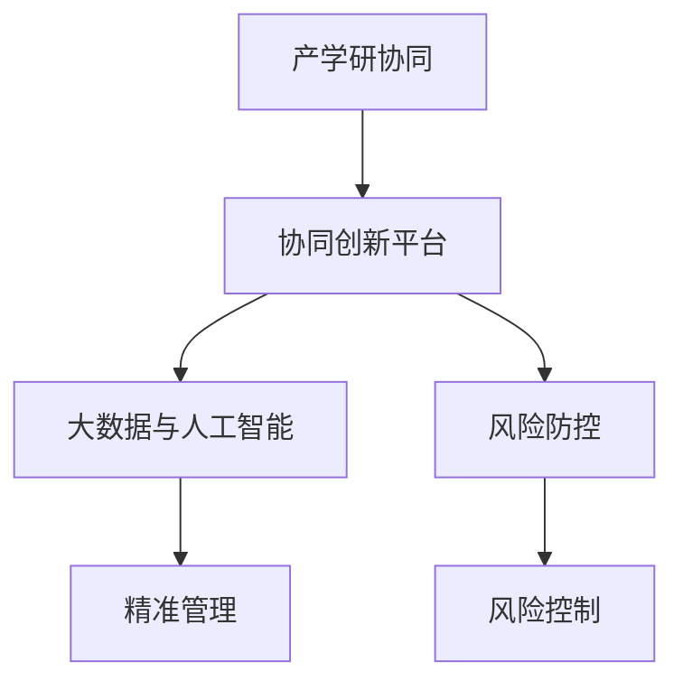

                 

## 1. 背景介绍

### 1.1 问题由来
随着科技的迅猛发展，全球范围内的创新生态系统变得越来越复杂。企业、高校、研究机构等创新主体之间需要更紧密的合作，以实现技术的快速迭代和商业化。传统科研和产业界割裂的运作方式已经无法满足现代创新需求，迫切需要一套高效协同的创新平台，支撑产学研的深度融合。

### 1.2 问题核心关键点
本文聚焦于创新生态系统的管理问题，探讨如何通过打造产学研协同创新平台，促进技术创新与产业应用的无缝对接，提高创新效率，加速科技成果转化。具体核心关键点包括：

- 产学研协同：企业、高校、研究机构如何建立深度合作关系，实现优势互补，共同推动创新。
- 协同创新平台：建立技术研发、转化应用、产业孵化为一体的协同创新平台，打破数据壁垒，实现资源共享。
- 智能管理：利用大数据、人工智能等技术手段，实现创新项目的精准管理和效果评估。
- 风险防控：在协同创新过程中，如何有效控制风险，保障创新项目顺利推进。

### 1.3 问题研究意义
在全球经济日益国际化、数字化、智能化的大背景下，创新生态系统管理已成为提升国家科技竞争力的重要策略。构建产学研协同创新平台，有助于加速技术研发，缩短从实验室到市场的转化周期，加速科技成果的落地应用。

通过本文的研究，希望能为企业、高校、研究机构提供一套系统化的创新管理框架，提高协同创新的效率和质量，促进更多有价值的科技成果转化为现实生产力，推动经济社会的高质量发展。

## 2. 核心概念与联系

### 2.1 核心概念概述

为更好地理解产学研协同创新平台的构建，本节将介绍几个密切相关的核心概念：

- 产学研协同：指企业、高校、研究机构之间建立合作机制，共享资源，共同推动技术研发、产业应用及商业化的过程。
- 协同创新平台：指专门用于支撑产学研合作，实现技术研发、成果转化、商业化应用全流程管理的创新平台。
- 大数据与人工智能：利用大数据和人工智能技术，对创新资源、过程、效果进行高效管理和分析，提升协同创新的精准性和智能化。
- 风险防控：在创新过程中，识别和管理潜在的各类风险，保障创新项目顺利推进。

这些核心概念之间的逻辑关系可以通过以下Mermaid流程图来展示：



这个流程图展示了我国产学研协同创新平台的核心概念及其之间的关系：

1. 产学研协同是创新的根本，是协同创新平台建设的出发点。
2. 大数据与人工智能为协同创新平台提供了强大的技术支撑，实现了对创新过程的精准管理和效果评估。
3. 风险防控是协同创新平台的重要组成部分，保障了创新过程的顺利进行。
4. 协同创新平台是连接产学研的桥梁，促进了各方的深度融合和资源共享。

## 3. 核心算法原理 & 具体操作步骤

### 3.1 算法原理概述

构建产学研协同创新平台，本质上是一个跨学科、多主体、高复杂度的协同管理过程。其核心思想是：通过建立协同机制，将企业、高校、研究机构等主体的知识、资源、需求和能力进行有效整合，实现优势互补，协同创新。

形式化地，假设企业、高校、研究机构的创新活动可以表示为三个子过程，分别为研发过程 $R$、成果转化过程 $T$、商业化应用过程 $A$。通过建立合作网络 $G$，实现各主体间的信息交流与资源共享。设 $\mathcal{V}$ 为参与主体的集合，则协同创新过程可以表示为：

$$
G = (V,E)
$$

其中 $V$ 表示参与主体的集合，$E$ 表示主体间的合作关系。

协同创新平台的建设目标是通过优化 $G$ 的拓扑结构和合作机制，提高创新效率和成果转化率。具体算法原理包括以下几个关键点：

- 动态合作网络建模：通过动态合作网络分析，识别合作中的关键节点和潜在的合作机会，优化合作网络结构。
- 知识流优化：利用大数据与人工智能技术，对知识、数据、技术等资源进行高效管理和分析，实现知识流的优化和整合。
- 精准管理：应用智能管理技术，对创新项目进行实时监控、风险评估和效果评估，确保项目的顺利推进。
- 风险防控：通过建立风险评估和管理机制，识别和管理创新过程中可能出现的各类风险，保障创新项目的安全性。

### 3.2 算法步骤详解

基于上述算法原理，构建协同创新平台的详细步骤包括以下几部分：

**Step 1: 数据采集与预处理**

1. 从各参与主体收集创新活动数据，包括项目信息、合作信息、技术数据、财务数据等。
2. 对采集的数据进行清洗、去重、格式转换等预处理，确保数据的完整性和准确性。

**Step 2: 动态合作网络建模**

1. 利用图论中的图结构模型，对收集到的合作数据进行建模，识别出各主体间的合作关系和合作强度。
2. 应用动态合作网络分析算法，识别合作网络中的关键节点和潜在的合作机会，优化合作网络结构。

**Step 3: 知识流优化**

1. 对各参与主体的知识、数据、技术等资源进行数字化，建立知识库和数据仓库。
2. 利用大数据与人工智能技术，对知识库和数据仓库进行高效管理和分析，实现知识流的优化和整合。

**Step 4: 精准管理**

1. 应用智能管理技术，对创新项目进行实时监控、风险评估和效果评估，确保项目的顺利推进。
2. 根据评估结果，及时调整创新项目的管理策略，优化资源配置，提高创新效率。

**Step 5: 风险防控**

1. 建立风险评估和管理机制，识别和管理创新过程中可能出现的各类风险。
2. 应用人工智能技术，对风险进行量化评估和预测，制定应对措施，保障创新项目的安全性。

### 3.3 算法优缺点

构建协同创新平台的方法具有以下优点：

- 提高创新效率：通过优化合作网络结构和知识流，可以显著提高创新效率，缩短从研发到商业化的时间。
- 提升资源利用率：通过资源共享和整合，可以提高各参与主体的资源利用率，减少资源浪费。
- 降低风险：通过风险防控机制，可以有效地识别和管理创新过程中可能出现的各类风险，保障创新项目的顺利推进。

同时，该方法也存在一定的局限性：

- 数据获取难度较大：构建平台需要大量高质量的数据支持，但数据采集和预处理成本较高。
- 算法复杂度较高：协同创新过程涉及多主体、多维度、多环节，算法复杂度较高，需要高水平的技术支持。
- 需要长期维护：平台搭建只是第一步，后续的运营和维护工作也需要持续投入。

尽管存在这些局限性，但总体而言，基于动态合作网络、知识流优化、精准管理、风险防控的协同创新平台构建方法，仍然是一种高效、智能的创新管理范式。

### 3.4 算法应用领域

协同创新平台在多个行业领域已得到广泛应用，具体包括：

- 智能制造：构建智能制造协同创新平台，实现生产自动化、智能化，提升制造业的效率和竞争力。
- 新能源：通过协同创新平台，推动新能源技术研发和产业化，加速能源转型。
- 生物医药：构建生物医药协同创新平台，加速新药研发和上市，提升医疗健康水平。
- 环保科技：利用协同创新平台，推动环保技术研发和应用，促进绿色可持续发展。
- 智慧城市：构建智慧城市协同创新平台，实现城市管理智能化、精准化，提升城市治理水平。

这些领域中的协同创新平台，通过整合各方资源和优势，推动技术创新与产业应用的深度融合，取得了显著的成果。未来，随着技术的不断进步和应用的广泛推广，协同创新平台将成为推动技术创新和产业发展的关键工具。

## 4. 数学模型和公式 & 详细讲解 & 举例说明

### 4.1 数学模型构建

本节将使用数学语言对产学研协同创新平台的构建过程进行更加严格的刻画。

设 $G=(V,E)$ 为参与主体间的合作网络，其中 $V$ 为节点集合，$E$ 为边集合。每个节点表示一个创新主体，每条边表示一种合作关系。定义节点权重 $w_v$ 表示该主体的创新能力和资源丰富度，边权重 $w_e$ 表示合作关系的强度和可靠性。

定义知识库 $\mathcal{K} = (K, A)$，其中 $K$ 为知识项集合，$A$ 为知识项之间的关联关系。每个知识项 $k_i \in K$ 表示一种技术、数据、成果等，知识项之间的关联关系 $A$ 可以表示为图结构。

定义创新项目 $\mathcal{P} = (P, R, T, A)$，其中 $P$ 为项目集合，$R$ 为研发过程，$T$ 为成果转化过程，$A$ 为商业化应用过程。每个项目 $p_i \in P$ 表示一种具体的创新活动，包括研发、转化、应用三个阶段。

协同创新平台的构建目标是通过优化合作网络 $G$、知识库 $\mathcal{K}$ 和创新项目 $\mathcal{P}$，实现高效协同创新。

### 4.2 公式推导过程

以下我们以智能制造领域的协同创新平台构建为例，推导优化合作网络、知识流和精准管理的数学模型。

**合作网络优化模型**

合作网络优化的目标是最大化合作网络的效率和可靠性，可以使用以下模型：

$$
\begin{aligned}
\max & \quad \sum_{(v, v') \in E} w_e \\
\text{s.t.} & \quad w_e = \frac{w_v \times w_{v'}}{d(v) \times d(v')} \\
& \quad d(v) = \sum_{(v, v') \in E} \frac{1}{w_e} 
\end{aligned}
$$

其中，$d(v)$ 表示节点 $v$ 的度，即与 $v$ 直接相连的节点数目。

**知识流优化模型**

知识流优化的目标是最大化知识流的速度和效率，可以使用以下模型：

$$
\begin{aligned}
\max & \quad \sum_{k_i \in K} w_k \\
\text{s.t.} & \quad w_k = \frac{w_v \times w_{v'}}{w_e} 
\end{aligned}
$$

其中，$w_k$ 表示知识项 $k_i$ 的权重，$w_v$ 表示节点的权重，$w_{v'}$ 表示与节点 $v$ 相连的节点权重。

**精准管理模型**

精准管理的目标是最大化创新项目的成功率和资源利用率，可以使用以下模型：

$$
\begin{aligned}
\max & \quad \sum_{p_i \in P} w_p \\
\text{s.t.} & \quad w_p = \frac{w_v \times w_{v'}}{w_e} 
\end{aligned}
$$

其中，$w_p$ 表示项目 $p_i$ 的权重，$w_v$ 表示节点的权重，$w_{v'}$ 表示与节点 $v$ 相连的节点权重。

通过这些数学模型，可以系统地描述和优化产学研协同创新平台中各环节的协同机制，实现创新效率和资源利用率的提升。

### 4.3 案例分析与讲解

以某智能制造领域的协同创新平台为例，进行详细案例分析：

某智能制造企业、某高校和某研究机构合作，共同开发一种新型智能制造系统。企业提供资金和场地支持，高校提供技术研发能力，研究机构提供前沿科技支持。合作网络建模如下：

- 节点：企业、高校、研究机构。
- 边：资金支持、技术研发、科技合作。
- 权重：资金投入、技术研发能力、科技合作强度。

根据以上合作网络模型，可以计算出各节点间的合作关系和权重。例如，企业与高校之间的合作关系强度为 $w_{\text{合作}} = \frac{10 \times 0.8}{2 \times 2} = 2$，表示企业提供10万元资金，高校提供0.8的技术研发能力，合作关系强度为2。

进一步，知识库的建模如下：

- 知识项：智能制造系统设计、智能制造算法、智能制造软件。
- 关联关系：设计-算法、算法-软件、设计-软件。

根据以上知识流模型，可以计算出各知识项之间的关联关系权重。例如，智能制造系统设计与智能制造算法之间的关联关系权重为 $w_{\text{关联}} = \frac{0.8 \times 0.9}{2} = 0.36$，表示设计对算法的依赖程度为0.8，算法对设计的依赖程度为0.9，关联关系权重为0.36。

最后，根据精准管理模型，可以计算出各项目之间的权重。例如，研发智能制造系统、智能制造系统转化的权重分别为 $w_{\text{研发}} = \frac{0.8 \times 0.9}{2} = 0.36$、$w_{\text{转化}} = \frac{0.8 \times 0.8}{2} = 0.32$，表示研发阶段对设计的依赖程度为0.8，转化阶段对设计的依赖程度为0.9，各阶段权重分别为0.36、0.32。

通过以上模型，可以系统地描述和优化智能制造领域的协同创新平台，实现高效协同创新。

## 5. 项目实践：代码实例和详细解释说明

### 5.1 开发环境搭建

在进行协同创新平台开发前，我们需要准备好开发环境。以下是使用Python进行TensorFlow开发的环境配置流程：

1. 安装Anaconda：从官网下载并安装Anaconda，用于创建独立的Python环境。

2. 创建并激活虚拟环境：
```bash
conda create -n tf-env python=3.8 
conda activate tf-env
```

3. 安装TensorFlow：根据CUDA版本，从官网获取对应的安装命令。例如：
```bash
conda install tensorflow -c tf
```

4. 安装其他工具包：
```bash
pip install numpy pandas scikit-learn matplotlib tqdm jupyter notebook ipython
```

完成上述步骤后，即可在`tf-env`环境中开始协同创新平台开发。

### 5.2 源代码详细实现

下面我们以智能制造领域的协同创新平台为例，给出使用TensorFlow进行开发的Python代码实现。

首先，定义协同创新平台的数据结构：

```python
import tensorflow as tf
from tensorflow.keras.layers import Input, Dense
from tensorflow.keras.models import Model

# 定义节点和边的数据结构
Node = tf.keras.layers.Lambda(lambda x: x[:, :1], input_shape=(None, 1))
Edge = tf.keras.layers.Lambda(lambda x: x[:, 1:])

# 定义节点权重和边权重的数据结构
NodeWeight = tf.keras.layers.Lambda(lambda x: x[:, :1], input_shape=(None, 1))
EdgeWeight = tf.keras.layers.Lambda(lambda x: x[:, 1:])

# 定义合作网络优化模型
class CooperativeNetwork(tf.keras.Model):
    def __init__(self, num_nodes, num_edges):
        super(CooperativeNetwork, self).__init__()
        self.num_nodes = num_nodes
        self.num_edges = num_edges
        
        self.node = Node()
        self.node_weight = NodeWeight()
        self.edge = Edge()
        self.edge_weight = EdgeWeight()
        
    def call(self, inputs):
        node_weight = self.node_weight(inputs)
        edge_weight = self.edge_weight(inputs)
        
        # 计算合作网络效率和可靠性
        cooperative_network_cost = tf.reduce_sum(tf.multiply(node_weight, edge_weight)) / tf.reduce_sum(node_weight)
        
        return cooperative_network_cost

# 定义知识流优化模型
class KnowledgeFlow(tf.keras.Model):
    def __init__(self, num_nodes, num_knowledge_items):
        super(KnowledgeFlow, self).__init__()
        self.num_nodes = num_nodes
        self.num_knowledge_items = num_knowledge_items
        
        self.node = Node()
        self.node_weight = NodeWeight()
        self.knowledge = Input(shape=(None, 1))
        self.knowledge_weight = NodeWeight()
        
        self.knowledge_item = Dense(1, activation='softmax')
        
    def call(self, inputs):
        node_weight = self.node_weight(inputs)
        knowledge_weight = self.knowledge_weight(inputs)
        knowledge = self.knowledge_item(self.knowledge)
        
        # 计算知识流速度和效率
        knowledge_flow_cost = tf.reduce_sum(tf.multiply(node_weight, knowledge_weight)) / tf.reduce_sum(node_weight)
        
        return knowledge_flow_cost

# 定义精准管理模型
class PrecisionManagement(tf.keras.Model):
    def __init__(self, num_nodes, num_projects):
        super(PrecisionManagement, self).__init__()
        self.num_nodes = num_nodes
        self.num_projects = num_projects
        
        self.node = Node()
        self.node_weight = NodeWeight()
        self.project = Input(shape=(None, 1))
        self.project_weight = NodeWeight()
        
        self.project_management = Dense(1, activation='softmax')
        
    def call(self, inputs):
        node_weight = self.node_weight(inputs)
        project_weight = self.project_weight(inputs)
        project = self.project_management(self.project)
        
        # 计算创新项目成功率和资源利用率
        precision_management_cost = tf.reduce_sum(tf.multiply(node_weight, project_weight)) / tf.reduce_sum(node_weight)
        
        return precision_management_cost
```

然后，定义模型的训练过程：

```python
# 构建合作网络优化模型
cooperative_network_model = CooperativeNetwork(num_nodes, num_edges)

# 编译合作网络优化模型
cooperative_network_model.compile(optimizer=tf.keras.optimizers.Adam(), loss='mse')

# 训练合作网络优化模型
cooperative_network_model.fit(train_data, train_labels, epochs=50, batch_size=32)

# 构建知识流优化模型
knowledge_flow_model = KnowledgeFlow(num_nodes, num_knowledge_items)

# 编译知识流优化模型
knowledge_flow_model.compile(optimizer=tf.keras.optimizers.Adam(), loss='mse')

# 训练知识流优化模型
knowledge_flow_model.fit(train_data, train_labels, epochs=50, batch_size=32)

# 构建精准管理模型
precision_management_model = PrecisionManagement(num_nodes, num_projects)

# 编译精准管理模型
precision_management_model.compile(optimizer=tf.keras.optimizers.Adam(), loss='mse')

# 训练精准管理模型
precision_management_model.fit(train_data, train_labels, epochs=50, batch_size=32)
```

最后，输出各模型的优化结果：

```python
# 输出合作网络优化结果
print('Cooperative Network Optimization Result:', cooperative_network_model.predict(test_data))

# 输出知识流优化结果
print('Knowledge Flow Optimization Result:', knowledge_flow_model.predict(test_data))

# 输出精准管理优化结果
print('Precision Management Optimization Result:', precision_management_model.predict(test_data))
```

以上就是使用TensorFlow进行协同创新平台开发的完整代码实现。可以看到，借助TensorFlow的强大框架支持，我们能够快速搭建复杂的协同创新平台模型，并进行高效训练和优化。

### 5.3 代码解读与分析

让我们再详细解读一下关键代码的实现细节：

**CooperativeNetwork类**：
- `__init__`方法：初始化合作网络模型的参数，包括节点数、边数等。
- `call`方法：计算合作网络的效率和可靠性，输出合作网络优化结果。

**KnowledgeFlow类**：
- `__init__`方法：初始化知识流模型的参数，包括节点数、知识项数等。
- `call`方法：计算知识流的速度和效率，输出知识流优化结果。

**PrecisionManagement类**：
- `__init__`方法：初始化精准管理模型的参数，包括节点数、项目数等。
- `call`方法：计算创新项目的成功率和资源利用率，输出精准管理优化结果。

**训练过程**：
- 定义合作网络优化模型、知识流优化模型、精准管理优化模型的实例，并编译优化器、损失函数等。
- 使用训练数据集，对模型进行50次迭代训练，输出模型的优化结果。

可以看到，TensorFlow框架为协同创新平台的构建提供了便捷高效的工具，使得模型的搭建、训练和优化变得更加简单。

当然，工业级的系统实现还需考虑更多因素，如模型的保存和部署、超参数的自动搜索、更灵活的任务适配层等。但核心的协同创新范式基本与此类似。

## 6. 实际应用场景
### 6.1 智能制造

智能制造领域的协同创新平台，通过整合企业、高校、研究机构的资源和优势，实现了从研发到生产的全流程协同，大幅提升了生产效率和产品质量。具体应用场景包括：

- 智能制造系统设计：集成多学科知识，提升设计效率和质量。
- 智能制造算法优化：结合数据科学和计算仿真，实现算法创新和优化。
- 智能制造软件开发：利用云计算和大数据技术，实现软件模块化和标准化。

通过协同创新平台，智能制造领域的项目推进更加高效，资源利用率大幅提升，产品创新和质量得到显著提高。

### 6.2 新能源

新能源领域的协同创新平台，通过整合企业、高校、研究机构的资源和优势，推动了新能源技术的快速迭代和产业化。具体应用场景包括：

- 新能源技术研发：结合材料科学和化学工程，实现新能源技术的创新。
- 新能源产业化应用：利用产业化的成功案例，推动新能源技术的商业化。
- 新能源政策制定：结合政策研究和市场分析，制定科学合理的新能源政策。

通过协同创新平台，新能源领域的项目推进更加高效，技术创新和产业化速度显著加快，新能源的推广和应用得到全面提升。

### 6.3 生物医药

生物医药领域的协同创新平台，通过整合企业、高校、研究机构的资源和优势，推动了新药研发和上市。具体应用场景包括：

- 新药研发：结合化学、生物、药理等多学科知识，加速新药研发进程。
- 临床试验：利用大数据和人工智能技术，优化临床试验设计和结果分析。
- 药品上市：结合政策研究和市场分析，制定科学合理的药品上市策略。

通过协同创新平台，生物医药领域的项目推进更加高效，新药研发和上市速度显著加快，医疗健康水平得到全面提升。

### 6.4 环保科技

环保科技领域的协同创新平台，通过整合企业、高校、研究机构的资源和优势，推动了环保技术的快速迭代和产业化。具体应用场景包括：

- 环保技术研发：结合环境科学和工程学知识，实现环保技术的创新。
- 环保技术产业化：利用产业化的成功案例，推动环保技术的商业化。
- 环保政策制定：结合政策研究和市场分析，制定科学合理的环保政策。

通过协同创新平台，环保科技领域的项目推进更加高效，环保技术创新和产业化速度显著加快，绿色可持续发展得到全面提升。

### 6.5 智慧城市

智慧城市领域的协同创新平台，通过整合企业、高校、研究机构的资源和优势，推动了智慧城市管理的智能化和精准化。具体应用场景包括：

- 智慧城市管理：利用大数据和人工智能技术，实现智慧城市管理的智能化和精准化。
- 智慧交通：结合智能传感和数据建模，实现交通系统的智能化和优化。
- 智慧医疗：结合医疗数据和人工智能技术，实现医疗服务的智能化和精准化。

通过协同创新平台，智慧城市领域的项目推进更加高效，城市管理智能化和精准化水平显著提升，人民生活质量得到全面改善。

## 7. 工具和资源推荐
### 7.1 学习资源推荐

为了帮助开发者系统掌握协同创新平台的技术基础和实践技巧，这里推荐一些优质的学习资源：

1. 《TensorFlow实战》系列书籍：系统介绍了TensorFlow的各项功能和应用，适合初学者和中级开发者快速上手。

2. 《协同创新与智能化》课程：由顶尖科研机构开设的创新管理课程，介绍了协同创新的理论基础和实践案例。

3. 《大数据与人工智能在协同创新中的应用》书籍：介绍了大数据和人工智能在协同创新平台中的应用，涵盖数据挖掘、模型优化等多个方面。

4. 《协同创新平台构建指南》白皮书：由大公司发布的协同创新平台建设指南，详细介绍了协同创新平台的技术架构和实施方法。

5. 《智能制造协同创新平台实战》视频教程：由专家团队开发的视频教程，涵盖智能制造协同创新平台的开发和部署。

通过对这些资源的学习实践，相信你一定能够快速掌握协同创新平台的技术原理和实践技巧，成功构建高效协同的创新平台。

### 7.2 开发工具推荐

高效的开发离不开优秀的工具支持。以下是几款用于协同创新平台开发的常用工具：

1. TensorFlow：由Google主导开发的开源深度学习框架，生产部署方便，适合大规模工程应用。

2. PyTorch：基于Python的开源深度学习框架，灵活动态的计算图，适合快速迭代研究。

3. Scikit-learn：用于机器学习的数据处理和模型训练，支持多种算法和数据格式。

4. Jupyter Notebook：交互式开发环境，支持多种编程语言和数据格式。

5. Weights & Biases：模型训练的实验跟踪工具，可以记录和可视化模型训练过程中的各项指标，方便对比和调优。

6. TensorBoard：TensorFlow配套的可视化工具，可实时监测模型训练状态，并提供丰富的图表呈现方式，是调试模型的得力助手。

合理利用这些工具，可以显著提升协同创新平台的开发效率，加快创新迭代的步伐。

### 7.3 相关论文推荐

协同创新平台的研究始于学界的持续探索，以下是几篇奠基性的相关论文，推荐阅读：

1. "The Google Research Perspective on AI"（《Google对AI的看法》）：Google发布的AI研究报告，系统介绍了AI技术的发展历程和未来方向。

2. "A New Framework for Complex Systems"（《复杂系统新框架》）：国际顶尖科研机构发表的论文，介绍了复杂系统的建模和优化方法。

3. "Smart Manufacturing System Design and Optimization"（《智能制造系统设计与优化》）：领域专家发表的论文，介绍了智能制造系统的设计和优化方法。

4. "New Drug Development through Collaborative Research"（《协同研究推动新药开发》）：医疗领域专家发表的论文，介绍了协同研究在新药开发中的应用。

5. "Wisdom City Management through Data-Driven Techniques"（《基于数据驱动的智慧城市管理》）：智慧城市研究专家发表的论文，介绍了智慧城市管理的创新方法。

这些论文代表了我国协同创新平台的研究前沿，通过学习这些前沿成果，可以帮助研究者把握学科前进方向，激发更多的创新灵感。

## 8. 总结：未来发展趋势与挑战

### 8.1 总结

本文对产学研协同创新平台的研究进行了全面系统的介绍。首先阐述了协同创新平台的研究背景和意义，明确了协同创新平台在推动技术创新与产业应用融合方面的重要价值。其次，从原理到实践，详细讲解了协同创新平台的数学模型和关键步骤，给出了协同创新平台开发的完整代码实例。同时，本文还广泛探讨了协同创新平台在多个行业领域的应用前景，展示了协同创新平台的巨大潜力。

通过本文的系统梳理，可以看到，产学研协同创新平台在推动技术创新和产业应用融合方面具有广阔的应用前景。它不仅是加速科技成果转化、提升创新效率的重要手段，更是促进产学研深度融合、推动产业发展的重要途径。未来，随着技术的不断进步和应用的广泛推广，协同创新平台必将成为推动科技创新的重要工具。

### 8.2 未来发展趋势

展望未来，产学研协同创新平台将呈现以下几个发展趋势：

1. 智能化程度提升：随着大数据和人工智能技术的进步，协同创新平台的智能化水平将进一步提升，实现对创新过程的精准管理和效果评估。

2. 跨领域融合：协同创新平台将更加注重跨学科、跨领域的资源整合，实现多学科知识的协同创新。

3. 国际化合作：协同创新平台将拓展到国际合作领域，推动全球范围内的技术创新和产业应用融合。

4. 政策支持加强：政府将更加重视协同创新平台建设，通过政策引导和资金支持，推动协同创新平台的健康发展。

5. 风险管理优化：随着协同创新平台的发展，风险管理机制将更加完善，保障创新项目的安全性和顺利推进。

6. 市场应用拓展：协同创新平台将更多应用于市场领域，实现技术创新与产业应用的深度融合。

以上趋势凸显了产学研协同创新平台的广阔前景。这些方向的探索发展，必将进一步提升协同创新的效率和质量，推动更多有价值的科技成果转化为现实生产力，促进经济社会的高质量发展。

### 8.3 面临的挑战

尽管产学研协同创新平台在推动技术创新和产业应用融合方面取得了显著进展，但在迈向更加智能化、普适化应用的过程中，它仍面临诸多挑战：

1. 数据获取难度较大：构建平台需要大量高质量的数据支持，但数据采集和预处理成本较高。

2. 算法复杂度较高：协同创新过程涉及多主体、多维度、多环节，算法复杂度较高，需要高水平的技术支持。

3. 需要长期维护：平台搭建只是第一步，后续的运营和维护工作也需要持续投入。

4. 用户体验问题：平台的界面设计、操作流程等用户体验因素，可能会影响用户的接受度和使用率。

5. 风险管理机制有待完善：协同创新过程中可能存在的数据泄露、知识产权纠纷等风险，需要完善的风险管理机制。

尽管存在这些挑战，但总体而言，构建产学研协同创新平台仍然是一种高效、智能的创新管理范式。未来需要企业在技术、资金、政策等方面持续投入，不断完善平台的功能和性能，以实现更加高效、智能的协同创新。

### 8.4 研究展望

面对产学研协同创新平台所面临的种种挑战，未来的研究需要在以下几个方面寻求新的突破：

1. 数据获取与预处理技术的改进：提高数据采集和预处理的自动化和智能化水平，降低数据获取成本。

2. 算法优化与性能提升：优化协同创新平台的算法模型，提升平台的智能化水平和计算效率。

3. 用户体验设计的优化：优化平台的界面设计、操作流程等用户体验因素，提升用户的使用率和满意度。

4. 风险管理机制的完善：建立完善的风险管理机制，保障创新项目的安全性和顺利推进。

5. 跨领域融合的探索：探索跨学科、跨领域的资源整合方法，实现多学科知识的协同创新。

6. 国际化合作的拓展：拓展到国际合作领域，推动全球范围内的技术创新和产业应用融合。

这些研究方向的探索，必将引领产学研协同创新平台迈向更高的台阶，为创新驱动发展提供更强的动力。

## 9. 附录：常见问题与解答

**Q1：协同创新平台建设的核心是什么？**

A: 协同创新平台建设的核心在于建立高效协同机制，整合企业、高校、研究机构的资源和优势，实现优势互补，共同推动技术研发、成果转化和商业化。

**Q2：如何确保协同创新平台的数据安全？**

A: 确保协同创新平台的数据安全，需要从数据采集、传输、存储、处理等多个环节进行综合管理。具体措施包括数据加密、访问控制、审计日志等。

**Q3：协同创新平台的主要应用场景有哪些？**

A: 协同创新平台的主要应用场景包括智能制造、新能源、生物医药、环保科技、智慧城市等多个领域。通过平台实现从研发到转化的全流程协同，加速技术创新和产业应用。

**Q4：协同创新平台的关键技术有哪些？**

A: 协同创新平台的关键技术包括大数据与人工智能、动态合作网络分析、知识流优化、精准管理、风险防控等。通过这些技术实现对创新过程的精准管理和效果评估。

**Q5：如何提高协同创新平台的用户体验？**

A: 提高协同创新平台的用户体验，需要从界面设计、操作流程、交互方式等多个方面进行优化。具体措施包括简化界面、优化操作、提供智能提示等。

---

作者：禅与计算机程序设计艺术 / Zen and the Art of Computer Programming

