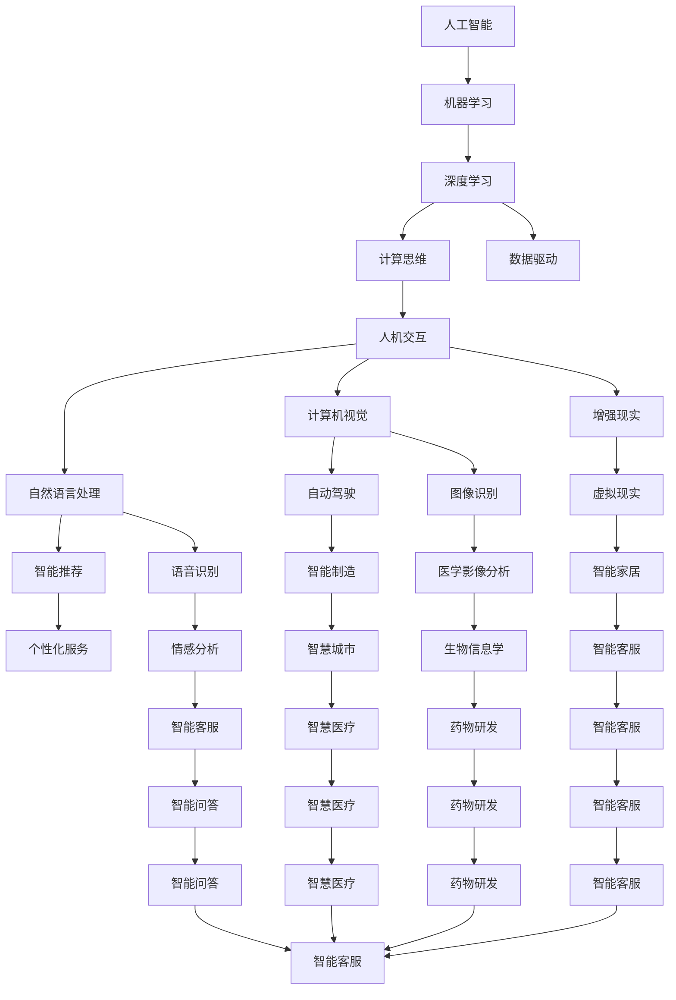

                 

# 创造更美好的世界：人类计算的终极目标

> 关键词：人工智能(AI), 计算思维, 人机交互, 机器学习, 深度学习, 数据驱动, 人类增强

## 1. 背景介绍

在过去的几十年里，计算机技术经历了翻天覆地的变化，从简单的指令执行器，发展到今天能够自主学习、决策的智能系统。这一变革不仅推动了经济、社会的进步，也引领了人们对于未来世界的种种畅想。本文将围绕人类计算的终极目标，探讨如何通过人工智能(AI)技术，构建一个更美好的世界。

### 1.1 问题由来

随着计算技术的发展，人类对计算机的理解和依赖也发生了巨大转变。从早期的编程到后期的机器学习，从早期的以规则为主，到后期的以数据为主，计算思维已经深深地融入到了人类社会生活的方方面面。然而，尽管计算机能力不断增强，其在逻辑推理、决策、创新等方面的能力仍然远不如人类。因此，如何利用计算技术，辅助甚至替代人类完成更多复杂任务，成为当前研究的重要方向。

### 1.2 问题核心关键点

实现人类计算的终极目标，需要从以下几个关键点入手：

1. **数据驱动**：计算能力的关键在于数据的规模和质量，高质量的数据可以大幅提升模型的预测和决策能力。
2. **深度学习**：深度学习技术通过多层神经网络，能够从海量数据中学习出复杂的特征表示，具备强大的学习能力和泛化能力。
3. **人机交互**：如何让机器更好地理解人类意图，是实现人类计算目标的桥梁。自然语言处理(NLP)、计算机视觉(CV)等技术为此提供了强有力的支持。
4. **可解释性**：在复杂决策场景中，计算模型的可解释性至关重要。如何使模型的决策过程透明可控，是未来研究的重要方向。
5. **伦理与安全性**：在人工智能广泛应用的同时，如何确保其伦理性和安全性，避免对社会产生负面影响，也是一个重要课题。

## 2. 核心概念与联系

### 2.1 核心概念概述

为了更好地理解人类计算的终极目标，本节将介绍几个密切相关的核心概念：

1. **人工智能(AI)**：指使计算机系统具有人类智能水平的科学与技术，包括感知、学习、推理、决策等能力。
2. **计算思维**：指解决复杂问题的计算方法，包括问题建模、算法设计、数据处理等。
3. **人机交互**：指人与计算机系统之间的交互方式，包括自然语言处理(NLP)、计算机视觉(CV)、增强现实(AR)等技术。
4. **机器学习(ML)**：指让计算机从数据中学习规律，并通过学习规律进行预测或决策的过程。
5. **深度学习(Deep Learning)**：一种特殊的机器学习方法，通过多层神经网络，能够从大量数据中学习出高层次的抽象特征。
6. **数据驱动**：指在模型训练和决策过程中，通过大量高质量的数据驱动模型的学习过程，提升模型的泛化能力。
7. **人机协作**：指通过智能系统的辅助，提升人类在决策、设计、生产等方面的效率和精度。

这些核心概念之间存在着紧密的联系，共同构成了人类计算的基石。通过理解这些概念，我们可以更好地把握人工智能技术的发展方向和应用前景。

### 2.2 核心概念原理和架构的 Mermaid 流程图



这个流程图展示了人工智能技术的各个组成部分及其之间的联系。通过这些技术的融合，可以实现复杂任务的自动化、智能化。

## 3. 核心算法原理 & 具体操作步骤

### 3.1 算法原理概述

实现人类计算的终极目标，核心在于开发能够高效处理复杂问题的算法。这些算法通常基于大量的数据和先进的深度学习技术，通过学习数据中的规律和特征，实现对未知数据的预测和决策。

具体而言，人类计算的终极目标可以分为以下几个步骤：

1. **数据收集与预处理**：通过传感器、网络等方式，收集海量的数据，并进行数据清洗、标注等预处理。
2. **模型训练与优化**：使用深度学习模型，对数据进行训练，并通过优化算法（如梯度下降、Adam等）优化模型的参数，提升模型性能。
3. **模型部署与应用**：将训练好的模型部署到实际应用中，实现对新数据的预测和决策。
4. **持续学习与优化**：随着数据的积累和新需求的产生，持续对模型进行微调和优化，提升模型性能。

### 3.2 算法步骤详解

下面详细介绍实现人类计算终极目标的算法步骤：

**Step 1: 数据收集与预处理**
- 通过传感器、网络等方式，收集海量数据。数据可以来源于摄像头、麦克风、传感器、网络等多种渠道。
- 对数据进行清洗、去重、标注等预处理。清洗数据可以去除噪音、错误等无效信息，标注数据可以为模型训练提供有意义的监督信号。

**Step 2: 模型训练与优化**
- 选择合适的深度学习模型，如卷积神经网络(CNN)、循环神经网络(RNN)、注意力机制等，根据任务需求进行设计。
- 使用大规模数据集进行模型训练，并选择合适的优化算法进行模型优化。常用的优化算法包括梯度下降、Adam、Adagrad等。
- 使用交叉验证等技术，对模型进行评估和调优，提升模型泛化能力。

**Step 3: 模型部署与应用**
- 将训练好的模型部署到实际应用中，如移动设备、嵌入式设备、云计算平台等。
- 对模型进行接口封装，使其能够被不同设备和系统调用。
- 实时采集新数据，将数据输入模型进行预测或决策。

**Step 4: 持续学习与优化**
- 持续收集新数据，并更新模型参数，提升模型性能。
- 使用增量学习等技术，实时更新模型，适应数据分布的变化。
- 对模型进行定期评估和优化，确保模型能够持续提供高质量的服务。

### 3.3 算法优缺点

实现人类计算的终极目标，算法具有以下优点：

1. **高效性**：基于大规模数据和深度学习技术的算法，能够高效处理复杂问题，实现实时预测和决策。
2. **泛化能力强**：通过学习海量数据中的规律和特征，模型具备较强的泛化能力，能够在不同数据分布上表现良好。
3. **应用广泛**：算法可以应用于医疗、金融、制造、交通等多个领域，为各行各业提供智能解决方案。
4. **可扩展性好**：算法的可扩展性高，能够适应大规模数据处理和实时计算的需求。

同时，算法也存在以下缺点：

1. **数据依赖性强**：算法的性能高度依赖于数据的规模和质量，数据不足或噪声过多都会影响算法效果。
2. **计算资源消耗大**：深度学习模型通常需要大量的计算资源进行训练和推理，对硬件资源要求较高。
3. **可解释性不足**：复杂模型（如深度学习模型）的决策过程难以解释，缺乏可解释性。
4. **伦理与安全性问题**：算法的决策可能受到数据偏见的影响，存在一定的伦理和安全风险。

尽管存在这些缺点，但基于人工智能技术的算法依然被认为是实现人类计算终极目标的重要手段。

### 3.4 算法应用领域

基于人工智能技术的算法，已经在多个领域得到了广泛应用，例如：

1. **医疗健康**：通过深度学习模型，可以实现疾病预测、医学影像分析、个性化诊疗等。
2. **金融科技**：利用机器学习算法，可以进行风险评估、信用评分、投资策略等。
3. **制造业**：通过计算机视觉和深度学习，可以实现智能检测、质量控制、预测性维护等。
4. **自动驾驶**：通过传感器和深度学习模型，可以实现环境感知、路径规划、决策控制等。
5. **智能客服**：利用自然语言处理技术，可以实现智能问答、情感分析、意图识别等。
6. **智慧城市**：通过物联网和深度学习模型，可以实现智能交通、环境监测、城市管理等。

## 4. 数学模型和公式 & 详细讲解 & 举例说明

### 4.1 数学模型构建

实现人类计算的终极目标，通常基于以下数学模型：

1. **线性回归模型**：表示输入与输出之间的线性关系，用于预测和回归任务。
2. **逻辑回归模型**：用于分类任务，输出概率值表示类别分布。
3. **卷积神经网络(CNN)**：用于图像识别、文本分类等任务，能够提取局部特征。
4. **循环神经网络(RNN)**：用于序列数据处理，如自然语言处理、时间序列预测等。
5. **注意力机制**：用于提升模型的信息获取能力，如机器翻译、图像标注等任务。

### 4.2 公式推导过程

以线性回归模型为例，推导其在训练和预测过程中的数学公式。

假设输入向量为 $x$，输出向量为 $y$，模型的线性关系为 $y = wx + b$，其中 $w$ 为权重向量，$b$ 为偏置项。训练数据为 $\{(x_i, y_i)\}_{i=1}^N$。

**训练过程**：
- 损失函数：均方误差损失函数 $L = \frac{1}{N}\sum_{i=1}^N (y_i - wx_i - b)^2$
- 梯度下降更新：$w \leftarrow w - \alpha \frac{\partial L}{\partial w}, b \leftarrow b - \alpha \frac{\partial L}{\partial b}$，其中 $\alpha$ 为学习率。

**预测过程**：
- 预测输出：$\hat{y} = wx + b$

### 4.3 案例分析与讲解

以自然语言处理(NLP)任务为例，介绍如何通过深度学习模型进行文本分类和情感分析。

假设训练数据为 $\{(x_i, y_i)\}_{i=1}^N$，其中 $x_i$ 为文本，$y_i$ 为分类标签。使用卷积神经网络进行文本分类：

1. **模型构建**：输入文本经过嵌入层转换为向量表示，然后通过卷积层提取特征，最后通过全连接层输出分类结果。
2. **训练过程**：使用交叉熵损失函数进行模型训练，并通过梯度下降算法更新模型参数。
3. **预测过程**：将新的文本输入模型，输出分类结果。

## 5. 项目实践：代码实例和详细解释说明

### 5.1 开发环境搭建

在进行项目实践前，需要准备好开发环境。以下是使用Python进行TensorFlow开发的环境配置流程：

1. 安装Anaconda：从官网下载并安装Anaconda，用于创建独立的Python环境。

2. 创建并激活虚拟环境：
```bash
conda create -n tensorflow-env python=3.8 
conda activate tensorflow-env
```

3. 安装TensorFlow：根据CUDA版本，从官网获取对应的安装命令。例如：
```bash
conda install tensorflow -c tensorflow -c conda-forge
```

4. 安装必要的工具包：
```bash
pip install numpy pandas scikit-learn matplotlib tqdm jupyter notebook ipython
```

完成上述步骤后，即可在`tensorflow-env`环境中开始项目实践。

### 5.2 源代码详细实现

下面我们以自然语言处理(NLP)任务为例，给出使用TensorFlow对文本分类模型进行训练的代码实现。

```python
import tensorflow as tf
from tensorflow.keras import layers, models

# 定义模型
model = models.Sequential([
    layers.Embedding(input_dim=10000, output_dim=64, input_length=100),
    layers.Conv1D(64, 3, activation='relu'),
    layers.MaxPooling1D(pool_size=2),
    layers.Conv1D(32, 3, activation='relu'),
    layers.MaxPooling1D(pool_size=2),
    layers.Flatten(),
    layers.Dense(64, activation='relu'),
    layers.Dense(10, activation='softmax')
])

# 编译模型
model.compile(optimizer='adam', loss='categorical_crossentropy', metrics=['accuracy'])

# 训练模型
history = model.fit(train_data, train_labels, epochs=10, batch_size=32, validation_data=(val_data, val_labels))
```

这段代码实现了基于卷积神经网络(CNN)的文本分类模型，包括模型定义、编译和训练。

### 5.3 代码解读与分析

让我们再详细解读一下关键代码的实现细节：

**模型定义**：
- 使用Sequential模型，定义了卷积层、池化层、全连接层等组件。
- 使用Embedding层将文本转换为向量表示，卷积层提取特征，池化层减少特征维度。

**模型编译**：
- 使用adam优化器，交叉熵损失函数，准确率作为评价指标。

**模型训练**：
- 使用fit方法进行模型训练，指定训练数据、标签、迭代次数、批大小等参数。
- 使用validation_data参数指定验证数据，避免过拟合。

## 6. 实际应用场景

### 6.1 医疗健康

人工智能在医疗健康领域的应用，通过深度学习和自然语言处理技术，可以大幅提升医疗服务质量和效率。例如：

1. **疾病预测**：通过分析患者的电子病历和医疗记录，预测患者可能患有的疾病。
2. **医学影像分析**：利用卷积神经网络对医学影像进行分析和分类，辅助医生进行诊断。
3. **个性化诊疗**：根据患者的基因、病历、生活习惯等数据，提供个性化的治疗方案。

### 6.2 金融科技

人工智能在金融科技领域的应用，通过深度学习和机器学习技术，可以实现风险评估、信用评分、投资策略等。例如：

1. **信用评分**：通过分析用户的消费记录、信用历史等数据，预测用户的信用风险。
2. **投资策略**：利用机器学习算法，根据市场数据和历史交易记录，制定投资策略。
3. **反欺诈检测**：通过分析交易记录，检测和防止欺诈行为。

### 6.3 制造业

人工智能在制造业的应用，通过计算机视觉和深度学习技术，可以实现智能检测、质量控制、预测性维护等。例如：

1. **智能检测**：利用计算机视觉技术，检测产品缺陷和质量问题。
2. **质量控制**：通过分析生产数据和质量检测结果，实现质量控制和优化。
3. **预测性维护**：利用机器学习算法，预测设备故障和维护需求，避免意外停机。

### 6.4 未来应用展望

随着人工智能技术的不断发展，其在各领域的应用将越来越广泛。未来，人工智能技术有望实现以下突破：

1. **智能制造**：通过深度学习和物联网技术，实现智能生产、智能调度、智能质检等，提升制造业的效率和质量。
2. **智慧医疗**：通过深度学习和自然语言处理技术，实现智能诊断、智能治疗、智能管理等，提升医疗服务的质量和效率。
3. **智慧城市**：通过深度学习和物联网技术，实现智能交通、智能安防、智能能源管理等，提升城市的智能化水平。

## 7. 工具和资源推荐

### 7.1 学习资源推荐

为了帮助开发者系统掌握人工智能技术，这里推荐一些优质的学习资源：

1. **深度学习基础课程**：如《深度学习》课程，介绍深度学习的理论基础和实践技巧。
2. **自然语言处理课程**：如CS224N《深度学习自然语言处理》课程，介绍自然语言处理的基本概念和前沿技术。
3. **机器学习实践书籍**：如《机器学习实战》，通过实例介绍机器学习的算法和应用。
4. **人工智能技术博客**：如深度学习社区DeepLearning.AI，提供最新的人工智能技术和实践经验。
5. **在线学习平台**：如Coursera、Udacity等，提供丰富的人工智能课程和实战项目。

通过对这些资源的学习实践，相信你一定能够快速掌握人工智能技术，并应用于实际项目中。

### 7.2 开发工具推荐

高效的开发离不开优秀的工具支持。以下是几款用于人工智能开发常用的工具：

1. **TensorFlow**：由Google主导开发的开源深度学习框架，支持分布式计算，适合大规模工程应用。
2. **PyTorch**：Facebook开发的深度学习框架，灵活的动态计算图，适合快速迭代研究。
3. **Keras**：高层神经网络API，提供简单易用的API接口，适合初学者入门。
4. **Jupyter Notebook**：交互式的代码编辑器，适合进行实验和共享代码。
5. **Visual Studio Code**：轻量级的代码编辑器，支持多语言开发和丰富的插件扩展。

合理利用这些工具，可以显著提升人工智能开发的效率，加快创新迭代的步伐。

### 7.3 相关论文推荐

人工智能技术的发展源于学界的持续研究。以下是几篇奠基性的相关论文，推荐阅读：

1. **深度学习基础论文**：如《Deep Learning》，介绍深度学习的理论基础和应用场景。
2. **自然语言处理基础论文**：如《Attention is All You Need》，介绍Transformer模型。
3. **计算机视觉基础论文**：如《ImageNet Classification with Deep Convolutional Neural Networks》，介绍卷积神经网络。
4. **机器学习基础论文**：如《A Survey on Machine Learning Techniques for Predictive Maintenance》，介绍机器学习在预测性维护中的应用。
5. **智能推荐系统基础论文**：如《Collaborative Filtering for Recommender Systems》，介绍协同过滤算法。

这些论文代表了大数据、深度学习等技术的发展脉络。通过学习这些前沿成果，可以帮助研究者把握学科前进方向，激发更多的创新灵感。

## 8. 总结：未来发展趋势与挑战

### 8.1 研究成果总结

本文对实现人类计算终极目标的算法进行了全面系统的介绍。首先阐述了人工智能技术的发展背景和应用前景，明确了其在各领域的重要价值。其次，从原理到实践，详细讲解了算法的数学模型和操作步骤，给出了实际应用中的代码实例。同时，本文还广泛探讨了人工智能技术在医疗、金融、制造业等多个行业领域的应用前景，展示了其巨大的潜力。

通过本文的系统梳理，可以看到，人工智能技术在各领域的应用前景广阔，能够大幅提升生产效率和服务质量。然而，其在发展过程中也面临着诸多挑战，需要不断地探索和优化。

### 8.2 未来发展趋势

展望未来，人工智能技术将呈现以下几个发展趋势：

1. **智能制造**：通过深度学习和物联网技术，实现智能生产、智能调度、智能质检等，提升制造业的效率和质量。
2. **智慧医疗**：通过深度学习和自然语言处理技术，实现智能诊断、智能治疗、智能管理等，提升医疗服务的质量和效率。
3. **智慧城市**：通过深度学习和物联网技术，实现智能交通、智能安防、智能能源管理等，提升城市的智能化水平。
4. **个性化推荐**：利用机器学习算法，实现个性化推荐、内容过滤、广告投放等，提升用户体验和运营效率。
5. **增强现实**：通过计算机视觉和增强现实技术，实现虚拟试衣、虚拟导购、虚拟培训等，提升用户体验和互动性。

### 8.3 面临的挑战

尽管人工智能技术已经取得了显著进展，但在迈向更加智能化、普适化应用的过程中，仍面临诸多挑战：

1. **数据质量问题**：数据的质量和数量对模型的性能影响巨大，数据缺失、噪音等问题都会影响模型的预测和决策。
2. **模型可解释性问题**：复杂模型（如深度学习模型）的决策过程难以解释，缺乏可解释性。
3. **伦理与安全性问题**：算法可能受到数据偏见的影响，存在一定的伦理和安全风险。
4. **计算资源消耗问题**：深度学习模型通常需要大量的计算资源进行训练和推理，对硬件资源要求较高。

尽管存在这些挑战，但通过不断的技术创新和优化，相信人工智能技术能够在各领域取得更加广泛的应用，带来更高的生产效率和服务质量。

### 8.4 研究展望

未来，人工智能技术的研究方向将涵盖以下几个方面：

1. **计算思维的普及**：通过教育和技术培训，普及计算思维，提升大众的计算能力。
2. **跨领域的应用**：将人工智能技术应用于更多领域，如医疗、金融、教育等，提升各行业的智能化水平。
3. **人机协作**：通过智能系统的辅助，提升人类在决策、设计、生产等方面的效率和精度。
4. **伦理与安全性**：在算法设计中引入伦理导向的评价指标，过滤和惩罚有偏见、有害的输出倾向，确保算法的安全性和可靠性。
5. **可解释性**：增强算法的可解释性，使决策过程透明可控，避免模型偏见和误导性输出。

这些研究方向将推动人工智能技术在各领域的广泛应用，为社会带来更深远的影响。总之，未来人工智能技术的发展前景广阔，需要我们共同努力，不断探索和创新，实现人类计算的终极目标。

## 9. 附录：常见问题与解答

**Q1: 人工智能技术是否能够替代人类完成所有工作？**

A: 人工智能技术在许多方面已经展现了巨大的潜力，但仍无法完全替代人类完成所有工作。一些需要人类创造力、情感、直觉等复杂思维的工作，如艺术创作、人际沟通等，目前仍需人类来完成。然而，人工智能可以辅助人类在这些领域发挥更大的作用，提升工作效率和效果。

**Q2: 人工智能技术在应用过程中是否存在伦理和安全问题？**

A: 人工智能技术在应用过程中，确实存在一定的伦理和安全问题。例如，算法可能受到数据偏见的影响，产生歧视性输出。此外，人工智能系统的安全性和可靠性也受到质疑，存在被攻击和利用的风险。因此，在算法设计和应用过程中，需要引入伦理导向的评价指标，确保算法的公平性和安全性。

**Q3: 如何提升人工智能技术的可解释性？**

A: 提升人工智能技术的可解释性，需要从多个方面入手：
1. **算法透明性**：选择透明性更高的算法，如决策树、逻辑回归等，增加算法的可解释性。
2. **模型解释工具**：开发和使用模型解释工具，如LIME、SHAP等，提供算法的解释和可视化。
3. **特征工程**：通过特征工程，选择更有意义的特征，提高算法的可解释性。
4. **人机协作**：通过人机协作，将算法的预测结果进行人工审核和修正，增加算法的透明性和可信度。

通过以上措施，可以显著提升人工智能技术的可解释性，使其更加透明和可信。

**Q4: 人工智能技术在实现人类计算终极目标的过程中，有哪些潜在的风险？**

A: 人工智能技术在实现人类计算终极目标的过程中，存在以下潜在的风险：
1. **数据隐私和安全风险**：算法的训练和应用依赖于大量数据，数据隐私和安全问题需要引起重视。
2. **伦理与法律风险**：算法的决策可能受到数据偏见的影响，存在一定的伦理和法律风险。
3. **就业和经济风险**：人工智能技术的发展可能对某些行业造成冲击，引发就业和经济问题。
4. **技术滥用风险**：人工智能技术可能被用于不道德的目的，如武器化、侵犯隐私等。

因此，在人工智能技术的发展过程中，需要综合考虑技术、伦理、法律和社会因素，确保其安全、可靠、可控。

---

作者：禅与计算机程序设计艺术 / Zen and the Art of Computer Programming

