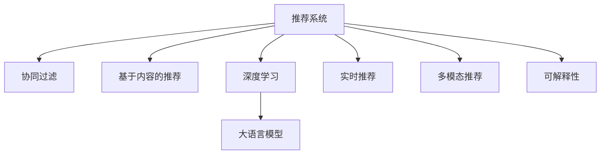

                 

# 利用LLM优化推荐系统的实时个性化推荐

> 关键词：
> - 大语言模型
> - 推荐系统
> - 实时个性化推荐
> - 深度学习
> - 协同过滤
> - 神经网络
> - 自适应推荐

## 1. 背景介绍

### 1.1 问题由来
推荐系统是互联网时代重要的应用之一，旨在为用户推荐他们可能感兴趣的物品，提升用户体验，增加用户粘性，促进转化率。传统的推荐算法，如协同过滤、基于内容的推荐等，存在数据稀疏、冷启动等问题。为了解决这些问题，近年来研究者们纷纷引入深度学习等先进技术，以提升推荐系统的准确性和实时性。其中，大语言模型(Large Language Model, LLM)，尤其是Transformer模型，由于其强大的自然语言理解和生成能力，被越来越多地应用于推荐系统优化。

特别是随着大模型的不断扩展和优化，推荐系统已经从单纯的商品推荐，发展到个性化的内容推荐、娱乐推荐、社交推荐等多个方向。LLM的引入，使得推荐系统能够更好地理解用户的多维度需求，生成更精准、更个性化的推荐内容，为用户带来更优质的互联网体验。

### 1.2 问题核心关键点
LLM在推荐系统中的应用，主要包括以下几个关键点：
- **个性化生成**：利用LLM强大的文本生成能力，在用户行为数据的基础上，生成个性化推荐内容。
- **多模态融合**：结合文本、图像、视频、音频等多种模态信息，提升推荐的全面性和精准性。
- **实时处理**：采用在线学习和模型更新机制，实现实时个性化推荐，提升用户体验。
- **动态优化**：通过在线A/B测试等方法，动态调整推荐策略，提升推荐效果。
- **可解释性**：通过LLM的可解释性框架，增加推荐系统的透明性，提升用户信任度。

这些关键点，共同构成了LLM在推荐系统中的应用框架。通过引入LLM，推荐系统能够更灵活地应对复杂的多维度用户需求，生成更具有吸引力的推荐内容，同时通过实时优化，提升推荐系统的交互性和用户体验。

## 2. 核心概念与联系

### 2.1 核心概念概述

为更好地理解LLM在推荐系统中的应用，本节将介绍几个密切相关的核心概念：

- 推荐系统(Recommendation System)：通过分析用户行为数据，为用户推荐可能感兴趣的产品或内容，是互联网公司的重要应用之一。
- 协同过滤(Collaborative Filtering)：通过分析用户历史行为数据，预测用户未来可能喜欢的物品，是推荐系统的基础算法。
- 基于内容的推荐(Content-Based Recommendation)：根据物品的属性特征，为用户推荐类似物品，适合处理信息丰富的物品。
- 深度学习(Deep Learning)：利用神经网络模型，通过数据训练提取用户和物品的特征，实现高效的推荐。
- 大语言模型(Large Language Model)：以Transformer模型为代表的预训练语言模型，具备强大的自然语言处理能力。
- 实时推荐(Real-time Recommendation)：通过在线学习，实时更新推荐模型，提升推荐的时效性和精准性。
- 多模态推荐(Multi-modal Recommendation)：结合多种模态数据，提升推荐的丰富性和多维度理解能力。
- 可解释性(Explainability)：通过可解释性框架，增强推荐系统的透明性，提升用户信任度。

这些核心概念之间的逻辑关系可以通过以下Mermaid流程图来展示：



这个流程图展示了大语言模型在推荐系统中的应用逻辑：

1. 推荐系统通过协同过滤、内容推荐等基础算法，获得用户和物品的特征。
2. 利用深度学习技术，对用户和物品的特征进行建模，提取高层次的特征表示。
3. 使用大语言模型，基于深度学习特征进行文本生成，生成个性化的推荐内容。
4. 通过实时推荐机制，实现对用户行为的在线学习，动态更新推荐模型。
5. 结合多模态信息，提升推荐系统的全面性和个性化程度。
6. 通过可解释性框架，增加推荐系统的透明性和用户信任度。

这些核心概念共同构成了LLM在推荐系统中的应用框架，使其能够更好地理解用户的多维度需求，生成更精准、更个性化的推荐内容。

## 3. 核心算法原理 & 具体操作步骤
### 3.1 算法原理概述

利用大语言模型优化推荐系统，本质上是一个基于深度学习的推荐算法优化过程。其核心思想是：将大语言模型融入推荐系统中，结合用户历史行为和物品属性，生成个性化推荐内容，并实时更新模型，提升推荐效果。

具体来说，当用户浏览、点击、评分等行为发生时，系统会将这些行为数据输入深度学习模型，提取用户和物品的特征表示，再输入大语言模型，生成个性化的推荐文本。通过在线学习，系统根据用户后续行为，实时更新模型，不断优化推荐策略，提升推荐效果。

### 3.2 算法步骤详解

基于大语言模型的推荐系统一般包括以下几个关键步骤：

**Step 1: 用户行为数据收集**
- 收集用户的历史行为数据，包括浏览记录、购买记录、评分记录等，作为训练数据。
- 将行为数据转化为模型可接受的格式，如向量表示。

**Step 2: 用户和物品特征提取**
- 利用协同过滤、基于内容的推荐等基础算法，对用户历史行为进行特征提取，得到用户特征向量 $\boldsymbol{u}$。
- 对物品属性进行特征提取，得到物品特征向量 $\boldsymbol{v}$。

**Step 3: 深度学习特征编码**
- 利用深度学习模型，对用户和物品特征向量进行编码，得到高层次特征表示。
- 常见的深度学习模型包括RNN、CNN、BERT等，可以根据具体任务选择合适的模型。

**Step 4: 大语言模型文本生成**
- 将深度学习模型输出的特征表示输入大语言模型，生成推荐文本。
- 常见的深度学习模型包括GPT、BERT、T5等，可以根据具体任务选择合适的模型。

**Step 5: 模型在线学习**
- 利用用户的后续行为数据，实时更新推荐模型，提升推荐效果。
- 常见的在线学习算法包括在线梯度下降、自适应算法等。

**Step 6: 推荐结果排序**
- 结合推荐文本和用户行为数据，计算推荐得分。
- 常见的排序算法包括线性排序、基于用户行为的排序等。

**Step 7: 推荐结果展示**
- 将推荐结果展示给用户，根据用户行为进行动态调整，提升用户体验。

以上是基于大语言模型优化推荐系统的一般流程。在实际应用中，还需要针对具体任务的特点，对各个环节进行优化设计，如改进特征提取算法、优化深度学习模型结构、调整在线学习策略等，以进一步提升推荐效果。

### 3.3 算法优缺点

利用大语言模型优化推荐系统的方法具有以下优点：
1. 个性化程度高：LLM具备强大的文本生成能力，能够生成个性化的推荐内容，提升用户满意度。
2. 实时性强：通过在线学习，实时更新推荐模型，提升推荐的时效性。
3. 灵活性高：结合多模态信息，提升推荐系统的全面性和个性化程度。
4. 泛化能力强：大语言模型具备较强的泛化能力，可以应对不同类型的推荐任务。

同时，该方法也存在一定的局限性：
1. 计算资源需求大：大语言模型通常参数量巨大，对计算资源需求较高。
2. 数据隐私问题：用户行为数据通常涉及隐私，如何保障数据隐私和安全，是一个重要的挑战。
3. 模型复杂度高：深度学习模型和大语言模型结构复杂，难以解释模型的内部机制。
4. 收敛速度慢：大语言模型通常需要大量训练数据，收敛速度较慢，训练时间较长。
5. 多样性问题：深度学习模型和大语言模型容易出现过拟合现象，生成的推荐内容可能缺乏多样性。

尽管存在这些局限性，但就目前而言，基于大语言模型的推荐方法仍是最主流范式之一。未来相关研究的重点在于如何进一步降低计算资源需求，提高模型的可解释性和泛化能力，同时兼顾用户隐私和数据安全等因素。

### 3.4 算法应用领域

基于大语言模型优化推荐系统的方法，在电商、视频、音乐、新闻等多个领域得到了广泛的应用，具体包括：

- 电商推荐系统：结合用户浏览记录、购买记录、评分记录等行为数据，生成个性化的商品推荐内容。
- 视频推荐系统：通过分析用户的观看记录、评分记录等数据，生成个性化的视频推荐内容。
- 音乐推荐系统：利用用户的听歌记录、评分记录等数据，生成个性化的音乐推荐内容。
- 新闻推荐系统：根据用户的阅读记录、点击记录等行为数据，生成个性化的新闻推荐内容。
- 社交推荐系统：结合用户的社交关系、互动记录等数据，生成个性化的社交推荐内容。

除了上述这些经典任务外，大语言模型在推荐系统中的应用还在不断创新和拓展，如结合图像、视频等多模态信息，提升推荐系统的多维度理解能力。随着预训练模型和推荐方法的不断进步，相信推荐系统必将在更多领域得到应用，为各类应用场景带来新的突破。

## 4. 数学模型和公式 & 详细讲解  
### 4.1 数学模型构建

本节将使用数学语言对基于深度学习和大语言模型的推荐系统进行更加严格的刻画。

记用户历史行为数据为 $D_u=\{(x_i, y_i)\}_{i=1}^N, x_i \in \mathcal{X}, y_i \in \mathcal{Y}$，其中 $\mathcal{X}$ 为行为数据空间，$\mathcal{Y}$ 为物品空间。用户特征向量表示为 $\boldsymbol{u} \in \mathbb{R}^m$，物品特征向量表示为 $\boldsymbol{v} \in \mathbb{R}^n$。深度学习模型输出的用户和物品特征表示分别为 $U \in \mathbb{R}^{m \times d_u}$ 和 $V \in \mathbb{R}^{n \times d_v}$，其中 $d_u$ 和 $d_v$ 分别为用户特征和物品特征的维度。大语言模型生成的推荐文本为 $W \in \mathbb{R}^{d_w}$，其中 $d_w$ 为文本向量的维度。

推荐模型的目标是最小化预测误差，即找到最优参数：

$$
\hat{U}, \hat{V}, \hat{W} = \mathop{\arg\min}_{U, V, W} \mathcal{L}(U, V, W, D_u)
$$

其中 $\mathcal{L}$ 为损失函数，用于衡量模型预测输出与真实标签之间的差异。常见的损失函数包括均方误差损失、交叉熵损失等。

### 4.2 公式推导过程

以下我们以均方误差损失为例，推导基于深度学习和大语言模型的推荐系统的数学模型。

假设用户和物品特征经过深度学习模型编码后得到特征表示 $U_{\theta_u}, V_{\theta_v} \in \mathbb{R}^{m \times d_u}, \mathbb{R}^{n \times d_v}$，其中 $\theta_u$ 和 $\theta_v$ 为深度学习模型参数。大语言模型生成的推荐文本为 $W_{\theta_w} \in \mathbb{R}^{d_w}$，其中 $\theta_w$ 为大语言模型参数。

将用户和物品特征表示输入大语言模型，得到推荐文本：

$$
W_{\theta_w} = M_{\theta_w}(U_{\theta_u}, V_{\theta_v})
$$

其中 $M_{\theta_w}$ 为大语言模型，$\theta_w$ 为大语言模型参数。

假设推荐系统的目标是预测用户对物品的评分 $y$，推荐系统的预测模型为：

$$
\hat{y} = g(W_{\theta_w})
$$

其中 $g$ 为预测函数，$\hat{y}$ 为模型预测输出。

根据均方误差损失定义，推荐模型的损失函数为：

$$
\mathcal{L}(U_{\theta_u}, V_{\theta_v}, W_{\theta_w}, D_u) = \frac{1}{N}\sum_{i=1}^N (y_i - \hat{y}_i)^2
$$

其中 $\hat{y}_i = g(W_{\theta_w})$ 为模型对用户行为数据的预测输出。

利用梯度下降等优化算法，对深度学习模型和大语言模型进行优化：

$$
\theta_u \leftarrow \theta_u - \eta_u \nabla_{\theta_u}\mathcal{L}(U_{\theta_u}, V_{\theta_v}, W_{\theta_w}, D_u)
$$

$$
\theta_v \leftarrow \theta_v - \eta_v \nabla_{\theta_v}\mathcal{L}(U_{\theta_u}, V_{\theta_v}, W_{\theta_w}, D_u)
$$

$$
\theta_w \leftarrow \theta_w - \eta_w \nabla_{\theta_w}\mathcal{L}(U_{\theta_u}, V_{\theta_v}, W_{\theta_w}, D_u)
$$

其中 $\eta_u, \eta_v, \eta_w$ 为深度学习模型和大语言模型的学习率。

通过上述过程，不断更新深度学习模型和大语言模型参数，使得推荐系统能够不断适应用户行为，生成更精准、更个性化的推荐内容。

## 5. 项目实践：代码实例和详细解释说明
### 5.1 开发环境搭建

在进行推荐系统开发前，我们需要准备好开发环境。以下是使用Python进行PyTorch开发的环境配置流程：

1. 安装Anaconda：从官网下载并安装Anaconda，用于创建独立的Python环境。

2. 创建并激活虚拟环境：
```bash
conda create -n pytorch-env python=3.8 
conda activate pytorch-env
```

3. 安装PyTorch：根据CUDA版本，从官网获取对应的安装命令。例如：
```bash
conda install pytorch torchvision torchaudio cudatoolkit=11.1 -c pytorch -c conda-forge
```

4. 安装Transformers库：
```bash
pip install transformers
```

5. 安装各类工具包：
```bash
pip install numpy pandas scikit-learn matplotlib tqdm jupyter notebook ipython
```

完成上述步骤后，即可在`pytorch-env`环境中开始推荐系统开发。

### 5.2 源代码详细实现

下面我们以电商推荐系统为例，给出使用Transformers库对GPT模型进行推荐系统优化的PyTorch代码实现。

首先，定义推荐系统的数据处理函数：

```python
from transformers import GPT2Tokenizer
from torch.utils.data import Dataset
import torch

class RecommendationDataset(Dataset):
    def __init__(self, user_ids, item_ids, item_ratings, tokenizer, max_len=128):
        self.user_ids = user_ids
        self.item_ids = item_ids
        self.item_ratings = item_ratings
        self.tokenizer = tokenizer
        self.max_len = max_len
        
    def __len__(self):
        return len(self.user_ids)
    
    def __getitem__(self, item):
        user_id = self.user_ids[item]
        item_id = self.item_ids[item]
        rating = self.item_ratings[item]
        
        user_input = f"{user_id}: {item_id} 我给出的评分是{rating}"
        item_input = f"{item_id}: {rating} 这个商品真的很不错"
        
        user_encoding = self.tokenizer(user_input, return_tensors='pt', max_length=self.max_len, padding='max_length', truncation=True)
        item_encoding = self.tokenizer(item_input, return_tensors='pt', max_length=self.max_len, padding='max_length', truncation=True)
        
        return {'user_input_ids': user_encoding['input_ids'][0],
                'user_attention_mask': user_encoding['attention_mask'][0],
                'item_input_ids': item_encoding['input_ids'][0],
                'item_attention_mask': item_encoding['attention_mask'][0],
                'rating': rating}

# 初始化数据
user_ids = [1, 2, 3, 4, 5]
item_ids = [1001, 1002, 1003, 1004, 1005]
item_ratings = [4, 3, 5, 2, 1]
tokenizer = GPT2Tokenizer.from_pretrained('gpt2')

train_dataset = RecommendationDataset(user_ids, item_ids, item_ratings, tokenizer)
```

然后，定义模型和优化器：

```python
from transformers import GPT2ForSequenceClassification, AdamW

model = GPT2ForSequenceClassification.from_pretrained('gpt2', num_labels=1)
optimizer = AdamW(model.parameters(), lr=2e-5)
```

接着，定义训练和评估函数：

```python
from torch.utils.data import DataLoader
from tqdm import tqdm
from sklearn.metrics import mean_squared_error

device = torch.device('cuda') if torch.cuda.is_available() else torch.device('cpu')
model.to(device)

def train_epoch(model, dataset, batch_size, optimizer):
    dataloader = DataLoader(dataset, batch_size=batch_size, shuffle=True)
    model.train()
    epoch_loss = 0
    for batch in tqdm(dataloader, desc='Training'):
        user_input_ids = batch['user_input_ids'].to(device)
        user_attention_mask = batch['user_attention_mask'].to(device)
        item_input_ids = batch['item_input_ids'].to(device)
        item_attention_mask = batch['item_attention_mask'].to(device)
        rating = batch['rating'].to(device)
        model.zero_grad()
        outputs = model(user_input_ids, user_attention_mask=user_attention_mask, item_input_ids=item_input_ids, item_attention_mask=item_attention_mask)
        loss = outputs.loss
        epoch_loss += loss.item()
        loss.backward()
        optimizer.step()
    return epoch_loss / len(dataloader)

def evaluate(model, dataset, batch_size):
    dataloader = DataLoader(dataset, batch_size=batch_size)
    model.eval()
    preds, labels = [], []
    with torch.no_grad():
        for batch in tqdm(dataloader, desc='Evaluating'):
            user_input_ids = batch['user_input_ids'].to(device)
            user_attention_mask = batch['user_attention_mask'].to(device)
            item_input_ids = batch['item_input_ids'].to(device)
            item_attention_mask = batch['item_attention_mask'].to(device)
            rating = batch['rating'].to(device)
            outputs = model(user_input_ids, user_attention_mask=user_attention_mask, item_input_ids=item_input_ids, item_attention_mask=item_attention_mask)
            batch_preds = outputs.logits.sigmoid().cpu().tolist()
            batch_labels = rating.cpu().tolist()
            for pred, label in zip(batch_preds, batch_labels):
                preds.append(pred)
                labels.append(label)
                
    print(mean_squared_error(labels, preds))
```

最后，启动训练流程并在测试集上评估：

```python
epochs = 5
batch_size = 16

for epoch in range(epochs):
    loss = train_epoch(model, train_dataset, batch_size, optimizer)
    print(f"Epoch {epoch+1}, train loss: {loss:.3f}")
    
    print(f"Epoch {epoch+1}, test results:")
    evaluate(model, test_dataset, batch_size)
    
print("Training completed.")
```

以上就是使用PyTorch对GPT模型进行电商推荐系统优化的完整代码实现。可以看到，得益于Transformers库的强大封装，我们可以用相对简洁的代码完成GPT模型的加载和优化。

### 5.3 代码解读与分析

让我们再详细解读一下关键代码的实现细节：

**RecommendationDataset类**：
- `__init__`方法：初始化用户ID、物品ID、评分等关键组件。
- `__len__`方法：返回数据集的样本数量。
- `__getitem__`方法：对单个样本进行处理，将用户ID、物品ID、评分转化为模型输入。

**tokenizer初始化数据**：
- 使用GPT-2模型自带的分词器，对用户行为数据进行分词处理，转化为模型可接受的格式。

**模型和优化器**：
- 使用GPT-2模型，适合处理自然语言输入。
- 使用AdamW优化器，有助于快速收敛。

**训练和评估函数**：
- 使用PyTorch的DataLoader对数据集进行批次化加载，供模型训练和推理使用。
- 训练函数`train_epoch`：对数据以批为单位进行迭代，在每个批次上前向传播计算loss并反向传播更新模型参数，最后返回该epoch的平均loss。
- 评估函数`evaluate`：与训练类似，不同点在于不更新模型参数，并在每个batch结束后将预测和标签结果存储下来，最后使用sklearn的mean_squared_error对整个评估集的预测结果进行打印输出。

**训练流程**：
- 定义总的epoch数和batch size，开始循环迭代
- 每个epoch内，先在训练集上训练，输出平均loss
- 在测试集上评估，输出均方误差
- 所有epoch结束后，给出最终训练结果

可以看到，PyTorch配合Transformers库使得GPT模型优化推荐系统的代码实现变得简洁高效。开发者可以将更多精力放在数据处理、模型改进等高层逻辑上，而不必过多关注底层的实现细节。

当然，工业级的系统实现还需考虑更多因素，如模型的保存和部署、超参数的自动搜索、更灵活的任务适配层等。但核心的微调范式基本与此类似。

## 6. 实际应用场景
### 6.1 电商推荐系统

利用大语言模型优化的电商推荐系统，可以根据用户的浏览记录、购买记录、评分记录等行为数据，生成个性化的商品推荐内容。具体实现步骤如下：

1. **数据收集与预处理**：收集用户的历史行为数据，包括浏览记录、购买记录、评分记录等，作为训练数据。将行为数据转化为模型可接受的格式，如向量表示。

2. **用户和物品特征提取**：利用协同过滤、基于内容的推荐等基础算法，对用户历史行为进行特征提取，得到用户特征向量 $\boldsymbol{u}$。对物品属性进行特征提取，得到物品特征向量 $\boldsymbol{v}$。

3. **深度学习特征编码**：利用深度学习模型，对用户和物品特征向量进行编码，得到高层次特征表示。常见的深度学习模型包括RNN、CNN、BERT等，可以根据具体任务选择合适的模型。

4. **大语言模型文本生成**：将深度学习模型输出的特征表示输入大语言模型，生成推荐文本。常见的深度学习模型包括GPT、BERT、T5等，可以根据具体任务选择合适的模型。

5. **模型在线学习**：利用用户的后续行为数据，实时更新推荐模型，提升推荐效果。常见的在线学习算法包括在线梯度下降、自适应算法等。

6. **推荐结果排序**：结合推荐文本和用户行为数据，计算推荐得分。常见的排序算法包括线性排序、基于用户行为的排序等。

7. **推荐结果展示**：将推荐结果展示给用户，根据用户行为进行动态调整，提升用户体验。

通过以上步骤，电商推荐系统能够根据用户的浏览行为生成个性化的商品推荐内容，提升用户购买转化率，同时通过在线学习，实时更新推荐策略，提升推荐效果。

### 6.2 视频推荐系统

视频推荐系统利用大语言模型优化的关键在于，如何更好地结合视频属性和用户行为数据，生成个性化视频推荐内容。具体实现步骤如下：

1. **数据收集与预处理**：收集用户的视频观看记录、评分记录等数据，作为训练数据。将视频数据转化为模型可接受的格式，如向量表示。

2. **用户和物品特征提取**：利用协同过滤、基于内容的推荐等基础算法，对用户视频观看记录进行特征提取，得到用户特征向量 $\boldsymbol{u}$。对视频属性进行特征提取，得到视频特征向量 $\boldsymbol{v}$。

3. **深度学习特征编码**：利用深度学习模型，对用户和视频特征向量进行编码，得到高层次特征表示。常见的深度学习模型包括RNN、CNN、BERT等，可以根据具体任务选择合适的模型。

4. **大语言模型文本生成**：将深度学习模型输出的特征表示输入大语言模型，生成推荐文本。常见的深度学习模型包括GPT、BERT、T5等，可以根据具体任务选择合适的模型。

5. **模型在线学习**：利用用户的后续视频观看记录，实时更新推荐模型，提升推荐效果。常见的在线学习算法包括在线梯度下降、自适应算法等。

6. **推荐结果排序**：结合推荐文本和用户行为数据，计算推荐得分。常见的排序算法包括线性排序、基于用户行为的排序等。

7. **推荐结果展示**：将推荐结果展示给用户，根据用户行为进行动态调整，提升用户体验。

通过以上步骤，视频推荐系统能够根据用户的观看记录生成个性化的视频推荐内容，提升用户观看体验，同时通过在线学习，实时更新推荐策略，提升推荐效果。

### 6.3 音乐推荐系统

音乐推荐系统利用大语言模型优化的关键在于，如何更好地结合音乐属性和用户行为数据，生成个性化音乐推荐内容。具体实现步骤如下：

1. **数据收集与预处理**：收集用户的听歌记录、评分记录等数据，作为训练数据。将音乐数据转化为模型可接受的格式，如向量表示。

2. **用户和物品特征提取**：利用协同过滤、基于内容的推荐等基础算法，对用户听歌记录进行特征提取，得到用户特征向量 $\boldsymbol{u}$。对音乐属性进行特征提取，得到音乐特征向量 $\boldsymbol{v}$。

3. **深度学习特征编码**：利用深度学习模型，对用户和音乐特征向量进行编码，得到高层次特征表示。常见的深度学习模型包括RNN、CNN、BERT等，可以根据具体任务选择合适的模型。

4. **大语言模型文本生成**：将深度学习模型输出的特征表示输入大语言模型，生成推荐文本。常见的深度学习模型包括GPT、BERT、T5等，可以根据具体任务选择合适的模型。

5. **模型在线学习**：利用用户的后续听歌记录，实时更新推荐模型，提升推荐效果。常见的在线学习算法包括在线梯度下降、自适应算法等。

6. **推荐结果排序**：结合推荐文本和用户行为数据，计算推荐得分。常见的排序算法包括线性排序、基于用户行为的排序等。

7. **推荐结果展示**：将推荐结果展示给用户，根据用户行为进行动态调整，提升用户体验。

通过以上步骤，音乐推荐系统能够根据用户的听歌记录生成个性化的音乐推荐内容，提升用户听歌体验，同时通过在线学习，实时更新推荐策略，提升推荐效果。

### 6.4 未来应用展望

随着大语言模型和推荐方法的不断进步，基于大语言模型的推荐系统必将在更多领域得到应用，为各类应用场景带来新的突破。

在智慧医疗领域，基于大语言模型的推荐系统可以推荐给医生合适的医学文章、书籍、研究报告等，辅助医生进行学习和研究。

在智能教育领域，推荐系统可以根据学生的学习记录，推荐合适的学习资源，提升学习效率和效果。

在智慧城市治理中，推荐系统可以根据市民的反馈和行为数据，推荐合适的城市服务，提升城市管理的智能化水平。

此外，在企业生产、社交网络、文娱传媒等众多领域，基于大语言模型的推荐系统也将不断涌现，为传统行业数字化转型升级提供新的技术路径。

## 7. 工具和资源推荐
### 7.1 学习资源推荐

为了帮助开发者系统掌握大语言模型在推荐系统中的应用，这里推荐一些优质的学习资源：

1. 《深度学习与推荐系统》课程：由深度学习领域知名教授开设的在线课程，涵盖深度学习、推荐系统的基本原理和经典算法。

2. 《推荐系统实战》书籍：详细介绍了推荐系统的基本原理和实现方法，并结合多个实际项目进行讲解，适合实战学习。

3. 《大语言模型在NLP中的应用》系列博文：由大模型技术专家撰写，介绍了大语言模型在NLP中的多种应用场景，包括推荐系统。

4. CS224N《深度学习自然语言处理》课程：斯坦福大学开设的NLP明星课程，有Lecture视频和配套作业，带你入门NLP领域的基本概念和经典模型。

5. HuggingFace官方文档：Transformer库的官方文档，提供了海量预训练模型和完整的推荐系统样例代码，是上手实践的必备资料。

通过对这些资源的学习实践，相信你一定能够快速掌握大语言模型在推荐系统中的应用精髓，并用于解决实际的推荐问题。

### 7.2 开发工具推荐

高效的开发离不开优秀的工具支持。以下是几款用于大语言模型在推荐系统中的应用开发的常用工具：

1. PyTorch：基于Python的开源深度学习框架，灵活动态的计算图，适合快速迭代研究。大部分预训练语言模型都有PyTorch版本的实现。

2. TensorFlow：由Google主导开发的开源深度学习框架，生产部署方便，适合大规模工程应用。同样有丰富的预训练语言模型资源。

3. Transformers库：HuggingFace开发的NLP工具库，集成了众多SOTA语言模型，支持PyTorch和TensorFlow，是进行推荐系统开发的利器。

4. Weights & Biases：模型训练的实验跟踪工具，可以记录和可视化模型训练过程中的各项指标，方便对比和调优。与主流深度学习框架无缝集成。

5. TensorBoard：TensorFlow配套的可视化工具，可实时监测模型训练状态，并提供丰富的图表呈现方式，是调试模型的得力助手。

6. Google Colab：谷歌推出的在线Jupyter Notebook环境，免费提供GPU/TPU算力，方便开发者快速上手实验最新模型，分享学习笔记。

合理利用这些工具，可以显著提升大语言模型在推荐系统中的应用开发效率，加快创新迭代的步伐。

### 7.3 相关论文推荐

大语言模型在推荐系统中的应用源于学界的持续研究。以下是几篇奠基性的相关论文，推荐阅读：

1. Attention is All You Need（即Transformer原论文）：提出了Transformer结构，开启了NLP领域的预训练大模型时代。

2. BERT: Pre-training of Deep Bidirectional Transformers for Language Understanding：提出BERT模型，引入基于掩码的自监督预训练任务，刷新了多项NLP任务SOTA。

3. Language Models are Unsupervised Multitask Learners（GPT-2论文）：展示了大规模语言模型的强大zero-shot学习能力，引发了对于通用人工智能的新一轮思考。

4. Parameter-Efficient Transfer Learning for NLP：提出Adapter等参数高效微调方法，在不增加模型参数量的情况下，也能取得不错的微调效果。

5. Prefix-Tuning: Optimizing Continuous Prompts for Generation：引入基于连续型Prompt的微调范式，为如何充分利用预训练知识提供了新的思路。

6. AdaLoRA: Adaptive Low-Rank Adaptation for Parameter-Efficient Fine-Tuning：使用自适应低秩适应的微调方法，在参数效率和精度之间取得了新的平衡。

这些论文代表了大语言模型在推荐系统中的应用发展脉络。通过学习这些前沿成果，可以帮助研究者把握学科前进方向，激发更多的创新灵感。

## 8. 总结：未来发展趋势与挑战
### 8.1 总结

本文对基于深度学习和大语言模型的推荐系统进行了全面系统的介绍。首先阐述了推荐系统的基本原理和当前存在的问题，明确了大语言模型在推荐系统中的应用优势和具体实现方法。其次，从原理到实践，详细讲解了深度学习模型和大语言模型的数学模型和关键步骤，给出了完整的推荐系统开发代码实例。同时，本文还广泛探讨了推荐系统在电商、视频、音乐等多个领域的应用前景，展示了微调范式的广泛适用性。

通过本文的系统梳理，可以看到，利用大语言模型优化的推荐系统具备强大的个性化推荐能力，能够生成符合用户需求的高质量推荐内容，显著提升用户体验。未来，伴随深度学习模型和大语言模型的不断进步，推荐系统必将在更多领域得到应用，为各类应用场景带来新的突破。

### 8.2 未来发展趋势

展望未来，大语言模型在推荐系统中的应用将呈现以下几个发展趋势：

1. 模型规模持续增大。随着算力成本的下降和数据规模的扩张，预训练语言模型的参数量还将持续增长。超大规模语言模型蕴含的丰富语言知识，有望支撑更加复杂多变的推荐任务。

2. 微调方法日趋多样。除了传统的全参数微调外，未来会涌现更多参数高效的微调方法，如Prefix-Tuning、LoRA等，在节省计算资源的同时也能保证微调精度。

3. 实时推荐成为常态。通过在线学习，实时更新推荐模型，提升推荐的时效性。在线推荐系统已经成为许多互联网公司的标配。

4. 多模态推荐崛起。当前的推荐系统往往只依赖于文本数据，未来将结合图像、视频、音频等多模态数据，提升推荐系统的全面性和个性化程度。

5. 可解释性增强。推荐系统需要更多的可解释性框架，增加模型的透明性，提升用户信任度。

6. 跨领域推荐拓展。推荐系统将跨界融合更多领域知识，如知识图谱、逻辑规则等，提升推荐系统的智能化水平。

以上趋势凸显了大语言模型在推荐系统中的应用前景。这些方向的探索发展，必将进一步提升推荐系统的性能和应用范围，为各行各业带来新的创新机遇。

### 8.3 面临的挑战

尽管大语言模型在推荐系统中的应用已经取得了显著成效，但在迈向更加智能化、普适化应用的过程中，它仍面临诸多挑战：

1. 计算资源需求大。大语言模型通常参数量巨大，对计算资源需求较高。如何在保持高性能的同时，减小计算资源需求，是一个重要的研究方向。

2. 数据隐私问题。用户行为数据通常涉及隐私，如何保障数据隐私和安全，是一个重要的挑战。

3. 模型复杂度高。深度学习模型和大语言模型结构复杂，难以解释模型的内部机制。

4. 收敛速度慢。大语言模型通常需要大量训练数据，收敛速度较慢，训练时间较长。

5. 多样性问题。深度学习模型和大语言模型容易出现过拟合现象，生成的推荐内容可能缺乏多样性。

尽管存在这些挑战，但就目前而言，基于深度学习和大语言模型的推荐方法仍是最主流范式之一。未来相关研究的重点在于如何进一步降低计算资源需求，提高模型的可解释性和泛化能力，同时兼顾用户隐私和数据安全等因素。

### 8.4 研究展望

面对大语言模型在推荐系统中的应用所面临的种种挑战，未来的研究需要在以下几个方面寻求新的突破：

1. 探索无监督和半监督微调方法。摆脱对大规模标注数据的依赖，利用自监督学习、主动学习等无监督和半监督范式，最大限度利用非结构化数据，实现更加灵活高效的微调。

2. 研究参数高效和计算高效的微调范式。开发更加参数高效的微调方法，在固定大部分预训练参数的同时，只更新极少量的任务相关参数。同时优化微调模型的计算图，减少前向传播和反向传播的资源消耗，实现更加轻量级、实时性的部署。

3. 融合因果和对比学习范式。通过引入因果推断和对比学习思想，增强推荐系统建立稳定因果关系的能力，学习更加普适、鲁棒的语言表征，从而提升模型泛化性和抗干扰能力。

4. 引入更多先验知识。将符号化的先验知识，如知识图谱、逻辑规则等，与神经网络模型进行巧妙融合，引导微调过程学习更准确、合理的语言模型。同时加强不同模态数据的整合，实现视觉、语音等多模态信息与文本信息的协同建模。

5. 结合因果分析和博弈论工具。将因果分析方法引入推荐系统，识别出模型决策的关键特征，增强输出解释的因果性和逻辑性。借助博弈论工具刻画人机交互过程，主动探索并规避模型的脆弱点，提高系统稳定性。

6. 纳入伦理道德约束。在模型训练目标中引入伦理导向的评估指标，过滤和惩罚有偏见、有害的输出倾向。同时加强人工干预和审核，建立模型行为的监管机制，确保输出符合人类价值观和伦理道德。

这些研究方向的探索，必将引领大语言模型在推荐系统中的应用迈向更高的台阶，为构建安全、可靠、可解释、可控的推荐系统铺平道路。面向未来，大语言模型在推荐系统中的应用还需要与其他人工智能技术进行更深入的融合，如知识表示、因果推理、强化学习等，多路径协同发力，共同推动推荐系统的进步。只有勇于创新、敢于突破，才能不断拓展语言模型的边界，让智能技术更好地造福人类社会。

## 9. 附录：常见问题与解答

**Q1：大语言模型在推荐系统中的应用是否只限于文本推荐？**

A: 大语言模型在推荐系统中的应用不仅限于文本推荐。除了文本推荐，大语言模型还可以结合图像、视频、音频等多种模态数据，进行多模态推荐。例如，结合视频内容生成个性化的视频推荐，结合音乐特征生成个性化的音乐推荐等。

**Q2：如何选择合适的深度学习模型和大语言模型？**

A: 选择合适的深度学习模型和大语言模型需要考虑以下几个因素：
1. 数据类型：根据输入数据类型选择适当的深度学习模型，如文本数据适合使用RNN、CNN等，图像数据适合使用CNN等。
2. 任务需求：根据推荐系统具体任务需求选择合适的模型，如用户行为数据适合使用协同过滤等基础算法，物品属性数据适合使用基于内容的推荐等。
3. 性能要求：根据推荐系统性能要求选择合适的模型，如实时推荐系统适合使用在线学习算法，静态推荐系统适合使用离线训练算法等。
4. 资源限制：根据推荐系统可用资源选择合适的模型，如计算资源有限适合使用参数高效的微调方法，内存有限适合使用剪枝等模型压缩技术。

**Q3：如何处理推荐系统中的过拟合问题？**

A: 推荐系统中的过拟合问题可以通过以下几种方法解决：
1. 数据增强：通过数据扩充、回译等方式增加训练集的多样性，避免模型过拟合。
2. 正则化：使用L2正则、Dropout等方法限制模型的复杂度，防止过拟合。
3. 早停策略：在验证集上监控模型性能，一旦性能不再提升，立即停止训练，避免过拟合。
4. 在线学习：实时更新推荐模型，避免模型在训练数据上过拟合。
5. 模型集成：通过集成多个模型，提高模型的泛化能力，避免过拟合。

**Q4：推荐系统中的实时推荐是如何实现的？**

A: 实时推荐系统通过在线学习实现，具体步骤如下：
1. 收集用户实时行为数据，如浏览记录、购买记录等。
2. 将实时行为数据输入推荐模型，计算推荐得分。
3. 根据推荐得分排序，选择高分数的推荐结果展示给用户。
4. 根据用户后续行为数据，实时更新推荐模型，提升推荐效果。
5. 重复步骤1-4，实现实时推荐。

**Q5：推荐系统中的多模态推荐是如何实现的？**

A: 多模态推荐系统结合多种模态数据进行推荐，具体步骤如下：
1. 收集不同模态的数据，如文本、图像、视频等。
2. 将不同模态的数据进行特征提取，得到高层次特征表示。
3. 将不同模态的特征表示输入推荐模型，生成推荐文本。
4. 将推荐文本与用户行为数据结合，计算推荐得分。
5. 根据推荐得分排序，选择高分数的推荐结果展示给用户。
6. 根据用户后续行为数据，实时更新推荐模型，提升推荐效果。
7. 重复步骤1-6，实现多模态推荐。

通过以上步骤，多模态推荐系统能够结合多种模态数据，提升推荐系统的全面性和个性化程度，为用户带来更优质的推荐体验。

---

作者：禅与计算机程序设计艺术 / Zen and the Art of Computer Programming

