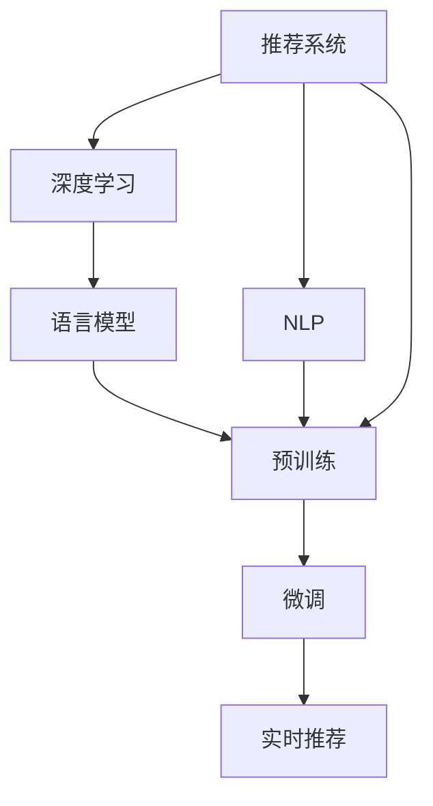

                 

# 利用LLM优化推荐系统的实时个性化重排序

> 关键词：推荐系统, 自然语言处理(NLP), 语言模型, 实时推荐, 深度学习, 自然语言理解, 信息检索

## 1. 背景介绍

随着互联网的蓬勃发展，推荐系统已成为各大电商、媒体、社交网络平台中不可或缺的核心功能。推荐系统通过分析用户的历史行为数据，预测其未来兴趣偏好，从而为用户提供个性化的商品、内容、服务等。目前主流的推荐系统多基于协同过滤、矩阵分解等模型，依赖大量的用户-物品交互数据，难以扩展到大规模多领域的应用场景。

近年来，基于深度学习和大语言模型的推荐系统逐渐崭露头角。相较于传统的统计模型，基于大语言模型(LLM)的推荐系统能够更灵活、高效地处理多模态、跨领域的数据，具有更强的个性化能力和泛化能力。在电商平台上，基于大语言模型的推荐系统已经实现了显著的业务价值，为用户推荐商品、分析市场趋势、挖掘产品潜力等。

在推荐系统设计中，用户输入的查询往往需要经过复杂的检索和匹配过程，才能找到用户感兴趣的内容。通过利用自然语言处理(NLP)技术，我们可以在预训练语言模型(如GPT-3、BERT等)上进行微调，优化推荐系统的检索和排序算法，实现更加精准、高效、个性化的推荐服务。本文将系统介绍如何利用LLM对推荐系统进行实时个性化重排序，并通过代码实例，展示微调过程。

## 2. 核心概念与联系

### 2.1 核心概念概述

为更好地理解利用LLM优化推荐系统的实时个性化重排序，本节将介绍几个关键概念：

- 推荐系统(Recommendation System)：根据用户兴趣和行为，为用户推荐商品、内容、服务等。
- 深度学习(Deep Learning)：基于多层神经网络进行模型训练和预测，具有较强的表达能力和泛化能力。
- 自然语言处理(NLP)：利用语言模型、文本分类、命名实体识别等技术，处理和分析自然语言文本数据。
- 语言模型(Language Model)：通过预测下一个单词或字符的概率分布，学习语言的基本规律和表示。
- 预训练(Pre-training)：在无标签大规模文本数据上进行预训练，学习通用语言表示。
- 微调(Fine-tuning)：利用预训练模型对特定任务进行适配，提升模型在该任务上的性能。
- 实时推荐(Real-time Recommendation)：在用户输入查询时，实时进行推荐生成和排序，实现即时响应。

这些核心概念之间的逻辑关系可以通过以下Mermaid流程图来展示：



这个流程图展示了推荐系统与深度学习、自然语言处理等技术之间的关系：

1. 推荐系统通过深度学习进行模型训练和预测。
2. 自然语言处理技术处理用户输入的自然语言文本。
3. 语言模型通过预训练学习通用的语言表示。
4. 微调技术利用预训练模型对特定任务进行适配，提升模型性能。
5. 实时推荐技术在用户输入查询时，实时进行推荐生成和排序。

## 3. 核心算法原理 & 具体操作步骤
### 3.1 算法原理概述

利用LLM优化推荐系统的实时个性化重排序，本质上是一种基于微调的NLP任务。其核心思想是：将用户查询输入到预训练语言模型中，通过微调模型，获取查询与物品的相似度向量，进而根据相似度进行推荐排序。

具体来说，假设预训练语言模型为 $M_{\theta}$，其中 $\theta$ 为预训练得到的模型参数。给定用户查询 $q$ 和物品集合 $I$，通过微调模型得到物品与查询的相似度向量，并计算相似度得分。根据得分对物品集合进行排序，生成推荐结果。

微调模型的目标函数为：

$$
\mathcal{L}(\theta) = \frac{1}{N}\sum_{i=1}^N \left[\log\sigma(\hat{p}_i)y_i + \log(1-\sigma(\hat{p}_i))(1-y_i)\right]
$$

其中，$\hat{p}_i$ 为物品 $i$ 与查询 $q$ 的相似度得分，$y_i$ 为物品 $i$ 是否为查询 $q$ 的兴趣项的二元标签。

通过梯度下降等优化算法，微调过程不断更新模型参数 $\theta$，最小化损失函数 $\mathcal{L}$，使得模型输出逼近真实标签。由于 $\theta$ 已经通过预训练获得了较好的初始化，因此即便在只有少量标注样本的情况下，也能较快收敛到理想的模型参数。

### 3.2 算法步骤详解

基于LLM优化推荐系统的实时个性化重排序，一般包括以下几个关键步骤：

**Step 1: 准备预训练模型和数据集**
- 选择合适的预训练语言模型 $M_{\theta}$ 作为初始化参数，如 GPT-3、BERT 等。
- 准备推荐系统任务的相关数据集，划分为训练集、验证集和测试集。一般要求标注数据与预训练数据的分布不要差异过大。

**Step 2: 添加任务适配层**
- 根据推荐任务类型，在预训练模型顶层设计合适的输出层和损失函数。
- 对于二分类任务，通常在顶层添加二元交叉熵损失函数。
- 对于多分类任务，通常使用softmax交叉熵损失函数。

**Step 3: 设置微调超参数**
- 选择合适的优化算法及其参数，如 AdamW、SGD 等，设置学习率、批大小、迭代轮数等。
- 设置正则化技术及强度，包括权重衰减、Dropout、Early Stopping 等。
- 确定冻结预训练参数的策略，如仅微调顶层，或全部参数都参与微调。

**Step 4: 执行梯度训练**
- 将训练集数据分批次输入模型，前向传播计算损失函数。
- 反向传播计算参数梯度，根据设定的优化算法和学习率更新模型参数。
- 周期性在验证集上评估模型性能，根据性能指标决定是否触发 Early Stopping。
- 重复上述步骤直到满足预设的迭代轮数或 Early Stopping 条件。

**Step 5: 测试和部署**
- 在测试集上评估微调后模型 $M_{\hat{\theta}}$ 的性能，对比微调前后的精度提升。
- 使用微调后的模型对新用户输入的查询进行实时推荐，集成到实际的应用系统中。
- 持续收集新的用户行为数据，定期重新微调模型，以适应数据分布的变化。

以上是基于LLM优化推荐系统的实时个性化重排序的一般流程。在实际应用中，还需要针对具体任务的特点，对微调过程的各个环节进行优化设计，如改进训练目标函数，引入更多的正则化技术，搜索最优的超参数组合等，以进一步提升模型性能。

### 3.3 算法优缺点

基于LLM的实时个性化推荐系统具有以下优点：

1. 灵活性高。基于LLM的推荐系统能够灵活处理多种数据类型，包括文本、图像、语音等，具有更强的泛化能力。
2. 可解释性强。通过微调模型，可以理解查询与物品之间的语义关系，提供推荐结果的解释性。
3. 个性化能力强。利用LLM的语义表示能力，可以更准确地捕捉用户兴趣，提供更符合预期的推荐内容。
4. 实时性强。通过微调模型，可以在用户输入查询时，实时生成推荐结果，实现即时响应。

但该方法也存在一定的局限性：

1. 对标注数据依赖大。微调的效果很大程度上取决于标注数据的质量和数量，获取高质量标注数据的成本较高。
2. 模型计算资源消耗大。超大批次的训练和推理，需要高性能计算资源支持。
3. 可解释性不足。微调模型通常缺乏可解释性，难以对其推理逻辑进行分析和调试。
4. 数据隐私问题。利用用户查询进行推荐，可能涉及用户隐私，需确保数据的合法合规使用。

尽管存在这些局限性，但就目前而言，基于LLM的实时个性化推荐系统仍是一种高效、实用的解决方案。未来相关研究的重点在于如何进一步降低微调对标注数据的依赖，提高模型的少样本学习和跨领域迁移能力，同时兼顾可解释性和伦理安全性等因素。

### 3.4 算法应用领域

利用LLM的实时个性化推荐系统已经在电商、媒体、社交网络等多个领域得到应用，覆盖了推荐算法设计的各个环节，具体包括：

- 商品推荐：推荐系统通过用户查询，实时生成商品推荐结果。
- 内容推荐：将用户输入的查询与内容库进行匹配，推荐相关文章、视频、图片等。
- 广告推荐：通过分析用户行为和兴趣，精准投放广告。
- 音乐推荐：利用用户查询和评论数据，推荐相似的音乐作品。
- 视频推荐：将用户查询与视频内容进行匹配，推荐相关视频片段或频道。
- 新闻推荐：根据用户查询，推荐相关新闻报道或文章。
- 活动推荐：根据用户查询，推荐相关线上线下活动。

除了这些常见任务外，利用LLM的推荐系统还在搜索排名、智能客服、健康咨询等领域展现出了巨大潜力。未来随着LLM技术的不断发展，推荐系统有望在更多场景中大放异彩，成为互联网服务的重要支柱。

## 4. 数学模型和公式 & 详细讲解
### 4.1 数学模型构建

假设用户查询为 $q$，物品集合为 $I$。我们通过微调模型 $M_{\theta}$ 对用户查询进行编码，得到查询向量 $\boldsymbol{q} \in \mathbb{R}^{d}$，其中 $d$ 为模型输出维度。同样地，我们通过微调模型对物品进行编码，得到物品向量 $\boldsymbol{i} \in \mathbb{R}^{d}$，$i \in I$。

推荐系统模型的目标是通过相似度计算，判断物品与查询的兴趣匹配度，生成推荐结果。具体地，我们定义物品 $i$ 与查询 $q$ 的相似度得分 $\hat{p}_i$ 为：

$$
\hat{p}_i = \text{softmax}(\boldsymbol{q}^\top\boldsymbol{i})
$$

其中，$\text{softmax}$ 函数将向量 $\boldsymbol{q}$ 和 $\boldsymbol{i}$ 的对应元素相乘后取对数，通过归一化得到概率分布。最终的推荐结果 $\hat{y}_i$ 为：

$$
\hat{y}_i = \sigma(\hat{p}_i)
$$

其中，$\sigma$ 为 sigmoid 函数，将得分 $\hat{p}_i$ 映射到 $[0,1]$ 范围内的二元标签，表示物品 $i$ 是否为查询 $q$ 的兴趣项。

推荐系统的目标函数为：

$$
\mathcal{L}(\theta) = \frac{1}{N}\sum_{i=1}^N \left[\log\sigma(\hat{p}_i)y_i + \log(1-\sigma(\hat{p}_i))(1-y_i)\right]
$$

其中，$y_i$ 为物品 $i$ 是否为查询 $q$ 的兴趣项的二元标签。

通过梯度下降等优化算法，微调过程不断更新模型参数 $\theta$，最小化损失函数 $\mathcal{L}$，使得模型输出逼近真实标签。由于 $\theta$ 已经通过预训练获得了较好的初始化，因此即便在只有少量标注样本的情况下，也能较快收敛到理想的模型参数。

### 4.2 公式推导过程

以下是推荐系统模型的详细推导过程。

假设用户查询 $q$ 的编码向量为 $\boldsymbol{q} \in \mathbb{R}^{d}$，物品 $i$ 的编码向量为 $\boldsymbol{i} \in \mathbb{R}^{d}$。定义物品 $i$ 与查询 $q$ 的相似度得分 $\hat{p}_i$ 为：

$$
\hat{p}_i = \frac{\exp(\boldsymbol{q}^\top\boldsymbol{i})}{\sum_{j=1}^N \exp(\boldsymbol{q}^\top\boldsymbol{j})}
$$

其中，$\exp$ 函数将向量 $\boldsymbol{q}$ 和 $\boldsymbol{i}$ 的对应元素相乘后取指数，通过归一化得到概率分布。最终的推荐结果 $\hat{y}_i$ 为：

$$
\hat{y}_i = \sigma(\hat{p}_i)
$$

其中，$\sigma$ 为 sigmoid 函数，将得分 $\hat{p}_i$ 映射到 $[0,1]$ 范围内的二元标签，表示物品 $i$ 是否为查询 $q$ 的兴趣项。

推荐系统的目标函数为：

$$
\mathcal{L}(\theta) = \frac{1}{N}\sum_{i=1}^N \left[\log\sigma(\hat{p}_i)y_i + \log(1-\sigma(\hat{p}_i))(1-y_i)\right]
$$

其中，$y_i$ 为物品 $i$ 是否为查询 $q$ 的兴趣项的二元标签。

通过梯度下降等优化算法，微调过程不断更新模型参数 $\theta$，最小化损失函数 $\mathcal{L}$，使得模型输出逼近真实标签。由于 $\theta$ 已经通过预训练获得了较好的初始化，因此即便在只有少量标注样本的情况下，也能较快收敛到理想的模型参数。

## 5. 项目实践：代码实例和详细解释说明
### 5.1 开发环境搭建

在进行推荐系统微调实践前，我们需要准备好开发环境。以下是使用Python进行PyTorch开发的环境配置流程：

1. 安装Anaconda：从官网下载并安装Anaconda，用于创建独立的Python环境。

2. 创建并激活虚拟环境：
```bash
conda create -n pytorch-env python=3.8 
conda activate pytorch-env
```

3. 安装PyTorch：根据CUDA版本，从官网获取对应的安装命令。例如：
```bash
conda install pytorch torchvision torchaudio cudatoolkit=11.1 -c pytorch -c conda-forge
```

4. 安装Transformers库：
```bash
pip install transformers
```

5. 安装各类工具包：
```bash
pip install numpy pandas scikit-learn matplotlib tqdm jupyter notebook ipython
```

完成上述步骤后，即可在`pytorch-env`环境中开始推荐系统微调实践。

### 5.2 源代码详细实现

下面我们以利用GPT-3对电商商品推荐系统进行微调的PyTorch代码实现为例。

首先，定义推荐系统任务的数据处理函数：

```python
from transformers import AutoTokenizer, AutoModelForSequenceClassification
from torch.utils.data import Dataset, DataLoader
import torch

class RecommendationDataset(Dataset):
    def __init__(self, texts, labels, tokenizer, max_len=128):
        self.texts = texts
        self.labels = labels
        self.tokenizer = tokenizer
        self.max_len = max_len
        
    def __len__(self):
        return len(self.texts)
    
    def __getitem__(self, item):
        text = self.texts[item]
        label = self.labels[item]
        
        encoding = self.tokenizer(text, return_tensors='pt', max_length=self.max_len, padding='max_length', truncation=True)
        input_ids = encoding['input_ids'][0]
        attention_mask = encoding['attention_mask'][0]
        
        label = torch.tensor(label, dtype=torch.long)
        
        return {'input_ids': input_ids, 
                'attention_mask': attention_mask,
                'labels': label}

# 加载GPT-3模型
model = AutoModelForSequenceClassification.from_pretrained('gpt3-medium', num_labels=2)

# 定义标签与id的映射
label2id = {1: 1, 0: 0}
id2label = {1: 'positive', 0: 'negative'}

# 创建dataset
tokenizer = AutoTokenizer.from_pretrained('gpt3-medium')

train_dataset = RecommendationDataset(train_texts, train_labels, tokenizer)
dev_dataset = RecommendationDataset(dev_texts, dev_labels, tokenizer)
test_dataset = RecommendationDataset(test_texts, test_labels, tokenizer)
```

然后，定义模型和优化器：

```python
from transformers import AdamW

optimizer = AdamW(model.parameters(), lr=2e-5)
```

接着，定义训练和评估函数：

```python
from tqdm import tqdm
from sklearn.metrics import classification_report

device = torch.device('cuda') if torch.cuda.is_available() else torch.device('cpu')
model.to(device)

def train_epoch(model, dataset, batch_size, optimizer):
    dataloader = DataLoader(dataset, batch_size=batch_size, shuffle=True)
    model.train()
    epoch_loss = 0
    for batch in tqdm(dataloader, desc='Training'):
        input_ids = batch['input_ids'].to(device)
        attention_mask = batch['attention_mask'].to(device)
        labels = batch['labels'].to(device)
        model.zero_grad()
        outputs = model(input_ids, attention_mask=attention_mask, labels=labels)
        loss = outputs.loss
        epoch_loss += loss.item()
        loss.backward()
        optimizer.step()
    return epoch_loss / len(dataloader)

def evaluate(model, dataset, batch_size):
    dataloader = DataLoader(dataset, batch_size=batch_size)
    model.eval()
    preds, labels = [], []
    with torch.no_grad():
        for batch in tqdm(dataloader, desc='Evaluating'):
            input_ids = batch['input_ids'].to(device)
            attention_mask = batch['attention_mask'].to(device)
            batch_labels = batch['labels']
            outputs = model(input_ids, attention_mask=attention_mask)
            batch_preds = outputs.logits.argmax(dim=2).to('cpu').tolist()
            batch_labels = batch_labels.to('cpu').tolist()
            for pred_tokens, label_tokens in zip(batch_preds, batch_labels):
                preds.append(pred_tokens[:len(label_tokens)])
                labels.append(label_tokens)
                
    print(classification_report(labels, preds))
```

最后，启动训练流程并在测试集上评估：

```python
epochs = 5
batch_size = 16

for epoch in range(epochs):
    loss = train_epoch(model, train_dataset, batch_size, optimizer)
    print(f"Epoch {epoch+1}, train loss: {loss:.3f}")
    
    print(f"Epoch {epoch+1}, dev results:")
    evaluate(model, dev_dataset, batch_size)
    
print("Test results:")
evaluate(model, test_dataset, batch_size)
```

以上就是利用GPT-3对电商商品推荐系统进行微调的完整代码实现。可以看到，得益于Transformers库的强大封装，我们可以用相对简洁的代码完成GPT-3模型的加载和微调。

### 5.3 代码解读与分析

让我们再详细解读一下关键代码的实现细节：

**RecommendationDataset类**：
- `__init__`方法：初始化文本、标签、分词器等关键组件。
- `__len__`方法：返回数据集的样本数量。
- `__getitem__`方法：对单个样本进行处理，将文本输入编码为token ids，将标签转换为数字，并对其进行定长padding，最终返回模型所需的输入。

**标签与id的映射**：
- 定义了标签与数字id之间的映射关系，用于将token-wise的预测结果解码回真实的标签。

**训练和评估函数**：
- 使用PyTorch的DataLoader对数据集进行批次化加载，供模型训练和推理使用。
- 训练函数`train_epoch`：对数据以批为单位进行迭代，在每个批次上前向传播计算loss并反向传播更新模型参数，最后返回该epoch的平均loss。
- 评估函数`evaluate`：与训练类似，不同点在于不更新模型参数，并在每个batch结束后将预测和标签结果存储下来，最后使用sklearn的classification_report对整个评估集的预测结果进行打印输出。

**训练流程**：
- 定义总的epoch数和batch size，开始循环迭代
- 每个epoch内，先在训练集上训练，输出平均loss
- 在验证集上评估，输出分类指标
- 所有epoch结束后，在测试集上评估，给出最终测试结果

可以看到，PyTorch配合Transformers库使得GPT-3微调的代码实现变得简洁高效。开发者可以将更多精力放在数据处理、模型改进等高层逻辑上，而不必过多关注底层的实现细节。

当然，工业级的系统实现还需考虑更多因素，如模型的保存和部署、超参数的自动搜索、更灵活的任务适配层等。但核心的微调范式基本与此类似。

## 6. 实际应用场景
### 6.1 智能推荐引擎

利用基于LLM的实时个性化推荐系统，可以广泛应用于智能推荐引擎的设计和实现。传统推荐引擎依赖用户的历史行为数据进行推荐生成，难以捕捉用户未交互场景下的兴趣。而利用LLM进行微调，可以更灵活地处理用户输入的自然语言查询，通过语义理解进行推荐生成，提升推荐系统的个性化能力。

在技术实现上，可以收集用户输入的搜索关键词、评论文本等自然语言数据，将查询和评论作为微调数据，训练模型学习查询-物品的语义关联。微调后的模型能够根据用户输入的查询，动态生成物品推荐列表，实现实时个性化推荐。

### 6.2 电商个性化推荐

在电商平台上，利用LLM进行微调，可以显著提升商品推荐的精准性和个性化程度。传统推荐系统多依赖用户的历史行为数据进行推荐，难以捕捉新用户或长尾商品的兴趣。而利用LLM进行微调，可以在用户输入查询时，根据语义理解进行推荐生成，从而提高推荐效果。

具体来说，电商平台可以通过以下方式利用LLM进行微调：
- 收集用户输入的搜索关键词、评论文本、商品描述等自然语言数据。
- 将查询和商品描述作为微调数据，训练模型学习查询-商品之间的语义关联。
- 在用户输入查询时，利用微调后的模型实时生成商品推荐列表，提升用户购物体验。

### 6.3 新闻内容推荐

新闻内容推荐是利用LLM进行微调的重要应用场景。传统新闻推荐系统依赖用户的历史浏览记录进行推荐，难以捕捉用户未浏览过的新闻内容。而利用LLM进行微调，可以根据用户输入的标题或摘要，动态生成新闻推荐列表，提升推荐效果。

具体来说，新闻平台可以通过以下方式利用LLM进行微调：
- 收集用户输入的新闻标题、摘要等自然语言数据。
- 将标题或摘要作为微调数据，训练模型学习标题-新闻内容之间的语义关联。
- 在用户输入标题时，利用微调后的模型实时生成新闻推荐列表，提升用户阅读体验。

### 6.4 未来应用展望

随着LLM技术的不断发展，基于LLM的实时个性化推荐系统将在更多领域得到应用，为各行各业带来变革性影响。

在智慧医疗领域，基于LLM的医疗推荐系统可以推荐个性化治疗方案，分析医学文献，提升医疗服务水平。

在智能教育领域，LLM推荐系统可以推荐个性化学习内容，提供智能辅助学习，提高教育质量。

在智慧城市治理中，利用LLM进行实时推荐，可以实现精准投放广告，优化城市管理，提升城市治理水平。

此外，在企业生产、社会治理、文娱传媒等众多领域，基于LLM的推荐系统也将不断涌现，为经济社会发展注入新的动力。相信随着技术的日益成熟，利用LLM进行推荐系统的微调方法必将在构建人机协同的智能时代中扮演越来越重要的角色。

## 7. 工具和资源推荐
### 7.1 学习资源推荐

为了帮助开发者系统掌握基于LLM的推荐系统的理论基础和实践技巧，这里推荐一些优质的学习资源：

1. 《深度学习推荐系统》系列博文：由大模型技术专家撰写，深入浅出地介绍了推荐系统的理论基础和经典模型。

2. CS346《推荐系统》课程：斯坦福大学开设的推荐系统课程，涵盖了推荐系统的经典理论和算法。

3. 《Recommender Systems in Production》书籍：推荐系统的经典教材，系统讲解了推荐系统在实际工程中的应用。

4. Kaggle推荐系统竞赛：Kaggle平台举办的推荐系统竞赛，可以学习和实践推荐系统的最新进展和工程优化。

5. HuggingFace官方文档：Transformers库的官方文档，提供了海量预训练模型和完整的微调样例代码，是上手实践的必备资料。

通过对这些资源的学习实践，相信你一定能够快速掌握基于LLM的推荐系统的精髓，并用于解决实际的推荐问题。
###  7.2 开发工具推荐

高效的开发离不开优秀的工具支持。以下是几款用于LLM推荐系统微调开发的常用工具：

1. PyTorch：基于Python的开源深度学习框架，灵活动态的计算图，适合快速迭代研究。大部分预训练语言模型都有PyTorch版本的实现。

2. TensorFlow：由Google主导开发的开源深度学习框架，生产部署方便，适合大规模工程应用。同样有丰富的预训练语言模型资源。

3. Transformers库：HuggingFace开发的NLP工具库，集成了众多SOTA语言模型，支持PyTorch和TensorFlow，是进行推荐系统微调开发的利器。

4. Weights & Biases：模型训练的实验跟踪工具，可以记录和可视化模型训练过程中的各项指标，方便对比和调优。与主流深度学习框架无缝集成。

5. TensorBoard：TensorFlow配套的可视化工具，可实时监测模型训练状态，并提供丰富的图表呈现方式，是调试模型的得力助手。

6. Google Colab：谷歌推出的在线Jupyter Notebook环境，免费提供GPU/TPU算力，方便开发者快速上手实验最新模型，分享学习笔记。

合理利用这些工具，可以显著提升LLM推荐系统微调任务的开发效率，加快创新迭代的步伐。

### 7.3 相关论文推荐

LLM技术的发展源于学界的持续研究。以下是几篇奠基性的相关论文，推荐阅读：

1. Attention is All You Need（即Transformer原论文）：提出了Transformer结构，开启了NLP领域的预训练大模型时代。

2. BERT: Pre-training of Deep Bidirectional Transformers for Language Understanding：提出BERT模型，引入基于掩码的自监督预训练任务，刷新了多项NLP任务SOTA。

3. Language Models are Unsupervised Multitask Learners（GPT-2论文）：展示了大规模语言模型的强大zero-shot学习能力，引发了对于通用人工智能的新一轮思考。

4. Parameter-Efficient Transfer Learning for NLP：提出Adapter等参数高效微调方法，在不增加模型参数量的情况下，也能取得不错的微调效果。

5. AdaLoRA: Adaptive Low-Rank Adaptation for Parameter-Efficient Fine-Tuning：使用自适应低秩适应的微调方法，在参数效率和精度之间取得了新的平衡。

这些论文代表了大语言模型微调技术的发展脉络。通过学习这些前沿成果，可以帮助研究者把握学科前进方向，激发更多的创新灵感。

## 8. 总结：未来发展趋势与挑战

### 8.1 总结

本文对基于LLM的推荐系统进行实时个性化重排序的方法进行了全面系统的介绍。首先阐述了LLM和微调技术的研究背景和意义，明确了微调在提升推荐系统个性化和实时性方面的独特价值。其次，从原理到实践，详细讲解了LLM微调的理论基础和实现细节，给出了微调过程的代码实例。同时，本文还广泛探讨了LLM在电商、新闻、医疗等多个领域的应用前景，展示了微调技术的巨大潜力。此外，本文精选了微调技术的各类学习资源，力求为读者提供全方位的技术指引。

通过本文的系统梳理，可以看到，基于LLM的推荐系统已经在推荐算法设计、模型训练和推荐排序等多个环节展现出卓越性能。受益于深度学习和大语言模型的强大表达能力，推荐系统有望在更广泛的场景中落地应用，为互联网服务带来革命性变革。

### 8.2 未来发展趋势

展望未来，LLM微调技术将呈现以下几个发展趋势：

1. 模型规模持续增大。随着算力成本的下降和数据规模的扩张，预训练语言模型的参数量还将持续增长。超大规模语言模型蕴含的丰富语言知识，有望支撑更加复杂多变的推荐任务微调。

2. 推荐算法更加多样化。除了传统的协同过滤、矩阵分解等方法外，未来将涌现更多基于LLM的推荐算法，如基于语义理解的推荐、基于知识图谱的推荐等，提升推荐系统的智能化和个性化能力。

3. 推荐系统的实时性增强。LLM微调技术能够实时处理用户输入的查询，动态生成推荐结果，提升推荐系统的响应速度和用户体验。

4. 推荐系统的可解释性提升。通过语义理解，推荐系统可以提供推荐结果的详细解释，帮助用户理解推荐依据，增强推荐系统的可信度。

5. 推荐系统的跨领域能力增强。LLM微调技术能够跨领域进行迁移学习，提升推荐系统在不同场景下的泛化能力。

以上趋势凸显了基于LLM的推荐系统的广阔前景。这些方向的探索发展，必将进一步提升推荐系统的性能和应用范围，为互联网服务带来更深远的变革。

### 8.3 面临的挑战

尽管基于LLM的推荐系统已经取得了瞩目成就，但在迈向更加智能化、普适化应用的过程中，它仍面临着诸多挑战：

1. 数据质量和数量问题。推荐系统依赖用户历史行为数据进行训练，数据质量不佳或数量不足会导致推荐效果不理想。如何获取高质量标注数据，成为制约推荐系统性能的关键问题。

2. 计算资源消耗大。超大批次的训练和推理，需要高性能计算资源支持。如何在保证性能的同时，优化计算资源使用，是推荐系统微调的重要课题。

3. 可解释性不足。基于LLM的推荐系统通常缺乏可解释性，难以对其推理逻辑进行分析和调试。如何赋予推荐系统更强的可解释性，将是亟待攻克的难题。

4. 数据隐私问题。利用用户输入进行推荐，可能涉及用户隐私，需确保数据的合法合规使用。如何在保护隐私的同时，提供精准推荐，是推荐系统微调的重要挑战。

5. 系统鲁棒性问题。推荐系统可能面临数据噪声、用户输入变化等干扰，需确保系统的鲁棒性和稳定性。如何提升推荐系统的抗干扰能力，是推荐系统微调的重要研究方向。

尽管存在这些挑战，但就目前而言，基于LLM的实时个性化推荐系统仍是一种高效、实用的解决方案。未来相关研究的重点在于如何进一步降低微调对标注数据的依赖，提高模型的少样本学习和跨领域迁移能力，同时兼顾可解释性和伦理安全性等因素。

### 8.4 未来突破

面对LLM推荐系统微调所面临的种种挑战，未来的研究需要在以下几个方面寻求新的突破：

1. 探索无监督和半监督微调方法。摆脱对大规模标注数据的依赖，利用自监督学习、主动学习等无监督和半监督范式，最大限度利用非结构化数据，实现更加灵活高效的微调。

2. 研究参数高效和计算高效的微调范式。开发更加参数高效的微调方法，在固定大部分预训练参数的同时，只更新极少量的任务相关参数。同时优化微调模型的计算图，减少前向传播和反向传播的资源消耗，实现更加轻量级、实时性的部署。

3. 融合因果和对比学习范式。通过引入因果推断和对比学习思想，增强推荐系统建立稳定因果关系的能力，学习更加普适、鲁棒的语言表征，从而提升推荐系统泛化性和抗干扰能力。

4. 引入更多先验知识。将符号化的先验知识，如知识图谱、逻辑规则等，与神经网络模型进行巧妙融合，引导微调过程学习更准确、合理的语言模型。同时加强不同模态数据的整合，实现视觉、语音等多模态信息与文本信息的协同建模。

5. 结合因果分析和博弈论工具。将因果分析方法引入推荐系统，识别出推荐过程的关键特征，增强推荐结果的因果性和逻辑性。借助博弈论工具刻画人机交互过程，主动探索并规避推荐系统的脆弱点，提高系统稳定性。

6. 纳入伦理道德约束。在推荐系统训练目标中引入伦理导向的评估指标，过滤和惩罚有偏见、有害的输出倾向。同时加强人工干预和审核，建立推荐系统行为的监管机制，确保输出符合人类价值观和伦理道德。

这些研究方向的探索，必将引领基于LLM的推荐系统微调技术迈向更高的台阶，为构建安全、可靠、可解释、可控的智能推荐系统铺平道路。面向未来，大语言模型微调技术还需要与其他人工智能技术进行更深入的融合，如知识表示、因果推理、强化学习等，多路径协同发力，共同推动推荐系统技术的进步。只有勇于创新、敢于突破，才能不断拓展推荐系统的边界，让智能技术更好地造福人类社会。

## 9. 附录：常见问题与解答

**Q1：大语言模型微调是否适用于所有推荐系统任务？**

A: 大语言模型微调在大多数推荐系统任务上都能取得不错的效果，特别是对于数据量较小的任务。但对于一些特定领域的任务，如医学、法律等，仅仅依靠通用语料预训练的模型可能难以很好地适应。此时需要在特定领域语料上进一步预训练，再进行微调，才能获得理想效果。此外，对于一些需要时效性、个性化很强的任务，如对话、推荐等，微调方法也需要针对性的改进优化。

**Q2：微调过程中如何选择合适的学习率？**

A: 微调的学习率一般要比预训练时小1-2个数量级，如果使用过大的学习率，容易破坏预训练权重，导致过拟合。一般建议从1e-5开始调参，逐步减小学习率，直至收敛。也可以使用warmup策略，在开始阶段使用较小的学习率，再逐渐过渡到预设值。需要注意的是，不同的优化器(如AdamW、Adafactor等)以及不同的学习率调度策略，可能需要设置不同的学习率阈值。

**Q3：采用大模型微调时会面临哪些资源瓶颈？**

A: 目前主流的预训练大模型动辄以亿计的参数规模，对算力、内存、存储都提出了很高的要求。GPU/TPU等高性能设备是必不可少的，但即便如此，超大批次的训练和推理也可能遇到显存不足的问题。因此需要采用一些资源优化技术，如梯度积累、混合精度训练、模型并行等，来突破硬件瓶颈。同时，模型的存储和读取也可能占用大量时间和空间，需要采用模型压缩、稀疏化存储等方法进行优化。

**Q4：如何缓解微调过程中的过拟合问题？**

A: 过拟合是微调面临的主要挑战，尤其是在标注数据不足的情况下。常见的缓解策略包括：
1. 数据增强：通过回译、近义替换等方式扩充训练集
2. 正则化：使用L2正则、Dropout、Early Stopping等避免过拟合
3. 对抗训练：引入对抗样本，提高模型鲁棒性
4. 参数高效微调：只调整少量参数(如Adapter、Prefix等)，减小过拟合风险
5. 多模型集成：训练多个微调模型，取平均输出，抑制过拟合

这些策略往往需要根据具体任务和数据特点进行灵活组合。只有在数据、模型、训练、推理等各环节进行全面优化，才能最大限度地发挥大模型微调的威力。

**Q5：微调模型在落地部署时需要注意哪些问题？**

A: 将微调模型转化为实际应用，还需要考虑以下因素：
1. 模型裁剪：去除不必要的层和参数，减小模型尺寸，加快推理速度
2. 量化加速：将浮点模型转为定点模型，压缩存储空间，提高计算效率
3. 服务化封装：将模型封装为标准化服务接口，便于集成调用
4. 弹性伸缩：根据请求流量动态调整资源配置，平衡服务质量和成本
5. 监控告警：实时采集系统指标，设置异常告警阈值，确保服务稳定性
6. 安全防护：采用访问鉴权、数据脱敏等措施，保障数据和模型安全

大语言模型微调为推荐系统带来了广阔的想象空间，但如何将强大的性能转化为稳定、高效、安全的业务价值，还需要工程实践的不断打磨。唯有从数据、算法、工程、业务等多个维度协同发力，才能真正实现人工智能技术在推荐系统中的规模化落地。总之，微调需要开发者根据具体任务，不断迭代和优化模型、数据和算法，方能得到理想的效果。

---

作者：禅与计算机程序设计艺术 / Zen and the Art of Computer Programming

