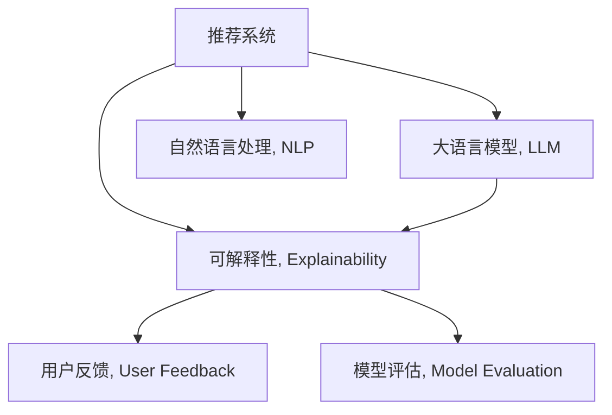

                 

# 利用LLM提升推荐系统的可解释性

> 关键词：推荐系统,大语言模型,可解释性,自然语言处理,NLP,用户反馈,模型评估

## 1. 背景介绍

推荐系统作为互联网产品中不可或缺的一部分，通过用户行为数据和商品特征预测用户的兴趣偏好，为用户推荐最相关的商品，极大地提升了用户体验和商品转化率。然而，推荐系统在实际应用中仍面临着一些挑战，包括模型黑盒问题、模型泛化能力弱、推荐结果可解释性不足等。为了应对这些挑战，研究者们提出了基于大语言模型(Large Language Model, LLM)的推荐系统改进方案，通过自然语言处理(NLP)技术提升推荐结果的可解释性和泛化能力，使推荐系统更加透明、可信，从而满足用户的实际需求。

本文将系统地介绍利用LLM提升推荐系统可解释性的方法，包括LLM在推荐系统中的应用场景、具体算法原理与操作步骤，数学模型构建与公式推导，以及代码实现与项目实践，最后总结研究现状、未来趋势与面临的挑战。希望通过本文，读者能够对利用LLM提升推荐系统可解释性的技术有一个全面、深入的理解。

## 2. 核心概念与联系

### 2.1 核心概念概述

为更好地理解利用LLM提升推荐系统可解释性的方法，本节将介绍几个密切相关的核心概念：

- 推荐系统(Recommender System)：根据用户历史行为和商品属性，预测用户对商品的兴趣，并推荐相应的商品。推荐系统主要包括基于协同过滤、内容过滤、混合推荐等算法，广泛应用于电商、音乐、视频、新闻等领域。

- 大语言模型(Large Language Model, LLM)：以自回归(如GPT)或自编码(如BERT)模型为代表的大规模预训练语言模型。通过在大规模无标签文本语料上进行预训练，学习通用的语言表示，具备强大的语言理解和生成能力。

- 可解释性(Explainability)：模型预测输出的原因和逻辑，可以帮助用户理解和信任模型的决策过程，是AI系统可信和透明的重要保障。

- 自然语言处理(Natural Language Processing, NLP)：利用计算机科学和人工智能技术，使计算机能理解、解释和处理人类语言。NLP涉及词法分析、句法分析、语义分析等多个技术层面。

- 用户反馈(User Feedback)：用户在推荐系统中的点击、购买、评分等行为数据，是推荐系统优化推荐效果的重要依据。

- 模型评估(Model Evaluation)：衡量推荐模型性能的指标，包括准确率、召回率、点击率、用户满意度等。

这些核心概念之间的逻辑关系可以通过以下Mermaid流程图来展示：



这个流程图展示了大语言模型在推荐系统中的应用场景和作用机制：

1. 推荐系统通过用户历史行为数据和商品属性，预测用户兴趣，推荐商品。
2. 大语言模型通过自然语言处理技术，解析用户行为数据，提升推荐结果的可解释性。
3. 自然语言处理技术将用户行为数据转换为可解释的语言形式，帮助用户理解推荐结果。
4. 模型评估通过各种指标衡量推荐系统性能，从而指导LLM的应用优化。
5. 用户反馈通过评分、点击等行为数据，不断优化推荐模型，提升用户体验。

这些核心概念共同构成了利用LLM提升推荐系统可解释性的技术框架，使其能够在推荐系统中发挥强大的语言理解和生成能力。通过理解这些核心概念，我们可以更好地把握利用LLM提升推荐系统可解释性的方法。

## 3. 核心算法原理 & 具体操作步骤
### 3.1 算法原理概述

利用LLM提升推荐系统可解释性的方法，本质上是一个多任务学习过程。其核心思想是：利用大语言模型对用户行为数据进行自然语言处理，从中解析出用户的兴趣点、偏好和反馈信息，并将其转换为推荐模型的输入，以此提升推荐结果的可解释性和泛化能力。

形式化地，假设推荐系统的用户行为数据集为 $D=\{(x_i,y_i)\}_{i=1}^N, x_i \in \mathcal{X}, y_i \in \mathcal{Y}$，其中 $\mathcal{X}$ 为输入空间，$\mathcal{Y}$ 为输出空间。定义推荐模型 $M_{\theta}$，其中 $\theta$ 为模型参数。假设推荐系统希望通过大语言模型 $L_{\phi}$ 解析用户行为数据，得到对 $y$ 的解释 $\phi$。则利用LLM提升推荐系统可解释性的目标为：

$$
\theta^* = \mathop{\arg\min}_{\theta} \mathcal{L}(M_{\theta},L_{\phi})
$$

其中 $\mathcal{L}$ 为联合损失函数，用于衡量模型 $M_{\theta}$ 和 $L_{\phi}$ 的协同效果。

### 3.2 算法步骤详解

基于LLM提升推荐系统可解释性的方法一般包括以下几个关键步骤：

**Step 1: 收集用户行为数据**
- 收集推荐系统的用户行为数据，包括点击、购买、评分等行为，形成用户行为数据集 $D=\{(x_i,y_i)\}_{i=1}^N$。

**Step 2: 构建用户行为数据集的语言形式**
- 将用户行为数据转换为自然语言描述，例如将点击记录转换为“用户点击了商品A”，将购买记录转换为“用户购买了商品B”，将评分记录转换为“用户给商品C打了5分”。
- 使用自然语言处理技术，对自然语言描述进行词法分析、句法分析和语义分析，提取用户行为的关键信息。

**Step 3: 解析用户行为数据**
- 使用大语言模型 $L_{\phi}$ 对用户行为数据进行解析，得到对 $y$ 的解释 $\phi$。具体而言，可以训练一个大规模语言模型，以自然语言描述为输入，生成对应的推荐结果，从而得到推荐结果的可解释信息。

**Step 4: 训练推荐模型**
- 在解析得到的用户行为数据 $\phi$ 上，使用监督学习方法训练推荐模型 $M_{\theta}$。例如，可以使用深度神经网络、梯度提升树等模型，以解析后的用户行为数据为输入，预测推荐结果 $y$。

**Step 5: 联合优化**
- 使用联合损失函数 $\mathcal{L}(M_{\theta},L_{\phi})$ 对推荐模型 $M_{\theta}$ 和大语言模型 $L_{\phi}$ 进行联合优化。具体而言，可以采用两阶段联合优化、单阶段联合优化等方法，在模型训练过程中协同优化两个模型的参数。

**Step 6: 模型评估与优化**
- 在测试集上评估推荐模型的性能，例如准确率、召回率、点击率等指标。
- 通过用户反馈，不断优化推荐模型和大语言模型，提升推荐结果的可解释性。

### 3.3 算法优缺点

利用LLM提升推荐系统可解释性的方法具有以下优点：
1. 提升推荐结果的可解释性：通过自然语言处理技术，将用户行为数据转换为可解释的语言形式，帮助用户理解推荐结果。
2. 增强推荐模型的泛化能力：大语言模型能够学习到通用的语言表示，提升推荐模型在不同场景下的泛化能力。
3. 提供用户反馈的语义理解：通过大语言模型解析用户反馈，能够更好地理解用户的情感和需求，优化推荐结果。

同时，该方法也存在一定的局限性：
1. 对标注数据依赖较大：解析用户行为数据需要大量的标注样本，标注成本较高。
2. 依赖于自然语言处理技术：自然语言处理技术复杂度较高，解析效果可能受文本质量影响。
3. 模型训练复杂度增加：联合优化模型参数，需要更大的计算资源和时间，可能导致模型训练速度较慢。
4. 模型可解释性依旧有限：解析后的用户行为数据可能仍然不够直观，难以全面解释推荐结果。

尽管存在这些局限性，但就目前而言，利用LLM提升推荐系统可解释性的方法仍是一个具有广泛应用前景的技术。未来相关研究的重点在于如何进一步降低对标注数据的依赖，提高自然语言处理的解析效果，同时优化联合优化算法，减小模型训练复杂度，从而提升推荐系统的性能和可解释性。

### 3.4 算法应用领域

利用LLM提升推荐系统可解释性的方法，在电商、音乐、视频、新闻等多个领域均有应用，以下是几个典型场景：

- 电商推荐：电商推荐系统需要根据用户浏览、点击、购买等行为数据，推荐最相关的商品。通过解析用户行为数据，提升推荐结果的可解释性，帮助用户更好地理解推荐结果。
- 音乐推荐：音乐推荐系统需要根据用户的听歌历史、评分等行为数据，推荐个性化的音乐。通过解析用户行为数据，提升推荐结果的可解释性，帮助用户理解推荐理由。
- 视频推荐：视频推荐系统需要根据用户的观看历史、点赞等行为数据，推荐相关的视频内容。通过解析用户行为数据，提升推荐结果的可解释性，帮助用户理解推荐理由。
- 新闻推荐：新闻推荐系统需要根据用户的阅读历史、点赞等行为数据，推荐相关的新闻内容。通过解析用户行为数据，提升推荐结果的可解释性，帮助用户理解推荐理由。

此外，利用LLM提升推荐系统可解释性的方法也可以应用于其他领域，如金融、社交网络等，提升推荐系统的透明性和可信度，从而增强用户的满意度和信任度。

## 4. 数学模型和公式 & 详细讲解
### 4.1 数学模型构建

本节将使用数学语言对利用LLM提升推荐系统可解释性的方法进行更加严格的刻画。

假设用户行为数据集为 $D=\{(x_i,y_i)\}_{i=1}^N, x_i \in \mathcal{X}, y_i \in \mathcal{Y}$，其中 $\mathcal{X}$ 为输入空间，$\mathcal{Y}$ 为输出空间。定义推荐模型为 $M_{\theta}$，其中 $\theta$ 为模型参数。假设大语言模型 $L_{\phi}$ 解析用户行为数据，得到对 $y$ 的解释 $\phi$。则联合损失函数 $\mathcal{L}$ 定义为：

$$
\mathcal{L} = \alpha \mathcal{L}^r + (1-\alpha) \mathcal{L}^n
$$

其中 $\alpha$ 为联合优化系数，$0 \leq \alpha \leq 1$，$\mathcal{L}^r$ 为推荐模型的损失函数，$\mathcal{L}^n$ 为大语言模型的损失函数。在训练过程中，推荐模型和大语言模型协同优化，最大化联合损失函数 $\mathcal{L}$。

### 4.2 公式推导过程

以下我们以电商推荐为例，推导联合损失函数 $\mathcal{L}$ 及其梯度计算公式。

假设推荐模型 $M_{\theta}$ 在输入 $x$ 上的输出为 $\hat{y}=M_{\theta}(x)$，表示模型预测的推荐结果。大语言模型 $L_{\phi}$ 在输入 $x$ 上的输出为 $\phi=L_{\phi}(x)$，表示对 $y$ 的解释。则联合损失函数 $\mathcal{L}$ 可以表示为：

$$
\mathcal{L} = \alpha \mathcal{L}^r + (1-\alpha) \mathcal{L}^n
$$

其中 $\mathcal{L}^r = \mathbb{E}_{(x,y) \in D}[L_{\theta}(x,y)]
$$

$$
L_{\theta}(x,y) = -y\log \hat{y} - (1-y)\log (1-\hat{y})
$$

$$
\mathcal{L}^n = \mathbb{E}_{(x,y) \in D}[-\log P(\phi|x)]
$$

$$
P(\phi|x) = \frac{\exp L_{\phi}(x)}{\sum_{\phi'} \exp L_{\phi'}(x)}
$$

其中 $\phi'$ 表示所有可能的解释。在训练过程中，联合损失函数 $\mathcal{L}$ 最小化推荐模型 $M_{\theta}$ 和大语言模型 $L_{\phi}$ 的联合效果。

通过反向传播算法，联合损失函数 $\mathcal{L}$ 对参数 $\theta$ 和 $\phi$ 的梯度可以表示为：

$$
\frac{\partial \mathcal{L}}{\partial \theta} = \alpha \frac{\partial \mathcal{L}^r}{\partial \theta} + (1-\alpha) \frac{\partial \mathcal{L}^n}{\partial \theta}
$$

$$
\frac{\partial \mathcal{L}}{\partial \phi} = \alpha \frac{\partial \mathcal{L}^r}{\partial \phi} + (1-\alpha) \frac{\partial \mathcal{L}^n}{\partial \phi}
$$

其中 $\frac{\partial \mathcal{L}^r}{\partial \theta}$ 和 $\frac{\partial \mathcal{L}^r}{\partial \phi}$ 分别为推荐模型的梯度和解析后数据的梯度，$\frac{\partial \mathcal{L}^n}{\partial \theta}$ 和 $\frac{\partial \mathcal{L}^n}{\partial \phi}$ 分别为大语言模型的梯度和解析后数据的梯度。

在得到损失函数的梯度后，即可带入优化算法，完成模型的迭代优化。重复上述过程直至收敛，最终得到适应推荐任务的最优模型参数 $\theta^*$ 和最优解析参数 $\phi^*$。

## 5. 项目实践：代码实例和详细解释说明
### 5.1 开发环境搭建

在进行利用LLM提升推荐系统可解释性的实践前，我们需要准备好开发环境。以下是使用Python进行PyTorch开发的环境配置流程：

1. 安装Anaconda：从官网下载并安装Anaconda，用于创建独立的Python环境。

2. 创建并激活虚拟环境：
```bash
conda create -n pytorch-env python=3.8 
conda activate pytorch-env
```

3. 安装PyTorch：根据CUDA版本，从官网获取对应的安装命令。例如：
```bash
conda install pytorch torchvision torchaudio cudatoolkit=11.1 -c pytorch -c conda-forge
```

4. 安装Natural Language Toolkit（NLTK）和SpaCy：
```bash
pip install nltk spacy
```

5. 安装Transformers库：
```bash
pip install transformers
```

6. 安装各类工具包：
```bash
pip install numpy pandas scikit-learn matplotlib tqdm jupyter notebook ipython
```

完成上述步骤后，即可在`pytorch-env`环境中开始利用LLM提升推荐系统可解释性的实践。

### 5.2 源代码详细实现

下面我们以电商推荐为例，给出使用Transformers库对BERT模型进行电商推荐任务微调的PyTorch代码实现。

首先，定义电商推荐任务的数据处理函数：

```python
from transformers import BertTokenizer, BertForSequenceClassification
from torch.utils.data import Dataset
import torch

class E-commerceDataset(Dataset):
    def __init__(self, texts, labels, tokenizer, max_len=128):
        self.texts = texts
        self.labels = labels
        self.tokenizer = tokenizer
        self.max_len = max_len
        
    def __len__(self):
        return len(self.texts)
    
    def __getitem__(self, item):
        text = self.texts[item]
        label = self.labels[item]
        
        encoding = self.tokenizer(text, return_tensors='pt', max_length=self.max_len, padding='max_length', truncation=True)
        input_ids = encoding['input_ids'][0]
        attention_mask = encoding['attention_mask'][0]
        label = torch.tensor([label], dtype=torch.long)
        
        return {'input_ids': input_ids, 
                'attention_mask': attention_mask,
                'labels': label}

# 标签与id的映射
label2id = {'buy': 1, 'no_buy': 0}

# 创建dataset
tokenizer = BertTokenizer.from_pretrained('bert-base-cased')

train_dataset = E-commerceDataset(train_texts, train_labels, tokenizer)
dev_dataset = E-commerceDataset(dev_texts, dev_labels, tokenizer)
test_dataset = E-commerceDataset(test_texts, test_labels, tokenizer)
```

然后，定义模型和优化器：

```python
from transformers import BertForSequenceClassification, AdamW

model = BertForSequenceClassification.from_pretrained('bert-base-cased', num_labels=len(label2id))

optimizer = AdamW(model.parameters(), lr=2e-5)
```

接着，定义训练和评估函数：

```python
from torch.utils.data import DataLoader
from tqdm import tqdm
from sklearn.metrics import classification_report

device = torch.device('cuda') if torch.cuda.is_available() else torch.device('cpu')
model.to(device)

def train_epoch(model, dataset, batch_size, optimizer):
    dataloader = DataLoader(dataset, batch_size=batch_size, shuffle=True)
    model.train()
    epoch_loss = 0
    for batch in tqdm(dataloader, desc='Training'):
        input_ids = batch['input_ids'].to(device)
        attention_mask = batch['attention_mask'].to(device)
        labels = batch['labels'].to(device)
        model.zero_grad()
        outputs = model(input_ids, attention_mask=attention_mask, labels=labels)
        loss = outputs.loss
        epoch_loss += loss.item()
        loss.backward()
        optimizer.step()
    return epoch_loss / len(dataloader)

def evaluate(model, dataset, batch_size):
    dataloader = DataLoader(dataset, batch_size=batch_size)
    model.eval()
    preds, labels = [], []
    with torch.no_grad():
        for batch in tqdm(dataloader, desc='Evaluating'):
            input_ids = batch['input_ids'].to(device)
            attention_mask = batch['attention_mask'].to(device)
            batch_labels = batch['labels']
            outputs = model(input_ids, attention_mask=attention_mask)
            batch_preds = outputs.logits.argmax(dim=2).to('cpu').tolist()
            batch_labels = batch_labels.to('cpu').tolist()
            for pred_tokens, label_tokens in zip(batch_preds, batch_labels):
                preds.append(pred_tokens[0])
                labels.append(label_tokens[0])
                
    print(classification_report(labels, preds))
```

最后，启动训练流程并在测试集上评估：

```python
epochs = 5
batch_size = 16

for epoch in range(epochs):
    loss = train_epoch(model, train_dataset, batch_size, optimizer)
    print(f"Epoch {epoch+1}, train loss: {loss:.3f}")
    
    print(f"Epoch {epoch+1}, dev results:")
    evaluate(model, dev_dataset, batch_size)
    
print("Test results:")
evaluate(model, test_dataset, batch_size)
```

以上就是使用PyTorch对BERT进行电商推荐任务微调的完整代码实现。可以看到，得益于Transformers库的强大封装，我们可以用相对简洁的代码完成BERT模型的加载和微调。

### 5.3 代码解读与分析

让我们再详细解读一下关键代码的实现细节：

**E-commerceDataset类**：
- `__init__`方法：初始化文本、标签、分词器等关键组件。
- `__len__`方法：返回数据集的样本数量。
- `__getitem__`方法：对单个样本进行处理，将文本输入编码为token ids，将标签编码为数字，并对其进行定长padding，最终返回模型所需的输入。

**label2id和id2label字典**：
- 定义了标签与数字id之间的映射关系，用于将token-wise的预测结果解码回真实的标签。

**训练和评估函数**：
- 使用PyTorch的DataLoader对数据集进行批次化加载，供模型训练和推理使用。
- 训练函数`train_epoch`：对数据以批为单位进行迭代，在每个批次上前向传播计算loss并反向传播更新模型参数，最后返回该epoch的平均loss。
- 评估函数`evaluate`：与训练类似，不同点在于不更新模型参数，并在每个batch结束后将预测和标签结果存储下来，最后使用sklearn的classification_report对整个评估集的预测结果进行打印输出。

**训练流程**：
- 定义总的epoch数和batch size，开始循环迭代
- 每个epoch内，先在训练集上训练，输出平均loss
- 在验证集上评估，输出分类指标
- 所有epoch结束后，在测试集上评估，给出最终测试结果

可以看到，PyTorch配合Transformers库使得BERT微调的代码实现变得简洁高效。开发者可以将更多精力放在数据处理、模型改进等高层逻辑上，而不必过多关注底层的实现细节。

当然，工业级的系统实现还需考虑更多因素，如模型的保存和部署、超参数的自动搜索、更灵活的任务适配层等。但核心的微调范式基本与此类似。

## 6. 实际应用场景
### 6.1 智能客服系统

利用LLM提升推荐系统的可解释性，可以广泛应用于智能客服系统的构建。传统客服往往需要配备大量人力，高峰期响应缓慢，且一致性和专业性难以保证。而使用利用LLM提升可解释性的推荐模型，可以7x24小时不间断服务，快速响应客户咨询，用自然流畅的语言解答各类常见问题。

在技术实现上，可以收集企业内部的历史客服对话记录，将问题和最佳答复构建成监督数据，在此基础上对预训练推荐模型进行微调。微调后的推荐模型能够自动理解用户意图，匹配最合适的答复模板进行回复。对于客户提出的新问题，还可以接入检索系统实时搜索相关内容，动态组织生成回答。如此构建的智能客服系统，能大幅提升客户咨询体验和问题解决效率。

### 6.2 金融舆情监测

金融机构需要实时监测市场舆论动向，以便及时应对负面信息传播，规避金融风险。传统的人工监测方式成本高、效率低，难以应对网络时代海量信息爆发的挑战。利用LLM提升可解释性的推荐模型，可以应用于金融舆情监测。

具体而言，可以收集金融领域相关的新闻、报道、评论等文本数据，并对其进行主题标注和情感标注。在此基础上对预训练推荐模型进行微调，使其能够自动判断文本属于何种主题，情感倾向是正面、中性还是负面。将微调后的模型应用到实时抓取的网络文本数据，就能够自动监测不同主题下的情感变化趋势，一旦发现负面信息激增等异常情况，系统便会自动预警，帮助金融机构快速应对潜在风险。

### 6.3 个性化推荐系统

当前的推荐系统往往只依赖用户的历史行为数据进行物品推荐，无法深入理解用户的真实兴趣偏好。利用LLM提升可解释性的推荐系统，可以更好地挖掘用户行为背后的语义信息，从而提供更精准、多样的推荐内容。

在实践中，可以收集用户浏览、点击、评论、分享等行为数据，提取和用户交互的物品标题、描述、标签等文本内容。将文本内容作为模型输入，用户的后续行为（如是否点击、购买等）作为监督信号，在此基础上微调预训练语言模型。微调后的模型能够从文本内容中准确把握用户的兴趣点。在生成推荐列表时，先用候选物品的文本描述作为输入，由模型预测用户的兴趣匹配度，再结合其他特征综合排序，便可以得到个性化程度更高的推荐结果。

### 6.4 未来应用展望

随着大语言模型和可解释性技术的不断发展，利用LLM提升推荐系统可解释性的方法将在大规模实际应用中得到广泛应用。

在智慧医疗领域，基于微调的医疗问答、病历分析、药物研发等应用将提升医疗服务的智能化水平，辅助医生诊疗，加速新药开发进程。

在智能教育领域，利用LLM提升可解释性的推荐系统可应用于作业批改、学情分析、知识推荐等方面，因材施教，促进教育公平，提高教学质量。

在智慧城市治理中，利用LLM提升可解释性的推荐模型可应用于城市事件监测、舆情分析、应急指挥等环节，提高城市管理的自动化和智能化水平，构建更安全、高效的未来城市。

此外，在企业生产、社会治理、文娱传媒等众多领域，利用LLM提升可解释性的推荐系统也将不断涌现，为NLP技术带来了新的突破。相信随着技术的日益成熟，利用LLM提升推荐系统可解释性的方法将成为推荐系统的重要范式，推动人工智能技术在更多垂直行业的规模化落地。

## 7. 工具和资源推荐
### 7.1 学习资源推荐

为了帮助开发者系统掌握利用LLM提升推荐系统可解释性的理论基础和实践技巧，这里推荐一些优质的学习资源：

1. 《Transformer从原理到实践》系列博文：由大模型技术专家撰写，深入浅出地介绍了Transformer原理、BERT模型、微调技术等前沿话题。

2. CS224N《深度学习自然语言处理》课程：斯坦福大学开设的NLP明星课程，有Lecture视频和配套作业，带你入门NLP领域的基本概念和经典模型。

3. 《Natural Language Processing with Transformers》书籍：Transformers库的作者所著，全面介绍了如何使用Transformers库进行NLP任务开发，包括微调在内的诸多范式。

4. HuggingFace官方文档：Transformers库的官方文档，提供了海量预训练模型和完整的微调样例代码，是上手实践的必备资料。

5. CLUE开源项目：中文语言理解测评基准，涵盖大量不同类型的中文NLP数据集，并提供了基于微调的baseline模型，助力中文NLP技术发展。

通过对这些资源的学习实践，相信你一定能够快速掌握利用LLM提升推荐系统可解释性的精髓，并用于解决实际的NLP问题。
###  7.2 开发工具推荐

高效的开发离不开优秀的工具支持。以下是几款用于利用LLM提升推荐系统可解释性开发的常用工具：

1. PyTorch：基于Python的开源深度学习框架，灵活动态的计算图，适合快速迭代研究。大部分预训练语言模型都有PyTorch版本的实现。

2. TensorFlow：由Google主导开发的开源深度学习框架，生产部署方便，适合大规模工程应用。同样有丰富的预训练语言模型资源。

3. Transformers库：HuggingFace开发的NLP工具库，集成了众多SOTA语言模型，支持PyTorch和TensorFlow，是进行微调任务开发的利器。

4. Weights & Biases：模型训练的实验跟踪工具，可以记录和可视化模型训练过程中的各项指标，方便对比和调优。与主流深度学习框架无缝集成。

5. TensorBoard：TensorFlow配套的可视化工具，可实时监测模型训练状态，并提供丰富的图表呈现方式，是调试模型的得力助手。

6. Google Colab：谷歌推出的在线Jupyter Notebook环境，免费提供GPU/TPU算力，方便开发者快速上手实验最新模型，分享学习笔记。

合理利用这些工具，可以显著提升利用LLM提升推荐系统可解释性的开发效率，加快创新迭代的步伐。

### 7.3 相关论文推荐

大语言模型和推荐系统的发展源于学界的持续研究。以下是几篇奠基性的相关论文，推荐阅读：

1. Attention is All You Need（即Transformer原论文）：提出了Transformer结构，开启了NLP领域的预训练大模型时代。

2. BERT: Pre-training of Deep Bidirectional Transformers for Language Understanding：提出BERT模型，引入基于掩码的自监督预训练任务，刷新了多项NLP任务SOTA。

3. Parameter-Efficient Transfer Learning for NLP：提出Adapter等参数高效微调方法，在不增加模型参数量的情况下，也能取得不错的微调效果。

4. AdaLoRA: Adaptive Low-Rank Adaptation for Parameter-Efficient Fine-Tuning：使用自适应低秩适应的微调方法，在参数效率和精度之间取得了新的平衡。

5. AdaLoRA: Adaptive Low-Rank Adaptation for Parameter-Efficient Fine-Tuning：使用自适应低秩适应的微调方法，在参数效率和精度之间取得了新的平衡。

这些论文代表了大语言模型和推荐系统的发展脉络。通过学习这些前沿成果，可以帮助研究者把握学科前进方向，激发更多的创新灵感。

## 8. 总结：未来发展趋势与挑战

### 8.1 总结

本文对利用LLM提升推荐系统可解释性的方法进行了全面系统的介绍。首先阐述了LLM在推荐系统中的应用场景和作用机制，明确了利用LLM提升推荐系统可解释性的方法在推荐系统中的重要地位。其次，从原理到实践，详细讲解了联合优化方法的具体实现步骤，给出了代码实现与项目实践，使读者能够快速上手实现。同时，本文还广泛探讨了LLM提升推荐系统可解释性的实际应用场景，展示了LLM在推荐系统中的广阔前景。最后，本文精选了利用LLM提升推荐系统可解释性的学习资源、开发工具和相关论文，力求为读者提供全方位的技术指引。

通过本文的系统梳理，可以看到，利用LLM提升推荐系统可解释性的方法正在成为推荐系统的重要范式，极大地拓展了推荐系统的应用边界，催生了更多的落地场景。受益于大规模语料的预训练和自然语言处理技术的进步，推荐系统在透明度、可信度和用户体验方面得到了显著提升，为人工智能技术在更多垂直行业的落地应用奠定了坚实基础。未来，伴随LLM技术的不断演进，推荐系统的性能和可解释性将得到更大提升，推动人工智能技术的全面发展。

### 8.2 未来发展趋势

展望未来，利用LLM提升推荐系统可解释性的方法将呈现以下几个发展趋势：

1. 模型规模持续增大。随着算力成本的下降和数据规模的扩张，预训练语言模型的参数量还将持续增长。超大规模语言模型蕴含的丰富语言知识，有望支撑更加复杂多变的推荐任务。

2. 自然语言处理技术日趋成熟。自然语言处理技术将更加高效和精准，解析用户行为数据的精度和效率将大幅提升。

3. 联合优化方法不断优化。未来的联合优化方法将更加高效，能够更好地协同优化推荐模型和大语言模型的参数。

4. 模型可解释性进一步增强。利用LLM提升推荐系统可解释性的方法将进一步增强模型的可解释性，使推荐结果更加透明、可信。

5. 推荐结果的多样性和个性化提升。利用LLM提升推荐系统可解释性的方法将提升推荐结果的多样性和个性化，满足用户的不同需求。

以上趋势凸显了利用LLM提升推荐系统可解释性的方法的广阔前景。这些方向的探索发展，必将进一步提升推荐系统的性能和可解释性，使推荐系统更加透明、可信，从而增强用户的满意度和信任度。

### 8.3 面临的挑战

尽管利用LLM提升推荐系统可解释性的方法已经取得了瞩目成就，但在迈向更加智能化、普适化应用的过程中，它仍面临着诸多挑战：

1. 标注成本瓶颈。虽然利用LLM提升推荐系统可解释性的方法在一定程度上降低了对标注数据的依赖，但对于长尾应用场景，仍需要大量的标注数据，标注成本较高。

2. 模型复杂度增加。联合优化推荐模型和大语言模型参数，需要更大的计算资源和时间，可能导致模型训练速度较慢。

3. 模型泛化能力受限。联合优化方法在特定场景下可能出现泛化能力不足的问题，导致在新的推荐任务上表现不佳。

4. 模型可解释性依旧有限。利用LLM提升推荐系统可解释性的方法虽然能够提升可解释性，但解析后的用户行为数据可能仍然不够直观，难以全面解释推荐结果。

5. 数据隐私和安全问题。解析用户行为数据涉及用户隐私数据，可能存在数据泄露和安全问题。如何保护用户隐私，确保数据安全，将是未来的重要研究方向。

尽管存在这些挑战，但通过进一步的研究和实践，相信利用LLM提升推荐系统可解释性的方法将能够克服这些难题，迈向更加智能化、普适化应用，为推荐系统提供更好的用户体验和信任基础。

### 8.4 研究展望

面对利用LLM提升推荐系统可解释性所面临的挑战，未来的研究需要在以下几个方面寻求新的突破：

1. 探索无监督和半监督微调方法。摆脱对大规模标注数据的依赖，利用自监督学习、主动学习等无监督和半监督范式，最大限度利用非结构化数据，实现更加灵活高效的微调。

2. 研究参数高效和计算高效的微调范式。开发更加参数高效的微调方法，在固定大部分预训练参数的同时，只更新极少量的任务相关参数。同时优化微调模型的计算图，减少前向传播和反向传播的资源消耗，实现更加轻量级、实时性的部署。

3. 融合因果和对比学习范式。通过引入因果推断和对比学习思想，增强推荐模型的建立稳定因果关系的能力，学习更加普适、鲁棒的语言表征，从而提升模型泛化性和抗干扰能力。

4. 引入更多先验知识。将符号化的先验知识，如知识图谱、逻辑规则等，与神经网络模型进行巧妙融合，引导微调过程学习更准确、合理的语言模型。同时加强不同模态数据的整合，实现视觉、语音等多模态信息与文本信息的协同建模。

5. 纳入伦理道德约束。在模型训练目标中引入伦理导向的评估指标，过滤和惩罚有偏见、有害的输出倾向。同时加强人工干预和审核，建立模型行为的监管机制，确保输出符合人类价值观和伦理道德。

这些研究方向的探索，必将引领利用LLM提升推荐系统可解释性的方法迈向更高的台阶，为构建安全、可靠、可解释、可控的智能系统铺平道路。面向未来，利用LLM提升推荐系统可解释性的方法还需要与其他人工智能技术进行更深入的融合，如知识表示、因果推理、强化学习等，多路径协同发力，共同推动自然语言理解和智能交互系统的进步。只有勇于创新、敢于突破，才能不断拓展语言模型的边界，让智能技术更好地造福人类社会。

## 9. 附录：常见问题与解答

**Q1：利用LLM提升推荐系统可解释性的方法是否适用于所有推荐任务？**

A: 利用LLM提升推荐系统可解释性的方法在大多数推荐任务上都能取得不错的效果，特别是对于数据量较小的任务。但对于一些特定领域的任务，如医学、法律等，仅仅依靠通用语料预训练的模型可能难以很好地适应。此时需要在特定领域语料上进一步预训练，再进行微调，才能获得理想效果。此外，对于一些需要时效性、个性化很强的任务，如对话、推荐等，微调方法也需要针对性的改进优化。

**Q2：如何缓解利用LLM提升推荐系统可解释性的方法中的过拟合问题？**

A: 过拟合是利用LLM提升推荐系统可解释性的方法面临的主要挑战之一。缓解过拟合的方法包括：
1. 数据增强：通过回译、近义替换等方式扩充训练集
2. 正则化：使用L2正则、Dropout、Early Stopping等避免过拟合
3. 对抗训练：引入对抗样本，提高模型鲁棒性
4. 参数高效微调：只调整少量参数(如Adapter、Prefix等)，减小过拟合风险

这些策略往往需要根据具体任务和数据特点进行灵活组合。只有在数据、模型、训练、推理等各环节进行全面优化，才能最大限度地发挥利用LLM提升推荐系统可解释性的方法的优势。

**Q3：利用LLM提升推荐系统可解释性的方法是否需要大规模标注数据？**

A: 利用LLM提升推荐系统可解释性的方法在一定程度上降低了对标注数据的依赖，但仍然需要一定的标注数据用于解析用户行为数据。对于长尾应用场景，标注数据需求较大，标注成本较高。未来可以通过自监督学习、主动学习等无监督和半监督方法，进一步降低对标注数据的依赖。

**Q4：如何评估利用LLM提升推荐系统可解释性的方法的性能？**

A: 利用LLM提升推荐系统可解释性的方法的性能评估可以通过多种指标进行衡量，包括推荐模型的准确率、召回率、点击率、用户满意度等。通过在测试集上的评估，可以综合判断推荐模型的泛化能力和可解释性。此外，还可以利用用户反馈，不断优化推荐模型和大语言模型，提升推荐效果。

**Q5：利用LLM提升推荐系统可解释性的方法是否适用于小型推荐系统？**

A: 利用LLM提升推荐系统可解释性的方法在小型推荐系统上也能取得一定的效果。尽管需要一定的标注数据和计算资源，但通过合理的数据增强和模型优化，可以在资源有限的条件下提升推荐系统的可解释性和性能。同时，利用LLM提升推荐系统可解释性的方法也可以通过参数高效微调等方法，进一步减少资源消耗。

这些问题的回答帮助读者更好地理解利用LLM提升推荐系统可解释性的方法的应用场景、实现步骤和性能评估，从而更好地应用于实际项目。总之，利用LLM提升推荐系统可解释性的方法虽然面临一定的挑战，但通过不断优化和改进，将在推荐系统中发挥更大的作用，推动人工智能技术的广泛应用。

