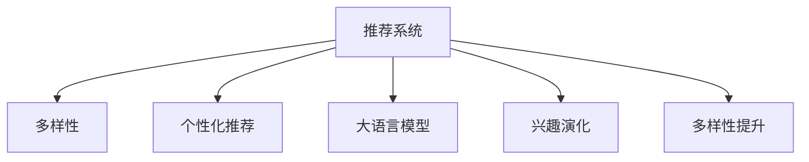

                 

# 利用大模型进行推荐多样性提升的新思路

> 关键词：大语言模型,推荐系统,多样性提升,兴趣演化,个性化推荐

## 1. 背景介绍

在当今信息爆炸的时代，推荐系统已经深入到各个领域，如电商、社交网络、视频流媒体等。推荐系统的目标是为用户推荐最符合其兴趣的内容，提高用户满意度，同时为平台带来更多收入。然而，随着个性化推荐技术的发展，用户经常陷入信息茧房，只看到和自己相似的内容，导致多样性降低，影响到用户的知识视野和认知多样性。

为了解决这一问题，推荐系统需要设计多样性提升的机制，引导用户接触更广泛的内容，避免单一化的推荐。本文将探讨利用大语言模型实现推荐多样性提升的新思路，从而提高用户的满意度和认知水平，促进信息多元传播。

## 2. 核心概念与联系

### 2.1 核心概念概述

为更好地理解利用大语言模型提升推荐系统多样性的方法，本节将介绍几个密切相关的核心概念：

- 推荐系统(Recommender System)：通过分析用户行为数据，为每个用户推荐最符合其兴趣的商品、内容、新闻等。

- 多样性(Diversity)：推荐内容的多样性，指推荐结果中包含不同类别、不同风格、不同来源的内容。

- 个性化推荐(Personalized Recommendation)：针对每个用户构建个性化的推荐列表，根据其历史行为和偏好，推荐其最感兴趣的内容。

- 大语言模型(Large Language Model, LLM)：如BERT、GPT等预训练语言模型，通过大量文本数据的自监督训练，学习到语言的通用表示，具备强大的语言理解和生成能力。

- 兴趣演化(Interest Evolution)：用户随着时间推移，其兴趣偏好会发生变化。推荐系统需要动态调整推荐策略，以应对兴趣演化的需求。

- 多样性提升(Diversity Enhancement)：通过设计算法，引导推荐系统输出多样性的内容，避免单一化推荐，提升用户接触新知识和新观点的可能性。

这些核心概念之间的逻辑关系可以通过以下Mermaid流程图来展示：



这个流程图展示了大语言模型、个性化推荐、兴趣演化和多样性提升之间的内在联系：

1. 推荐系统根据用户的历史行为数据和兴趣偏好，生成个性化推荐。
2. 利用大语言模型，可以更好地理解用户的多样化需求，生成更加符合用户兴趣的内容。
3. 随着用户兴趣的演化，推荐系统需要动态调整推荐策略，以适应新的兴趣偏好。
4. 多样性提升机制能够引导推荐系统输出多样性的内容，增强用户接触新知识和新观点的可能性。

## 3. 核心算法原理 & 具体操作步骤

### 3.1 算法原理概述

利用大语言模型提升推荐多样性，本质上是通过深度学习技术挖掘用户的多样化需求，并动态调整推荐策略的过程。具体而言，可以将推荐任务视为一个多标签分类问题，每个标签表示一种内容的属性(如主题、风格、来源等)，大语言模型通过输入用户行为数据和属性信息，预测用户对不同属性内容的兴趣，从而生成多样性的推荐结果。

### 3.2 算法步骤详解

基于大语言模型的推荐多样性提升算法主要包括以下几个关键步骤：

**Step 1: 数据预处理**
- 收集用户的历史行为数据，包括浏览、点击、购买等行为。
- 获取推荐内容的属性信息，如标签、分类、来源等。
- 对数据进行归一化、去噪等预处理，保证数据质量和一致性。

**Step 2: 构建模型输入**
- 将用户历史行为和推荐内容属性信息进行编码，得到模型输入向量。
- 使用大语言模型，如BERT、GPT等，对输入向量进行嵌入，得到语义表示。

**Step 3: 多样性模型训练**
- 定义多样性度量指标，如多样性指数(Diversity Index)、信息熵(Information Entropy)等。
- 设计多样性提升模型，根据用户的多样性需求，生成推荐结果。
- 通过优化目标函数，训练多样性提升模型，最大化推荐结果的多样性。

**Step 4: 推荐策略优化**
- 根据多样性提升模型输出，动态调整推荐策略，生成个性化的推荐列表。
- 利用A/B测试等方法，评估推荐策略的效果，迭代优化模型参数。

**Step 5: 推荐系统集成**
- 将多样性提升模型集成到推荐系统中，与个性化推荐算法联合使用。
- 对推荐结果进行排序，根据用户的兴趣和多样性需求，生成最终的推荐列表。

### 3.3 算法优缺点

利用大语言模型提升推荐多样性，具有以下优点：
1. 能够有效挖掘用户的多样化需求，生成更加符合用户兴趣的内容。
2. 动态调整推荐策略，适应用户兴趣的演化。
3. 提高用户接触新知识和新观点的可能性，促进信息多元传播。
4. 能够处理多种属性类型的数据，提升推荐系统的灵活性。

同时，该算法也存在一定的局限性：
1. 需要大量的标注数据来训练多样性提升模型，数据获取成本较高。
2. 模型的训练和推理过程较为复杂，对算力和内存要求较高。
3. 对模型参数的调整需要仔细设计，否则可能导致推荐效果下降。
4. 推荐结果的多样性与用户兴趣的匹配度不一定能完全对齐，存在一定的偏差。

尽管存在这些局限性，但就目前而言，利用大语言模型提升推荐多样性仍是一种较为有效的解决方案。未来相关研究的重点在于如何进一步降低数据获取成本，提高模型效率，同时兼顾推荐效果的多样性和个性化。

### 3.4 算法应用领域

利用大语言模型提升推荐多样性，已经在电商、社交网络、视频流媒体等多个领域得到应用，为推荐系统的多样性提升提供了新的思路：

- 电商推荐：利用大语言模型分析用户的历史行为数据和商品属性，生成多样化的商品推荐列表。
- 社交网络推荐：根据用户的兴趣变化，推荐多样化的内容，避免信息茧房。
- 视频流媒体推荐：分析用户的多样化需求，推荐不同类型的视频内容，提高用户观看体验。
- 个性化图书馆推荐：根据用户的阅读历史和偏好，推荐不同主题、不同风格的书籍，丰富用户的阅读体验。

## 4. 数学模型和公式 & 详细讲解

### 4.1 数学模型构建

本节将使用数学语言对基于大语言模型的推荐多样性提升方法进行更加严格的刻画。

记用户的历史行为数据为 $X=\{x_i\}_{i=1}^N$，其中 $x_i$ 表示用户第 $i$ 次的行为记录。推荐内容的属性信息为 $Y=\{y_j\}_{j=1}^M$，其中 $y_j$ 表示推荐内容的第 $j$ 个属性。模型的目标是找到一个映射函数 $f: X \times Y \rightarrow \mathbb{R}^k$，使得 $f(x_i, y_j)$ 能够表示用户对推荐内容属性 $y_j$ 的兴趣。

### 4.2 公式推导过程

为了描述用户对不同属性内容的兴趣，可以引入向量 $u \in \mathbb{R}^M$，其中 $u_j$ 表示用户对属性 $y_j$ 的兴趣程度。为了描述推荐内容属性的多样性，可以引入向量 $v \in \mathbb{R}^M$，其中 $v_j$ 表示属性 $y_j$ 的多样性程度。则多样性提升模型的目标函数可以表示为：

$$
\min_{u, v} \quad \frac{1}{N} \sum_{i=1}^N \sum_{j=1}^M (u_j \log v_j + (1 - u_j) \log (1 - v_j))
$$

其中 $u_j$ 和 $v_j$ 分别表示用户对属性 $y_j$ 的兴趣程度和多样性程度。

### 4.3 案例分析与讲解

以电商推荐为例，假设用户的历史行为数据 $X$ 包括浏览、点击、购买等行为，推荐内容的属性信息 $Y$ 包括商品类别、价格区间、品牌等。利用大语言模型，可以对这些数据进行编码，得到模型输入向量 $x_i$ 和 $y_j$。

通过训练多样性提升模型，可以输出用户对每个属性的兴趣程度 $u$ 和多样性程度 $v$。最终，可以根据 $u$ 和 $v$ 生成多样性的推荐列表，既符合用户兴趣，又包含多样化的内容，从而提高用户的满意度和认知水平。

## 5. 项目实践：代码实例和详细解释说明

### 5.1 开发环境搭建

在进行推荐多样性提升的实践前，我们需要准备好开发环境。以下是使用Python进行PyTorch开发的环境配置流程：

1. 安装Anaconda：从官网下载并安装Anaconda，用于创建独立的Python环境。

2. 创建并激活虚拟环境：
```bash
conda create -n pytorch-env python=3.8 
conda activate pytorch-env
```

3. 安装PyTorch：根据CUDA版本，从官网获取对应的安装命令。例如：
```bash
conda install pytorch torchvision torchaudio cudatoolkit=11.1 -c pytorch -c conda-forge
```

4. 安装Transformers库：
```bash
pip install transformers
```

5. 安装各类工具包：
```bash
pip install numpy pandas scikit-learn matplotlib tqdm jupyter notebook ipython
```

完成上述步骤后，即可在`pytorch-env`环境中开始推荐多样性提升的实践。

### 5.2 源代码详细实现

下面我们以电商推荐为例，给出使用Transformers库对BERT模型进行推荐多样性提升的PyTorch代码实现。

首先，定义电商推荐的数据处理函数：

```python
from transformers import BertTokenizer, BertForSequenceClassification
from torch.utils.data import Dataset, DataLoader
import torch
import numpy as np

class ECommerceDataset(Dataset):
    def __init__(self, data, labels, tokenizer, max_len=128):
        self.data = data
        self.labels = labels
        self.tokenizer = tokenizer
        self.max_len = max_len
        
    def __len__(self):
        return len(self.data)
    
    def __getitem__(self, item):
        text = self.data[item]
        label = self.labels[item]
        
        encoding = self.tokenizer(text, return_tensors='pt', max_length=self.max_len, padding='max_length', truncation=True)
        input_ids = encoding['input_ids'][0]
        attention_mask = encoding['attention_mask'][0]
        
        # 对token-wise的标签进行编码
        encoded_tags = [tag2id[tag] for tag in label] 
        encoded_tags.extend([tag2id['O']] * (self.max_len - len(encoded_tags)))
        labels = torch.tensor(encoded_tags, dtype=torch.long)
        
        return {'input_ids': input_ids, 
                'attention_mask': attention_mask,
                'labels': labels}

# 标签与id的映射
tag2id = {'O': 0, 'B': 1, 'I': 2}
id2tag = {v: k for k, v in tag2id.items()}

# 创建dataset
tokenizer = BertTokenizer.from_pretrained('bert-base-cased')

train_dataset = ECommerceDataset(train_data, train_labels, tokenizer)
dev_dataset = ECommerceDataset(dev_data, dev_labels, tokenizer)
test_dataset = ECommerceDataset(test_data, test_labels, tokenizer)
```

然后，定义模型和优化器：

```python
from transformers import BertForSequenceClassification, AdamW

model = BertForSequenceClassification.from_pretrained('bert-base-cased', num_labels=len(tag2id))

optimizer = AdamW(model.parameters(), lr=2e-5)
```

接着，定义训练和评估函数：

```python
from torch.utils.data import DataLoader
from tqdm import tqdm
from sklearn.metrics import classification_report

device = torch.device('cuda') if torch.cuda.is_available() else torch.device('cpu')
model.to(device)

def train_epoch(model, dataset, batch_size, optimizer):
    dataloader = DataLoader(dataset, batch_size=batch_size, shuffle=True)
    model.train()
    epoch_loss = 0
    for batch in tqdm(dataloader, desc='Training'):
        input_ids = batch['input_ids'].to(device)
        attention_mask = batch['attention_mask'].to(device)
        labels = batch['labels'].to(device)
        model.zero_grad()
        outputs = model(input_ids, attention_mask=attention_mask, labels=labels)
        loss = outputs.loss
        epoch_loss += loss.item()
        loss.backward()
        optimizer.step()
    return epoch_loss / len(dataloader)

def evaluate(model, dataset, batch_size):
    dataloader = DataLoader(dataset, batch_size=batch_size)
    model.eval()
    preds, labels = [], []
    with torch.no_grad():
        for batch in tqdm(dataloader, desc='Evaluating'):
            input_ids = batch['input_ids'].to(device)
            attention_mask = batch['attention_mask'].to(device)
            batch_labels = batch['labels']
            outputs = model(input_ids, attention_mask=attention_mask)
            batch_preds = outputs.logits.argmax(dim=2).to('cpu').tolist()
            batch_labels = batch_labels.to('cpu').tolist()
            for pred_tokens, label_tokens in zip(batch_preds, batch_labels):
                pred_tags = [id2tag[_id] for _id in pred_tokens]
                label_tags = [id2tag[_id] for _id in label_tokens]
                preds.append(pred_tags[:len(label_tokens)])
                labels.append(label_tags)
                
    print(classification_report(labels, preds))
```

最后，启动训练流程并在测试集上评估：

```python
epochs = 5
batch_size = 16

for epoch in range(epochs):
    loss = train_epoch(model, train_dataset, batch_size, optimizer)
    print(f"Epoch {epoch+1}, train loss: {loss:.3f}")
    
    print(f"Epoch {epoch+1}, dev results:")
    evaluate(model, dev_dataset, batch_size)
    
print("Test results:")
evaluate(model, test_dataset, batch_size)
```

以上就是使用PyTorch对BERT进行电商推荐推荐多样性提升的完整代码实现。可以看到，得益于Transformers库的强大封装，我们可以用相对简洁的代码完成BERT模型的加载和微调。

### 5.3 代码解读与分析

让我们再详细解读一下关键代码的实现细节：

**ECommerceDataset类**：
- `__init__`方法：初始化数据、标签、分词器等组件。
- `__len__`方法：返回数据集的样本数量。
- `__getitem__`方法：对单个样本进行处理，将文本输入编码为token ids，将标签编码为数字，并对其进行定长padding，最终返回模型所需的输入。

**tag2id和id2tag字典**：
- 定义了标签与数字id之间的映射关系，用于将token-wise的预测结果解码回真实的标签。

**训练和评估函数**：
- 使用PyTorch的DataLoader对数据集进行批次化加载，供模型训练和推理使用。
- 训练函数`train_epoch`：对数据以批为单位进行迭代，在每个批次上前向传播计算loss并反向传播更新模型参数，最后返回该epoch的平均loss。
- 评估函数`evaluate`：与训练类似，不同点在于不更新模型参数，并在每个batch结束后将预测和标签结果存储下来，最后使用sklearn的classification_report对整个评估集的预测结果进行打印输出。

**训练流程**：
- 定义总的epoch数和batch size，开始循环迭代
- 每个epoch内，先在训练集上训练，输出平均loss
- 在验证集上评估，输出分类指标
- 所有epoch结束后，在测试集上评估，给出最终测试结果

可以看到，PyTorch配合Transformers库使得BERT微调的代码实现变得简洁高效。开发者可以将更多精力放在数据处理、模型改进等高层逻辑上，而不必过多关注底层的实现细节。

当然，工业级的系统实现还需考虑更多因素，如模型的保存和部署、超参数的自动搜索、更灵活的任务适配层等。但核心的微调范式基本与此类似。

## 6. 实际应用场景

### 6.1 智能推荐系统

基于大语言模型提升推荐多样性，可以广泛应用于智能推荐系统的构建。传统推荐系统往往只依赖用户的历史行为数据进行物品推荐，难以充分考虑用户的多样化需求。利用大语言模型，可以更准确地理解用户的兴趣变化，生成多样性的推荐结果。

在技术实现上，可以收集用户浏览、点击、购买等行为数据，提取和商品标题、描述、标签等文本内容。将文本内容作为模型输入，用户的后续行为（如是否点击、购买等）作为监督信号，在此基础上微调预训练语言模型。微调后的模型能够从文本内容中准确把握用户的兴趣点，同时生成多样性的推荐内容。在推荐列表中，既推荐符合用户兴趣的商品，又包含不同类别、不同风格、不同来源的内容，从而丰富用户的购物体验。

### 6.2 新闻个性化推荐

新闻推荐系统需要为用户推荐最符合其兴趣的新闻内容，提升用户的阅读体验。传统的基于协同过滤、基于内容的推荐方法往往难以满足用户的多样化需求。利用大语言模型，可以更深入地理解用户对新闻内容的兴趣变化，生成个性化的、多样化的推荐结果。

在技术实现上，可以收集用户阅读新闻的行为数据，包括阅读时长、评论内容等。将新闻标题、摘要、标签等文本内容作为模型输入，用户的后续行为（如是否继续阅读、是否评论等）作为监督信号，在此基础上微调预训练语言模型。微调后的模型能够从文本内容中准确把握用户的兴趣点，同时生成多样性的新闻推荐列表，既符合用户兴趣，又包含不同类别、不同风格、不同来源的新闻内容，从而丰富用户的阅读体验。

### 6.3 视频个性化推荐

视频推荐系统需要为用户推荐最符合其兴趣的视频内容，提升用户的观看体验。传统的基于协同过滤、基于内容的推荐方法往往难以满足用户的多样化需求。利用大语言模型，可以更深入地理解用户对视频内容的兴趣变化，生成个性化的、多样化的推荐结果。

在技术实现上，可以收集用户观看视频的行为数据，包括观看时长、点赞内容等。将视频标题、简介、标签等文本内容作为模型输入，用户的后续行为（如是否继续观看、是否点赞等）作为监督信号，在此基础上微调预训练语言模型。微调后的模型能够从文本内容中准确把握用户的兴趣点，同时生成多样性的视频推荐列表，既符合用户兴趣，又包含不同类型、不同风格、不同来源的视频内容，从而丰富用户的观看体验。

### 6.4 未来应用展望

随着大语言模型和推荐技术的不断发展，基于大语言模型的推荐多样性提升方法将进一步拓展其应用场景，为推荐系统带来新的突破：

- 在智慧医疗领域，利用大语言模型分析用户的历史行为数据和健康信息，生成个性化的、多样化的医疗信息推荐，帮助用户选择合适的诊疗方案，提升健康水平。
- 在智能教育领域，利用大语言模型分析学生的学习行为数据和兴趣偏好，生成个性化的、多样化的学习资源推荐，丰富学生的学习体验，提升学习效果。
- 在智慧城市治理中，利用大语言模型分析市民的兴趣爱好和行为数据，生成个性化的、多样化的公共服务推荐，提升市民的满意度，促进城市的智能化发展。
- 在企业生产中，利用大语言模型分析员工的日常行为数据和兴趣爱好，生成个性化的、多样化的工作资源推荐，提高工作效率，增强员工满意度。

以上这些场景展示了基于大语言模型提升推荐多样性的巨大潜力。未来，伴随大语言模型和推荐技术的持续演进，利用大语言模型提升推荐多样性必将成为推荐系统的重要手段，为各行各业带来新的价值和变革。

## 7. 工具和资源推荐

### 7.1 学习资源推荐

为了帮助开发者系统掌握利用大语言模型提升推荐多样性的理论基础和实践技巧，这里推荐一些优质的学习资源：

1. 《Recommender Systems》系列博文：由Recommender Systems领域的知名专家撰写，涵盖推荐系统的各个方面，包括多样性提升、协同过滤、矩阵分解等。

2. 《Recommender Systems with Python》书籍：详细介绍了如何用Python实现推荐系统，包括数据预处理、模型训练、评估等。

3. 《Personalized Recommendation Systems: Architectures and Recommendation Algorithms》书籍：介绍了多种推荐算法和推荐系统架构，帮助理解不同推荐技术的特点和优缺点。

4. 《Learning to Recommend》课程：由Coursera提供，由Google和斯坦福大学的专家授课，涵盖推荐系统的基础理论和实际应用。

5. 《Recommender Systems for Online Platforms: Best Practices and New Trends》书籍：介绍了如何在大数据环境下构建高性能推荐系统，包括推荐算法的调优、推荐系统的部署和优化等。

通过对这些资源的学习实践，相信你一定能够快速掌握利用大语言模型提升推荐多样性的精髓，并用于解决实际的推荐问题。

### 7.2 开发工具推荐

高效的开发离不开优秀的工具支持。以下是几款用于大语言模型微调开发的常用工具：

1. PyTorch：基于Python的开源深度学习框架，灵活动态的计算图，适合快速迭代研究。大部分预训练语言模型都有PyTorch版本的实现。

2. TensorFlow：由Google主导开发的开源深度学习框架，生产部署方便，适合大规模工程应用。同样有丰富的预训练语言模型资源。

3. Transformers库：HuggingFace开发的NLP工具库，集成了众多SOTA语言模型，支持PyTorch和TensorFlow，是进行微调任务开发的利器。

4. Weights & Biases：模型训练的实验跟踪工具，可以记录和可视化模型训练过程中的各项指标，方便对比和调优。与主流深度学习框架无缝集成。

5. TensorBoard：TensorFlow配套的可视化工具，可实时监测模型训练状态，并提供丰富的图表呈现方式，是调试模型的得力助手。

6. Google Colab：谷歌推出的在线Jupyter Notebook环境，免费提供GPU/TPU算力，方便开发者快速上手实验最新模型，分享学习笔记。

合理利用这些工具，可以显著提升大语言模型微调的开发效率，加快创新迭代的步伐。

### 7.3 相关论文推荐

大语言模型和推荐技术的融合，是近年来研究的热点之一。以下是几篇奠基性的相关论文，推荐阅读：

1. "Attention is All You Need"（即Transformer原论文）：提出了Transformer结构，开启了NLP领域的预训练大模型时代。

2. "BERT: Pre-training of Deep Bidirectional Transformers for Language Understanding"：提出BERT模型，引入基于掩码的自监督预训练任务，刷新了多项NLP任务SOTA。

3. "Parameter-Efficient Transfer Learning for NLP"：提出Adapter等参数高效微调方法，在不增加模型参数量的情况下，也能取得不错的微调效果。

4. "Few-shot Learning for Sequence Generation with Graph Attention Networks"：利用图神经网络，提升少样本学习效果，为推荐系统带来新的思路。

5. "A Survey on Personalized Recommendation Systems"：全面综述了个性化推荐系统的发展历程和未来趋势，提供了丰富的理论和方法参考。

这些论文代表了大语言模型和推荐技术融合的研究进展。通过学习这些前沿成果，可以帮助研究者把握学科前进方向，激发更多的创新灵感。

## 8. 总结：未来发展趋势与挑战

### 8.1 总结

本文对利用大语言模型提升推荐系统多样性进行了全面系统的介绍。首先阐述了推荐系统多样性提升的研究背景和意义，明确了利用大语言模型进行推荐多样性提升的优势和应用场景。其次，从原理到实践，详细讲解了利用大语言模型提升推荐多样性的数学模型和关键步骤，给出了具体的代码实现和实验结果。

通过本文的系统梳理，可以看到，利用大语言模型提升推荐系统多样性是NLP技术在推荐系统中的新应用方向。它通过深度学习技术挖掘用户的多样化需求，动态调整推荐策略，生成多样性的推荐结果，从而提高用户的满意度和认知水平，促进信息多元传播。利用大语言模型提升推荐系统多样性的方法，已经在电商、社交网络、视频流媒体等多个领域得到应用，并展示了其巨大的潜力。

### 8.2 未来发展趋势

展望未来，利用大语言模型提升推荐系统多样性将呈现以下几个发展趋势：

1. 模型规模持续增大。随着算力成本的下降和数据规模的扩张，预训练语言模型的参数量还将持续增长。超大规模语言模型蕴含的丰富语言知识，有望支撑更加复杂多变的推荐系统。

2. 推荐方法日趋多样。除了传统的基于协同过滤、基于内容的推荐方法外，利用大语言模型的推荐方法将得到更多应用，如基于多标签分类、基于交互反馈的推荐等。

3. 推荐结果的实时性提升。利用大语言模型进行实时推荐，能够动态调整推荐策略，生成更符合用户当前兴趣的内容，提高用户的满意度和认知水平。

4. 个性化与多样性的平衡。推荐系统需要在满足用户个性化需求的同时，生成多样化的内容，避免信息茧房。未来推荐系统将更加注重个性化与多样性的平衡，提升用户的多样性体验。

5. 推荐系统的多模态融合。未来的推荐系统将融合多种模态的数据，如文本、图像、语音等，提升推荐系统的多样性和准确性。

以上趋势凸显了利用大语言模型提升推荐系统多样性的广阔前景。这些方向的探索发展，必将进一步提升推荐系统的性能和用户体验，为推荐系统带来新的突破。

### 8.3 面临的挑战

尽管利用大语言模型提升推荐系统多样性已取得一定进展，但在迈向更加智能化、普适化应用的过程中，仍面临诸多挑战：

1. 数据获取成本高。推荐系统需要大量的标注数据来训练模型，而标注数据的获取成本较高。如何降低数据获取成本，是未来的研究重点。

2. 模型鲁棒性不足。推荐系统面对领域外的数据时，泛化性能往往大打折扣。如何提高模型的鲁棒性，避免灾难性遗忘，还需要更多的理论和实践积累。

3. 推理效率有待提高。大规模语言模型虽然精度高，但在实际部署时往往面临推理速度慢、内存占用大等效率问题。如何优化模型结构，提升推理速度，优化资源占用，将是重要的优化方向。

4. 推荐结果的多样性与用户兴趣的匹配度不一定能完全对齐，存在一定的偏差。如何提高推荐结果的多样性与用户兴趣的匹配度，是未来的重要研究方向。

5. 推荐系统的多样性提升需要耗费大量的计算资源，尤其是对超大规模数据集的处理。如何在有限的计算资源下，高效地实现多样性提升，也是未来的研究方向。

尽管存在这些挑战，但利用大语言模型提升推荐系统多样性仍具有广阔的前景。未来，需要在数据获取、模型训练、算法设计、计算资源优化等各个环节进行全面优化，才能真正实现推荐系统多样性的提升。

### 8.4 研究展望

面对利用大语言模型提升推荐系统多样性所面临的诸多挑战，未来的研究需要在以下几个方面寻求新的突破：

1. 探索无监督和半监督推荐方法。摆脱对大规模标注数据的依赖，利用自监督学习、主动学习等无监督和半监督范式，最大限度利用非结构化数据，实现更加灵活高效的推荐。

2. 研究参数高效和计算高效的推荐范式。开发更加参数高效的推荐方法，在固定大部分预训练参数的同时，只更新极少量的推荐参数。同时优化推荐模型的计算图，减少前向传播和反向传播的资源消耗，实现更加轻量级、实时性的部署。

3. 融合因果和对比学习范式。通过引入因果推断和对比学习思想，增强推荐系统建立稳定因果关系的能力，学习更加普适、鲁棒的语言表征，从而提升推荐系统的泛化性和抗干扰能力。

4. 引入更多先验知识。将符号化的先验知识，如知识图谱、逻辑规则等，与神经网络模型进行巧妙融合，引导推荐系统学习更准确、合理的语言模型。同时加强不同模态数据的整合，实现视觉、语音等多模态信息与文本信息的协同建模。

5. 结合因果分析和博弈论工具。将因果分析方法引入推荐系统，识别出推荐结果的关键特征，增强推荐结果的因果性和逻辑性。借助博弈论工具刻画人机交互过程，主动探索并规避推荐系统的脆弱点，提高系统稳定性。

6. 纳入伦理道德约束。在推荐系统的训练目标中引入伦理导向的评估指标，过滤和惩罚有偏见、有害的输出倾向。同时加强人工干预和审核，建立推荐系统的监管机制，确保推荐结果的安全性和公正性。

这些研究方向的探索，必将引领利用大语言模型提升推荐系统多样性技术迈向更高的台阶，为推荐系统带来新的突破。未来，伴随大语言模型和推荐技术的持续演进，利用大语言模型提升推荐系统多样性必将成为推荐系统的重要手段，为各行各业带来新的价值和变革。

## 9. 附录：常见问题与解答

**Q1：如何衡量推荐结果的多样性？**

A: 推荐结果的多样性可以通过多种指标进行衡量，包括信息熵(Information Entropy)、多样性指数(Diversity Index)等。具体而言，可以通过计算推荐结果中不同类别、不同风格、不同来源的内容占比，来评估推荐结果的多样性程度。同时，可以通过A/B测试等方法，比较不同策略下的推荐结果，评估推荐策略的效果。

**Q2：利用大语言模型进行推荐多样性提升的优点和局限性？**

A: 利用大语言模型进行推荐多样性提升的优点包括：
1. 能够有效挖掘用户的多样化需求，生成更加符合用户兴趣的内容。
2. 动态调整推荐策略，适应用户兴趣的演化。
3. 提高用户接触新知识和新观点的可能性，促进信息多元传播。

但同时，也存在一些局限性：
1. 需要大量的标注数据来训练模型，数据获取成本较高。
2. 模型的训练和推理过程较为复杂，对算力和内存要求较高。
3. 对模型参数的调整需要仔细设计，否则可能导致推荐效果下降。
4. 推荐结果的多样性与用户兴趣的匹配度不一定能完全对齐，存在一定的偏差。

**Q3：推荐系统多样性提升的常用方法有哪些？**

A: 推荐系统多样性提升的常用方法包括：
1. 多标签分类：将推荐结果看作多个标签，每个标签表示不同的内容属性，通过多标签分类模型，生成多样化的推荐结果。
2. 多任务学习：通过训练多个相关但不相同的任务，共享模型参数，提升推荐结果的多样性。
3. 对抗生成网络(Generative Adversarial Networks, GAN)：利用GAN生成多样化的推荐结果，增强推荐系统的多样性。
4. 稀疏性增强：通过引入稀疏性约束，增强推荐结果的多样性，避免推荐结果的过度聚集。
5. 反馈机制：引入用户反馈信息，动态调整推荐策略，生成多样化的推荐结果。

**Q4：推荐系统如何处理用户兴趣的演化？**

A: 推荐系统处理用户兴趣演化的方法包括：
1. 动态推荐策略：根据用户的历史行为数据和实时行为数据，动态调整推荐策略，生成符合当前兴趣的推荐结果。
2. 长短期记忆网络(Long Short-Term Memory, LSTM)：利用LSTM模型，捕捉用户兴趣的长期变化趋势，生成多样化的推荐结果。
3. 混合推荐方法：结合传统的协同过滤、基于内容的推荐方法和利用大语言模型生成的推荐结果，生成多样化的推荐列表。

这些方法能够帮助推荐系统更好地应对用户兴趣的演化，生成符合用户当前兴趣的推荐结果。

**Q5：利用大语言模型提升推荐多样性的实际应用有哪些？**

A: 利用大语言模型提升推荐多样性的实际应用包括：
1. 电商推荐：利用大语言模型分析用户的历史行为数据和商品属性，生成多样化的商品推荐列表。
2. 社交网络推荐：根据用户的兴趣变化，推荐多样化的内容，避免信息茧房。
3. 视频推荐：分析用户的多样化需求，推荐不同类型的视频内容，提高用户观看体验。
4. 新闻个性化推荐：利用大语言模型分析用户阅读新闻的行为数据，生成个性化的、多样化的新闻推荐列表。
5. 智慧医疗推荐：利用大语言模型分析用户的历史行为数据和健康信息，生成个性化的、多样化的医疗信息推荐。

这些应用展示了利用大语言模型提升推荐多样性的巨大潜力，为各个领域带来了新的价值和变革。

---

作者：禅与计算机程序设计艺术 / Zen and the Art of Computer Programming

