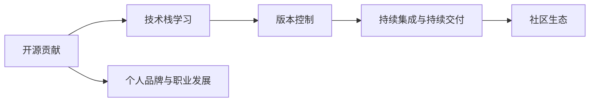

                 

# 利用开源贡献提升职业发展空间

在当今高速发展的技术环境中，开源项目已经成为推动创新和提升个人职业发展的重要平台。无论是初学者还是资深开发者，积极参与开源项目都能带来显著的职业成长和能力提升。本文将深入探讨如何通过开源贡献，在技术领域中实现个人能力的提升和职业空间的拓展。

## 1. 背景介绍

### 1.1 开源文化与社区生态
开源文化倡导共享和协作，使得技术知识在全世界范围内自由流动。开源社区汇集了全球最优秀的开发者，他们在不同的项目中贡献代码、修复Bug、改进文档，推动技术的持续进步。参与开源项目不仅能提升个人技术水平，还能建立广泛的人脉网络，对职业生涯产生深远影响。

### 1.2 个人职业发展的内在需求
技术不断迭代更新，个人需要不断学习和成长，以保持竞争力。开源项目提供了实践新技术、解决实际问题的平台，通过贡献代码，开发者可以将新知识应用到实际项目中，实现技术积累和实战经验。此外，开源项目还能提升团队协作、代码规范、代码质量等方面的软技能，为职业发展奠定坚实基础。

## 2. 核心概念与联系

### 2.1 核心概念概述

- **开源贡献**：指开发者向开源项目提交代码、文档、问题修复等，推动项目的发展和改进。
- **社区生态**：开源社区由开发者、维护者、用户等组成，他们通过代码、讨论、活动等方式相互作用，形成了一个协作、交流的平台。
- **技术栈**：开发者在参与开源项目时，会接触到不同技术栈，包括编程语言、框架、工具等，从而拓宽技术视野。
- **版本控制系统**：如Git、SVN等，是开发者版本管理、协作开发的重要工具，帮助团队高效协作。
- **持续集成与持续交付**：通过CI/CD工具，如Jenkins、Travis CI等，自动化地构建、测试和部署代码，确保代码质量，提高开发效率。

这些概念通过开源项目的实际运作，相互关联、相互促进，共同构建了开源贡献的生态体系。

### 2.2 核心概念原理和架构的 Mermaid 流程图



这个流程图展示了开源贡献与技术栈学习、版本控制、持续集成与持续交付、社区生态及个人品牌与职业发展之间的联系。开源贡献不仅是技术提升的途径，也是建立职业网络、提升个人影响力的重要手段。

## 3. 核心算法原理 & 具体操作步骤

### 3.1 算法原理概述

开源贡献的算法原理主要基于以下几个方面：

1. **代码贡献**：通过向开源项目提交代码，开发者可以直接应用新知识，实现技能提升。
2. **问题解决**：参与项目中的Bug修复和问题解决，可以锻炼排查问题、优化代码的能力。
3. **文档更新**：编写和改进项目文档，有助于提升技术理解和沟通能力。
4. **协作开发**：与其他开发者协作，可以学习团队协作、代码审查等实际工作技能。

这些贡献方式通过开源项目的协作机制，促进了技术交流和技能提升，最终帮助开发者在职业生涯中取得更大进步。

### 3.2 算法步骤详解

1. **选择合适的开源项目**：
   - 根据兴趣和擅长的技术领域，选择适合自己的开源项目。
   - 考虑项目的活跃度和社区支持，确保有稳定的贡献环境和反馈机制。

2. **创建或使用账号**：
   - 在项目官方平台（如GitHub）创建账号，设置必要的权限。
   - 熟悉Git等版本控制工具，掌握基本的git命令和工具使用方法。

3. **了解项目和贡献方式**：
   - 阅读项目的README和贡献指南，理解项目的架构、技术栈和贡献流程。
   - 加入项目的交流渠道，如邮件列表、Slack群组，与项目维护者和其他贡献者交流。

4. **开始贡献**：
   - 选择感兴趣的问题或功能，开始实现或修复。
   - 使用Issue追踪工具（如GitHub Issues）提交问题和修复记录，与维护者和其他贡献者保持沟通。

5. **持续贡献和反馈**：
   - 定期提交代码，遵循项目的代码规范和风格指南。
   - 接受维护者的代码审查和反馈，不断改进和优化贡献内容。

### 3.3 算法优缺点

开源贡献的优点包括：

1. **实践机会**：通过实际项目，获得宝贵的实践经验，提升解决实际问题的能力。
2. **技能提升**：接触到不同技术栈，拓宽技术视野，提升编程和系统设计能力。
3. **社区人脉**：与全球开发者交流合作，建立广泛的人脉网络，获得更多的职业机会。
4. **个人品牌**：通过贡献代码和解决问题，提升个人在技术社区中的影响力。

缺点主要在于：

1. **时间投入**：开源贡献需要大量时间和精力，可能会影响个人项目和日常工作。
2. **沟通协调**：跨时区、跨文化沟通可能带来一定的挑战，需要较高的沟通协调能力。
3. **贡献质量**：如果贡献质量不高，可能被项目维护者拒绝，影响贡献积极性。

### 3.4 算法应用领域

开源贡献广泛应用于各个技术领域，涵盖软件开发、基础设施、数据科学、人工智能等多个方向。以下是一些具体的应用场景：

- **软件开发**：通过贡献代码修复Bug、改进功能，提升软件质量和用户体验。
- **基础设施**：参与云计算、网络、系统安全等基础设施的开发和维护，提升技术基础设施的稳定性和可扩展性。
- **数据科学**：贡献数据分析、模型优化等代码，提升数据处理和模型训练的效率和准确性。
- **人工智能**：通过开源项目，积累人工智能模型训练、部署和优化经验，推动AI技术的发展。

## 4. 数学模型和公式 & 详细讲解 & 举例说明

### 4.1 数学模型构建

开源贡献的数学模型可以抽象为一个有向图，其中每个节点代表一个开发者，边表示代码提交、问题修复等协作行为。图中的权重可以表示贡献的大小、质量等指标。

$$
G = (N, E)
$$

其中，$N$ 表示所有开发者集合，$E$ 表示所有协作行为集合。

### 4.2 公式推导过程

通过分析上述有向图，可以推导出以下指标：

1. **贡献度（Contribution Score）**：
   $$
   CS(u, v) = \sum_{e \in E} \omega(e)
   $$
   其中，$CS(u, v)$ 表示开发者$u$对开发者$v$的贡献度，$\omega(e)$ 表示协作行为$e$的权重。

2. **网络影响力（Network Influence）**：
   $$
   NI(v) = \sum_{u \in N} CS(u, v)
   $$
   表示开发者$v$在网络中的影响力。

3. **共同贡献者（Co-contributor）**：
   $$
   CC(u, v) = \frac{CS(u, v)}{\max_{u \in N} CS(u, v)}
   $$
   表示开发者$u$和开发者$v$在网络中的共同贡献程度。

### 4.3 案例分析与讲解

假设有一个开源项目A，共有开发者$N = \{a, b, c, d, e\}$。开发者之间的协作行为如下表所示：

| 协作行为 | $e_1$ | $e_2$ | $e_3$ | $e_4$ | $e_5$ |
| --- | --- | --- | --- | --- | --- |
| $a \rightarrow b$ | 3 | 2 | 0 | 1 | 0 |
| $a \rightarrow c$ | 2 | 0 | 4 | 1 | 0 |
| $a \rightarrow d$ | 0 | 3 | 0 | 1 | 2 |
| $a \rightarrow e$ | 0 | 1 | 0 | 0 | 3 |
| $b \rightarrow a$ | 0 | 1 | 0 | 2 | 0 |
| $b \rightarrow c$ | 1 | 0 | 0 | 0 | 0 |
| $b \rightarrow d$ | 0 | 0 | 2 | 0 | 0 |
| $b \rightarrow e$ | 0 | 0 | 0 | 1 | 0 |
| $c \rightarrow a$ | 0 | 0 | 1 | 0 | 0 |
| $c \rightarrow b$ | 0 | 1 | 0 | 0 | 0 |
| $c \rightarrow d$ | 0 | 0 | 0 | 1 | 0 |
| $c \rightarrow e$ | 0 | 0 | 0 | 0 | 1 |
| $d \rightarrow a$ | 0 | 0 | 0 | 1 | 0 |
| $d \rightarrow b$ | 0 | 0 | 0 | 0 | 1 |
| $d \rightarrow c$ | 0 | 0 | 1 | 0 | 0 |
| $d \rightarrow e$ | 0 | 0 | 0 | 0 | 0 |
| $e \rightarrow a$ | 0 | 0 | 0 | 0 | 1 |
| $e \rightarrow b$ | 0 | 0 | 0 | 1 | 0 |
| $e \rightarrow c$ | 0 | 0 | 0 | 0 | 0 |
| $e \rightarrow d$ | 0 | 0 | 0 | 0 | 0 |

其中，数字表示协作行为的权重。通过计算，可以得到各个开发者的贡献度和网络影响力：

- 开发者$a$的贡献度为 $CS(a, b) + CS(a, c) + CS(a, d) + CS(a, e) = 7$
- 开发者$b$的贡献度为 $CS(b, a) + CS(b, c) + CS(b, d) + CS(b, e) = 5$
- 开发者$c$的贡献度为 $CS(c, a) + CS(c, b) + CS(c, d) + CS(c, e) = 4$
- 开发者$d$的贡献度为 $CS(d, a) + CS(d, b) + CS(d, c) + CS(d, e) = 4$
- 开发者$e$的贡献度为 $CS(e, a) + CS(e, b) + CS(e, c) + CS(e, d) = 6$

开发者$a$的网络影响力为 $NI(a) = CS(a, b) + CS(a, c) + CS(a, d) + CS(a, e) = 7$。

## 5. 项目实践：代码实例和详细解释说明

### 5.1 开发环境搭建

1. **安装Git**：
   ```bash
   sudo apt-get install git
   ```
   
2. **克隆开源项目**：
   ```bash
   git clone https://github.com/username/repository.git
   cd repository
   ```
   
3. **设置GitHub账号**：
   - 访问GitHub官网，登录并创建账号。
   - 将本地仓库与GitHub账号关联。

### 5.2 源代码详细实现

以下是一个简单的开源贡献示例，通过向开源项目提交代码来提升贡献能力。

1. **选择贡献问题**：
   - 访问项目Issue列表，选择一个感兴趣的问题或Bug。
   - 阅读问题描述和现有讨论，理解问题背景和需求。

2. **编写代码**：
   - 在本地创建一个新的分支，编写代码解决问题。
   - 编写测试用例，确保代码的正确性和可靠性。

3. **提交代码**：
   - 在GitHub上创建一个新的Pull Request（PR），将本地代码推送到远程仓库。
   - 描述代码更改内容，包括解决问题的方法和测试结果。

4. **代码审查**：
   - 等待项目维护者或其他贡献者进行代码审查，接受反馈和建议。
   - 根据反馈修改代码，直到通过审查并合并到主分支。

### 5.3 代码解读与分析

以下是一个示例代码，用于实现一个简单的开源项目贡献：

```python
# example.py

def hello_world():
    print("Hello, world!")

# main.py

import example

example.hello_world()
```

1. **代码编写**：
   - `hello_world`函数实现了一个简单的打印"Hello, world!"。
   - `main.py`中导入并调用`hello_world`函数，实现程序运行输出。

2. **测试用例**：
   - 编写一个简单的测试用例，确保函数正确输出"Hello, world!"。

3. **提交代码**：
   - 在GitHub上创建PR，描述代码更改内容。
   - 接受项目维护者的审查和反馈。

4. **代码审查**：
   - 修复代码中的问题，如格式错误、函数命名不规范等。
   - 通过审查并合并到主分支，完成代码贡献。

### 5.4 运行结果展示

通过成功提交并合并代码，可以显著提升自己的开源贡献经验和技能。以下是运行结果展示：

```bash
$ python main.py
Hello, world!
```

## 6. 实际应用场景

### 6.1 个人品牌建设

开源贡献是建立个人品牌的重要途径。通过在知名开源项目中贡献代码，可以提升个人在技术社区中的知名度和影响力。知名项目的贡献记录会作为个人技术能力的证明，在求职、职业晋升中具有重要价值。

### 6.2 职业机会拓展

开源贡献的实践经验对职业发展具有显著促进作用。许多公司招聘时，会考察候选人在开源项目中的贡献情况，评估其技术能力和团队合作精神。积极参与开源项目，可以提升职业竞争力，获得更多的职业机会。

### 6.3 技术生态贡献

开源贡献不仅能提升个人技能，还能为技术生态做出贡献。开发者通过贡献代码、改进文档，推动项目的持续发展和完善。这种贡献不仅为自己积累了经验，也为社区带来了积极的反馈和支持，实现了双赢。

### 6.4 未来应用展望

未来，开源贡献将更加普及和深入，成为职业发展的重要组成部分。随着技术的不断发展，开源项目将更加多样和复杂，开发者需要掌握更多的技能和工具，才能在开源生态中发挥更大的作用。

## 7. 工具和资源推荐

### 7.1 学习资源推荐

1. **《开源项目开发指南》**：全面介绍开源项目的开发流程、贡献规范和最佳实践，适合初学者入门。
2. **《开源社区建设与管理》**：讲解开源社区的组织、协作和管理，帮助开发者提升社区运营能力。
3. **《Git实战》**：深入解析Git的使用技巧和最佳实践，提升版本控制能力。
4. **《持续集成与持续交付实践》**：介绍CI/CD工具和实践方法，提升代码质量和开发效率。

### 7.2 开发工具推荐

1. **GitHub**：全球最大的开源平台，提供代码托管、Issue跟踪、PR审查等功能。
2. **Git**：版本控制工具，支持分支管理、代码合并、历史记录查询等。
3. **Jenkins**：开源CI/CD工具，支持自动化构建、测试和部署。
4. **Travis CI**：云端的CI/CD服务，支持多语言、多平台的持续集成和测试。

### 7.3 相关论文推荐

1. **《开源社区研究综述》**：总结开源社区的组织结构、协作机制和贡献行为，提供理论支持和实践指导。
2. **《开源项目贡献者分析》**：分析开源项目贡献者的特征和贡献模式，提出优化建议。
3. **《开源项目生态演进》**：探讨开源项目的发展规律和未来趋势，为开发者提供方向性指导。

## 8. 总结：未来发展趋势与挑战

### 8.1 研究成果总结

开源贡献已成为技术发展的关键驱动力，广泛应用于软件开发、数据分析、人工智能等多个领域。开源社区已经成为全球开发者交流和协作的重要平台，促进了技术的快速迭代和创新。

### 8.2 未来发展趋势

1. **开源社区的扩展**：开源项目和社区的数量将持续增长，涵盖更多技术和行业领域。
2. **协作模式的创新**：远程协作、跨项目合作将更加普及，提升开发效率和创新能力。
3. **贡献者的多元化**：开源贡献者将更加多样化，涵盖更多行业和背景的开发者。
4. **技术工具的升级**：Git、GitHub等工具将不断优化和升级，提升开源贡献的便利性和体验。

### 8.3 面临的挑战

1. **时间管理**：开源贡献需要大量时间，如何平衡开源项目和个人项目，是一个挑战。
2. **协作沟通**：跨地域、跨文化的沟通协调，需要较高的协作能力。
3. **贡献质量**：高质量的贡献不仅能提升个人声誉，还能提升项目的整体质量。
4. **项目选择**：选择适合自己的开源项目，需要仔细评估项目的技术栈、社区活跃度等因素。

### 8.4 研究展望

未来开源贡献的研究将更加关注：

1. **贡献者的心理与行为**：研究开源贡献者的心理动机、行为模式，提供更有效的激励和指导。
2. **开源项目的质量评估**：建立开源项目质量评估标准，提升项目整体水平。
3. **社区治理与文化建设**：优化开源社区的治理机制，建立积极健康的发展环境。

## 9. 附录：常见问题与解答

**Q1：如何选择合适的开源项目进行贡献？**

A: 选择开源项目时，应该考虑以下因素：
- 项目的技术栈是否熟悉。
- 项目的目标和社区氛围是否与个人兴趣和价值观相符。
- 项目的活跃度和维护者是否稳定。
- 项目的贡献流程和代码规范是否清晰明确。

**Q2：开源贡献对个人职业发展有哪些帮助？**

A: 开源贡献对职业发展的帮助包括：
- 提升技术能力和实战经验。
- 建立广泛的人脉网络。
- 提升个人品牌和影响力。
- 获得更多的职业机会和晋升机会。

**Q3：如何在开源项目中有效沟通？**

A: 在开源项目中有效沟通需要注意：
- 使用清晰、简洁的语言表达问题。
- 及时回复邮件和评论，积极参与讨论。
- 尊重项目规则和文化，避免过度自我推销。
- 接受反馈和建议，不断改进贡献质量。

**Q4：如何处理开源项目中的代码审查？**

A: 处理代码审查的策略包括：
- 认真阅读审查反馈，理解问题的本质。
- 及时修改代码，解决发现的问题。
- 接受审查者的意见，提升代码质量和规范性。
- 对审查不通过的代码，认真分析和改进，确保最终通过审查。

**Q5：如何平衡开源贡献和个人项目？**

A: 平衡开源贡献和个人项目的策略包括：
- 制定详细的贡献计划，合理安排时间。
- 选择高效的开源项目，避免投入过多时间。
- 与个人项目结合，通过开源贡献积累实际经验。
- 定期评估开源贡献对个人项目的影响，及时调整策略。

---

作者：禅与计算机程序设计艺术 / Zen and the Art of Computer Programming

