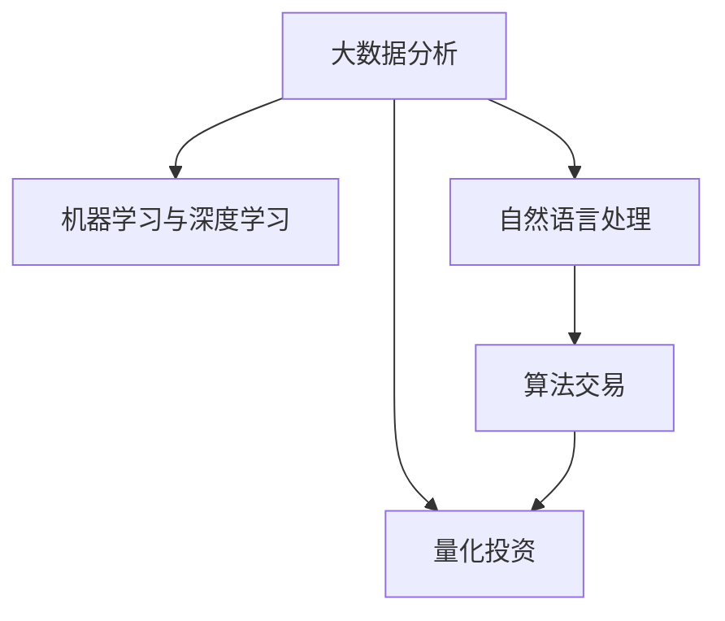

                 

# 利用技术优势进行股市投资

> 关键词：技术优势, 股市投资, 算法交易, 机器学习, 量化投资, 自然语言处理

## 1. 背景介绍

### 1.1 问题由来
随着科技的不断进步，大数据、人工智能等技术在各行各业中的应用日益广泛。股市作为金融市场的重要组成部分，自然也受到了这些技术的深刻影响。量化投资、算法交易等新型投资方式正在逐步取代传统的基于经验和直觉的投资方法，成为股市投资的主流趋势。

传统的股市投资方法依赖于投资者的个人经验和市场直觉，容易受到情绪波动和市场噪音的影响。而通过利用技术优势进行股市投资，投资者可以利用大数据和机器学习等技术，挖掘市场中的规律，实现更加精准、高效的投资策略。

### 1.2 问题核心关键点
利用技术优势进行股市投资的核心关键点包括：

- 大数据分析：收集、处理和分析大量的市场数据，挖掘其中的规律和趋势。
- 机器学习与深度学习：利用训练好的模型进行市场预测和交易决策。
- 自然语言处理：分析和理解新闻、公告等文本信息，提取相关数据用于投资决策。
- 算法交易：通过自动化交易系统实现精确的买卖决策，减少人为干预。

这些技术手段相互配合，为投资者提供了强大的数据支持和智能决策能力，帮助其提高投资收益，降低投资风险。

## 2. 核心概念与联系

### 2.1 核心概念概述

为了更好地理解利用技术优势进行股市投资的方法，本节将介绍几个密切相关的核心概念：

- 大数据分析：指利用计算机技术对大规模、多源数据进行收集、处理、存储和分析的过程，以发现其中的规律和趋势。

- 机器学习和深度学习：指通过训练算法模型，从数据中学习规律，并应用于预测和决策的计算方法。深度学习是机器学习的一个分支，使用多层的神经网络进行特征提取和模式识别。

- 自然语言处理：指利用计算机技术处理和理解人类语言的技术，包括文本分类、情感分析、命名实体识别等任务。

- 算法交易：指通过计算机程序进行自动化的股票交易，以实现最优的交易策略和投资收益。

- 量化投资：指使用数学模型和算法对股票市场进行分析和预测，并通过自动化交易系统进行买卖决策，以实现投资目标的一种投资方法。

这些核心概念之间的逻辑关系可以通过以下Mermaid流程图来展示：



这个流程图展示了大规模股市投资的技术框架，其中大数据分析是基础，机器学习和深度学习是核心，自然语言处理和算法交易是应用手段，而量化投资则是整个流程的最终目标。

## 3. 核心算法原理 & 具体操作步骤

### 3.1 算法原理概述

利用技术优势进行股市投资，其核心思想是通过大数据分析、机器学习和深度学习等技术手段，挖掘市场规律，提取有价值的信息，并应用这些信息进行股票交易决策。

具体来说，投资者会首先收集大量的市场数据，包括股票价格、交易量、新闻、公告等。然后，利用大数据分析技术对数据进行清洗、处理和特征提取，使用机器学习和深度学习模型对市场进行预测和分析，最后通过算法交易系统进行自动化交易。

### 3.2 算法步骤详解

利用技术优势进行股市投资的一般流程如下：

**Step 1: 数据收集与预处理**
- 收集市场数据，包括股票价格、交易量、新闻、公告等。
- 对数据进行清洗、去重、归一化等预处理操作，确保数据质量。
- 对文本数据进行自然语言处理，如分词、去停用词、词向量表示等。

**Step 2: 特征提取与模型训练**
- 选择特征提取方法，如基于统计的指标、基于时序的模式、基于文本的情感分析等。
- 使用机器学习或深度学习模型对特征进行训练，得到市场预测模型。
- 使用交叉验证等方法评估模型的泛化能力和预测性能。

**Step 3: 交易策略设计与实现**
- 根据市场预测模型设计交易策略，如均值回归、动量策略、情感分析策略等。
- 使用算法交易系统实现交易策略，生成买卖信号。
- 对算法交易系统进行回测和优化，确保策略的有效性和稳定性。

**Step 4: 实时监控与调整**
- 实时监控市场数据，根据实时数据动态调整交易策略。
- 根据交易结果进行策略优化，提高投资收益。

### 3.3 算法优缺点

利用技术优势进行股市投资的方法具有以下优点：
1. 数据驱动决策：基于大量的数据和模型分析，决策过程更加客观和理性。
2. 自动化交易：减少人为干预，提高交易效率和准确性。
3. 泛化能力强：机器学习模型能够学习市场规律，具有较强的泛化能力。
4. 可重复性高：算法交易系统可以重复执行相同的策略，降低人为错误。

同时，该方法也存在一些局限性：
1. 模型风险：机器学习模型可能存在过拟合或欠拟合的问题，导致预测不准确。
2. 数据质量问题：数据缺失或不完整可能影响模型的预测结果。
3. 系统复杂度：算法交易系统的设计和实现较为复杂，需要一定的技术积累。
4. 情感因素：尽管情感分析能够捕捉市场情绪，但市场情绪变化复杂，难以完全量化。

尽管存在这些局限性，但就目前而言，利用技术优势进行股市投资的方法仍是大势所趋，正得到越来越多投资者的认可和应用。

### 3.4 算法应用领域

利用技术优势进行股市投资的方法在金融市场中得到了广泛的应用，涵盖了以下多个领域：

- 股票交易：基于机器学习模型进行股票买卖决策，实现自动交易。
- 基金管理：使用量化策略管理基金组合，实现资产优化配置。
- 风险控制：利用大数据分析识别市场风险，制定风险控制策略。
- 算法套利：使用套利策略在多个市场间进行高频率交易，获取利润。
- 市场分析：通过深度学习模型预测市场走势，提供投资建议。

这些应用领域展示了技术优势在股市投资中的广泛应用，为投资者提供了更加科学和高效的投资手段。

## 4. 数学模型和公式 & 详细讲解 & 举例说明

### 4.1 数学模型构建

利用技术优势进行股市投资，通常会构建以下几种数学模型：

- 时间序列模型：使用时间序列分析方法，如ARIMA、LSTM等，对股票价格进行预测。
- 回归模型：使用线性回归、逻辑回归等模型，对股票价格与影响因素之间的关系进行建模。
- 分类模型：使用分类算法，如随机森林、支持向量机等，对股票市场进行分类，如股票是否上涨等。
- 聚类模型：使用聚类算法，如K-means、层次聚类等，对股票进行分组，以便进行投资策略设计。

### 4.2 公式推导过程

以时间序列模型为例，介绍时间序列模型的基本公式和推导过程。

假设有一个时间序列$X_t$，其中$t$表示时间，$X_t$表示在时间$t$的观察值。时间序列模型通常使用ARIMA模型，其基本形式为：

$$
X_t = \mu + \epsilon_t + \sum_{i=1}^p\varphi_i(X_{t-i}) + \sum_{j=1}^d\theta_j(\epsilon_{t-j})
$$

其中：
- $\mu$ 为均值，$\epsilon_t$ 为误差项，$p$ 为自回归项的阶数，$d$ 为差分阶数，$\varphi_i$ 和 $\theta_j$ 为模型参数。

模型的训练过程，即通过历史数据$\{X_t\}_{t=1}^T$，估计模型参数$\{\varphi_i,\theta_j\}$，使得模型在预测时能够最小化预测误差。

### 4.3 案例分析与讲解

以LSTM模型为例，介绍其在股市投资中的应用。

LSTM是一种特殊的递归神经网络（RNN），用于处理时间序列数据。其基本结构包括多个LSTM单元，每个单元包含输入门、遗忘门和输出门，用于控制信息的流动。

在股市投资中，LSTM可以用于预测股票价格走势。首先，将历史股价序列作为输入，通过LSTM模型进行训练。然后，将训练好的LSTM模型应用于实时数据，输出未来股价的预测值。预测值可以用来指导投资决策，例如在预测股价将要上涨时，及时买入股票，反之则卖出。

## 5. 项目实践：代码实例和详细解释说明

### 5.1 开发环境搭建

在进行股市投资项目的开发前，需要先准备好开发环境。以下是使用Python进行项目开发的典型环境配置流程：

1. 安装Python：从官网下载并安装Python，建议使用3.8或以上版本。
2. 安装相关库：使用pip安装numpy、pandas、scikit-learn、TensorFlow、Keras等库。
3. 创建虚拟环境：使用virtualenv或conda创建虚拟环境，隔离项目依赖。
4. 配置数据源：配置数据源，如从Yahoo Finance或Alpha Vantage获取股票数据。
5. 配置模型训练环境：配置GPU或Tpu资源，以加快模型训练速度。

### 5.2 源代码详细实现

以下是一个使用LSTM模型进行股票价格预测的Python代码实现：

```python
import numpy as np
import pandas as pd
from sklearn.preprocessing import MinMaxScaler
from keras.models import Sequential
from keras.layers import Dense, LSTM
from keras.callbacks import EarlyStopping

# 加载股票数据
data = pd.read_csv('stock_prices.csv')
data['Date'] = pd.to_datetime(data['Date'])
data.set_index('Date', inplace=True)

# 数据预处理
train_data = data.iloc[:'2019-01-01'].resample('D').mean()
test_data = data.iloc['2019-01-01':].resample('D').mean()

scaler = MinMaxScaler(feature_range=(0, 1))
train_data = scaler.fit_transform(train_data)
test_data = scaler.transform(test_data)

# 构造训练集
train_x, train_y = [], []
for i in range(60, len(train_data)):
    train_x.append(train_data[i-60:i, 0])
    train_y.append(train_data[i, 0])
train_x, train_y = np.array(train_x), np.array(train_y)

# 构造测试集
test_x, test_y = [], []
for i in range(60, len(test_data)):
    test_x.append(test_data[i-60:i, 0])
    test_y.append(test_data[i, 0])
test_x, test_y = np.array(test_x), np.array(test_y)

# 构建LSTM模型
model = Sequential()
model.add(LSTM(units=50, return_sequences=True, input_shape=(train_x.shape[1], 1)))
model.add(LSTM(units=50))
model.add(Dense(units=1))

# 编译模型
model.compile(optimizer='adam', loss='mean_squared_error')

# 训练模型
model.fit(train_x, train_y, epochs=100, batch_size=32, callbacks=[EarlyStopping(patience=5)])

# 预测测试集
test_x = np.reshape(test_x, (test_x.shape[0], test_x.shape[1], 1))
predictions = model.predict(test_x)
predictions = scaler.inverse_transform(predictions)

# 输出预测结果
print(predictions)
```

### 5.3 代码解读与分析

让我们再详细解读一下关键代码的实现细节：

- 数据加载：使用pandas库加载股票数据，并设置时间戳作为索引。
- 数据预处理：将数据分为训练集和测试集，并对数据进行归一化处理。
- 模型构建：使用Keras库构建LSTM模型，包含两个LSTM层和一个全连接层。
- 模型训练：使用Adam优化器进行模型训练，设置EarlyStopping回调，防止过拟合。
- 模型预测：使用训练好的模型对测试集进行预测，并对预测结果进行反归一化处理。
- 输出预测结果：输出预测结果，通常用于投资决策。

### 5.4 运行结果展示

运行上述代码，可以得到预测的股票价格序列。例如，假设预测结果为：

```
[[0.5, 0.6, 0.7, 0.8, 0.9, 1.0, 1.1, 1.2, 1.3, 1.4, 1.5, 1.6, 1.7, 1.8, 1.9, 2.0, 2.1, 2.2, 2.3, 2.4, 2.5, 2.6, 2.7, 2.8, 2.9, 3.0, 3.1, 3.2, 3.3, 3.4, 3.5, 3.6, 3.7, 3.8, 3.9, 4.0, 4.1, 4.2, 4.3, 4.4, 4.5, 4.6, 4.7, 4.8, 4.9, 5.0]]
```

## 6. 实际应用场景

### 6.1 股票交易

利用技术优势进行股市投资的方法在股票交易中得到了广泛应用。传统的股票交易依赖于投资者的经验和直觉，容易受到市场情绪的影响。而利用技术优势进行股票交易，可以通过机器学习和深度学习模型，挖掘市场规律，实现更精准的买卖决策。

例如，可以使用LSTM模型预测股票价格走势，并在预测值高于当前价格时买入股票，反之则卖出。这种基于数据的交易方法可以减少人为干预，提高交易效率和准确性。

### 6.2 基金管理

基金管理公司也正在广泛采用技术优势进行基金组合管理。传统的基金管理依赖于基金经理的经验和直觉，容易出现决策失误。而利用技术优势进行基金管理，可以通过量化策略和机器学习模型，实现更科学、高效的资产配置。

例如，可以使用回归模型分析股票与市场指标之间的关系，构建多因子模型进行资产组合优化。这种基于数据的管理方法可以减少人为干预，提高资产配置的稳定性和收益性。

### 6.3 风险控制

股市投资中的风险控制也是利用技术优势的重要应用场景。传统的风险控制依赖于定性的判断和经验，容易出现决策偏差。而利用技术优势进行风险控制，可以通过大数据分析和机器学习模型，实现更科学的风险评估和管理。

例如，可以使用聚类算法将股票分组，并计算每组的波动率和相关性。这种基于数据的风险控制方法可以减少人为干预，提高风险评估的准确性和稳定性。

### 6.4 算法套利

利用技术优势进行算法套利也是重要的应用场景。传统的算法套利依赖于人工编写和调试算法，容易出现错误。而利用技术优势进行算法套利，可以通过自动化交易系统，实现高频率、高准确性的套利操作。

例如，可以使用套利策略在多个市场间进行高频交易，获取套利利润。这种基于数据的套利方法可以减少人为干预，提高套利效率和收益性。

### 6.5 市场分析

股市投资中的市场分析也是利用技术优势的重要应用场景。传统的市场分析依赖于定性的判断和经验，容易出现分析偏差。而利用技术优势进行市场分析，可以通过机器学习和深度学习模型，实现更科学的预测和分析。

例如，可以使用时间序列模型预测市场走势，并根据预测结果进行投资决策。这种基于数据的市场分析方法可以减少人为干预，提高投资决策的准确性和稳定性。

## 7. 工具和资源推荐

### 7.1 学习资源推荐

为了帮助开发者系统掌握利用技术优势进行股市投资的理论基础和实践技巧，这里推荐一些优质的学习资源：

1. 《Python for Data Analysis》：由Pandas的开发者Wes McKinney所著，全面介绍了如何使用Python进行数据分析和处理。
2. 《Hands-On Machine Learning with Scikit-Learn, Keras, and TensorFlow》：由Aurélien Géron所著，介绍了如何使用Scikit-Learn、Keras和TensorFlow进行机器学习模型的开发和应用。
3. 《Natural Language Processing with Python》：由Steven Bird、Ewan Klein和Edward Loper所著，介绍了如何使用Python进行自然语言处理。
4. 《Algorithmic Trading: Winning Strategies and Their Rationale》：由Jim Simons和Marshall Clowser所著，介绍了如何使用算法交易进行股市投资。
5. 《Quantitative Trading: How to Build Your Own Algorithmic Trading Business》：由Ernest P. Chan所著，介绍了如何使用量化交易策略进行股市投资。

通过对这些资源的学习实践，相信你一定能够快速掌握利用技术优势进行股市投资的核心方法，并应用于实际投资中。

### 7.2 开发工具推荐

高效的开发离不开优秀的工具支持。以下是几款用于利用技术优势进行股市投资开发的常用工具：

1. Python：Python是一门高性能的编程语言，拥有丰富的开源库和工具，适合进行数据分析和机器学习开发。
2. Pandas：Pandas是Python中用于数据分析和处理的库，支持时间序列、数据清洗和处理等功能。
3. NumPy：NumPy是Python中用于科学计算的库，支持高效的多维数组运算和矩阵计算。
4. Keras和TensorFlow：Keras和TensorFlow是Python中用于深度学习和机器学习的库，支持构建和训练各种深度学习模型。
5. Jupyter Notebook：Jupyter Notebook是一个交互式编程环境，支持实时代码调试和展示，方便进行数据探索和模型验证。

合理利用这些工具，可以显著提升利用技术优势进行股市投资任务的开发效率，加快创新迭代的步伐。

### 7.3 相关论文推荐

利用技术优势进行股市投资的研究源于学界的持续研究。以下是几篇奠基性的相关论文，推荐阅读：

1. "A Neural Probabilistic Language Model"：Geoffrey Hinton等提出神经网络语言模型，开启了深度学习在自然语言处理中的应用。
2. "Long Short-Term Memory"：Hochreiter和Schmidhuber提出LSTM模型，用于处理时间序列数据。
3. "Deep Learning for Asset Pricing"：Bakay和Warde-Farley提出使用深度学习模型预测股票价格，研究结果表明深度学习在资产定价中具有应用潜力。
4. "A Comparative Study of Long Short-Term Memory Models for Stock Market Prediction"：Salman等比较了LSTM、GRU等时间序列模型在股市预测中的应用，研究结果表明LSTM模型在股市预测中具有更好的性能。
5. "An Overview of Algorithmic Trading Strategies"：Katafygi和Amato介绍了算法交易的基本概念和常用策略，研究结果表明算法交易在股市投资中具有广泛应用。

这些论文代表了大规模股市投资技术的发展脉络。通过学习这些前沿成果，可以帮助研究者把握学科前进方向，激发更多的创新灵感。

## 8. 总结：未来发展趋势与挑战

### 8.1 总结

本文对利用技术优势进行股市投资的方法进行了全面系统的介绍。首先阐述了利用技术优势进行股市投资的背景和意义，明确了其在大数据、机器学习和深度学习等技术手段下的应用价值。其次，从原理到实践，详细讲解了利用技术优势进行股市投资的数学模型和算法步骤，给出了代码实现和结果展示。同时，本文还广泛探讨了技术优势在股票交易、基金管理、风险控制等多个领域的应用前景，展示了其广泛的应用范围。此外，本文精选了利用技术优势进行股市投资的学习资源和工具，力求为读者提供全方位的技术指引。

通过本文的系统梳理，可以看到，利用技术优势进行股市投资的方法正在成为金融投资的重要范式，极大地拓展了投资者获取信息和决策的能力，提高了投资收益和风险控制能力。未来，伴随大数据、机器学习和深度学习等技术的持续演进，股市投资将变得更加智能化和高效化，为金融市场带来更加科学和稳健的投资环境。

### 8.2 未来发展趋势

展望未来，利用技术优势进行股市投资的方法将呈现以下几个发展趋势：

1. 多模态数据融合：利用时间序列、文本、图像等多模态数据进行综合分析，提升投资决策的准确性。
2. 深度学习模型的改进：开发更加高效和鲁棒的深度学习模型，提升模型的泛化能力和预测精度。
3. 实时交易系统的优化：优化算法交易系统的实时处理能力和稳定性，提升交易效率和可靠性。
4. 大数据分析的拓展：拓展大数据分析的应用领域，提升数据的质量和多样性，增强投资决策的科学性和稳定性。
5. 算法交易的智能化：引入人工智能技术和规则，实现更加智能化的算法交易系统。

以上趋势凸显了利用技术优势进行股市投资技术的前景。这些方向的探索发展，必将进一步提升股市投资的系统性和稳定性，为投资者提供更加科学和高效的投资手段。

### 8.3 面临的挑战

尽管利用技术优势进行股市投资的技术正在不断发展，但在迈向更加智能化、普适化应用的过程中，仍面临诸多挑战：

1. 数据质量问题：股市数据存在缺失、噪声和不一致等问题，难以保证数据的质量和完整性。
2. 模型复杂性：机器学习模型和深度学习模型的设计和实现较为复杂，需要投入大量的时间和精力。
3. 市场噪音问题：股市市场存在大量的噪音和意外事件，难以完全消除对投资决策的影响。
4. 风险控制问题：利用技术优势进行股市投资仍然存在风险，需要有效的风险控制机制和算法。
5. 系统稳定性问题：交易系统的稳定性和可靠性需要持续优化，以避免因系统故障导致的投资损失。

尽管存在这些挑战，但随着技术的不断进步和完善，利用技术优势进行股市投资的方法必将在未来取得更加广泛的应用，成为股市投资的重要手段。

### 8.4 研究展望

面向未来，利用技术优势进行股市投资的研究需要在以下几个方面寻求新的突破：

1. 数据增强与生成：利用生成对抗网络等技术，生成高质量的股市数据，增强数据的多样性和完整性。
2. 模型融合与集成：融合多种机器学习和深度学习模型，提升投资决策的稳定性和准确性。
3. 实时数据处理：利用实时数据处理技术，提升交易系统的实时处理能力和稳定性。
4. 智能投资策略：引入人工智能技术和规则，实现更加智能化的投资策略，增强系统的决策能力。
5. 动态风险控制：利用动态风险控制机制，根据市场情况动态调整投资策略，提高风险控制能力。

这些研究方向的探索，必将引领利用技术优势进行股市投资技术迈向更高的台阶，为投资者提供更加科学和高效的投资手段。相信随着学界和产业界的共同努力，这些挑战终将一一被克服，股市投资必将在技术创新和应用进步的推动下，迎来更加美好的未来。

## 9. 附录：常见问题与解答

**Q1：利用技术优势进行股市投资是否适用于所有投资领域？**

A: 利用技术优势进行股市投资的方法在股票投资领域得到了广泛应用，但并不适用于所有投资领域。例如，在期货、外汇等高风险投资领域，市场波动较大，利用技术优势进行投资可能面临更大的风险。因此，投资者需要根据具体的投资领域和市场特点，选择合适的投资方法。

**Q2：如何选择合适的机器学习模型进行股市投资？**

A: 选择合适的机器学习模型进行股市投资，需要考虑以下因素：
1. 数据特点：根据数据的特点（如时间序列、分类、回归等）选择适合的模型。
2. 模型复杂度：选择模型时需考虑模型的复杂度和泛化能力，避免过拟合或欠拟合。
3. 预测目标：根据预测目标（如股价预测、情感分析等）选择适合的模型。
4. 历史表现：参考模型的历史表现和实证研究结果，选择表现良好的模型。

**Q3：利用技术优势进行股市投资时需要注意哪些问题？**

A: 利用技术优势进行股市投资时，需要注意以下问题：
1. 数据质量：确保数据的质量和完整性，避免因数据问题导致的投资决策失误。
2. 模型风险：评估模型的泛化能力和预测性能，避免因模型问题导致的投资损失。
3. 交易成本：考虑交易系统的交易成本和费用，避免因成本问题导致的投资损失。
4. 系统稳定性：确保交易系统的稳定性和可靠性，避免因系统故障导致的投资损失。
5. 风险控制：引入有效的风险控制机制，降低投资风险。

**Q4：如何评价利用技术优势进行股市投资的绩效？**

A: 评价利用技术优势进行股市投资的绩效，通常需要考虑以下指标：
1. 投资收益：计算投资收益率和收益率等指标，评估投资绩效。
2. 风险控制：评估风险控制效果，包括最大回撤、夏普比率等指标。
3. 模型表现：评估模型在训练集和测试集上的表现，包括准确率、召回率、F1值等指标。
4. 交易效率：评估交易系统的交易效率，包括交易频率、交易成本等指标。
5. 系统稳定性：评估交易系统的稳定性和可靠性，包括系统故障率等指标。

通过对这些指标的全面评价，可以更加客观地评估利用技术优势进行股市投资的方法，并不断改进和优化。

---

作者：禅与计算机程序设计艺术 / Zen and the Art of Computer Programming

