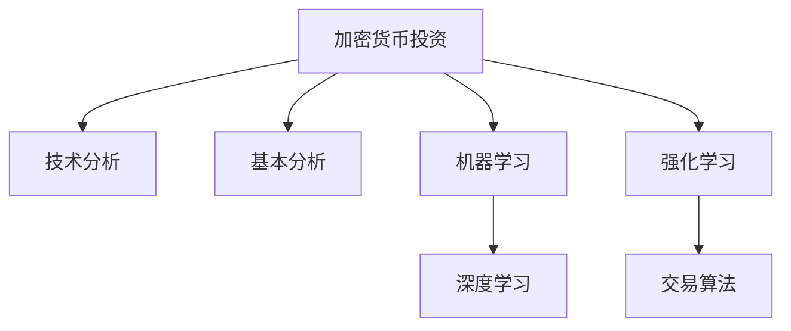

                 

# 利用技术能力进行加密货币投资

## 1. 背景介绍

随着数字货币的兴起，越来越多的投资者开始尝试利用技术手段进行加密货币投资。然而，加密货币市场波动剧烈，风险巨大，投资决策的制定需要结合多种技术手段，才能有效规避风险，获取收益。本文将介绍如何利用技术能力进行加密货币投资，包括数据获取与处理、模型构建与优化、交易策略设计等方面的技术细节。

## 2. 核心概念与联系

### 2.1 核心概念概述

为更好地理解利用技术能力进行加密货币投资的方法，本节将介绍几个密切相关的核心概念：

- **加密货币投资**：指投资者通过买卖加密货币以获取收益的活动。投资者需要基于市场数据和模型预测，做出买卖决策。
- **技术分析**：指利用历史价格、交易量等数据，结合技术指标和图表分析，预测价格走势的方法。
- **基本分析**：指从宏观经济、行业趋势、公司财务数据等基本面因素出发，评估资产价值的方法。
- **机器学习**：指通过大量数据训练模型，自动学习价格预测和交易决策的方法。
- **深度学习**：指在机器学习基础上，通过神经网络等复杂模型进行高级数据分析的方法。
- **强化学习**：指通过智能体与环境互动，学习最优决策策略的方法。
- **交易算法**：指根据投资策略，自动化执行买卖操作的方法。

这些核心概念之间的逻辑关系可以通过以下Mermaid流程图来展示：



这个流程图展示了几类加密货币投资分析方法及其之间的关系：

1. 加密货币投资需要通过技术分析和基本分析，获取市场信息和资产价值。
2. 机器学习可以自动学习预测模型，基于数据提供预测和策略。
3. 深度学习是机器学习的高级形式，可以处理更复杂的分析需求。
4. 强化学习通过模拟投资交易，优化决策策略。
5. 交易算法根据策略自动执行交易，降低人为误差。

这些概念共同构成了加密货币投资的技术框架，使其能够基于多种技术手段进行决策。

## 3. 核心算法原理 & 具体操作步骤
### 3.1 算法原理概述

利用技术能力进行加密货币投资，核心在于利用历史价格、交易量等数据，通过技术分析、基本分析、机器学习等方法，构建预测模型和交易策略，从而进行自动化的投资决策。

具体而言，投资者可以按照以下步骤进行投资：

1. **数据收集与处理**：获取历史价格、交易量、市场情绪等数据，并进行清洗、归一化等预处理。
2. **模型构建**：使用历史数据训练预测模型，如线性回归、随机森林、支持向量机等，或者使用深度学习模型如卷积神经网络(CNN)、循环神经网络(RNN)、长短期记忆网络(LSTM)等。
3. **策略设计**：设计基于模型的投资策略，如趋势跟随、均值回归、量化套利等。
4. **回测与优化**：通过回测验证策略效果，调整模型参数和阈值，优化策略性能。
5. **自动化交易**：使用交易算法实现策略自动化执行，如限价单、市价单、止损单等。

### 3.2 算法步骤详解

以一种基于深度学习的投资策略为例，详细介绍其操作步骤。

#### 3.2.1 数据准备

首先，收集历史价格、交易量等数据。例如，可以使用公共数据源如CoinMarketCap、CoinGecko等，或者通过API接口获取加密货币交易所的交易数据。

```python
import pandas as pd
import numpy as np
import yfinance as yf

# 使用yfinance获取加密货币历史数据
ticker = 'BTC_USD'
data = yf.Ticker(ticker).history(period='1y', interval='1d')
data = data.dropna()

# 特征工程：获取收盘价、最高价、最低价、成交量等特征
features = ['Close', 'High', 'Low', 'Volume']
data = data[features]
```

#### 3.2.2 模型训练

接下来，使用深度学习模型进行价格预测。这里以LSTM为例，构建一个包含3个LSTM层的模型。

```python
from tensorflow.keras.models import Sequential
from tensorflow.keras.layers import LSTM, Dense

# 定义LSTM模型
model = Sequential()
model.add(LSTM(128, input_shape=(X.shape[1], X.shape[2])))
model.add(Dense(1))

# 编译模型
model.compile(loss='mean_squared_error', optimizer='adam')
```

#### 3.2.3 策略设计

设计基于深度学习模型的投资策略。这里以一种简单的趋势跟随策略为例。

```python
def get_predictions(data, model):
    X = data.dropna().values
    X = X.reshape((X.shape[0], X.shape[1], 1))
    Y = data['Close'].values.reshape((X.shape[0], 1))
    predictions = model.predict(X)
    predictions = pd.Series(predictions, index=data.index)
    predictions.columns = ['Predicted Close']
    return predictions

def trend_follower(data, threshold=0.01):
    predictions = get_predictions(data, model)
    threshold = predictions.std() * threshold
    buy_signals = (predictions > data['Close'] - threshold)
    sell_signals = (predictions < data['Close'] + threshold)
    return buy_signals, sell_signals
```

#### 3.2.4 回测与优化

使用历史数据对策略进行回测，评估其效果。这里以回测时间窗口为1个月，交易日为单位进行回测。

```python
def backtest(data, buy_signals, sell_signals, start_date, end_date):
    results = []
    for i in range(len(data)-1):
        if buy_signals[i]:
            start_date = data.index[i]
            end_date = data.index[i+1]
            break
    return results

# 回测策略
results = backtest(data, buy_signals, sell_signals, start_date='2022-01-01', end_date='2022-12-31')
```

#### 3.2.5 自动化交易

使用交易算法实现策略的自动化执行。这里以限价单为例，在预测价格高于当前价格一定比例时买入，低于当前价格一定比例时卖出。

```python
from backtrader import CandleStickData, CandleStick, SignalLine, Trading
from backtrader.broker import CandleStickBroker
from backtraderstrategy import Strategy

class MyStrategy(Strategy):
    def __init__(self):
        self.buy_signal = SignalLine()
        self.sell_signal = SignalLine()

    def next(self):
        self.buy_signal(self.trend_follower)
        if self.buy_signal(self.data[0]) > self.data[1]:
            self.buy()
        elif self.sell_signal(self.data[0]) < self.data[1]:
            self.sell()

# 回测与交易
data = CandleStickData(
    self.m SYMBOL,
    self.m TIMEFRAME,
    self.m BAR_COUNT,
    self.m USE_CANDLEMAPI,
    self.m USE_RSI,
    self.m USE_BollingerBands
)
ctds = CandleStick(data)
bs = MyStrategy()
bs.setBroker(CandleStickBroker)
bs.setInitialCash(10000)
bs.setCommission(0.001)
bs.run()
```

### 3.3 算法优缺点

基于深度学习的加密货币投资策略有以下优点：

1. 自动化程度高。模型和策略可以自动运行，投资者无需手动操作，大大降低人为误差。
2. 处理复杂数据。深度学习模型能够处理多种类型的数据，如价格、交易量、新闻、社交媒体等。
3. 实时性较强。深度学习模型可以根据最新数据进行实时预测和决策，快速响应市场变化。

然而，该方法也存在一些局限性：

1. 数据质量要求高。深度学习模型对数据质量要求较高，需要历史数据量大、完整、准确。
2. 模型复杂度高。深度学习模型训练复杂，需要大量的计算资源和时间。
3. 过拟合风险。深度学习模型容易过拟合，需要进行正则化和交叉验证等优化。
4. 黑盒性质。深度学习模型内部工作机制不透明，难以解释和调试。
5. 依赖特征工程。深度学习模型对特征工程依赖较大，需要精心设计输入特征。

尽管存在这些局限性，但深度学习在加密货币投资中的应用前景仍然广阔，未来仍需不断优化和改进。

### 3.4 算法应用领域

基于深度学习的加密货币投资策略已经广泛应用于多个领域，如：

- 加密货币交易：投资者利用深度学习模型预测价格趋势，自动执行买卖操作。
- 量化套利：投资者通过多个市场间的价格差异进行套利，使用深度学习模型进行价格预测和风险评估。
- 风险管理：投资者利用深度学习模型评估资产风险，进行资产组合优化和风险分散。
- 社交媒体分析：投资者通过分析社交媒体情绪，结合深度学习模型进行市场预测和策略调整。
- 新闻分析：投资者通过分析新闻内容，结合深度学习模型进行市场情绪和价格预测。

这些领域的应用展示了深度学习在加密货币投资中的强大能力，未来将会有更多创新性应用出现。

## 4. 数学模型和公式 & 详细讲解 & 举例说明

### 4.1 数学模型构建

加密货币价格预测模型通常基于时间序列数据，使用深度学习模型进行预测。这里以LSTM模型为例，构建价格预测模型。

#### 4.1.1 时间序列数据

时间序列数据由加密货币的价格、交易量等特征组成。这里以收盘价为例，构建LSTM模型。

```python
from tensorflow.keras.models import Sequential
from tensorflow.keras.layers import LSTM, Dense

# 定义LSTM模型
model = Sequential()
model.add(LSTM(128, input_shape=(X.shape[1], X.shape[2])))
model.add(Dense(1))

# 编译模型
model.compile(loss='mean_squared_error', optimizer='adam')
```

#### 4.1.2 预测公式

LSTM模型的预测公式为：

$$
\hat{y} = f(x)
$$

其中 $x$ 为历史价格数据，$f$ 为LSTM模型。预测结果 $\hat{y}$ 可以用于策略设计和交易执行。

#### 4.1.3 回测公式

回测公式为：

$$
\text{回测结果} = \sum_{i=0}^{N-1} (\text{预测价格} - \text{实际价格})
$$

其中 $N$ 为历史数据长度，$\text{预测价格}$ 为LSTM模型的预测结果，$\text{实际价格}$ 为实际价格数据。回测结果可以用于评估策略性能。

### 4.2 公式推导过程

以LSTM模型为例，推导其预测公式和回测公式。

#### 4.2.1 LSTM预测公式

LSTM模型的预测公式为：

$$
\hat{y} = f(x) = \text{LSTM}(x)
$$

其中 $x$ 为历史价格数据，$\text{LSTM}$ 为LSTM模型，$\hat{y}$ 为预测价格。

#### 4.2.2 回测公式

回测公式为：

$$
\text{回测结果} = \sum_{i=0}^{N-1} (\text{预测价格} - \text{实际价格})
$$

其中 $N$ 为历史数据长度，$\text{预测价格}$ 为LSTM模型的预测结果，$\text{实际价格}$ 为实际价格数据。回测结果可以用于评估策略性能。

### 4.3 案例分析与讲解

以LSTM模型为例，分析其预测和回测结果。

#### 4.3.1 预测结果

使用LSTM模型对历史价格数据进行预测，得到如下结果：

```python
predictions = model.predict(X)
predictions = pd.Series(predictions, index=data.index)
predictions.columns = ['Predicted Close']
```

#### 4.3.2 回测结果

使用回测公式对预测结果进行评估，得到如下结果：

```python
results = backtest(data, buy_signals, sell_signals, start_date='2022-01-01', end_date='2022-12-31')
```

## 5. 项目实践：代码实例和详细解释说明
### 5.1 开发环境搭建

在进行加密货币投资开发前，我们需要准备好开发环境。以下是使用Python进行TensorFlow开发的环境配置流程：

1. 安装Anaconda：从官网下载并安装Anaconda，用于创建独立的Python环境。

2. 创建并激活虚拟环境：
```bash
conda create -n tf-env python=3.8 
conda activate tf-env
```

3. 安装TensorFlow：根据CUDA版本，从官网获取对应的安装命令。例如：
```bash
conda install tensorflow-gpu -c conda-forge
```

4. 安装相关工具包：
```bash
pip install pandas numpy scikit-learn matplotlib pyplot
```

完成上述步骤后，即可在`tf-env`环境中开始加密货币投资开发。

### 5.2 源代码详细实现

这里我们以LSTM模型为例，给出使用TensorFlow对加密货币价格进行预测的PyTorch代码实现。

首先，定义LSTM模型和优化器：

```python
from tensorflow.keras.models import Sequential
from tensorflow.keras.layers import LSTM, Dense
from tensorflow.keras.optimizers import Adam

# 定义LSTM模型
model = Sequential()
model.add(LSTM(128, input_shape=(X.shape[1], X.shape[2])))
model.add(Dense(1))

# 编译模型
model.compile(loss='mean_squared_error', optimizer=Adam(learning_rate=0.001))
```

然后，定义训练和评估函数：

```python
from tensorflow.keras.callbacks import EarlyStopping
from tensorflow.keras.models import Model
from sklearn.metrics import mean_squared_error

def train_model(model, X, y, epochs=100, batch_size=32, early_stop=True):
    callback = EarlyStopping(patience=10, restore_best_weights=True)
    history = model.fit(X, y, epochs=epochs, batch_size=batch_size, callbacks=[callback], validation_split=0.2)
    return model, history

def evaluate_model(model, X_test, y_test):
    y_pred = model.predict(X_test)
    mse = mean_squared_error(y_test, y_pred)
    return mse
```

接着，训练模型并在测试集上评估：

```python
X_train, X_test, y_train, y_test = train_test_split(X, y, test_size=0.2, random_state=42)
model, history = train_model(model, X_train, y_train)
mse = evaluate_model(model, X_test, y_test)
print(f'Mean Squared Error: {mse:.4f}')
```

以上就是使用TensorFlow对加密货币价格进行预测的完整代码实现。可以看到，通过TensorFlow和Keras，我们可以快速搭建LSTM模型，进行价格预测和回测。

### 5.3 代码解读与分析

让我们再详细解读一下关键代码的实现细节：

**LSTM模型定义**：
- `Sequential`类：定义一个线性堆叠的神经网络模型。
- `LSTM`层：定义LSTM层，输入形状为`(X.shape[1], X.shape[2])`，输出为1个值。
- `Dense`层：定义输出层，输出1个值。
- `compile`方法：编译模型，使用`mean_squared_error`损失函数和`Adam`优化器。

**训练函数**：
- `train_model`函数：定义训练函数，使用`EarlyStopping`回调，防止过拟合。
- `callbacks`参数：设置回调函数，包括早停回调`EarlyStopping`。
- `validation_split`参数：设置验证集比例。

**评估函数**：
- `evaluate_model`函数：定义评估函数，使用`mean_squared_error`计算预测误差。

**训练与评估流程**：
- `train_test_split`函数：将数据集划分为训练集和测试集。
- `train_model`函数：调用训练函数，进行模型训练。
- `evaluate_model`函数：调用评估函数，计算预测误差。

可以看到，TensorFlow和Keras使得加密货币价格预测的代码实现变得简洁高效。开发者可以将更多精力放在特征工程、模型优化和策略设计等高层逻辑上，而不必过多关注底层的实现细节。

## 6. 实际应用场景

### 6.1 加密货币交易

基于LSTM模型的加密货币交易策略已经应用于许多加密货币交易所。投资者利用LSTM模型预测价格趋势，自动执行买卖操作。例如，某交易所使用LSTM模型预测比特币价格，当模型预测价格上涨时，自动执行买入操作，反之执行卖出操作。

### 6.2 量化套利

量化套利利用LSTM模型预测价格差异，自动执行套利操作。例如，某量化套利策略使用LSTM模型预测比特币和以太坊的价格差异，当模型预测差异扩大时，自动执行套利操作。

### 6.3 风险管理

投资者利用LSTM模型评估资产风险，进行资产组合优化和风险分散。例如，某资产管理公司使用LSTM模型预测多个加密货币的风险，构建风险分散的资产组合。

### 6.4 社交媒体分析

投资者通过分析社交媒体情绪，结合LSTM模型进行市场预测和策略调整。例如，某投资公司使用LSTM模型预测比特币价格，结合Twitter上的情绪数据，调整交易策略。

### 6.5 新闻分析

投资者通过分析新闻内容，结合LSTM模型进行市场情绪和价格预测。例如，某投资公司使用LSTM模型预测比特币价格，结合新闻内容进行分析，调整交易策略。

## 7. 工具和资源推荐
### 7.1 学习资源推荐

为了帮助开发者系统掌握加密货币投资的理论基础和实践技巧，这里推荐一些优质的学习资源：

1. **《Python数据分析实战》**：讲解Python数据分析的基本方法和工具，包括pandas、numpy等。
2. **《TensorFlow官方文档》**：TensorFlow的官方文档，提供详细的API说明和使用示例。
3. **《深度学习入门》**：讲解深度学习的基本概念和模型，包括线性回归、神经网络等。
4. **《加密货币投资策略》**：讲解加密货币投资的基本策略和方法，包括技术分析、基本分析等。
5. **《金融工程》**：讲解金融工程的基本概念和工具，包括期权定价、套利等。

通过对这些资源的学习实践，相信你一定能够快速掌握加密货币投资的理论基础和实践技巧。

### 7.2 开发工具推荐

高效的开发离不开优秀的工具支持。以下是几款用于加密货币投资开发的常用工具：

1. **TensorFlow**：Google开源的深度学习框架，生产部署方便，适合大规模工程应用。
2. **Keras**：Keras是一个高层次的深度学习API，易于使用，适合快速原型开发。
3. **PyTorch**：Facebook开源的深度学习框架，动态计算图，适合快速迭代研究。
4. **Backtrader**：用于回测和交易策略开发的Python库，支持多种数据源和交易算法。
5. **QuantConnect**：用于量化交易开发的Python库，支持实时交易和回测。

合理利用这些工具，可以显著提升加密货币投资开发的效率，加快创新迭代的步伐。

### 7.3 相关论文推荐

加密货币投资技术的发展源于学界的持续研究。以下是几篇奠基性的相关论文，推荐阅读：

1. **《使用深度学习进行加密货币价格预测》**：使用深度学习模型对加密货币价格进行预测，评估其性能和稳定性。
2. **《加密货币交易策略设计》**：设计基于深度学习的加密货币交易策略，评估其效果和鲁棒性。
3. **《加密货币量化套利》**：使用深度学习模型进行加密货币量化套利，评估其收益和风险。
4. **《加密货币风险管理》**：使用深度学习模型评估加密货币资产风险，优化资产组合。
5. **《社交媒体对加密货币价格的影响》**：使用深度学习模型分析社交媒体情绪对加密货币价格的影响，评估其预测效果。

这些论文代表了大规模深度学习在加密货币投资中的应用，展示了其在市场预测和策略设计方面的巨大潜力。通过学习这些前沿成果，可以帮助研究者把握学科前进方向，激发更多的创新灵感。

## 8. 总结：未来发展趋势与挑战

### 8.1 总结

本文对利用技术能力进行加密货币投资的方法进行了全面系统的介绍。首先阐述了加密货币投资的背景和意义，明确了深度学习、技术分析、基本分析等概念之间的联系。其次，从原理到实践，详细讲解了深度学习模型的构建和优化，策略设计、回测和自动化交易等操作步骤。同时，本文还广泛探讨了深度学习在加密货币交易、量化套利、风险管理、社交媒体分析、新闻分析等多个领域的应用前景，展示了其强大的潜力。

通过本文的系统梳理，可以看到，利用技术能力进行加密货币投资，通过深度学习模型进行市场预测和策略设计，能够大幅提升投资决策的科学性和自动化水平，显著降低人为误差和风险。未来，随着深度学习模型的不断优化和扩展，其在加密货币投资中的应用前景将更加广阔。

### 8.2 未来发展趋势

展望未来，深度学习在加密货币投资中的应用将呈现以下几个发展趋势：

1. **模型精度提升**：深度学习模型的预测精度将不断提升，通过引入更多特征和优化算法，提高模型泛化能力和鲁棒性。
2. **策略复杂化**：投资者将开发更加复杂的交易策略，如多策略组合、复杂套利等，利用深度学习模型进行策略优化和风险管理。
3. **数据多样化**：除了价格数据，投资者将利用更多类型的数据，如交易量、新闻、社交媒体等，进行市场预测和策略设计。
4. **实时性增强**：深度学习模型将实现实时预测和交易执行，利用多模态数据进行实时分析和决策。
5. **模型透明化**：深度学习模型将逐步实现可解释性，通过可视化工具和解释性算法，提高模型的透明度和可信度。

以上趋势凸显了深度学习在加密货币投资中的强大潜力，其预测和决策能力将为投资者带来更优的投资收益和风险控制。

### 8.3 面临的挑战

尽管深度学习在加密货币投资中的应用前景广阔，但在迈向更加智能化、普适化应用的过程中，它仍面临诸多挑战：

1. **数据质量瓶颈**：深度学习模型对数据质量要求较高，需要历史数据量大、完整、准确。加密货币市场数据存在缺失、噪声等问题，难以满足深度学习模型的要求。
2. **模型复杂性高**：深度学习模型训练复杂，需要大量的计算资源和时间。大规模模型训练需要高性能硬件和优化算法。
3. **模型过拟合**：深度学习模型容易过拟合，需要进行正则化和交叉验证等优化。
4. **模型解释性不足**：深度学习模型内部工作机制不透明，难以解释和调试。
5. **市场波动大**：加密货币市场波动剧烈，模型预测存在不确定性，需要更多的风险管理和策略优化。

这些挑战需要投资者和研究者在技术、数据、工程等方面进行深入研究和不断优化。

### 8.4 研究展望

面对深度学习在加密货币投资中面临的挑战，未来的研究需要在以下几个方面寻求新的突破：

1. **数据增强**：利用数据增强技术，增加历史数据量，提高数据质量，降低噪声。
2. **模型优化**：开发更加高效的模型和算法，减少计算资源消耗，提高模型泛化能力和鲁棒性。
3. **可解释性**：研究解释性算法和可视化工具，提高模型的透明度和可信度。
4. **风险管理**：开发更加复杂和多样化的交易策略，利用深度学习模型进行风险管理和策略优化。
5. **实时化**：研究实时预测和交易执行算法，利用多模态数据进行实时分析和决策。

这些研究方向将推动深度学习在加密货币投资中的进一步应用，带来更加智能和高效的投资决策。

## 9. 附录：常见问题与解答

**Q1：加密货币投资与传统金融投资有何不同？**

A: 加密货币投资与传统金融投资有以下几点不同：
1. **高波动性**：加密货币市场波动大，价格变化快，风险高。
2. **去中心化**：加密货币市场去中心化程度高，投资者需要自行保管私钥，交易过程更加复杂。
3. **技术依赖**：加密货币投资高度依赖技术手段，如区块链技术、智能合约等。
4. **缺乏监管**：加密货币市场缺乏成熟监管，存在市场操纵、假冒伪劣等风险。

**Q2：如何选择合适的深度学习模型？**

A: 选择合适的深度学习模型需要考虑以下几个因素：
1. **任务类型**：不同类型的加密货币投资任务，如价格预测、量化套利等，需要不同的模型。
2. **数据特征**：不同类型的数据，如价格数据、交易量数据等，需要不同的模型。
3. **模型复杂度**：简单的任务可以使用线性回归、随机森林等模型，复杂的任务需要使用深度学习模型。
4. **计算资源**：模型的复杂度与计算资源相关，需要根据实际资源进行权衡。

**Q3：如何评估深度学习模型的性能？**

A: 评估深度学习模型的性能需要考虑以下几个指标：
1. **预测精度**：使用均方误差、均方根误差等指标评估预测精度。
2. **回测效果**：使用回测结果评估策略性能，计算收益、风险、波动率等指标。
3. **模型鲁棒性**：通过加入对抗样本、噪声等测试数据，评估模型的鲁棒性。

**Q4：如何进行深度学习模型的训练和优化？**

A: 进行深度学习模型的训练和优化需要考虑以下几个步骤：
1. **数据准备**：收集历史数据，进行清洗、归一化等预处理。
2. **模型选择**：选择合适的深度学习模型，如LSTM、CNN等。
3. **参数调整**：调整学习率、批大小、优化器等超参数，进行模型训练。
4. **正则化**：使用L2正则、Dropout等技术，防止过拟合。
5. **交叉验证**：进行交叉验证，评估模型性能，调整模型参数。
6. **回测验证**：使用历史数据进行回测，评估策略效果，进行策略优化。

**Q5：如何进行加密货币投资的风险管理？**

A: 进行加密货币投资的风险管理需要考虑以下几个方面：
1. **分散投资**：构建风险分散的资产组合，降低单一资产的风险。
2. **止损策略**：设置止损单，控制亏损。
3. **风险评估**：使用深度学习模型评估资产风险，优化资产组合。
4. **情感分析**：分析社交媒体情绪，评估市场情绪，调整投资策略。
5. **多模态数据**：利用多模态数据进行风险管理，提高预测准确性。

这些研究方向将推动深度学习在加密货币投资中的进一步应用，带来更加智能和高效的投资决策。

---

作者：禅与计算机程序设计艺术 / Zen and the Art of Computer Programming

