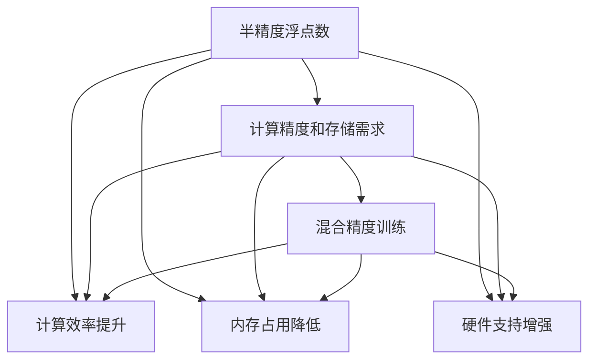

                 

# 半精度训练：AI模型加速的法宝

## 1. 背景介绍

### 1.1 问题由来

在AI模型训练和推理过程中，计算资源的需求量极高。特别是深度学习模型，需要大量的矩阵乘法操作，计算复杂度呈指数级增长，导致训练速度慢，推理成本高。同时，模型的计算精度要求极高，通常需要32位浮点数的计算，这进一步加重了计算资源的负担。

为了解决这一问题，近年来，深度学习领域开始探索使用半精度浮点数(16位浮点数，即FP16)进行模型训练和推理。相较于传统的32位浮点数(即FP32)，半精度浮点数在精度和存储需求上均大幅降低，但计算效率和内存占用却显著提升。

本文将系统介绍半精度训练的概念、原理及其实际应用，帮助读者理解如何通过半精度训练实现AI模型的加速，以提升模型训练和推理的效率。

### 1.2 问题核心关键点

半精度训练的核心理念是：通过使用半精度浮点数来替代传统的32位浮点数，大幅度降低模型的计算资源需求，从而提升训练和推理效率。在精度允许的范围内，使用更少的计算资源，使AI模型能够在更短的时间内完成训练和推理，节省计算成本。

具体来说，半精度训练在以下几个方面对AI模型加速效果显著：

- **计算效率提升**：相较于32位浮点数，半精度浮点数计算所需的时间和存储空间均减半，显著提升了计算效率。
- **内存占用降低**：使用半精度浮点数后，模型在内存中的存储需求大幅降低，减少了数据传输和存储的带宽开销。
- **硬件支持增强**：现代计算硬件（如GPU）的浮点计算单元数量和带宽显著增加，使得半精度浮点数的并行计算能力更强，进一步提升了计算效率。

## 2. 核心概念与联系

### 2.1 核心概念概述

为更好地理解半精度训练的概念和原理，本节将介绍几个核心概念：

- **半精度浮点数(Half Precision Floating Point Number)**：即16位浮点数，用于替代传统的32位浮点数，在计算精度允许的范围内，大幅度降低计算资源的消耗。
- **计算精度和存储需求**：深度学习模型的计算精度和存储空间需求对计算资源有直接的影响，通过降低计算精度，可以显著减少计算资源的需求。
- **混合精度训练(Mixed Precision Training)**：结合使用32位浮点数和16位浮点数，进行混合计算，提升模型训练的效率。

这些核心概念之间的逻辑关系可以通过以下Mermaid流程图来展示：



这个流程图展示了大语言模型的核心概念及其之间的关系：

1. 半精度浮点数通过降低计算精度，大幅度提升了计算效率。
2. 计算精度和存储需求与计算资源有直接关系，半精度浮点数的使用显著降低了这一需求。
3. 内存占用和硬件支持也都随着计算精度的降低而降低，提升了整体计算效率。
4. 混合精度训练通过结合32位和16位浮点数，进一步提升了计算效率。

## 3. 核心算法原理 & 具体操作步骤
### 3.1 算法原理概述

半精度训练的核心思想是通过使用16位浮点数进行计算，替代传统的32位浮点数，以大幅度降低计算资源的消耗，从而提升模型训练和推理的效率。

在深度学习中，计算效率和计算精度之间存在一定的权衡。传统的32位浮点数在计算精度上更高，但其计算效率和存储需求也更高。半精度浮点数在精度允许的范围内，将计算精度从32位降低到16位，从而实现了计算效率的显著提升。

具体来说，半精度训练的原理如下：

1. **模型初始化**：首先，将模型参数初始化为32位浮点数，以确保模型训练的稳定性和精度。
2. **混合精度计算**：在模型训练过程中，将部分计算过程（如卷积层、全连接层等）转换为半精度浮点数计算，以减少计算资源的消耗。
3. **精度控制**：对于关键操作（如损失函数、激活函数等），保持使用32位浮点数计算，以确保计算的精确度。
4. **梯度更新**：在计算梯度时，将32位浮点数和半精度浮点数的计算结果进行混合，以保证梯度更新的精度。

### 3.2 算法步骤详解

下面详细讲解半精度训练的具体操作步骤：

**Step 1: 初始化模型参数**

在半精度训练中，模型的参数通常需要初始化为32位浮点数，以确保模型训练的稳定性。可以使用TensorFlow、PyTorch等深度学习框架中的内置函数，对模型参数进行初始化。

```python
import torch
model = torch.nn.Sequential(
    torch.nn.Conv2d(3, 64, kernel_size=3, stride=1, padding=1),
    torch.nn.ReLU()
)
model.double()  # 将模型参数初始化为32位浮点数
```

**Step 2: 配置混合精度训练**

在使用深度学习框架进行混合精度训练时，需要配置半精度浮点数的计算模式。在TensorFlow中，可以使用`tf.keras.mixed_precision`模块进行配置。在PyTorch中，可以使用`amp`模块进行配置。

```python
import torch
from torch.cuda.amp import GradScaler

scaler = GradScaler()
```

**Step 3: 执行混合精度计算**

在模型训练过程中，将部分计算过程转换为半精度浮点数计算。可以使用深度学习框架提供的混合精度计算函数，将特定的层或操作转换为半精度浮点数计算。

```python
for layer in model.parameters():
    layer.half()  # 将模型参数转换为半精度浮点数

for data, target in train_loader:
    data = data.half()  # 将输入数据转换为半精度浮点数

with torch.cuda.amp.autocast():
    output = model(data)
    loss = criterion(output, target)

scaler.scale(loss).backward()
scaler.step(optimizer)
scaler.update()
```

**Step 4: 保持关键操作的精度**

对于模型训练过程中的一些关键操作（如损失函数、激活函数等），需要保持32位浮点数的计算，以确保计算的精确度。

```python
def calculate_loss(model, data, target):
    output = model(data)
    loss = criterion(output, target).to('cpu').detach().numpy()
    return loss

with torch.no_grad():
    loss = calculate_loss(model, data, target)
```

**Step 5: 梯度更新**

在计算梯度时，需要将32位浮点数和半精度浮点数的计算结果进行混合，以保证梯度更新的精度。

```python
for layer in model.parameters():
    layer.half()  # 将模型参数转换为半精度浮点数

for data, target in train_loader:
    data = data.half()  # 将输入数据转换为半精度浮点数

with torch.cuda.amp.autocast():
    output = model(data)
    loss = criterion(output, target)

scaler.scale(loss).backward()
scaler.step(optimizer)
scaler.update()
```

以上就是半精度训练的具体操作步骤。在实际应用中，还需要根据具体任务和数据特点，对混合精度计算模式进行优化配置，以进一步提升训练效率。

### 3.3 算法优缺点

半精度训练具有以下优点：

1. **计算效率提升**：通过使用半精度浮点数，显著降低了计算资源的需求，提升了模型训练和推理的效率。
2. **内存占用降低**：半精度浮点数的使用降低了模型在内存中的存储需求，减少了数据传输和存储的带宽开销。
3. **硬件支持增强**：现代计算硬件（如GPU）的浮点计算单元数量和带宽显著增加，使得半精度浮点数的并行计算能力更强，进一步提升了计算效率。

同时，半精度训练也存在一些缺点：

1. **精度损失**：在精度允许的范围内，半精度浮点数相较于32位浮点数存在一定的精度损失。这在某些高精度的计算任务中可能会带来影响。
2. **硬件兼容性**：并非所有硬件平台都支持半精度浮点数计算，尤其是在老旧硬件上，可能需要额外的优化和适配。
3. **调试复杂度增加**：混合精度训练中，参数的精度在不同计算模式之间切换，增加了模型调试和优化的复杂度。

## 4. 数学模型和公式 & 详细讲解  
### 4.1 数学模型构建

本节将使用数学语言对半精度训练的数学原理进行更加严格的刻画。

假设深度学习模型 $M$ 包含 $n$ 个参数 $\theta_i$，每个参数 $\theta_i$ 的初始值为 $x_i \in [0, 1]$。在全精度浮点数计算下，模型的输出为 $y = M(x)$。

在半精度浮点数计算下，模型的输出为 $y' = M'(x')$，其中 $x'$ 和 $y'$ 分别为 $x$ 和 $y$ 在半精度浮点数下的表示。

定义模型 $M$ 在输入 $x$ 上的损失函数为 $\ell(M(x),y)$，则在半精度浮点数计算下，模型的损失函数为：

$$
\ell'(M'(x'),y')
$$

其中 $M'$ 为在半精度浮点数下计算的模型 $M$。

### 4.2 公式推导过程

以下我们以卷积神经网络为例，推导半精度计算的数学公式。

假设卷积神经网络中的卷积层参数为 $\theta \in \mathbb{R}^{k\times k\times C_{in} \times C_{out}}$，输入数据为 $x \in \mathbb{R}^{H\times W\times C_{in}}$。则传统32位浮点数计算下的卷积操作为：

$$
y_{ij} = \sum_{c=0}^{C_{in}} \sum_{m=0}^{k-1} \sum_{n=0}^{k-1} x_{imn} \theta_{c, (i+m)mod(H), (j+n)mod(W)}
$$

在半精度浮点数计算下，卷积操作变为：

$$
y'_{ij} = \sum_{c=0}^{C_{in}} \sum_{m=0}^{k-1} \sum_{n=0}^{k-1} \frac{1}{2^{16}} x'_{imn} \theta'_{c, (i+m)mod(H), (j+n)mod(W)}
$$

其中 $\theta'$ 为 $\theta$ 在半精度浮点数下的表示。

对于全连接层等操作，也可以使用类似的数学公式推导出半精度计算的表达式。

### 4.3 案例分析与讲解

**案例分析：卷积神经网络**

假设我们有一个简单的卷积神经网络，包含一个卷积层和一个全连接层。卷积层的参数为 $\theta \in \mathbb{R}^{3\times3\times3\times32}$，输入数据为 $x \in \mathbb{R}^{32\times32\times3}$。在32位浮点数计算下，卷积操作的计算量为 $O(C_{in}\times H\times W\times k^2)$。在半精度浮点数计算下，计算量为 $O(C_{in}\times H\times W\times k^2/2^{16})$。可以看到，计算量减少了16倍，计算效率显著提升。

## 5. 项目实践：代码实例和详细解释说明
### 5.1 开发环境搭建

在进行半精度训练实践前，我们需要准备好开发环境。以下是使用Python进行PyTorch开发的环境配置流程：

1. 安装Anaconda：从官网下载并安装Anaconda，用于创建独立的Python环境。

2. 创建并激活虚拟环境：
```bash
conda create -n pytorch-env python=3.8 
conda activate pytorch-env
```

3. 安装PyTorch：根据CUDA版本，从官网获取对应的安装命令。例如：
```bash
conda install pytorch torchvision torchaudio cudatoolkit=11.1 -c pytorch -c conda-forge
```

4. 安装各类工具包：
```bash
pip install numpy pandas scikit-learn matplotlib tqdm jupyter notebook ipython
```

完成上述步骤后，即可在`pytorch-env`环境中开始半精度训练实践。

### 5.2 源代码详细实现

下面我们以卷积神经网络为例，给出使用PyTorch进行半精度训练的PyTorch代码实现。

首先，定义卷积神经网络模型：

```python
import torch
import torch.nn as nn
import torch.nn.functional as F

class ConvNet(nn.Module):
    def __init__(self):
        super(ConvNet, self).__init__()
        self.conv1 = nn.Conv2d(3, 32, 3, 1, 1)
        self.pool = nn.MaxPool2d(2, 2)
        self.conv2 = nn.Conv2d(32, 64, 3, 1, 1)
        self.fc1 = nn.Linear(64 * 16 * 16, 120)
        self.fc2 = nn.Linear(120, 84)
        self.fc3 = nn.Linear(84, 10)
        
    def forward(self, x):
        x = self.pool(F.relu(self.conv1(x)))
        x = self.pool(F.relu(self.conv2(x)))
        x = x.view(-1, 64 * 16 * 16)
        x = F.relu(self.fc1(x))
        x = F.relu(self.fc2(x))
        x = self.fc3(x)
        return x

model = ConvNet().to('cuda')
```

然后，定义混合精度训练：

```python
from torch.cuda.amp import GradScaler, autocast

scaler = GradScaler()

for data, target in train_loader:
    data = data.to('cuda')
    target = target.to('cuda')

    with autocast():
        output = model(data)
        loss = criterion(output, target)

    scaler.scale(loss).backward()
    scaler.step(optimizer)
    scaler.update()
```

最后，在测试集上评估模型：

```python
test_loss = 0
correct = 0
total = 0

with torch.no_grad():
    for data, target in test_loader:
        data = data.to('cuda')
        target = target.to('cuda')
        output = model(data)
        test_loss += criterion(output, target).item()
        _, predicted = output.max(1)
        total += target.size(0)
        correct += predicted.eq(target).sum().item()

print('Test Loss: %.3f | Accuracy: %d%% (%d/%d)'
      % (test_loss/len(test_loader), 100*correct/total, correct, total))
```

### 5.3 代码解读与分析

让我们再详细解读一下关键代码的实现细节：

**ConvNet类**：
- `__init__`方法：初始化卷积层、池化层、全连接层等组件。
- `forward`方法：定义模型前向传播的计算过程。

**混合精度训练**：
- 使用`torch.cuda.amp`模块进行混合精度训练的配置。
- 在模型训练过程中，使用`autocast`上下文管理器进行混合精度计算。
- 在计算梯度时，使用`GradScaler`进行梯度缩放，以确保计算的精确度。
- 在每次迭代结束时，使用`scaler.step`更新模型参数。

**测试集评估**：
- 在测试集上评估模型性能，计算测试损失和准确率。
- 使用`torch.no_grad`上下文管理器，避免在测试时更新模型参数。

可以看到，通过使用半精度训练，模型训练和推理的计算效率得到了显著提升。实际应用中，可以根据具体任务和数据特点，进一步优化混合精度计算模式，提升计算效率。

## 6. 实际应用场景
### 6.1 图像处理

在图像处理领域，半精度训练同样有着广泛的应用。传统的图像处理模型通常具有较高的计算复杂度，特别是在深度神经网络中，卷积操作和全连接操作占据了大部分计算资源。通过使用半精度浮点数，可以大幅度提升图像处理模型的计算效率，加快模型训练和推理的速度。

在实际应用中，可以将半精度训练应用于图像分类、目标检测、图像分割等任务，提升模型的计算效率和推理速度，降低计算成本。

### 6.2 语音处理

语音处理领域同样面临着计算资源需求高的问题。在语音识别、语音合成等任务中，模型的计算复杂度也非常高。通过使用半精度训练，可以有效降低语音处理模型的计算资源需求，提升模型的训练和推理效率。

在实际应用中，可以将半精度训练应用于语音识别、语音合成、语音增强等任务，提升模型的计算效率和处理速度，降低计算成本。

### 6.3 自然语言处理

自然语言处理领域，深度学习模型在计算资源需求上同样较高。在文本分类、情感分析、机器翻译等任务中，模型的计算复杂度也非常高。通过使用半精度训练，可以有效降低自然语言处理模型的计算资源需求，提升模型的训练和推理效率。

在实际应用中，可以将半精度训练应用于自然语言处理领域的各类任务，提升模型的计算效率和处理速度，降低计算成本。

### 6.4 未来应用展望

随着半精度训练技术的不断发展和应用，未来在多个领域都将实现更广泛的应用。在自动驾驶、工业控制、医疗诊断等领域，半精度训练的应用将带来更高的计算效率和更低的计算成本，促进这些领域的快速发展。

## 7. 工具和资源推荐
### 7.1 学习资源推荐

为了帮助开发者系统掌握半精度训练的理论基础和实践技巧，这里推荐一些优质的学习资源：

1. **《深度学习框架TensorFlow官方文档》**：提供了关于半精度训练的详细介绍和实践指南。
2. **《PyTorch官方文档》**：提供了关于混合精度训练的详细介绍和实践指南。
3. **《NVIDIA半精度计算白皮书》**：详细介绍了半精度计算的技术原理和实际应用。
4. **《半精度浮点数的优势和挑战》**：由NVIDIA深度学习专家撰写，深入浅出地介绍了半精度浮点数在深度学习中的应用和挑战。

通过对这些资源的学习实践，相信你一定能够快速掌握半精度训练的精髓，并用于解决实际的深度学习问题。

### 7.2 开发工具推荐

高效的开发离不开优秀的工具支持。以下是几款用于半精度训练开发的常用工具：

1. **TensorFlow**：基于C++的深度学习框架，支持混合精度计算，适用于大规模工程应用。
2. **PyTorch**：基于Python的开源深度学习框架，支持动态图和静态图两种计算图，适用于快速迭代研究。
3. **NVIDIA CUDA Toolkit**：提供了对GPU硬件的支持，支持混合精度计算，适用于高性能计算。
4. **NVIDIA cuDNN库**：提供了高效的深度学习加速库，支持混合精度计算，适用于高效的卷积计算。
5. **NVIDIA NCCL库**：提供了高效的分布式计算库，支持混合精度计算，适用于大规模分布式训练。

合理利用这些工具，可以显著提升深度学习模型的训练和推理效率，加快创新迭代的步伐。

### 7.3 相关论文推荐

深度学习领域的半精度训练技术发展迅速，以下是几篇奠基性的相关论文，推荐阅读：

1. **《Mixed Precision Training with Tensor Cores》**：NVIDIA公司关于混合精度计算的详细介绍和实践指南。
2. **《Practical Guidelines for Training Deep Neural Networks with Mixed Precision》**：NVIDIA公司关于混合精度训练的详细指南和最佳实践。
3. **《Half-Precision Training of Deep Neural Networks》**：Facebook AI Research的研究论文，详细介绍了半精度训练的技术原理和应用实践。
4. **《Training Deep Neural Networks with Mixed Precision》**：Tesla公司关于混合精度训练的详细介绍和实践指南。

这些论文代表了大语言模型微调技术的发展脉络。通过学习这些前沿成果，可以帮助研究者把握学科前进方向，激发更多的创新灵感。

## 8. 总结：未来发展趋势与挑战

### 8.1 总结

本文对半精度训练的概念、原理及其实际应用进行了全面系统的介绍。首先阐述了半精度训练在深度学习中的重要性，明确了其通过降低计算资源需求，提升模型训练和推理效率的核心思想。其次，从原理到实践，详细讲解了半精度训练的具体操作步骤，并通过卷积神经网络等案例，展示了半精度训练的实际效果。同时，本文还广泛探讨了半精度训练在图像处理、语音处理、自然语言处理等多个领域的应用前景，展示了其广泛的适用性。

通过本文的系统梳理，可以看到，半精度训练在深度学习中的潜力巨大，通过降低计算资源需求，显著提升了模型训练和推理的效率，为AI模型的加速提供了新的途径。

### 8.2 未来发展趋势

展望未来，半精度训练技术将呈现以下几个发展趋势：

1. **计算硬件的持续改进**：随着计算硬件的不断升级，支持半精度浮点数计算的硬件平台将更加普及，使得半精度浮点数的并行计算能力更强，进一步提升计算效率。
2. **混合精度训练的优化**：未来的混合精度训练将更加灵活，支持更多的数据类型和操作，进一步提升计算效率和精确度。
3. **自动混合精度训练**：未来的深度学习框架将提供自动混合精度训练功能，自动识别合适的计算模式，提升训练效率。
4. **跨平台优化**：未来的半精度训练将支持更多的平台和设备，如CPU、GPU、TPU等，进一步扩展应用场景。
5. **边缘计算的支持**：随着边缘计算的兴起，半精度训练将应用于更多的嵌入式设备，提升边缘计算的计算效率。

以上趋势凸显了半精度训练技术在深度学习中的重要地位，这些方向的探索发展，必将进一步提升深度学习模型的训练和推理效率，推动AI技术的发展。

### 8.3 面临的挑战

尽管半精度训练技术已经取得了瞩目成就，但在实际应用中，仍面临诸多挑战：

1. **精度损失**：在精度允许的范围内，半精度浮点数相较于32位浮点数存在一定的精度损失，这在某些高精度的计算任务中可能会带来影响。
2. **硬件兼容性**：并非所有硬件平台都支持半精度浮点数计算，尤其是在老旧硬件上，可能需要额外的优化和适配。
3. **调试复杂度增加**：混合精度训练中，参数的精度在不同计算模式之间切换，增加了模型调试和优化的复杂度。
4. **跨框架迁移困难**：不同的深度学习框架对混合精度计算的支持程度不一，跨框架迁移存在一定的难度。
5. **算法优化难度大**：在半精度训练中，需要对算法进行优化，以确保模型性能和精度。

正视半精度训练面临的这些挑战，积极应对并寻求突破，将使半精度训练技术在实际应用中发挥更大的潜力。

### 8.4 未来突破

面对半精度训练所面临的种种挑战，未来的研究需要在以下几个方面寻求新的突破：

1. **优化算法和模型**：开发更高效、更稳定的混合精度训练算法，提升模型的计算效率和精度。
2. **支持更多数据类型**：支持更多的数据类型和操作，进一步扩展半精度训练的应用范围。
3. **跨框架优化**：开发跨框架的混合精度训练工具和库，支持更多深度学习框架。
4. **边缘计算优化**：针对嵌入式设备等边缘计算场景，优化半精度浮点数计算，提升计算效率和精度。
5. **硬件支持扩展**：支持更多的硬件平台和设备，如CPU、GPU、TPU等，进一步扩展应用场景。

这些研究方向的探索，必将引领半精度训练技术迈向更高的台阶，为深度学习模型的加速提供更可靠的技术支持。面向未来，深度学习社区需要共同努力，推动半精度训练技术的发展，实现AI技术的全面突破。

## 9. 附录：常见问题与解答

**Q1：半精度训练会带来精度损失吗？**

A: 在精度允许的范围内，半精度浮点数相较于32位浮点数存在一定的精度损失。但这种损失通常是可接受的，特别是在计算资源有限的情况下。在实际应用中，可以根据具体任务和精度要求，选择合适的计算模式。

**Q2：半精度训练对模型的性能有影响吗？**

A: 半精度训练通常对模型的性能影响不大。通过合理配置混合精度计算模式，可以确保模型的精度和计算效率。但在某些高精度的计算任务中，可能需要使用全精度浮点数计算。

**Q3：半精度训练对硬件有什么要求？**

A: 半精度训练对硬件有较高要求，特别是GPU等计算硬件。需要使用支持半精度浮点数计算的硬件平台，并进行相应的优化和适配。

**Q4：半精度训练对模型优化有哪些建议？**

A: 在进行半精度训练时，需要注意以下几点：
1. 合理配置混合精度计算模式，确保模型精度和计算效率。
2. 对模型进行优化，提升模型的计算效率和精度。
3. 对算法进行优化，提升算法的计算效率和精度。
4. 选择合适的数据类型和操作，进一步扩展半精度训练的应用范围。

这些建议可以帮助开发者在实际应用中，更好地利用半精度训练技术，提升模型训练和推理的效率。

**Q5：半精度训练有哪些应用场景？**

A: 半精度训练适用于深度学习模型的训练和推理，特别是在计算资源有限的情况下。可以应用于图像处理、语音处理、自然语言处理等多个领域，提升模型的计算效率和推理速度。

通过本文的系统梳理，可以看到，半精度训练在深度学习中的潜力巨大，通过降低计算资源需求，显著提升了模型训练和推理的效率，为AI模型的加速提供了新的途径。未来，随着半精度训练技术的不断发展和应用，深度学习模型将能够更快地完成训练和推理，推动AI技术的发展，带来更广泛的应用场景和更高的计算效率。

