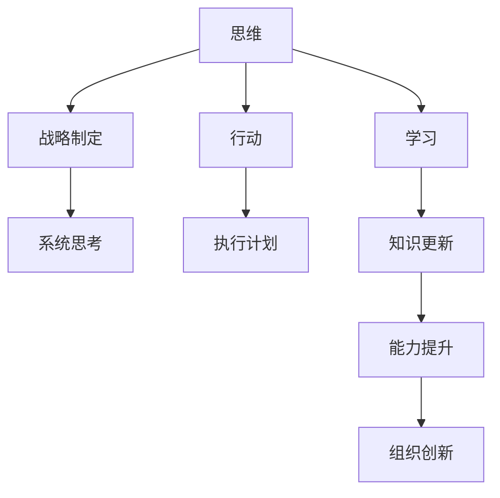

                 

# 卓越管理者的三大修炼:思维、行动与学习

> 关键词：领导力,决策制定,变革管理,组织文化,团队协作

## 1. 背景介绍

在快速变化的商业环境中，卓越管理者扮演着至关重要的角色。他们不仅需要具备出色的技术能力，还需要具备优秀的领导力、决策能力和学习能力。本文将深入探讨卓越管理者应具备的三大核心素质：思维、行动与学习，从理论和实践两个层面阐述如何修炼这三项关键技能。

## 2. 核心概念与联系

### 2.1 核心概念概述

卓越管理者的三大修炼可以概括为：

- **思维**：指管理者的战略思维和系统思维能力，能够从全局视角分析问题和制定策略，具备跨领域和跨学科的综合能力。
- **行动**：指管理者的执行力和变革能力，能够将战略转化为实际行动，推动组织变革和创新。
- **学习**：指管理者的持续学习能力和组织学习机制，能够不断更新知识体系，适应环境变化。

### 2.2 核心概念原理和架构的 Mermaid 流程图



**流程图解释**：
- A、B、C、D、E、F、G、H、I 分别代表思维、战略制定、系统思考、行动、执行计划、学习、知识更新、能力提升、组织创新。
- 从思维到战略制定，再到系统思考，体现战略思维的深度和广度。
- 从行动到执行计划，再到组织创新，体现行动的落地和变革能力。
- 从学习到知识更新，再到能力提升，体现学习能力的持续性和转化力。

## 3. 核心算法原理 & 具体操作步骤

### 3.1 算法原理概述

卓越管理者的三大修炼融合了心理学、管理学、组织行为学等多个领域的理论，核心算法原理可以归纳为以下三点：

1. **战略思维**：通过SWOT分析、波特五力模型等工具，评估组织内外环境，制定长远战略。
2. **执行计划**：采用OKR（目标与关键结果）、KPI（关键绩效指标）等方法，将战略转化为具体行动和衡量标准。
3. **组织学习**：利用PDCA（计划-执行-检查-行动）循环，通过反思和迭代，不断提升组织能力和适应性。

### 3.2 算法步骤详解

#### 3.2.1 战略思维的制定

1. **环境分析**：
   - 进行外部环境分析，使用PEST（政治、经济、社会、技术）模型评估宏观环境。
   - 进行内部环境分析，识别组织的优势和劣势，使用SWOT矩阵进行分析。
   - 结合五力模型，评估行业竞争态势，识别潜在的机会和威胁。

2. **愿景和目标设定**：
   - 设定长远愿景，明确组织的使命和愿景。
   - 制定具体目标，使用SMART（具体、可测量、可达成、相关、时限）原则。

3. **战略选择**：
   - 制定多个战略方案，进行SWOT矩阵比较。
   - 使用波士顿矩阵、GE矩阵等工具，评估不同战略的优劣。
   - 结合 Porter 的三种通用战略（成本领先、差异化、聚焦），选择最优战略。

#### 3.2.2 执行计划的制定

1. **目标设定**：
   - 将愿景和目标具体化，分解为可操作的任务和关键结果。
   - 使用OKR框架，设定具体、可衡量的目标，明确责任和期望。

2. **资源配置**：
   - 根据目标需求，合理配置人员、财务、技术等资源。
   - 制定详细的执行计划，包括时间表、里程碑和关键任务。

3. **绩效监控**：
   - 设定关键绩效指标(KPI)，实时监控目标进展。
   - 使用仪表板和报告工具，定期回顾目标完成情况，识别问题和改进点。

#### 3.2.3 组织学习的实践

1. **PDCA循环**：
   - 计划（Plan）：制定改进计划，明确目标和措施。
   - 执行（Do）：实施改进措施，收集数据和反馈。
   - 检查（Check）：分析数据和反馈，评估改进效果。
   - 行动（Act）：根据检查结果，调整改进措施，持续改进。

2. **反思和反馈**：
   - 建立反馈机制，定期收集员工和客户的反馈。
   - 组织反思会议，鼓励团队成员分享经验和教训。
   - 使用5个为什么（5 Whys）方法，深入分析问题根源，制定改进措施。

3. **知识管理**：
   - 建立知识库，收集和整理内部知识和最佳实践。
   - 使用Wiki或文档管理系统，方便员工获取和学习知识。
   - 定期进行知识分享和培训，提升团队整体知识水平。

### 3.3 算法优缺点

#### 3.3.1 优点

- **系统性**：战略思维和组织学习框架具备系统性，能够全面评估和管理组织环境。
- **可操作性**：执行计划和PDCA循环提供具体的操作路径和衡量标准。
- **持续改进**：通过反思和反馈机制，不断提升组织能力和适应性。

#### 3.3.2 缺点

- **复杂性**：涉及多层次、多维度的分析和管理，需要较高的专业知识和技能。
- **资源需求**：实施战略和执行计划需要大量的资源和时间投入。
- **动态变化**：外部环境的变化需要灵活调整战略和执行计划。

### 3.4 算法应用领域

这些算法和原则广泛应用于以下领域：

- **企业战略管理**：设定愿景和目标，制定长远战略和执行计划。
- **项目和项目管理**：规划和监控项目进度，确保项目目标的达成。
- **组织变革管理**：推动组织变革，提升组织适应性和创新能力。
- **人力资源管理**：通过学习和发展机制，提升员工能力和组织知识水平。
- **运营管理**：优化运营流程，提升运营效率和质量。

## 4. 数学模型和公式 & 详细讲解 & 举例说明

### 4.1 数学模型构建

#### 4.1.1 战略思维

使用PEST模型和SWOT矩阵进行分析。假设有一个企业A，外部环境评估如下：

- 政治因素(P): 政策支持程度
- 经济因素(E): 市场需求和竞争态势
- 社会因素(S): 消费者偏好和环保要求
- 技术因素(T): 技术创新和自动化水平

企业A的内部优势和劣势如下：

- 优势(Strengths): 技术领先、品牌优势
- 劣势(Weaknesses): 成本较高、管理层不稳

通过PEST和SWOT分析，评估企业A的战略方向。

#### 4.1.2 执行计划

使用OKR框架制定执行计划。假设企业A的目标是提升市场份额，具体OKR如下：

- 目标: 提高市场份额
- 关键结果(KR1): 实现销售额增长10%
- 关键结果(KR2): 客户满意度提升5%

企业A需要制定详细的执行计划，包括资源配置、时间表和关键任务。

#### 4.1.3 组织学习

使用PDCA循环进行反思和改进。假设企业A在客户满意度上需要改进，具体PDCA流程如下：

- 计划(Plan): 提高客户服务质量，培训客服人员
- 执行(Do): 实施培训计划，监控客户反馈
- 检查(Check): 分析客户反馈，识别改进点
- 行动(Act): 调整客服流程，持续改进客户服务质量

### 4.2 公式推导过程

#### 4.2.1 战略思维

PEST分析公式：
$$
PEST = \{P, E, S, T\}
$$

SWOT矩阵分析公式：
$$
SWOT = \begin{bmatrix}
\text{Strengths} & \text{Weaknesses} \\
\text{Opportunities} & \text{Threats}
\end{bmatrix}
$$

#### 4.2.2 执行计划

OKR框架公式：
$$
OKR = \{目标, KR1, KR2, ...\}
$$

#### 4.2.3 组织学习

PDCA循环公式：
$$
PDCA = \{Plan, Do, Check, Act\}
$$

### 4.3 案例分析与讲解

假设一个互联网初创企业B，需要进行一次重大产品迭代。企业B采用以下步骤：

1. **战略思维**：
   - 外部环境分析：市场竞争激烈，技术更新快，用户需求多样化。
   - 内部优势和劣势：技术基础薄弱，但团队年轻有活力。
   - 战略选择：采用差异化策略，通过技术创新和用户体验提升产品竞争力。

2. **执行计划**：
   - 目标设定：在6个月内实现用户增长20%。
   - 资源配置：增加研发投入，招聘资深设计师和工程师。
   - 执行计划：制定详细的迭代计划，包括功能开发、测试和推广。

3. **组织学习**：
   - 建立反馈机制：定期收集用户反馈，识别产品痛点。
   - 反思和改进：组织产品回顾会议，分析用户数据，优化产品功能。
   - 知识管理：建立知识库，积累产品迭代经验，定期进行知识分享。

通过这些步骤，企业B成功实现了产品迭代，提升了用户满意度和市场竞争力。

## 5. 项目实践：代码实例和详细解释说明

### 5.1 开发环境搭建

1. **选择开发工具**：
   - 使用JIRA进行项目管理和任务跟踪。
   - 使用Confluence进行知识管理和文档分享。
   - 使用Git进行版本控制和代码管理。

2. **配置开发环境**：
   - 搭建Java或Python开发环境。
   - 配置CI/CD工具，如Jenkins或GitHub Actions，实现自动构建和部署。
   - 部署Kubernetes容器化平台，支持弹性扩展和故障恢复。

### 5.2 源代码详细实现

#### 5.2.1 战略思维

使用Python和Pandas进行战略分析。代码如下：

```python
import pandas as pd

# 读取PEST和SWOT数据
pest_data = pd.read_csv('pest_data.csv')
swot_data = pd.read_csv('swot_data.csv')

# 分析PEST
pest_analysis = pest_data['因素'].value_counts()
print('PEST因素分析：')
print(pest_analysis)

# 分析SWOT
swot_analysis = pd.concat([swot_data['优势'], swot_data['劣势']], axis=1)
swot_analysis.columns = ['Strengths', 'Weaknesses']
print('SWOT分析：')
print(swot_analysis)
```

#### 5.2.2 执行计划

使用OKR框架，制定执行计划。代码如下：

```python
# 设定OKR目标
okr goals = {
    '目标': '提高市场份额',
    'KR1': '实现销售额增长10%',
    'KR2': '客户满意度提升5%'
}

# 分配任务和责任
task_assignments = {
    'KR1': {'责任人': '销售团队', '时间': '3个月'},
    'KR2': {'责任人': '客服团队', '时间': '2个月'}
}

# 输出OKR和任务分配
print('OKR目标：')
print(okr_goals)
print('任务分配：')
print(task_assignments)
```

#### 5.2.3 组织学习

使用PDCA循环，进行反思和改进。代码如下：

```python
# 定义PDCA循环
plan = '提高客户服务质量，培训客服人员'
do = '实施培训计划，监控客户反馈'
check = '分析客户反馈，识别改进点'
act = '调整客服流程，持续改进客户服务质量'

# 输出PDCA循环
print('PDCA循环：')
print('Plan:', plan)
print('Do:', do)
print('Check:', check)
print('Act:', act)
```

### 5.3 代码解读与分析

#### 5.3.1 战略思维

- 使用Pandas进行数据分析，可以快速处理和展示PEST和SWOT数据。
- 通过value_counts方法，可以直观了解每个因素出现的次数，为战略选择提供依据。

#### 5.3.2 执行计划

- 使用字典结构，可以清晰地表示OKR目标和任务分配。
- 通过任务字典的键值对，可以明确每个关键结果的责任人和时间。

#### 5.3.3 组织学习

- 使用Python字符串和列表，可以灵活地表示PDCA循环的各个阶段。
- 通过列表拼接，可以方便地输出PDCA循环的各个环节。

### 5.4 运行结果展示

- **战略思维**：通过PEST和SWOT分析，可以明确外部环境和内部优劣势，为战略选择提供科学依据。
- **执行计划**：通过OKR目标和任务分配，可以清晰地指导团队行动，确保目标达成。
- **组织学习**：通过PDCA循环，可以持续优化组织运营，提升团队能力。

## 6. 实际应用场景

### 6.1 企业战略管理

一家全球知名的消费电子企业C，需要进行新一轮产品线的战略调整。企业C采用以下步骤：

1. **战略思维**：
   - 外部环境分析：全球经济形势不稳定，市场竞争激烈，技术创新加速。
   - 内部优势和劣势：品牌影响力强，但技术创新能力不足。
   - 战略选择：采用差异化战略，通过创新技术和用户体验提升产品竞争力。

2. **执行计划**：
   - 目标设定：在3年内实现产品线扩展，进入新市场。
   - 资源配置：加大研发投入，收购创新型企业。
   - 执行计划：制定详细的研发计划，进行市场调研和用户测试。

3. **组织学习**：
   - 建立反馈机制：定期收集用户反馈，优化产品设计。
   - 反思和改进：组织产品评审会议，分析用户数据，提升产品竞争力。
   - 知识管理：建立知识库，积累研发经验，定期进行知识分享。

通过这些步骤，企业C成功实现了战略调整，实现了产品和市场的双线突破。

### 6.2 项目和项目管理

一家大型软件公司D，需要开发一个新型的企业管理系统。公司D采用以下步骤：

1. **战略思维**：
   - 外部环境分析：市场对企业管理系统需求旺盛，技术成熟度高。
   - 内部优势和劣势：技术基础牢固，但缺乏行业经验。
   - 战略选择：采用差异化战略，通过用户体验和技术创新提升产品竞争力。

2. **执行计划**：
   - 目标设定：在18个月内实现系统上线。
   - 资源配置：组建项目团队，分配研发资源。
   - 执行计划：制定详细的项目计划，包括需求分析、设计和开发。

3. **组织学习**：
   - 建立反馈机制：定期收集客户反馈，优化系统功能。
   - 反思和改进：组织项目回顾会议，分析进度和质量，识别改进点。
   - 知识管理：建立知识库，积累项目经验，定期进行知识分享。

通过这些步骤，公司D成功开发了新型的企业管理系统，实现了客户满意度和市场份额的双提升。

### 6.3 组织变革管理

一家传统制造业企业E，需要进行数字化转型。企业E采用以下步骤：

1. **战略思维**：
   - 外部环境分析：数字化转型成为行业趋势，技术进步迅速。
   - 内部优势和劣势：生产线自动化程度高，但信息化水平较低。
   - 战略选择：采用数字化战略，通过信息化提升管理效率和生产效率。

2. **执行计划**：
   - 目标设定：在2年内实现数字化转型。
   - 资源配置：投资信息化系统，培训员工。
   - 执行计划：制定详细的数字化转型计划，包括系统实施、员工培训和流程优化。

3. **组织学习**：
   - 建立反馈机制：定期收集员工反馈，优化系统功能和操作流程。
   - 反思和改进：组织数字化转型评审会议，分析系统使用情况，识别改进点。
   - 知识管理：建立知识库，积累转型经验，定期进行知识分享。

通过这些步骤，企业E成功实现了数字化转型，提升了生产效率和管理水平。

## 7. 工具和资源推荐

### 7.1 学习资源推荐

1. **《卓越领导力》系列书籍**：涵盖领导力的各个方面，提供系统的理论知识和实践指南。
2. **《管理学》教材**：系统介绍管理学的基本理论和实践方法。
3. **《组织行为学》教材**：深入分析组织行为的基本规律和应用。
4. **在线课程平台**：如Coursera、edX等，提供优秀的管理课程和资源。
5. **专业博客和社区**：如哈佛商业评论、领英等，获取最新的管理案例和思想。

### 7.2 开发工具推荐

1. **项目管理工具**：
   - JIRA：项目管理、任务跟踪和问题跟踪工具。
   - Confluence：知识管理和文档协作工具。
   - Asana：任务管理和团队协作工具。

2. **知识管理工具**：
   - Notion：全功能知识管理系统，支持文档、任务、知识库等。
   - Wiki：文档协作和版本控制工具，如DokuWiki、MediaWiki。
   - GitLab：代码管理、版本控制和CI/CD集成工具。

3. **系统分析工具**：
   - SWOT分析工具：如SmartDraw、Gantt Project。
   - OKR工具：如OKR.io、Objective Tracker。
   - PDCA工具：如PDCA Template、PDCA Checklist。

### 7.3 相关论文推荐

1. **《战略管理》**：钱德勒（Chandler）、明茨伯格（Mintzberg）的经典著作，系统介绍战略管理的基本理论和实践。
2. **《项目管理》**：哈里森（Harrison）、鲁尼恩（Runyan）的教材，涵盖项目管理的全过程和关键技能。
3. **《组织变革》**：贝恩（Bain）、克劳斯（Krause）的著作，深入探讨组织变革的理论和方法。
4. **《领导力》**：约翰·马克斯威尔（John Maxwell）、彼得·德鲁克（Peter Drucker）等著名管理学家撰写的经典书籍，提供领导力的实践指南。
5. **《PDCA循环》**：戴明（Deming）、朱兰（Juran）的著作，详细介绍PDCA循环的应用方法和原则。

## 8. 总结：未来发展趋势与挑战

### 8.1 研究成果总结

卓越管理者的三大修炼——思维、行动与学习，是现代管理实践中的核心能力。通过系统的理论学习、实践操作和持续改进，管理者可以有效应对各种复杂挑战，推动组织的持续发展和创新。

### 8.2 未来发展趋势

1. **数据驱动**：大数据和人工智能技术的广泛应用，将使战略制定和执行更加精准和高效。
2. **跨学科融合**：管理理论与心理学、经济学、社会学等学科的深度融合，将提升管理实践的科学性和系统性。
3. **全球化视野**：全球化和数字化趋势下，管理者的视野将更加全球化，能够更好地理解和应对国际市场的变化。
4. **可持续发展**：环保和可持续发展成为重要的战略方向，管理者需将环保理念融入战略和执行中。
5. **技术创新**：人工智能、区块链、物联网等新兴技术，将为组织变革和创新提供新的动力和机遇。

### 8.3 面临的挑战

1. **快速变化**：市场和技术环境快速变化，管理者需要不断学习和适应新的趋势和挑战。
2. **资源有限**：资源有限和预算约束，管理者需要在有限资源下实现最优的战略和执行。
3. **组织文化**：不同组织文化的差异，管理者需具备跨文化的沟通和协调能力。
4. **人才短缺**：人才短缺和内部竞争，管理者需有效激励和培养人才。
5. **风险管理**：复杂多变的外部环境，管理者需具备有效的风险管理能力。

### 8.4 研究展望

未来，卓越管理者的三大修炼将在以下几个方面进行深入探索：

1. **多维战略制定**：结合环境、技术、市场等多个维度，制定更全面的战略方案。
2. **智能决策支持**：利用大数据和AI技术，提升决策的准确性和效率。
3. **跨领域创新**：跨学科、跨领域的融合创新，提升组织的创新能力和竞争力。
4. **可持续发展**：将环保和可持续发展理念融入战略和执行，推动绿色管理。
5. **技术融合**：探索AI、区块链等新兴技术在管理中的应用，提升管理效率和创新性。

## 9. 附录：常见问题与解答

**Q1: 如何提高战略思维能力？**

A: 提高战略思维能力需要系统学习和实践。
- **学习理论**：阅读经典管理书籍，学习战略管理的理论和方法。
- **案例分析**：分析成功企业的战略案例，总结其成功经验和教训。
- **模拟练习**：进行战略模拟和沙盘推演，提升战略制定的实际能力。
- **实战经验**：多参与项目和任务，积累实战经验。

**Q2: 如何优化执行计划？**

A: 优化执行计划需要明确目标、合理分配资源和灵活调整策略。
- **设定SMART目标**：目标要具体、可衡量、可达成、相关、时限。
- **资源配置合理**：根据任务需求，合理分配人员、财务、技术等资源。
- **灵活调整策略**：根据进展情况，及时调整执行计划和资源分配。
- **定期评估效果**：定期回顾目标完成情况，识别改进点和调整方向。

**Q3: 如何建立组织学习机制？**

A: 建立组织学习机制需要系统化的方法和工具。
- **PDCA循环**：定期进行计划、执行、检查、行动循环，持续改进。
- **反馈机制**：建立系统化的反馈机制，收集员工和客户的反馈信息。
- **知识管理**：建立知识库，积累组织经验和最佳实践，定期进行知识分享。
- **培训和学习**：定期组织培训和学习活动，提升团队整体能力。

通过这些方法，管理者可以不断提高自己的战略思维、执行力和学习力，成为卓越的行业领袖。

