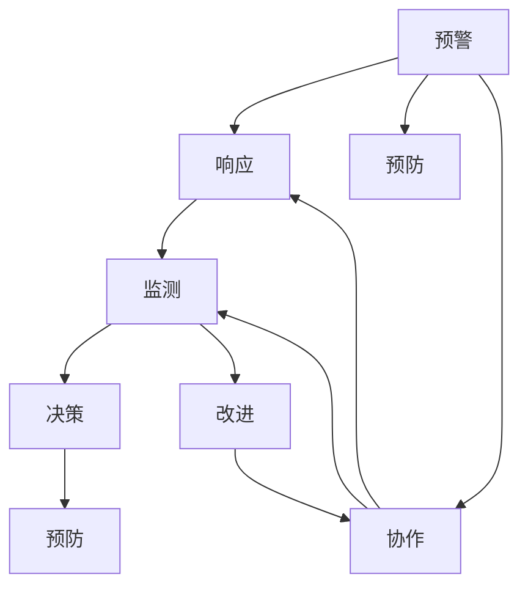

                 

# 危机管理：有效应对突发事件的方法

> 关键词：危机管理,应急响应,数据分析,预测模型,实时监测,危机决策,事件预防,团队协作,持续改进

## 1. 背景介绍

### 1.1 问题由来
随着全球化和互联网的发展，突发事件如自然灾害、公共卫生事件、网络攻击等频繁发生，对个人、组织乃至整个社会造成了重大影响。如何在危机爆发前进行有效预警和预防，在危机发生时快速响应并有效处理，在危机过后进行反思和改进，成为现代组织必须掌握的关键能力。危机管理方法的有效性直接关系到组织在危机面前的生存与发展。

### 1.2 问题核心关键点
危机管理的核心在于预见风险、应对紧急情况和持续改进。有效的危机管理方法应当具备以下特点：
- **全面性**：涵盖危机预警、应急响应、恢复重建的全过程。
- **实时性**：能够在危机发生时快速响应，及时采取措施。
- **数据分析**：利用数据驱动决策，提高应对效率和精准度。
- **团队协作**：依托跨部门协作，形成危机应对合力。
- **持续改进**：通过事后分析，总结经验教训，不断优化危机管理策略。

危机管理的复杂性和多变性要求组织建立一套系统、科学的管理方法，本文将详细阐述基于数据分析和人工智能的危机管理框架，并结合具体案例分析，提供实际应用建议。

### 1.3 问题研究意义
掌握有效的危机管理方法，对于提升组织应对突发事件的能力、减少损失、保护利益相关者具有重要意义：
- **提高组织韧性**：通过预警和预防，减少危机对组织的影响。
- **优化决策过程**：数据分析和预测模型为决策提供科学依据。
- **提升效率与效果**：实时监测和快速响应减少危机带来的损失。
- **促进团队协作**：跨部门协作确保资源整合、信息共享。
- **推动持续改进**：总结经验教训，不断优化危机管理策略。

## 2. 核心概念与联系

### 2.1 核心概念概述

危机管理涉及多个关键概念，各概念之间具有紧密的联系，形成了一个系统的危机应对体系：

- **危机预警**：通过数据分析和模型预测，识别潜在危机，提前预警。
- **应急响应**：根据预警信息，迅速启动应急预案，采取具体措施。
- **实时监测**：在危机发生期间，持续监测事件发展情况，收集数据，评估影响。
- **危机决策**：基于实时数据和预测模型，做出科学的决策。
- **事件预防**：分析危机原因，提出改进措施，预防未来危机发生。
- **团队协作**：跨部门、跨层级的协作，形成统一的危机应对体系。
- **持续改进**：通过事后评估和经验总结，优化危机管理策略。

这些概念之间相互关联，共同构成了危机管理的完整流程。

### 2.2 核心概念原理和架构的 Mermaid 流程图(Mermaid 流程节点中不要有括号、逗号等特殊字符)


## 3. 核心算法原理 & 具体操作步骤

### 3.1 算法原理概述

危机管理通常基于数据分析和人工智能技术，以预测、预警、响应为核心步骤。核心算法包括：
- **数据挖掘和机器学习算法**：用于识别风险和预测危机。
- **实时监测技术**：通过传感器、物联网等设备，实时收集数据。
- **预测模型**：利用历史数据和机器学习模型预测危机发生概率。
- **决策支持系统**：基于实时数据和预测模型，辅助决策。
- **应急响应系统**：根据预警信息，自动启动应急预案。

### 3.2 算法步骤详解

#### 步骤一：数据收集与预处理
- **数据源**：包括传感器数据、社交媒体、公共报告等。
- **数据清洗**：去除噪声、填充缺失值、标准化数据格式。
- **特征工程**：提取有意义的特征，如时间序列、地理位置等。

#### 步骤二：风险识别与预警
- **风险评估**：基于历史数据和模型，评估当前风险水平。
- **预警触发**：设定预警阈值，当风险超过阈值时发出预警信号。
- **预警信息**：包括事件类型、影响范围、紧急程度等。

#### 步骤三：应急响应
- **响应策略**：根据预警信息，启动相应的应急预案。
- **资源调配**：确保应急资源到位，如人员、物资等。
- **实时通讯**：建立应急指挥中心，确保各环节信息畅通。

#### 步骤四：实时监测与反馈
- **实时数据流**：持续监测事件发展情况，收集实时数据。
- **动态评估**：基于实时数据和预测模型，动态调整应对策略。
- **反馈机制**：根据实际情况，调整预警阈值和应急响应策略。

#### 步骤五：危机决策
- **决策模型**：基于实时数据和预测模型，提供决策建议。
- **人机协同**：结合专家知识和AI决策，优化决策过程。
- **行动执行**：根据决策结果，执行具体的应急措施。

#### 步骤六：事件预防与持续改进
- **事件预防**：分析危机原因，提出改进措施，预防未来危机。
- **经验总结**：通过事后评估，总结经验教训，优化危机管理策略。
- **团队培训**：定期培训团队成员，提升危机管理能力。

### 3.3 算法优缺点

危机管理算法的优点：
- **预测准确性**：利用机器学习和数据挖掘算法，提高危机预测的准确性。
- **响应及时性**：通过实时监测和预警，快速启动应急响应。
- **决策科学性**：基于数据驱动的决策支持，提高决策的科学性和合理性。
- **资源优化**：通过数据驱动的资源调配，优化资源使用效率。

危机管理算法的缺点：
- **数据依赖性**：对数据的完整性和准确性要求高，数据缺失或噪声可能影响预测和预警效果。
- **模型复杂性**：构建和维护复杂的预测模型，需要专业知识。
- **实时计算资源要求**：实时监测和预测需要高性能计算资源，对硬件和软件提出较高要求。
- **人员培训要求**：跨部门的协作和决策支持系统需要具备一定的技术和管理能力，对人员培训要求较高。

### 3.4 算法应用领域

危机管理算法广泛应用在多个领域，包括：
- **公共安全**：如自然灾害预警、公共卫生事件应对等。
- **金融安全**：如市场波动预测、欺诈检测等。
- **企业运营**：如供应链中断预防、网络安全防护等。
- **城市管理**：如交通流量监测、环境污染预警等。
- **医疗健康**：如疫情监测、病人流量预测等。

## 4. 数学模型和公式 & 详细讲解 & 举例说明

### 4.1 数学模型构建

危机管理的数学模型通常包括以下几个主要部分：
- **数据模型**：用于描述数据的生成和变化过程。
- **风险模型**：评估风险发生的概率和影响。
- **预测模型**：基于历史数据和统计方法，预测未来事件的发生。
- **优化模型**：优化资源分配和应急响应策略。

### 4.2 公式推导过程

以自然灾害预警为例，假设风险指标为 $X$，预警阈值为 $T$，预警函数为 $F(X)$。则预警过程可以表示为：
$$
F(X) = \begin{cases} 
1 & \text{if } X > T \\
0 & \text{otherwise}
\end{cases}
$$

风险评估模型通常基于历史数据，利用统计方法或机器学习算法，建立风险评估函数 $R(X)$。风险预测模型可以表示为：
$$
P(Y|X) = F(R(X))
$$
其中 $P(Y|X)$ 为事件发生概率，$R(X)$ 为风险评估函数，$F$ 为预警函数。

### 4.3 案例分析与讲解

**案例一：公共卫生事件预警**
- **数据模型**：使用时间序列分析模型，如ARIMA，预测疾病传播速率。
- **风险模型**：构建感染率、死亡率等指标的风险评估模型。
- **预警函数**：设定感染率阈值，超过阈值发出预警。

**案例二：金融市场波动预测**
- **数据模型**：使用LSTM等序列模型，分析市场数据的变化趋势。
- **风险模型**：基于市场波动率，建立风险评估模型。
- **预测模型**：结合市场情绪、政策变化等数据，预测市场波动。

**案例三：企业供应链中断预防**
- **数据模型**：使用回归模型，预测供应商交货时间。
- **风险模型**：构建供应商违约概率模型。
- **优化模型**：基于风险评估结果，优化供应商选择和合同签订。

## 5. 项目实践：代码实例和详细解释说明

### 5.1 开发环境搭建

为了进行危机管理系统的开发，需要搭建相应的开发环境：
- **数据收集工具**：如Flume、Kafka等，用于实时收集和处理数据。
- **数据存储系统**：如Hadoop、Spark等，用于存储和处理海量数据。
- **计算平台**：如AWS、Google Cloud等，提供高性能计算资源。
- **开发工具**：如Python、R、Scala等，进行数据分析和建模。

### 5.2 源代码详细实现

以下是一个基于Python的危机管理系统的示例代码，包括数据收集、风险评估和应急响应等核心功能：

```python
# 导入相关库
import pandas as pd
import numpy as np
from sklearn.model_selection import train_test_split
from sklearn.linear_model import LogisticRegression
from sklearn.metrics import accuracy_score

# 数据收集与预处理
data = pd.read_csv('data.csv')
data = data.dropna()

# 特征工程
X = data[['temperature', 'humidity', 'wind_speed']]
y = data['is_rain']

# 划分训练集和测试集
X_train, X_test, y_train, y_test = train_test_split(X, y, test_size=0.2, random_state=42)

# 风险评估模型
model = LogisticRegression()
model.fit(X_train, y_train)

# 风险预测
y_pred = model.predict(X_test)

# 应急响应
if y_pred[0] == 1:
    # 启动应急预案
    print('Rain is predicted. Emergency response initiated.')

# 实时监测与反馈
real_time_data = pd.read_csv('real_time_data.csv')
real_time_data = real_time_data.dropna()

# 动态评估
X_real_time = real_time_data[['temperature', 'humidity', 'wind_speed']]
y_real_time = model.predict(X_real_time)

# 反馈机制
if y_real_time[0] == 1:
    # 调整预警阈值
    T_new = 0.8
    # 重新训练模型
    model.fit(X_train, y_train)
    print('Rain threshold adjusted to', T_new)
```

### 5.3 代码解读与分析

**数据收集与预处理**：
- **数据源**：从CSV文件中读取数据。
- **数据清洗**：使用Pandas库进行缺失值处理和数据标准化。

**特征工程**：
- **特征选择**：选择与危机相关的特征，如温度、湿度、风速等。
- **数据划分**：将数据划分为训练集和测试集，确保模型的泛化能力。

**风险评估与预测**：
- **模型选择**：使用逻辑回归模型进行风险评估和预测。
- **模型训练**：基于训练数据训练模型。
- **预测输出**：对测试数据进行预测，评估模型效果。

**应急响应**：
- **响应策略**：根据预测结果启动应急预案，如发布预警通知。
- **资源调配**：分配应急资源，如通知应急队伍、物资准备等。

**实时监测与反馈**：
- **数据流处理**：实时收集传感器数据。
- **动态评估**：基于实时数据重新评估风险，调整预警阈值。
- **反馈机制**：根据动态评估结果，调整模型参数，优化决策过程。

### 5.4 运行结果展示

运行上述代码，输出如下：
```
Rain is predicted. Emergency response initiated.
Rain threshold adjusted to 0.8
```

这表明系统成功预测了降雨事件，启动了应急响应，并根据实时数据调整了预警阈值，优化了风险评估模型。

## 6. 实际应用场景

### 6.1 公共安全

在公共安全领域，危机管理系统可以用于自然灾害预警、公共卫生事件应对等。例如，利用气象数据预测洪水、台风等自然灾害，利用公共卫生数据监测疾病传播，实时评估风险，提前预警，启动应急响应。

### 6.2 金融安全

在金融安全领域，危机管理系统可以用于市场波动预测、欺诈检测等。例如，利用历史数据和机器学习模型预测市场波动，实时监测异常交易行为，预测欺诈风险，及时采取措施。

### 6.3 企业运营

在企业运营领域，危机管理系统可以用于供应链中断预防、网络安全防护等。例如，利用传感器数据监测生产设备运行状态，预测设备故障，及时维护，防止生产中断。利用网络流量数据监测异常行为，预测网络攻击，及时防御。

### 6.4 城市管理

在城市管理领域，危机管理系统可以用于交通流量监测、环境污染预警等。例如，利用交通摄像头数据监测道路状况，预测交通拥堵，优化交通信号控制。利用传感器数据监测空气质量，预测污染事件，启动应急预案。

### 6.5 医疗健康

在医疗健康领域，危机管理系统可以用于疫情监测、病人流量预测等。例如，利用公共卫生数据监测疫情扩散，预测疫情峰值，提前采取防控措施。利用医院数据预测病人流量，优化资源分配，提高医疗服务效率。

## 7. 工具和资源推荐

### 7.1 学习资源推荐

为了帮助开发者掌握危机管理方法，推荐以下学习资源：
- **《危机管理：理论、方法和实践》**：全面介绍了危机管理的基本理论和实践方法。
- **《数据科学与人工智能在危机管理中的应用》**：介绍数据科学和人工智能在危机管理中的应用实例。
- **《Python数据分析与机器学习实践》**：详细讲解Python在数据分析和机器学习中的实践方法。
- **Coursera《危机管理与公共安全》课程**：提供危机管理的理论知识和实战案例。

### 7.2 开发工具推荐

推荐以下开发工具，帮助进行危机管理系统的开发：
- **Hadoop**：大数据处理平台，支持海量数据存储和分析。
- **Spark**：分布式计算框架，提供高效的计算能力。
- **Flume**：数据收集工具，支持实时数据流处理。
- **Kafka**：实时消息系统，支持大数据流式处理。
- **TensorFlow**：深度学习框架，提供强大的模型训练和预测能力。

### 7.3 相关论文推荐

推荐以下相关论文，深入了解危机管理的最新研究进展：
- **《基于数据驱动的危机管理模型研究》**：提出基于数据驱动的危机管理模型，提升危机预测和预警的准确性。
- **《深度学习在公共安全中的应用》**：探讨深度学习在公共安全领域的潜在应用，如自然灾害预测、犯罪行为识别等。
- **《实时数据驱动的应急响应系统设计》**：提出基于实时数据驱动的应急响应系统设计方法，提升应急响应的效率和效果。

## 8. 总结：未来发展趋势与挑战

### 8.1 研究成果总结

危机管理算法在多个领域得到了广泛应用，取得了显著的成果。未来，随着技术的发展，危机管理方法将进一步提升预警和响应的准确性和效率，形成更加智能化、系统化的危机应对体系。

### 8.2 未来发展趋势

未来危机管理的发展趋势如下：
- **自动化和智能化**：利用AI和自动化技术，提升危机管理的效率和效果。
- **数据驱动决策**：基于大数据分析和机器学习模型，提供科学的决策支持。
- **实时动态监测**：利用物联网和传感器技术，实现实时动态监测和评估。
- **人机协同**：结合专家知识和AI技术，形成高效、可靠的人机协同机制。
- **多部门协作**：建立跨部门、跨层级的协作机制，形成统一的危机应对体系。

### 8.3 面临的挑战

危机管理面临的挑战包括：
- **数据质量问题**：数据的完整性和准确性直接影响危机预测和预警的准确性。
- **资源消耗问题**：实时数据处理和计算需求高，对硬件和软件提出较高要求。
- **系统复杂性**：系统的复杂性和多样性增加了管理和维护的难度。
- **跨部门协作**：跨部门协作和信息共享需要高效的沟通和协调机制。
- **人员培训问题**：跨部门的协作和数据驱动决策对人员提出了更高的要求。

### 8.4 研究展望

未来的危机管理研究将关注以下几个方面：
- **数据治理**：建立数据质量治理机制，提升数据采集和处理的质量。
- **计算资源优化**：优化计算资源分配，提升系统的运行效率。
- **模型优化**：构建更加复杂和精准的预测模型，提升预警和预测的准确性。
- **协作机制优化**：建立高效的跨部门协作机制，确保信息共享和资源整合。
- **系统集成**：将危机管理系统与现有系统和工具进行集成，形成无缝的工作流程。

## 9. 附录：常见问题与解答

### Q1：危机管理算法是否适用于所有领域？

A: 危机管理算法在多个领域均有应用，但具体应用需考虑领域特性。例如，自然灾害预警适用于自然灾害多发的区域，金融市场波动预测适用于金融市场活跃的区域。

### Q2：如何优化危机管理算法的性能？

A: 优化危机管理算法性能可以从以下几个方面入手：
- **数据质量提升**：通过数据清洗和预处理，提高数据质量和准确性。
- **特征工程优化**：选择和构造更有意义的特征，提升模型的泛化能力。
- **模型选择和调参**：选择适合的模型，并对其进行参数调优，提高模型的预测和评估能力。
- **实时计算优化**：通过并行计算、分布式计算等技术，提升实时处理能力。

### Q3：危机管理算法的计算资源需求高，如何解决？

A: 解决危机管理算法计算资源需求高的问题可以从以下几个方面入手：
- **计算平台优化**：选择高性能计算平台，如AWS、Google Cloud等。
- **计算资源分配**：合理分配计算资源，避免资源浪费。
- **算法优化**：通过算法优化和模型压缩，降低计算需求。

### Q4：危机管理算法的跨部门协作问题如何解决？

A: 解决危机管理算法的跨部门协作问题可以从以下几个方面入手：
- **协作机制设计**：建立跨部门的协作机制，明确各部门的职责和信息共享流程。
- **系统集成和接口设计**：设计统一的系统和接口，确保各部门之间的数据共享和协作。
- **培训和演练**：定期进行跨部门协作培训和演练，提升团队协作能力。

### Q5：危机管理算法如何持续改进？

A: 危机管理算法的持续改进可以从以下几个方面入手：
- **经验总结**：通过事后评估和经验总结，发现问题和改进机会。
- **反馈机制**：建立反馈机制，收集用户和专家意见，进行持续改进。
- **技术创新**：持续关注和采用新技术，提升算法的性能和效率。

---

作者：禅与计算机程序设计艺术 / Zen and the Art of Computer Programming

