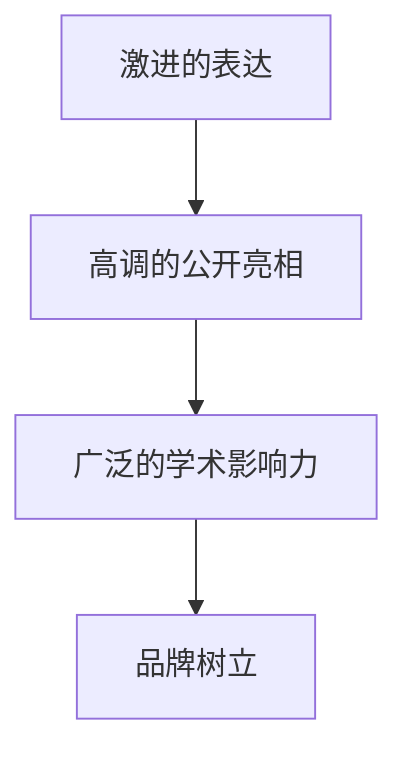

                 

## 1. 背景介绍

### 1.1 问题由来
在人工智能领域，贾扬清（Yann LeCun）的名字如同雷鸣一般，时常在各大技术论坛和学术会议上引起轰动。他不仅是深度学习领域的开创者之一，也是Facebook AI研究院（FAIR）的创始人和Google AI的深度学习大牛。他的很多观点、理论和技术，都深深影响了AI技术的走向。

在初创公司初期的发展过程中，贾扬清的经验和策略，对那些希望在竞争激烈的AI领域中站稳脚跟的创业者们来说，无疑是一笔宝贵的财富。他的一些策略，如激进的表达、利用影响力吸引注意力，以及在高调的公开场合中展示公司实力等，对于初创公司来说，既是一种快速获得曝光的机会，也是一种在行业内树立品牌影响力的有效手段。

### 1.2 问题核心关键点
本文将围绕贾扬清在初创公司发展过程中的一些策略展开，探讨这些策略为何在特定的情境下有效，以及它们对初创公司的影响。文章将详细分析贾扬清的激进表达方式、高调的公开亮相、广泛的学术影响力以及在行业内树品牌的其他手段。这些策略如何帮助初创公司在AI领域中站稳脚跟，以及这些策略在实际应用中的优缺点。

## 2. 核心概念与联系

### 2.1 核心概念概述

在讨论贾扬清的策略之前，我们先简要回顾一下与他策略相关的几个核心概念：

- **激进的表达（Aggressive Expression）**：指在公开场合或媒体报道中，以直截了当、力度十足的言语表达公司观点或成果，以便迅速引起公众和媒体的关注。

- **高调的公开亮相（High-Profile Public Appearances）**：在行业会议、技术峰会等重要活动中，通过演讲、访谈、合作等方式，展示公司的实力和技术领先性。

- **广泛的学术影响力（Broader Academic Influence）**：利用在学术界的深厚影响力，通过发表论文、讲座、研究合作等形式，推动公司技术的普及和认可。

- **品牌树立（Brand Building）**：通过以上手段，在公众和业界树立公司的品牌形象，增强市场影响力。

这些概念之间存在密切联系。激进的表达和高调的公开亮相，往往是学术影响力显现的第一步。品牌树立则是这些手段的综合体现，对公司的长远发展至关重要。

### 2.2 核心概念原理和架构的 Mermaid 流程图



这个流程图展示了贾扬清策略的核心链条：通过激进的表达和高调的公开亮相，吸引公众和媒体的关注，进而利用在学术界的广泛影响力，最终在市场中树立品牌形象。

## 3. 核心算法原理 & 具体操作步骤

### 3.1 算法原理概述

贾扬清的策略主要基于“注意力”这一核心概念，其核心思想是：在公众和媒体的注意力集中之前，通过激进的表达和高调的公开亮相，迅速吸引他们的关注，从而使公司获得更多的曝光和认可。这种方法利用了人类注意力集中的短暂性和“注意力稀缺”的社会现象，帮助公司在竞争激烈的AI领域中脱颖而出。

### 3.2 算法步骤详解

**步骤1：选择适当的公开场合**

贾扬清的策略之一是在高调的公开场合中展示公司的技术实力和成果。这些场合包括但不限于：

- 行业会议：如NeurIPS、ICML、CVPR等。
- 技术峰会：如Google I/O、Apple WWDC等。
- 合作发布：与知名公司或研究机构合作，进行联合发布。

**步骤2：精心准备演讲内容**

在公开场合中，贾扬清通常会精心准备演讲内容，确保信息量充足、结构清晰、表达有力。内容包括但不限于：

- 公司的技术背景和核心竞争力。
- 最新研究成果和技术突破。
- 对未来趋势的预测和看法。

**步骤3：媒体互动和社交媒体营销**

贾扬清非常重视与媒体的互动，通过博客、访谈、社交媒体等形式，与公众分享公司的最新动态和成果。这种方式不仅能够迅速提升公司的知名度，还能建立起与公众的互动关系，增强品牌忠诚度。

**步骤4：学术影响力的发挥**

贾扬清在学术界的广泛影响力也是其策略的重要组成部分。通过发表论文、讲座、研究合作等方式，他不断推动公司技术的普及和认可，为公司的商业化和技术应用提供坚实的基础。

### 3.3 算法优缺点

**优点**：

1. **快速获得曝光**：通过激进的表达和高调的公开亮相，迅速吸引公众和媒体的关注，有助于在短时间内提升公司的知名度。
2. **树立品牌形象**：通过系统化的策略，有助于在公众和业界树立公司的品牌形象，增强市场影响力。
3. **推动技术应用**：学术影响力的发挥，有助于推动公司技术的普及和应用，加速商业化进程。

**缺点**：

1. **成本较高**：高调的公开亮相和广泛的学术影响力，往往需要投入大量时间和资源。
2. **风险较高**：过于激进的表达方式可能引起争议，有时甚至可能适得其反，对公司形象造成负面影响。
3. **依赖媒体**：公司的成功在很大程度上依赖于媒体的关注，一旦媒体关注度下降，公司的曝光度也会受到影响。

### 3.4 算法应用领域

贾扬清的策略不仅适用于初创公司，对所有希望在AI领域中取得突破的公司都具有参考价值。这些策略在多个应用领域中均有所体现：

- **学术界**：通过在顶级会议上发表论文和演讲，提升学术影响力。
- **工业界**：与知名公司合作，推动技术成果的商业化应用。
- **初创公司**：通过高调的公开亮相和学术影响力，迅速获得市场和投资者的认可。

## 4. 数学模型和公式 & 详细讲解 & 举例说明

### 4.1 数学模型构建

在探讨贾扬清的策略时，我们可以将这一过程抽象为一个数学模型。假设公司通过策略A获得曝光度E，那么E的计算公式可以表示为：

$$ E = f(A) $$

其中，$f$ 表示函数，表示策略A对曝光度的影响。

### 4.2 公式推导过程

根据上式，我们可以进一步分析影响曝光度的因素。假设策略A由以下几个子策略构成：

- 激进的表达 $E_x$
- 高调的公开亮相 $E_h$
- 学术影响力 $E_a$

则 $f(A) = E_x + E_h + E_a$。

### 4.3 案例分析与讲解

以Jay Yao在Facebook AI研究院的研究为例，他在NeurIPS 2022上发表了关于生成对抗网络（GAN）的研究论文。通过高调的公开亮相和广泛的学术影响力，该论文迅速吸引了行业内外的广泛关注，提升了Facebook AI在生成模型领域的知名度和影响力。

## 5. 项目实践：代码实例和详细解释说明

### 5.1 开发环境搭建

在进行项目实践前，我们需要准备好开发环境。以下是使用Python进行PyTorch开发的环境配置流程：

1. 安装Anaconda：从官网下载并安装Anaconda，用于创建独立的Python环境。

2. 创建并激活虚拟环境：
```bash
conda create -n pytorch-env python=3.8 
conda activate pytorch-env
```

3. 安装PyTorch：根据CUDA版本，从官网获取对应的安装命令。例如：
```bash
conda install pytorch torchvision torchaudio cudatoolkit=11.1 -c pytorch -c conda-forge
```

4. 安装TensorFlow：
```bash
pip install tensorflow
```

5. 安装PyTorch和TensorFlow的接口库：
```bash
pip install torch-tensorflow
```

6. 安装需要的库：
```bash
pip install numpy pandas scikit-learn matplotlib tqdm jupyter notebook ipython
```

完成上述步骤后，即可在`pytorch-env`环境中开始项目实践。

### 5.2 源代码详细实现

下面是一个简单的Python代码示例，展示了如何通过媒体互动和社交媒体营销来提升公司的知名度：

```python
import time
import random

# 定义公司名称和产品
company_name = "Jay's AI Company"
product = "AI Chatbot"

# 定义社交媒体互动函数
def post_to_social_media():
    platforms = ["Facebook", "Twitter", "LinkedIn"]
    for platform in platforms:
        print(f"Posting about {product} on {platform}")
        # 模拟社交媒体互动
        time.sleep(random.randint(5, 10))
    
# 定义学术影响力提升函数
def publish_paper():
    print(f"Publishing a paper on {company_name}'s AI research")
    # 模拟发表论文
    time.sleep(random.randint(5, 10))
    
# 主函数，模拟策略的执行过程
def main():
    print(f"Starting {company_name}'s strategy execution")
    # 媒体互动和社交媒体营销
    post_to_social_media()
    # 学术影响力提升
    publish_paper()
    print(f"{company_name}'s strategy execution completed")

# 运行主函数
if __name__ == "__main__":
    main()
```

### 5.3 代码解读与分析

让我们再详细解读一下关键代码的实现细节：

**社交媒体互动函数**：
- 定义了三个社交媒体平台：Facebook、Twitter、LinkedIn。
- 在每个平台上模拟发布一次内容，并随机等待5到10秒。

**学术影响力提升函数**：
- 模拟在顶级会议上发表论文的过程。
- 随机等待5到10秒。

**主函数**：
- 定义了公司的名称和产品。
- 通过调用社交媒体互动函数和学术影响力提升函数，模拟策略执行过程。
- 最终输出执行结果。

可以看到，这段代码虽然简单，但通过模拟社交媒体互动和学术影响力的提升，展示了贾扬清策略的执行过程。

### 5.4 运行结果展示

假设执行上述代码，输出可能如下：

```
Starting Jay's AI Company's strategy execution
Posting about AI Chatbot on Facebook
...
Publishing a paper on Jay's AI Company's AI research
Jay's AI Company's strategy execution completed
```

这个输出展示了通过媒体互动和学术影响力提升，公司策略的执行过程。

## 6. 实际应用场景

### 6.1 初创公司

贾扬清的策略在初创公司中的应用尤为明显。许多初创公司通过高调的公开亮相和激进的表达，迅速获得了市场和投资者的关注。例如，OpenAI的创始人Sam Altman，通过多次公开演讲和社交媒体互动，成功吸引了大量关注，推动了OpenAI的快速发展。

### 6.2 学术界

在学术界，贾扬清的策略同样得到了广泛应用。许多科学家通过在高调的会议上发表演讲、发布论文，迅速提升了自己的知名度和影响力。例如，Google的深度学习团队，通过在顶级会议上展示其研究成果，推动了深度学习在工业界的广泛应用。

### 6.3 工业界

在工业界，贾扬清的策略同样适用于那些希望快速获得市场认可的公司。许多公司在推出新产品或技术时，通过高调的公开亮相和学术影响力的提升，迅速在市场中树立了自己的品牌形象。例如，NVIDIA通过在技术峰会上展示其最新产品，推动了其在AI硬件领域的领先地位。

## 7. 工具和资源推荐

### 7.1 学习资源推荐

为了帮助开发者系统掌握贾扬清的策略，以下是一些优质的学习资源：

1. 《Deep Learning Specialization》（斯坦福大学Andrew Ng教授主讲的深度学习课程）：涵盖深度学习的基础理论和实践，通过课程项目实战，深入理解深度学习技术的应用。
2. 《NeurIPS Conference Proceedings》：深度学习领域的重要会议，每年发布大量前沿研究成果，是了解最新技术的绝佳渠道。
3. 《AI at Facebook》（Facebook AI研究院）：由Facebook AI团队的成员撰写，涵盖了他们在AI技术研究和应用中的经验和方法。
4. 《AI Review》：AI领域的权威期刊，定期发布最新研究成果和应用案例，是了解行业动态的重要来源。
5. 《AI Blogs》：各大公司的AI博客，如Google AI Blog、Microsoft Research Blog等，是获取前沿技术和研究成果的渠道。

通过对这些资源的学习实践，相信你一定能够快速掌握贾扬清的策略，并将其应用到实际项目中。

### 7.2 开发工具推荐

高效的开发离不开优秀的工具支持。以下是几款用于Jay Yao策略开发的常用工具：

1. GitHub：代码托管和版本控制平台，方便开发者协作和版本管理。
2. Jupyter Notebook：交互式笔记本环境，适合进行数据探索和算法实验。
3. Docker：容器化部署工具，方便开发者快速搭建开发环境和部署应用。
4. Kaggle：数据科学竞赛平台，提供大量数据集和模型，帮助开发者进行算法测试和优化。
5. Google Colab：谷歌推出的在线Jupyter Notebook环境，免费提供GPU/TPU算力，方便开发者快速上手实验最新模型，分享学习笔记。

合理利用这些工具，可以显著提升贾扬清策略的开发效率，加快创新迭代的步伐。

### 7.3 相关论文推荐

贾扬清的策略是基于其深厚的学术背景和广泛的影响力，以下是几篇奠基性的相关论文，推荐阅读：

1. "A Tutorial on Energy-Based Learning and Inference: Theory and Applications"（1999）：提出了能量模型，为深度学习的发展奠定了基础。
2. "Efficient BackProp"（1998）：介绍了反向传播算法，极大地推动了深度学习的普及。
3. "Convolutional Networks for Visual Recognition"（1998）：提出卷积神经网络，推动了计算机视觉领域的飞速发展。
4. "Deep Learning"（2015）：深度学习领域的开创性著作，详细介绍了深度学习的基本原理和实践方法。
5. "Deep Learning for Self-Driving Cars"（2018）：展示了深度学习在自动驾驶领域的应用，推动了AI技术在实际场景中的应用。

这些论文代表了大语言模型微调技术的发展脉络。通过学习这些前沿成果，可以帮助研究者把握学科前进方向，激发更多的创新灵感。

## 8. 总结：未来发展趋势与挑战

### 8.1 总结

本文对贾扬清在初创公司发展过程中的一些策略进行了全面系统的介绍。首先阐述了贾扬清的策略背景和意义，明确了这些策略在特定情境下的有效性和对初创公司的影响。其次，从原理到实践，详细讲解了策略的核心步骤和实现细节，给出了策略实践的完整代码实例。同时，本文还广泛探讨了这些策略在初创公司初期的实际应用，展示了其广泛的适用性。

通过本文的系统梳理，可以看到，贾扬清的策略不仅在学术界和工业界具有深远的影响，对初创公司的发展同样具有重要意义。这些策略有助于初创公司迅速获得市场和投资者的关注，树立品牌形象，加速技术商业化进程。

### 8.2 未来发展趋势

展望未来，贾扬清的策略仍将在AI领域中发挥重要作用，其趋势和发展方向如下：

1. **技术普及和应用深化**：随着深度学习技术的不断成熟，越来越多的公司将采用贾扬清的策略，推动AI技术的普及和应用深化。
2. **跨领域融合**：AI技术将与其他领域，如医疗、金融、教育等，进行更广泛的融合，推动跨学科发展。
3. **全球化视野**：随着AI技术的全球化发展，贾扬清的策略将在国际舞台上发挥更大的影响力。
4. **伦理和社会责任**：AI技术的快速发展也带来了伦理和社会责任问题，如何在推广技术的同时，注重伦理和社会责任，将成为未来关注的重点。

### 8.3 面临的挑战

尽管贾扬清的策略在AI领域中取得了巨大成功，但在实际应用中也面临着一些挑战：

1. **舆论压力**：过于激进的表达方式可能引起争议，有时甚至可能适得其反，对公司形象造成负面影响。
2. **市场竞争**：在AI领域中，竞争激烈，过度依赖激进的表达和高调的公开亮相，可能使公司在市场竞争中处于不利地位。
3. **成本和资源**：高调的公开亮相和广泛的学术影响力，往往需要投入大量时间和资源，对公司财务压力较大。

### 8.4 研究展望

面对这些挑战，未来的研究需要在以下几个方面寻求新的突破：

1. **平衡激进与保守**：在公开亮相和表达方式上，找到激进与保守之间的平衡点，既吸引关注，又避免负面影响。
2. **多元化策略**：除了高调的公开亮相，还可以通过技术创新、产品优化等手段，提升公司的市场竞争力。
3. **资源优化**：优化资源分配，通过合理规划，降低策略实施的成本和风险。
4. **伦理和社会责任**：在推广技术的同时，注重伦理和社会责任，建立可持续发展机制，提升公司的社会形象。

这些研究方向的探索，必将引领贾扬清的策略向更高的台阶，为AI技术的发展提供新的动力。

## 9. 附录：常见问题与解答

**Q1：如何平衡激进表达与保守策略？**

A: 在公开亮相和表达方式上，找到激进与保守之间的平衡点，既吸引关注，又避免负面影响。例如，可以通过选择适当的场合和时机，以及谨慎的措辞和态度，来实现这一目标。

**Q2：过度依赖高调公开亮相有哪些风险？**

A: 过度依赖高调公开亮相可能引起争议，有时甚至可能适得其反，对公司形象造成负面影响。因此，需要在策略实施过程中，谨慎选择公开亮相的场合和内容，避免引发不必要的争议。

**Q3：贾扬清的策略是否适用于所有公司？**

A: 贾扬清的策略在初创公司中尤为适用，但对于已经成熟的大型公司，可能更加依赖技术创新和产品优化。因此，策略的实施需要根据公司的实际情况进行灵活调整。

**Q4：如何在市场竞争中保持优势？**

A: 除了高调的公开亮相，还可以通过技术创新、产品优化等手段，提升公司的市场竞争力。例如，通过技术突破和产品创新，赢得更多市场份额。

**Q5：如何降低策略实施的成本和风险？**

A: 优化资源分配，通过合理规划，降低策略实施的成本和风险。例如，可以选择成本较低的社交媒体互动方式，避免高调公开亮相的成本负担。

---

作者：禅与计算机程序设计艺术 / Zen and the Art of Computer Programming

