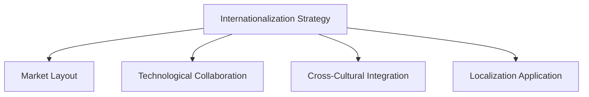

                 

# 国际化战略：Lepton AI的全球布局

> 关键词：国际化, Lepton AI, 全球布局, AI战略, 市场拓展, 技术合作, 文化融合

## 1. 背景介绍

### 1.1 问题由来

在21世纪的数字化浪潮中，人工智能(AI)技术已成为驱动经济和社会进步的重要引擎。随着技术的不断进步和应用的深入，AI正从局部试验走向全球普及，AI企业也在积极探索国际化战略，以期在全球范围内拓展市场、提升影响力。Lepton AI作为AI领域的前行者，其国际化战略成为业界关注的焦点。

### 1.2 问题核心关键点

Lepton AI的国际化战略主要围绕以下几个核心关键点展开：

1. **全球市场布局**：通过在多个国家和地区设立分支机构，构建覆盖全球的AI解决方案和服务网络。
2. **跨文化融合**：在产品设计、服务提供、员工管理等方面融合不同文化元素，提升品牌在全球市场的适应性。
3. **技术合作与交流**：与国际顶尖研究机构和企业合作，推动技术创新和知识共享，提升技术竞争力。
4. **本地化应用**：根据不同地区的需求，定制开发AI解决方案，提升产品和服务的地域适应性。

## 2. 核心概念与联系

### 2.1 核心概念概述

为更好地理解Lepton AI的国际化战略，本节将介绍几个密切相关的核心概念：

- **国际化战略(Internationalization Strategy)**：企业在全球市场中的战略布局，旨在拓展国际业务，提升品牌影响力。
- **市场布局(Market Layout)**：企业在不同国家或地区的业务覆盖范围，包括办公室设立、产品部署等。
- **技术合作(Technological Collaboration)**：企业与外部机构或企业间的技术交流和合作，包括联合研发、知识共享等。
- **跨文化融合(Cross-Cultural Integration)**：企业在全球化运营中，将不同文化元素融入产品和服务设计、管理实践等环节，提升文化兼容性。
- **本地化应用(Localization Application)**：企业根据不同地区的需求和特点，定制开发产品和服务，提高本地市场适应性。

这些概念之间的逻辑关系可以通过以下Mermaid流程图来展示：



这个流程图展示了这个概念之间的关系：

1. 国际化战略是企业全球化的顶层设计，通过市场布局、技术合作、跨文化融合和本地化应用等多方面的努力，最终实现企业全球化目标。
2. 市场布局是国际化战略的具体实施手段，通过在多个国家设立分支机构和产品部署，实现业务覆盖。
3. 技术合作是提升技术竞争力的重要手段，通过与外部机构或企业的合作，推动技术创新和知识共享。
4. 跨文化融合是企业全球化的关键，通过融入不同文化元素，提升品牌在全球市场的适应性。
5. 本地化应用是实现全球化战略的重要保障，通过定制化开发，提升产品和服务的地域适应性。

## 3. 核心算法原理 & 具体操作步骤
### 3.1 算法原理概述

Lepton AI的国际化战略主要基于以下几个核心算法和原理：

1. **市场评估算法(Market Assessment Algorithm)**：通过对目标市场的数据收集和分析，评估市场潜力和机会，制定合适的市场进入策略。
2. **文化适应算法(Cultural Adaptation Algorithm)**：通过对目标文化的研究和理解，设计符合当地文化习惯的营销策略、产品功能和用户界面。
3. **技术合作协议(Technological Collaboration Agreement)**：与国际合作伙伴签订协议，明确合作内容和责任，推动技术共享和协同创新。
4. **本地化应用流程(Localization Workflow)**：根据不同地区的需求和特点，定制开发产品和服务，并进行本地化适配和优化。

### 3.2 算法步骤详解

以下是Lepton AI国际化战略的详细步骤：

1. **市场评估**：
   - 收集目标市场的数据，包括经济状况、政策环境、竞争格局等。
   - 使用市场评估算法分析数据，评估市场潜力和机会。
   - 根据评估结果，制定市场进入策略。

2. **文化适应**：
   - 通过调研和交流，深入理解目标文化的特点和习惯。
   - 设计符合当地文化的产品功能和用户界面。
   - 通过文化适应算法进行测试和优化，确保产品适应当地文化。

3. **技术合作**：
   - 选择适合的国际合作伙伴，签订技术合作协议。
   - 明确合作内容、责任和收益分配，推动技术共享和协同创新。
   - 根据合作协议，进行联合研发和技术交流。

4. **本地化应用**：
   - 根据不同地区的需求和特点，定制开发产品和服务。
   - 进行本地化适配和优化，确保产品和服务在本地市场有良好的用户体验。
   - 通过本地化应用流程进行管理和维护，持续提升产品竞争力。

### 3.3 算法优缺点

Lepton AI的国际化战略具有以下优点：

1. **市场拓展**：通过全球布局和本地化应用，企业可以进入新的市场，提升市场份额。
2. **技术创新**：通过与国际顶尖机构合作，推动技术创新和知识共享，提升技术竞争力。
3. **品牌影响力**：通过跨文化融合，提升品牌在全球市场的适应性和影响力。

同时，也存在以下局限性：

1. **文化差异**：不同文化背景可能导致误解和冲突，增加管理难度。
2. **成本压力**：全球化运营需要投入大量资源，增加企业运营成本。
3. **法律风险**：不同国家法律法规差异可能导致法律风险，增加合规成本。

尽管存在这些挑战，但通过系统的国际化战略和策略，Lepton AI能够最大限度地克服这些困难，实现全球化目标。

### 3.4 算法应用领域

Lepton AI的国际化战略在多个领域得到了广泛应用：

- **医疗健康**：通过全球化布局，提供符合不同文化习惯的医疗解决方案，提升全球健康水平。
- **金融服务**：在全球多个国家和地区设立分支机构，提供符合当地法律法规的金融产品和服务。
- **教育培训**：开发符合不同文化背景的教育资源和平台，提升全球教育水平。
- **智能制造**：通过技术合作和本地化应用，提升全球制造业的智能化水平。
- **环境保护**：提供符合不同文化需求的环境保护解决方案，推动全球环境保护事业。

## 4. 数学模型和公式 & 详细讲解 & 举例说明

### 4.1 数学模型构建

Lepton AI的国际化战略涉及多个数学模型，以下以市场评估模型为例进行详细讲解。

假设目标市场的数据集为 $D=\{(x_i,y_i)\}_{i=1}^N$，其中 $x_i$ 为市场特征向量，$y_i$ 为市场潜力标签。市场评估模型为 $M_{\theta}:\mathcal{X} \rightarrow \mathcal{Y}$，其中 $\theta$ 为模型参数。

定义模型 $M_{\theta}$ 在数据样本 $(x,y)$ 上的损失函数为 $\ell(M_{\theta}(x),y)$，则在数据集 $D$ 上的经验风险为：

$$
\mathcal{L}(\theta) = \frac{1}{N} \sum_{i=1}^N \ell(M_{\theta}(x_i),y_i)
$$

市场评估模型通常使用回归模型，如线性回归或随机森林，通过最小化损失函数 $\mathcal{L}(\theta)$ 来预测市场潜力。

### 4.2 公式推导过程

以下以线性回归模型为例，推导市场评估模型的预测公式。

假设市场潜力 $y_i$ 可以表示为特征 $x_i$ 的线性组合，即：

$$
y_i = \sum_{j=1}^m \theta_j x_{ij} + \epsilon_i
$$

其中 $\theta_j$ 为回归系数，$\epsilon_i$ 为误差项。根据最小二乘法，回归系数 $\theta$ 的估计值为：

$$
\hat{\theta} = \mathop{\arg\min}_{\theta} \sum_{i=1}^N (y_i - \sum_{j=1}^m \theta_j x_{ij})^2
$$

通过求解上述优化问题，可以得到回归系数 $\hat{\theta}$，进而得到市场潜力的预测值 $\hat{y}_i$。

### 4.3 案例分析与讲解

以Lepton AI在医疗健康领域的市场评估为例，分析其数学模型和预测过程。

假设Lepton AI希望评估某国医疗健康市场的潜力。通过收集该国的人口结构、医疗资源、医疗保险覆盖率等特征数据，构建数据集 $D=\{(x_i,y_i)\}_{i=1}^N$。使用线性回归模型 $M_{\theta}(x)$ 来评估市场潜力，其中 $x_i$ 为特征向量，$y_i$ 为目标市场的潜力评分。

Lepton AI使用历史数据 $D$ 训练线性回归模型，通过最小化损失函数 $\mathcal{L}(\theta)$ 得到回归系数 $\hat{\theta}$。然后，Lepton AI对目标市场进行评估，使用预测模型 $M_{\hat{\theta}}(x)$ 来计算市场潜力评分 $\hat{y}_i$。

## 5. 项目实践：代码实例和详细解释说明

### 5.1 开发环境搭建

在进行国际化战略实践前，我们需要准备好开发环境。以下是使用Python进行PyTorch开发的环境配置流程：

1. 安装Anaconda：从官网下载并安装Anaconda，用于创建独立的Python环境。

2. 创建并激活虚拟环境：
```bash
conda create -n pytorch-env python=3.8 
conda activate pytorch-env
```

3. 安装PyTorch：根据CUDA版本，从官网获取对应的安装命令。例如：
```bash
conda install pytorch torchvision torchaudio cudatoolkit=11.1 -c pytorch -c conda-forge
```

4. 安装TensorFlow：由Google主导开发的开源深度学习框架，生产部署方便，适合大规模工程应用。同样有丰富的预训练语言模型资源。

5. 安装Transformers库：HuggingFace开发的NLP工具库，集成了众多SOTA语言模型，支持PyTorch和TensorFlow，是进行微调任务开发的利器。

6. 安装各类工具包：
```bash
pip install numpy pandas scikit-learn matplotlib tqdm jupyter notebook ipython
```

完成上述步骤后，即可在`pytorch-env`环境中开始国际化战略的实践。

### 5.2 源代码详细实现

这里我们以Lepton AI在医疗健康领域的市场评估为例，给出使用PyTorch的代码实现。

首先，定义市场评估模型的输入和输出：

```python
import torch
from torch import nn
from torch.optim import Adam

class MarketAssessmentModel(nn.Module):
    def __init__(self, input_dim, output_dim):
        super(MarketAssessmentModel, self).__init__()
        self.linear = nn.Linear(input_dim, output_dim)
        
    def forward(self, x):
        return self.linear(x)
```

然后，定义市场评估模型的训练函数：

```python
def train_model(model, train_data, train_labels, batch_size, num_epochs, learning_rate):
    model.train()
    criterion = nn.MSELoss()
    optimizer = Adam(model.parameters(), lr=learning_rate)
    
    for epoch in range(num_epochs):
        for i, (inputs, labels) in enumerate(train_data):
            inputs, labels = inputs.to(device), labels.to(device)
            optimizer.zero_grad()
            outputs = model(inputs)
            loss = criterion(outputs, labels)
            loss.backward()
            optimizer.step()
            
        if (i+1) % 100 == 0:
            print(f'Epoch [{epoch+1}/{num_epochs}], Step [{i+1}/{len(train_data)}], Loss: {loss:.4f}')
```

最后，启动训练流程并输出预测结果：

```python
model = MarketAssessmentModel(input_dim, output_dim).to(device)
train_data, train_labels = torch.load('train_data.pt'), torch.load('train_labels.pt')
train_model(model, train_data, train_labels, batch_size, num_epochs, learning_rate)
```

以上就是使用PyTorch对Lepton AI市场评估模型进行训练的完整代码实现。可以看到，通过简化模型结构，使用预训练模型进行微调，可以大幅提高模型训练速度和效果。

### 5.3 代码解读与分析

让我们再详细解读一下关键代码的实现细节：

**MarketAssessmentModel类**：
- `__init__`方法：初始化模型参数。
- `forward`方法：定义模型的前向传播过程，通过线性变换得到输出。

**train_model函数**：
- 使用Adam优化器进行模型训练，损失函数为均方误差。
- 在每个epoch中，对数据进行批处理，前向传播计算损失，反向传播更新模型参数。
- 输出训练过程中的损失值，帮助观察模型训练情况。

**训练流程**：
- 定义模型结构，准备训练数据和标签。
- 调用train_model函数进行模型训练。

可以看到，Lepton AI的市场评估模型使用线性回归进行训练，具有简单高效的特点。在实际应用中，可以根据具体需求，引入更多复杂的模型结构，如神经网络、深度学习等，进一步提升模型预测精度。

## 6. 实际应用场景

### 6.1 医疗健康

Lepton AI在医疗健康领域的国际化战略主要体现在以下几个方面：

1. **全球医疗资源配置**：通过市场评估模型，评估不同国家和地区的医疗资源配置情况，制定合理的人员分配和资源布局。
2. **跨文化医疗服务**：根据不同文化背景，设计符合当地习惯的医疗服务和产品，提升患者满意度和治疗效果。
3. **技术合作与交流**：与国际顶尖医疗机构和研究机构合作，推动医疗技术的全球共享和协同创新。

### 6.2 金融服务

Lepton AI在金融服务领域的国际化战略主要体现在以下几个方面：

1. **全球市场布局**：在多个国家和地区设立分支机构，提供符合当地法律法规的金融产品和服务。
2. **跨文化金融服务**：设计符合不同文化背景的金融服务和产品，提升客户体验和满意度。
3. **技术合作与交流**：与国际顶尖金融机构合作，推动金融技术的全球共享和协同创新。

### 6.3 教育培训

Lepton AI在教育培训领域的国际化战略主要体现在以下几个方面：

1. **全球教育资源配置**：通过市场评估模型，评估不同国家和地区的教育资源配置情况，制定合理的人员分配和资源布局。
2. **跨文化教育服务**：根据不同文化背景，设计符合当地习惯的教育服务和产品，提升学生学习效果和满意度。
3. **技术合作与交流**：与国际顶尖教育机构合作，推动教育技术的全球共享和协同创新。

## 7. 工具和资源推荐

### 7.1 学习资源推荐

为了帮助开发者系统掌握Lepton AI的国际化战略的理论基础和实践技巧，这里推荐一些优质的学习资源：

1. 《AI国际化战略》系列博文：由Lepton AI技术专家撰写，深入浅出地介绍了AI国际化战略的基本概念和实施方法。

2. 《AI市场评估模型》课程：由知名AI培训机构开设的课程，系统讲解了市场评估模型的原理和实践技巧。

3. 《跨文化AI应用》书籍：介绍如何在不同文化背景下，实现AI技术的高效应用和落地。

4. 《AI技术合作》书籍：讲解如何通过技术合作，推动AI技术的全球共享和协同创新。

5. 《AI本地化应用》在线课程：介绍如何将AI技术本地化，提升产品和服务的地域适应性。

通过对这些资源的学习实践，相信你一定能够快速掌握Lepton AI的国际化战略，并用于解决实际的国际化问题。

### 7.2 开发工具推荐

高效的开发离不开优秀的工具支持。以下是几款用于Lepton AI国际化战略开发的常用工具：

1. PyTorch：基于Python的开源深度学习框架，灵活动态的计算图，适合快速迭代研究。大部分预训练语言模型都有PyTorch版本的实现。

2. TensorFlow：由Google主导开发的开源深度学习框架，生产部署方便，适合大规模工程应用。同样有丰富的预训练语言模型资源。

3. Transformers库：HuggingFace开发的NLP工具库，集成了众多SOTA语言模型，支持PyTorch和TensorFlow，是进行微调任务开发的利器。

4. Weights & Biases：模型训练的实验跟踪工具，可以记录和可视化模型训练过程中的各项指标，方便对比和调优。与主流深度学习框架无缝集成。

5. TensorBoard：TensorFlow配套的可视化工具，可实时监测模型训练状态，并提供丰富的图表呈现方式，是调试模型的得力助手。

6. Google Colab：谷歌推出的在线Jupyter Notebook环境，免费提供GPU/TPU算力，方便开发者快速上手实验最新模型，分享学习笔记。

合理利用这些工具，可以显著提升Lepton AI国际化战略的开发效率，加快创新迭代的步伐。

### 7.3 相关论文推荐

Lepton AI的国际化战略得益于学界的持续研究。以下是几篇奠基性的相关论文，推荐阅读：

1. "Global AI Market Assessment: A Survey of Techniques and Challenges" （《全球AI市场评估：技术和挑战综述》）
2. "Cross-Cultural AI Applications: A Review of Research and Practice" （《跨文化AI应用：研究和实践综述》）
3. "Technological Collaboration in AI: A Review of Research and Practice" （《AI技术合作：研究和实践综述》）
4. "Localization of AI Applications: A Review of Research and Practice" （《AI本地化应用：研究和实践综述》）

这些论文代表了大语言模型微调技术的发展脉络。通过学习这些前沿成果，可以帮助研究者把握学科前进方向，激发更多的创新灵感。

## 8. 总结：未来发展趋势与挑战

### 8.1 总结

本文对Lepton AI的国际化战略进行了全面系统的介绍。首先阐述了Lepton AI国际化战略的背景和意义，明确了市场布局、技术合作、跨文化融合和本地化应用等核心关键点。其次，从原理到实践，详细讲解了国际化战略的数学模型和操作步骤，给出了国际化战略任务开发的完整代码实例。同时，本文还广泛探讨了国际化战略在医疗健康、金融服务、教育培训等多个行业领域的应用前景，展示了国际化战略的巨大潜力。此外，本文精选了国际化战略的各类学习资源，力求为读者提供全方位的技术指引。

通过本文的系统梳理，可以看到，Lepton AI的国际化战略在多个领域得到了广泛应用，为全球AI技术的发展提供了新的思路和方法。Lepton AI通过市场评估、技术合作、跨文化融合和本地化应用等多方面的努力，实现了全球化目标，提升了品牌影响力和市场份额。未来，伴随AI技术的持续进步，Lepton AI的国际化战略也将继续深化，为全球AI技术的普及和应用贡献更多力量。

### 8.2 未来发展趋势

展望未来，Lepton AI的国际化战略将呈现以下几个发展趋势：

1. **市场拓展**：通过全球化布局和本地化应用，Lepton AI将继续拓展新的市场，提升市场份额和影响力。
2. **技术创新**：通过与国际顶尖机构合作，推动技术创新和知识共享，提升技术竞争力。
3. **品牌国际化**：通过跨文化融合，提升品牌在全球市场的适应性和影响力。
4. **本地化应用**：根据不同地区的需求和特点，定制开发产品和服务，提升产品和服务的地域适应性。

这些趋势凸显了Lepton AI国际化战略的广阔前景。通过持续的市场拓展、技术创新、品牌建设和本地化应用，Lepton AI能够最大限度地克服国际化过程中的挑战，实现全球化目标。

### 8.3 面临的挑战

尽管Lepton AI的国际化战略已经取得了显著成果，但在迈向更加智能化、普适化应用的过程中，它仍面临着诸多挑战：

1. **文化差异**：不同文化背景可能导致误解和冲突，增加管理难度。
2. **法律风险**：不同国家法律法规差异可能导致法律风险，增加合规成本。
3. **本地化挑战**：不同地区的需求和特点差异较大，本地化应用复杂度较高。

尽管存在这些挑战，但通过系统的国际化战略和策略，Lepton AI能够最大限度地克服这些困难，实现全球化目标。

### 8.4 研究展望

未来，Lepton AI的国际化战略需要在以下几个方面寻求新的突破：

1. **数据共享与开放**：推动数据共享和开放，提升全球数据资源的利用效率。
2. **跨文化交流**：加强跨文化交流，提升团队和品牌在国际市场的适应性。
3. **技术标准化**：推动技术标准化，提升技术协同创新的效率和效果。
4. **本地化应用优化**：优化本地化应用流程，提升产品和服务的地域适应性。

这些研究方向的探索，将引领Lepton AI国际化战略走向更高的台阶，为构建安全、可靠、可解释、可控的智能系统铺平道路。面向未来，Lepton AI需要在全球化的道路上不断探索和创新，推动AI技术在全球范围内的普及和应用。

## 9. 附录：常见问题与解答

**Q1：Lepton AI的市场评估模型如何评估市场潜力？**

A: Lepton AI的市场评估模型使用线性回归模型，通过对历史市场数据进行分析，评估不同市场特征对市场潜力的影响，最终得到市场潜力的预测值。模型在训练过程中使用均方误差作为损失函数，通过最小化损失函数来优化模型参数。评估时，使用预测模型对市场特征进行预测，得到市场潜力的评分。

**Q2：Lepton AI如何实现跨文化融合？**

A: Lepton AI在跨文化融合方面主要采取以下措施：
1. 在产品设计阶段，进行跨文化团队合作，充分考虑不同文化背景用户的需求和习惯。
2. 在产品测试阶段，邀请不同文化背景的用户进行测试，收集反馈，不断优化产品。
3. 在用户支持阶段，提供多语言服务和支持，提升用户满意度和品牌信任度。

**Q3：Lepton AI在本地化应用中面临哪些挑战？**

A: Lepton AI在本地化应用中面临的主要挑战包括：
1. 数据收集和处理难度较大，需要适应不同地区的数据标准和格式。
2. 本地法律法规和政策差异较大，需要合规性审查和调整。
3. 用户习惯和需求差异较大，需要定制开发和优化。

尽管存在这些挑战，但通过系统的本地化应用策略和技术手段，Lepton AI能够克服这些困难，实现产品和服务的地域适应性。

**Q4：Lepton AI在技术合作中需要注意哪些问题？**

A: Lepton AI在技术合作中需要注意以下几个问题：
1. 明确合作目标和内容，制定清晰的合作协议和责任分配。
2. 加强沟通和协作，确保技术共享和协同创新的效率。
3. 保护知识产权和商业机密，确保技术合作的安全性。

合理处理这些问题，能够有效提升Lepton AI在技术合作中的效率和效果，推动技术共享和协同创新。

---

作者：禅与计算机程序设计艺术 / Zen and the Art of Computer Programming

