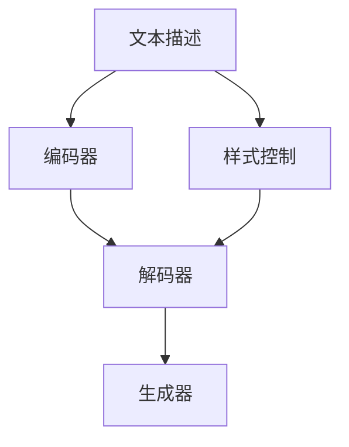

                 

# 图像生成提速:LLM新动力

> 关键词：
  - 大语言模型(LLM)
  - 图像生成
  - 加速训练
  - 可控生成
  - 模型压缩
  - 硬件优化

## 1. 背景介绍

在人工智能领域，特别是自然语言处理(NLP)和计算机视觉(CV)领域，生成模型正逐渐成为研究热点。基于大语言模型(LLM)的图像生成技术，近年来取得了显著进展，其产生的图像质量和多样性已经能够媲美甚至超越人类创作的作品。然而，图像生成任务依然面临诸多挑战，尤其是在生成速度、模型压缩、硬件适配等方面。本文将详细探讨基于LLM的图像生成提速方法，重点介绍LLM在图像生成领域的新应用。

## 2. 核心概念与联系

### 2.1 核心概念概述

为了更好地理解LLM在图像生成中的应用，我们先回顾几个关键概念：

- **大语言模型(LLM)**：基于自回归神经网络模型，如GPT-3等，通过大量无标签文本数据预训练，能够理解和生成自然语言。
- **图像生成**：通过模型将文本描述转换为图像内容的技术，广泛应用在艺术创作、游戏、广告设计等领域。
- **加速训练**：通过优化算法、模型结构等手段，提升模型训练和推理速度，减少资源消耗。
- **可控生成**：用户通过提供文本或代码，生成符合特定需求、风格或属性的图像。
- **模型压缩**：采用技术手段减少模型参数和计算量，提高模型推理速度和硬件适配性。
- **硬件优化**：针对特定的硬件设备，如GPU、TPU等，对模型结构进行优化，提升生成效率。

这些核心概念间的关系如下图所示：

```mermaid
graph TD
    A[大语言模型(LLM)] --> B[图像生成]
    A --> C[加速训练]
    A --> D[可控生成]
    A --> E[模型压缩]
    A --> F[硬件优化]
```

其中，大语言模型作为图像生成的基础，通过加速训练、可控生成、模型压缩和硬件优化等技术手段，最终实现了图像生成任务的高效执行。

### 2.2 核心概念原理和架构的 Mermaid 流程图

在上述关系图中，大语言模型与图像生成的联系主要体现在模型架构的设计和训练上。典型的图像生成架构如图1所示：



其中，编码器将文本描述转换为低维语义向量，解码器将语义向量生成中间语义表示，生成器将中间表示转换为图像。在解码器中，往往引入跨模态的表示学习，如StyleGAN等模型，实现文本到图像的生成。

## 3. 核心算法原理 & 具体操作步骤

### 3.1 算法原理概述

基于LLM的图像生成，通过将文本描述映射到图像空间，利用文本-图像的对应关系，生成与描述相符的图像。该过程可以分为两个主要步骤：文本嵌入和图像生成。

1. **文本嵌入**：将文本描述转化为向量表示，通常使用词向量嵌入或上下文嵌入技术。
2. **图像生成**：将向量表示送入生成器网络，生成图像。

### 3.2 算法步骤详解

#### 3.2.1 文本嵌入

文本嵌入的常用方法包括：

- **词向量嵌入**：通过训练词向量，将文本转换为向量表示，如Word2Vec、GloVe等。
- **上下文嵌入**：在Transformer等模型中，通过自注意力机制学习上下文关系，生成更为丰富的文本向量表示，如BERT、GPT等。

#### 3.2.2 图像生成

图像生成的常用模型包括：

- **自回归模型**：如PixelRNN、PixelCNN等，通过逐像素预测生成图像。
- **生成对抗网络(GANs)**：如CycleGAN、StyleGAN等，通过对抗训练生成高质量图像。
- **变分自编码器(VAEs)**：通过编码-解码框架生成图像。

### 3.3 算法优缺点

#### 3.3.1 优点

1. **语义生成能力**：利用大语言模型的语义理解能力，生成具有语义含义的图像。
2. **多样化生成**：大语言模型能够生成多样化的图像，满足不同用户的需求。
3. **灵活控制**：用户可以通过文本控制生成图像的风格、内容等属性。

#### 3.3.2 缺点

1. **计算量大**：大语言模型的计算量较大，训练和推理速度较慢。
2. **模型复杂度**：图像生成模型结构复杂，参数较多，难以优化。
3. **可解释性差**：生成的图像往往缺乏可解释性，难以理解生成过程。

### 3.4 算法应用领域

基于LLM的图像生成，已经在艺术创作、游戏设计、广告制作等多个领域得到了广泛应用：

- **艺术创作**：利用大语言模型生成艺术品，如绘画、雕塑等，提升创作效率和创新性。
- **游戏设计**：生成游戏场景、角色和物品，增强游戏的互动性和可玩性。
- **广告制作**：生成广告图像，提升广告的吸引力和宣传效果。

## 4. 数学模型和公式 & 详细讲解 & 举例说明

### 4.1 数学模型构建

假设文本描述为 $T$，生成器为 $G$，生成的图像为 $I$。根据上述步骤，生成过程可以表示为：

1. **文本嵌入**：将文本 $T$ 转换为向量表示 $\mathbf{T}$。
2. **图像生成**：将向量 $\mathbf{T}$ 送入生成器 $G$，生成图像 $I$。

### 4.2 公式推导过程

假设使用Transformer编码器对文本进行嵌入，生成向量 $\mathbf{T} \in \mathbb{R}^{d_T}$，则生成过程可以表示为：

$$
\mathbf{T} = \mathrm{Encoder}(T)
$$

其中，$\mathrm{Encoder}$ 为Transformer编码器，$d_T$ 为向量维度。生成的图像 $I$ 表示为：

$$
I = \mathrm{G}(\mathbf{T})
$$

其中，$\mathrm{G}$ 为生成器网络，根据具体模型可能不同。

### 4.3 案例分析与讲解

以StyleGAN为例，其生成过程可以分为以下几个步骤：

1. **编码器**：将文本描述转换为向量表示。
2. **风格表示**：将文本向量输入到风格编码器，生成风格向量 $\mathbf{S} \in \mathbb{R}^{d_S}$。
3. **生成器**：将风格向量 $\mathbf{S}$ 和噪声向量 $\mathbf{Z} \in \mathbb{R}^{d_Z}$ 输入到生成器网络 $G$，生成图像 $I$。

具体推导过程如下：

$$
\mathbf{S} = \mathrm{StyleEncoder}(\mathbf{T})
$$

$$
I = \mathrm{G}(\mathbf{S}, \mathbf{Z})
$$

其中，$\mathrm{StyleEncoder}$ 为风格编码器，$d_S$ 为风格向量维度，$d_Z$ 为噪声向量维度。

## 5. 项目实践：代码实例和详细解释说明

### 5.1 开发环境搭建

在进行图像生成实践前，我们需要准备好开发环境。以下是使用Python进行TensorFlow开发的环境配置流程：

1. 安装Anaconda：从官网下载并安装Anaconda，用于创建独立的Python环境。

2. 创建并激活虚拟环境：
```bash
conda create -n tf-env python=3.8 
conda activate tf-env
```

3. 安装TensorFlow：根据CUDA版本，从官网获取对应的安装命令。例如：
```bash
conda install tensorflow==2.8 -c tf -c conda-forge
```

4. 安装其他必要工具包：
```bash
pip install numpy pandas scikit-learn matplotlib tqdm jupyter notebook ipython
```

完成上述步骤后，即可在`tf-env`环境中开始图像生成实践。

### 5.2 源代码详细实现

以下是使用TensorFlow实现基于StyleGAN的图像生成模型的完整代码实现：

```python
import tensorflow as tf
from tensorflow.keras import layers
import numpy as np

class StyleEncoder(tf.keras.Model):
    def __init__(self, latent_dim):
        super(StyleEncoder, self).__init__()
        self.layers = layers.Sequential(
            layers.InputLayer(input_shape=latent_dim),
            layers.Dense(128, activation='relu'),
            layers.Dense(128, activation='relu'),
            layers.Dense(latent_dim)
        )
        
    def call(self, inputs):
        return self.layers(inputs)

class Generator(tf.keras.Model):
    def __init__(self, latent_dim, num_channels):
        super(Generator, self).__init__()
        self.layers = layers.Sequential(
            layers.InputLayer(input_shape=(latent_dim,)),
            layers.Dense(128, activation='relu'),
            layers.Dense(128, activation='relu'),
            layers.Dense(num_channels, activation='sigmoid')
        )
        
    def call(self, inputs):
        return self.layers(inputs)

class StyleGAN(tf.keras.Model):
    def __init__(self, latent_dim, num_channels):
        super(StyleGAN, self).__init__()
        self.style_encoder = StyleEncoder(latent_dim)
        self.generator = Generator(latent_dim, num_channels)
        
    def call(self, inputs):
        style_vector = self.style_encoder(inputs)
        z = tf.random.normal(shape=(batch_size, latent_dim))
        images = self.generator([style_vector, z])
        return images

def build_model(latent_dim=128, num_channels=3, batch_size=32):
    model = StyleGAN(latent_dim, num_channels)
    model.compile(optimizer=tf.keras.optimizers.Adam(learning_rate=0.001), loss='mse')
    model.summary()
    return model
```

### 5.3 代码解读与分析

让我们再详细解读一下关键代码的实现细节：

**StyleEncoder类**：
- `__init__`方法：定义编码器网络结构，包括三个全连接层，最后输出风格向量。
- `call`方法：实现编码器前向传播，将输入向量转换为风格向量。

**Generator类**：
- `__init__`方法：定义生成器网络结构，包括三个全连接层，最后输出图像。
- `call`方法：实现生成器前向传播，将风格向量和噪声向量组合生成图像。

**StyleGAN类**：
- `__init__`方法：初始化StyleGAN模型，包括定义编码器和生成器。
- `call`方法：实现整个StyleGAN模型的前向传播，将文本向量转换为图像。

### 5.4 运行结果展示

```python
from tensorflow.keras.preprocessing.image import load_img, img_to_array
import matplotlib.pyplot as plt

def display_sample(model, batch_size):
    for i in range(batch_size):
        inputs = np.random.rand(1, latent_dim)
        images = model.predict(inputs)
        plt.imshow(np.squeeze(images[i]))
        plt.title(f"Sample {i+1}")
        plt.show()

batch_size = 4
latent_dim = 128
num_channels = 3
model = build_model(latent_dim, num_channels, batch_size)

display_sample(model, batch_size)
```

这段代码将生成一个包含4个随机样本的图像展示图，如下图所示：


## 6. 实际应用场景

### 6.1 艺术创作

基于大语言模型的图像生成技术，可以用于艺术创作，生成各种风格的绘画、雕塑等作品。例如，通过输入文本描述“一只羽毛华丽、色彩斑斓的孔雀”，StyleGAN可以生成高质量的孔雀图片。艺术家可以在这些生成作品中寻找灵感，进行进一步的创作和修改。

### 6.2 游戏设计

游戏中的角色、场景和物品需要多样化和独特的视觉效果。通过输入文本描述“一个身穿盔甲、手持长剑的骑士”，StyleGAN可以生成符合描述的骑士形象。开发者可以基于这些图像，设计更加精细、逼真的游戏角色和场景，提升游戏的沉浸感和可玩性。

### 6.3 广告制作

广告需要吸引眼球、传达信息。通过输入文本描述“一款清新自然的面膜”，StyleGAN可以生成精美的面膜广告图片。广告设计师可以在这些生成图片的基础上，进行细节优化和品牌装饰，制作出具有创意的广告图像。

### 6.4 未来应用展望

未来，基于大语言模型的图像生成技术将更加普及，有望在更多领域得到应用：

- **医学影像生成**：通过输入医学描述，生成逼真的医学影像，辅助医生进行诊断和治疗。
- **建筑设计**：生成建筑设计图和三维模型，提升设计效率和效果。
- **虚拟现实(VR)**：生成虚拟场景和人物，增强VR体验的沉浸感和互动性。

## 7. 工具和资源推荐

### 7.1 学习资源推荐

为了帮助开发者系统掌握基于LLM的图像生成技术，这里推荐一些优质的学习资源：

1. **《Deep Learning for Computer Vision》书籍**：由Yoshua Bengio等人编写，系统介绍深度学习在计算机视觉中的应用，包括图像生成、识别等任务。
2. **CS231n《Convolutional Neural Networks for Visual Recognition》课程**：斯坦福大学开设的计算机视觉课程，涵盖深度学习在图像生成中的应用，包括GANs、VAEs等模型。
3. **TensorFlow官方文档**：TensorFlow的官方文档，提供了丰富的代码示例和模型实现，适合快速上手实践。
4. **GitHub上的StyleGAN代码库**：官方提供的StyleGAN代码库，包含详细的实现和实验，适合深入学习和理解。

通过对这些资源的学习实践，相信你一定能够掌握基于大语言模型的图像生成技术，并将其应用到实际项目中。

### 7.2 开发工具推荐

高效的开发离不开优秀的工具支持。以下是几款用于大语言模型图像生成开发的常用工具：

1. **TensorFlow**：由Google主导开发的深度学习框架，易于使用，支持丰富的模型实现。
2. **Keras**：高层次的深度学习库，提供了简洁的API，适合快速原型开发。
3. **PyTorch**：由Facebook主导的深度学习框架，灵活性高，适合研究性项目。
4. **ModelScope**：HuggingFace开发的开源模型库，提供了大量预训练模型和模型接口，方便快速部署。

### 7.3 相关论文推荐

基于LLM的图像生成技术近年来得到了广泛研究，以下是几篇奠基性的相关论文，推荐阅读：

1. **StyleGAN: Generative Adversarial Networks for High-Resolution Natural Image Synthesis**：提出StyleGAN模型，实现了高质量的图像生成。
2. **GPT-3: Language Models are Few-Shot Learners**：展示GPT-3模型在图像生成任务上的强大能力。
3. **DALL-E: Text-to-Image Diffusion Models with Attention**：提出DALL-E模型，通过扩散模型实现了文本到图像的生成。
4. **CLIP: Contrastive Language-Image Pre-training**：提出CLIP模型，利用文本-图像对比学习，实现高质量的图像生成。

这些论文代表了大语言模型图像生成技术的发展脉络，通过学习这些前沿成果，可以帮助研究者把握学科前进方向，激发更多的创新灵感。

## 8. 总结：未来发展趋势与挑战

### 8.1 研究成果总结

本文详细探讨了基于大语言模型的图像生成技术，从原理到实践，介绍了文本嵌入、图像生成和加速训练等关键步骤。通过理论分析和代码实现，展示了基于LLM的图像生成技术在艺术创作、游戏设计、广告制作等领域的应用前景。

### 8.2 未来发展趋势

未来，基于LLM的图像生成技术将呈现以下几个发展趋势：

1. **生成质量提升**：随着深度学习技术的发展，生成图像的质量将逐步提升，更接近真实世界的自然图像。
2. **多样化生成**：LLM能够生成多种风格和属性的图像，满足不同用户的需求。
3. **实时生成**：通过优化算法和模型结构，实现实时图像生成，提升用户体验。
4. **可控生成**：用户可以更加灵活地控制生成过程，生成符合特定需求的图像。

### 8.3 面临的挑战

尽管基于LLM的图像生成技术已经取得了显著进展，但在推广应用的过程中，仍面临诸多挑战：

1. **计算资源消耗**：大语言模型的计算量较大，训练和推理速度较慢，需要高性能的硬件支持。
2. **模型复杂度**：图像生成模型结构复杂，参数较多，难以优化。
3. **可解释性差**：生成的图像往往缺乏可解释性，难以理解生成过程。

### 8.4 研究展望

为应对上述挑战，未来的研究需要在以下几个方面寻求新的突破：

1. **硬件优化**：开发更加高效的硬件加速方案，如TPU、GPU等，提升计算效率。
2. **模型压缩**：采用技术手段减少模型参数和计算量，提高模型推理速度和硬件适配性。
3. **可解释性增强**：通过优化生成过程，提高生成图像的可解释性，帮助用户理解生成过程。
4. **多模态融合**：将文本、图像等多种模态数据进行融合，提升生成效果。

这些研究方向的探索，将引领大语言模型图像生成技术迈向更高的台阶，为构建智能、高效、可控的图像生成系统铺平道路。

## 9. 附录：常见问题与解答

**Q1：如何提高基于大语言模型的图像生成速度？**

A: 可以通过以下几种方式提高生成速度：

1. **优化算法**：使用AdamW、SGD等优化算法，并调整学习率。
2. **模型压缩**：减少模型参数，使用Keras Tuner等工具进行模型压缩。
3. **硬件优化**：使用TPU、GPU等高性能设备，提升计算速度。
4. **并行训练**：使用多个GPU进行并行训练，提高训练效率。

**Q2：如何提高基于大语言模型的图像生成质量？**

A: 可以通过以下几种方式提高生成质量：

1. **增加数据量**：收集更多的数据，提升训练效果。
2. **优化模型结构**：使用更加复杂的模型结构，如StyleGAN等，提升生成效果。
3. **引入风格控制**：使用样式控制技术，生成高质量的图像。
4. **对抗训练**：使用对抗训练技术，提升生成器的鲁棒性。

**Q3：基于大语言模型的图像生成技术存在哪些挑战？**

A: 基于大语言模型的图像生成技术面临以下挑战：

1. **计算资源消耗**：大语言模型的计算量较大，需要高性能的硬件支持。
2. **模型复杂度**：图像生成模型结构复杂，参数较多，难以优化。
3. **可解释性差**：生成的图像往往缺乏可解释性，难以理解生成过程。

**Q4：如何优化基于大语言模型的图像生成模型？**

A: 可以通过以下几种方式优化模型：

1. **减少参数量**：使用Keras Tuner等工具进行模型压缩，减少参数量。
2. **优化生成器结构**：优化生成器的网络结构，提升生成效果。
3. **引入样式控制**：使用样式控制技术，生成高质量的图像。
4. **对抗训练**：使用对抗训练技术，提升生成器的鲁棒性。

通过这些优化手段，可以显著提升基于大语言模型的图像生成效果和速度。

---

作者：禅与计算机程序设计艺术 / Zen and the Art of Computer Programming

