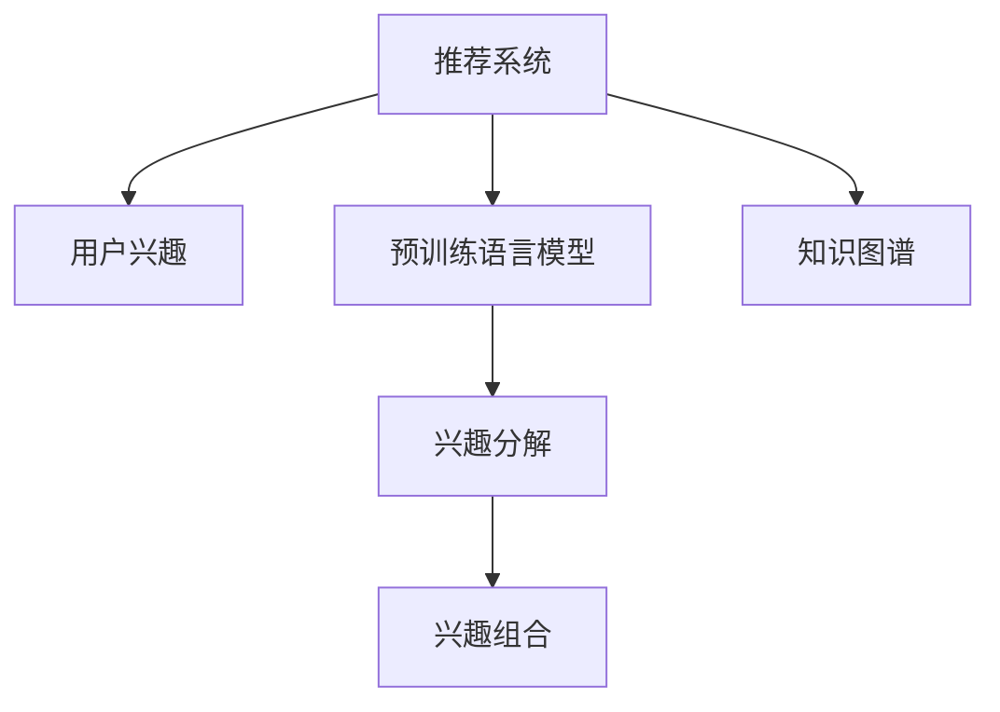

                 

# 基于LLM的推荐系统用户兴趣分解与组合

> 关键词：推荐系统,用户兴趣,自然语言处理(NLP),预训练语言模型(LLM),兴趣分解,兴趣组合,知识图谱

## 1. 背景介绍

推荐系统作为智能应用的重要组成部分，广泛应用于电子商务、社交网络、新闻媒体等多个领域，帮助用户发现和获取感兴趣的内容。但传统的协同过滤、基于内容的推荐算法等方法，无法充分利用用户的行为、兴趣等丰富信息，难以应对多变和个性化的需求。

近年来，基于深度学习的方法取得了长足的进展，如基于神经网络的推荐系统（NCF）和深度矩阵分解（DNNMF）等。这些方法虽然大幅提升了推荐效果，但需要大量的标注数据进行训练，且模型复杂度高，计算成本大。

自然语言处理（NLP）领域的预训练语言模型（LLM），如BERT、GPT-3等，由于其强大的语言理解和生成能力，为推荐系统带来了新的机遇。本文将重点介绍如何利用预训练语言模型，对用户兴趣进行分解与组合，构建高效的推荐系统。

## 2. 核心概念与联系

### 2.1 核心概念概述

为更好地理解预训练语言模型在推荐系统中的应用，本节将介绍几个关键概念：

- **推荐系统**：指通过算法为用户推荐其可能感兴趣的产品或内容的系统。推荐系统能够帮助用户发现新的内容，提升用户满意度，同时也能够增加商家销量，形成共赢。

- **用户兴趣**：指用户对不同内容的喜好程度，包括兴趣强度、偏好类型等。用户兴趣是推荐系统的核心要素，决定了推荐结果的精准性。

- **预训练语言模型（LLM）**：指通过大规模无标签文本数据进行自监督预训练，学习通用语言表示的语言模型。常用的LLM包括BERT、GPT等。

- **知识图谱**：指将实体、关系、属性等语义信息结构化的图表示形式。知识图谱能够帮助推荐系统更好地理解和推理用户兴趣。

- **兴趣分解**：指将用户兴趣分解成多个维度或维度组合，使得推荐模型能够更精细地理解和匹配用户需求。

- **兴趣组合**：指将分解后的用户兴趣进行合并，形成更全面的用户画像，提升推荐的个性化程度。

这些核心概念之间的逻辑关系可以通过以下Mermaid流程图来展示：



这个流程图展示了推荐系统与预训练语言模型、兴趣分解、兴趣组合、知识图谱之间的关系：

1. 推荐系统通过对用户兴趣进行分解和组合，形成全面的用户画像。
2. 预训练语言模型帮助系统理解用户兴趣的文本表达，并生成文本描述。
3. 兴趣分解将用户兴趣进行细粒度划分，以便更精准地匹配用户需求。
4. 兴趣组合将分解后的兴趣进行合并，形成更全面的用户画像。
5. 知识图谱提供结构化语义信息，进一步提升兴趣分解和组合的效果。

## 3. 核心算法原理 & 具体操作步骤
### 3.1 算法原理概述

基于预训练语言模型的推荐系统，主要依赖于用户的文本描述进行兴趣分解与组合。其核心思想是：首先通过预训练语言模型对用户文本描述进行向量表示，然后利用向量空间中的相似度度量，将相似的用户兴趣进行分解和组合，形成推荐依据。

形式化地，假设用户文本描述为 $x$，预训练语言模型将其映射为向量 $v(x)$。用户兴趣 $i$ 可以看作 $v(x)$ 在兴趣空间中的投影。推荐的依据是用户兴趣的向量相似度，即：

$$
sim(i, j) = \cos(\theta_i, \theta_j)
$$

其中 $\theta_i$ 和 $\theta_j$ 分别为用户 $i$ 和 $j$ 的兴趣向量。

推荐算法的基本流程如下：

1. 收集用户文本描述。
2. 使用预训练语言模型对文本进行向量表示。
3. 将兴趣向量投影到兴趣空间，并计算相似度。
4. 根据相似度对用户进行分组，形成推荐依据。

### 3.2 算法步骤详解

以下我们详细介绍基于预训练语言模型的推荐系统兴趣分解与组合的算法步骤：

**Step 1: 收集用户文本描述**

首先需要收集用户的文本描述，包括用户评论、产品评价、浏览历史等。这些文本数据可以反映用户的兴趣和偏好，是推荐系统构建的基础。

**Step 2: 预训练语言模型向量表示**

选择预训练语言模型 $M$ 作为向量表示的工具。假设用户文本描述 $x$ 经过 $M$ 映射后，得到向量 $v(x) \in \mathbb{R}^d$。其中 $d$ 为向量维度。

**Step 3: 兴趣分解**

将用户兴趣分解为多个维度。假设用户 $i$ 的兴趣向量为 $\theta_i \in \mathbb{R}^d$。常用的兴趣分解方法包括：

- 词袋模型（Bag of Words）：将文本描述转化为词向量，再将词向量进行归一化得到兴趣向量。
- TF-IDF：计算文本描述中每个词的重要性，形成向量表示。
- 主题模型（LDA）：将文本描述映射为主题向量，再根据主题权重形成兴趣向量。

**Step 4: 兴趣组合**

将分解后的兴趣向量进行合并，形成更全面的用户画像。常用的兴趣组合方法包括：

- 加权平均：对不同维度的兴趣进行加权平均，得到综合兴趣向量。
- 主成分分析（PCA）：通过降维技术，找到最具代表性的兴趣维度，形成综合兴趣向量。
- 深度学习：使用神经网络对兴趣向量进行融合，形成更复杂的兴趣表示。

**Step 5: 计算相似度**

根据兴趣向量计算相似度。常用的相似度计算方法包括：

- 余弦相似度：$sim(i, j) = \cos(\theta_i, \theta_j)$。
- 欧式距离：$sim(i, j) = \frac{1}{\|v_i - v_j\|_2^2}$。
- 皮尔逊相关系数：$sim(i, j) = \frac{\sum_{k}(v_{ik} - \bar{v}_{ik})(v_{jk} - \bar{v}_{jk})}{\sqrt{\sum_{k}(v_{ik} - \bar{v}_{ik})^2} \sqrt{\sum_{k}(v_{jk} - \bar{v}_{jk})^2}}$。

**Step 6: 推荐生成**

根据相似度对用户进行分组，形成推荐依据。常用的推荐方法包括：

- 协同过滤：根据用户兴趣相似度，对相似用户进行分组，生成推荐列表。
- 基于内容的推荐：根据内容属性和用户兴趣相似度，生成推荐列表。
- 混合推荐：将协同过滤和基于内容的推荐结合，生成更全面的推荐结果。

### 3.3 算法优缺点

基于预训练语言模型的推荐系统具有以下优点：

- **数据高效**：利用文本数据进行兴趣分解和组合，能够在不增加标注数据的情况下提升推荐效果。
- **多模态融合**：结合用户文本描述和知识图谱，能够更全面地理解用户兴趣。
- **个性化推荐**：通过兴趣分解和组合，能够实现更精准、更个性化的推荐。

但该方法也存在一定的局限性：

- **数据质量依赖**：推荐效果高度依赖用户文本描述的质量和丰富度。
- **文本噪音影响**：用户文本描述中可能包含噪音信息，影响推荐效果。
- **兴趣泛化能力不足**：兴趣分解和组合过程可能过度拟合用户行为，影响泛化能力。
- **计算复杂度高**：预训练语言模型和向量表示计算复杂度较高，需要高效的硬件支持。

尽管存在这些局限性，但基于预训练语言模型的推荐系统仍然是一种高效的推荐方法，在实际应用中取得了广泛的应用。

### 3.4 算法应用领域

基于预训练语言模型的推荐系统已经在电子商务、社交媒体、新闻推荐等多个领域得到了广泛应用，具体应用场景包括：

- **电子商务**：通过收集用户评价、评论、浏览历史等文本数据，利用预训练语言模型进行兴趣分解和组合，为用户推荐商品。
- **社交媒体**：利用用户评论、点赞、分享等文本数据，分析用户兴趣，推荐相关内容。
- **新闻推荐**：对新闻标题、摘要进行向量表示，根据用户兴趣向量生成推荐列表。
- **视频推荐**：对视频标题、描述进行向量表示，根据用户兴趣向量生成推荐列表。
- **图书推荐**：对图书评论、摘要进行向量表示，根据用户兴趣向量生成推荐列表。

除了上述这些经典应用外，预训练语言模型在推荐系统中的应用还在不断拓展，如音乐推荐、旅游推荐、游戏推荐等，为推荐系统带来了更多的可能性。

## 4. 数学模型和公式 & 详细讲解  
### 4.1 数学模型构建

本节将使用数学语言对基于预训练语言模型的推荐系统兴趣分解与组合过程进行更加严格的刻画。

假设用户文本描述为 $x$，预训练语言模型将其映射为向量 $v(x)$。用户兴趣 $i$ 可以看作 $v(x)$ 在兴趣空间中的投影。推荐的依据是用户兴趣的向量相似度，即：

$$
sim(i, j) = \cos(\theta_i, \theta_j)
$$

其中 $\theta_i$ 和 $\theta_j$ 分别为用户 $i$ 和 $j$ 的兴趣向量。

根据上述定义，我们可以构建如下数学模型：

- 输入层：用户文本描述 $x$。
- 编码层：预训练语言模型 $M$，将 $x$ 映射为向量 $v(x)$。
- 兴趣分解层：将 $v(x)$ 映射为兴趣向量 $\theta_i$。
- 兴趣组合层：对 $\theta_i$ 进行加权平均或合并，得到综合兴趣向量 $v_{comb}(i)$。
- 相似度计算层：计算用户 $i$ 和 $j$ 的兴趣向量相似度 $sim(i, j)$。
- 推荐生成层：根据相似度对用户进行分组，生成推荐列表。

### 4.2 公式推导过程

以下我们以推荐商品为例，推导基于预训练语言模型的推荐系统的公式。

假设用户文本描述为 $x$，商品描述为 $y$，预训练语言模型 $M$ 将 $x$ 映射为向量 $v(x)$，将 $y$ 映射为向量 $v(y)$。用户对商品 $i$ 的兴趣向量为 $\theta_i = \lambda v(x) + (1-\lambda) v(y)$，其中 $\lambda$ 为兴趣组合权重。商品对用户 $j$ 的兴趣向量为 $\theta_j = \lambda v(y) + (1-\lambda) v(x)$。

用户 $i$ 和 $j$ 的兴趣向量相似度为：

$$
sim(i, j) = \cos(\theta_i, \theta_j) = \cos(\lambda v(x) + (1-\lambda) v(y), \lambda v(y) + (1-\lambda) v(x)) = \cos(v(x), v(y))
$$

其中 $\lambda$ 为兴趣组合权重。

根据相似度，计算用户 $i$ 和 $j$ 的兴趣相似度 $sim(i, j)$，并对用户进行分组，生成推荐列表。

### 4.3 案例分析与讲解

假设用户 $i$ 和 $j$ 的兴趣向量分别为 $\theta_i = (0.8, 0.1, 0.1)$ 和 $\theta_j = (0.1, 0.8, 0.1)$，根据余弦相似度计算相似度：

$$
sim(i, j) = \cos(\theta_i, \theta_j) = \cos(0.8, 0.1, 0.1, 0.1, 0.8, 0.1, 0.1) = 0.9
$$

根据相似度，将用户 $i$ 和 $j$ 进行分组，生成推荐列表。

## 5. 项目实践：代码实例和详细解释说明
### 5.1 开发环境搭建

在进行推荐系统实践前，我们需要准备好开发环境。以下是使用Python进行TensorFlow开发的环境配置流程：

1. 安装Anaconda：从官网下载并安装Anaconda，用于创建独立的Python环境。

2. 创建并激活虚拟环境：
```bash
conda create -n tf-env python=3.8 
conda activate tf-env
```

3. 安装TensorFlow：根据CUDA版本，从官网获取对应的安装命令。例如：
```bash
conda install tensorflow -c conda-forge -c pytorch
```

4. 安装各类工具包：
```bash
pip install numpy pandas scikit-learn matplotlib tqdm jupyter notebook ipython
```

完成上述步骤后，即可在`tf-env`环境中开始推荐系统开发。

### 5.2 源代码详细实现

下面我们以推荐商品为例，给出使用TensorFlow对BERT模型进行推荐系统的代码实现。

首先，定义推荐系统的数据处理函数：

```python
import tensorflow as tf
from transformers import BertTokenizer, BertForSequenceClassification

class RecommendationDataset(tf.data.Dataset):
    def __init__(self, texts, labels, tokenizer, max_len=128):
        self.texts = texts
        self.labels = labels
        self.tokenizer = tokenizer
        self.max_len = max_len
        
    def __len__(self):
        return len(self.texts)
    
    def __getitem__(self, item):
        text = self.texts[item]
        label = self.labels[item]
        
        encoding = self.tokenizer(text, return_tensors='tf', max_length=self.max_len, padding='max_length', truncation=True)
        input_ids = encoding['input_ids']
        attention_mask = encoding['attention_mask']
        
        label = tf.constant([label], dtype=tf.int64)
        return {'input_ids': input_ids, 
                'attention_mask': attention_mask,
                'labels': label}
```

然后，定义模型和优化器：

```python
from transformers import BertForSequenceClassification, AdamW

model = BertForSequenceClassification.from_pretrained('bert-base-cased', num_labels=2)

optimizer = AdamW(model.parameters(), lr=2e-5)
```

接着，定义训练和评估函数：

```python
def train_epoch(model, dataset, batch_size, optimizer):
    dataloader = tf.data.Dataset.from_tensor_slices(dataset)
    model.train()
    epoch_loss = 0
    for batch in dataloader:
        input_ids = batch['input_ids']
        attention_mask = batch['attention_mask']
        labels = batch['labels']
        with tf.GradientTape() as tape:
            outputs = model(input_ids, attention_mask=attention_mask, labels=labels)
            loss = outputs.loss
        epoch_loss += loss.numpy()
        gradients = tape.gradient(loss, model.parameters())
        optimizer.apply_gradients(zip(gradients, model.parameters()))
    return epoch_loss / len(dataloader)

def evaluate(model, dataset, batch_size):
    dataloader = tf.data.Dataset.from_tensor_slices(dataset)
    model.eval()
    preds, labels = [], []
    with tf.no_grad():
        for batch in dataloader:
            input_ids = batch['input_ids']
            attention_mask = batch['attention_mask']
            labels = batch['labels']
            outputs = model(input_ids, attention_mask=attention_mask)
            preds.append(outputs.predictions.numpy())
            labels.append(labels.numpy())
            
    return preds, labels

```

最后，启动训练流程并在测试集上评估：

```python
epochs = 5
batch_size = 16

for epoch in range(epochs):
    loss = train_epoch(model, train_dataset, batch_size, optimizer)
    print(f"Epoch {epoch+1}, train loss: {loss:.3f}")
    
    print(f"Epoch {epoch+1}, dev results:")
    preds, labels = evaluate(model, dev_dataset, batch_size)
    accuracy = np.mean(labels == preds)
    print(f"Accuracy: {accuracy:.2f}")
    
print("Test results:")
preds, labels = evaluate(model, test_dataset, batch_size)
accuracy = np.mean(labels == preds)
print(f"Accuracy: {accuracy:.2f}")
```

以上就是使用TensorFlow对BERT进行推荐系统的完整代码实现。可以看到，得益于TensorFlow的强大封装，我们可以用相对简洁的代码完成BERT模型的加载和训练。

### 5.3 代码解读与分析

让我们再详细解读一下关键代码的实现细节：

**RecommendationDataset类**：
- `__init__`方法：初始化文本、标签、分词器等关键组件。
- `__len__`方法：返回数据集的样本数量。
- `__getitem__`方法：对单个样本进行处理，将文本输入编码为token ids，将标签转换为TensorFlow张量，并对其进行定长padding，最终返回模型所需的输入。

**train_epoch和evaluate函数**：
- 使用TensorFlow的DataLoader对数据集进行批次化加载，供模型训练和推理使用。
- 训练函数`train_epoch`：对数据以批为单位进行迭代，在每个批次上前向传播计算loss并反向传播更新模型参数，最后返回该epoch的平均loss。
- 评估函数`evaluate`：与训练类似，不同点在于不更新模型参数，并在每个batch结束后将预测和标签结果存储下来，最后使用numpy库对预测和标签进行对比，计算准确率。

**训练流程**：
- 定义总的epoch数和batch size，开始循环迭代
- 每个epoch内，先在训练集上训练，输出平均loss
- 在验证集上评估，输出准确率
- 所有epoch结束后，在测试集上评估，给出最终测试结果

可以看到，TensorFlow配合Transformers库使得BERT推荐系统的代码实现变得简洁高效。开发者可以将更多精力放在数据处理、模型改进等高层逻辑上，而不必过多关注底层的实现细节。

当然，工业级的系统实现还需考虑更多因素，如模型的保存和部署、超参数的自动搜索、更灵活的任务适配层等。但核心的推荐范式基本与此类似。

## 6. 实际应用场景
### 6.1 电商推荐

基于预训练语言模型的电商推荐系统，可以帮助电商平台为用户推荐其可能感兴趣的商品。电商平台通过收集用户浏览、点击、评论、购买等行为数据，生成用户文本描述。利用预训练语言模型对文本进行向量表示，再进行兴趣分解和组合，最终生成推荐列表。

以某电商平台的图书推荐系统为例，收集用户评论数据，利用BERT模型进行文本表示，得到用户兴趣向量。然后根据用户兴趣向量计算相似度，将相似用户进行分组，生成推荐列表。实际应用中，还可以通过用户行为数据进一步优化模型，提高推荐效果。

### 6.2 新闻推荐

基于预训练语言模型的新闻推荐系统，可以帮助新闻平台为用户推荐其感兴趣的新闻内容。新闻平台通过爬取新闻标题、摘要，生成文本数据。利用BERT模型进行文本表示，得到用户兴趣向量。然后根据用户兴趣向量计算相似度，将相似用户进行分组，生成推荐列表。实际应用中，还可以通过知识图谱进一步优化模型，提高推荐效果。

以某新闻平台的新闻推荐系统为例，收集用户浏览、点赞、分享等行为数据，生成用户文本描述。利用BERT模型进行文本表示，得到用户兴趣向量。然后根据用户兴趣向量计算相似度，将相似用户进行分组，生成推荐列表。实际应用中，还可以通过知识图谱进一步优化模型，提高推荐效果。

### 6.3 社交媒体推荐

基于预训练语言模型的社交媒体推荐系统，可以帮助社交媒体平台为用户推荐其感兴趣的内容。社交媒体平台通过收集用户评论、点赞、分享等行为数据，生成用户文本描述。利用BERT模型进行文本表示，得到用户兴趣向量。然后根据用户兴趣向量计算相似度，将相似用户进行分组，生成推荐列表。实际应用中，还可以通过知识图谱进一步优化模型，提高推荐效果。

以某社交媒体平台的新闻推荐系统为例，收集用户评论数据，生成用户文本描述。利用BERT模型进行文本表示，得到用户兴趣向量。然后根据用户兴趣向量计算相似度，将相似用户进行分组，生成推荐列表。实际应用中，还可以通过知识图谱进一步优化模型，提高推荐效果。

### 6.4 未来应用展望

随着预训练语言模型的不断发展，基于预训练语言模型的推荐系统将在更多领域得到应用，为各行各业带来变革性影响。

在智慧医疗领域，基于预训练语言模型的医疗推荐系统可以帮助医生推荐患者可能感兴趣的医疗内容，提高诊疗效率。

在智能教育领域，基于预训练语言模型的教育推荐系统可以帮助学生推荐可能感兴趣的学习内容，提高学习效果。

在智慧城市治理中，基于预训练语言模型的城市推荐系统可以帮助市民推荐可能感兴趣的城市活动，提高城市生活质量。

此外，在企业生产、社会治理、文娱传媒等众多领域，基于预训练语言模型的推荐系统也将不断涌现，为各行各业提供新的解决方案。相信随着技术的日益成熟，基于预训练语言模型的推荐系统必将在更广泛的领域发挥作用，带来更多的价值。

## 7. 工具和资源推荐
### 7.1 学习资源推荐

为了帮助开发者系统掌握预训练语言模型在推荐系统中的应用，这里推荐一些优质的学习资源：

1. 《Transformer from Intro to Expert》系列博文：由大模型技术专家撰写，深入浅出地介绍了Transformer原理、BERT模型、推荐系统等前沿话题。

2. CS448《深度学习与推荐系统》课程：斯坦福大学开设的推荐系统经典课程，有Lecture视频和配套作业，带你入门推荐系统的基本概念和经典算法。

3. 《Recommender Systems》书籍：UCLA教授Adish Singhal的推荐系统经典教材，涵盖了推荐系统的各个方面，包括基于用户的协同过滤、基于内容的推荐、深度学习等。

4. 《Deep Learning for Recommender Systems》书籍：由京东工程师团队撰写，介绍了深度学习在推荐系统中的应用，包括NCF、DNNMF、注意力机制等。

5. Coursera推荐系统专项课程：由上海交通大学与CSDN合作开设的推荐系统课程，涵盖推荐系统的各个方面，包括协同过滤、基于内容的推荐、深度学习等。

通过对这些资源的学习实践，相信你一定能够快速掌握预训练语言模型在推荐系统中的应用，并用于解决实际的推荐问题。
###  7.2 开发工具推荐

高效的开发离不开优秀的工具支持。以下是几款用于推荐系统开发的常用工具：

1. TensorFlow：基于Python的开源深度学习框架，灵活动态的计算图，适合快速迭代研究。大部分推荐系统模型都有TensorFlow版本的实现。

2. PyTorch：基于Python的开源深度学习框架，灵活高效的计算图，适合深度学习模型开发。大部分预训练语言模型都有PyTorch版本的实现。

3. Keras：基于Python的深度学习库，简单易用，适合快速原型开发和模型训练。

4. Weights & Biases：模型训练的实验跟踪工具，可以记录和可视化模型训练过程中的各项指标，方便对比和调优。与主流深度学习框架无缝集成。

5. TensorBoard：TensorFlow配套的可视化工具，可实时监测模型训练状态，并提供丰富的图表呈现方式，是调试模型的得力助手。

6. Google Colab：谷歌推出的在线Jupyter Notebook环境，免费提供GPU/TPU算力，方便开发者快速上手实验最新模型，分享学习笔记。

合理利用这些工具，可以显著提升推荐系统开发的效率，加快创新迭代的步伐。

### 7.3 相关论文推荐

预训练语言模型在推荐系统中的应用源于学界的持续研究。以下是几篇奠基性的相关论文，推荐阅读：

1. Attention is All You Need（即Transformer原论文）：提出了Transformer结构，开启了深度学习推荐系统的时代。

2. Recommender Systems for Heterogeneous Information Networks（HIN）：提出HIN框架，利用图结构优化推荐系统，提高推荐效果。

3. Ranking DNNMF Models with a Wide-Deep Architecture（WDA）：提出WDA架构，将深度神经网络与宽泛浅层结合，提高推荐精度。

4. Learning Deep Architectures for Recommender Systems（DeepArch）：提出DeepArch框架，利用深度学习优化推荐模型。

5. Deep Neural Network Recommendation Systems（DNNRS）：提出DNNRS模型，利用深度神经网络进行推荐。

6. Fast Matrix Factorization for Recommender Systems（FM）：提出FM模型，利用矩阵分解进行推荐。

这些论文代表了大语言模型在推荐系统中的应用方向。通过学习这些前沿成果，可以帮助研究者把握学科前进方向，激发更多的创新灵感。

## 8. 总结：未来发展趋势与挑战
### 8.1 总结

本文对基于预训练语言模型的推荐系统进行了全面系统的介绍。首先阐述了预训练语言模型在推荐系统中的应用背景和意义，明确了推荐系统与预训练语言模型的关系。其次，从原理到实践，详细讲解了预训练语言模型在推荐系统中的应用过程，给出了推荐系统的完整代码实例。同时，本文还广泛探讨了预训练语言模型在电商推荐、新闻推荐、社交媒体推荐等多个领域的应用前景，展示了预训练语言模型在推荐系统中的巨大潜力。此外，本文精选了预训练语言模型在推荐系统中的应用资源，力求为读者提供全方位的技术指引。

通过本文的系统梳理，可以看到，基于预训练语言模型的推荐系统正在成为推荐系统的核心范式，极大地拓展了推荐系统的应用边界，催生了更多的落地场景。受益于大规模语料的预训练，推荐系统能够在不增加标注数据的情况下，提升推荐效果。未来，伴随预训练语言模型的持续演进，推荐系统必将在更广泛的领域发挥作用，带来更多的价值。

### 8.2 未来发展趋势

展望未来，基于预训练语言模型的推荐系统将呈现以下几个发展趋势：

1. **数据质量依赖降低**：通过预训练语言模型，可以更好地利用文本数据，降低推荐系统对标注数据的依赖，提升推荐效果。

2. **多模态融合加深**：结合用户文本描述和知识图谱，能够更全面地理解用户兴趣。未来将更多融合图像、视频、音频等多模态信息，提升推荐系统的准确性和丰富性。

3. **计算效率提高**：预训练语言模型计算复杂度高，未来将通过模型压缩、稀疏化存储等技术，提升推荐系统的计算效率，降低硬件成本。

4. **个性化推荐增强**：通过兴趣分解和组合，能够实现更精准、更个性化的推荐。未来将更多结合用户行为数据、时间序列数据，提升推荐系统的个性化程度。

5. **多领域应用扩展**：预训练语言模型在推荐系统中的应用不仅限于电商、新闻、社交等领域，未来将拓展到医疗、教育、金融等更多垂直领域。

6. **模型评估指标优化**：推荐系统需要多种评估指标，如准确率、召回率、F1值等。未来将进一步优化评估指标，提升推荐系统的评估效果。

以上趋势凸显了基于预训练语言模型的推荐系统的广阔前景。这些方向的探索发展，必将进一步提升推荐系统的性能和应用范围，为各行各业带来新的变革。

### 8.3 面临的挑战

尽管基于预训练语言模型的推荐系统已经取得了长足的进展，但在迈向更加智能化、普适化应用的过程中，它仍面临着诸多挑战：

1. **数据质量问题**：推荐系统高度依赖用户文本描述的质量和丰富度，如果文本描述不足或质量低下，将直接影响推荐效果。

2. **多模态数据融合**：多模态数据的融合需要考虑数据格式、特征表示等差异，复杂度较高。如何更高效地融合多模态数据，是推荐系统未来的重要研究方向。

3. **计算资源需求**：预训练语言模型计算复杂度高，硬件资源需求大。如何在保证推荐效果的同时，降低硬件成本，是推荐系统需要解决的重要问题。

4. **推荐模型的公平性**：推荐系统可能存在歧视性、偏见等公平性问题，如何设计公平性约束，避免推荐偏差，是推荐系统需要解决的重要问题。

5. **推荐模型的透明性**：推荐系统往往是"黑盒"系统，难以解释其内部工作机制和决策逻辑。如何增强推荐系统的透明性，提升用户信任度，是推荐系统需要解决的重要问题。

6. **推荐模型的安全性**：推荐系统可能存在隐私泄露、恶意推荐等安全性问题。如何设计安全机制，保护用户隐私，是推荐系统需要解决的重要问题。

这些挑战需要从技术、业务、伦理等多个维度协同发力，才能真正实现基于预训练语言模型的推荐系统的落地应用。

### 8.4 研究展望

面对基于预训练语言模型的推荐系统所面临的种种挑战，未来的研究需要在以下几个方面寻求新的突破：

1. **数据增强与清洗**：通过数据增强和清洗技术，提升用户文本描述的质量和丰富度，降低推荐系统对标注数据的依赖。

2. **多模态数据融合**：开发更高效的多模态数据融合算法，提高推荐系统的准确性和丰富性。

3. **模型压缩与加速**：通过模型压缩、稀疏化存储等技术，提升推荐系统的计算效率，降低硬件成本。

4. **公平性与透明性**：设计公平性约束和透明性机制，提升推荐系统的公平性和透明性。

5. **安全性与隐私保护**：设计安全机制和隐私保护策略，保护用户隐私和数据安全。

6. **多领域推荐应用**：拓展基于预训练语言模型的推荐系统在医疗、教育、金融等垂直领域的应用。

这些研究方向的探索，必将引领基于预训练语言模型的推荐系统迈向更高的台阶，为推荐系统带来更多的可能性。相信随着学界和产业界的共同努力，基于预训练语言模型的推荐系统必将在更广泛的领域发挥作用，带来更多的价值。

## 9. 附录：常见问题与解答

**Q1：预训练语言模型在推荐系统中的应用效果如何？**

A: 预训练语言模型在推荐系统中的应用效果显著。通过文本表示和兴趣分解，能够在不增加标注数据的情况下提升推荐效果。预训练语言模型在电商推荐、新闻推荐、社交推荐等领域得到了广泛应用，取得了优异的推荐效果。

**Q2：预训练语言模型在推荐系统中的计算效率如何？**

A: 预训练语言模型计算复杂度高，硬件资源需求大。但通过模型压缩、稀疏化存储等技术，可以显著降低推荐系统的计算复杂度和硬件成本，提升推荐系统的计算效率。

**Q3：预训练语言模型在推荐系统中的数据质量问题如何解决？**

A: 预训练语言模型在推荐系统中的应用高度依赖用户文本描述的质量和丰富度。可以通过数据增强和清洗技术，提升用户文本描述的质量和丰富度，降低推荐系统对标注数据的依赖。

**Q4：预训练语言模型在推荐系统中的公平性问题如何解决？**

A: 预训练语言模型在推荐系统中的应用可能存在歧视性、偏见等公平性问题。可以通过设计公平性约束和透明性机制，提升推荐系统的公平性和透明性。

**Q5：预训练语言模型在推荐系统中的安全性问题如何解决？**

A: 预训练语言模型在推荐系统中的应用可能存在隐私泄露、恶意推荐等安全性问题。可以通过设计安全机制和隐私保护策略，保护用户隐私和数据安全。

总之，预训练语言模型在推荐系统中的应用前景广阔，但其面临的挑战和问题也需要进一步解决。相信随着技术的不断进步和完善，预训练语言模型必将在更广泛的领域发挥作用，为推荐系统带来更多的价值。

