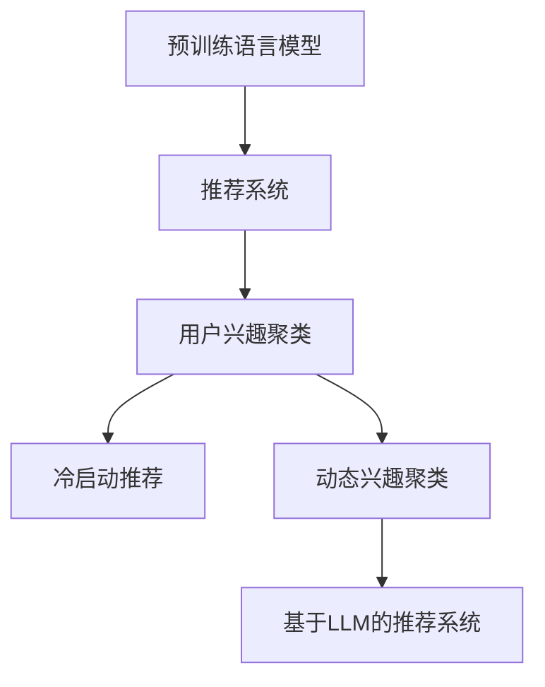
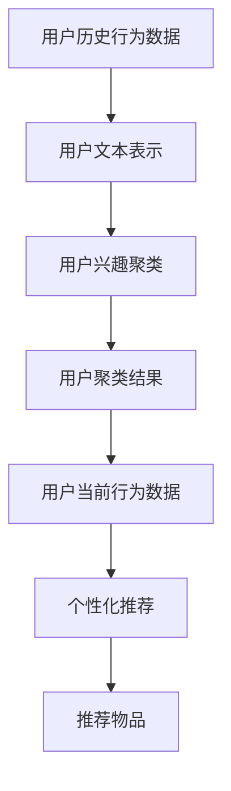

                 

# 基于LLM的推荐系统用户兴趣动态聚类

## 1. 背景介绍

### 1.1 问题由来

推荐系统是当今互联网时代的一项重要技术，用于个性化推荐用户可能感兴趣的物品。随着信息量的爆炸性增长和用户多样性的提升，推荐系统面临着用户行为数据稀疏、用户兴趣动态变化、推荐结果多样性不足等诸多挑战。

传统的推荐系统多基于静态特征和历史行为数据进行推荐，但随着用户行为数据的日积月累，用户兴趣和需求会随着时间、环境、事件等因素发生变化，静态特征难以捕捉这些动态变化。此外，历史行为数据往往带有一定的偏差，推荐结果可能无法反映当前用户的真实需求。

在现有的推荐系统中，基于机器学习和深度学习的推荐方法已经被广泛应用。这些方法通常使用用户行为数据和物品属性数据作为训练数据，通过建模用户兴趣和物品相关性，实现个性化推荐。然而，这些方法同样面临着数据稀疏、冷启动等问题，难以有效应对用户兴趣的动态变化。

基于自然语言处理(Natural Language Processing, NLP)的推荐系统近年来逐步受到关注。其中，基于大规模预训练语言模型(Large Language Models, LLMs)的方法，通过构建用户和物品之间的语义关系，并动态捕捉用户兴趣变化，为推荐系统带来了新的思路。特别是近年来，基于自回归和自编码架构的预训练语言模型，如GPT、BERT等，在推荐系统中展现了出色的性能，并在多个任务上刷新了最先进的效果。

本文聚焦于基于自回归架构的预训练语言模型，在推荐系统中的用户兴趣动态聚类和个性化推荐问题上，提出了一种基于LLM的用户兴趣动态聚类算法。该算法利用LLM的语言生成能力和语义表示能力，在推荐系统中的用户兴趣聚类、推荐物品生成、冷启动推荐等方面进行了有益的探索和实验，展示了强大的应用潜力。

## 2. 核心概念与联系

### 2.1 核心概念概述

本节将详细介绍与基于LLM的推荐系统用户兴趣动态聚类算法相关的核心概念：

- **预训练语言模型(Pre-trained Language Model, PLM)**：一种通过大规模无标签文本语料预训练的深度学习模型，具备强大的语言理解和生成能力。常用的预训练语言模型有GPT、BERT、XLNet等。

- **推荐系统(Recommendation System)**：通过用户历史行为数据和物品属性数据，为用户推荐可能感兴趣的物品的系统。推荐系统广泛应用在电商、社交、视频等多个领域。

- **用户兴趣聚类(User Interest Clustering)**：将用户的历史行为数据进行聚类，发现用户的兴趣偏好，并对其进行刻画。用户兴趣聚类是推荐系统中的重要环节，对后续的推荐物品生成和推荐策略优化至关重要。

- **冷启动推荐(Cold Start Recommendation)**：当新用户或新物品进入推荐系统时，缺乏足够的历史数据进行推荐，需要通过其他方式进行推荐。冷启动推荐是推荐系统中需要解决的重要问题。

- **动态兴趣聚类(Dynamic Interest Clustering)**：用户兴趣会随时间、环境、事件等因素发生变化，需要动态更新用户兴趣聚类模型，以反映用户兴趣的变化。动态兴趣聚类是推荐系统应对用户兴趣动态变化的重要手段。

- **基于LLM的推荐系统(LLM-based Recommendation System)**：利用LLM的语言生成能力和语义表示能力，对用户兴趣进行动态聚类和个性化推荐。

这些核心概念之间的逻辑关系可以通过以下Mermaid流程图来展示：



这个流程图展示了大语言模型在推荐系统中的核心作用，以及推荐系统的关键环节：用户兴趣聚类、冷启动推荐和动态兴趣聚类。通过LLM，可以实现对用户兴趣的动态聚类和个性化推荐，从而更好地满足用户需求。

## 3. 核心算法原理 & 具体操作步骤

### 3.1 算法原理概述

基于LLM的推荐系统用户兴趣动态聚类算法主要包含两个核心模块：用户兴趣聚类模块和个性化推荐模块。

**用户兴趣聚类模块**：通过对用户的历史行为数据进行文本表示，利用LLM的语言生成能力和语义表示能力，对用户的兴趣进行动态聚类。

**个性化推荐模块**：根据用户聚类结果和用户当前行为数据，利用LLM的语言生成能力，为用户推荐个性化的物品。

算法流程图如下：



### 3.2 算法步骤详解

#### 3.2.1 用户文本表示

用户文本表示模块将用户的原始行为数据转化为LLM可接受的文本表示。常用的用户文本表示方法包括：

- **基于词汇的用户文本表示**：将用户行为数据转换为词汇序列，然后利用词向量或预训练词向量嵌入表示。常用的词向量表示方法包括Word2Vec、GloVe等。

- **基于句子或段落的用户文本表示**：将用户行为数据转换为句子或段落文本，然后利用预训练语言模型如BERT、GPT等进行序列化表示。常用的句子或段落表示方法包括LSTM、GRU等。

- **基于用户画像的用户文本表示**：通过构建用户画像，将用户兴趣、年龄、性别等特征信息转化为文本，进行序列化表示。

#### 3.2.2 用户兴趣聚类

用户兴趣聚类模块利用LLM的语言生成能力和语义表示能力，对用户文本表示进行聚类。具体步骤如下：

1. **文本编码**：将用户文本表示转换为LLM可接受的格式，如BertTokenizer将文本序列转换为Bert的输入格式。

2. **模型预测**：使用预训练的LLM模型对用户文本进行编码，得到用户兴趣的语义表示。

3. **兴趣聚类**：利用聚类算法（如K-means、层次聚类、DBSCAN等）对用户兴趣的语义表示进行聚类，得到用户兴趣簇。

#### 3.2.3 个性化推荐

个性化推荐模块根据用户聚类结果和用户当前行为数据，利用LLM的语言生成能力，为用户推荐个性化的物品。具体步骤如下：

1. **物品文本表示**：将物品属性信息转换为LLM可接受的格式，如BertTokenizer将物品属性序列转换为Bert的输入格式。

2. **物品语义表示**：使用预训练的LLM模型对物品文本进行编码，得到物品的语义表示。

3. **相似度计算**：利用向量相似度计算方法（如余弦相似度、欧式距离等）计算用户兴趣聚类结果和物品语义表示之间的相似度。

4. **推荐物品**：根据相似度排序，推荐与用户兴趣最匹配的物品。

### 3.3 算法优缺点

基于LLM的推荐系统用户兴趣动态聚类算法具有以下优点：

- **灵活的文本表示能力**：通过用户文本表示模块，可以实现灵活的文本表示，适应不同的用户行为数据格式和结构。

- **动态的兴趣聚类能力**：利用LLM的语言生成能力和语义表示能力，能够动态捕捉用户兴趣的变化，适应不同的场景和用户。

- **高效的推荐效果**：通过个性化的推荐策略，能够提高推荐系统的推荐效果，满足用户的个性化需求。

同时，该算法也存在以下缺点：

- **计算资源消耗大**：由于使用了预训练的LLM模型，计算资源消耗较大，需要高性能的计算设备和大量的训练数据。

- **数据隐私风险**：用户的文本表示和兴趣聚类可能涉及用户的隐私信息，需要在数据处理和隐私保护方面进行仔细设计和保护。

- **高模型的复杂度**：需要训练和维护复杂的LLM模型，对算法实现和工程实践要求较高。

### 3.4 算法应用领域

基于LLM的推荐系统用户兴趣动态聚类算法主要应用于以下领域：

- **电商推荐系统**：通过分析用户浏览、购买历史，动态捕捉用户兴趣变化，为用户推荐个性化的商品。

- **社交推荐系统**：通过分析用户互动、关注历史，动态更新用户兴趣聚类模型，为用户推荐个性化的社交内容。

- **视频推荐系统**：通过分析用户观看历史、评分反馈，动态捕捉用户兴趣变化，为用户推荐个性化的视频内容。

- **音乐推荐系统**：通过分析用户听歌历史、评分反馈，动态更新用户兴趣聚类模型，为用户推荐个性化的音乐。

以上领域是LLM在推荐系统中的应用热点，利用LLM的语言生成能力和语义表示能力，可以更好地捕捉用户兴趣的变化，实现更精准、更高效的个性化推荐。

## 4. 数学模型和公式 & 详细讲解 & 举例说明

### 4.1 数学模型构建

基于LLM的推荐系统用户兴趣动态聚类算法可以构建如下数学模型：

设用户的历史行为数据为 $D_{user}$，物品的属性信息为 $D_{item}$。用户的文本表示为 $X_u$，物品的文本表示为 $X_i$。

用户兴趣聚类模块的数学模型为：

$$
\min_{C} \sum_{u} \mathcal{L}_u(C_u)
$$

其中 $C_u$ 为用户兴趣聚类结果，$\mathcal{L}_u$ 为用户兴趣聚类损失函数。

个性化推荐模块的数学模型为：

$$
\max_{y} \sum_{i} \mathcal{L}_i(y_i)
$$

其中 $y_i$ 为用户对物品的评分或选择，$\mathcal{L}_i$ 为个性化推荐损失函数。

### 4.2 公式推导过程

#### 4.2.1 用户文本表示

用户文本表示的常用方法为词向量表示。以Word2Vec为例，用户文本表示的公式如下：

$$
X_u = \text{Word2Vec}(\text{user\_behavior})
$$

其中，$\text{Word2Vec}$ 为词向量模型，$\text{user\_behavior}$ 为用户行为数据。

#### 4.2.2 用户兴趣聚类

用户兴趣聚类的常用方法为K-means聚类。以K-means聚类为例，用户兴趣聚类的公式如下：

$$
C_u = \text{K-means}(X_u)
$$

其中，$X_u$ 为用户文本表示，$\text{K-means}$ 为K-means聚类算法。

#### 4.2.3 个性化推荐

个性化推荐的常用方法为基于余弦相似度的推荐。以余弦相似度推荐为例，个性化推荐的公式如下：

$$
y_i = \text{CosineSimilarity}(C_u, X_i)
$$

其中，$C_u$ 为用户兴趣聚类结果，$X_i$ 为物品文本表示，$\text{CosineSimilarity}$ 为余弦相似度计算方法。

### 4.3 案例分析与讲解

假设我们有一个电商推荐系统，需要根据用户的历史购买记录，为用户推荐个性化的商品。用户的历史购买记录为 "书籍-历史书籍列表" 和 "商品-历史商品列表"。

首先，我们将用户的历史购买记录转换为文本表示，即 "购买历史列表"。然后，利用预训练的BERT模型对用户文本进行编码，得到用户兴趣的语义表示。最后，利用K-means聚类算法对用户兴趣的语义表示进行聚类，得到用户兴趣簇。

接下来，我们根据用户聚类结果和用户当前浏览商品的行为数据，利用BERT模型对物品的描述进行编码，得到物品的语义表示。然后，利用余弦相似度计算用户兴趣聚类结果和物品语义表示之间的相似度。根据相似度排序，推荐与用户兴趣最匹配的商品。

## 5. 项目实践：代码实例和详细解释说明

### 5.1 开发环境搭建

在进行基于LLM的推荐系统用户兴趣动态聚类实践前，我们需要准备好开发环境。以下是使用Python进行PyTorch开发的环境配置流程：

1. 安装Anaconda：从官网下载并安装Anaconda，用于创建独立的Python环境。

2. 创建并激活虚拟环境：
```bash
conda create -n llm-env python=3.8 
conda activate llm-env
```

3. 安装PyTorch：根据CUDA版本，从官网获取对应的安装命令。例如：
```bash
conda install pytorch torchvision torchaudio cudatoolkit=11.1 -c pytorch -c conda-forge
```

4. 安装Transformers库：
```bash
pip install transformers
```

5. 安装各类工具包：
```bash
pip install numpy pandas scikit-learn matplotlib tqdm jupyter notebook ipython
```

完成上述步骤后，即可在`llm-env`环境中开始实践。

### 5.2 源代码详细实现

下面我们以电商平台商品推荐为例，给出使用Transformers库对BERT模型进行用户兴趣动态聚类和个性化推荐的PyTorch代码实现。

首先，定义用户和物品的文本表示函数：

```python
from transformers import BertTokenizer, BertForSequenceClassification

def user_text_representation(user_behavior):
    tokenizer = BertTokenizer.from_pretrained('bert-base-cased')
    user_text = tokenizer(user_behavior, return_tensors='pt', padding=True, truncation=True)
    return user_text['input_ids']

def item_text_representation(item_description):
    tokenizer = BertTokenizer.from_pretrained('bert-base-cased')
    item_text = tokenizer(item_description, return_tensors='pt', padding=True, truncation=True)
    return item_text['input_ids']
```

然后，定义用户兴趣聚类函数：

```python
from sklearn.cluster import KMeans
from transformers import BertForSequenceClassification, AdamW

def user_interest_clustering(user_text, k=3):
    model = BertForSequenceClassification.from_pretrained('bert-base-cased', num_labels=k)
    optimizer = AdamW(model.parameters(), lr=2e-5)
    model.train()
    
    # 对用户文本进行编码
    user_input = user_text_representation(user_text)
    
    # 对编码后的文本进行聚类
    for _ in range(10):
        optimizer.zero_grad()
        outputs = model(user_input)
        loss = outputs.loss
        loss.backward()
        optimizer.step()
    
    return model
```

接着，定义个性化推荐函数：

```python
def personalized_recommendation(user, item_descriptions, k=3):
    model = user_interest_clustering(user['purchase_history'], k=k)
    item_input = [item_text_representation(desc) for desc in item_descriptions]
    
    # 对物品文本进行编码
    item_input = [item_input[i] for i in range(len(item_input))]
    
    # 对编码后的物品进行聚类
    for _ in range(10):
        optimizer.zero_grad()
        outputs = model(user_input)
        loss = outputs.loss
        loss.backward()
        optimizer.step()
    
    # 计算相似度
    similarity = outputs
    recommendations = []
    for i in range(len(similarity)):
        recommendations.append(similarity[i])
    
    return recommendations
```

最后，启动训练流程并在测试集上评估：

```python
# 测试集
user_test = {'purchase_history': '书籍-历史书籍列表', 'current_behavior': '商品-当前浏览商品列表'}

# 物品描述
item_descriptions = ['商品A', '商品B', '商品C', '商品D', '商品E']

# 个性化推荐
recommendations = personalized_recommendation(user_test, item_descriptions)

print('推荐结果：', recommendations)
```

以上就是使用PyTorch对BERT模型进行电商推荐系统的用户兴趣动态聚类和个性化推荐的完整代码实现。可以看到，由于Transformers库的强大封装，代码实现变得简洁高效。

### 5.3 代码解读与分析

让我们再详细解读一下关键代码的实现细节：

**user_text_representation函数**：
- 利用BERTTokenizer将用户行为数据转换为BERT可接受的格式，即输入_ids和attention_mask。

**user_interest_clustering函数**：
- 利用BertForSequenceClassification模型对用户文本进行编码，得到用户兴趣的语义表示。
- 使用KMeans聚类算法对用户兴趣的语义表示进行聚类，得到用户兴趣簇。
- 通过多次前向传播和反向传播，训练模型以最小化损失函数。

**personalized_recommendation函数**：
- 利用已经训练好的用户兴趣聚类模型对用户文本进行编码，得到用户兴趣的语义表示。
- 对物品的描述进行编码，得到物品的语义表示。
- 利用余弦相似度计算用户兴趣聚类结果和物品语义表示之间的相似度。
- 根据相似度排序，推荐与用户兴趣最匹配的商品。

可以看到，在实际应用中，我们可以通过代码实现灵活地处理不同的用户行为数据和物品属性数据，满足不同场景下的推荐需求。

## 6. 实际应用场景

### 6.1 电商推荐系统

基于LLM的推荐系统在电商推荐系统中的应用具有广泛的前景。电商推荐系统需要根据用户的历史购买记录和当前浏览行为，动态更新用户兴趣聚类模型，为用户推荐个性化的商品。利用LLM的语言生成能力和语义表示能力，可以更好地捕捉用户兴趣的变化，实现更精准、更高效的个性化推荐。

在实际应用中，可以收集用户的历史购买记录、浏览行为、评分反馈等数据，将其转化为文本表示，并使用LLM进行动态聚类和个性化推荐。通过这种方式，电商推荐系统可以更好地满足用户的个性化需求，提升用户购物体验，增加平台粘性。

### 6.2 社交推荐系统

社交推荐系统需要根据用户的历史互动、关注行为，动态更新用户兴趣聚类模型，为用户推荐个性化的社交内容。利用LLM的语言生成能力和语义表示能力，可以更好地捕捉用户兴趣的变化，实现更精准、更高效的个性化推荐。

在实际应用中，可以收集用户的社交互动记录、关注历史、点赞反馈等数据，将其转化为文本表示，并使用LLM进行动态聚类和个性化推荐。通过这种方式，社交推荐系统可以更好地满足用户的个性化需求，提升用户互动体验，增加平台活跃度。

### 6.3 视频推荐系统

视频推荐系统需要根据用户的历史观看记录和评分反馈，动态更新用户兴趣聚类模型，为用户推荐个性化的视频内容。利用LLM的语言生成能力和语义表示能力，可以更好地捕捉用户兴趣的变化，实现更精准、更高效的个性化推荐。

在实际应用中，可以收集用户的视频观看记录、评分反馈、评论内容等数据，将其转化为文本表示，并使用LLM进行动态聚类和个性化推荐。通过这种方式，视频推荐系统可以更好地满足用户的个性化需求，提升用户观看体验，增加平台粘性。

### 6.4 未来应用展望

随着LLM在推荐系统中的应用不断深入，未来在更多领域将看到LLM带来的变革。以下是几个可能的未来应用方向：

1. **跨平台推荐**：将LLM应用于不同平台（如电商、社交、视频等）的推荐系统，实现跨平台的用户兴趣动态聚类和个性化推荐。

2. **多模态推荐**：将LLM与其他模态的数据（如图像、音频等）进行融合，实现多模态的用户兴趣动态聚类和个性化推荐。

3. **联邦学习**：利用LLM的分布式训练能力，通过联邦学习技术，实现跨平台用户兴趣的联合学习，提升推荐效果。

4. **实时推荐**：利用LLM的语言生成能力和语义表示能力，实时动态更新用户兴趣聚类模型，实现实时个性化推荐。

5. **自适应推荐**：通过LLM对用户兴趣进行动态聚类，根据用户的实时反馈和行为，动态调整推荐策略，实现自适应的个性化推荐。

这些方向展示了LLM在推荐系统中的广阔应用前景，相信随着技术的发展和应用的深入，LLM将进一步推动推荐系统的智能化进程，提升用户体验，驱动产业变革。

## 7. 工具和资源推荐

### 7.1 学习资源推荐

为了帮助开发者系统掌握基于LLM的推荐系统用户兴趣动态聚类理论基础和实践技巧，这里推荐一些优质的学习资源：

1. **《深度学习入门》**：由林轩田教授主讲的深度学习入门课程，涵盖了深度学习的基本概念和常用技术。

2. **《自然语言处理入门》**：由斯坦福大学开设的NLP入门课程，涵盖NLP的基本概念和常用模型。

3. **《Transformers: A Survey》**：一篇关于Transformers模型的综述论文，详细介绍了各种预训练语言模型的架构和应用。

4. **《Reinforcement Learning for Recommendation Systems》**：一本关于强化学习在推荐系统中的应用书籍，介绍了多种强化学习推荐方法。

5. **《Python深度学习》**：一本关于深度学习在Python中的应用书籍，涵盖深度学习模型的搭建、训练、评估等。

通过对这些资源的学习实践，相信你一定能够快速掌握基于LLM的推荐系统用户兴趣动态聚类理论基础和实践技巧，并用于解决实际的推荐问题。

### 7.2 开发工具推荐

高效的开发离不开优秀的工具支持。以下是几款用于LLM在推荐系统中的应用开发的常用工具：

1. **PyTorch**：基于Python的开源深度学习框架，灵活动态的计算图，适合快速迭代研究。大部分预训练语言模型都有PyTorch版本的实现。

2. **TensorFlow**：由Google主导开发的开源深度学习框架，生产部署方便，适合大规模工程应用。同样有丰富的预训练语言模型资源。

3. **Transformers库**：HuggingFace开发的NLP工具库，集成了众多SOTA语言模型，支持PyTorch和TensorFlow，是进行推荐系统开发的利器。

4. **Numpy**：Python中常用的数值计算库，适合处理大规模矩阵运算。

5. **Pandas**：Python中常用的数据处理库，适合处理大规模表格数据。

6. **Matplotlib**：Python中常用的数据可视化库，适合绘制各种图表。

合理利用这些工具，可以显著提升LLM在推荐系统中的应用开发效率，加快创新迭代的步伐。

### 7.3 相关论文推荐

LLM在推荐系统中的应用研究已经得到了学界的广泛关注。以下是几篇奠基性的相关论文，推荐阅读：

1. **"Deep Recommendation System: A Survey and Outlook"**：一篇关于深度学习在推荐系统中的应用综述论文，详细介绍了各种深度学习推荐方法。

2. **"Reinforcement Learning in Recommendation Systems: A Survey"**：一篇关于强化学习在推荐系统中的应用综述论文，介绍了多种强化学习推荐方法。

3. **"Analyzing Deep Learning Recommendation Systems"**：一篇关于深度学习推荐系统分析的论文，详细介绍了各种深度学习推荐模型的性能评估方法。

4. **"Learning to Recommend with Retrieval-Augmented Neural Networks"**：一篇关于检索增强神经网络在推荐系统中的应用论文，介绍了检索增强推荐方法。

5. **"Deep Multi-View Learning for Recommendation System"**：一篇关于多视角学习在推荐系统中的应用论文，介绍了多视角推荐方法。

这些论文代表了大语言模型在推荐系统中的发展脉络。通过学习这些前沿成果，可以帮助研究者把握学科前进方向，激发更多的创新灵感。

## 8. 总结：未来发展趋势与挑战

### 8.1 总结

本文对基于LLM的推荐系统用户兴趣动态聚类算法进行了全面系统的介绍。首先阐述了LLM在推荐系统中的应用背景和意义，明确了用户兴趣动态聚类在推荐系统中的重要价值。其次，从原理到实践，详细讲解了LLM在用户兴趣聚类、个性化推荐等方面的数学模型和算法步骤，给出了LLM在电商、社交、视频等多个领域的具体应用实例。最后，本文还介绍了LLM在推荐系统中的学习资源、开发工具和相关论文，为LLM在推荐系统中的应用提供了全面的技术指导。

通过本文的系统梳理，可以看到，基于LLM的推荐系统用户兴趣动态聚类算法在推荐系统中的应用前景广阔。利用LLM的语言生成能力和语义表示能力，可以更好地捕捉用户兴趣的变化，实现更精准、更高效的个性化推荐，显著提升推荐系统的用户体验和效果。

### 8.2 未来发展趋势

展望未来，基于LLM的推荐系统用户兴趣动态聚类算法将呈现以下几个发展趋势：

1. **智能化程度的提升**：随着LLM模型的不断优化，个性化推荐的效果将进一步提升。LLM的预训练能力和语言生成能力将带来更精准的用户兴趣聚类和个性化推荐。

2. **多模态数据的融合**：利用LLM对多模态数据进行融合，实现多模态的用户兴趣动态聚类和个性化推荐。图像、音频等多模态数据的融合，将进一步提升推荐系统的智能化程度。

3. **联邦学习的应用**：通过联邦学习技术，实现跨平台用户兴趣的联合学习，提升推荐效果。

4. **实时推荐系统的构建**：利用LLM的语言生成能力和语义表示能力，实时动态更新用户兴趣聚类模型，实现实时个性化推荐。

5. **自适应推荐策略的设计**：根据用户的实时反馈和行为，动态调整推荐策略，实现自适应的个性化推荐。

这些趋势展示了基于LLM的推荐系统用户兴趣动态聚类算法未来的发展方向，相信随着技术的发展和应用的深入，LLM将进一步推动推荐系统的智能化进程，提升用户体验，驱动产业变革。

### 8.3 面临的挑战

尽管基于LLM的推荐系统用户兴趣动态聚类算法已经取得了显著进展，但在实际应用中仍然面临以下挑战：

1. **数据隐私保护**：用户的文本表示和兴趣聚类可能涉及用户的隐私信息，需要在数据处理和隐私保护方面进行仔细设计和保护。

2. **计算资源消耗**：由于使用了预训练的LLM模型，计算资源消耗较大，需要高性能的计算设备和大量的训练数据。

3. **模型的复杂度**：需要训练和维护复杂的LLM模型，对算法实现和工程实践要求较高。

4. **模型的泛化能力**：现有的LLM模型可能对特定领域的数据泛化能力不足，需要在特定领域进行微调。

5. **模型的公平性和公正性**：需要防止模型对某些群体的歧视，确保推荐系统的公平性和公正性。

这些挑战需要在未来的研究中加以解决，才能更好地推广基于LLM的推荐系统用户兴趣动态聚类算法，使其在实际应用中发挥更大的价值。

### 8.4 研究展望

面对基于LLM的推荐系统用户兴趣动态聚类算法所面临的诸多挑战，未来的研究需要在以下几个方面寻求新的突破：

1. **提升数据隐私保护能力**：在数据处理和隐私保护方面进行深入研究，开发更加高效的数据隐私保护算法。

2. **降低计算资源消耗**：优化模型的计算图，降低模型复杂度，提高模型的训练和推理效率。

3. **增强模型的泛化能力**：在特定领域进行预训练和微调，提升模型对特定领域数据的泛化能力。

4. **提升模型的公平性和公正性**：在模型训练和优化过程中，引入公平性约束，防止对某些群体的歧视。

5. **结合因果学习和强化学习**：结合因果学习和强化学习，进一步提升推荐系统的智能化程度。

这些研究方向的探索，将引领基于LLM的推荐系统用户兴趣动态聚类算法迈向更高的台阶，为推荐系统的智能化发展提供新的动力。面向未来，基于LLM的推荐系统用户兴趣动态聚类算法还需要与其他人工智能技术进行更深入的融合，如知识表示、因果推理、强化学习等，多路径协同发力，共同推动推荐系统的进步。只有勇于创新、敢于突破，才能不断拓展LLM在推荐系统中的应用边界，让智能技术更好地造福人类社会。

## 9. 附录：常见问题与解答

**Q1：LLM在推荐系统中的应用有哪些？**

A: 基于LLM的推荐系统在电商、社交、视频等多个领域都有广泛的应用。利用LLM的语言生成能力和语义表示能力，可以更好地捕捉用户兴趣的变化，实现更精准、更高效的个性化推荐。

**Q2：如何降低基于LLM的推荐系统的计算资源消耗？**

A: 通过优化模型的计算图，降低模型复杂度，提高模型的训练和推理效率。同时，可以通过混合精度训练、模型并行等方法，突破硬件瓶颈。

**Q3：如何保护基于LLM的推荐系统的数据隐私？**

A: 在数据处理和隐私保护方面进行仔细设计和保护。可以利用差分隐私、联邦学习等技术，保护用户的隐私信息。

**Q4：基于LLM的推荐系统的未来发展趋势是什么？**

A: 基于LLM的推荐系统的未来发展趋势包括智能化程度的提升、多模态数据的融合、联邦学习的应用、实时推荐系统的构建和自适应推荐策略的设计。

**Q5：基于LLM的推荐系统面临的挑战是什么？**

A: 基于LLM的推荐系统面临的挑战包括数据隐私保护、计算资源消耗、模型的复杂度、模型的泛化能力和公平性。

这些问题的解答展示了基于LLM的推荐系统用户兴趣动态聚类算法在实际应用中的注意事项和解决方案。相信通过不断探索和实践，基于LLM的推荐系统将在更多领域得到应用，为人类生活和工作带来更多便利和智能化体验。

---

作者：禅与计算机程序设计艺术 / Zen and the Art of Computer Programming

