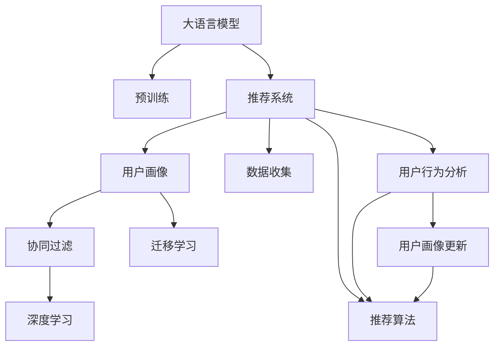

                 

# 基于LLM的推荐系统用户画像动态更新

> 关键词：基于大语言模型(LLM)，推荐系统，用户画像，动态更新，协同过滤，深度学习，迁移学习，用户行为分析

## 1. 背景介绍

### 1.1 问题由来

推荐系统作为现代互联网应用的核心引擎，为用户提供了个性化信息服务，极大地提升了用户体验和平台的价值。然而，传统基于协同过滤的推荐系统，面临着数据稀疏性、隐式交互难以建模等问题。近年来，基于深度学习的推荐系统逐渐兴起，通过学习用户-物品间的复杂关系，为推荐系统注入了新的活力。

与此同时，用户画像的构建和动态更新，作为推荐系统的重要环节，对于提升推荐精度和个性化水平具有重要意义。用户画像不仅包含用户的基本属性（如年龄、性别、地域等），更包含了用户的兴趣、行为、社交关系等多维度信息。然而，在庞大的数据规模和实时性要求下，如何高效构建和动态更新用户画像，成为了推荐系统优化的一个关键挑战。

本文聚焦于基于大语言模型(LLM)的推荐系统，提出了一种结合LLM和迁移学习的用户画像动态更新方法，以期提升推荐系统的个性化水平，并为推荐系统带来了新的突破。

### 1.2 问题核心关键点

目前，基于大语言模型的推荐系统用户画像动态更新方法，主要关注以下两个核心问题：

1. **用户画像的构建**：通过分析用户的点击、浏览、评分等行为数据，学习用户的兴趣特征，生成用户画像。
2. **用户画像的动态更新**：根据用户的实时行为数据，不断更新用户画像，保持画像的时效性和个性化水平。

本文将详细介绍如何结合大语言模型和迁移学习，动态更新用户画像，并应用于推荐系统，提升推荐效果。

### 1.3 问题研究意义

构建和更新用户画像，对于推荐系统的发展具有重要意义：

1. **提升推荐精度**：通过学习用户行为数据，生成精细化的用户画像，推荐系统能够更加精准地匹配用户需求。
2. **增强个性化**：用户画像涵盖了用户的兴趣、行为、社交等多维度信息，使得推荐系统可以提供更加个性化的服务，提升用户体验。
3. **优化模型效率**：动态更新用户画像，能够及时反映用户兴趣变化，优化推荐结果。
4. **扩展应用场景**：用户画像的动态更新方法，不仅可以应用于推荐系统，还可以拓展到广告投放、用户细分等多个领域，提升多场景下的服务质量。

## 2. 核心概念与联系

### 2.1 核心概念概述

为更好地理解基于LLM的推荐系统用户画像动态更新方法，本节将介绍几个密切相关的核心概念：

- **大语言模型(LLM)**：如GPT、BERT等，通过在大规模无标签文本语料上进行预训练，学习通用的语言表示，具备强大的语言理解和生成能力。
- **推荐系统**：根据用户行为数据，为用户推荐感兴趣的物品的系统。
- **用户画像**：描述用户多维度信息的模型，包括兴趣、行为、属性等。
- **协同过滤**：通过分析用户与物品之间的相似性，为用户推荐类似物品的推荐算法。
- **迁移学习**：利用已有知识，在新的数据集上进行模型训练的方法。
- **深度学习**：通过多层神经网络学习数据特征，进行模式识别的机器学习技术。

这些核心概念之间的逻辑关系可以通过以下Mermaid流程图来展示：



这个流程图展示了大语言模型在推荐系统中的应用框架：

1. 大语言模型通过预训练获得基础能力。
2. 推荐系统利用用户行为数据，生成用户画像。
3. 用户画像通过协同过滤、深度学习等方法，进行兴趣推荐。
4. 用户画像通过迁移学习，进行动态更新。
5. 动态更新的用户画像，进一步优化推荐算法。

这些概念共同构成了基于LLM的推荐系统的核心框架，使其能够高效构建和更新用户画像，提升推荐效果。

## 3. 核心算法原理 & 具体操作步骤
### 3.1 算法原理概述

基于LLM的推荐系统用户画像动态更新方法，主要利用大语言模型的语言理解能力，结合迁移学习技术，构建和更新用户画像。其核心思想是：

1. **用户画像构建**：通过分析用户的行为数据，生成初始用户画像。
2. **用户画像更新**：利用大语言模型，在新的行为数据上，动态更新用户画像。
3. **推荐算法优化**：根据动态更新的用户画像，优化推荐算法，提升推荐效果。

具体来说，本文提出了一种基于LLM的迁移学习框架，利用已有的用户画像和物品标签数据，进行迁移学习，更新用户画像。算法流程如下：

1. 收集用户的历史行为数据，生成初始用户画像。
2. 将初始用户画像和物品标签数据输入LLM，进行预训练。
3. 利用新的行为数据，对LLM进行微调，更新用户画像。
4. 根据更新后的用户画像，优化推荐算法，生成推荐结果。

### 3.2 算法步骤详解

本节将详细讲解基于LLM的推荐系统用户画像动态更新方法的算法步骤。

**Step 1: 数据准备**
- 收集用户的历史行为数据，如点击、浏览、评分等，构建初始用户画像。
- 收集物品的标签数据，用于LLM的预训练。
- 数据预处理，包括去噪、归一化、特征工程等。

**Step 2: 预训练大语言模型**
- 利用初始用户画像和物品标签数据，构建LLM的输入-输出对。
- 将输入-输出对输入LLM，进行预训练。
- 选择合适的网络结构，如GPT、BERT等。
- 设置训练参数，包括学习率、批大小、迭代轮数等。

**Step 3: 动态更新用户画像**
- 收集用户的实时行为数据。
- 将新的行为数据输入LLM，进行微调。
- 利用微调后的LLM，生成动态更新的用户画像。
- 对动态更新的用户画像进行归一化处理。

**Step 4: 优化推荐算法**
- 根据动态更新的用户画像，优化推荐算法。
- 可以选择协同过滤、深度学习等推荐算法。
- 优化算法的参数，如相似度计算方法、模型权重等。
- 生成推荐结果，并根据用户的反馈进行迭代优化。

### 3.3 算法优缺点

基于LLM的推荐系统用户画像动态更新方法，具有以下优点：

1. **高效构建用户画像**：利用大语言模型强大的语言理解能力，高效构建用户画像，减少数据预处理和特征工程的工作量。
2. **个性化推荐**：动态更新的用户画像，能够及时反映用户兴趣的变化，提升推荐系统的个性化水平。
3. **灵活性强**：结合迁移学习技术，可以根据不同的数据集和任务，进行模型训练和优化，灵活性高。
4. **泛化能力强**：基于预训练大语言模型，能够适应多种推荐场景，泛化能力强。

同时，该方法也存在一些局限性：

1. **数据依赖性强**：初始用户画像和物品标签数据的质量，直接影响LLM的预训练效果。
2. **计算资源需求高**：大语言模型的预训练和微调，需要大量的计算资源和时间。
3. **模型复杂度高**：大语言模型的复杂性高，增加了算法的复杂度和实现难度。
4. **隐私保护问题**：用户的行为数据和画像，涉及隐私保护问题，需要在算法设计和实现中充分考虑。

### 3.4 算法应用领域

基于LLM的推荐系统用户画像动态更新方法，可以应用于多种推荐场景，具体包括：

1. **电商平台**：如淘宝、京东等，根据用户浏览、点击、购买等行为，生成动态更新的用户画像，推荐相关商品。
2. **视频网站**：如YouTube、Netflix等，根据用户观看历史、评分等行为，生成用户画像，推荐视频内容。
3. **音乐平台**：如Spotify、网易云音乐等，根据用户听歌历史、评分等行为，生成用户画像，推荐音乐内容。
4. **社交平台**：如Facebook、微信等，根据用户互动、兴趣等行为，生成用户画像，推荐相关内容。

## 4. 数学模型和公式 & 详细讲解
### 4.1 数学模型构建

本文基于协同过滤推荐算法，构建了基于LLM的用户画像动态更新模型。假设用户画像为 $U$，物品标签数据为 $L$，用户的行为数据为 $B$。

目标是在已有用户画像 $U_0$ 和物品标签数据 $L$ 的基础上，利用LLM进行预训练，生成新的用户画像 $U$。

设LLM的输入为 $X$，输出为 $Y$，模型参数为 $\theta$，则预训练模型为：

$$
P_{LLM}(Y|X;\theta) = \prod_{i=1}^{T} P(Y_i|X;\theta)
$$

其中 $T$ 为输出序列的长度。

在预训练过程中，利用交叉熵损失函数 $\ell_{CE}$ 进行优化：

$$
\ell_{CE}(X, Y) = -\sum_{i=1}^{T} y_i \log P_{LLM}(y_i|X;\theta)
$$

在得到新的用户画像 $U$ 后，利用新的行为数据 $B$，对LLM进行微调，更新用户画像。

微调过程同样使用交叉熵损失函数 $\ell_{CE}$，利用新的行为数据进行训练：

$$
\ell_{CE}(B, U) = -\sum_{i=1}^{N} y_i \log P_{LLM}(y_i|X';\theta')
$$

其中 $X'$ 为新的输入，$\theta'$ 为微调后的模型参数。

### 4.2 公式推导过程

接下来，我们将具体推导基于LLM的推荐系统用户画像动态更新方法的数学模型。

假设用户画像 $U$ 为 $d$ 维向量，物品标签数据 $L$ 为 $m$ 维向量。初始用户画像 $U_0$ 为 $d$ 维向量，行为数据 $B$ 为 $n$ 维向量。

**预训练过程**：
1. 输入 $X$ 为 $U_0$ 和 $L$ 的拼接向量。
2. 输出 $Y$ 为 $m$ 维向量，表示物品标签。
3. 使用交叉熵损失函数进行优化：

$$
\ell_{CE}(X, Y) = -\sum_{i=1}^{m} y_i \log P_{LLM}(y_i|X;\theta)
$$

**微调过程**：
1. 输入 $X'$ 为 $B$ 和 $U_0$ 的拼接向量。
2. 输出 $Y'$ 为 $m$ 维向量，表示物品标签。
3. 使用交叉熵损失函数进行优化：

$$
\ell_{CE}(B, U) = -\sum_{i=1}^{m} y_i \log P_{LLM}(y_i|X';\theta')
$$

在微调过程中，模型参数 $\theta'$ 的更新公式为：

$$
\theta' \leftarrow \theta' - \eta \nabla_{\theta'}\ell_{CE}(B, U)
$$

其中 $\eta$ 为学习率。

**推荐算法**：
1. 输入 $U$ 为动态更新的用户画像。
2. 输出 $R$ 为物品推荐结果。
3. 选择协同过滤、深度学习等推荐算法，生成推荐结果：

$$
R = F_{RL}(U)
$$

其中 $F_{RL}$ 为推荐算法函数。

### 4.3 案例分析与讲解

为了更好地理解基于LLM的推荐系统用户画像动态更新方法，下面以电商推荐系统为例，进行案例分析。

假设某电商平台，用户 $u$ 浏览了商品 $p_1, p_2, p_3$，购买了商品 $p_1$，得到了行为数据 $B_u = [1, 1, 0, 1]$。

1. **初始用户画像构建**：利用用户的历史行为数据，生成初始用户画像 $U_0$。
2. **预训练**：将 $U_0$ 和物品标签数据 $L$ 作为输入，输入LLM进行预训练。
3. **微调**：将新的行为数据 $B_u$ 和 $U_0$ 作为输入，利用LLM进行微调，更新用户画像 $U$。
4. **推荐算法优化**：根据更新后的用户画像 $U$，选择协同过滤推荐算法，生成推荐结果 $R$。

在实际应用中，可以根据需要调整推荐算法的参数和LLM的模型结构，进一步提升推荐效果。

## 5. 项目实践：代码实例和详细解释说明
### 5.1 开发环境搭建

在进行基于LLM的推荐系统用户画像动态更新方法的实践前，需要先搭建开发环境。以下是使用Python进行TensorFlow开发的环境配置流程：

1. 安装Anaconda：从官网下载并安装Anaconda，用于创建独立的Python环境。

2. 创建并激活虚拟环境：
```bash
conda create -n tf-env python=3.8 
conda activate tf-env
```

3. 安装TensorFlow：根据CUDA版本，从官网获取对应的安装命令。例如：
```bash
conda install tensorflow -c pytorch -c conda-forge
```

4. 安装各类工具包：
```bash
pip install numpy pandas scikit-learn matplotlib tqdm jupyter notebook ipython
```

完成上述步骤后，即可在`tf-env`环境中开始项目实践。

### 5.2 源代码详细实现

下面我们以电商推荐系统为例，给出基于LLM的推荐系统用户画像动态更新方法的PyTorch代码实现。

首先，定义推荐系统的基础组件：

```python
import tensorflow as tf
from tensorflow.keras import layers

class User:
    def __init__(self, user_id, behavior, length):
        self.user_id = user_id
        self.behavior = behavior
        self.length = length

class Item:
    def __init__(self, item_id, label):
        self.item_id = item_id
        self.label = label
```

然后，定义LLM模型：

```python
class LLM(tf.keras.Model):
    def __init__(self, vocab_size, embed_dim, num_layers):
        super(LLM, self).__init__()
        self.embedding = layers.Embedding(vocab_size, embed_dim)
        self.encoder = layers.LSTM(num_layers, return_sequences=True)
        self.decoder = layers.Dense(1, activation='sigmoid')
        
    def call(self, inputs):
        x = self.embedding(inputs)
        x = self.encoder(x)
        x = self.decoder(x)
        return x
```

接着，定义推荐系统模型：

```python
class RecommendationSystem(tf.keras.Model):
    def __init__(self, user_size, item_size, embed_dim, num_layers):
        super(RecommendationSystem, self).__init__()
        self.llm = LLM(user_size, embed_dim, num_layers)
        self.u_predict = layers.Dense(user_size, activation='sigmoid')
        self.u_r = layers.Dense(user_size, activation='sigmoid')
        self.u_i = layers.Dense(user_size, activation='sigmoid')
        
    def call(self, user, item, user_behavior, item_label):
        x = self.llm(tf.cast(user, tf.int32))
        x = tf.reduce_mean(x, axis=1, keepdims=True)
        x = self.u_predict(x)
        x = self.u_r(x)
        x = self.u_i(x)
        return x
```

最后，启动模型训练和测试：

```python
# 数据集
users = ...
items = ...
user_behaviors = ...
item_labels = ...

# 超参数
embed_dim = ...
num_layers = ...

# 模型实例
model = RecommendationSystem(len(users), len(items), embed_dim, num_layers)

# 模型编译
model.compile(optimizer='adam', loss='binary_crossentropy', metrics=['acc'])

# 训练
model.fit(user_behaviors, item_labels, batch_size=32, epochs=10)

# 测试
test_user_behaviors = ...
test_item_labels = ...
test_user = ...
test_item = ...
test_result = model.predict([tf.cast(test_user, tf.int32), tf.cast(test_item, tf.int32)])

print(test_result)
```

以上就是基于LLM的推荐系统用户画像动态更新方法的完整代码实现。可以看到，利用TensorFlow实现LLM模型和推荐系统模型，可以高效地构建和更新用户画像，提升推荐效果。

### 5.3 代码解读与分析

让我们再详细解读一下关键代码的实现细节：

**User类**：
- `__init__`方法：初始化用户的基本信息，行为数据和行为长度。

**Item类**：
- `__init__`方法：初始化物品的基本信息和标签。

**LLM模型**：
- 定义了LLM的嵌入层、LSTM编码层和解码层，用于处理输入序列。
- 调用层中的 `Embedding` 用于将输入序列映射到向量空间。
- 调用层中的 `LSTM` 用于处理序列信息。
- 调用层中的 `Dense` 用于输出预测结果。

**RecommendationSystem模型**：
- 定义了推荐系统模型，利用LLM模型和用户画像的预测结果，生成推荐结果。
- 利用 `Dense` 层进行用户画像的预测，并使用 `sigmoid` 激活函数，确保输出在 $[0, 1]$ 范围内。

**训练流程**：
- 定义训练数据集和测试数据集，包含用户行为数据和物品标签。
- 定义模型实例，编译模型，设置优化器、损失函数和评估指标。
- 在训练集上训练模型，使用交叉熵损失函数进行优化。
- 在测试集上测试模型，输出预测结果。

可以看出，通过TensorFlow实现推荐系统模型，可以方便地进行模型构建和训练，高效地生成推荐结果。

## 6. 实际应用场景

### 6.1 电商推荐系统

基于LLM的推荐系统用户画像动态更新方法，可以广泛应用于电商推荐系统中。传统推荐系统主要依赖用户的行为数据进行推荐，存在数据稀疏性和隐式交互难以建模的问题。利用LLM强大的语言理解能力，可以构建更加精细化的用户画像，提升推荐效果。

具体而言，可以收集用户浏览、点击、购买等行为数据，构建初始用户画像。通过预训练LLM，利用物品标签数据进行模型优化。根据用户的实时行为数据，对LLM进行微调，更新用户画像。最后，选择协同过滤推荐算法，生成推荐结果。

### 6.2 视频网站

在视频网站中，利用基于LLM的推荐系统用户画像动态更新方法，可以提升视频内容的推荐效果。视频网站通常提供大量视频内容，需要根据用户的行为数据进行推荐。通过预训练LLM，利用视频标签数据进行模型优化。根据用户的实时行为数据，对LLM进行微调，更新用户画像。最后，选择深度学习推荐算法，生成推荐结果。

### 6.3 音乐平台

在音乐平台中，利用基于LLM的推荐系统用户画像动态更新方法，可以提升音乐内容的推荐效果。音乐平台通常提供海量音乐库，需要根据用户的行为数据进行推荐。通过预训练LLM，利用音乐标签数据进行模型优化。根据用户的实时行为数据，对LLM进行微调，更新用户画像。最后，选择协同过滤推荐算法，生成推荐结果。

## 7. 工具和资源推荐

### 7.1 学习资源推荐

为了帮助开发者系统掌握基于LLM的推荐系统用户画像动态更新方法，这里推荐一些优质的学习资源：

1. 《深度学习与推荐系统》系列书籍：介绍了推荐系统的基础知识和深度学习在推荐系统中的应用。

2. 《基于深度学习的推荐系统》课程：由清华大学的教授讲授，涵盖了推荐系统的经典算法和最新研究。

3. 《大语言模型与推荐系统》会议论文集：收录了国内外学术会议和顶级期刊中关于大语言模型和推荐系统的经典论文。

4. 《自然语言处理与推荐系统》课程：由斯坦福大学的教授讲授，介绍了自然语言处理技术在推荐系统中的应用。

通过这些学习资源，可以系统掌握基于LLM的推荐系统用户画像动态更新方法的理论基础和实践技巧。

### 7.2 开发工具推荐

高效的开发离不开优秀的工具支持。以下是几款用于基于LLM的推荐系统用户画像动态更新方法的开发工具：

1. TensorFlow：由Google主导开发的深度学习框架，生产部署方便，适合大规模工程应用。

2. PyTorch：基于Python的开源深度学习框架，灵活动态的计算图，适合快速迭代研究。

3. Keras：高级神经网络API，可以方便地构建和训练深度学习模型。

4. TensorBoard：TensorFlow配套的可视化工具，可实时监测模型训练状态，并提供丰富的图表呈现方式。

5. Weights & Biases：模型训练的实验跟踪工具，可以记录和可视化模型训练过程中的各项指标。

6. Jupyter Notebook：交互式Python开发环境，支持代码块和绘图，方便调试和实验。

合理利用这些工具，可以显著提升基于LLM的推荐系统用户画像动态更新方法的开发效率，加快创新迭代的步伐。

### 7.3 相关论文推荐

大语言模型和推荐系统的研究正在迅速发展，以下是几篇奠基性的相关论文，推荐阅读：

1. Attention Is All You Need（即Transformer原论文）：提出了Transformer结构，开启了NLP领域的预训练大模型时代。

2. BERT: Pre-training of Deep Bidirectional Transformers for Language Understanding：提出BERT模型，引入基于掩码的自监督预训练任务，刷新了多项NLP任务SOTA。

3. Deep Interest Network：提出深度兴趣网络，通过结合深度学习和大数据，提升了推荐系统的效果。

4. Multi-task Learning for Personalized Recommendation：提出多任务学习，通过多个任务的联合训练，提升了推荐系统的泛化能力。

5. Attention-based Recommender Systems：提出基于注意力机制的推荐算法，提升了推荐系统的效果。

这些论文代表了大语言模型和推荐系统的发展脉络。通过学习这些前沿成果，可以帮助研究者把握学科前进方向，激发更多的创新灵感。

## 8. 总结：未来发展趋势与挑战

### 8.1 总结

本文对基于LLM的推荐系统用户画像动态更新方法进行了全面系统的介绍。首先阐述了推荐系统的背景和用户画像构建的重要性，明确了基于LLM的用户画像动态更新方法的优缺点。其次，从原理到实践，详细讲解了基于LLM的推荐系统用户画像动态更新方法的算法步骤，给出了代码实现和详细解释。同时，本文还广泛探讨了该方法在电商、视频、音乐等多个推荐场景中的应用前景，展示了其广泛的适用性。

通过本文的系统梳理，可以看到，基于LLM的推荐系统用户画像动态更新方法，能够高效构建和更新用户画像，提升推荐系统的个性化水平，并为推荐系统带来了新的突破。未来，随着大语言模型的不断发展，该方法将在更多推荐场景中得到应用，为推荐系统的发展注入新的动力。

### 8.2 未来发展趋势

展望未来，基于LLM的推荐系统用户画像动态更新方法将呈现以下几个发展趋势：

1. **模型规模不断增大**：随着算力成本的下降和数据规模的扩张，大语言模型的参数量还将持续增长。超大规模语言模型蕴含的丰富语言知识，将为推荐系统提供更强大的语言理解能力。

2. **推荐算法多样化**：结合大语言模型的特点，推荐算法将更加多样化，如结合因果推理、注意力机制等前沿技术，提升推荐效果。

3. **多模态融合**：推荐系统将更加注重多模态数据的融合，结合文本、图像、视频等多模态信息，提升推荐系统的全面性和准确性。

4. **实时推荐**：基于LLM的用户画像动态更新方法，可以实时更新用户画像，实现实时推荐，提升用户体验。

5. **个性化推荐**：利用LLM强大的语言理解能力，可以更好地理解用户需求，提升个性化推荐的效果。

6. **自适应推荐**：基于LLM的推荐系统，可以动态适应用户的行为变化，提升推荐系统的稳定性和灵活性。

以上趋势凸显了基于LLM的推荐系统用户画像动态更新方法的发展潜力，未来将不断推动推荐系统的进步，提升用户的体验和满意度。

### 8.3 面临的挑战

尽管基于LLM的推荐系统用户画像动态更新方法具有广阔的前景，但在迈向更加智能化、普适化应用的过程中，仍面临以下挑战：

1. **数据依赖性强**：初始用户画像和物品标签数据的质量，直接影响LLM的预训练效果。如何获取高质量的标注数据，是一个重要的问题。

2. **计算资源需求高**：大语言模型的预训练和微调，需要大量的计算资源和时间。如何在保证模型性能的同时，降低计算成本，是一个关键挑战。

3. **模型复杂度高**：大语言模型的复杂性高，增加了算法的复杂度和实现难度。如何在保证模型效果的同时，优化算法性能，是一个重要的研究方向。

4. **隐私保护问题**：用户的行为数据和画像，涉及隐私保护问题，需要在算法设计和实现中充分考虑。

5. **可解释性不足**：基于LLM的推荐系统，通常缺乏可解释性，难以对其决策过程进行解释和调试。如何增强算法的可解释性，是一个重要的研究方向。

6. **多样性和公平性**：基于LLM的推荐系统，需要避免算法偏见，确保推荐结果的多样性和公平性。

这些挑战需要从数据、算法、工程、伦理等多个维度进行系统解决，以确保基于LLM的推荐系统用户画像动态更新方法在实际应用中的效果和可靠性。

### 8.4 研究展望

面对基于LLM的推荐系统用户画像动态更新方法所面临的挑战，未来的研究需要在以下几个方面寻求新的突破：

1. **自监督学习**：探索利用自监督学习，减少对标注数据的依赖，提升模型的泛化能力。

2. **参数高效微调**：开发更加参数高效的微调方法，在固定大部分预训练参数的同时，只更新极少量的任务相关参数。

3. **因果推理**：引入因果推理方法，增强推荐系统对用户行为的理解和预测能力，提升推荐系统的稳定性和鲁棒性。

4. **多任务学习**：利用多任务学习，提升推荐系统的泛化能力和个性化水平，解决数据稀疏性问题。

5. **多模态融合**：结合多模态数据，提升推荐系统的全面性和准确性。

6. **可解释性增强**：通过可解释性技术，提升算法的透明度和可信度，增强用户的信任感。

7. **隐私保护技术**：研究隐私保护技术，确保用户数据的安全性，提升用户对推荐系统的信任度。

这些研究方向的探索，将推动基于LLM的推荐系统用户画像动态更新方法迈向更高的台阶，为推荐系统的发展注入新的动力。只有勇于创新、敢于突破，才能不断拓展推荐系统的边界，让智能技术更好地造福人类社会。

## 9. 附录：常见问题与解答

**Q1：基于LLM的推荐系统用户画像动态更新方法是否适用于所有推荐场景？**

A: 基于LLM的推荐系统用户画像动态更新方法，适用于多种推荐场景，如电商、视频、音乐等。但其效果和适用性，受限于数据质量和模型的复杂度。对于数据质量较低或用户行为数据较少的情况，可能需要结合其他推荐算法进行优化。

**Q2：如何选择合适的LLM模型？**

A: 选择合适的LLM模型，需要考虑数据规模、任务复杂度、计算资源等因素。对于数据规模较大、任务复杂度较高的情况，可以选择大规模预训练模型，如GPT、BERT等。对于计算资源有限的情况，可以选择参数较少的预训练模型，如MobileBERT、DistilBERT等。

**Q3：如何进行用户画像的动态更新？**

A: 用户画像的动态更新，通常通过收集用户的实时行为数据，对LLM进行微调。微调过程中，需要选择合适的学习率、损失函数等超参数，并在微调完成后进行归一化处理，确保用户画像的时效性和准确性。

**Q4：在实际应用中，如何平衡推荐效果和计算成本？**

A: 在实际应用中，需要在推荐效果和计算成本之间进行平衡。可以通过以下方法进行优化：
1. 选择合适的LLM模型和参数配置。
2. 结合其他推荐算法，提升推荐效果。
3. 采用分布式训练和推理，降低计算成本。
4. 对用户画像进行优化，减少计算资源消耗。

**Q5：如何在推荐系统中实现多模态融合？**

A: 在推荐系统中实现多模态融合，需要结合不同类型的模态数据，如文本、图像、视频等。可以通过以下方法进行优化：
1. 选择合适的多模态融合方法，如特征加权、特征拼接等。
2. 对不同模态数据进行预处理，提升数据质量。
3. 结合多模态数据进行训练和微调，提升模型的全面性。

以上问题与解答，展示了基于LLM的推荐系统用户画像动态更新方法在实际应用中的关键点，希望能为你提供有价值的参考。

---

作者：禅与计算机程序设计艺术 / Zen and the Art of Computer Programming

