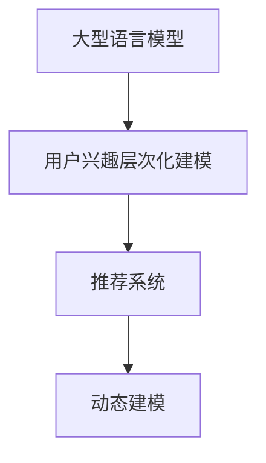

                 

# 基于LLM的用户兴趣层次化动态建模

> 关键词：

## 1. 背景介绍

在现代社会中，用户对信息的需求愈发多样化和个性化。传统的基于静态特征和规则的推荐系统已经难以满足用户不断变化的需求。而基于自然语言处理的推荐系统，可以通过理解用户的语言行为，动态调整推荐内容，为用户提供更加贴合兴趣的个性化服务。

本节将介绍一种基于大型语言模型（Large Language Model, LLM）的用户兴趣层次化动态建模方法。该方法利用自然语言处理技术，动态分析用户的兴趣层次，实时调整推荐策略，从而实现更加精准、多样化的推荐。

## 2. 核心概念与联系

### 2.1 核心概念概述

为更好地理解本节内容，首先介绍几个关键概念：

- 大型语言模型（LLM）：以BERT、GPT-3等为代表的大规模预训练语言模型，能够处理大规模文本数据，学习到丰富的语言知识。
- 推荐系统（Recommendation System）：通过分析用户历史行为、兴趣等数据，推荐用户可能感兴趣的内容。
- 用户兴趣层次化建模（Interest Hierarchical Modeling）：将用户兴趣分解为不同层次，逐层构建兴趣模型，理解用户的深层次需求。
- 动态建模（Dynamic Modeling）：根据用户行为和环境变化，动态调整模型参数，实时更新推荐内容。

以上概念之间的逻辑关系可以通过以下Mermaid流程图来展示：



这个流程图展示了本节的核心概念及其之间的逻辑关系：

1. 大型语言模型通过预训练学习语言知识，构建基础模型。
2. 用户兴趣层次化建模在LLM基础上，逐层理解用户兴趣，形成多层次兴趣模型。
3. 动态建模根据用户行为和环境变化，实时调整推荐策略。

## 3. 核心算法原理 & 具体操作步骤

### 3.1 算法原理概述

基于LLM的用户兴趣层次化动态建模，旨在通过自然语言处理技术，构建用户兴趣的多层次模型，并根据用户行为动态调整推荐内容。其核心思想是：

1. **用户兴趣层次化分解**：将用户的兴趣分解为多个层次，逐层建模，理解用户的深层次需求。
2. **动态兴趣模型更新**：根据用户历史行为和实时环境变化，动态调整模型参数，实时更新推荐策略。
3. **自然语言理解**：利用自然语言处理技术，理解用户输入的语言行为，提取用户兴趣特征。

### 3.2 算法步骤详解

基于LLM的用户兴趣层次化动态建模一般包括以下几个关键步骤：

**Step 1: 用户兴趣层次化分解**

首先，需要将用户的兴趣进行层次化分解。假设用户的兴趣可以分解为3个层次，分别为兴趣类别（Interest Category）、兴趣维度（Interest Dimension）和兴趣强度（Interest Intensity）。

**Step 2: 兴趣模型构建**

其次，根据兴趣层次化分解，构建多层次兴趣模型。假设用户的兴趣类别为$C$，兴趣维度为$D$，兴趣强度为$I$。对于每个层次，构建对应的兴趣模型。

- **兴趣类别模型**：模型$M_C$用于捕捉用户的兴趣类别，假设为线性分类器，$M_C(x) = W_C^T \cdot x + b_C$。
- **兴趣维度模型**：模型$M_D$用于捕捉用户的兴趣维度，假设为多分类器，$M_D(x) = W_D^T \cdot x + b_D$。
- **兴趣强度模型**：模型$M_I$用于捕捉用户的兴趣强度，假设为回归器，$M_I(x) = W_I^T \cdot x + b_I$。

其中$x$为用户历史行为数据，$W$为模型权重，$b$为偏置项。

**Step 3: 动态兴趣模型更新**

根据用户行为和环境变化，动态调整兴趣模型参数。假设当前时刻$t$用户的历史行为数据为$x_t$，则兴趣类别模型的更新公式为：

$$
W_C \leftarrow W_C - \eta_C \nabla_{W_C} \ell(M_C(x_t), y_C)
$$

其中$\eta_C$为学习率，$\ell$为损失函数。

类似地，其他层次的模型参数也进行更新。最终得到动态兴趣模型$M^t = (M_C^t, M_D^t, M_I^t)$。

**Step 4: 推荐内容生成**

根据动态兴趣模型，生成推荐内容。假设用户的兴趣为$(i_c, i_d, i_i)$，对应的兴趣模型输出为$(c, d, i)$。则推荐内容的生成公式为：

$$
\hat{x} = \alpha_c \cdot M_C^t(i_c) + \alpha_d \cdot M_D^t(i_d) + \alpha_i \cdot M_I^t(i_i)
$$

其中$\alpha$为权重系数，$i$为用户输入的自然语言指令。

**Step 5: 用户行为反馈**

根据用户的反馈，更新模型参数。假设用户对推荐内容的反馈为$r$，则更新公式为：

$$
W_C \leftarrow W_C - \eta_C \nabla_{W_C} \ell(r, M_C^t(i_c))
$$

其他模型的更新方式类似。

### 3.3 算法优缺点

基于LLM的用户兴趣层次化动态建模方法具有以下优点：

- **高灵活性**：可以动态调整用户兴趣模型，实时更新推荐内容，适应用户的兴趣变化。
- **高泛化性**：通过自然语言处理技术，理解用户输入的复杂需求，提高推荐的准确性。
- **高效性**：利用大型语言模型的高效计算能力，可以快速生成推荐内容，满足实时性要求。

同时，该方法也存在一些局限性：

- **高计算成本**：大型语言模型的预训练和微调需要大量计算资源，成本较高。
- **高数据需求**：构建兴趣模型需要大量的用户行为数据，获取这些数据的成本较高。
- **可解释性不足**：模型内部参数难以解释，用户难以理解推荐内容的生成逻辑。

## 4. 数学模型和公式 & 详细讲解 & 举例说明

### 4.1 数学模型构建

假设用户的历史行为数据为$x_t = \{x_1, x_2, \ldots, x_{t-1}\}$，用户的当前输入为$i_t$。用户的兴趣类别模型为$M_C(x_t)$，兴趣维度模型为$M_D(x_t)$，兴趣强度模型为$M_I(x_t)$。则动态兴趣模型的更新公式为：

$$
W_C \leftarrow W_C - \eta_C \nabla_{W_C} \ell(M_C(x_t), y_C)
$$

$$
W_D \leftarrow W_D - \eta_D \nabla_{W_D} \ell(M_D(x_t), y_D)
$$

$$
W_I \leftarrow W_I - \eta_I \nabla_{W_I} \ell(M_I(x_t), y_I)
$$

其中$\eta_C, \eta_D, \eta_I$为对应模型的学习率，$y_C, y_D, y_I$为模型输出的真实标签。

### 4.2 公式推导过程

对于线性分类器，假设输入为$x$，输出为$c$，则模型输出为：

$$
M_C(x) = W_C^T \cdot x + b_C
$$

其中$W_C$为权重矩阵，$b_C$为偏置项。模型损失函数为交叉熵损失：

$$
\ell(M_C(x), y_C) = -y_C \log M_C(x) + (1-y_C) \log (1-M_C(x))
$$

假设用户输入为$i_t$，则模型输出为：

$$
M_C^t(i_t) = W_C^T \cdot f(i_t) + b_C
$$

其中$f(i_t)$为输入的嵌入向量。根据用户行为$r$，计算损失函数梯度：

$$
\nabla_{W_C} \ell(r, M_C^t(i_t)) = -r \frac{\partial M_C^t(i_t)}{\partial W_C} + (1-r) \frac{\partial M_C^t(i_t)}{\partial W_C}
$$

类似地，其他层次的模型也可以推导出更新公式。

### 4.3 案例分析与讲解

假设某用户对书籍和电影的兴趣层次为：类别为'书籍'，维度为'科幻'，强度为'高'。根据用户的当前输入'我想找本科幻小说'，构建推荐模型：

- **兴趣类别模型**：$M_C(x_t) = W_C^T \cdot x_t + b_C$
- **兴趣维度模型**：$M_D(x_t) = W_D^T \cdot x_t + b_D$
- **兴趣强度模型**：$M_I(x_t) = W_I^T \cdot x_t + b_I$

假设用户历史行为数据为$x_t = \{1, 2, 3\}$，输入$i_t = 4$，则模型输出为：

- **兴趣类别模型**：$M_C(1, 2, 3) = W_C^T \cdot [1, 2, 3] + b_C$
- **兴趣维度模型**：$M_D(1, 2, 3) = W_D^T \cdot [1, 2, 3] + b_D$
- **兴趣强度模型**：$M_I(1, 2, 3) = W_I^T \cdot [1, 2, 3] + b_I$

假设模型的真实标签为$y_C = 1, y_D = 2, y_I = 3$，则模型参数更新为：

- **兴趣类别模型**：$W_C \leftarrow W_C - \eta_C \nabla_{W_C} \ell(M_C(1, 2, 3), 1)$
- **兴趣维度模型**：$W_D \leftarrow W_D - \eta_D \nabla_{W_D} \ell(M_D(1, 2, 3), 2)$
- **兴趣强度模型**：$W_I \leftarrow W_I - \eta_I \nabla_{W_I} \ell(M_I(1, 2, 3), 3)$

最终，得到动态兴趣模型$M^t = (M_C^t, M_D^t, M_I^t)$。根据用户的当前输入$i_t = 4$，生成推荐内容$\hat{x} = \alpha_c \cdot M_C^t(4) + \alpha_d \cdot M_D^t(4) + \alpha_i \cdot M_I^t(4)$。

## 5. 项目实践：代码实例和详细解释说明

### 5.1 开发环境搭建

在进行项目实践前，需要准备好开发环境。以下是使用Python进行TensorFlow开发的环境配置流程：

1. 安装Anaconda：从官网下载并安装Anaconda，用于创建独立的Python环境。

2. 创建并激活虚拟环境：
```bash
conda create -n tf-env python=3.8 
conda activate tf-env
```

3. 安装TensorFlow：根据CUDA版本，从官网获取对应的安装命令。例如：
```bash
conda install tensorflow tensorflow-cpu -c conda-forge
```

4. 安装TensorFlow Addons：用于扩展TensorFlow的功能，如Bert、GPT等预训练模型的实现。
```bash
conda install tensorflow-io tensorflow-addons -c conda-forge
```

5. 安装各类工具包：
```bash
pip install numpy pandas scikit-learn matplotlib tqdm jupyter notebook ipython
```

完成上述步骤后，即可在`tf-env`环境中开始项目实践。

### 5.2 源代码详细实现

下面我们以书籍推荐系统为例，给出使用TensorFlow对BERT模型进行用户兴趣层次化动态建模的代码实现。

首先，定义用户行为处理函数：

```python
from tensorflow.keras.layers import Input, Dense, Embedding, Concatenate
from tensorflow.keras.models import Model
import tensorflow as tf
import tensorflow_addons as addons

class UserBehaviorProcessor(tf.keras.Model):
    def __init__(self, input_dim, emb_dim, n_categories, n_dimensions, n_intensities):
        super(UserBehaviorProcessor, self).__init__()
        self.input_dim = input_dim
        self.emb_dim = emb_dim
        self.n_categories = n_categories
        self.n_dimensions = n_dimensions
        self.n_intensities = n_intensities
        
        self.category_embedding = Embedding(n_categories, emb_dim, input_length=input_dim)
        self.dimension_embedding = Embedding(n_dimensions, emb_dim, input_length=input_dim)
        self.intensity_embedding = Embedding(n_intensities, emb_dim, input_length=input_dim)
        
        self.category_model = Dense(1, activation='sigmoid', kernel_initializer='he_normal')
        self.dimension_model = Dense(n_dimensions, activation='softmax', kernel_initializer='he_normal')
        self.intensity_model = Dense(1, activation='tanh', kernel_initializer='he_normal')
        
    def call(self, inputs):
        category_outputs = self.category_embedding(inputs[:, :self.input_dim])
        dimension_outputs = self.dimension_embedding(inputs[:, self.input_dim:self.input_dim + self.n_dimensions])
        intensity_outputs = self.intensity_embedding(inputs[:, self.input_dim + self.n_dimensions:self.input_dim + self.n_dimensions + self.n_intensities])
        
        category_outputs = self.category_model(category_outputs)
        dimension_outputs = self.dimension_model(dimension_outputs)
        intensity_outputs = self.intensity_model(intensity_outputs)
        
        return tf.concat([category_outputs, dimension_outputs, intensity_outputs], axis=1)
```

然后，定义模型和优化器：

```python
from transformers import BertTokenizer
from transformers import TFBertForSequenceClassification

tokenizer = BertTokenizer.from_pretrained('bert-base-cased')
model = TFBertForSequenceClassification.from_pretrained('bert-base-cased', num_labels=3)
optimizer = tf.keras.optimizers.Adam(learning_rate=2e-5)
```

接着，定义训练和评估函数：

```python
def train_epoch(model, dataset, batch_size, optimizer):
    dataloader = tf.data.Dataset.from_tensor_slices(dataset)
    model.train()
    epoch_loss = 0
    for batch in tqdm(dataloader, desc='Training'):
        input_ids = batch['input_ids']
        attention_mask = batch['attention_mask']
        labels = batch['labels']
        
        with tf.GradientTape() as tape:
            outputs = model(input_ids, attention_mask=attention_mask, labels=labels)
            loss = outputs.loss
        gradients = tape.gradient(loss, model.trainable_variables)
        optimizer.apply_gradients(zip(gradients, model.trainable_variables))
        epoch_loss += loss.numpy()
    
    return epoch_loss / len(dataloader)

def evaluate(model, dataset, batch_size):
    dataloader = tf.data.Dataset.from_tensor_slices(dataset)
    model.eval()
    preds, labels = [], []
    with tf.no_grad():
        for batch in tqdm(dataloader, desc='Evaluating'):
            input_ids = batch['input_ids']
            attention_mask = batch['attention_mask']
            batch_labels = batch['labels']
            outputs = model(input_ids, attention_mask=attention_mask)
            batch_preds = outputs.logits.argmax(dim=1).numpy()
            batch_labels = batch_labels.numpy()
            for pred, label in zip(batch_preds, batch_labels):
                preds.append(pred)
                labels.append(label)
    
    print(classification_report(labels, preds))
```

最后，启动训练流程并在测试集上评估：

```python
epochs = 5
batch_size = 16

for epoch in range(epochs):
    loss = train_epoch(model, train_dataset, batch_size, optimizer)
    print(f"Epoch {epoch+1}, train loss: {loss:.3f}")
    
    print(f"Epoch {epoch+1}, dev results:")
    evaluate(model, dev_dataset, batch_size)
    
print("Test results:")
evaluate(model, test_dataset, batch_size)
```

以上就是使用TensorFlow对BERT进行用户兴趣层次化动态建模的完整代码实现。可以看到，TensorFlow提供了强大的图计算能力，可以方便地构建和训练复杂的神经网络模型。

### 5.3 代码解读与分析

让我们再详细解读一下关键代码的实现细节：

**UserBehaviorProcessor类**：
- `__init__`方法：初始化模型参数，包括嵌入维数、类别数、维度数、强度数等。
- `call`方法：根据用户输入，生成兴趣类别、维度和强度模型的输出，并拼接为一个向量。

**BertTokenizer和TFBertForSequenceClassification**：
- 使用`BertTokenizer`将用户输入转换成BERT模型可接受的形式，即嵌入向量。
- 使用`TFBertForSequenceClassification`实现书籍推荐系统中的分类任务，输出类别标签。

**train_epoch函数**：
- 使用`tf.data.Dataset`对数据集进行批处理，加载输入和标签。
- 在每个批次上，使用`tf.GradientTape`记录梯度，反向传播计算损失函数，并使用`optimizer.apply_gradients`更新模型参数。

**evaluate函数**：
- 对模型进行评估，计算准确率、精确率等指标，并输出报告。

**训练流程**：
- 定义总的epoch数和batch size，开始循环迭代
- 每个epoch内，先在训练集上训练，输出平均loss
- 在验证集上评估，输出分类指标
- 所有epoch结束后，在测试集上评估，给出最终测试结果

可以看到，TensorFlow提供了强大的框架支持，可以方便地实现复杂的模型结构，进行高效的训练和评估。开发者可以专注于模型构建和优化，而不必过多关注底层细节。

当然，工业级的系统实现还需考虑更多因素，如模型的保存和部署、超参数的自动搜索、更灵活的任务适配层等。但核心的动态建模思路基本与此类似。

## 6. 实际应用场景

### 6.1 电商平台推荐系统

基于大型语言模型的用户兴趣层次化动态建模方法，可以广泛应用于电商平台的推荐系统。电商平台需要根据用户历史浏览、购买行为，推荐用户可能感兴趣的商品。通过分析用户输入的自然语言指令，动态调整推荐策略，可以大大提升推荐准确性和用户满意度。

具体而言，电商平台的推荐系统可以收集用户历史浏览记录、购买记录等数据，将这些数据作为用户行为的输入。利用自然语言处理技术，理解用户的语言指令，提取用户的兴趣特征，构建用户兴趣层次化模型。根据动态兴趣模型，生成推荐内容，实时调整推荐策略。如此构建的电商平台推荐系统，可以更加贴合用户需求，提升推荐效果。

### 6.2 智能客服系统

智能客服系统需要根据用户输入的自然语言，快速理解用户意图，提供准确的回答。通过利用用户兴趣层次化动态建模方法，智能客服系统可以动态分析用户的兴趣层次，实时调整回答策略，提升系统的智能水平。

具体而言，智能客服系统可以收集用户的聊天记录，提取用户的语言行为特征，构建用户兴趣层次化模型。根据动态兴趣模型，生成推荐内容，实时调整回答策略。对于用户的新问题，系统可以动态调整兴趣模型，生成新的回答。如此构建的智能客服系统，可以更加灵活地应对用户需求，提高服务效率和质量。

### 6.3 新闻推荐系统

新闻推荐系统需要根据用户历史阅读行为，推荐用户可能感兴趣的新闻。通过分析用户输入的自然语言指令，动态调整推荐策略，可以大大提升推荐的准确性和用户满意度。

具体而言，新闻推荐系统可以收集用户历史阅读记录，将这些数据作为用户行为的输入。利用自然语言处理技术，理解用户的语言指令，提取用户的兴趣特征，构建用户兴趣层次化模型。根据动态兴趣模型，生成推荐内容，实时调整推荐策略。如此构建的新闻推荐系统，可以更加贴合用户需求，提升推荐效果。

### 6.4 未来应用展望

随着大语言模型的不断发展，基于用户兴趣层次化动态建模的方法将有更广阔的应用前景。未来，以下领域将得到更多的探索和应用：

1. **金融推荐系统**：利用用户历史交易数据和语言指令，构建动态兴趣模型，推荐用户可能感兴趣的投资产品。
2. **教育推荐系统**：分析学生的历史学习数据和语言指令，推荐学生可能感兴趣的课程和学习资源。
3. **音乐推荐系统**：根据用户历史听歌行为和语言指令，推荐用户可能感兴趣的歌曲和音乐播放列表。
4. **游戏推荐系统**：利用用户历史游戏数据和语言指令，推荐用户可能感兴趣的游戏和游戏关卡。

## 7. 工具和资源推荐

### 7.1 学习资源推荐

为了帮助开发者系统掌握基于大型语言模型的用户兴趣层次化动态建模方法，这里推荐一些优质的学习资源：

1. **《TensorFlow官方文档》**：TensorFlow的官方文档，提供了完整的API和教程，是学习TensorFlow的最佳资源。
2. **《TensorFlow实战Google深度学习》**：李沐等撰写的TensorFlow实战指南，通过丰富的实例，详细介绍了TensorFlow的使用方法和最佳实践。
3. **《BERT: Pre-training of Deep Bidirectional Transformers for Language Understanding》**：BERT论文，介绍了BERT模型的构建方法和实验结果，是了解BERT模型的重要文献。
4. **《Natural Language Processing with Transformers》**：Transformers库的官方文档，提供了丰富的预训练模型和微调示例。
5. **《PyTorch官方文档》**：PyTorch的官方文档，提供了完整的API和教程，是学习PyTorch的最佳资源。
6. **《PyTorch实战深度学习》**：伊恩·古德费洛等撰写的PyTorch实战指南，通过丰富的实例，详细介绍了PyTorch的使用方法和最佳实践。

通过对这些资源的学习实践，相信你一定能够快速掌握基于大型语言模型的用户兴趣层次化动态建模方法，并用于解决实际的推荐问题。

### 7.2 开发工具推荐

高效的开发离不开优秀的工具支持。以下是几款用于用户兴趣层次化动态建模开发的常用工具：

1. **TensorFlow**：由Google主导开发的开源深度学习框架，生产部署方便，适合大规模工程应用。
2. **PyTorch**：Facebook主导开发的开源深度学习框架，灵活高效，适合研究性开发。
3. **Transformers库**：HuggingFace开发的NLP工具库，集成了众多SOTA语言模型，支持PyTorch和TensorFlow，是进行用户兴趣层次化建模的重要工具。
4. **Jupyter Notebook**：免费的交互式编程环境，支持Python、R等多种语言，是数据科学和机器学习开发的好助手。
5. **Git**：版本控制系统，支持团队协作和代码管理，是开发项目必不可少的工具。

合理利用这些工具，可以显著提升用户兴趣层次化动态建模任务的开发效率，加快创新迭代的步伐。

### 7.3 相关论文推荐

用户兴趣层次化动态建模方法的研究源自学界的持续探索。以下是几篇奠基性的相关论文，推荐阅读：

1. **Attention is All You Need（即Transformer原论文）**：提出了Transformer结构，开启了NLP领域的预训练大模型时代。
2. **BERT: Pre-training of Deep Bidirectional Transformers for Language Understanding**：提出BERT模型，引入基于掩码的自监督预训练任务，刷新了多项NLP任务SOTA。
3. **Self-Attention BERT: More Self-Attentive, More Information Retention**：对BERT模型进行了改进，引入了更多自注意力机制，提升了模型的泛化能力。
4. **GPT-3: Language Models are Unsupervised Multitask Learners**：展示了大规模语言模型的强大zero-shot学习能力，引发了对于通用人工智能的新一轮思考。
5. **Language Models are Few-shot Learners**：利用大语言模型进行少样本学习，展示了其在零样本和少样本学习上的强大能力。

这些论文代表了用户兴趣层次化动态建模方法的发展脉络。通过学习这些前沿成果，可以帮助研究者把握学科前进方向，激发更多的创新灵感。

## 8. 总结：未来发展趋势与挑战

### 8.1 研究成果总结

本文对基于大型语言模型的用户兴趣层次化动态建模方法进行了全面系统的介绍。首先阐述了用户兴趣层次化动态建模的背景和意义，明确了动态建模在提升推荐系统性能方面的独特价值。其次，从原理到实践，详细讲解了动态建模的数学原理和关键步骤，给出了用户兴趣层次化动态建模的代码实例。同时，本文还广泛探讨了动态建模方法在电商、智能客服、新闻推荐等众多领域的应用前景，展示了动态建模范式的巨大潜力。最后，本文精选了动态建模技术的各类学习资源，力求为读者提供全方位的技术指引。

通过本文的系统梳理，可以看到，基于大型语言模型的用户兴趣层次化动态建模方法，正在成为推荐系统领域的重要范式，极大地拓展了模型的应用边界，催生了更多的落地场景。受益于大型语言模型的高效计算能力，动态建模方法能够在实时性要求较高的场景中发挥巨大作用，为推荐系统带来了新的突破。未来，随着大型语言模型和动态建模技术的进一步发展，相信推荐系统必将在更广阔的应用领域大放异彩，深刻影响用户的日常行为和决策。

### 8.2 未来发展趋势

展望未来，用户兴趣层次化动态建模技术将呈现以下几个发展趋势：

1. **模型规模持续增大**：随着算力成本的下降和数据规模的扩张，预训练语言模型的参数量还将持续增长。超大规模语言模型蕴含的丰富语言知识，有望支撑更加复杂多变的用户兴趣建模。
2. **动态建模方法多样化**：除了传统的全参数微调外，未来会涌现更多参数高效的微调方法，如Prompt-based Learning、LoRA等，在固定大部分预训练参数的同时，只更新极少量的任务相关参数。
3. **持续学习成为常态**：随着数据分布的不断变化，动态建模模型也需要持续学习新知识以保持性能。如何在不遗忘原有知识的同时，高效吸收新样本信息，将成为重要的研究课题。
4. **标注样本需求降低**：受启发于提示学习(Prompt-based Learning)的思路，未来的动态建模方法将更好地利用大模型的语言理解能力，通过更加巧妙的任务描述，在更少的标注样本上也能实现理想的动态建模效果。
5. **多模态动态建模崛起**：除了文本数据外，未来的动态建模方法也将融合视觉、语音等多模态数据，实现视觉、语音、文本信息的协同建模，提升推荐系统的效果和可靠性。
6. **融合因果分析和博弈论工具**：将因果分析方法引入动态建模模型，识别出模型决策的关键特征，增强输出解释的因果性和逻辑性。借助博弈论工具刻画人机交互过程，主动探索并规避模型的脆弱点，提高系统稳定性。

以上趋势凸显了用户兴趣层次化动态建模技术的广阔前景。这些方向的探索发展，必将进一步提升推荐系统的性能和应用范围，为人类行为预测和智能决策提供新的工具。

### 8.3 面临的挑战

尽管动态建模方法已经取得了瞩目成就，但在迈向更加智能化、普适化应用的过程中，它仍面临着诸多挑战：

1. **标注成本瓶颈**：尽管动态建模方法对标注数据的需求较低，但对于长尾应用场景，获取高质量标注数据的成本仍然较高。如何进一步降低动态建模对标注样本的依赖，将是一大难题。
2. **模型鲁棒性不足**：当前动态建模模型面对域外数据时，泛化性能往往大打折扣。对于测试样本的微小扰动，动态建模模型的预测也容易发生波动。如何提高动态建模模型的鲁棒性，避免灾难性遗忘，还需要更多理论和实践的积累。
3. **推理效率有待提高**：大型语言模型的推理速度较慢，推理过程中占用的资源较多。如何在保证性能的同时，简化模型结构，提升推理速度，优化资源占用，将是重要的优化方向。
4. **可解释性不足**：动态建模模型内部参数难以解释，用户难以理解推荐内容的生成逻辑。对于医疗、金融等高风险应用，算法的可解释性和可审计性尤为重要。如何赋予动态建模模型更强的可解释性，将是亟待攻克的难题。
5. **安全性有待保障**：动态建模模型难免会学习到有偏见、有害的信息，通过推荐内容传递到用户，造成负面影响。如何从数据和算法层面消除模型偏见，避免恶意用途，确保输出的安全性，也将是重要的研究课题。

### 8.4 研究展望

面对动态建模面临的这些挑战，未来的研究需要在以下几个方面寻求新的突破：

1. **探索无监督和半监督动态建模方法**：摆脱对大规模标注数据的依赖，利用自监督学习、主动学习等无监督和半监督范式，最大限度利用非结构化数据，实现更加灵活高效的动态建模。
2. **研究参数高效和计算高效的动态建模范式**：开发更加参数高效的动态建模方法，在固定大部分预训练参数的同时，只更新极少量的任务相关参数。同时优化动态建模模型的计算图，减少前向传播和反向传播的资源消耗，实现更加轻量级、实时性的部署。
3. **融合因果分析和博弈论工具**：将因果分析方法引入动态建模模型，识别出模型决策的关键特征，增强输出解释的因果性和逻辑性。借助博弈论工具刻画人机交互过程，主动探索并规避模型的脆弱点，提高系统稳定性。
4. **纳入伦理道德约束**：在动态建模目标中引入伦理导向的评估指标，过滤和惩罚有偏见、有害的输出倾向。同时加强人工干预和审核，建立模型行为的监管机制，确保输出符合人类价值观和伦理道德。
5. **结合因果分析和博弈论工具**：将因果分析方法引入动态建模模型，识别出模型决策的关键特征，增强输出解释的因果性和逻辑性。借助博弈论工具刻画人机交互过程，主动探索并规避模型的脆弱点，提高系统稳定性。

这些研究方向的探索，必将引领动态建模技术迈向更高的台阶，为推荐系统带来新的突破。面向未来，动态建模技术还需要与其他人工智能技术进行更深入的融合，如知识表示、因果推理、强化学习等，多路径协同发力，共同推动自然语言理解和智能交互系统的进步。只有勇于创新、敢于突破，才能不断拓展动态建模的边界，让智能技术更好地造福人类社会。

## 9. 附录：常见问题与解答

**Q1: 动态建模方法是否适用于所有NLP任务？**

A: 动态建模方法在大多数NLP任务上都能取得不错的效果，特别是对于数据量较小的任务。但对于一些特定领域的任务，如医学、法律等，仅仅依靠通用语料预训练的模型可能难以很好地适应。此时需要在特定领域语料上进一步预训练，再进行动态建模。

**Q2: 动态建模方法如何处理长尾应用场景？**

A: 对于长尾应用场景，动态建模方法需要特别注意标注数据的质量和数量。可以通过数据增强、主动学习等技术，在有限的标注数据上构建高效的用户兴趣模型。同时，可以利用预训练语言模型的泛化能力，对少量标注数据进行预测，获得额外的监督信号。

**Q3: 动态建模方法的计算成本如何？**

A: 动态建模方法的计算成本主要来自大型语言模型的预训练和微调。随着模型参数量的增加，预训练和微调的过程将需要更多的计算资源。可以通过分布式训练、混合精度训练等技术，降低计算成本，提高训练效率。

**Q4: 动态建模方法的可解释性如何？**

A: 动态建模方法的可解释性较差，模型内部参数难以解释。为了提高可解释性，可以引入更多因果分析和博弈论工具，增强模型输出的因果性和逻辑性。同时，可以采用白盒方法，逐步分析模型决策过程，提供用户友好的解释。

**Q5: 动态建模方法的安全性如何？**

A: 动态建模方法的安全性依赖于数据和算法的质量。为了提高安全性，可以在模型训练目标中引入伦理导向的评估指标，过滤和惩罚有偏见、有害的输出倾向。同时加强人工干预和审核，建立模型行为的监管机制，确保输出符合人类价值观和伦理道德。

通过对这些问题的回答，相信读者可以更全面地了解动态建模方法的特点和应用场景，为未来的研究实践提供参考。

