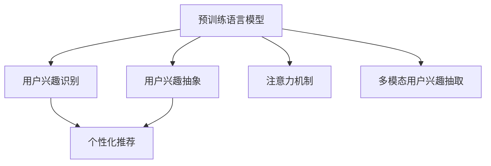

                 

# 基于LLM的用户兴趣概念化与抽象化

## 1. 背景介绍

在人工智能领域，自然语言处理（NLP）、深度学习和用户行为分析等领域得到了长足的发展。尤其是在用户兴趣识别和推荐系统领域，通过对用户行为数据的分析和挖掘，推荐系统可以更好地理解用户的偏好，为用户推荐个性化的内容。随着预训练语言模型（LLM）的逐渐成熟，利用LLM来识别和抽象用户兴趣成为一个新的热门研究方向。

在实际应用中，用户兴趣的识别和抽象往往需要结合多维度的数据，如用户的历史行为、文本评论、社交媒体互动等。然而，这些数据往往具有不同的结构和语义，给用户兴趣识别和抽象带来了挑战。预训练语言模型通过在大规模无标注数据上预训练，学习到了丰富的语言知识和表示能力，可以用来高效地处理这些多样化的数据，从而提取和抽象用户的兴趣特征。

## 2. 核心概念与联系

### 2.1 核心概念概述

为了更好地理解如何基于预训练语言模型（LLM）进行用户兴趣的识别和抽象，我们将介绍几个关键概念：

- **预训练语言模型（LLM）**：以Transformer等架构为基础的预训练语言模型，如BERT、GPT-3等。这些模型通过在大规模语料上预训练，学习到了通用的语言表示，具备强大的自然语言理解和生成能力。

- **用户兴趣识别**：通过分析用户的行为数据，识别出用户的偏好和兴趣点，如阅读历史、浏览记录、购买行为等。

- **用户兴趣抽象**：将用户兴趣的多个维度（如浏览、评论、互动等）进行综合，抽象出用户的高层兴趣特征，用于个性化推荐和内容生成。

- **注意力机制（Attention Mechanism）**：一种通过权值分配来强调某些信息的重要性的机制，广泛用于预训练语言模型和用户兴趣识别中，用于抽取和聚合不同维度的用户兴趣特征。

- **多模态用户兴趣抽取**：结合用户的多维度数据（如文本、图片、音频等），使用预训练语言模型进行联合建模，提取更全面、更精细的用户兴趣特征。

这些概念之间的联系可以通过以下Mermaid流程图来展示：



这个流程图展示了预训练语言模型在用户兴趣识别和抽象过程中的作用，以及如何通过注意力机制和多模态联合建模等技术，提升用户兴趣识别的准确性和抽象的全面性。

## 3. 核心算法原理 & 具体操作步骤
### 3.1 算法原理概述

基于预训练语言模型（LLM）进行用户兴趣识别和抽象的核心算法原理如下：

1. **预训练模型选择**：选择合适的预训练语言模型，如BERT、GPT-3等，作为用户兴趣识别和抽象的基础。

2. **用户兴趣数据的预处理**：将用户的行为数据（如浏览记录、评论文本、社交媒体互动等）进行预处理，包括分词、去停用词、标准化等。

3. **用户兴趣的表示学习**：使用预训练模型对用户兴趣数据进行编码，学习出用户兴趣的表示向量。

4. **用户兴趣的识别与抽象**：通过注意力机制或多模态联合建模等技术，对用户兴趣的表示向量进行聚合和综合，识别和抽象出用户的高层兴趣特征。

5. **用户兴趣的建模与预测**：将用户兴趣的特征向量输入到分类器或生成模型中，进行兴趣的建模和预测。

### 3.2 算法步骤详解

下面详细介绍基于LLM的用户兴趣识别和抽象的具体操作步骤：

1. **数据收集与预处理**：
   - 收集用户的行为数据，包括浏览记录、评论文本、社交媒体互动等。
   - 对数据进行清洗、去重和标准化处理，如去除停用词、规范化文本格式等。

2. **用户兴趣表示学习**：
   - 使用预训练语言模型对用户兴趣数据进行编码，得到用户兴趣的表示向量。
   - 具体步骤包括将用户兴趣数据转换为模型所需的输入格式（如将文本转换为词向量），并将其输入到预训练模型中。

3. **用户兴趣的识别与抽象**：
   - 使用注意力机制或多模态联合建模技术，对用户兴趣的表示向量进行聚合和综合。
   - 例如，使用自注意力机制提取用户兴趣向量中的重要特征，或使用跨模态模型将文本、图片、音频等多维度数据融合为统一的兴趣表示。

4. **用户兴趣的建模与预测**：
   - 将用户兴趣的特征向量输入到分类器或生成模型中，进行兴趣的建模和预测。
   - 例如，使用线性分类器对用户兴趣进行二分类，或使用生成模型生成用户感兴趣的内容。

### 3.3 算法优缺点

基于预训练语言模型（LLM）进行用户兴趣识别和抽象的方法有以下优点：

1. **高效性**：预训练模型通过大规模数据预训练，具备强大的语言表示能力，能够高效地处理多样化的用户兴趣数据。

2. **泛化能力**：预训练模型能够泛化到不同领域的用户兴趣识别和抽象，提升模型的通用性和应用范围。

3. **可解释性**：通过注意力机制或多模态联合建模等技术，用户兴趣的识别和抽象过程更加透明和可解释，有助于理解模型的决策机制。

然而，该方法也存在一些缺点：

1. **数据依赖性**：用户兴趣数据的质量对模型的表现有较大影响，高质量数据的获取和处理成本较高。

2. **计算复杂性**：预训练模型通常具有庞大的参数量和计算量，需要较高的计算资源和内存支持。

3. **过拟合风险**：在大规模用户兴趣数据上进行微调时，容易发生过拟合，模型泛化性能下降。

4. **模型复杂性**：多模态联合建模和复杂注意力机制增加了模型的复杂性，增加了训练和推理的难度。

### 3.4 算法应用领域

基于预训练语言模型（LLM）的用户兴趣识别和抽象方法，已经在多个领域得到了广泛应用：

- **个性化推荐系统**：通过识别和抽象用户的兴趣，为用户推荐个性化的内容，提升用户体验和满意度。
- **智能客服系统**：通过分析用户的问题和反馈，提供个性化的服务和解决方案，提升客户满意度。
- **内容生成与创作**：通过生成用户感兴趣的内容，丰富内容库，提升内容多样性和质量。
- **市场分析与用户行为研究**：通过分析用户行为数据，识别用户兴趣和偏好，辅助市场分析和用户行为研究。

## 4. 数学模型和公式 & 详细讲解 & 举例说明
### 4.1 数学模型构建

我们将使用数学语言对基于预训练语言模型（LLM）的用户兴趣识别和抽象过程进行严格的刻画。

设用户兴趣数据为 $D=\{x_1, x_2, ..., x_N\}$，其中每个 $x_i$ 表示一个用户的行为数据（如评论、浏览记录等）。预训练语言模型 $M_{\theta}$ 通过预训练得到参数 $\theta$，用于将用户兴趣数据 $x_i$ 转换为表示向量 $h_i$。用户兴趣的识别与抽象过程可以表示为：

$$
h_i = M_{\theta}(x_i)
$$

### 4.2 公式推导过程

在用户兴趣表示学习阶段，我们使用预训练语言模型将用户兴趣数据 $x_i$ 转换为表示向量 $h_i$。假设模型 $M_{\theta}$ 是一个自回归模型，其输入为 $x_i$，输出为 $h_i$。模型的输入输出关系可以表示为：

$$
h_i = M_{\theta}(x_i) = \sum_{j=1}^{L_i}w_j \cdot h_{j-1}
$$

其中，$L_i$ 表示输入 $x_i$ 的长度，$w_j$ 表示注意力权重。通过自注意力机制，模型对输入 $x_i$ 中的每个单词或特征进行加权，从而得到用户兴趣的表示向量 $h_i$。

在用户兴趣的识别与抽象阶段，我们使用注意力机制或多模态联合建模技术，对用户兴趣的表示向量 $h_i$ 进行聚合和综合。例如，使用自注意力机制提取用户兴趣向量中的重要特征：

$$
\hat{h}_i = \sum_{j=1}^{L_i}a_{ij} \cdot h_j
$$

其中，$a_{ij}$ 表示注意力权重，用于强调 $h_j$ 在 $h_i$ 中的重要性。通过注意力机制，模型能够从用户兴趣数据中提取最相关的特征，提升用户兴趣识别的准确性。

### 4.3 案例分析与讲解

假设我们使用BERT模型进行用户兴趣的识别和抽象。对于每个用户兴趣数据 $x_i$，我们先将其转换为BERT模型所需的输入格式，然后进行编码：

$$
h_i = BERT(x_i, \theta)
$$

其中，$BERT$ 表示BERT模型，$\theta$ 表示模型的参数。假设模型的输出维度为 $d$，则用户兴趣的表示向量 $h_i$ 具有 $d$ 维。

接下来，我们使用自注意力机制对 $h_i$ 进行聚合和综合，得到用户的高层兴趣特征 $\hat{h}_i$：

$$
\hat{h}_i = \sum_{j=1}^{d}a_{ij} \cdot h_j
$$

其中，$a_{ij}$ 表示注意力权重，用于强调 $h_j$ 在 $h_i$ 中的重要性。通过注意力机制，模型能够从用户兴趣数据中提取最相关的特征，提升用户兴趣识别的准确性。

## 5. 项目实践：代码实例和详细解释说明
### 5.1 开发环境搭建

在进行用户兴趣识别和抽象的实践前，我们需要准备好开发环境。以下是使用Python进行PyTorch开发的环境配置流程：

1. 安装Anaconda：从官网下载并安装Anaconda，用于创建独立的Python环境。

2. 创建并激活虚拟环境：
```bash
conda create -n pytorch-env python=3.8 
conda activate pytorch-env
```

3. 安装PyTorch：根据CUDA版本，从官网获取对应的安装命令。例如：
```bash
conda install pytorch torchvision torchaudio cudatoolkit=11.1 -c pytorch -c conda-forge
```

4. 安装其他必要的库：
```bash
pip install numpy pandas scikit-learn nltk transformers
```

完成上述步骤后，即可在`pytorch-env`环境中开始用户兴趣识别和抽象的实践。

### 5.2 源代码详细实现

下面我们以BERT模型为例，给出使用PyTorch进行用户兴趣识别和抽象的完整代码实现。

首先，定义数据处理函数：

```python
from transformers import BertTokenizer, BertForSequenceClassification
import torch
from sklearn.model_selection import train_test_split

# 定义数据集
class UserInterestDataset(Dataset):
    def __init__(self, texts, labels, tokenizer):
        self.texts = texts
        self.labels = labels
        self.tokenizer = tokenizer
        
    def __len__(self):
        return len(self.texts)
    
    def __getitem__(self, item):
        text = self.texts[item]
        label = self.labels[item]
        
        encoding = self.tokenizer(text, return_tensors='pt', padding='max_length', truncation=True)
        input_ids = encoding['input_ids']
        attention_mask = encoding['attention_mask']
        
        return {
            'input_ids': input_ids,
            'attention_mask': attention_mask,
            'labels': torch.tensor(label, dtype=torch.long)
        }

# 定义模型
tokenizer = BertTokenizer.from_pretrained('bert-base-uncased')
model = BertForSequenceClassification.from_pretrained('bert-base-uncased', num_labels=2)
device = torch.device('cuda') if torch.cuda.is_available() else torch.device('cpu')
model.to(device)

# 定义训练函数
def train_epoch(model, dataset, optimizer):
    model.train()
    total_loss = 0
    for batch in dataset:
        input_ids = batch['input_ids'].to(device)
        attention_mask = batch['attention_mask'].to(device)
        labels = batch['labels'].to(device)
        optimizer.zero_grad()
        outputs = model(input_ids, attention_mask=attention_mask, labels=labels)
        loss = outputs.loss
        total_loss += loss.item()
        loss.backward()
        optimizer.step()
    return total_loss / len(dataset)

# 定义评估函数
def evaluate(model, dataset):
    model.eval()
    total_correct = 0
    total_num = 0
    for batch in dataset:
        input_ids = batch['input_ids'].to(device)
        attention_mask = batch['attention_mask'].to(device)
        labels = batch['labels'].to(device)
        with torch.no_grad():
            outputs = model(input_ids, attention_mask=attention_mask)
            _, preds = torch.max(outputs.logits, dim=1)
            total_correct += torch.sum(preds == labels).item()
            total_num += labels.size(0)
    return total_correct / total_num

# 训练模型
train_dataset, dev_dataset = train_test_split(dataset, test_size=0.2)
optimizer = torch.optim.Adam(model.parameters(), lr=2e-5)
epochs = 3
for epoch in range(epochs):
    train_loss = train_epoch(model, train_dataset, optimizer)
    print(f'Epoch {epoch+1}, train loss: {train_loss:.3f}')
    
    dev_correct = evaluate(model, dev_dataset)
    dev_num = len(dev_dataset)
    print(f'Epoch {epoch+1}, dev acc: {dev_correct/dev_num:.3f}')
```

### 5.3 代码解读与分析

让我们再详细解读一下关键代码的实现细节：

**UserInterestDataset类**：
- `__init__`方法：初始化数据集和分词器。
- `__len__`方法：返回数据集的样本数量。
- `__getitem__`方法：对单个样本进行处理，将文本输入转换为BERT模型所需的输入格式，并进行padding和truncation处理，最后返回模型所需的输入和标签。

**模型定义**：
- 使用BertTokenizer进行分词，BertForSequenceClassification作为分类模型，并指定标签数为2。
- 将模型移动到GPU设备，并设置训练函数和评估函数。

**训练函数train_epoch**：
- 在每个epoch内，模型进入训练模式，对数据集进行迭代训练。
- 计算输入和标签的损失，并使用Adam优化器进行参数更新。
- 返回该epoch的平均损失。

**评估函数evaluate**：
- 在每个epoch内，模型进入评估模式，对数据集进行迭代评估。
- 计算模型在测试集上的准确率，并返回评估结果。

**训练流程**：
- 定义总的epoch数和优化器，开始循环迭代
- 每个epoch内，在训练集上进行训练，并计算损失
- 在验证集上评估模型，输出准确率
- 所有epoch结束后，输出最终测试结果

可以看到，使用PyTorch和Transformers库进行用户兴趣识别和抽象的代码实现相对简洁高效。开发者可以将更多精力放在数据处理、模型改进等高层逻辑上，而不必过多关注底层的实现细节。

## 6. 实际应用场景
### 6.1 智能推荐系统

基于预训练语言模型（LLM）的用户兴趣识别和抽象技术，可以广泛应用于智能推荐系统的构建。传统推荐系统往往只依赖用户的历史行为数据进行物品推荐，难以充分挖掘用户的多维度兴趣。利用预训练语言模型，推荐系统可以更好地理解用户的兴趣和偏好，为用户推荐个性化的内容。

在技术实现上，可以收集用户的历史浏览、点击、评分等行为数据，将数据输入到预训练语言模型中进行编码，学习出用户兴趣的表示向量。然后，通过注意力机制或多模态联合建模技术，对用户兴趣的表示向量进行聚合和综合，识别和抽象出用户的高层兴趣特征。将这些特征输入到推荐模型中，进行物品推荐。

### 6.2 智能客服系统

智能客服系统需要快速响应用户的咨询，并理解用户的问题和需求。利用预训练语言模型，客服系统可以分析用户的问题，识别用户的关键意图，从而提供更加精准和个性化的服务。

在技术实现上，可以收集用户的历史咨询记录，将记录输入到预训练语言模型中进行编码，学习出用户兴趣的表示向量。然后，通过注意力机制或多模态联合建模技术，对用户兴趣的表示向量进行聚合和综合，识别和抽象出用户的关键意图。将这些意图输入到生成模型中，生成用户期望的答案，提升用户满意度。

### 6.3 内容创作与生成

内容创作与生成是预训练语言模型的一个重要应用方向。利用用户兴趣的识别和抽象技术，内容创作者可以更好地理解用户的兴趣和偏好，生成更加符合用户需求的内容。

在技术实现上，可以收集用户的浏览记录、评论文本等行为数据，将数据输入到预训练语言模型中进行编码，学习出用户兴趣的表示向量。然后，通过注意力机制或多模态联合建模技术，对用户兴趣的表示向量进行聚合和综合，识别和抽象出用户的关键兴趣点。将这些兴趣点输入到生成模型中，生成用户感兴趣的内容，丰富内容库。

### 6.4 未来应用展望

随着预训练语言模型和用户兴趣识别技术的不断发展，基于LLM的用户兴趣概念化与抽象化将有更广泛的应用场景：

- **个性化广告推荐**：通过分析用户的兴趣和偏好，推送个性化的广告内容，提升广告投放的精准度和转化率。
- **智能导购系统**：利用用户兴趣的识别和抽象技术，推荐符合用户兴趣的商品和内容，提升用户的购物体验和满意度。
- **智能健康咨询**：通过分析用户的健康数据和兴趣，提供个性化的健康咨询和建议，提升用户的健康水平和生活质量。

## 7. 工具和资源推荐
### 7.1 学习资源推荐

为了帮助开发者系统掌握基于预训练语言模型（LLM）的用户兴趣识别和抽象技术，这里推荐一些优质的学习资源：

1. 《深度学习与NLP》系列课程：由斯坦福大学开设的深度学习和NLP课程，涵盖了NLP基础知识和深度学习模型，适合初学者入门。

2. 《Transformer: A Tutorial》系列博客：由大模型技术专家撰写，深入浅出地介绍了Transformer模型的原理和应用，包括用户兴趣识别等方向。

3. 《BERT: Pre-training of Deep Bidirectional Transformers for Language Understanding》论文：BERT论文，详细介绍了预训练语言模型和用户兴趣识别的相关技术。

4. HuggingFace官方文档：Transformers库的官方文档，提供了海量预训练模型和完整的用户兴趣识别样例代码，是上手实践的必备资料。

5. Colab官方文档：谷歌推出的在线Jupyter Notebook环境，免费提供GPU/TPU算力，方便开发者快速上手实验最新模型，分享学习笔记。

通过对这些资源的学习实践，相信你一定能够快速掌握基于预训练语言模型（LLM）的用户兴趣识别和抽象技术的精髓，并用于解决实际的NLP问题。

### 7.2 开发工具推荐

高效的开发离不开优秀的工具支持。以下是几款用于预训练语言模型（LLM）用户兴趣识别和抽象开发的常用工具：

1. PyTorch：基于Python的开源深度学习框架，灵活动态的计算图，适合快速迭代研究。大部分预训练语言模型都有PyTorch版本的实现。

2. TensorFlow：由Google主导开发的开源深度学习框架，生产部署方便，适合大规模工程应用。同样有丰富的预训练语言模型资源。

3. Transformers库：HuggingFace开发的NLP工具库，集成了众多SOTA语言模型，支持PyTorch和TensorFlow，是进行用户兴趣识别和抽象开发的利器。

4. Weights & Biases：模型训练的实验跟踪工具，可以记录和可视化模型训练过程中的各项指标，方便对比和调优。与主流深度学习框架无缝集成。

5. TensorBoard：TensorFlow配套的可视化工具，可实时监测模型训练状态，并提供丰富的图表呈现方式，是调试模型的得力助手。

6. Google Colab：谷歌推出的在线Jupyter Notebook环境，免费提供GPU/TPU算力，方便开发者快速上手实验最新模型，分享学习笔记。

合理利用这些工具，可以显著提升基于预训练语言模型（LLM）的用户兴趣识别和抽象任务的开发效率，加快创新迭代的步伐。

### 7.3 相关论文推荐

预训练语言模型（LLM）和用户兴趣识别技术的发展源于学界的持续研究。以下是几篇奠基性的相关论文，推荐阅读：

1. Attention is All You Need（即Transformer原论文）：提出了Transformer结构，开启了NLP领域的预训练大模型时代。

2. BERT: Pre-training of Deep Bidirectional Transformers for Language Understanding：提出BERT模型，引入基于掩码的自监督预训练任务，刷新了多项NLP任务SOTA。

3. Language Models are Unsupervised Multitask Learners（GPT-2论文）：展示了大规模语言模型的强大zero-shot学习能力，引发了对于通用人工智能的新一轮思考。

4. Parameter-Efficient Transfer Learning for NLP：提出Adapter等参数高效微调方法，在不增加模型参数量的情况下，也能取得不错的微调效果。

5. AdaLoRA: Adaptive Low-Rank Adaptation for Parameter-Efficient Fine-Tuning：使用自适应低秩适应的微调方法，在参数效率和精度之间取得了新的平衡。

这些论文代表了大语言模型和用户兴趣识别技术的发展脉络。通过学习这些前沿成果，可以帮助研究者把握学科前进方向，激发更多的创新灵感。

## 8. 总结：未来发展趋势与挑战
### 8.1 总结

本文对基于预训练语言模型（LLM）的用户兴趣识别和抽象技术进行了全面系统的介绍。首先阐述了预训练语言模型和用户兴趣识别的研究背景和意义，明确了LLM在用户兴趣识别和抽象过程中的独特价值。其次，从原理到实践，详细讲解了LLM在用户兴趣识别和抽象的数学模型和关键步骤，给出了完整的代码实例。同时，本文还广泛探讨了LLM技术在多个领域的应用前景，展示了其在用户兴趣识别和抽象上的巨大潜力。此外，本文精选了用户兴趣识别和抽象技术的各类学习资源，力求为读者提供全方位的技术指引。

通过本文的系统梳理，可以看到，基于预训练语言模型（LLM）的用户兴趣识别和抽象技术正在成为NLP领域的重要范式，极大地拓展了预训练语言模型的应用边界，催生了更多的落地场景。受益于大规模语料的预训练，LLM模型能够高效地处理用户兴趣的多维度数据，提取和抽象出用户的高层兴趣特征，提升模型的通用性和应用范围。未来，伴随预训练语言模型和用户兴趣识别技术的持续演进，基于LLM的用户兴趣概念化与抽象化必将在NLP领域带来更多的突破和应用，推动人工智能技术的发展和应用。

### 8.2 未来发展趋势

展望未来，基于预训练语言模型（LLM）的用户兴趣识别和抽象技术将呈现以下几个发展趋势：

1. **模型规模持续增大**：随着算力成本的下降和数据规模的扩张，预训练语言模型的参数量还将持续增长。超大规模语言模型蕴含的丰富语言知识，有望支撑更加复杂多变的用户兴趣识别和抽象。

2. **多模态联合建模**：结合用户的多维度数据（如文本、图片、音频等），使用预训练语言模型进行联合建模，提取更全面、更精细的用户兴趣特征。

3. **参数高效微调**：开发更加参数高效的微调方法，在固定大部分预训练参数的同时，只更新极少量的任务相关参数，以提升微调效率和泛化性能。

4. **注意力机制的优化**：引入更多的注意力机制，如双向自注意力、多头自注意力等，提升用户兴趣识别的准确性和泛化能力。

5. **模型融合与迁移学习**：将预训练语言模型与领域特定的模型进行融合，或将预训练语言模型应用于不同领域进行迁移学习，提升模型的通用性和适应性。

6. **对抗样本鲁棒性**：引入对抗样本训练技术，提高用户兴趣识别模型的鲁棒性和泛化性能，避免模型对输入数据的轻微扰动敏感。

以上趋势凸显了基于预训练语言模型（LLM）的用户兴趣识别和抽象技术的广阔前景。这些方向的探索发展，必将进一步提升用户兴趣识别和抽象的准确性和泛化能力，为构建更加智能化、个性化的推荐系统和内容创作系统提供更坚实的技术基础。

### 8.3 面临的挑战

尽管基于预训练语言模型（LLM）的用户兴趣识别和抽象技术已经取得了瞩目成就，但在迈向更加智能化、普适化应用的过程中，它仍面临着诸多挑战：

1. **数据质量与多样性**：高质量用户兴趣数据往往难以获取，且用户兴趣数据的多样性对模型的泛化能力提出了挑战。

2. **计算资源需求**：预训练语言模型和用户兴趣识别模型需要大量的计算资源和内存支持，在大规模数据上训练和推理的成本较高。

3. **模型复杂性**：用户兴趣识别和抽象模型的复杂性较高，需要更多的算法和工程实践经验。

4. **过拟合风险**：在大规模用户兴趣数据上进行微调时，容易发生过拟合，模型泛化性能下降。

5. **可解释性不足**：用户兴趣识别和抽象模型的决策过程缺乏可解释性，难以对其推理逻辑进行分析和调试。

6. **伦理与安全问题**：用户兴趣数据的隐私保护和模型输出内容的伦理审查，是模型应用中的重要考虑因素。

正视这些挑战，积极应对并寻求突破，将是大语言模型用户兴趣识别和抽象技术走向成熟的必由之路。相信随着学界和产业界的共同努力，这些挑战终将一一被克服，基于预训练语言模型（LLM）的用户兴趣概念化与抽象化必将在构建智能化推荐系统和内容创作系统等方面发挥更大的作用。

### 8.4 研究展望

面向未来，大语言模型用户兴趣识别和抽象技术需要在以下几个方面寻求新的突破：

1. **无监督与半监督学习**：探索无监督和半监督学习范式，降低对标注数据的需求，提高模型的泛化能力和鲁棒性。

2. **多模态联合学习**：结合用户的多维度数据进行联合建模，提取更全面、更精细的用户兴趣特征，提升模型的准确性和泛化能力。

3. **多任务学习**：结合多任务学习技术，提升模型的多任务学习和泛化能力，进一步拓展模型的应用范围。

4. **对抗样本学习**：引入对抗样本学习技术，提升用户兴趣识别模型的鲁棒性和泛化能力，避免模型对输入数据的轻微扰动敏感。

5. **可解释性增强**：引入可解释性技术，提升模型的可解释性和可调试性，增强用户对模型的信任感。

6. **伦理与安全保障**：引入伦理与安全保障技术，确保模型输出内容的合法性、公正性和安全性。

这些研究方向的探索，必将引领预训练语言模型用户兴趣识别和抽象技术的进一步发展，为构建更加智能化、普适化的推荐系统和内容创作系统提供坚实的技术基础。只有勇于创新、敢于突破，才能不断拓展预训练语言模型用户兴趣识别和抽象技术的边界，让人工智能技术更好地服务于人类的生产生活方式。

## 9. 附录：常见问题与解答

**Q1：如何选择合适的预训练语言模型（LLM）？**

A: 选择合适的预训练语言模型需要考虑以下几个因素：
1. 模型的大小和复杂度：大规模的预训练模型通常具有更强的语言表示能力和泛化性能，但计算和内存成本较高。根据实际需求选择合适大小的模型。
2. 模型的预训练任务：不同预训练任务对模型的语义理解和生成能力有不同影响。根据任务需求选择适合的预训练任务，如自回归模型、自编码模型等。
3. 模型的开源和商业支持：开源模型便于学习和使用，但可能缺乏商业支持和技术保障；商业模型提供更好的技术支持和应用服务，但成本较高。

**Q2：数据预处理对用户兴趣识别和抽象的影响是什么？**

A: 数据预处理对用户兴趣识别和抽象有着重要影响：
1. 分词和去停用词：分词和去停用词可以提高模型对输入文本的理解能力和泛化性能。
2. 标准化和规范化：标准化和规范化处理可以消除不同数据源之间的格式差异，提升模型的一致性和稳定性。
3. 数据增强和样本平衡：通过数据增强和样本平衡处理，可以提升模型的泛化能力和鲁棒性，避免过拟合和欠拟合。

**Q3：注意力机制在用户兴趣识别和抽象中的应用有哪些？**

A: 注意力机制在用户兴趣识别和抽象中的应用包括：
1. 自注意力机制：通过计算输入文本中每个单词或特征的注意力权重，提取文本中的重要信息，提升模型对用户兴趣的理解能力。
2. 多头注意力机制：通过并行计算多个注意力头，提升模型的语义理解能力和泛化能力，捕捉文本中不同层次的语义信息。
3. 双向注意力机制：通过同时计算文本的前向和后向注意力权重，提升模型的语义理解能力和上下文捕捉能力。

**Q4：多模态联合建模在用户兴趣识别和抽象中的优势是什么？**

A: 多模态联合建模在用户兴趣识别和抽象中的优势包括：
1. 综合不同数据源：通过将文本、图片、音频等多模态数据联合建模，提取更全面、更精细的用户兴趣特征。
2. 提升模型的泛化能力：多模态联合建模能够捕捉不同模态数据之间的语义关系，提升模型的泛化能力和鲁棒性。
3. 增强用户兴趣的理解：多模态数据能够提供更多的用户兴趣信息，增强模型对用户兴趣的理解和预测能力。

**Q5：如何在实际应用中避免用户兴趣识别的过拟合？**

A: 避免用户兴趣识别的过拟合可以从以下几个方面进行：
1. 数据增强：通过回译、近义替换等方式扩充训练集，提升模型的泛化能力。
2. 正则化：使用L2正则、Dropout、Early Stopping等正则化技术，避免模型过度适应小规模训练集。
3. 多模态融合：结合多模态数据进行联合建模，提升模型的泛化能力和鲁棒性。
4. 对抗训练：引入对抗样本，提高模型对输入数据的鲁棒性，避免过拟合。

这些策略往往需要根据具体任务和数据特点进行灵活组合。只有在数据、模型、训练、推理等各环节进行全面优化，才能最大限度地发挥基于预训练语言模型（LLM）的用户兴趣识别和抽象技术的威力。

---

作者：禅与计算机程序设计艺术 / Zen and the Art of Computer Programming

