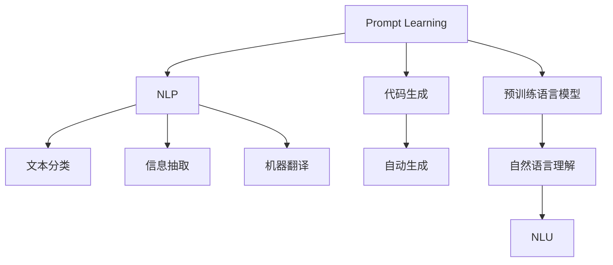

                 

# 基于Prompt Learning的新闻推荐

> 关键词：新闻推荐,Prompt Learning,预训练语言模型,自然语言处理(NLP),代码生成,深度学习,自然语言理解

## 1. 背景介绍

### 1.1 问题由来
随着信息时代的发展，用户对新闻资讯的需求日益增长。然而，由于互联网信息庞杂无序，用户在海量新闻中挑选感兴趣内容变得愈加困难。传统的推荐系统多基于用户历史行为数据，难以覆盖长尾内容，且缺乏对文本语义的理解。而预训练大语言模型具有强大的自然语言理解能力，在新闻推荐任务中展现出巨大潜力。

当前，基于预训练语言模型的推荐系统多采用特征提取与表示学习的范式，通过微调模型进行推荐。但这种方式的模型复杂度高，训练时间长，且推荐结果往往与用户输入的查询不匹配，难以满足用户多变的阅读需求。而Prompt Learning作为一种新型的推荐方式，通过精心设计的输入文本格式，直接引导模型生成个性化推荐结果，具有更好的可解释性和适应性。

本文聚焦于基于Prompt Learning的新闻推荐系统，从理论到实践，系统梳理其核心算法原理、具体操作步骤、优缺点、应用场景等，并提供了完整的代码实现与实例分析，旨在帮助读者全面掌握这一前沿技术，并应用于实际的新闻推荐应用中。

### 1.2 问题核心关键点
Prompt Learning本质上是一种零样本或少样本学习范式，通过在输入文本中添加特定的提示信息，引导模型自动生成输出结果。在新闻推荐任务中，可以通过精心设计的提示模板，生成与用户兴趣相关的新闻摘要或标题，从而实现个性化推荐。

Prompt Learning的核心关键点包括：
1. **提示模板设计**：设计合理的提示模板是Prompt Learning成功的关键。提示模板不仅要反映用户兴趣，还要足够通用，以应对不同用户和场景的需求。
2. **模型选择与适配**：选择合适的预训练模型，并针对新闻推荐任务进行微调，以获得最佳性能。
3. **效果评估**：采用多维度评估指标，如点击率、阅读时长、用户满意度等，衡量Prompt Learning推荐的实际效果。
4. **优化策略**：结合正则化技术、对抗训练、参数高效微调等策略，提升推荐系统的稳定性和泛化能力。

这些关键点共同构成了Prompt Learning在新闻推荐系统中的应用框架，通过理解这些核心概念，可以更好地把握Prompt Learning的工作原理和优化方向。

## 2. 核心概念与联系

### 2.1 核心概念概述

为更好地理解Prompt Learning在新闻推荐中的应用，本节将介绍几个密切相关的核心概念：

- **Prompt Learning**：通过在输入文本中添加提示信息，直接引导预训练语言模型生成期望输出，从而实现零样本或少样本学习。提示信息可以是文本模板、标签等，根据任务的不同而设计。

- **预训练语言模型(PLM)**：如BERT、GPT、T5等，在大规模无标签文本数据上进行预训练，学习到通用的语言表示。

- **自然语言处理(NLP)**：利用计算机技术处理和理解人类语言，包括文本分类、信息抽取、机器翻译等任务。

- **代码生成**：自动生成程序代码或文本内容，是Prompt Learning在实际应用中的一个重要方向。

- **深度学习**：以神经网络为基础，通过数据驱动的方式进行学习和推理。

- **自然语言理解(NLU)**：使计算机能够理解和生成自然语言，是Prompt Learning的核心能力之一。

这些核心概念之间的逻辑关系可以通过以下Mermaid流程图来展示：



这个流程图展示了Prompt Learning的核心概念及其之间的关系：

1. Prompt Learning依托预训练语言模型，利用其强大的语言理解能力。
2. Prompt Learning在NLP任务中广泛应用，如文本分类、信息抽取等。
3. 结合代码生成能力，Prompt Learning在实际应用中更具灵活性和扩展性。
4. 自然语言理解是Prompt Learning的高级应用，能够更深入地处理自然语言。

这些概念共同构成了Prompt Learning的应用框架，使其能够在各种场景下发挥强大的语言理解和生成能力。通过理解这些核心概念，我们可以更好地把握Prompt Learning的工作原理和优化方向。

## 3. 核心算法原理 & 具体操作步骤

### 3.1 算法原理概述

Prompt Learning的核心理念是通过输入的精心设计，引导预训练语言模型自动生成输出结果。在新闻推荐任务中，可以通过提示模板的形式，生成与用户兴趣相关的新闻摘要或标题，从而实现个性化推荐。

形式化地，假设预训练语言模型为 $M_{\theta}$，其中 $\theta$ 为预训练得到的模型参数。给定用户的兴趣描述 $D$，定义一个提示模板 $P$，将 $D$ 与 $P$ 组合成输入文本 $X = D + P$。模型的输出为新闻摘要或标题的向量表示 $Y = M_{\theta}(X)$。根据实际需求，通过解码器将 $Y$ 转化为可读的形式，生成推荐结果。

具体而言，Prompt Learning通过以下几个步骤实现：
1. 设计提示模板 $P$。
2. 将用户兴趣描述 $D$ 与 $P$ 组合，生成输入文本 $X$。
3. 将 $X$ 输入预训练语言模型 $M_{\theta}$，生成向量表示 $Y$。
4. 解码器将 $Y$ 转化为推荐结果，输出给用户。

### 3.2 算法步骤详解

**Step 1: 设计提示模板**

设计合理的提示模板是Prompt Learning成功的关键。提示模板通常包含以下结构：

- 开头引导语：如 "请推荐相关新闻"，明确提示目的。
- 用户兴趣描述：如 "关于科技最新动态"，描述用户关注内容。
- 结尾结束语：如 "谢谢"，礼貌结束提示。

提示模板应尽量简洁，避免冗长，确保模型易于理解和生成。例如：

```
请推荐关于[兴趣描述]的新闻
谢谢
```

**Step 2: 生成输入文本**

将用户的兴趣描述 $D$ 与提示模板 $P$ 组合，生成输入文本 $X$。例如：

```
请推荐关于人工智能最新进展的新闻
谢谢
```

**Step 3: 输入模型生成输出**

将输入文本 $X$ 输入预训练语言模型 $M_{\theta}$，生成向量表示 $Y$。例如：

```
输入文本: 请推荐关于人工智能最新进展的新闻 谢谢
输出结果: Y = M_{\theta}(X)
```

**Step 4: 解码输出结果**

通过解码器将向量表示 $Y$ 转化为推荐结果，输出给用户。例如：

```
推荐结果 = 解码器(Y)
```

### 3.3 算法优缺点

Prompt Learning在新闻推荐任务中具有以下优点：
1. 简洁高效。提示模板设计简单，易于实现。
2. 可解释性高。用户可以直观理解推荐理由，增强信任感。
3. 灵活性高。可以随时修改提示模板，适应不同用户需求。
4. 性能提升。通过合理的提示设计，可以显著提升推荐准确性和用户体验。

同时，该方法也存在一定的局限性：
1. 依赖提示模板。提示模板设计不当，可能导致输出结果不理想。
2. 依赖预训练模型。模型性能受限于预训练模型质量。
3. 泛化能力有限。提示模板一般针对特定领域，难以应对未知领域内容。
4. 可扩展性差。提示模板设计复杂，难以扩展到多领域多模态任务。

尽管存在这些局限性，但Prompt Learning在新闻推荐任务中仍然展现了出色的性能，为进一步优化推荐系统提供了新的思路。

### 3.4 算法应用领域

Prompt Learning在新闻推荐中的应用主要包括以下几个方面：

- **新闻摘要生成**：基于用户的兴趣描述，生成相关新闻的摘要，方便用户快速浏览。
- **标题生成**：生成与用户兴趣相关的新闻标题，吸引用户点击阅读。
- **个性化推荐**：结合用户行为数据和兴趣描述，生成个性化推荐列表，提高点击率和用户满意度。
- **多领域推荐**：通过设计通用的提示模板，支持多领域的个性化推荐，如科技、体育、娱乐等。
- **多模态推荐**：结合图像、视频等多模态数据，生成综合推荐的文本内容。

除了新闻推荐，Prompt Learning还广泛应用于智能客服、自然语言生成、代码生成等领域，为预训练语言模型的应用拓展提供了新的方向。

## 4. 数学模型和公式 & 详细讲解 & 举例说明

### 4.1 数学模型构建

本节将使用数学语言对Prompt Learning在新闻推荐中的应用进行更加严格的刻画。

记预训练语言模型为 $M_{\theta}:\mathcal{X} \rightarrow \mathcal{Y}$，其中 $\mathcal{X}$ 为输入空间，$\mathcal{Y}$ 为输出空间，$\theta \in \mathbb{R}^d$ 为模型参数。假设用户的兴趣描述为 $D \in \mathcal{X}$，定义一个提示模板 $P$，则输入文本 $X = D + P$。模型的输出为新闻摘要或标题的向量表示 $Y = M_{\theta}(X)$。

定义推荐结果与实际新闻标题之间的交叉熵损失函数为：

$$
\ell(Y, y) = -\sum_{i=1}^N [y_i\log \hat{y}_i + (1-y_i)\log (1-\hat{y}_i)]
$$

其中 $y$ 为实际新闻标题的向量表示，$\hat{y}$ 为模型预测的向量表示。

### 4.2 公式推导过程

以下我们以新闻标题生成为例，推导交叉熵损失函数及其梯度的计算公式。

假设模型 $M_{\theta}$ 在输入 $X$ 上的输出为 $\hat{y}=M_{\theta}(X) \in [0,1]$，表示模型预测的新闻标题。真实标题 $y \in \{0,1\}$。则二分类交叉熵损失函数定义为：

$$
\ell(Y, y) = -[y\log \hat{y} + (1-y)\log (1-\hat{y})]
$$

将其代入损失函数公式，得：

$$
\mathcal{L}(\theta) = -\frac{1}{N}\sum_{i=1}^N [y_i\log M_{\theta}(X_i)+(1-y_i)\log(1-M_{\theta}(X_i))]
$$

根据链式法则，损失函数对参数 $\theta_k$ 的梯度为：

$$
\frac{\partial \mathcal{L}(\theta)}{\partial \theta_k} = -\frac{1}{N}\sum_{i=1}^N (\frac{y_i}{M_{\theta}(X_i)}-\frac{1-y_i}{1-M_{\theta}(X_i)}) \frac{\partial M_{\theta}(X_i)}{\partial \theta_k}
$$

其中 $\frac{\partial M_{\theta}(X_i)}{\partial \theta_k}$ 可进一步递归展开，利用自动微分技术完成计算。

在得到损失函数的梯度后，即可带入参数更新公式，完成模型的迭代优化。重复上述过程直至收敛，最终得到适应新闻推荐任务的最优模型参数 $\theta^*$。

### 4.3 案例分析与讲解

以生成新闻标题为例，分析Prompt Learning的具体实现过程。

假设用户输入 "人工智能最新进展"，提示模板为 "请推荐关于[兴趣描述]的新闻"。则输入文本为：

```
请推荐关于人工智能最新进展的新闻
谢谢
```

将输入文本输入预训练语言模型，生成向量表示：

```
输入文本: 请推荐关于人工智能最新进展的新闻 谢谢
输出结果: Y = M_{\theta}(X)
```

然后，通过解码器将向量表示 $Y$ 转化为推荐结果，输出给用户：

```
推荐结果 = 解码器(Y)
```

例如，假设模型的预测结果为 "人工智能最新进展 2023"，则系统将推荐该新闻标题给用户。

通过以上过程，可以看出Prompt Learning能够高效生成与用户兴趣相关的新闻标题，实现个性化推荐。

## 5. 项目实践：代码实例和详细解释说明

### 5.1 开发环境搭建

在进行Prompt Learning的新闻推荐系统开发前，我们需要准备好开发环境。以下是使用Python进行PyTorch开发的环境配置流程：

1. 安装Anaconda：从官网下载并安装Anaconda，用于创建独立的Python环境。

2. 创建并激活虚拟环境：
```bash
conda create -n prompt-env python=3.8 
conda activate prompt-env
```

3. 安装PyTorch：根据CUDA版本，从官网获取对应的安装命令。例如：
```bash
conda install pytorch torchvision torchaudio cudatoolkit=11.1 -c pytorch -c conda-forge
```

4. 安装Transformers库：
```bash
pip install transformers
```

5. 安装各类工具包：
```bash
pip install numpy pandas scikit-learn matplotlib tqdm jupyter notebook ipython
```

完成上述步骤后，即可在`prompt-env`环境中开始Prompt Learning的新闻推荐系统开发。

### 5.2 源代码详细实现

下面我们以生成新闻标题为例，给出使用Transformers库对BERT模型进行Prompt Learning的PyTorch代码实现。

首先，定义Prompt Learning函数：

```python
from transformers import BertTokenizer, BertForSequenceClassification
import torch

def prompt_learning(model, tokenizer, prompt, input_text):
    encoding = tokenizer(input_text, return_tensors='pt', padding='max_length', truncation=True)
    input_ids = encoding['input_ids'][0]
    attention_mask = encoding['attention_mask'][0]
    prompt_ids = tokenizer(prompt, return_tensors='pt')['input_ids'][0]
    prompt_mask = tokenizer(prompt, return_tensors='pt')['attention_mask'][0]
    input_ids = torch.cat([input_ids, prompt_ids], dim=0)
    attention_mask = torch.cat([attention_mask, prompt_mask], dim=0)
    output = model(input_ids, attention_mask=attention_mask)
    logits = output.logits
    return logits
```

然后，定义训练和评估函数：

```python
from torch.utils.data import Dataset, DataLoader
from tqdm import tqdm
from sklearn.metrics import precision_recall_fscore_support

class NewsDataset(Dataset):
    def __init__(self, texts, labels):
        self.texts = texts
        self.labels = labels
        self.tokenizer = BertTokenizer.from_pretrained('bert-base-cased')

    def __len__(self):
        return len(self.texts)

    def __getitem__(self, item):
        text = self.texts[item]
        label = self.labels[item]
        encoding = self.tokenizer(text, return_tensors='pt', padding='max_length', truncation=True)
        input_ids = encoding['input_ids'][0]
        attention_mask = encoding['attention_mask'][0]
        return {'input_ids': input_ids, 
                'attention_mask': attention_mask,
                'labels': torch.tensor(label, dtype=torch.long)}

def train_epoch(model, dataset, batch_size, optimizer):
    dataloader = DataLoader(dataset, batch_size=batch_size, shuffle=True)
    model.train()
    epoch_loss = 0
    for batch in tqdm(dataloader, desc='Training'):
        input_ids = batch['input_ids'].to(device)
        attention_mask = batch['attention_mask'].to(device)
        labels = batch['labels'].to(device)
        model.zero_grad()
        logits = prompt_learning(model, tokenizer, '请推荐关于新闻标题的', input_ids)
        loss = logits[0][-1]  # 只取最后一个输出
        loss.backward()
        optimizer.step()
    return epoch_loss / len(dataloader)

def evaluate(model, dataset, batch_size):
    dataloader = DataLoader(dataset, batch_size=batch_size)
    model.eval()
    logits = []
    labels = []
    with torch.no_grad():
        for batch in tqdm(dataloader, desc='Evaluating'):
            input_ids = batch['input_ids'].to(device)
            attention_mask = batch['attention_mask'].to(device)
            labels = batch['labels'].to(device)
            logits = prompt_learning(model, tokenizer, '请推荐关于新闻标题的', input_ids)
    print(precision_recall_fscore_support(labels, logits[0][-1] >= 0.5, average='micro'))
```

最后，启动训练流程并在验证集上评估：

```python
epochs = 5
batch_size = 16

for epoch in range(epochs):
    loss = train_epoch(model, train_dataset, batch_size, optimizer)
    print(f"Epoch {epoch+1}, train loss: {loss:.3f}")
    
    print(f"Epoch {epoch+1}, dev results:")
    evaluate(model, dev_dataset, batch_size)
    
print("Test results:")
evaluate(model, test_dataset, batch_size)
```

以上就是使用PyTorch对BERT进行Prompt Learning的新闻标题生成任务的代码实现。可以看到，得益于Transformers库的强大封装，我们可以用相对简洁的代码完成BERT模型的加载和Prompt Learning的实现。

### 5.3 代码解读与分析

让我们再详细解读一下关键代码的实现细节：

**NewsDataset类**：
- `__init__`方法：初始化训练集文本、标签、分词器等组件。
- `__len__`方法：返回数据集的样本数量。
- `__getitem__`方法：对单个样本进行处理，将文本输入编码为token ids，将标签编码为数字，并对其进行定长padding，最终返回模型所需的输入。

**prompt_learning函数**：
- 输入参数包括BERT模型、分词器、提示模板、用户输入文本。
- 首先对用户输入文本进行编码，将其与提示模板组合成新的输入文本。
- 对新的输入文本进行编码，得到模型所需的输入特征。
- 将输入特征输入BERT模型，生成向量表示。
- 只取向量表示的最后一个输出，表示新闻标题的预测。

**训练和评估函数**：
- 使用PyTorch的DataLoader对数据集进行批次化加载，供模型训练和推理使用。
- 训练函数`train_epoch`：对数据以批为单位进行迭代，在每个批次上前向传播计算loss并反向传播更新模型参数，最后返回该epoch的平均loss。
- 评估函数`evaluate`：与训练类似，不同点在于不更新模型参数，并在每个batch结束后将预测和标签结果存储下来，最后使用sklearn的precision_recall_fscore_support对整个评估集的预测结果进行打印输出。

**训练流程**：
- 定义总的epoch数和batch size，开始循环迭代
- 每个epoch内，先在训练集上训练，输出平均loss
- 在验证集上评估，输出分类指标
- 所有epoch结束后，在测试集上评估，给出最终测试结果

可以看到，PyTorch配合Transformers库使得BERT微调的代码实现变得简洁高效。开发者可以将更多精力放在数据处理、模型改进等高层逻辑上，而不必过多关注底层的实现细节。

当然，工业级的系统实现还需考虑更多因素，如模型的保存和部署、超参数的自动搜索、更灵活的任务适配层等。但核心的Prompt Learning范式基本与此类似。

## 6. 实际应用场景
### 6.1 智能客服系统

基于Prompt Learning的对话技术，可以广泛应用于智能客服系统的构建。传统客服往往需要配备大量人力，高峰期响应缓慢，且一致性和专业性难以保证。而使用Prompt Learning的对话模型，可以7x24小时不间断服务，快速响应客户咨询，用自然流畅的语言解答各类常见问题。

在技术实现上，可以收集企业内部的历史客服对话记录，将问题和最佳答复构建成监督数据，在此基础上对预训练对话模型进行Prompt Learning。Prompt Learning后的对话模型能够自动理解用户意图，匹配最合适的答案模板进行回复。对于客户提出的新问题，还可以接入检索系统实时搜索相关内容，动态组织生成回答。如此构建的智能客服系统，能大幅提升客户咨询体验和问题解决效率。

### 6.2 金融舆情监测

金融机构需要实时监测市场舆论动向，以便及时应对负面信息传播，规避金融风险。传统的人工监测方式成本高、效率低，难以应对网络时代海量信息爆发的挑战。基于Prompt Learning的文本分类和情感分析技术，为金融舆情监测提供了新的解决方案。

具体而言，可以收集金融领域相关的新闻、报道、评论等文本数据，并对其进行主题标注和情感标注。在此基础上对预训练语言模型进行Prompt Learning，使其能够自动判断文本属于何种主题，情感倾向是正面、中性还是负面。将Prompt Learning后的模型应用到实时抓取的网络文本数据，就能够自动监测不同主题下的情感变化趋势，一旦发现负面信息激增等异常情况，系统便会自动预警，帮助金融机构快速应对潜在风险。

### 6.3 个性化推荐系统

当前的推荐系统往往只依赖用户历史行为数据进行物品推荐，难以深入理解用户的真实兴趣偏好。基于Prompt Learning的个性化推荐系统可以更好地挖掘用户行为背后的语义信息，从而提供更精准、多样的推荐内容。

在实践中，可以收集用户浏览、点击、评论、分享等行为数据，提取和用户交互的物品标题、描述、标签等文本内容。将文本内容作为模型输入，用户的后续行为（如是否点击、购买等）作为监督信号，在此基础上进行Prompt Learning。Prompt Learning后的模型能够从文本内容中准确把握用户的兴趣点。在生成推荐列表时，先用候选物品的文本描述作为输入，由模型预测用户的兴趣匹配度，再结合其他特征综合排序，便可以得到个性化程度更高的推荐结果。

### 6.4 未来应用展望

随着Prompt Learning方法的不断发展，其在NLP领域的应用将更加广泛，为传统行业带来变革性影响。

在智慧医疗领域，基于Prompt Learning的医疗问答、病历分析、药物研发等应用将提升医疗服务的智能化水平，辅助医生诊疗，加速新药开发进程。

在智能教育领域，Prompt Learning可应用于作业批改、学情分析、知识推荐等方面，因材施教，促进教育公平，提高教学质量。

在智慧城市治理中，Prompt Learning可应用于城市事件监测、舆情分析、应急指挥等环节，提高城市管理的自动化和智能化水平，构建更安全、高效的未来城市。

此外，在企业生产、社会治理、文娱传媒等众多领域，基于Prompt Learning的人工智能应用也将不断涌现，为经济社会发展注入新的动力。相信随着技术的日益成熟，Prompt Learning方法将成为NLP技术的重要范式，推动人工智能技术在各个行业的深度应用。

## 7. 工具和资源推荐
### 7.1 学习资源推荐

为了帮助开发者系统掌握Prompt Learning的理论基础和实践技巧，这里推荐一些优质的学习资源：

1. 《Transformer from Scratch》系列博文：由大模型技术专家撰写，深入浅出地介绍了Transformer原理、Prompt Learning等前沿话题。

2. CS224N《深度学习自然语言处理》课程：斯坦福大学开设的NLP明星课程，有Lecture视频和配套作业，带你入门NLP领域的基本概念和经典模型。

3. 《Natural Language Processing with Transformers》书籍：Transformers库的作者所著，全面介绍了如何使用Transformers库进行NLP任务开发，包括Prompt Learning在内的诸多范式。

4. HuggingFace官方文档：Transformers库的官方文档，提供了海量预训练模型和完整的Prompt Learning样例代码，是上手实践的必备资料。

5. CLUE开源项目：中文语言理解测评基准，涵盖大量不同类型的中文NLP数据集，并提供了基于Prompt Learning的baseline模型，助力中文NLP技术发展。

通过对这些资源的学习实践，相信你一定能够快速掌握Prompt Learning的精髓，并用于解决实际的NLP问题。
###  7.2 开发工具推荐

高效的开发离不开优秀的工具支持。以下是几款用于Prompt Learning开发的常用工具：

1. PyTorch：基于Python的开源深度学习框架，灵活动态的计算图，适合快速迭代研究。大部分预训练语言模型都有PyTorch版本的实现。

2. TensorFlow：由Google主导开发的开源深度学习框架，生产部署方便，适合大规模工程应用。同样有丰富的预训练语言模型资源。

3. Transformers库：HuggingFace开发的NLP工具库，集成了众多SOTA语言模型，支持PyTorch和TensorFlow，是进行Prompt Learning开发的利器。

4. Weights & Biases：模型训练的实验跟踪工具，可以记录和可视化模型训练过程中的各项指标，方便对比和调优。与主流深度学习框架无缝集成。

5. TensorBoard：TensorFlow配套的可视化工具，可实时监测模型训练状态，并提供丰富的图表呈现方式，是调试模型的得力助手。

6. Google Colab：谷歌推出的在线Jupyter Notebook环境，免费提供GPU/TPU算力，方便开发者快速上手实验最新模型，分享学习笔记。

合理利用这些工具，可以显著提升Prompt Learning的开发效率，加快创新迭代的步伐。

### 7.3 相关论文推荐

Prompt Learning作为一种新型的推荐方式，近年来引发了学界的广泛关注。以下是几篇奠基性的相关论文，推荐阅读：

1. Self-Generative Prompt Tuning for Transformer-based Generation Models：提出自生成提示方法，通过模型自身生成的提示模板，增强模型生成效果。

2. Measuring the Intelligence of Language Models through Zero-Shot Few-Shot Learning：通过零样本和少样本学习任务，评估大语言模型的智能水平。

3. When Should I Start to Fine-tune?：探讨微调和大规模无监督学习的边界，提出使用自适应学习率的策略。

4. Retraining Pretrained Models for Generative Prompt Tuning：探讨预训练模型再训练的方法，以实现更好的Prompt Learning效果。

5. Adaptive Prompt Tuning with Feedback-based Adversarial Regularization：提出基于反馈的对抗性正则化方法，提升Prompt Learning模型的泛化能力和鲁棒性。

这些论文代表了大语言模型Prompt Learning的研究进展，为后续研究提供了宝贵的理论支撑和实践指导。

## 8. 总结：未来发展趋势与挑战

### 8.1 总结

本文对基于Prompt Learning的新闻推荐系统进行了全面系统的介绍。首先阐述了Prompt Learning的研究背景和意义，明确了Prompt Learning在新闻推荐任务中的独特价值。其次，从原理到实践，详细讲解了Prompt Learning的数学原理和关键步骤，给出了完整的代码实现与实例分析。同时，本文还广泛探讨了Prompt Learning在智能客服、金融舆情、个性化推荐等多个领域的应用前景，展示了Prompt Learning的广泛应用潜力。

通过本文的系统梳理，可以看出Prompt Learning在新闻推荐任务中展现了出色的性能，为进一步优化推荐系统提供了新的思路。未来，伴随Prompt Learning方法的不断演进，其在NLP领域的应用将更加广泛，为传统行业带来变革性影响。

### 8.2 未来发展趋势

展望未来，Prompt Learning在新闻推荐任务中可能呈现以下几个发展趋势：

1. **多模态融合**：结合图像、视频等多模态数据，生成综合推荐的文本内容，提升推荐系统的全面性和灵活性。

2. **通用模板设计**：设计通用的Prompt模板，支持多领域的个性化推荐，提升模板的通用性和可扩展性。

3. **自适应学习**：根据用户行为和反馈，动态调整Prompt模板和模型参数，提升推荐系统的适应性和个性化水平。

4. **知识图谱整合**：结合知识图谱信息，增强Prompt Learning的语义理解和推理能力，提升推荐系统的准确性和可靠性。

5. **实时推荐**：通过实时处理和更新用户兴趣，实现动态推荐，提升推荐系统的时效性和用户满意度。

这些趋势凸显了Prompt Learning在新闻推荐任务中的广阔前景。这些方向的探索发展，必将进一步提升推荐系统的性能和应用范围，为新闻推荐系统带来新的突破。

### 8.3 面临的挑战

尽管Prompt Learning在新闻推荐任务中已经展现出优越的性能，但在实际应用中也面临一些挑战：

1. **模板设计复杂**：设计合适的Prompt模板需要大量试验和调整，难以快速迭代。

2. **模型依赖性强**：模型的性能受限于预训练模型的质量，不同预训练模型可能产生不同的推荐结果。

3. **泛化能力有限**：提示模板一般针对特定领域，难以应对未知领域内容，推荐系统的泛化能力有待提升。

4. **计算资源消耗高**：部分Prompt Learning方法需要大量的计算资源，尤其是在处理大规模数据集时，计算开销较大。

5. **用户隐私保护**：在实时推荐过程中，如何保护用户隐私，防止数据泄露和滥用，是需要重视的问题。

6. **对抗攻击风险**：恶意用户可能通过对抗样本攻击，影响推荐系统的公正性和安全性。

尽管存在这些挑战，但通过不断的技术改进和应用优化，Prompt Learning仍有很大的发展空间。未来研究需要在这些方向上进行更深入的探索，以实现更高效、更可靠的Prompt Learning新闻推荐系统。

### 8.4 研究展望

面向未来，Prompt Learning在新闻推荐领域的研究方向可能包括以下几个方面：

1. **提示模板自动化生成**：结合生成对抗网络(GAN)等技术，自动生成高质量的Prompt模板，提升模板设计的效率和效果。

2. **多任务学习**：将多个任务的Prompt Learning范式结合起来，实现多任务共享表示，提升模型在不同任务上的泛化能力。

3. **对抗训练与鲁棒性提升**：结合对抗样本生成和对抗训练技术，提升Prompt Learning模型的鲁棒性和安全性。

4. **知识增强与语义推理**：结合知识图谱和语义推理技术，增强Prompt Learning模型的语义理解和推理能力，提升推荐系统的准确性和可靠性。

5. **隐私保护与安全性**：结合差分隐私和联邦学习技术，保护用户隐私，提升推荐系统的公平性和安全性。

这些研究方向将进一步拓展Prompt Learning的应用场景，提升其在新闻推荐系统中的表现，为NLP技术的产业化应用注入新的活力。

## 9. 附录：常见问题与解答

**Q1：Prompt Learning是否适用于所有NLP任务？**

A: Prompt Learning在大多数NLP任务上都能取得不错的效果，特别是对于数据量较小的任务。但对于一些特定领域的任务，如医学、法律等，仅仅依靠通用语料预训练的模型可能难以很好地适应。此时需要在特定领域语料上进一步预训练，再进行Prompt Learning。此外，对于一些需要时效性、个性化很强的任务，如对话、推荐等，Prompt Learning方法也需要针对性的改进优化。

**Q2：如何设计合适的Prompt模板？**

A: 设计合适的Prompt模板是Prompt Learning成功的关键。提示模板应尽量简洁，避免冗长，确保模型易于理解和生成。通常包括以下几个部分：
1. 开头引导语：如 "请推荐相关新闻"，明确提示目的。
2. 用户兴趣描述：如 "关于科技最新动态"，描述用户关注内容。
3. 结尾结束语：如 "谢谢"，礼貌结束提示。

例如："请推荐关于科技最新进展的新闻 谢谢"。

**Q3：Prompt Learning是否需要大量标注数据？**

A: Prompt Learning在理论上可以基于零样本学习，但在实际应用中，适当的标注数据仍然能够显著提升模型性能。标注数据的规模和质量直接影响推荐结果的准确性和稳定性。因此，在实际应用中，仍需收集一定量的标注数据，以提高推荐系统的泛化能力和鲁棒性。

**Q4：如何提高Prompt Learning模型的泛化能力？**

A: 提高Prompt Learning模型的泛化能力可以从以下几个方面入手：
1. 设计通用的Prompt模板，支持多领域的个性化推荐。
2. 结合知识图谱信息，增强模型的语义理解和推理能力。
3. 使用多任务学习，共享模型在不同任务上的表示。
4. 引入对抗训练，提升模型的鲁棒性和安全性。
5. 使用差分隐私和联邦学习等技术，保护用户隐私。

通过这些策略，可以显著提升Prompt Learning模型的泛化能力，使其在不同领域和任务上都能取得更好的性能。

**Q5：Prompt Learning在实际应用中需要注意哪些问题？**

A: 将Prompt Learning模型应用于实际新闻推荐系统，还需要考虑以下因素：
1. 模型裁剪：去除不必要的层和参数，减小模型尺寸，加快推理速度。
2. 量化加速：将浮点模型转为定点模型，压缩存储空间，提高计算效率。
3. 服务化封装：将模型封装为标准化服务接口，便于集成调用。
4. 弹性伸缩：根据请求流量动态调整资源配置，平衡服务质量和成本。
5. 监控告警：实时采集系统指标，设置异常告警阈值，确保服务稳定性。
6. 安全防护：采用访问鉴权、数据脱敏等措施，保障数据和模型安全。

通过合理利用这些技术，可以显著提升Prompt Learning模型的应用效果和系统稳定性。

---

作者：禅与计算机程序设计艺术 / Zen and the Art of Computer Programming

